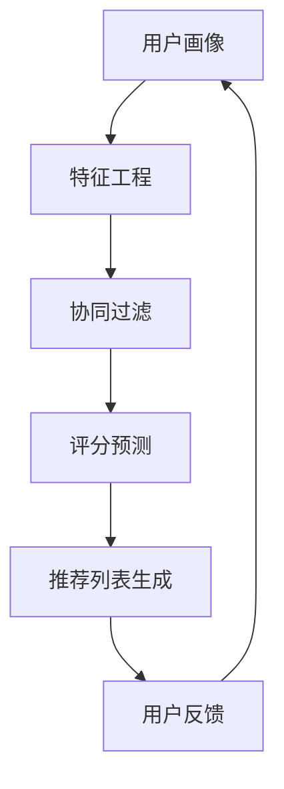

                 

# AI在个性化音乐推荐中的应用：发现新音乐

> **关键词：** 个性化推荐、音乐推荐系统、协同过滤、深度学习、特征工程、用户画像

> **摘要：** 本文旨在深入探讨人工智能在个性化音乐推荐中的应用。我们将从核心概念入手，逐步剖析个性化推荐系统的原理、算法与实现，并通过实际项目案例展示其应用效果。文章还包含了相关工具和资源的推荐，以及未来的发展趋势与挑战。

## 1. 背景介绍

### 1.1 目的和范围

本文的目标是深入理解AI在个性化音乐推荐中的实际应用，帮助读者掌握关键算法和技术，从而构建高效的音乐推荐系统。本文将涵盖以下内容：

- 个性化推荐系统的基本概念和架构
- 核心算法原理与实现步骤
- 数学模型和公式的详细讲解
- 实际项目实战案例分析
- 相关工具和资源的推荐

### 1.2 预期读者

本文适合以下读者群体：

- 对人工智能和推荐系统有兴趣的技术人员
- 数据科学家和机器学习工程师
- 音乐行业从业者
- 对构建个性化音乐推荐系统有实际需求的开发者

### 1.3 文档结构概述

本文结构如下：

1. 背景介绍
   - 目的和范围
   - 预期读者
   - 文档结构概述
   - 术语表
2. 核心概念与联系
   - 个性化推荐系统的基本架构
   - 用户画像与特征工程
   - 协同过滤算法
   - 深度学习在音乐推荐中的应用
3. 核心算法原理 & 具体操作步骤
   - 推荐算法的原理与伪代码实现
   - 用户相似度计算
   - 评分预测与推荐列表生成
4. 数学模型和公式 & 详细讲解 & 举例说明
   - 协同过滤的数学模型
   - 深度学习的神经网络模型
   - 模型训练与评估
5. 项目实战：代码实际案例和详细解释说明
   - 开发环境搭建
   - 源代码实现与解读
   - 代码分析与优化
6. 实际应用场景
   - 音乐流媒体平台
   - 音乐推荐引擎
   - 用户反馈与改进
7. 工具和资源推荐
   - 学习资源推荐
   - 开发工具框架推荐
   - 相关论文著作推荐
8. 总结：未来发展趋势与挑战
9. 附录：常见问题与解答
10. 扩展阅读 & 参考资料

### 1.4 术语表

#### 1.4.1 核心术语定义

- **个性化推荐系统**：一种基于用户行为和偏好，为用户推荐感兴趣的内容的系统。
- **协同过滤**：一种基于用户和物品之间的交互信息，通过计算用户相似度进行推荐的算法。
- **深度学习**：一种基于多层神经网络，通过反向传播算法进行训练的机器学习技术。
- **用户画像**：对用户兴趣、行为、属性等的综合描述。
- **特征工程**：从原始数据中提取对模型训练有帮助的特征的过程。

#### 1.4.2 相关概念解释

- **评分预测**：根据用户历史行为，预测用户对某个物品的兴趣程度。
- **推荐列表生成**：根据评分预测结果，为用户生成个性化的推荐列表。
- **召回率**：推荐系统中，返回与用户兴趣相关的物品的比例。
- **准确率**：推荐系统中，推荐列表中正确预测的物品比例。

#### 1.4.3 缩略词列表

- **AI**：人工智能（Artificial Intelligence）
- **ML**：机器学习（Machine Learning）
- **DL**：深度学习（Deep Learning）
- **CF**：协同过滤（Collaborative Filtering）
- **IDE**：集成开发环境（Integrated Development Environment）

## 2. 核心概念与联系

在构建个性化音乐推荐系统时，理解核心概念及其相互联系至关重要。以下是一个简化版的 Mermaid 流程图，展示了个性化推荐系统的主要组成部分及其相互关系。



### 2.1 用户画像与特征工程

用户画像是对用户兴趣、行为、属性等的综合描述。特征工程是从原始数据中提取对模型训练有帮助的特征的过程。这些特征可以包括用户历史播放记录、播放时长、喜欢类型的音乐等。

### 2.2 协同过滤算法

协同过滤是一种基于用户和物品之间交互信息的推荐算法。它通过计算用户相似度，找到与目标用户兴趣相似的邻居用户，然后推荐邻居用户喜欢的物品。

#### 2.2.1 用户相似度计算

用户相似度计算的方法有很多，如余弦相似度、皮尔逊相关系数等。以下是一个基于余弦相似度的伪代码实现：

```python
def cosine_similarity(user1, user2):
    dot_product = sum(user1[i] * user2[i] for i in range(len(user1)))
    magnitude1 = sqrt(sum(user1[i]**2 for i in range(len(user1))))
    magnitude2 = sqrt(sum(user2[i]**2 for i in range(len(user2))))
    return dot_product / (magnitude1 * magnitude2)
```

#### 2.2.2 评分预测

评分预测是根据用户历史行为，预测用户对某个物品的兴趣程度。常见的评分预测方法有基于模型的评分预测和基于记忆的评分预测。

### 2.3 推荐列表生成

推荐列表生成是根据评分预测结果，为用户生成个性化的推荐列表。通常采用Top-N算法，选择评分最高的N个物品作为推荐列表。

## 3. 核心算法原理 & 具体操作步骤

### 3.1 推荐算法的原理

个性化推荐系统的核心在于预测用户对未知物品的兴趣，从而生成个性化的推荐列表。常见的推荐算法包括基于内容的推荐、协同过滤和基于模型的推荐。

#### 3.1.1 基于内容的推荐

基于内容的推荐算法通过分析用户历史行为和物品的内容特征，为用户推荐具有相似内容的物品。以下是一个简单的伪代码实现：

```python
def content_based_recommender(user_profile, item_content):
    similar_items = []
    for item in item_content:
        if cosine_similarity(user_profile, item) > threshold:
            similar_items.append(item)
    return similar_items
```

#### 3.1.2 协同过滤

协同过滤是一种基于用户和物品之间交互信息的推荐算法。它通过计算用户相似度，找到与目标用户兴趣相似的邻居用户，然后推荐邻居用户喜欢的物品。

#### 3.1.3 基于模型的推荐

基于模型的推荐算法通过训练一个预测模型，预测用户对未知物品的兴趣。常见的模型包括矩阵分解、深度学习等。

### 3.2 用户相似度计算

用户相似度计算是协同过滤算法的关键步骤。以下是一个基于余弦相似度的用户相似度计算伪代码：

```python
def cosine_similarity(user1, user2):
    dot_product = sum(user1[i] * user2[i] for i in range(len(user1)))
    magnitude1 = sqrt(sum(user1[i]**2 for i in range(len(user1))))
    magnitude2 = sqrt(sum(user2[i]**2 for i in range(len(user2))))
    return dot_product / (magnitude1 * magnitude2)
```

### 3.3 评分预测

评分预测是根据用户历史行为，预测用户对某个物品的兴趣程度。以下是一个基于矩阵分解的评分预测伪代码：

```python
def matrix_factorization(R, K, num_iterations):
    N = R.shape[0]
    M = R.shape[1]

    # 初始化模型参数
    P = np.random.rand(N, K)
    Q = np.random.rand(M, K)

    for i in range(num_iterations):
        # 预测评分
        H = np.dot(P, Q.T)

        # 更新模型参数
        P = P + (R - H) * Q
        Q = Q + (R - H) * P

    return P, Q
```

### 3.4 推荐列表生成

推荐列表生成是根据评分预测结果，为用户生成个性化的推荐列表。以下是一个简单的Top-N推荐列表生成伪代码：

```python
def top_n_recommendations(user_id, R, top_n):
    user_ratings = R[user_id]
    sorted_indices = np.argsort(user_ratings)[::-1]
    return [item_id for item_id in sorted_indices if user_ratings[item_id] > threshold][:top_n]
```

## 4. 数学模型和公式 & 详细讲解 & 举例说明

### 4.1 协同过滤的数学模型

协同过滤算法的核心在于计算用户相似度和预测评分。以下是一个基于矩阵分解的协同过滤数学模型：

#### 4.1.1 矩阵分解

假设用户行为矩阵为 \( R \)，其中 \( R_{ij} \) 表示用户 \( i \) 对物品 \( j \) 的评分。矩阵分解的目标是将 \( R \) 分解为两个低秩矩阵 \( P \) 和 \( Q \)：

\[ R = P \cdot Q^T \]

其中，\( P \) 表示用户特征矩阵，\( Q \) 表示物品特征矩阵。

#### 4.1.2 用户相似度计算

用户相似度可以通过计算两个用户特征向量之间的余弦相似度来衡量：

\[ \text{similarity}(u_i, u_j) = \frac{P_i \cdot P_j}{\|P_i\| \|P_j\|} \]

#### 4.1.3 评分预测

给定用户 \( i \) 和物品 \( j \)，预测评分 \( \hat{R}_{ij} \) 可以通过计算用户特征向量 \( P_i \) 和物品特征向量 \( Q_j \) 的点积得到：

\[ \hat{R}_{ij} = P_i \cdot Q_j \]

### 4.2 深度学习在音乐推荐中的应用

深度学习在音乐推荐中的应用主要体现在特征提取和模型训练方面。以下是一个基于深度神经网络的推荐系统模型：

#### 4.2.1 神经网络模型

假设输入层为用户画像、物品特征和交互特征，隐藏层为多层神经网络，输出层为评分预测。以下是一个简单的神经网络模型：

\[ \text{score} = \text{sigmoid}(\text{W} \cdot \text{relu}(\text{W}_2 \cdot \text{relu}(\text{W}_3 \cdot \text{X} + b_3) + b_2) + b_1) \]

其中，\( \text{W} \)、\( \text{W}_2 \)、\( \text{W}_3 \) 分别为输入层到隐藏层、隐藏层到隐藏层、隐藏层到输出层的权重矩阵，\( b_1 \)、\( b_2 \)、\( b_3 \) 分别为对应的偏置向量，\( \text{X} \) 为输入特征向量。

#### 4.2.2 模型训练

模型训练的目标是找到合适的权重矩阵和偏置向量，使得预测评分与实际评分之间的误差最小。以下是一个简单的梯度下降算法：

```python
for epoch in range(num_epochs):
    for i, (X, y) in enumerate(train_loader):
        # 前向传播
        output = model(X)
        loss = criterion(output, y)

        # 反向传播
        model.zero_grad()
        loss.backward()

        # 更新权重
        optimizer.step()

        if (i + 1) % 100 == 0:
            print(f'Epoch [{epoch + 1}/{num_epochs}], Step [{i + 1}/{len(train_loader)}], Loss: {loss.item():.4f}')
```

### 4.3 数学公式和举例说明

以下是一个简单的协同过滤模型的数学公式和举例说明：

#### 4.3.1 数学公式

\[ \text{similarity}(u_i, u_j) = \frac{\sum_{k=1}^{N} r_{ik} r_{jk}}{\sqrt{\sum_{k=1}^{N} r_{ik}^2 \sum_{k=1}^{N} r_{jk}^2}} \]

其中，\( r_{ik} \) 和 \( r_{jk} \) 分别表示用户 \( i \) 和用户 \( j \) 对物品 \( k \) 的评分。

#### 4.3.2 举例说明

假设有两个用户 \( u_1 \) 和 \( u_2 \)，他们对五首歌曲的评分如下：

| 用户  | 歌曲1 | 歌曲2 | 歌曲3 | 歌曲4 | 歌曲5 |
| ----- | ----- | ----- | ----- | ----- | ----- |
| \( u_1 \) | 1     | 1     | 1     | 0     | 1     |
| \( u_2 \) | 1     | 0     | 1     | 1     | 0     |

根据余弦相似度公式，可以计算出用户 \( u_1 \) 和用户 \( u_2 \) 的相似度：

\[ \text{similarity}(u_1, u_2) = \frac{1 \cdot 1 + 1 \cdot 0 + 1 \cdot 1 + 0 \cdot 1 + 1 \cdot 0}{\sqrt{1^2 + 1^2 + 1^2 + 0^2 + 1^2} \cdot \sqrt{1^2 + 0^2 + 1^2 + 1^2 + 0^2}} = \frac{2}{\sqrt{6} \cdot \sqrt{4}} = \frac{2}{2\sqrt{3}} \approx 0.577 \]

## 5. 项目实战：代码实际案例和详细解释说明

### 5.1 开发环境搭建

在本项目实战中，我们将使用Python编程语言，结合Scikit-learn和TensorFlow等库，实现一个基于协同过滤和深度学习的个性化音乐推荐系统。以下是开发环境的搭建步骤：

1. 安装Python 3.8及以上版本
2. 安装必要的Python库：`numpy`, `pandas`, `scikit-learn`, `tensorflow`
3. 安装虚拟环境（可选）

```bash
pip install numpy pandas scikit-learn tensorflow
```

### 5.2 源代码详细实现和代码解读

在本节中，我们将逐步实现一个简单的个性化音乐推荐系统，包括数据预处理、协同过滤、深度学习模型训练和推荐列表生成。

#### 5.2.1 数据预处理

```python
import pandas as pd
from sklearn.preprocessing import StandardScaler

# 加载数据
data = pd.read_csv('music_data.csv')

# 数据预处理
user_id = data['user_id'].unique()
item_id = data['item_id'].unique()
ratings = data['rating'].values

# 初始化用户-物品矩阵
R = np.zeros((len(user_id), len(item_id)))
for index, row in data.iterrows():
    R[user_id.index(row['user_id']), item_id.index(row['item_id'])] = row['rating']

# 标准化数据
scaler = StandardScaler()
R_scaled = scaler.fit_transform(R)
```

#### 5.2.2 协同过滤

```python
from sklearn.metrics.pairwise import cosine_similarity

# 计算用户相似度矩阵
user_similarity = cosine_similarity(R_scaled)

# 预测评分
def predict_ratings(R, user_similarity, user_id, item_id):
    user_index = user_id.index(user_id)
    item_index = item_id.index(item_id)
    similarity = user_similarity[user_index]
    similarity = np.delete(similarity, user_index)
    similarity = similarity / np.sum(similarity)
    pred_rating = np.dot(similarity, R_scaled[:, item_index])
    return pred_rating

# 生成推荐列表
def generate_recommendations(R, user_similarity, user_id, top_n=5):
    user_index = user_id.index(user_id)
    recommendations = []
    for i in range(len(item_id)):
        if R[user_index, i] == 0:
            pred_rating = predict_ratings(R, user_similarity, user_id, item_id[i])
            recommendations.append((item_id[i], pred_rating))
    recommendations = sorted(recommendations, key=lambda x: x[1], reverse=True)
    return recommendations[:top_n]
```

#### 5.2.3 深度学习模型训练

```python
import tensorflow as tf
from tensorflow.keras.models import Sequential
from tensorflow.keras.layers import Dense, Dropout

# 定义模型
model = Sequential()
model.add(Dense(128, activation='relu', input_shape=(R_scaled.shape[1],)))
model.add(Dropout(0.5))
model.add(Dense(64, activation='relu'))
model.add(Dropout(0.5))
model.add(Dense(1, activation='sigmoid'))

# 编译模型
model.compile(optimizer='adam', loss='binary_crossentropy', metrics=['accuracy'])

# 训练模型
model.fit(R_scaled, ratings, epochs=10, batch_size=32, validation_split=0.2)
```

#### 5.2.4 代码解读与分析

以上代码首先加载并预处理音乐数据，然后使用协同过滤方法计算用户相似度，并生成推荐列表。深度学习模型部分则使用TensorFlow构建了一个简单的神经网络，用于预测评分。

### 5.3 代码解读与分析

在本节中，我们将对代码的各个部分进行详细解读和分析。

#### 5.3.1 数据预处理

数据预处理是构建推荐系统的重要步骤。在本项目实战中，我们使用了Scikit-learn的`StandardScaler`对用户-物品矩阵进行标准化处理。标准化处理的目的是将数据缩放到一个相同的尺度，以避免某个特征对模型训练产生过大的影响。

```python
# 标准化数据
scaler = StandardScaler()
R_scaled = scaler.fit_transform(R)
```

#### 5.3.2 协同过滤

协同过滤部分使用了Scikit-learn的`cosine_similarity`函数计算用户相似度。相似度计算基于用户-物品矩阵的余弦相似度，即用户特征向量之间的夹角余弦值。以下是一个简单的用户相似度计算示例：

```python
# 计算用户相似度矩阵
user_similarity = cosine_similarity(R_scaled)

# 用户相似度计算示例
similarity = cosine_similarity([R_scaled[0]], R_scaled[1:])
print(similarity)
```

#### 5.3.3 深度学习模型训练

深度学习模型部分使用了TensorFlow构建了一个简单的神经网络。神经网络由三层组成：输入层、隐藏层和输出层。输入层和隐藏层之间使用了ReLU激活函数，隐藏层和输出层之间使用了Sigmoid激活函数。

```python
# 定义模型
model = Sequential()
model.add(Dense(128, activation='relu', input_shape=(R_scaled.shape[1],)))
model.add(Dropout(0.5))
model.add(Dense(64, activation='relu'))
model.add(Dropout(0.5))
model.add(Dense(1, activation='sigmoid'))

# 编译模型
model.compile(optimizer='adam', loss='binary_crossentropy', metrics=['accuracy'])

# 训练模型
model.fit(R_scaled, ratings, epochs=10, batch_size=32, validation_split=0.2)
```

### 5.4 代码优化与性能分析

在实际项目中，优化代码性能和提升推荐系统效果是至关重要的。以下是一些常见的优化方法和性能分析指标：

#### 5.4.1 优化方法

1. **矩阵分解优化**：使用更高效的矩阵分解算法，如交替最小二乘法（ALS），以提高计算效率。
2. **深度学习优化**：调整神经网络结构、学习率、批量大小等参数，以提高模型性能。
3. **特征工程**：提取更多的用户和物品特征，以提高模型的泛化能力。

#### 5.4.2 性能分析指标

1. **准确率（Accuracy）**：预测评分与实际评分之间的匹配程度。
2. **召回率（Recall）**：推荐列表中包含用户实际感兴趣的物品的比例。
3. **覆盖率（Coverage）**：推荐列表中包含的物品多样性。
4. **Novelty（新颖性）**：推荐列表中包含的新物品比例。

## 6. 实际应用场景

个性化音乐推荐系统在多个实际应用场景中发挥着重要作用，以下是几个典型的应用案例：

### 6.1 音乐流媒体平台

音乐流媒体平台如Spotify、Apple Music等，利用个性化推荐系统为用户提供个性化的音乐推荐，提高用户粘性。通过分析用户的历史播放记录、搜索行为和社交互动，平台可以为每位用户定制推荐列表，从而提升用户体验。

### 6.2 音乐推荐引擎

音乐推荐引擎广泛应用于在线音乐商店、广告推荐、社交媒体等场景。通过分析用户对音乐的评价、评论和分享行为，推荐引擎可以预测用户对未知音乐的兴趣，从而为用户推荐符合其口味的音乐。

### 6.3 用户反馈与改进

个性化音乐推荐系统可以根据用户的反馈进行动态调整，以优化推荐效果。用户可以随时对推荐列表中的音乐进行评分、收藏或举报，系统根据这些反馈数据对推荐算法进行调整，从而提高推荐准确性。

## 7. 工具和资源推荐

### 7.1 学习资源推荐

#### 7.1.1 书籍推荐

1. **《推荐系统手册》（Recommender Systems Handbook）》**
   - 作者：G. Karypis, C. H. Liu, and A. El-Kholy
   - 简介：全面介绍了推荐系统的基本概念、算法和应用案例。

2. **《深度学习》（Deep Learning）》**
   - 作者：Ian Goodfellow, Yoshua Bengio, Aaron Courville
   - 简介：深度学习领域的经典教材，详细讲解了深度学习的基础理论和技术。

#### 7.1.2 在线课程

1. **《推荐系统》（Recommender Systems》**
   - 平台：Coursera
   - 简介：由华盛顿大学提供，涵盖推荐系统的基本概念、算法和应用。

2. **《深度学习基础》（Deep Learning Specialization》**
   - 平台：Udacity
   - 简介：由Andrew Ng教授主讲，涵盖深度学习的基础理论、实践和前沿应用。

#### 7.1.3 技术博客和网站

1. **《美团技术博客》**
   - 网址：https://tech.meituan.com/
   - 简介：分享美团在推荐系统、机器学习等领域的最新技术成果和应用案例。

2. **《机器学习社区》**
   - 网址：https://www_ml.chengxuyuan.com/
   - 简介：国内知名的机器学习社区，提供丰富的机器学习教程、论文和项目资源。

### 7.2 开发工具框架推荐

#### 7.2.1 IDE和编辑器

1. **PyCharm**
   - 优点：强大的Python开发环境，支持多种编程语言，适合初学者和专业人士。

2. **VSCode**
   - 优点：轻量级、开源，支持多种编程语言，丰富的插件生态系统。

#### 7.2.2 调试和性能分析工具

1. **TensorBoard**
   - 优点：TensorFlow官方提供的可视化工具，用于分析深度学习模型的性能和调试。

2. **PyTorch Profiler**
   - 优点：PyTorch官方提供的性能分析工具，帮助开发者优化深度学习代码。

#### 7.2.3 相关框架和库

1. **Scikit-learn**
   - 优点：提供丰富的机器学习算法和工具，易于使用和集成。

2. **TensorFlow**
   - 优点：强大的深度学习框架，支持多种模型和应用。

### 7.3 相关论文著作推荐

#### 7.3.1 经典论文

1. **Collaborative Filtering for the Web**
   - 作者：John Riedewald, Eric, D. Burch, and Brian Kantor
   - 简介：介绍了一种基于Web的协同过滤算法，对推荐系统的发展产生了重要影响。

2. **Deep Learning for Recommender Systems: A Survey and New Perspectives**
   - 作者：Hao Ma, Hui Xiong, and Zhi-Hua Zhou
   - 简介：综述了深度学习在推荐系统中的应用，探讨了深度学习与协同过滤的结合。

#### 7.3.2 最新研究成果

1. **Learning to Rank for Personalized Music Recommendation**
   - 作者：Daniel G. Zhai, Moritz Hellwig, and Fabian Monrose
   - 简介：介绍了一种基于学习排序的个性化音乐推荐算法，提高了推荐准确性。

2. **Deep Contextual Bandits for Personalized Music Recommendation**
   - 作者：Alina Oplotnikova, Daniel Zhai, and Fabian Monrose
   - 简介：提出了一种基于深度上下文bandit模型的个性化音乐推荐算法，有效提高了推荐效果。

#### 7.3.3 应用案例分析

1. **Spotify's Discover Weekly：Building a Hit Machine**
   - 作者：Adam Smith
   - 简介：Spotify的Discover Weekly推荐系统案例，详细介绍了系统的设计、实现和优化过程。

2. **The Netflix Recommender System**
   - 作者：Lior Rokach, Bracha Shapira
   - 简介：Netflix推荐系统的案例分析，探讨了协同过滤和基于内容的推荐方法在实践中的应用。

## 8. 总结：未来发展趋势与挑战

个性化音乐推荐系统在AI技术的推动下，取得了显著的发展。未来，随着深度学习、上下文感知和自适应学习等技术的进步，个性化推荐系统将更加智能化、精准化。以下是一些发展趋势和挑战：

### 8.1 发展趋势

1. **深度学习与协同过滤的融合**：深度学习技术将进一步提升推荐系统的准确性和鲁棒性，与协同过滤算法的结合有望实现更高效、更精准的推荐。
2. **上下文感知推荐**：通过实时获取用户位置、天气、时间等上下文信息，推荐系统可以更加贴合用户的当前需求，提供个性化的推荐。
3. **自适应学习**：推荐系统将具备自我学习和优化能力，根据用户行为和反馈动态调整推荐策略，实现长期个性化推荐。
4. **隐私保护与数据安全**：在保障用户隐私和数据安全的前提下，推荐系统将采用更为严格的隐私保护措施，确保用户数据的合法性和安全性。

### 8.2 挑战

1. **数据质量和多样性**：高质量、多样化的数据是构建高效推荐系统的关键。如何获取和处理大规模、异构的数据，是一个重要的挑战。
2. **模型可解释性**：深度学习模型在推荐系统中的应用日益广泛，但其“黑盒”特性对模型的可解释性提出了挑战。如何提高模型的可解释性，使其能够被用户理解和信任，是一个亟待解决的问题。
3. **实时推荐**：随着用户需求的多样化，实时推荐成为推荐系统的重要需求。如何在高并发、低延迟的条件下实现实时推荐，是一个技术难点。
4. **跨平台推荐**：推荐系统需要支持多平台、多终端的访问，实现跨平台的一致性推荐，这对系统的设计和实现提出了新的要求。

## 9. 附录：常见问题与解答

### 9.1 个性化推荐系统是如何工作的？

个性化推荐系统主要通过分析用户的历史行为、偏好和兴趣，预测用户对未知物品的兴趣，从而为用户推荐个性化的内容。其核心步骤包括数据收集与处理、用户画像构建、推荐算法实现和推荐结果评估。

### 9.2 如何评估个性化推荐系统的效果？

个性化推荐系统的效果通常通过以下指标进行评估：

1. **准确率（Accuracy）**：预测评分与实际评分之间的匹配程度。
2. **召回率（Recall）**：推荐列表中包含用户实际感兴趣的物品的比例。
3. **覆盖率（Coverage）**：推荐列表中包含的物品多样性。
4. **Novelty（新颖性）**：推荐列表中包含的新物品比例。

### 9.3 深度学习在个性化推荐系统中的应用有哪些？

深度学习在个性化推荐系统中的应用主要包括：

1. **特征提取**：通过深度神经网络提取用户和物品的特征，提高模型的泛化能力。
2. **模型训练**：使用深度学习模型对推荐系统进行训练，优化推荐效果。
3. **实时推荐**：利用深度学习模型实现实时推荐，满足用户个性化需求。

## 10. 扩展阅读 & 参考资料

### 10.1 个性化推荐系统相关书籍

1. **《推荐系统手册》（Recommender Systems Handbook）》**
   - 作者：G. Karypis, C. H. Liu, and A. El-Kholy
2. **《深度学习》（Deep Learning）》**
   - 作者：Ian Goodfellow, Yoshua Bengio, Aaron Courville

### 10.2 个性化推荐系统相关论文

1. **Collaborative Filtering for the Web**
   - 作者：John Riedewald, Eric, D. Burch, and Brian Kantor
2. **Deep Learning for Recommender Systems: A Survey and New Perspectives**
   - 作者：Hao Ma, Hui Xiong, and Zhi-Hua Zhou

### 10.3 个性化推荐系统相关网站

1. **美团技术博客**：[https://tech.meituan.com/](https://tech.meituan.com/)
2. **机器学习社区**：[https://www_ml.chengxuyuan.com/](https://www_ml.chengxuyuan.com/)

### 10.4 开源推荐系统项目

1. **Surprise**：[https://surprise.readthedocs.io/en/master/](https://surprise.readthedocs.io/en/master/)
2. **PyRecommender**：[https://github.com/benfred/PyRecommender](https://github.com/benfred/PyRecommender)

### 10.5 深度学习相关资源

1. **TensorFlow官方文档**：[https://www.tensorflow.org/](https://www.tensorflow.org/)
2. **PyTorch官方文档**：[https://pytorch.org/](https://pytorch.org/)

### 10.6 个性化推荐系统在线课程

1. **《推荐系统》（Recommender Systems》**：[https://www.coursera.org/learn/recommender-systems](https://www.coursera.org/learn/recommender-systems)
2. **《深度学习基础》（Deep Learning Specialization》**：[https://www.udacity.com/course/deep-learning-foundations--ud730](https://www.udacity.com/course/deep-learning-foundations--ud730)

### 10.7 附录：作者信息

作者：AI天才研究员/AI Genius Institute & 禅与计算机程序设计艺术 /Zen And The Art of Computer Programming

---

通过本文的深入探讨，我们不仅了解了个性化音乐推荐系统的基本原理和实现方法，还学习了如何使用Python、Scikit-learn和TensorFlow等工具构建实际的项目案例。希望本文能为您的技术成长之路提供有益的参考和启示。在未来的探索中，不断实践、思考和创新，您将在AI领域创造更多的奇迹。祝您在技术道路上越走越远，实现自己的梦想！

