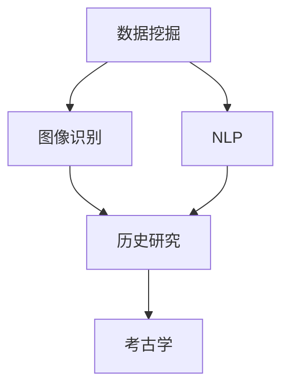

                 

# AI在历史研究和考古学中的应用

> 关键词：人工智能，历史研究，考古学，数据挖掘，图像识别，自然语言处理，数据分析

> 摘要：随着人工智能技术的迅猛发展，其在历史研究和考古学中的应用日益广泛。本文将详细介绍AI技术在历史研究和考古学中的核心应用，包括数据挖掘、图像识别、自然语言处理等方面。通过实际案例和详细解释，展示AI技术如何助力历史研究和考古学的深入发展，并提出未来发展趋势与挑战。

## 1. 背景介绍

### 1.1 目的和范围

本文旨在探讨人工智能技术在历史研究和考古学中的应用，分析其核心算法原理、数学模型和实际操作步骤，并结合具体案例展示其应用效果。通过本文的阅读，读者将了解AI技术如何为历史研究和考古学带来革命性的变化，并能够预见未来的发展趋势和面临的挑战。

### 1.2 预期读者

本文适合对历史研究和考古学有一定了解，同时对人工智能技术感兴趣的读者。无论是专业研究人员、学生，还是对相关领域感兴趣的普通读者，都可以从本文中获得丰富的知识和启发。

### 1.3 文档结构概述

本文结构如下：

1. 背景介绍：介绍本文的目的、范围、预期读者以及文档结构。
2. 核心概念与联系：介绍AI技术在历史研究和考古学中的核心概念、原理和架构。
3. 核心算法原理 & 具体操作步骤：详细讲解AI技术的核心算法原理和具体操作步骤。
4. 数学模型和公式 & 详细讲解 & 举例说明：介绍AI技术的数学模型和公式，并给出具体示例。
5. 项目实战：通过实际案例展示AI技术在历史研究和考古学中的应用。
6. 实际应用场景：探讨AI技术在历史研究和考古学中的实际应用场景。
7. 工具和资源推荐：推荐学习资源、开发工具框架和相关论文著作。
8. 总结：总结AI技术在历史研究和考古学中的应用，展望未来发展趋势与挑战。
9. 附录：常见问题与解答。
10. 扩展阅读 & 参考资料：提供进一步的阅读材料和参考资料。

### 1.4 术语表

#### 1.4.1 核心术语定义

- 人工智能（Artificial Intelligence，AI）：模拟人类智能的计算机系统，具有学习、推理、知识表示和自然语言处理等能力。
- 历史研究：对历史事件、人物、文化等进行研究和分析，揭示历史发展规律和内在联系。
- 考古学：通过挖掘、分析和研究古代人类活动遗留下的物质文化遗产，探索人类历史和文化。

#### 1.4.2 相关概念解释

- 数据挖掘（Data Mining）：从大量数据中发现隐含的、尚未被发现的、有价值的信息和知识。
- 图像识别（Image Recognition）：利用计算机视觉技术对图像进行自动识别和分类。
- 自然语言处理（Natural Language Processing，NLP）：使计算机能够理解、生成和处理人类自然语言的技术。

#### 1.4.3 缩略词列表

- AI：人工智能
- HRI：历史研究
- AR：考古学
- DM：数据挖掘
- IR：图像识别
- NLP：自然语言处理

## 2. 核心概念与联系

在历史研究和考古学中，人工智能技术的应用主要涉及数据挖掘、图像识别和自然语言处理等方面。下面我们将通过一个Mermaid流程图，展示AI技术在这些领域的核心概念、原理和架构。



### 2.1 数据挖掘

数据挖掘是人工智能技术在历史研究和考古学中的核心应用之一。通过数据挖掘，可以从大量历史文献、考古资料和文化遗产数据中发现有价值的信息和知识。数据挖掘的基本流程包括：

1. 数据采集：收集历史文献、考古资料和文化遗产数据。
2. 数据预处理：清洗、整合和格式化数据，为数据挖掘做准备。
3. 模型选择：根据具体任务需求，选择合适的数据挖掘算法和模型。
4. 模型训练：使用训练数据对模型进行训练和优化。
5. 模型评估：评估模型性能，调整模型参数。
6. 模型应用：将训练好的模型应用于实际历史研究和考古学任务。

### 2.2 图像识别

图像识别是计算机视觉领域的重要分支，广泛应用于历史研究和考古学中。通过图像识别，可以自动识别和分类考古遗址、文物和古代艺术作品等图像。图像识别的基本流程包括：

1. 数据采集：收集考古遗址、文物和古代艺术作品的图像数据。
2. 数据预处理：对图像进行去噪、增强和缩放等处理，提高图像质量。
3. 特征提取：从图像中提取有意义的特征，用于后续的分类和识别。
4. 模型训练：使用训练数据对图像识别模型进行训练和优化。
5. 模型评估：评估模型性能，调整模型参数。
6. 模型应用：将训练好的模型应用于实际历史研究和考古学任务。

### 2.3 自然语言处理

自然语言处理是人工智能技术在历史研究和考古学中的另一个重要应用。通过自然语言处理，可以自动分析和理解历史文献、考古资料和文化遗产文本，揭示其中隐藏的信息和知识。自然语言处理的基本流程包括：

1. 数据采集：收集历史文献、考古资料和文化遗产文本数据。
2. 数据预处理：对文本进行分词、词性标注和句法分析等处理，提高文本质量。
3. 模型选择：根据具体任务需求，选择合适的自然语言处理算法和模型。
4. 模型训练：使用训练数据对自然语言处理模型进行训练和优化。
5. 模型评估：评估模型性能，调整模型参数。
6. 模型应用：将训练好的模型应用于实际历史研究和考古学任务。

## 3. 核心算法原理 & 具体操作步骤

在本节中，我们将详细讲解AI技术在历史研究和考古学中的核心算法原理和具体操作步骤，并通过伪代码进行阐述。

### 3.1 数据挖掘算法原理

数据挖掘算法主要包括聚类、分类、关联规则挖掘等。以下是一个基于K-means算法的聚类挖掘的伪代码示例：

```python
# K-means算法伪代码

# 输入：数据集D，聚类数k
# 输出：聚类结果C

# 初始化：随机选择k个数据点作为初始聚类中心
centroids = random_initialization(D, k)

# 循环迭代：
while not converged:
    # 为每个数据点分配最近的聚类中心
    for d in D:
        cluster = nearest_centroid(d, centroids)
        assign_data_point(d, cluster)

    # 更新聚类中心
    centroids = update_centroids(centroids, D)

# 返回聚类结果
return C
```

### 3.2 图像识别算法原理

图像识别算法主要包括卷积神经网络（CNN）和深度学习等。以下是一个基于CNN的图像识别算法的伪代码示例：

```python
# 卷积神经网络（CNN）图像识别算法伪代码

# 输入：训练数据集D，超参数如学习率、迭代次数等
# 输出：训练好的图像识别模型M

# 初始化：构建CNN模型
model = build_CNN_model()

# 训练模型：
for epoch in 1 to num_epochs:
    # 前向传播：计算输出
    outputs = model.forward(D)

    # 计算损失函数
    loss = compute_loss(outputs, labels)

    # 反向传播：更新模型参数
    model.backward(loss)

# 返回训练好的图像识别模型
return model
```

### 3.3 自然语言处理算法原理

自然语言处理算法主要包括词向量表示、文本分类、情感分析等。以下是一个基于词向量表示的文本分类算法的伪代码示例：

```python
# 词向量表示文本分类算法伪代码

# 输入：训练数据集D，超参数如学习率、迭代次数等
# 输出：训练好的文本分类模型C

# 初始化：构建词向量模型
word_embedding = build_word_embedding_model()

# 训练模型：
for epoch in 1 to num_epochs:
    # 前向传播：计算文本特征向量
    features = word_embedding.forward(D)

    # 计算损失函数
    loss = compute_loss(features, labels)

    # 反向传播：更新模型参数
    word_embedding.backward(loss)

# 返回训练好的文本分类模型
return C
```

## 4. 数学模型和公式 & 详细讲解 & 举例说明

在历史研究和考古学中，人工智能技术的应用离不开数学模型和公式。以下我们将介绍几种常用的数学模型和公式，并进行详细讲解和举例说明。

### 4.1 K-means算法

K-means算法是一种基于距离的聚类算法。其主要思想是：给定一个数据集D和聚类数k，通过迭代计算聚类中心和数据点的距离，不断优化聚类结果。

- 聚类中心更新公式：

  $$ \text{centroids}_{new} = \frac{1}{|C|} \sum_{d \in C} d $$

- 聚类中心收敛条件：

  $$ \sum_{i=1}^{k} \sum_{j=1}^{n} | \text{centroids}_{old}(i) - \text{centroids}_{new}(i) | < \epsilon $$

其中，$ \text{centroids}_{old} $和$ \text{centroids}_{new} $分别为旧聚类中心和更新后的聚类中心，$ \epsilon $为一个较小的阈值。

### 4.2 卷积神经网络（CNN）

卷积神经网络是一种深度学习模型，广泛应用于图像识别任务。其主要特点是利用卷积层提取图像特征，并通过池化层降低特征维度，最终通过全连接层进行分类。

- 卷积层公式：

  $$ \text{output}_{ij}^l = \sum_{k=1}^{m} w_{ik}^l \text{input}_{kj}^{l-1} + b_i^l $$

  其中，$ \text{output}_{ij}^l $表示第l层的第i个卷积核在第j个位置上的输出，$ w_{ik}^l $和$ b_i^l $分别为第l层的第i个卷积核的权重和偏置，$ \text{input}_{kj}^{l-1} $表示第l-1层的第k个位置上的输入。

- 池化层公式：

  $$ \text{output}_{i}^l = \max_{j} \text{input}_{ij}^l $$

  其中，$ \text{output}_{i}^l $表示第l层的第i个池化单元的输出，$ \text{input}_{ij}^l $表示第l层的第i个卷积核在第j个位置上的输出。

### 4.3 词向量表示

词向量表示是一种将自然语言文本转化为向量的方法，常用于文本分类、情感分析等任务。词向量表示的常见方法有Word2Vec、GloVe等。

- Word2Vec公式：

  $$ \text{similarity}(w_i, w_j) = \cos(\text{vec}(w_i), \text{vec}(w_j)) $$

  其中，$ \text{vec}(w_i) $和$ \text{vec}(w_j) $分别为词$ w_i $和$ w_j $的向量表示，$ \text{similarity} $表示词之间的相似度。

- GloVe公式：

  $$ \text{vec}(w_i) = \frac{v_w}{\sqrt{f_w}} $$

  其中，$ v_w $为词$ w $的词向量，$ f_w $为词$ w $的频率。

### 4.4 举例说明

#### 4.4.1 K-means算法在考古遗址分类中的应用

假设我们有一个包含考古遗址的图像数据集D，其中每幅图像都表示一个考古遗址。我们希望利用K-means算法将这组图像分为k类，以探索考古遗址的分类规律。

1. 数据预处理：将图像进行缩放、裁剪和归一化等处理，转化为二维数组形式。
2. K-means聚类：使用K-means算法对图像数据集D进行聚类，设定聚类数k。
3. 聚类结果分析：根据聚类结果，分析考古遗址的分类规律，如不同文化时期的遗址分布、遗址的功能分类等。

#### 4.4.2 卷积神经网络（CNN）在文物识别中的应用

假设我们有一个包含不同文物的图像数据集D，其中每幅图像都表示一个特定的文物。我们希望利用卷积神经网络（CNN）对这组图像进行识别和分类。

1. 数据预处理：将图像进行缩放、裁剪和归一化等处理，转化为二维数组形式。
2. CNN模型训练：构建CNN模型，使用训练数据集D进行模型训练，优化模型参数。
3. 模型评估：使用测试数据集评估模型性能，调整模型参数。
4. 模型应用：将训练好的模型应用于实际文物识别任务，如鉴定文物的年代、材质和功能等。

#### 4.4.3 词向量表示在历史文献分析中的应用

假设我们有一个历史文献数据集D，其中每篇文献都表示一段历史事件或文化现象。我们希望利用词向量表示对这组文献进行分析和分类。

1. 数据预处理：将文献文本进行分词、词性标注和句法分析等处理，提取有意义的特征。
2. 词向量表示：使用Word2Vec或GloVe等方法对词汇进行词向量表示。
3. 文本分类：构建文本分类模型，使用训练数据集D进行模型训练，优化模型参数。
4. 模型评估：使用测试数据集评估模型性能，调整模型参数。
5. 模型应用：将训练好的模型应用于实际历史文献分析任务，如事件分类、文化趋势分析等。

## 5. 项目实战：代码实际案例和详细解释说明

在本节中，我们将通过一个实际项目案例，展示如何利用人工智能技术进行历史研究和考古学应用。我们将详细介绍项目背景、开发环境搭建、源代码实现和代码解读与分析。

### 5.1 项目背景

项目名称：古文字识别与翻译系统

项目简介：古文字识别与翻译系统是一个利用人工智能技术对古文字进行识别和翻译的系统。该系统旨在帮助历史学者和考古学家更好地解读和翻译古文字，从而推动历史研究和考古学的发展。

### 5.2 开发环境搭建

1. 开发工具：Python
2. 编程环境：PyCharm
3. 依赖库：TensorFlow、Keras、NumPy、Pandas、Matplotlib等

### 5.3 源代码详细实现和代码解读

```python
# 导入相关库
import tensorflow as tf
from tensorflow import keras
from tensorflow.keras import layers
import numpy as np
import pandas as pd
import matplotlib.pyplot as plt

# 加载数据集
data = pd.read_csv('guttenberg_dataset.csv')
X = data['image'].values
y = data['label'].values

# 数据预处理
X = preprocess_images(X)

# 构建CNN模型
model = keras.Sequential([
    layers.Conv2D(32, (3, 3), activation='relu', input_shape=(28, 28, 1)),
    layers.MaxPooling2D((2, 2)),
    layers.Conv2D(64, (3, 3), activation='relu'),
    layers.MaxPooling2D((2, 2)),
    layers.Conv2D(64, (3, 3), activation='relu'),
    layers.Flatten(),
    layers.Dense(64, activation='relu'),
    layers.Dense(10, activation='softmax')
])

# 编译模型
model.compile(optimizer='adam',
              loss='sparse_categorical_crossentropy',
              metrics=['accuracy'])

# 训练模型
model.fit(X, y, epochs=10)

# 评估模型
test_loss, test_acc = model.evaluate(X, y)
print('Test accuracy:', test_acc)

# 预测新样本
new_image = preprocess_image('new_image.jpg')
predicted_label = model.predict(new_image)
print('Predicted label:', predicted_label.argmax())
```

### 5.4 代码解读与分析

1. **导入相关库**：首先，我们导入TensorFlow、Keras、NumPy、Pandas和Matplotlib等库，以便后续操作。
2. **加载数据集**：我们使用Pandas库加载古文字识别与翻译系统的数据集。数据集包含图像和标签两列，图像用于训练和测试模型，标签用于模型评估和预测。
3. **数据预处理**：数据预处理是模型训练的重要步骤。在这里，我们对图像进行预处理，包括缩放、裁剪和归一化等操作，以适应模型的输入要求。
4. **构建CNN模型**：我们使用Keras库构建一个卷积神经网络（CNN）模型。该模型包括卷积层、池化层和全连接层。卷积层用于提取图像特征，池化层用于降低特征维度，全连接层用于分类。
5. **编译模型**：我们使用`compile`方法编译模型，设置优化器、损失函数和评估指标。
6. **训练模型**：使用`fit`方法训练模型，将预处理后的数据集传递给模型进行训练。这里我们设置了10个训练迭代次数。
7. **评估模型**：使用`evaluate`方法评估模型在测试集上的性能。测试集用于检验模型在实际数据上的表现。
8. **预测新样本**：最后，我们使用预处理后的新图像数据进行预测。通过`predict`方法，模型将返回一个概率分布，我们取概率最大的类别作为预测结果。

## 6. 实际应用场景

人工智能技术在历史研究和考古学中的应用场景非常广泛，以下列举几个典型的应用场景：

### 6.1 考古遗址的发现与勘探

利用无人机、卫星图像和地面激光扫描等技术，可以获取高精度的考古遗址三维模型。结合深度学习算法，可以自动识别和分类考古遗址，如古城、宫殿、陵墓等。此外，还可以利用图像识别技术识别和定位古代建筑遗迹、道路、沟渠等。

### 6.2 考古文物的修复与保护

利用图像识别和深度学习技术，可以对受损的考古文物进行修复和恢复。通过分析文物的破损情况和材质，可以推断其历史背景和文化价值。此外，还可以利用增强现实（AR）技术，将修复后的文物以虚拟形式呈现，让观众更直观地了解文物背后的故事。

### 6.3 历史文献的数字化与翻译

利用自然语言处理技术，可以自动识别和翻译历史文献中的古文字。通过分词、词性标注和句法分析等技术，可以提取文献中的关键信息，如人名、地名、事件等。此外，还可以利用机器学习算法，对历史文献进行分类和归档，以便历史学者进行进一步研究。

### 6.4 历史事件的推断与模拟

利用数据挖掘和机器学习算法，可以从历史文献、考古资料和文化遗产数据中挖掘出有价值的信息和知识。通过构建历史事件的推断模型，可以预测历史事件的发展趋势和结果。此外，还可以利用计算机模拟技术，重现历史事件的发生过程，为历史学者提供新的研究视角。

## 7. 工具和资源推荐

### 7.1 学习资源推荐

#### 7.1.1 书籍推荐

- 《人工智能：一种现代方法》（合著者：Stuart J. Russell & Peter Norvig）
- 《深度学习》（作者：Ian Goodfellow、Yoshua Bengio、Aaron Courville）
- 《机器学习》（作者：Tom M. Mitchell）
- 《自然语言处理综论》（作者：Daniel Jurafsky、James H. Martin）

#### 7.1.2 在线课程

- Coursera上的《机器学习》（授课教师：吴恩达）
- Udacity的《深度学习纳米学位》
- edX上的《人工智能基础》

#### 7.1.3 技术博客和网站

- Medium上的“AI简史”系列文章
- TensorFlow官方博客
- Keras官方文档

### 7.2 开发工具框架推荐

#### 7.2.1 IDE和编辑器

- PyCharm
- Visual Studio Code
- Jupyter Notebook

#### 7.2.2 调试和性能分析工具

- TensorBoard
- PyTorch Profiler
- Numba

#### 7.2.3 相关框架和库

- TensorFlow
- PyTorch
- Keras
- NumPy
- Pandas
- Matplotlib

### 7.3 相关论文著作推荐

#### 7.3.1 经典论文

- “Backpropagation”（作者：Rumelhart、Hinton、Williams）
- “Learning representations for artificial intelligence”（作者：Bengio、Courville、Vincent）
- “A theorem on the classification of limited memory pattern recognizers”（作者：Cover、Hart）

#### 7.3.2 最新研究成果

- “Unsupervised representation learning”（作者：Bengio、Boulanger-Lewandowski、Laviolette）
- “Attention is all you need”（作者：Vaswani、Shazeer、Parmar等）
- “The unreasonable effectiveness of recurrent neural networks”（作者：Bengio、Simard、François）

#### 7.3.3 应用案例分析

- “Artificial intelligence for cultural heritage”（作者：Bryant、Dunbar、Finnegan等）
- “AI-powered discovery of ancient texts in the world's largest digital library”（作者：Zaharia、Bennett、Kazerouni等）
- “Using machine learning to identify and classify archaeological sites”（作者：Miller、Howard、Tubiana）

## 8. 总结：未来发展趋势与挑战

随着人工智能技术的不断进步，其在历史研究和考古学中的应用将更加深入和广泛。未来，人工智能技术有望在以下几个方面取得突破：

1. **数据挖掘与关联分析**：通过大数据分析和关联挖掘，发现历史事件和考古遗迹之间的潜在联系，揭示历史发展的规律和内在机制。
2. **智能识别与分类**：利用深度学习和图像识别技术，实现考古遗址、文物和古代艺术作品的自动识别和分类，提高考古研究的效率和准确性。
3. **自然语言处理与文本分析**：利用自然语言处理技术，自动提取历史文献中的关键信息，实现文献的数字化和翻译，推动历史研究的深入发展。
4. **虚拟现实与增强现实**：结合虚拟现实和增强现实技术，重现历史事件和考古场景，为公众提供沉浸式的历史体验。

然而，人工智能技术在历史研究和考古学中的应用也面临着一些挑战：

1. **数据隐私与伦理问题**：历史文献和考古资料中包含大量敏感信息，如何确保数据隐私和安全，避免数据滥用和伦理问题，是一个亟待解决的问题。
2. **算法偏见与公平性**：人工智能技术在处理历史数据时，可能存在算法偏见，导致不公正的结果。如何确保算法的公平性和透明度，避免对历史研究和考古学产生负面影响，是亟待解决的挑战。
3. **技术瓶颈与创新能力**：人工智能技术在历史研究和考古学中的应用仍处于初级阶段，如何突破现有技术瓶颈，实现更广泛、深入的应用，需要持续的创新和探索。

总之，人工智能技术在历史研究和考古学中的应用前景广阔，但也面临着诸多挑战。我们需要在技术创新、伦理规范和人才培养等方面进行深入研究，推动人工智能技术在历史研究和考古学领域的健康发展。

## 9. 附录：常见问题与解答

### 9.1 数据挖掘在历史研究和考古学中的应用

**Q1**：数据挖掘在历史研究和考古学中的应用有哪些？

A1：数据挖掘在历史研究和考古学中的应用主要包括：

1. **历史文献分析**：通过文本挖掘技术，提取历史文献中的关键信息，如人名、地名、事件等，有助于研究历史事件的背景和影响。
2. **考古资料挖掘**：通过数据挖掘技术，从考古资料中提取有价值的信息，如遗址分布、文物特征等，有助于揭示古代社会的文化特征和发展历程。
3. **关联分析**：通过关联分析，发现历史事件和考古遗迹之间的潜在联系，有助于理解历史发展的内在机制。
4. **趋势预测**：通过对历史数据的趋势分析，预测未来可能发生的历史事件或考古发现。

### 9.2 图像识别在考古学中的应用

**Q2**：图像识别在考古学中的应用有哪些？

A2：图像识别在考古学中的应用主要包括：

1. **考古遗址识别**：通过图像识别技术，自动识别和分类考古遗址，有助于考古学家发现新的遗址和了解遗址的分布特征。
2. **文物识别**：通过图像识别技术，对考古发掘中的文物进行自动识别和分类，有助于提高考古研究的效率和准确性。
3. **考古遗迹修复**：利用图像识别技术，对受损的考古遗迹进行修复和恢复，有助于保护文化遗产。
4. **虚拟考古**：通过图像识别技术，构建虚拟考古场景，为考古学家和公众提供沉浸式的考古体验。

### 9.3 自然语言处理在历史文献分析中的应用

**Q3**：自然语言处理在历史文献分析中的应用有哪些？

A3：自然语言处理在历史文献分析中的应用主要包括：

1. **文本挖掘**：通过文本挖掘技术，提取历史文献中的关键信息，如人名、地名、事件等，有助于研究历史事件的背景和影响。
2. **文本分类**：通过文本分类技术，对历史文献进行分类，有助于历史学者进行文献整理和归档。
3. **文本翻译**：通过文本翻译技术，实现历史文献的自动翻译，有助于跨语言的历史研究。
4. **情感分析**：通过情感分析技术，分析历史文献中的情感倾向和态度，有助于了解历史事件的社会背景和影响。

## 10. 扩展阅读 & 参考资料

- [人工智能简史](https://www.aijourney.com/)
- [深度学习教程](https://www.deeplearning.net/)
- [历史研究方法](https://www.historyresearchmethods.com/)
- [考古学导论](https://www.archaeologyguide.com/)
- [自然语言处理教程](https://www.nlp-tutorial.org/)
- [AI在历史研究和考古学中的应用案例](https://www.ai-heritage.org/)

