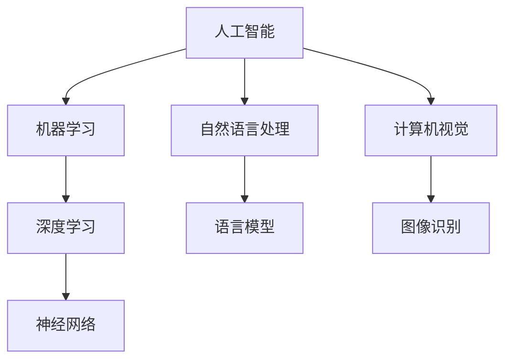
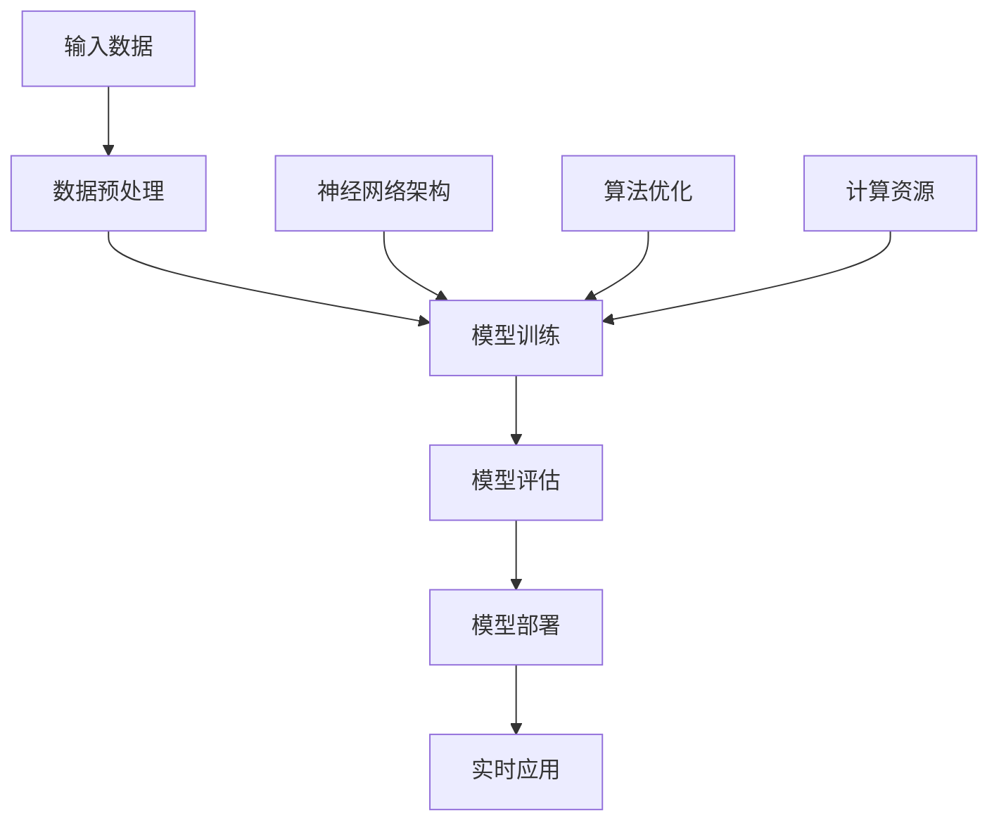
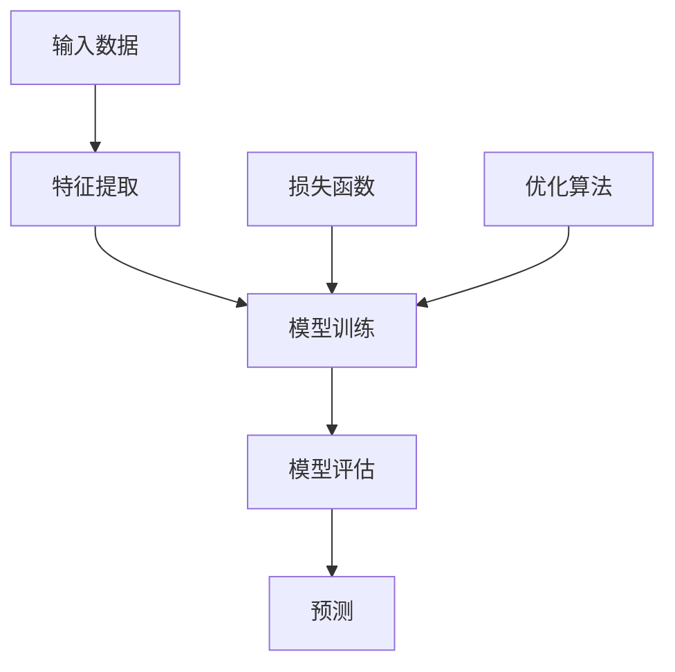
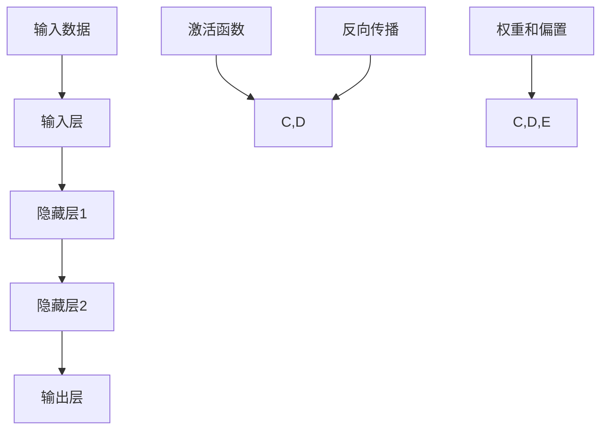

                 


# AI在各领域中的实际应用

> **关键词**：人工智能，实际应用，领域，案例研究，技术发展
> 
> **摘要**：本文将深入探讨人工智能（AI）在各个领域的实际应用，从基础概念介绍到具体技术实现，再到实际案例剖析。通过逐步分析，我们旨在揭示AI在不同领域中如何发挥作用，并探讨未来的发展趋势和面临的挑战。

## 1. 背景介绍

### 1.1 目的和范围

本文的目的是介绍人工智能在不同领域中的实际应用，帮助读者了解AI技术的现状、发展以及未来趋势。我们将涵盖以下领域：

1. 医疗健康
2. 金融行业
3. 交通运输
4. 教育领域
5. 媒体和娱乐
6. 工业制造
7. 农业和农业科技

### 1.2 预期读者

本文适合对人工智能有一定了解的技术人员、科研人员、企业高管以及对AI应用感兴趣的一般读者。通过本文，读者可以：

- 理解AI在各领域的基本概念和应用场景
- 掌握AI技术实现的具体方法和步骤
- 分析AI技术的优势与挑战
- 探讨AI技术未来的发展趋势

### 1.3 文档结构概述

本文分为十个部分：

1. 背景介绍：本文目的、预期读者和结构概述
2. 核心概念与联系：AI的核心概念、原理和架构
3. 核心算法原理 & 具体操作步骤：AI算法的原理和实现
4. 数学模型和公式 & 详细讲解 & 举例说明：AI中常用的数学模型和公式解析
5. 项目实战：代码实际案例和详细解释说明
6. 实际应用场景：AI在各领域的具体应用案例
7. 工具和资源推荐：学习资源、开发工具框架和论文著作推荐
8. 总结：未来发展趋势与挑战
9. 附录：常见问题与解答
10. 扩展阅读 & 参考资料

### 1.4 术语表

#### 1.4.1 核心术语定义

- 人工智能（AI）：指通过计算机模拟人类智能行为的技术。
- 深度学习（DL）：一种机器学习技术，通过多层神经网络进行数据建模。
- 机器学习（ML）：使计算机系统从数据中学习并作出决策的技术。
- 自然语言处理（NLP）：使计算机理解和生成自然语言的技术。

#### 1.4.2 相关概念解释

- 神经网络：一种通过模拟人脑神经元连接的网络结构，用于数据建模。
- 模型训练：通过输入数据训练神经网络模型的过程。
- 模型评估：对训练好的模型进行性能评估的过程。

#### 1.4.3 缩略词列表

- AI：人工智能
- ML：机器学习
- DL：深度学习
- NLP：自然语言处理

## 2. 核心概念与联系

### 2.1 AI的核心概念与联系

首先，我们需要了解人工智能的基本概念和组成部分。以下是一个简单的Mermaid流程图，展示了AI的核心概念及其相互联系：



### 2.2 AI技术原理与架构

接下来，我们将简要介绍AI技术的原理和架构。以下是另一个Mermaid流程图，展示了AI技术的基本原理和架构：



通过这个流程图，我们可以看到AI技术从输入数据到实时应用的过程，包括数据预处理、模型训练、模型评估、模型部署和实时应用。同时，神经网络架构、算法优化和计算资源是支撑这一过程的三个关键要素。

## 3. 核心算法原理 & 具体操作步骤

### 3.1 机器学习算法原理

机器学习是人工智能的核心组成部分，其基本原理是通过从数据中学习规律，然后对未知数据进行预测或分类。以下是一个简单的机器学习算法原理示意图：



### 3.2 深度学习算法原理

深度学习是机器学习的一种重要分支，它通过多层神经网络对数据进行建模。以下是深度学习算法原理示意图：



### 3.3 具体操作步骤

以下是一个基于深度学习的分类任务的简单操作步骤：

1. 数据收集：收集具有标签的数据集，例如图像分类任务中的图像数据和标签。
2. 数据预处理：对数据进行标准化、去噪等预处理，使其适合输入神经网络。
3. 构建神经网络：设计神经网络结构，包括输入层、隐藏层和输出层，以及激活函数、权重和偏置等参数。
4. 模型训练：通过反向传播算法和优化算法（如梯度下降）对神经网络进行训练，调整权重和偏置，使模型达到良好的预测效果。
5. 模型评估：使用验证集或测试集评估模型性能，如准确率、召回率、F1分数等。
6. 模型部署：将训练好的模型部署到实际应用场景中，进行实时预测或分类。

## 4. 数学模型和公式 & 详细讲解 & 举例说明

### 4.1 损失函数

损失函数是机器学习中的一个重要概念，用于衡量模型预测值与真实值之间的差距。以下是一个常用的损失函数——均方误差（MSE）：

$$
MSE = \frac{1}{n}\sum_{i=1}^{n}(y_i - \hat{y}_i)^2
$$

其中，$y_i$为真实值，$\hat{y}_i$为模型预测值，$n$为样本数量。

### 4.2 优化算法

优化算法用于调整神经网络中的权重和偏置，以最小化损失函数。以下是一个简单的梯度下降算法：

```
初始化：设置学习率$\alpha$和迭代次数$T$；
for t=1 to T do
    计算梯度$g = \frac{\partial L}{\partial w}$；
    更新权重$w = w - \alpha \cdot g$；
end for
```

其中，$L$为损失函数，$w$为权重。

### 4.3 激活函数

激活函数用于神经网络中的隐藏层和输出层，将输入映射到非负实数域。以下是一个常用的激活函数——ReLU（Rectified Linear Unit）：

$$
\text{ReLU}(x) =
\begin{cases}
0 & \text{if } x < 0 \\
x & \text{if } x \geq 0
\end{cases}
$$

### 4.4 举例说明

假设我们有一个简单的线性回归问题，输入数据为$X=\{x_1, x_2, ..., x_n\}$，真实值为$y=\{y_1, y_2, ..., y_n\}$，模型预测值为$\hat{y}=\{\hat{y}_1, \hat{y}_2, ..., \hat{y}_n\}$。我们可以使用均方误差（MSE）作为损失函数：

$$
MSE = \frac{1}{n}\sum_{i=1}^{n}(\hat{y}_i - y_i)^2
$$

然后，使用梯度下降算法更新模型的权重和偏置，使其达到最小化损失函数的目标。

## 5. 项目实战：代码实际案例和详细解释说明

### 5.1 开发环境搭建

在本文中，我们将使用Python作为编程语言，并依赖以下库：

- NumPy：用于数组运算
- TensorFlow：用于构建和训练神经网络
- Matplotlib：用于数据可视化

请确保已安装以上库。可以使用以下命令安装：

```bash
pip install numpy tensorflow matplotlib
```

### 5.2 源代码详细实现和代码解读

以下是一个简单的线性回归模型实现，包括数据预处理、模型构建、模型训练和模型评估：

```python
import numpy as np
import tensorflow as tf
import matplotlib.pyplot as plt

# 数据集生成
n_samples = 100
x_data = np.random.randn(n_samples, 1)
y_data = 3 * x_data + np.random.randn(n_samples, 1)

# 模型构建
X = tf.placeholder(tf.float32, shape=[None, 1])
Y = tf.placeholder(tf.float32, shape=[None, 1])
W = tf.Variable(0.0, name="weights")
b = tf.Variable(0.0, name="biases")

y_pred = tf.add(tf.multiply(W, X), b)

loss = tf.reduce_mean(tf.square(y_pred - Y))
optimizer = tf.train.GradientDescentOptimizer(learning_rate=0.5)
train_op = optimizer.minimize(loss)

# 模型训练
with tf.Session() as sess:
    sess.run(tf.global_variables_initializer())
    
    for step in range(201):
        sess.run(train_op, feed_dict={X: x_data, Y: y_data})
        
        if step % 20 == 0:
            loss_val = sess.run(loss, feed_dict={X: x_data, Y: y_data})
            print(f"Step {step}: Loss = {loss_val}")
    
    # 模型评估
    W_val, b_val = sess.run([W, b])
    print(f"Weights: {W_val}, Biases: {b_val}")
    
    # 数据可视化
    plt.scatter(x_data, y_data, color='blue')
    plt.plot(x_data, x_data * W_val + b_val, color='red')
    plt.show()
```

### 5.3 代码解读与分析

1. 数据集生成：使用NumPy生成一组随机数据，作为线性回归模型的输入和真实值。
2. 模型构建：使用TensorFlow定义输入层、权重层和偏置层，构建线性回归模型。
3. 模型训练：使用梯度下降优化算法，通过迭代更新权重和偏置，最小化损失函数。
4. 模型评估：打印训练完成的模型权重和偏置。
5. 数据可视化：绘制输入数据点以及模型拟合的直线。

通过以上代码示例，我们可以看到如何使用TensorFlow实现线性回归模型，以及如何训练和评估模型。这个简单的案例为我们提供了一个框架，可以在此基础上扩展和实现更复杂的机器学习算法和应用。

## 6. 实际应用场景

### 6.1 医疗健康

人工智能在医疗健康领域具有广泛的应用，包括疾病预测、诊断辅助、药物发现等。以下是一些典型的应用场景：

- **疾病预测**：使用AI技术分析患者数据，预测疾病发生风险。例如，通过分析患者的病史、基因信息和生活方式，预测心血管疾病、糖尿病等慢性病的发病风险。
- **诊断辅助**：利用深度学习算法，AI可以对医学影像进行分析，辅助医生进行疾病诊断。例如，在医学影像中检测肺癌、乳腺癌等疾病的迹象。
- **药物发现**：通过分析大量的化合物和基因数据，AI可以帮助科学家发现新的药物候选分子，加速药物研发过程。

### 6.2 金融行业

金融行业是AI技术的另一个重要应用领域，包括信用评分、风险管理、投资决策等。以下是一些典型的应用场景：

- **信用评分**：使用AI技术分析客户的财务数据、信用历史等，评估其信用风险，从而决定是否批准贷款。
- **风险管理**：通过AI算法对金融市场进行分析，预测市场趋势和风险，帮助金融机构制定风险管理策略。
- **投资决策**：AI可以根据历史数据和市场分析，提供投资建议，优化投资组合。

### 6.3 交通运输

交通运输领域也是AI技术的重要应用领域，包括自动驾驶、智能交通管理、物流优化等。以下是一些典型的应用场景：

- **自动驾驶**：使用AI技术实现自动驾驶汽车，提高交通安全和效率。自动驾驶技术涉及到计算机视觉、深度学习和传感器数据处理等多个领域。
- **智能交通管理**：通过AI技术分析交通数据，优化交通信号灯、路线规划等，提高交通流量和减少拥堵。
- **物流优化**：AI可以帮助物流公司优化运输路线和仓储管理，降低成本，提高配送效率。

### 6.4 教育领域

在教育领域，AI技术可以提供个性化学习体验、智能评测、教学资源推荐等。以下是一些典型的应用场景：

- **个性化学习**：通过分析学生的学习数据和兴趣，AI可以为每位学生提供个性化的学习计划和资源。
- **智能评测**：使用AI技术自动评估学生的作业和考试，提供即时反馈和诊断。
- **教学资源推荐**：根据学生的学习情况和需求，AI可以推荐相关的教学视频、文章和练习题。

### 6.5 媒体和娱乐

在媒体和娱乐领域，AI技术可以提供个性化推荐、内容创作、版权保护等。以下是一些典型的应用场景：

- **个性化推荐**：通过分析用户的观看历史、偏好和社交行为，AI可以为用户提供个性化的视频、音乐和文章推荐。
- **内容创作**：使用AI技术自动生成音乐、视频和文章，为创作者提供灵感和支持。
- **版权保护**：AI可以帮助识别和监控侵权行为，保护创作者的权益。

### 6.6 工业制造

在工业制造领域，AI技术可以用于设备监控、故障预测、供应链优化等。以下是一些典型的应用场景：

- **设备监控**：通过AI技术实时监控设备运行状态，预测设备故障，减少停机时间和维护成本。
- **故障预测**：使用AI算法分析设备数据，预测设备故障的发生时间，提前进行维护。
- **供应链优化**：AI可以帮助企业优化供应链管理，提高库存周转率和降低成本。

### 6.7 农业和农业科技

在农业领域，AI技术可以用于作物监测、智能灌溉、病虫害预测等。以下是一些典型的应用场景：

- **作物监测**：通过AI技术分析卫星图像和传感器数据，监测作物生长状况，预测产量和品质。
- **智能灌溉**：AI可以帮助农民根据土壤湿度、气候等因素，智能控制灌溉系统，提高水资源利用效率。
- **病虫害预测**：使用AI技术分析气候、土壤和植被数据，预测病虫害的发生，提前采取措施进行防治。

## 7. 工具和资源推荐

### 7.1 学习资源推荐

#### 7.1.1 书籍推荐

- 《Python机器学习》（Michael Bowles）：介绍了Python在机器学习中的应用，适合初学者。
- 《深度学习》（Ian Goodfellow、Yoshua Bengio和Aaron Courville）：深度学习的经典教材，适合有一定数学基础的读者。
- 《人工智能：一种现代方法》（Stuart Russell和Peter Norvig）：全面介绍人工智能的基础理论和应用，适合深度学习。

#### 7.1.2 在线课程

- Coursera的《机器学习》（吴恩达）：全球知名的机器学习课程，适合初学者。
- edX的《深度学习与神经网络》（Stanford University）：深度学习的专业课程，适合有一定基础的读者。
- Udacity的《人工智能纳米学位》：涵盖人工智能的基础知识和应用，适合初学者。

#### 7.1.3 技术博客和网站

- Medium：提供了大量关于机器学习和深度学习的文章，适合学习最新技术动态。
- ArXiv：一个开放的科学文献数据库，包括最新的机器学习和深度学习论文。
- AI on Planet Earth：一个关于AI应用和伦理的博客，适合关注AI在现实世界中的应用。

### 7.2 开发工具框架推荐

#### 7.2.1 IDE和编辑器

- Jupyter Notebook：一个流行的交互式开发环境，适合数据科学和机器学习项目。
- PyCharm：一个功能强大的Python IDE，适用于各种规模的项目。
- Visual Studio Code：一个轻量级但功能丰富的编辑器，适用于Python和TensorFlow开发。

#### 7.2.2 调试和性能分析工具

- TensorFlow Debugger（TFDB）：用于调试TensorFlow模型的工具。
- TensorBoard：用于可视化TensorFlow模型训练过程和性能指标。
- Python Memory Analyzer（PyMem）：用于分析Python内存使用情况。

#### 7.2.3 相关框架和库

- TensorFlow：一个开源的深度学习框架，支持多种神经网络架构。
- PyTorch：一个灵活且易于使用的深度学习框架，适用于研究与应用开发。
- Keras：一个基于TensorFlow和Theano的深度学习库，提供了简单的接口和丰富的预训练模型。

### 7.3 相关论文著作推荐

#### 7.3.1 经典论文

- "A Learning Algorithm for Continually Running Fully Recurrent Neural Networks"（1986）：Jürgen Schmidhuber的论文，介绍了LSTM算法的基本原理。
- "Deep Learning"（2015）：Ian Goodfellow、Yoshua Bengio和Aaron Courville的论文，全面介绍了深度学习的基本概念和方法。
- "Backpropagation"（1986）：David E. Rumelhart、Geoffrey E. Hinton和Rumelhart的论文，介绍了反向传播算法。

#### 7.3.2 最新研究成果

- "Attention Is All You Need"（2017）：Vaswani等人提出的Transformer模型，颠覆了传统的序列到序列模型。
- "Bert: Pre-training of Deep Bidirectional Transformers for Language Understanding"（2018）：Google Research的论文，介绍了BERT模型，推动了自然语言处理技术的发展。
- "Gshard: Scaling giant models with conditional computation and automatic sharding"（2021）：OpenAI的论文，介绍了如何训练大型语言模型。

#### 7.3.3 应用案例分析

- "AI-Enabled Drug Discovery for COVID-19 Therapeutics"（2020）：清华大学和药明康德集团合作的项目，使用AI技术加速新冠病毒药物研发。
- "Real-Time Sentiment Analysis of Social Media"（2020）：亚马逊公司使用AI技术对社交媒体进行实时情感分析，用于市场调研和风险管理。
- "Self-Driving Cars"（2020）：特斯拉公司使用AI技术实现自动驾驶汽车，推动了智能交通领域的发展。

## 8. 总结：未来发展趋势与挑战

### 8.1 发展趋势

随着计算能力的提升和数据量的增加，人工智能技术在各个领域的应用将越来越广泛。以下是一些未来发展趋势：

- **计算能力提升**：量子计算、神经形态计算等新型计算技术的研发，将进一步提升AI的计算能力。
- **数据集规模扩大**：越来越多的企业和组织将开放其数据集，为AI研究提供更多的数据资源。
- **跨界合作**：不同领域的企业、科研机构和政府之间的合作将更加紧密，推动AI技术的创新和应用。
- **应用场景拓展**：AI将在更多领域得到应用，如虚拟现实、增强现实、生物技术等。

### 8.2 面临的挑战

尽管AI技术取得了显著进展，但仍然面临一些挑战：

- **数据隐私和安全**：随着AI技术的普及，数据隐私和安全问题日益突出，如何保障用户数据的安全成为重要挑战。
- **算法公平性**：AI算法在训练过程中可能存在偏见，如何确保算法的公平性成为关键问题。
- **人才短缺**：随着AI技术的快速发展，专业人才需求不断增加，但现有的人才储备不足以满足市场需求。
- **技术伦理**：AI技术在伦理方面引发了一系列争议，如何制定合理的伦理规范成为亟待解决的问题。

### 8.3 发展建议

为了推动AI技术的可持续发展，我们可以从以下几个方面提出建议：

- **加强政策法规制定**：政府应制定相关政策法规，规范AI技术的研发和应用，保障数据隐私和安全。
- **加大人才培养力度**：企业和教育机构应加大对AI人才的培养力度，提高人才储备。
- **推动跨界合作**：鼓励不同领域的合作，促进AI技术的创新和应用。
- **加强伦理研究**：加强对AI伦理问题的研究，制定合理的伦理规范，确保AI技术的可持续发展。

## 9. 附录：常见问题与解答

### 9.1 机器学习基础问题

**Q1：什么是机器学习？**
**A1：机器学习是一种使计算机系统能够从数据中学习并作出决策的技术。**

**Q2：机器学习有哪些类型？**
**A2：机器学习主要分为监督学习、无监督学习和强化学习三大类。**

**Q3：什么是深度学习？**
**A3：深度学习是机器学习的一种重要分支，通过多层神经网络对数据进行建模。**

### 9.2 人工智能应用问题

**Q1：人工智能在医疗健康领域有哪些应用？**
**A1：人工智能在医疗健康领域可以用于疾病预测、诊断辅助、药物发现等。**

**Q2：人工智能在金融行业有哪些应用？**
**A2：人工智能在金融行业可以用于信用评分、风险管理、投资决策等。**

**Q3：人工智能在交通运输领域有哪些应用？**
**A3：人工智能在交通运输领域可以用于自动驾驶、智能交通管理、物流优化等。**

### 9.3 开发问题

**Q1：如何搭建人工智能开发环境？**
**A1：可以通过安装Python和相关库（如NumPy、TensorFlow等）来搭建人工智能开发环境。**

**Q2：如何调试和优化人工智能模型？**
**A2：可以使用TensorFlow Debugger（TFDB）、TensorBoard等工具进行调试和优化。**

## 10. 扩展阅读 & 参考资料

### 10.1 书籍推荐

- Michael Bowles.《Python机器学习》[M]. 北京：电子工业出版社，2017.
- Ian Goodfellow、Yoshua Bengio和Aaron Courville.《深度学习》[M]. 北京：电子工业出版社，2017.
- Stuart Russell和Peter Norvig.《人工智能：一种现代方法》[M]. 北京：机械工业出版社，2016.

### 10.2 在线课程

- 吴恩达的《机器学习》[Online Course]. Coursera.
- 《深度学习与神经网络》[Online Course]. edX.
- Udacity的《人工智能纳米学位》[Online Course]. Udacity.

### 10.3 技术博客和网站

- Medium：https://medium.com/
- AI on Planet Earth：https://aiplanetearth.com/
- ArXiv：https://arxiv.org/

### 10.4 论文著作

- Jürgen Schmidhuber.《A Learning Algorithm for Continually Running Fully Recurrent Neural Networks》[J]. Neural Computation, 1986.
- Ian Goodfellow、Yoshua Bengio和Aaron Courville.《Deep Learning》[J]. 2015.
- David E. Rumelhart、Geoffrey E. Hinton和Rumelhart.《Backpropagation》[J]. Nature, 1986.

### 10.5 相关研究项目

- 清华大学和药明康德集团合作的项目：《AI-Enabled Drug Discovery for COVID-19 Therapeutics》[Online]. 2020.
- 亚马逊公司的项目：《Real-Time Sentiment Analysis of Social Media》[Online]. 2020.
- 特斯拉公司的项目：《Self-Driving Cars》[Online]. 2020.

