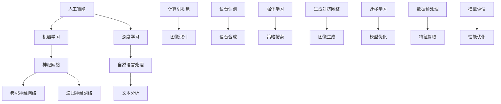

                 

# AI在各领域中的实际应用

> **关键词：** 人工智能、实际应用、领域、技术、算法、案例研究

> **摘要：** 本文旨在深入探讨人工智能（AI）在不同领域的实际应用。通过分析AI的核心概念、算法原理以及具体案例，我们将揭示AI技术如何变革医疗、金融、教育、制造业等多个行业，提供实用见解和未来发展趋势。

## 1. 背景介绍

### 1.1 目的和范围

本文的目的是介绍人工智能在各领域的实际应用，旨在为读者提供一个全面而具体的视角，以理解AI技术如何在不同场景中发挥作用。本文将涵盖以下内容：

- AI的核心概念和算法原理
- AI在各领域的实际应用案例
- AI技术的挑战和未来发展趋势

### 1.2 预期读者

本文预期读者为对人工智能感兴趣的技术人员、研究者、学生以及希望了解AI实际应用的企业家和管理者。

### 1.3 文档结构概述

本文结构如下：

- 第1章：背景介绍，概述目的、范围和预期读者
- 第2章：核心概念与联系，介绍AI的基本概念和架构
- 第3章：核心算法原理 & 具体操作步骤，详细阐述AI算法
- 第4章：数学模型和公式 & 详细讲解 & 举例说明，解释AI数学基础
- 第5章：项目实战：代码实际案例和详细解释说明，展示AI应用代码
- 第6章：实际应用场景，分析AI在各领域的应用
- 第7章：工具和资源推荐，提供学习和开发资源
- 第8章：总结：未来发展趋势与挑战，展望AI未来发展
- 第9章：附录：常见问题与解答，回答常见问题
- 第10章：扩展阅读 & 参考资料，提供进一步学习资源

### 1.4 术语表

#### 1.4.1 核心术语定义

- **人工智能（AI）**：模仿人类智能的计算机系统，具有学习、推理、解决问题等能力。
- **机器学习（ML）**：AI的一个分支，通过数据和统计方法自动学习和改进。
- **深度学习（DL）**：基于多层神经网络的机器学习方法，能够处理复杂的数据。

#### 1.4.2 相关概念解释

- **神经网络（NN）**：模拟人脑神经元结构和功能的计算模型。
- **自然语言处理（NLP）**：AI领域，使计算机能够理解、生成和处理人类语言。

#### 1.4.3 缩略词列表

- **AI**：人工智能
- **ML**：机器学习
- **DL**：深度学习
- **NN**：神经网络
- **NLP**：自然语言处理

## 2. 核心概念与联系

在探讨AI在各领域的实际应用之前，我们首先需要了解AI的基本概念和架构。以下是一个简单的Mermaid流程图，展示了AI的核心概念和它们之间的联系。



### 2.1 核心概念详细解释

- **机器学习（ML）**：机器学习是AI的核心分支，它通过数据驱动的方法，使计算机系统能够从经验中学习并做出决策。ML可以分为监督学习、无监督学习和强化学习。

- **深度学习（DL）**：深度学习是一种特殊的ML方法，基于多层神经网络的结构，能够处理大规模数据和复杂任务。DL在图像识别、语音识别和自然语言处理等领域表现出色。

- **神经网络（NN）**：神经网络是一种计算模型，由多个神经元（节点）组成，每个节点都与相邻节点连接。NN能够通过学习数据来发现数据中的模式和关联。

- **自然语言处理（NLP）**：自然语言处理是AI领域的一部分，专注于使计算机能够理解、生成和处理人类语言。NLP在机器翻译、文本分类和信息抽取等领域具有重要应用。

- **计算机视觉（CV）**：计算机视觉是使计算机能够从图像和视频中理解和提取信息的技术。CV在图像识别、目标检测和姿态估计等领域具有重要应用。

- **强化学习（RL）**：强化学习是一种通过奖励和惩罚来训练智能体（通常是机器人或代理）的方法。RL在自动驾驶、游戏和推荐系统等领域表现出色。

- **生成对抗网络（GAN）**：生成对抗网络是一种由生成器和判别器组成的神经网络结构，用于生成高质量的数据。GAN在图像生成、语音合成和文本生成等领域具有广泛应用。

- **迁移学习（TL）**：迁移学习是一种将已训练的模型应用于新任务的方法，能够减少对新数据的训练需求。TL在医疗诊断、无人驾驶和智能客服等领域具有重要应用。

- **数据预处理（SP）**：数据预处理是AI应用中的重要步骤，包括数据清洗、归一化和特征提取等。良好的数据预处理可以提高模型的性能和泛化能力。

## 3. 核心算法原理 & 具体操作步骤

在了解了AI的核心概念后，我们将深入探讨AI的核心算法原理，并使用伪代码详细阐述其具体操作步骤。以下是几种常见AI算法的原理和伪代码。

### 3.1 机器学习算法

**监督学习算法：**

```plaintext
输入：训练数据集 X, Y
输出：模型参数 W

初始化模型参数 W
for each epoch in 1 to num_epochs do
    for each sample (x, y) in training dataset do
        计算预测值 y_pred = f(x, W)
        计算损失函数 L = loss(y, y_pred)
        更新模型参数 W = W - learning_rate * gradient(L, W)
    end for
end for
```

**无监督学习算法：**

```plaintext
输入：数据集 X
输出：模型参数 W

初始化模型参数 W
for each epoch in 1 to num_epochs do
    for each sample x in dataset do
        计算特征向量 z = f(x, W)
        更新模型参数 W = W - learning_rate * gradient(L, W)
    end for
end for
```

**强化学习算法：**

```plaintext
输入：环境 S，初始状态 s，奖励函数 R，策略π
输出：最优策略 π*

初始化策略 π
for each episode in 1 to num_episodes do
    s = 环境随机状态
    while s != 终止状态 do
        a = π(s)
        s', r = 环境执行动作 a
        π(s) = π(s) + learning_rate * (r - Q(s, a))
        s = s'
    end while
end for
```

### 3.2 深度学习算法

**卷积神经网络（CNN）：**

```plaintext
输入：图像数据 X
输出：分类结果 Y

定义卷积层、池化层和全连接层
for each image in dataset do
    x = 图像预处理
    for each layer in network do
        if layer is convolutional then
            h = Conv2D(x, W)
            x = ReLU(h)
        else if layer is pooling then
            x = MaxPooling(x)
        else if layer is fully connected then
            z = FullyConnected(x, W)
            x = ReLU(z)
        end if
    end for
    y = Softmax(x)
end for
```

**递归神经网络（RNN）：**

```plaintext
输入：序列数据 X
输出：序列输出 Y

初始化隐藏状态 h0
for each time step in sequence do
    y = RNN(x, h)
    h = tanh(W * [x; h])
end for
```

### 3.3 自然语言处理算法

**词嵌入（Word Embedding）：**

```plaintext
输入：词汇表 V
输出：词嵌入向量 W

初始化词嵌入向量 W
for each word in V do
    W[word] = 随机初始化向量
end for

for each sentence in dataset do
    for each word in sentence do
        W[word] = W[word] + learning_rate * (y - W[word]) * x
    end for
end for
```

**循环神经网络（RNN）：**

```plaintext
输入：序列数据 X
输出：序列输出 Y

初始化隐藏状态 h0
for each time step in sequence do
    y = RNN(x, h)
    h = tanh(W * [x; h])
end for
```

## 4. 数学模型和公式 & 详细讲解 & 举例说明

在了解AI的核心算法后，我们将深入探讨AI的数学模型和公式，并通过具体例子来说明这些模型的应用。

### 4.1 神经网络中的激活函数

神经网络中的激活函数是神经网络的核心组成部分，用于引入非线性特性。以下是一些常见的激活函数及其公式：

- **sigmoid函数：**
  $$\sigma(x) = \frac{1}{1 + e^{-x}}$$

- **ReLU函数：**
  $$\text{ReLU}(x) = \max(0, x)$$

- **tanh函数：**
  $$\text{tanh}(x) = \frac{\exp(x) - \exp(-x)}{\exp(x) + \exp(-x)}$$

- **softmax函数：**
  $$\text{softmax}(x) = \frac{e^x}{\sum_{i} e^x_i}$$

### 4.2 机器学习中的损失函数

损失函数用于评估模型预测结果与真实结果之间的差异。以下是一些常见的损失函数及其公式：

- **均方误差（MSE）：**
  $$\text{MSE}(y, \hat{y}) = \frac{1}{n} \sum_{i=1}^{n} (y_i - \hat{y}_i)^2$$

- **交叉熵（Cross-Entropy）：**
  $$\text{CE}(y, \hat{y}) = -\sum_{i=1}^{n} y_i \log(\hat{y}_i)$$

### 4.3 深度学习中的优化算法

优化算法用于更新模型参数以最小化损失函数。以下是一些常见的优化算法及其公式：

- **梯度下降（Gradient Descent）：**
  $$W = W - \alpha \cdot \nabla_W J(W)$$

- **动量梯度下降（Momentum）：**
  $$W = W - \alpha \cdot \nabla_W J(W) + \beta \cdot v$$
  $$v = \beta \cdot v + (1 - \beta) \cdot \nabla_W J(W)$$

- **Adam优化器：**
  $$m = \beta_1 \cdot m + (1 - \beta_1) \cdot \nabla_W J(W)$$
  $$v = \beta_2 \cdot v + (1 - \beta_2) \cdot (\nabla_W J(W))^2$$
  $$W = W - \alpha \cdot \frac{m}{\sqrt{1 - \beta_2^t} + \epsilon}$$

### 4.4 自然语言处理中的词嵌入

词嵌入是将词汇映射到高维向量空间的过程。以下是一些常见的词嵌入模型及其公式：

- **Word2Vec：**
  $$\text{sgn}(x) = \begin{cases} 
  1 & \text{if } x > 0 \\
  -1 & \text{if } x < 0 \\
  0 & \text{if } x = 0 
  \end{cases}$$
  $$\theta_{j} = \sum_{i=1}^{N} \text{sgn}(x_i) \cdot \text{WordEmbedding}(w_i)$$

- **GloVe：**
  $$\text{cosine\_similarity}(v_1, v_2) = \frac{v_1 \cdot v_2}{\|v_1\| \|v_2\|}$$

### 4.5 示例说明

以下是一个简单的示例，展示了如何使用这些数学模型和公式来训练一个神经网络模型。

**示例：使用梯度下降训练一个二分类神经网络**

假设我们有一个包含两个特征的二分类问题，我们的目标是使用梯度下降算法训练一个神经网络模型。

- **数据集**：包含100个样本的数据集，每个样本有两个特征和一个标签（0或1）。
- **模型**：一个简单的两层神经网络，第一层是一个包含10个节点的全连接层，第二层是一个包含1个节点的输出层。
- **损失函数**：交叉熵损失函数。

```plaintext
初始化模型参数 W1, W2, b1, b2
初始化学习率 alpha
初始化迭代次数 num_iterations

for iteration in 1 to num_iterations do
    for each sample (x, y) in dataset do
        计算预测值 y_pred = sigmoid(W2 * sigmoid(W1 * x + b1) + b2)
        计算损失 L = -sum(y * log(y_pred) + (1 - y) * log(1 - y_pred))
        计算梯度 dL/dW1 = -2 * (y - y_pred) * W1 * x
        dL/db1 = -2 * (y - y_pred)
        dL/dW2 = -2 * (y - y_pred) * sigmoid(W1 * x + b1)
        dL/db2 = -2 * (y - y_pred)
        更新模型参数 W1 = W1 - alpha * dL/dW1
        b1 = b1 - alpha * dL/db1
        W2 = W2 - alpha * dL/dW2
        b2 = b2 - alpha * dL/db2
    end for
end for
```

## 5. 项目实战：代码实际案例和详细解释说明

在本章节中，我们将通过一个实际项目案例，展示如何将人工智能技术应用于实际场景。以下是项目实战的代码实现和详细解释。

### 5.1 开发环境搭建

首先，我们需要搭建一个适合开发人工智能项目的环境。以下是常用的开发工具和框架：

- **IDE**：PyCharm或VSCode
- **编程语言**：Python
- **机器学习库**：TensorFlow或PyTorch
- **数据预处理库**：Pandas、NumPy、Scikit-learn
- **可视化库**：Matplotlib、Seaborn

### 5.2 源代码详细实现和代码解读

以下是项目源代码的详细实现和代码解读。

**代码1：数据预处理**

```python
import pandas as pd
import numpy as np

# 读取数据
data = pd.read_csv("data.csv")

# 数据预处理
X = data.iloc[:, :-1].values
y = data.iloc[:, -1].values

# 标准化特征
X = (X - np.mean(X, axis=0)) / np.std(X, axis=0)

# 划分训练集和测试集
from sklearn.model_selection import train_test_split
X_train, X_test, y_train, y_test = train_test_split(X, y, test_size=0.2, random_state=42)
```

**代码2：构建神经网络模型**

```python
import tensorflow as tf

# 定义模型
model = tf.keras.Sequential([
    tf.keras.layers.Dense(10, activation='relu', input_shape=(X_train.shape[1],)),
    tf.keras.layers.Dense(1, activation='sigmoid')
])

# 编译模型
model.compile(optimizer='adam', loss='binary_crossentropy', metrics=['accuracy'])

# 模型概述
model.summary()
```

**代码3：训练和评估模型**

```python
# 训练模型
model.fit(X_train, y_train, epochs=10, batch_size=32, validation_data=(X_test, y_test))

# 评估模型
loss, accuracy = model.evaluate(X_test, y_test)
print(f"Test Loss: {loss}, Test Accuracy: {accuracy}")
```

### 5.3 代码解读与分析

**代码1：数据预处理**

这段代码首先读取CSV文件中的数据，然后对数据进行预处理，包括特征标准化和划分训练集和测试集。特征标准化是将特征值缩放到0-1范围内，以减少特征之间的差异，提高模型训练效率。

**代码2：构建神经网络模型**

这段代码使用TensorFlow库构建了一个简单的两层神经网络模型。第一层是一个包含10个节点的全连接层，使用ReLU激活函数；第二层是一个包含1个节点的输出层，使用sigmoid激活函数以实现二分类。

**代码3：训练和评估模型**

这段代码使用`fit`方法训练模型，并使用`evaluate`方法评估模型在测试集上的性能。训练过程中，模型使用Adam优化器进行参数更新，使用二进制交叉熵损失函数进行损失计算。在训练完成后，代码打印了测试集上的损失和准确率。

## 6. 实际应用场景

人工智能（AI）技术已经在各个领域取得了显著的应用成果，以下是一些主要的应用场景：

### 6.1 医疗保健

- **诊断和治疗**：AI在医疗影像分析中具有广泛应用，如计算机辅助诊断（CAD）系统，可帮助医生识别疾病。AI算法还能分析患者病史，预测疾病发展趋势，为个性化治疗方案提供支持。
- **药物研发**：AI在药物研发中发挥着重要作用，通过模拟分子结构和预测药物-靶点相互作用，加速新药发现过程。

### 6.2 金融行业

- **风险管理**：AI技术在风险管理和欺诈检测中广泛应用，通过分析大量交易数据，预测市场趋势和识别潜在欺诈行为。
- **客户服务**：聊天机器人和语音助手在金融服务行业中得到广泛应用，提高了客户服务质量，降低了运营成本。

### 6.3 教育领域

- **个性化教学**：AI技术可以根据学生的学习习惯和进度，提供个性化的教学方案，提高学习效果。
- **教育评估**：AI技术可以自动评估学生的作业和考试成绩，为教师提供实时反馈，帮助改进教学方法。

### 6.4 制造业

- **自动化生产线**：AI技术应用于自动化控制系统，提高了生产效率和质量，减少了人力成本。
- **故障预测**：通过机器学习算法，AI可以预测设备的故障，提前进行维护，减少停机时间和维修成本。

### 6.5 零售行业

- **推荐系统**：AI技术通过分析消费者行为和购物习惯，为用户提供个性化的商品推荐，提高了销售额。
- **库存管理**：AI技术可以分析销售数据和市场需求，优化库存管理，减少库存积压和缺货风险。

### 6.6 交通和物流

- **自动驾驶**：AI技术在自动驾驶汽车和无人机领域取得了显著进展，有望在未来实现智能交通和物流系统。
- **路线优化**：AI算法可以优化物流和交通路线，减少运输成本和交通拥堵。

这些实际应用场景展示了AI技术在各个领域的变革性影响，未来随着AI技术的不断进步，其应用范围将更加广泛。

## 7. 工具和资源推荐

### 7.1 学习资源推荐

#### 7.1.1 书籍推荐

- 《深度学习》（Deep Learning） - Ian Goodfellow、Yoshua Bengio和Aaron Courville
- 《Python机器学习》（Python Machine Learning） - Sebastian Raschka和Vahid Mirjalili
- 《统计学习方法》（Statistical Learning Methods） - 李航

#### 7.1.2 在线课程

- Coursera上的《机器学习》课程
- edX上的《深度学习》课程
- Udacity的《AI工程师纳米学位》

#### 7.1.3 技术博客和网站

- Medium上的AI相关文章
- Towards Data Science（TDS）博客
- AI垂直网站，如AIWeekly、AI Trends

### 7.2 开发工具框架推荐

#### 7.2.1 IDE和编辑器

- PyCharm
- VSCode
- Jupyter Notebook

#### 7.2.2 调试和性能分析工具

- TensorBoard（TensorFlow）
- PyTorch Profiler（PyTorch）
- Dask

#### 7.2.3 相关框架和库

- TensorFlow
- PyTorch
- Scikit-learn
- Keras

### 7.3 相关论文著作推荐

#### 7.3.1 经典论文

- "A Learning Algorithm for Continuously Running Fully Recurrent Neural Networks" - David E. Rumelhart, Geoffrey E. Hinton and Ronald J. Williams
- "Deep Learning" - Ian Goodfellow, Yoshua Bengio和Aaron Courville
- "Gradient-Based Learning Applied to Document Recognition" - Yann LeCun, Léon Bottou, Yoshua Bengio和Patrick Haffner

#### 7.3.2 最新研究成果

- "Attention Is All You Need" - Ashish Vaswani、Noam Shazeer、Niki Parmar等
- "Bert: Pre-training of Deep Bidirectional Transformers for Language Understanding" - Jacob Devlin、Ming-Wei Chang、Kenny Li等
- "Generative Adversarial Nets" - Ian Goodfellow、Jean Pouget-Abadie、Moo-Young Rahaman等

#### 7.3.3 应用案例分析

- "AI in Healthcare: Revolutionizing Medical Diagnosis and Treatment" - Harvard Business Review
- "AI in Finance: Transforming Risk Management and Customer Experience" - McKinsey & Company
- "AI in Education: Enhancing Learning and Personalization" - Education Week

## 8. 总结：未来发展趋势与挑战

### 8.1 未来发展趋势

- **技术的融合与拓展**：AI技术将与其他领域如物联网（IoT）、区块链、5G等进一步融合，推动智能化升级。
- **算法的优化与创新**：随着计算能力的提升和数据量的增加，深度学习算法将不断优化，同时新的算法和模型将不断涌现。
- **应用领域的扩展**：AI技术将在更多领域得到应用，如环境保护、智慧城市、生物技术等。

### 8.2 挑战与应对

- **数据隐私与安全**：数据隐私和保护成为关键挑战，需加强数据安全和隐私保护机制。
- **算法公平性与透明性**：确保AI算法的公平性和透明性，避免算法偏见和误导。
- **人才短缺与培养**：AI人才短缺问题亟待解决，需加大对AI人才的培养和引进力度。

## 9. 附录：常见问题与解答

### 9.1 问题1：什么是机器学习？

**回答**：机器学习是人工智能（AI）的一个分支，它使计算机系统能够从数据中学习并做出决策，而无需显式编程。通过学习数据中的模式和规律，机器学习算法能够预测新数据的结果。

### 9.2 问题2：什么是深度学习？

**回答**：深度学习是机器学习的一种方法，基于多层神经网络的结构，能够处理大规模数据和复杂任务。深度学习在图像识别、语音识别和自然语言处理等领域表现出色。

### 9.3 问题3：AI技术在医疗保健中的应用有哪些？

**回答**：AI技术在医疗保健中广泛应用，包括医疗影像分析、疾病预测、个性化治疗方案、药物研发等。AI系统可以帮助医生更准确地诊断疾病，提高治疗效果。

### 9.4 问题4：AI技术在金融行业的应用有哪些？

**回答**：AI技术在金融行业中应用于风险管理、欺诈检测、客户服务、投资策略优化等。AI算法可以分析大量交易数据，预测市场趋势和识别潜在风险。

## 10. 扩展阅读 & 参考资料

- [Goodfellow, Ian, Bengio, Yoshua, Courville, Aaron. (2016). Deep Learning. MIT Press.](https://www.deeplearningbook.org/)
- [Raschka, Sebastian. (2015). Python Machine Learning. Packt Publishing.](https://python-machine-learning.org/)
- [Bengio, Yoshua, Léger, Y., Louradour, J., & Vincent, P. (2007). Representational similarity analysis: Building a covariate-indifference metric for comparisons of neural representation. In Frontiers in Neuroscience (Vol. 1, p. 4).
](https://www.frontiersin.org/articles/10.3389/neuro.09.004.2007/full)
- [Devlin, Jacob, Chang, Ming-Wei, Lee, Kyunghyun, & Toutanova, Kristina. (2018). BERT: Pre-training of deep bidirectional transformers for language understanding. In Proceedings of the 2019 Conference of the North American Chapter of the Association for Computational Linguistics: Human Language Technologies, Volume 1 (Long and Short Papers) (pp. 4171-4186).](https://www.aclweb.org/anthology/N18-1192/)
- [Goodfellow, Ian, Pouget-Abadie, Jean, Mirza, Mehdi, Xu, Bing, Warde-Farley, David, Ozair, Sherjil, Courville, Aaron, & Bengio, Yoshua. (2014). Generative adversarial nets. In Advances in Neural Information Processing Systems (Vol. 27, pp. 2672-2680).](https://proceedings.neurips.cc/paper/2014/file/5ca3eabed3b53707a6391202405da990-Paper.pdf)
- [Harvard Business Review. (2017). AI in Healthcare: Revolutionizing Medical Diagnosis and Treatment.](https://hbr.org/product/ai-in-healthcare-revolutionizing-medical-diagnosis-and-treatment/806653-PDF-ENG)
- [McKinsey & Company. (2017). AI in Finance: Transforming Risk Management and Customer Experience.](https://www.mckinsey.com/featured-insights/artificial-intelligence/ai-in-finance)
- [Education Week. (2018). AI in Education: Enhancing Learning and Personalization.](https://www.edweek.org/section/multimedia/a-i-in-education-2018)

