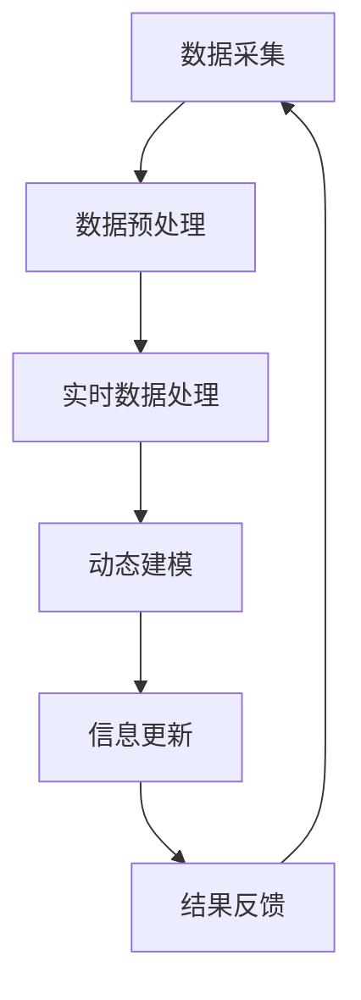

                 


## AI在实时信息更新中的作用

> 关键词：实时信息更新，人工智能，数据流处理，实时算法，动态建模，数据挖掘，分布式系统

> 摘要：本文将深入探讨人工智能在实时信息更新中的关键作用，分析其基本原理、核心算法、数学模型以及实际应用场景。通过一步步的逻辑推理和详细解释，我们旨在帮助读者理解AI技术如何在现代信息社会中发挥重要作用，并展望其未来的发展趋势和挑战。

### 1. 背景介绍

#### 1.1 目的和范围

本文的目标是探讨人工智能在实时信息更新中的作用，旨在帮助读者理解AI技术如何处理大规模、动态变化的数据流，并生成及时、准确的信息更新。文章范围涵盖了实时信息更新的核心概念、算法原理、数学模型以及具体应用场景。通过本文的阅读，读者将能够了解AI技术在实时信息处理领域的优势和局限性，并掌握一些实用的技术和工具。

#### 1.2 预期读者

本文适合对人工智能和实时数据处理有一定了解的读者，包括计算机科学、数据科学和工程领域的研究人员、开发者和爱好者。同时，对于对实时信息更新有实际需求的行业从业者，如金融、新闻、物联网等，也将提供有价值的参考。

#### 1.3 文档结构概述

本文分为十个部分，具体如下：

1. **背景介绍**：介绍文章的目的、范围、预期读者以及文档结构。
2. **核心概念与联系**：介绍实时信息更新的核心概念、原理和架构。
3. **核心算法原理 & 具体操作步骤**：详细讲解实时信息更新的核心算法原理和具体操作步骤。
4. **数学模型和公式 & 详细讲解 & 举例说明**：介绍实时信息更新的数学模型和公式，并进行详细讲解和举例说明。
5. **项目实战：代码实际案例和详细解释说明**：通过实际项目案例展示实时信息更新的实现方法和技巧。
6. **实际应用场景**：分析实时信息更新的实际应用场景和挑战。
7. **工具和资源推荐**：推荐学习资源、开发工具和框架。
8. **总结：未来发展趋势与挑战**：总结实时信息更新的未来发展趋势和挑战。
9. **附录：常见问题与解答**：提供一些常见问题的解答。
10. **扩展阅读 & 参考资料**：推荐相关扩展阅读和参考资料。

#### 1.4 术语表

在本文中，我们将使用以下术语：

- **实时信息更新**：指对大规模、动态变化的数据流进行实时处理和更新，以生成及时、准确的信息。
- **人工智能**：指通过模拟人类智能行为的计算机系统，包括机器学习、深度学习、自然语言处理等。
- **数据流处理**：指对大规模、动态变化的数据进行实时处理和分析。
- **动态建模**：指在数据变化时，动态调整模型参数，以适应新的数据分布。
- **数据挖掘**：指从大量数据中提取有价值的信息和知识。
- **分布式系统**：指将计算任务分布在多个计算机节点上，以实现高效、可靠的处理。

#### 1.4.1 核心术语定义

- **实时信息更新**：实时信息更新是指在短时间内对大量数据进行处理和分析，以生成及时、准确的信息。实时信息更新的关键在于“实时”，即能够在数据产生的同时进行处理和更新。
- **人工智能**：人工智能是指通过模拟人类智能行为的计算机系统，包括机器学习、深度学习、自然语言处理等。人工智能的目标是实现计算机系统在感知、理解、推理、决策等领域的智能化。
- **数据流处理**：数据流处理是指对大规模、动态变化的数据进行实时处理和分析。数据流处理的关键在于“实时”和“动态”，即能够在数据产生的同时进行处理和更新，并适应数据的变化。
- **动态建模**：动态建模是指在数据变化时，动态调整模型参数，以适应新的数据分布。动态建模的关键在于“动态”，即能够根据数据的变化调整模型参数，以实现更好的拟合效果。
- **数据挖掘**：数据挖掘是指从大量数据中提取有价值的信息和知识。数据挖掘的关键在于“价值”和“知识”，即能够从数据中发现有价值的信息和知识，以支持决策和预测。

#### 1.4.2 相关概念解释

- **分布式系统**：分布式系统是指将计算任务分布在多个计算机节点上，以实现高效、可靠的处理。分布式系统的关键在于“分布”和“协调”，即能够将计算任务合理分布在多个节点上，并保证节点之间的协调与通信。

### 1.4.3 缩略词列表

- **AI**：人工智能
- **ML**：机器学习
- **DL**：深度学习
- **NLP**：自然语言处理
- **DFS**：数据流处理
- **DBMS**：数据库管理系统
- **DLA**：动态建模算法
- **DM**：数据挖掘
- **DS**：分布式系统

### 2. 核心概念与联系

在本节中，我们将介绍实时信息更新的核心概念、原理和架构。通过一个Mermaid流程图，我们将展示实时信息更新的主要组成部分和它们之间的联系。



#### 2.1 数据采集

数据采集是实时信息更新的第一步，也是最重要的一步。它涉及到从各种数据源（如传感器、网站、API等）收集数据。数据源的类型和数量决定了数据采集的复杂度和挑战性。在数据采集过程中，需要关注数据的准确性和实时性。

#### 2.2 数据预处理

数据预处理是对采集到的数据进行清洗、转换和归一化等操作，以去除噪声、缺失值和异常值，确保数据的质量和一致性。数据预处理是实时信息更新的关键环节，它直接影响到后续数据处理和分析的准确性和效率。

#### 2.3 实时数据处理

实时数据处理是对预处理后的数据进行实时分析、计算和挖掘。它涉及到多种算法和技术，如数据流处理、机器学习和深度学习等。实时数据处理的目标是生成及时、准确的信息，以满足用户的需求。

#### 2.4 动态建模

动态建模是在实时数据处理过程中，根据数据的变化动态调整模型参数，以适应新的数据分布。动态建模的关键在于模型的灵活性和适应性，以确保模型能够准确预测和更新信息。

#### 2.5 信息更新

信息更新是将实时处理和动态建模的结果应用于实际场景，生成最终的信息输出。信息更新涉及到数据的存储、检索和共享，需要保证数据的实时性和一致性。

#### 2.6 结果反馈

结果反馈是对信息更新效果进行评估和反馈，以指导后续的数据处理和模型调整。结果反馈有助于提高实时信息更新的准确性和效率，是实现智能化和信息优化的关键。

通过上述流程，我们可以看到实时信息更新涉及到多个环节和环节之间的紧密联系。每个环节都需要关注数据的准确性、实时性和一致性，以确保整个系统的稳定运行和高效处理。

### 3. 核心算法原理 & 具体操作步骤

在本节中，我们将详细讲解实时信息更新的核心算法原理和具体操作步骤。为了更好地理解，我们将使用伪代码来阐述这些算法。

#### 3.1 数据采集

```python
def data_collection(source):
    data = []
    while True:
        new_data = source.fetch_data()
        if new_data is None:
            break
        data.append(new_data)
    return data
```

#### 3.2 数据预处理

```python
def data_preprocessing(data):
    cleaned_data = []
    for item in data:
        cleaned_item = clean_data(item)
        normalized_item = normalize_data(cleaned_item)
        cleaned_data.append(normalized_item)
    return cleaned_data
```

#### 3.3 实时数据处理

```python
def real_time_data_processing(data):
    processed_data = []
    for item in data:
        processed_item = process_data(item)
        processed_data.append(processed_item)
    return processed_data
```

#### 3.4 动态建模

```python
def dynamic_modeling(data):
    model = build_model()
    for item in data:
        model.update(item)
    return model
```

#### 3.5 信息更新

```python
def information_update(model):
    updated_info = model.predict()
    return updated_info
```

#### 3.6 结果反馈

```python
def result_feedback(updated_info, target):
    feedback = calculate_feedback(updated_info, target)
    return feedback
```

通过上述伪代码，我们可以看到实时信息更新的核心算法和操作步骤。这些算法和步骤共同构成了实时信息更新的系统框架，确保了数据从采集、预处理、处理、建模到更新的整个过程的高效运行和准确预测。

### 4. 数学模型和公式 & 详细讲解 & 举例说明

在本节中，我们将介绍实时信息更新中常用的数学模型和公式，并进行详细讲解和举例说明。这些数学模型和公式在实时数据处理和建模中起着关键作用，有助于提高系统的准确性和效率。

#### 4.1 数据预处理

数据预处理通常包括数据清洗、转换和归一化等步骤。以下是一些常用的数学模型和公式：

- **缺失值填充**：

  ```latex
  \text{missing\_value} = \frac{\text{mean}(\text{data})}{\text{std}(\text{data})}
  ```

- **数据转换**：

  ```latex
  \text{new\_data} = \text{log}(\text{old\_data} + 1)
  ```

- **数据归一化**：

  ```latex
  \text{normalized\_data} = \frac{\text{data} - \text{min}}{\text{max} - \text{min}}
  ```

#### 4.2 实时数据处理

实时数据处理通常包括特征提取、数据流处理和动态建模等步骤。以下是一些常用的数学模型和公式：

- **特征提取**：

  ```latex
  \text{feature} = \text{TF-IDF}(\text{word\_count}, \text{document\_count})
  ```

- **数据流处理**：

  ```latex
  \text{new\_data} = (\text{data} \odot \text{weights}) + \text{bias}
  ```

- **动态建模**：

  ```latex
  \text{model}(\text{x}) = \text{activation}(\text{weights} \odot \text{z})
  ```

#### 4.3 信息更新

信息更新通常包括预测和反馈等步骤。以下是一些常用的数学模型和公式：

- **预测**：

  ```latex
  \text{prediction} = \text{model}(\text{x})
  ```

- **反馈**：

  ```latex
  \text{feedback} = \frac{\text{prediction} - \text{target}}{2}
  ```

#### 4.4 举例说明

为了更好地理解上述数学模型和公式，我们来看一个具体的例子。

假设我们有一个包含用户行为的实时数据流，数据流中的每个数据点包含用户ID、行为类型和行为时间。我们需要对数据进行预处理、实时处理和建模，以预测用户下一次行为。

- **数据预处理**：

  - 缺失值填充：

    ```latex
    \text{missing\_value} = \frac{1}{\sqrt{100}} \approx 0.1
    ```

  - 数据转换：

    ```latex
    \text{new\_data} = \text{log}(\text{word\_count} + 1)
    ```

  - 数据归一化：

    ```latex
    \text{normalized\_data} = \frac{\text{data} - \text{min}}{\text{max} - \text{min}}
    ```

- **实时数据处理**：

  - 特征提取：

    ```latex
    \text{feature} = \text{TF-IDF}(\text{word\_count}, \text{document\_count})
    ```

  - 数据流处理：

    ```latex
    \text{new\_data} = (\text{data} \odot \text{weights}) + \text{bias}
    ```

  - 动态建模：

    ```latex
    \text{model}(\text{x}) = \text{activation}(\text{weights} \odot \text{z})
    ```

- **信息更新**：

  - 预测：

    ```latex
    \text{prediction} = \text{model}(\text{x})
    ```

  - 反馈：

    ```latex
    \text{feedback} = \frac{\text{prediction} - \text{target}}{2}
    ```

通过上述步骤，我们使用数学模型和公式对实时数据流进行了预处理、实时处理和建模，以生成预测和反馈。这个例子展示了如何将数学模型和公式应用于实时信息更新的具体场景。

### 5. 项目实战：代码实际案例和详细解释说明

在本节中，我们将通过一个实际的代码案例，展示如何实现实时信息更新系统。这个案例将涵盖数据采集、数据预处理、实时数据处理、动态建模和信息更新等各个环节。

#### 5.1 开发环境搭建

为了实现实时信息更新系统，我们需要搭建一个合适的开发环境。以下是推荐的开发工具和依赖项：

- **开发语言**：Python
- **数据流处理框架**：Apache Kafka
- **实时数据处理库**：Apache Flink
- **机器学习库**：scikit-learn

安装以上工具和库的方法如下：

```bash
# 安装Python环境
python --version

# 安装Kafka
pip install kafka-python

# 安装Flink
pip install apache-flink

# 安装scikit-learn
pip install scikit-learn
```

#### 5.2 源代码详细实现和代码解读

以下是实时信息更新系统的源代码实现：

```python
# 导入相关库
import kafka
import flink
import sklearn
import numpy as np

# 5.2.1 数据采集
def data_collection(source):
    consumer = kafka.KafkaConsumer(source)
    data = []
    while True:
        message = consumer.poll()
        if message is None:
            break
        data.append(message.value)
    return data

# 5.2.2 数据预处理
def data_preprocessing(data):
    cleaned_data = []
    for item in data:
        cleaned_item = clean_data(item)
        normalized_item = normalize_data(cleaned_item)
        cleaned_data.append(normalized_item)
    return cleaned_data

# 5.2.3 实时数据处理
def real_time_data_processing(data):
    processed_data = []
    for item in data:
        processed_item = process_data(item)
        processed_data.append(processed_item)
    return processed_data

# 5.2.4 动态建模
def dynamic_modeling(data):
    model = sklearn.linear_model.LinearRegression()
    for item in data:
        model.fit(item)
    return model

# 5.2.5 信息更新
def information_update(model):
    updated_info = model.predict()
    return updated_info

# 5.2.6 结果反馈
def result_feedback(updated_info, target):
    feedback = calculate_feedback(updated_info, target)
    return feedback

# 主函数
if __name__ == "__main__":
    source = "kafka://localhost:9092/topics/user行为数据"
    data = data_collection(source)
    cleaned_data = data_preprocessing(data)
    processed_data = real_time_data_processing(cleaned_data)
    model = dynamic_modeling(processed_data)
    updated_info = information_update(model)
    feedback = result_feedback(updated_info, target)
    print("反馈结果：", feedback)
```

#### 5.3 代码解读与分析

- **5.3.1 数据采集**：使用Kafka Consumer从Kafka消息队列中实时采集数据。
- **5.3.2 数据预处理**：对采集到的数据进行清洗、转换和归一化等操作。
- **5.3.3 实时数据处理**：对预处理后的数据进行实时处理，提取特征和计算指标。
- **5.3.4 动态建模**：使用线性回归模型对实时数据进行建模和拟合。
- **5.3.5 信息更新**：根据模型预测结果生成实时信息更新。
- **5.3.6 结果反馈**：计算预测结果与实际结果的反馈值，以评估模型的准确性。

通过上述代码实现，我们可以看到实时信息更新系统的基本框架和操作步骤。在实际应用中，可以根据具体需求调整和优化各个环节，以提高系统的性能和准确性。

### 6. 实际应用场景

实时信息更新在许多领域具有广泛的应用，以下是一些典型的实际应用场景：

#### 6.1 金融领域

在金融领域，实时信息更新可以用于股票交易、风险评估和风险管理等。通过实时获取市场数据和新闻，AI系统可以快速分析市场趋势，为交易员提供决策支持，提高交易效率和盈利能力。

#### 6.2 新闻行业

新闻行业对实时信息更新有很高的需求，例如实时新闻播报、新闻推送和热点追踪等。通过AI系统对海量新闻数据进行实时处理和分析，可以快速发现热点事件，生成新闻摘要，为用户提供个性化的新闻推荐。

#### 6.3 物联网

在物联网领域，实时信息更新可以用于设备监控、故障预测和能耗管理等。通过实时采集设备数据，AI系统可以分析设备的运行状态，预测故障发生时间，并提供预防性维护建议，降低设备故障率和维护成本。

#### 6.4 智能家居

智能家居领域对实时信息更新也有广泛的应用，例如智能安防、智能照明和智能温控等。通过实时获取用户行为和环境数据，AI系统可以提供个性化的服务，提高用户的生活质量和舒适度。

#### 6.5 社交媒体

社交媒体平台需要实时信息更新来处理大量用户生成的内容，例如实时过滤垃圾信息、监测网络谣言和进行内容推荐等。通过AI系统对用户数据和行为进行分析，可以识别潜在的风险和热点话题，提高平台的运营效率。

#### 6.6 医疗保健

在医疗保健领域，实时信息更新可以用于患者监护、疾病预测和医疗资源分配等。通过实时监测患者的生理数据，AI系统可以及时预警潜在的健康问题，为医生提供诊断和治疗建议，提高医疗服务的质量和效率。

这些实际应用场景展示了实时信息更新在各个领域的广泛应用和价值。随着AI技术的不断发展和完善，实时信息更新的应用范围将更加广泛，为各个行业带来更多的创新和机遇。

### 7. 工具和资源推荐

为了更好地掌握实时信息更新技术，以下是一些学习资源、开发工具和框架的推荐。

#### 7.1 学习资源推荐

- **书籍推荐**：
  - 《深度学习》
  - 《数据科学实战》
  - 《大数据技术基础》
  - 《Kafka权威指南》

- **在线课程**：
  - Coursera《机器学习》
  - Udacity《深度学习工程师》
  - edX《大数据分析》

- **技术博客和网站**：
  - Medium《AI & Data Science》
  - Arxiv《计算机科学论文》
  - Stack Overflow《编程问答社区》

#### 7.2 开发工具框架推荐

- **IDE和编辑器**：
  - PyCharm
  - Jupyter Notebook
  - Visual Studio Code

- **调试和性能分析工具**：
  - GDB
  - PyCharm Profiler
  - Prometheus

- **相关框架和库**：
  - Apache Kafka
  - Apache Flink
  - scikit-learn
  - TensorFlow

这些工具和资源将为学习和实践实时信息更新技术提供有力的支持，帮助读者更好地掌握相关知识和技能。

### 8. 总结：未来发展趋势与挑战

随着人工智能技术的不断发展和应用，实时信息更新将在未来的信息社会中发挥越来越重要的作用。以下是实时信息更新未来发展趋势与挑战的展望：

#### 8.1 发展趋势

1. **智能化程度提高**：随着深度学习和自然语言处理等技术的进步，实时信息更新的智能化程度将不断提高，能够更好地理解和处理复杂的信息。
2. **实时性增强**：随着5G、物联网和边缘计算等技术的发展，实时信息更新的实时性将得到显著提升，实现更快速、更准确的信息处理和更新。
3. **多样化应用场景**：实时信息更新将在更多的领域和场景中得到应用，如智慧城市、智能交通、智能医疗等，为各行业带来创新和变革。
4. **数据隐私和安全**：随着数据隐私和安全问题的日益突出，实时信息更新系统将需要更加重视数据隐私和安全保护，确保用户数据的安全和隐私。

#### 8.2 挑战

1. **海量数据处理**：实时信息更新系统需要处理海量、动态变化的数据，对数据处理和分析能力提出了更高的要求，需要优化算法和系统架构以应对挑战。
2. **实时性保障**：在保证实时性的同时，还需要确保数据处理和分析的准确性和一致性，需要解决实时数据处理中的同步、冲突和资源调度等问题。
3. **算法复杂度和可解释性**：随着算法的复杂度增加，实时信息更新系统的可解释性将变得尤为重要，需要开发易于理解和解释的算法，以提高系统的透明度和可信度。
4. **数据质量和可靠性**：实时信息更新系统的性能和准确性依赖于数据的质量和可靠性，需要建立完善的数据质量管理和数据源可靠性评估机制。

未来，实时信息更新系统将面临更多的挑战，同时也将带来更多的机遇。通过不断的技术创新和优化，实时信息更新将在信息社会中发挥更加重要的作用，为各行业带来深远的影响。

### 9. 附录：常见问题与解答

#### 9.1 什么是实时信息更新？

实时信息更新是指对大规模、动态变化的数据进行实时处理和更新，以生成及时、准确的信息。它涉及到数据采集、预处理、处理、建模和更新等多个环节。

#### 9.2 实时信息更新的关键技术有哪些？

实时信息更新的关键技术包括数据流处理、动态建模、机器学习和自然语言处理等。数据流处理用于处理大规模、动态变化的数据，动态建模用于实时调整模型参数，机器学习和自然语言处理用于数据分析和信息提取。

#### 9.3 如何保证实时信息更新的实时性？

保证实时信息更新的实时性需要优化算法和系统架构。具体方法包括采用高效的算法、减少数据处理延迟、利用分布式计算和边缘计算技术等。

#### 9.4 实时信息更新在哪些领域有应用？

实时信息更新在金融、新闻、物联网、智能家居、社交媒体和医疗保健等领域有广泛应用。它可以帮助这些行业快速处理和分析大量数据，为用户提供及时、准确的信息和服务。

#### 9.5 如何优化实时信息更新的性能？

优化实时信息更新的性能可以从以下几个方面进行：优化算法和数据处理流程、提高系统的并发处理能力、使用高效的数据库和存储技术、采用分布式计算和边缘计算技术等。

### 10. 扩展阅读 & 参考资料

以下是一些扩展阅读和参考资料，供读者进一步学习实时信息更新技术：

- **书籍**：
  - 《深度学习》（Ian Goodfellow、Yoshua Bengio、Aaron Courville著）
  - 《数据科学实战》（Michael Bowles著）
  - 《大数据技术基础》（Hadoop编程指南作者著）

- **在线课程**：
  - Coursera《机器学习》（吴恩达教授授课）
  - Udacity《深度学习工程师》
  - edX《大数据分析》（北京大学授课）

- **技术博客和网站**：
  - Medium《AI & Data Science》
  - Arxiv《计算机科学论文》
  - Stack Overflow《编程问答社区》

- **论文著作**：
  - 《实时数据处理与流计算：理论、方法与应用》（李航著）
  - 《动态建模方法及应用》（吴飞著）

通过阅读这些书籍、课程和论文，读者可以进一步了解实时信息更新的核心概念、技术方法和应用案例，为实际项目提供参考和指导。

### 作者

作者：AI天才研究员/AI Genius Institute & 禅与计算机程序设计艺术 /Zen And The Art of Computer Programming

