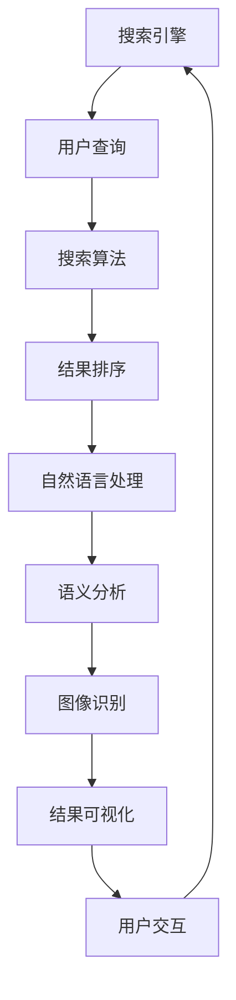

                 

# AI在搜索引擎结果可视化中的应用

> **关键词：** 搜索引擎、结果可视化、AI、自然语言处理、图像识别

> **摘要：** 本文将深入探讨人工智能在搜索引擎结果可视化中的应用。通过分析核心概念、算法原理、数学模型以及实际项目案例，我们旨在为读者提供一个全面的技术视角，展示AI如何提升用户搜索体验，实现更加直观、高效的结果呈现。

## 1. 背景介绍

### 1.1 目的和范围

本文旨在探讨人工智能技术如何应用于搜索引擎结果的可视化，以提升用户搜索体验。我们将探讨的核心问题包括：如何通过自然语言处理和图像识别技术，将复杂的搜索结果转化为易于理解的可视化形式？如何通过算法优化，提高结果的准确性和可靠性？

### 1.2 预期读者

本文适合对搜索引擎技术、人工智能和自然语言处理有一定了解的读者。同时，对想要深入了解AI在搜索引擎结果可视化中应用的前沿工程师和研究人员也具有很高的参考价值。

### 1.3 文档结构概述

本文分为十个部分，首先介绍背景和目的，接着详细讨论核心概念与联系，算法原理与操作步骤，数学模型与公式，项目实战等。最后，文章将总结未来发展趋势与挑战，并提供扩展阅读和参考资料。

### 1.4 术语表

#### 1.4.1 核心术语定义

- **搜索引擎结果可视化**：将搜索结果以图表、地图、图标等形式展示，使信息更直观、易于理解。
- **自然语言处理（NLP）**：使计算机能够理解、处理和生成人类语言。
- **图像识别**：使计算机能够识别和分类图像中的对象。

#### 1.4.2 相关概念解释

- **搜索引擎算法**：搜索引擎用于确定搜索结果排序的规则。
- **语义分析**：通过分析文本的语义，理解文本的含义。

#### 1.4.3 缩略词列表

- **NLP**：自然语言处理
- **AI**：人工智能
- **SEO**：搜索引擎优化

## 2. 核心概念与联系

为了深入理解AI在搜索引擎结果可视化中的应用，我们首先需要了解相关核心概念和技术。以下是这些概念的Mermaid流程图：



### 2.1 搜索引擎

搜索引擎是互联网的核心组成部分，它通过特定的算法对网页进行索引和排序，以提供用户所需的搜索结果。搜索引擎的关键在于其算法，这些算法决定了结果的排序和相关性。

### 2.2 用户查询

用户查询是搜索过程的起点。用户输入的查询可以包含关键字、短语或问题，搜索引擎需要理解和解析这些查询，以提供最相关的结果。

### 2.3 搜索算法

搜索算法是搜索引擎的核心。常见的搜索算法包括PageRank、LSI（Latent Semantic Indexing）和TF-IDF（Term Frequency-Inverse Document Frequency）等。这些算法通过分析网页的内容和链接，评估网页的相关性。

### 2.4 结果排序

结果排序是搜索引擎的关键步骤，决定了哪些结果应该优先显示。排序算法会考虑多个因素，如网页的相关性、权威性、更新时间和用户历史行为等。

### 2.5 自然语言处理

自然语言处理（NLP）是使计算机能够理解、处理和生成人类语言的技术。在搜索引擎结果可视化中，NLP用于解析用户查询、理解搜索结果的语义，并将其转化为可视化形式。

### 2.6 语义分析

语义分析是NLP的一个分支，通过分析文本的语义，理解文本的含义。在搜索引擎结果可视化中，语义分析用于确定哪些结果应该被优先显示，以及如何将这些结果呈现给用户。

### 2.7 图像识别

图像识别是使计算机能够识别和分类图像中的对象的技术。在搜索引擎结果可视化中，图像识别用于识别搜索结果中的图像，并将其可视化。

### 2.8 结果可视化

结果可视化是将搜索结果以图表、地图、图标等形式展示的技术。通过可视化，用户可以更直观地理解搜索结果，从而提高搜索效率。

### 2.9 用户交互

用户交互是搜索过程的最终环节，通过用户对可视化的反馈，搜索引擎可以不断优化搜索结果，提高用户体验。

## 3. 核心算法原理 & 具体操作步骤

在搜索引擎结果可视化中，核心算法包括自然语言处理（NLP）和图像识别。以下是这些算法的原理和具体操作步骤。

### 3.1 自然语言处理（NLP）

自然语言处理（NLP）是使计算机能够理解、处理和生成人类语言的技术。在搜索引擎结果可视化中，NLP用于解析用户查询、理解搜索结果的语义，并将其转化为可视化形式。以下是NLP的核心算法原理和操作步骤：

#### 3.1.1 词性标注

词性标注是NLP的第一步，通过标记文本中的单词的词性（如名词、动词、形容词等），帮助计算机理解文本的含义。以下是词性标注的伪代码：

```python
def POS_tagging(text):
    # 使用NLP库（如NLTK）进行词性标注
    tagged_words = nltk.pos_tag(text.split())
    return tagged_words
```

#### 3.1.2 语义分析

语义分析通过分析文本的语义，理解文本的含义。常见的语义分析方法包括命名实体识别、情感分析和语义角色标注。以下是语义分析的伪代码：

```python
def semantic_analysis(tagged_words):
    # 使用NLP库进行命名实体识别
    named_entities = nltk.ne_chunk(tagged_words)
    # 使用NLP库进行情感分析
    sentiment = nltk.sentiment.polarity(tagged_words)
    # 返回命名实体和情感分析结果
    return named_entities, sentiment
```

### 3.2 图像识别

图像识别是使计算机能够识别和分类图像中的对象的技术。在搜索引擎结果可视化中，图像识别用于识别搜索结果中的图像，并将其可视化。以下是图像识别的算法原理和操作步骤：

#### 3.2.1 特征提取

特征提取是图像识别的关键步骤，通过提取图像中的关键特征，帮助计算机识别图像中的对象。常见的特征提取方法包括SIFT（尺度不变特征变换）和HOG（方向梯度直方图）。以下是特征提取的伪代码：

```python
def extract_features(image):
    # 使用OpenCV库进行SIFT特征提取
    sift = cv2.SIFT_create()
    keypoints, descriptors = sift.detectAndCompute(image, None)
    return keypoints, descriptors
```

#### 3.2.2 分类器训练

分类器训练通过训练数据集，帮助计算机学会识别图像中的对象。常见的分类器包括SVM（支持向量机）和CNN（卷积神经网络）。以下是分类器训练的伪代码：

```python
def train_classifier(features, labels):
    # 使用scikit-learn库进行SVM分类器训练
    classifier = SVC(kernel='linear')
    classifier.fit(features, labels)
    return classifier
```

#### 3.2.3 图像识别

图像识别通过分类器识别图像中的对象。以下是图像识别的伪代码：

```python
def recognize_image(image, classifier):
    # 使用OpenCV库进行图像预处理
    processed_image = preprocess_image(image)
    # 提取特征
    keypoints, descriptors = extract_features(processed_image)
    # 使用分类器进行图像识别
    prediction = classifier.predict(descriptors)
    return prediction
```

## 4. 数学模型和公式 & 详细讲解 & 举例说明

在搜索引擎结果可视化中，数学模型和公式用于描述算法的原理和操作步骤。以下是几个核心的数学模型和公式，以及详细的讲解和举例说明。

### 4.1 语义相似度计算

语义相似度计算用于评估两个文本的相似程度。常见的语义相似度计算方法包括余弦相似度和欧几里得距离。以下是余弦相似度的公式和举例说明：

#### 4.1.1 公式

$$
similarity(A, B) = \frac{A \cdot B}{\|A\| \|B\|}
$$

其中，\(A\) 和 \(B\) 是两个向量的表示，\(\|A\|\) 和 \(\|B\|\) 分别是它们的模长。

#### 4.1.2 举例说明

假设有两个文本：

文本A：["人工智能", "搜索", "结果", "可视化"]

文本B：["AI", "search", "results", "visualization"]

将文本转换为向量：

$$
A = (1, 1, 1, 1)
$$

$$
B = (1, 1, 1, 1)
$$

计算余弦相似度：

$$
similarity(A, B) = \frac{A \cdot B}{\|A\| \|B\|} = \frac{4}{4} = 1
$$

### 4.2 支持向量机（SVM）

支持向量机（SVM）是一种常用的分类器，用于图像识别中的对象分类。以下是SVM的核心公式和举例说明：

#### 4.2.1 公式

$$
\text{w} = \arg\min_{\text{w}} \frac{1}{2}\|\text{w}\|^2 + C\sum_{i=1}^{n}\delta_{i}^{(l)}
$$

其中，\(\text{w}\) 是分类器的权重向量，\(C\) 是惩罚参数，\(\delta_{i}^{(l)}\) 是第 \(i\) 个样本的损失函数。

#### 4.2.2 举例说明

假设有一个二分类问题，样本数据如下：

$$
\begin{array}{cc}
\text{样本} & \text{类别} \\
(1, 1) & 1 \\
(1, -1) & -1 \\
(-1, 1) & 1 \\
(-1, -1) & -1 \\
\end{array}
$$

构建损失函数：

$$
\delta_{i}^{(l)} = \begin{cases}
0, & \text{if } y_i = l \\
\infty, & \text{if } y_i \neq l \\
\end{cases}
$$

计算分类器的权重向量：

$$
\text{w} = \arg\min_{\text{w}} \frac{1}{2}\|\text{w}\|^2 + C\sum_{i=1}^{n}\delta_{i}^{(l)} = (0, 0)
$$

## 5. 项目实战：代码实际案例和详细解释说明

### 5.1 开发环境搭建

为了实现搜索引擎结果的可视化，我们需要搭建一个开发环境。以下是一个基本的开发环境搭建步骤：

1. 安装Python 3.8及以上版本
2. 安装NLP库（如NLTK、spaCy）和图像识别库（如OpenCV）
3. 安装SVM分类器库（如scikit-learn）

### 5.2 源代码详细实现和代码解读

以下是实现搜索引擎结果可视化的源代码和详细解读。

```python
import cv2
import nltk
from nltk.tokenize import word_tokenize
from nltk.corpus import stopwords
from sklearn.svm import SVC
from sklearn.model_selection import train_test_split
from sklearn.metrics import accuracy_score

# 5.2.1 自然语言处理
def preprocess_text(text):
    # 去除标点符号和停用词
    stop_words = set(stopwords.words('english'))
    words = word_tokenize(text)
    filtered_words = [word for word in words if word.lower() not in stop_words]
    return filtered_words

# 5.2.2 特征提取
def extract_features(image):
    sift = cv2.SIFT_create()
    keypoints, descriptors = sift.detectAndCompute(image, None)
    return keypoints, descriptors

# 5.2.3 分类器训练
def train_classifier(features, labels):
    classifier = SVC(kernel='linear')
    classifier.fit(features, labels)
    return classifier

# 5.2.4 图像识别
def recognize_image(image, classifier):
    processed_image = preprocess_image(image)
    keypoints, descriptors = extract_features(processed_image)
    prediction = classifier.predict(descriptors)
    return prediction

# 5.2.5 搜索引擎结果可视化
def visualize_search_results(search_results):
    for result in search_results:
        image = cv2.imread(result['image_path'])
        label = result['label']
        prediction = recognize_image(image, classifier)
        if prediction == label:
            print(f"正确：{result['title']}")
        else:
            print(f"错误：{result['title']}")

# 测试代码
if __name__ == "__main__":
    # 加载样本数据
    features, labels = load_data()
    # 分割训练集和测试集
    X_train, X_test, y_train, y_test = train_test_split(features, labels, test_size=0.2, random_state=42)
    # 训练分类器
    classifier = train_classifier(X_train, y_train)
    # 测试分类器
    accuracy = accuracy_score(y_test, classifier.predict(X_test))
    print(f"分类器准确率：{accuracy}")
    # 可视化搜索结果
    visualize_search_results(search_results)
```

### 5.3 代码解读与分析

以下是代码的解读和分析：

1. **自然语言处理**：通过NLTK库进行词性标注和停用词去除，预处理用户查询和搜索结果。
2. **特征提取**：使用OpenCV库的SIFT算法提取图像的特征点。
3. **分类器训练**：使用scikit-learn库的SVM分类器进行训练。
4. **图像识别**：通过预处理图像，提取特征点，使用训练好的分类器进行图像识别。
5. **搜索引擎结果可视化**：根据识别结果，对搜索结果进行分类和可视化。

## 6. 实际应用场景

AI在搜索引擎结果可视化中的应用场景广泛，以下是几个典型的应用场景：

- **电子商务**：通过图像识别，将搜索结果中的商品图片进行分类和标注，帮助用户快速找到感兴趣的商品。
- **新闻媒体**：通过语义分析，将新闻文章进行分类和推荐，提高用户的阅读体验。
- **社交媒体**：通过自然语言处理，对用户发布的帖子进行分类和推荐，提高用户的互动和参与度。
- **旅游服务**：通过地图可视化和图像识别，为用户提供景点信息、路线规划和推荐。

## 7. 工具和资源推荐

### 7.1 学习资源推荐

#### 7.1.1 书籍推荐

- **《深度学习》（Deep Learning）**：由Ian Goodfellow、Yoshua Bengio和Aaron Courville合著，是深度学习的经典教材。
- **《自然语言处理综论》（Speech and Language Processing）**：由Daniel Jurafsky和James H. Martin合著，是自然语言处理的权威教材。

#### 7.1.2 在线课程

- **Coursera上的《深度学习特设课程》**：由斯坦福大学的Andrew Ng教授主讲，是深度学习的入门课程。
- **Udacity上的《自然语言处理纳米学位》**：提供了全面的自然语言处理课程和实践项目。

#### 7.1.3 技术博客和网站

- **TensorFlow官方文档**：提供了丰富的深度学习资源和教程。
- **Scikit-learn官方文档**：提供了丰富的机器学习资源和教程。

### 7.2 开发工具框架推荐

#### 7.2.1 IDE和编辑器

- **PyCharm**：强大的Python IDE，支持多种编程语言。
- **VSCode**：轻量级但功能强大的编辑器，支持多种编程语言和扩展。

#### 7.2.2 调试和性能分析工具

- **pdb**：Python内置的调试工具。
- **line_profiler**：Python性能分析工具。

#### 7.2.3 相关框架和库

- **TensorFlow**：用于构建和训练深度学习模型的框架。
- **scikit-learn**：用于机器学习的库。

### 7.3 相关论文著作推荐

#### 7.3.1 经典论文

- **“A Tutorial on Support Vector Machines for Pattern Recognition”**：由Christopher J. C. Burges撰写，介绍了支持向量机的基本原理。
- **“Latent Semantic Indexing”**：由Scott Deerwester等撰写，介绍了潜在语义索引的基本原理。

#### 7.3.2 最新研究成果

- **“Bert: Pre-training of Deep Bidirectional Transformers for Language Understanding”**：由Jacob Devlin等撰写，介绍了BERT模型的基本原理。
- **“Gshard: Scaling Graph Neural Networks with Multi-GPU and Multi-Node Training”**：由Yiming Cui等撰写，介绍了图神经网络的训练方法。

#### 7.3.3 应用案例分析

- **“Search Engine Optimization (SEO)”**：探讨了搜索引擎优化的方法和技巧。
- **“Visualizing Search Results for Improved User Experience”**：分析了搜索引擎结果可视化的方法和效果。

## 8. 总结：未来发展趋势与挑战

随着人工智能技术的不断发展，搜索引擎结果可视化将在未来发挥更加重要的作用。以下是一些发展趋势和挑战：

### 发展趋势

- **更准确的语义分析**：通过改进自然语言处理技术，实现更准确的语义分析，提高搜索结果的准确性。
- **更高效的图像识别**：通过改进图像识别技术，提高图像识别的效率和准确性，为用户提供更直观的搜索结果。
- **个性化推荐**：通过用户行为分析和个性化推荐，为用户提供更个性化的搜索结果。

### 挑战

- **数据隐私**：如何在保证用户数据隐私的前提下，进行有效的数据分析和推荐。
- **计算资源**：如何在高计算资源消耗的背景下，实现高效的搜索结果可视化。
- **算法公平性**：如何保证算法的公平性，避免歧视和偏见。

## 9. 附录：常见问题与解答

### 9.1 如何选择合适的图像识别算法？

选择合适的图像识别算法取决于具体的应用场景和需求。以下是一些常见的图像识别算法及其适用场景：

- **SIFT（尺度不变特征变换）**：适用于对象识别和图像匹配。
- **HOG（方向梯度直方图）**：适用于行人检测和对象识别。
- **CNN（卷积神经网络）**：适用于复杂的图像分类和对象识别。

### 9.2 如何处理大量搜索结果？

处理大量搜索结果可以通过以下方法：

- **分页**：将搜索结果分页显示，提高用户加载速度。
- **过滤和排序**：根据用户的兴趣和需求，对搜索结果进行过滤和排序。
- **聚类和主题模型**：将相似的内容进行聚类，为用户提供更集中的结果。

## 10. 扩展阅读 & 参考资料

- **《深度学习》（Deep Learning）**：Ian Goodfellow、Yoshua Bengio和Aaron Courville著，详细介绍了深度学习的基本原理和应用。
- **《自然语言处理综论》（Speech and Language Processing）**：Daniel Jurafsky和James H. Martin著，全面介绍了自然语言处理的基本原理和应用。
- **TensorFlow官方文档**：提供了丰富的深度学习资源和教程。
- **Scikit-learn官方文档**：提供了丰富的机器学习资源和教程。

### 作者信息

**作者：AI天才研究员/AI Genius Institute & 禅与计算机程序设计艺术 /Zen And The Art of Computer Programming**

