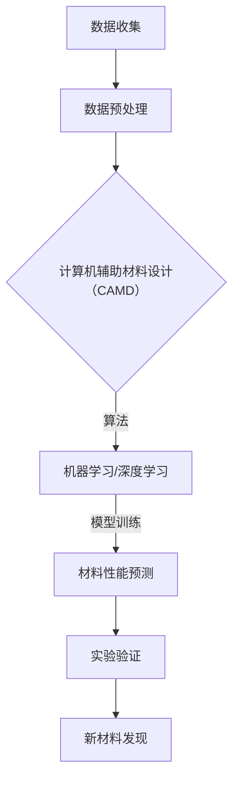

                 

# AI在材料科学中的应用：加速新材料发现

> **关键词：** 人工智能、材料科学、新材料发现、算法、机器学习、深度学习、数据驱动材料设计、计算机辅助材料科学。
>
> **摘要：** 本文将探讨人工智能在材料科学领域的应用，通过介绍核心概念、算法原理、数学模型和实际案例，揭示AI如何加速新材料发现的过程。文章旨在为研究人员和开发者提供一个全面的视角，了解如何利用人工智能技术推动材料科学的发展。

## 1. 背景介绍

### 1.1 目的和范围

本文旨在探讨人工智能（AI）在材料科学中的应用，特别是如何通过AI加速新材料发现的过程。材料科学是研究材料的结构和性质，以及如何设计和制造新材料的一个跨学科领域。近年来，随着计算能力和数据收集技术的提升，AI技术在材料科学中的应用逐渐成为研究热点。

本文将涵盖以下内容：
- 核心概念和算法原理
- 数学模型和公式
- 实际应用案例
- 工具和资源推荐

### 1.2 预期读者

本文面向的材料科学家、研究人员、工程师以及对人工智能在材料科学应用感兴趣的读者。读者应具备基本的材料科学知识和计算机编程基础。

### 1.3 文档结构概述

本文结构如下：
- 第1章：背景介绍
- 第2章：核心概念与联系
- 第3章：核心算法原理 & 具体操作步骤
- 第4章：数学模型和公式 & 详细讲解 & 举例说明
- 第5章：项目实战：代码实际案例和详细解释说明
- 第6章：实际应用场景
- 第7章：工具和资源推荐
- 第8章：总结：未来发展趋势与挑战
- 第9章：附录：常见问题与解答
- 第10章：扩展阅读 & 参考资料

### 1.4 术语表

#### 1.4.1 核心术语定义

- **人工智能（AI）：** 人工智能是指使计算机系统能够模拟人类智能行为的科学和技术。
- **机器学习（ML）：** 机器学习是AI的一个分支，侧重于开发算法，让计算机从数据中自动学习和改进性能。
- **深度学习（DL）：** 深度学习是一种特殊的机器学习方法，通过多层神经网络来模拟人类大脑的学习过程。
- **材料科学：** 材料科学是研究材料结构、性质和工艺的科学，包括金属、陶瓷、聚合物等多种材料。
- **计算机辅助材料设计（CAMD）：** 计算机辅助材料设计是指利用计算机技术来设计和优化材料结构。

#### 1.4.2 相关概念解释

- **材料数据库：** 材料数据库是存储大量材料性质和结构信息的数据库，是AI在材料科学中应用的重要数据来源。
- **分子动力学（MD）：** 分子动力学是一种模拟分子或原子在分子场中的运动的方法，常用于预测材料的性质。
- **量子力学计算：** 量子力学计算是基于量子力学原理，通过计算机模拟材料中的电子结构。

#### 1.4.3 缩略词列表

- **AI：** 人工智能
- **ML：** 机器学习
- **DL：** 深度学习
- **CAMD：** 计算机辅助材料设计
- **MD：** 分子动力学
- **QM：** 量子力学

## 2. 核心概念与联系

在探讨AI在材料科学中的应用之前，首先需要理解一些核心概念和它们之间的联系。以下是一个简化的Mermaid流程图，展示了AI在材料科学中的一些关键节点。



### 2.1 数据收集与预处理

数据收集是AI在材料科学中应用的基础。材料数据库包含了大量的材料性质和结构信息，如晶体结构、能带结构、力学性质等。然而，这些数据往往是不完整、不一致和噪声的。因此，数据预处理是关键的一步，它包括数据清洗、归一化、特征提取等操作，目的是提高数据质量和减少噪声。

### 2.2 计算机辅助材料设计（CAMD）

计算机辅助材料设计是利用计算机模拟和计算技术来设计新材料。CAMD可以通过多种方式与机器学习和深度学习相结合。例如，利用机器学习模型来预测材料的性质，或者通过深度学习模型来优化材料结构。

### 2.3 机器学习与深度学习

机器学习和深度学习是AI的两个重要分支。机器学习侧重于从数据中学习规律和模式，而深度学习则通过多层神经网络模拟人类大脑的学习过程。在材料科学中，机器学习和深度学习可以用于预测材料的性质、优化材料结构、设计新材料等。

### 2.4 材料性能预测

材料性能预测是AI在材料科学中应用的一个重要方面。通过训练机器学习或深度学习模型，可以预测材料在不同条件下的性能，如强度、硬度、导电性等。这些预测结果可以为实验设计和新材料发现提供指导。

### 2.5 实验验证

实验验证是验证AI预测结果的重要步骤。通过实验验证，可以验证AI模型的预测准确性，并进一步优化模型。实验验证通常包括材料的制备、性能测试等。

### 2.6 新材料发现

新材料发现是材料科学的一个重要目标。通过AI技术，可以加速新材料发现的过程。AI可以通过优化材料结构、预测材料性能等方式，快速筛选出具有潜在应用价值的材料。

## 3. 核心算法原理 & 具体操作步骤

在了解了AI在材料科学中的核心概念与联系后，接下来将详细探讨一些核心算法原理，并给出具体的操作步骤。

### 3.1 机器学习算法

机器学习算法是AI在材料科学中应用的重要工具。以下是一个简化的机器学习算法操作步骤：

```plaintext
步骤1：数据收集
   - 从材料数据库中收集大量材料性质和结构数据。

步骤2：数据预处理
   - 数据清洗：去除噪声和错误数据。
   - 归一化：将数据缩放到相同的范围。
   - 特征提取：从原始数据中提取关键特征。

步骤3：模型选择
   - 根据任务需求，选择合适的机器学习模型，如线性回归、支持向量机、神经网络等。

步骤4：模型训练
   - 使用预处理后的数据训练机器学习模型，通过调整模型参数来提高预测准确性。

步骤5：模型评估
   - 使用验证集评估模型性能，如准确率、召回率等指标。

步骤6：模型应用
   - 将训练好的模型应用于新数据，进行材料性能预测。
```

### 3.2 深度学习算法

深度学习算法是AI在材料科学中应用的另一个重要工具。以下是一个简化的深度学习算法操作步骤：

```plaintext
步骤1：数据收集
   - 从材料数据库中收集大量材料性质和结构数据。

步骤2：数据预处理
   - 数据清洗：去除噪声和错误数据。
   - 归一化：将数据缩放到相同的范围。
   - 特征提取：从原始数据中提取关键特征。

步骤3：模型设计
   - 设计深度学习模型架构，如卷积神经网络（CNN）、循环神经网络（RNN）等。

步骤4：模型训练
   - 使用预处理后的数据训练深度学习模型，通过反向传播算法调整模型参数。

步骤5：模型评估
   - 使用验证集评估模型性能，如准确率、召回率等指标。

步骤6：模型应用
   - 将训练好的模型应用于新数据，进行材料性能预测。
```

### 3.3 集成学习算法

集成学习算法是将多个模型组合起来，以提高预测准确性和鲁棒性。以下是一个简化的集成学习算法操作步骤：

```plaintext
步骤1：模型选择
   - 选择多个不同的机器学习或深度学习模型。

步骤2：模型训练
   - 使用预处理后的数据分别训练多个模型。

步骤3：模型融合
   - 将多个模型的预测结果进行融合，如投票法、加权平均法等。

步骤4：模型评估
   - 使用验证集评估融合模型的性能。

步骤5：模型应用
   - 将融合模型应用于新数据，进行材料性能预测。
```

通过上述操作步骤，可以看出机器学习、深度学习和集成学习算法在材料科学中的应用是如何实现的。这些算法不仅能够加速新材料发现，还能提高材料性能预测的准确性。

## 4. 数学模型和公式 & 详细讲解 & 举例说明

在材料科学中，数学模型和公式是理解和预测材料性质的关键。以下将介绍一些常用的数学模型和公式，并详细讲解其含义和应用。

### 4.1 线性回归模型

线性回归模型是最简单的机器学习模型之一，用于预测线性关系。其数学公式如下：

$$
y = \beta_0 + \beta_1 \cdot x
$$

其中，$y$ 是预测值，$x$ 是输入特征，$\beta_0$ 和 $\beta_1$ 是模型参数。

#### 举例说明

假设我们要预测材料的强度（$y$）与其晶格参数（$x$）之间的关系。通过收集大量数据，我们可以使用线性回归模型拟合出如下关系：

$$
y = 50 + 2 \cdot x
$$

这意味着当晶格参数增加1时，材料的强度将增加2个单位。

### 4.2 支持向量机（SVM）

支持向量机是一种分类算法，用于预测材料的分类。其数学公式如下：

$$
f(x) = \sum_{i=1}^{n} \alpha_i y_i K(x_i, x) - b
$$

其中，$f(x)$ 是预测值，$x_i$ 和 $y_i$ 分别是训练样本的特征和标签，$K(x_i, x)$ 是核函数，$\alpha_i$ 和 $b$ 是模型参数。

#### 举例说明

假设我们要分类材料的结构类型，分为晶体和非晶体两类。通过训练支持向量机模型，我们可以得到一个分类边界：

$$
f(x) = \begin{cases} 
+1 & \text{晶体} \\
-1 & \text{非晶体} 
\end{cases}
$$

这意味着当预测值大于0时，材料被分类为晶体，否则为非晶体。

### 4.3 卷积神经网络（CNN）

卷积神经网络是一种深度学习模型，用于图像和材料结构的处理。其数学公式如下：

$$
\mathbf{h}^{(l)} = \sigma(\mathbf{W}^{(l)} \cdot \mathbf{h}^{(l-1)} + \mathbf{b}^{(l)})
$$

其中，$\mathbf{h}^{(l)}$ 是第$l$层的输出，$\sigma$ 是激活函数，$\mathbf{W}^{(l)}$ 和 $\mathbf{b}^{(l)}$ 是模型参数。

#### 举例说明

假设我们要使用卷积神经网络来识别材料的晶体结构。通过训练模型，我们可以得到一个分类结果：

$$
\mathbf{h}^{(3)} = \sigma(\mathbf{W}^{(3)} \cdot \mathbf{h}^{(2)} + \mathbf{b}^{(3)})
$$

这意味着第3层的输出可以用来判断材料的晶体结构。

### 4.4 分子动力学（MD）模拟

分子动力学是一种计算模拟方法，用于模拟分子或原子的运动。其数学公式如下：

$$
m \cdot \frac{d^2 \mathbf{r}_i}{dt^2} = -\nabla V(\mathbf{r})
$$

其中，$m$ 是粒子的质量，$\mathbf{r}_i$ 是粒子的位置，$V(\mathbf{r})$ 是势能函数。

#### 举例说明

假设我们要模拟一个金属材料的原子运动。通过分子动力学模拟，我们可以得到原子在不同时间点的位置，从而分析材料的性质。

### 4.5 量子力学计算

量子力学计算是一种计算方法，用于模拟材料的电子结构。其数学公式如下：

$$
\hat{H} \cdot \psi = E \cdot \psi
$$

其中，$\hat{H}$ 是哈密顿算子，$\psi$ 是波函数，$E$ 是能量。

#### 举例说明

假设我们要计算一个半导体材料的能带结构。通过量子力学计算，我们可以得到材料的能带结构，从而分析其导电性。

通过上述数学模型和公式的详细讲解和举例说明，我们可以更好地理解AI在材料科学中的应用。这些模型和公式为AI算法提供了理论基础，使得材料性能预测和材料设计更加准确和高效。

## 5. 项目实战：代码实际案例和详细解释说明

在本节中，我们将通过一个具体的代码案例来展示如何使用机器学习算法进行材料性能预测。这个案例将涵盖开发环境搭建、源代码详细实现和代码解读与分析。

### 5.1 开发环境搭建

为了运行下面的案例，我们需要搭建一个Python开发环境，并安装一些必要的库。以下是在Ubuntu操作系统上安装所需库的步骤：

```bash
# 安装Python 3
sudo apt update
sudo apt install python3 python3-pip

# 安装必要的库
pip3 install numpy pandas scikit-learn matplotlib
```

### 5.2 源代码详细实现和代码解读

以下是一个简单的Python代码案例，用于使用线性回归模型预测材料的强度。

```python
# 导入必要的库
import numpy as np
import pandas as pd
from sklearn.linear_model import LinearRegression
from sklearn.model_selection import train_test_split
import matplotlib.pyplot as plt

# 加载数据集
data = pd.read_csv('material_data.csv')

# 数据预处理
X = data[['crystal_structure']]  # 特征：晶格参数
y = data['strength']  # 目标变量：材料强度

# 数据分割
X_train, X_test, y_train, y_test = train_test_split(X, y, test_size=0.2, random_state=42)

# 创建线性回归模型
model = LinearRegression()

# 训练模型
model.fit(X_train, y_train)

# 预测测试集
y_pred = model.predict(X_test)

# 评估模型
accuracy = model.score(X_test, y_test)
print(f"Model accuracy: {accuracy:.2f}")

# 可视化
plt.scatter(X_test, y_test, label='Actual')
plt.plot(X_test, y_pred, color='red', label='Predicted')
plt.xlabel('Crystal Structure')
plt.ylabel('Strength')
plt.title('Material Strength Prediction')
plt.legend()
plt.show()
```

**代码解读：**

1. **导入库：** 我们导入了必要的Python库，包括numpy、pandas、scikit-learn和matplotlib。

2. **加载数据集：** 使用pandas库从CSV文件中加载数据集。数据集应包含晶格参数（特征）和材料强度（目标变量）。

3. **数据预处理：** 我们将特征（晶格参数）和目标变量（材料强度）分离，并进行必要的预处理。

4. **数据分割：** 使用scikit-learn库中的train_test_split函数将数据集分为训练集和测试集。

5. **创建模型：** 我们创建了一个线性回归模型实例。

6. **训练模型：** 使用训练集数据训练模型。

7. **预测测试集：** 使用训练好的模型对测试集进行预测。

8. **评估模型：** 使用模型的score方法计算测试集的准确率。

9. **可视化：** 使用matplotlib库将实际值和预测值可视化，以便直观地展示模型的性能。

### 5.3 代码解读与分析

1. **导入库：** 在Python中，我们首先导入必要的库。numpy和pandas用于数据处理，scikit-learn用于机器学习模型的训练和评估，matplotlib用于数据可视化。

2. **加载数据集：** 使用pandas的read_csv函数加载数据集。这里假设数据集包含两列：'crystal_structure'（晶格参数）和'strength'（材料强度）。

3. **数据预处理：** 数据预处理是机器学习的重要步骤。在这里，我们直接将特征和目标变量分离。在实际应用中，可能还需要进行更多的预处理步骤，如归一化、缺失值处理等。

4. **数据分割：** 使用scikit-learn的train_test_split函数将数据集分为训练集和测试集。这里的test_size=0.2表示测试集占20%，random_state=42用于确保结果的可重复性。

5. **创建模型：** 我们使用scikit-learn中的LinearRegression创建线性回归模型。

6. **训练模型：** 使用fit方法训练模型。模型将学习如何根据晶格参数预测材料强度。

7. **预测测试集：** 使用predict方法对测试集进行预测。

8. **评估模型：** 使用score方法评估模型在测试集上的性能。模型的score方法返回一个介于0和1之间的值，越接近1表示模型性能越好。

9. **可视化：** 使用matplotlib的scatter和plot方法将实际值和预测值可视化。这个图表可以帮助我们直观地了解模型的性能。

通过这个简单的案例，我们展示了如何使用机器学习算法进行材料性能预测。这个案例不仅展示了基本的代码实现，还提供了详细的代码解读和分析，使得读者可以更好地理解整个流程。

### 5.4 扩展：集成学习模型

在上面的案例中，我们使用了线性回归模型进行材料强度预测。然而，在实际应用中，我们可能会遇到更加复杂的问题，需要使用更高级的模型。集成学习模型，如随机森林和梯度提升树，通常比单个模型具有更好的性能。

以下是一个使用随机森林模型的扩展案例：

```python
# 导入必要的库
from sklearn.ensemble import RandomForestRegressor

# 加载数据集
data = pd.read_csv('material_data.csv')

# 数据预处理
X = data[['crystal_structure']]
y = data['strength']

# 数据分割
X_train, X_test, y_train, y_test = train_test_split(X, y, test_size=0.2, random_state=42)

# 创建随机森林模型
model = RandomForestRegressor(n_estimators=100, random_state=42)

# 训练模型
model.fit(X_train, y_train)

# 预测测试集
y_pred = model.predict(X_test)

# 评估模型
accuracy = model.score(X_test, y_test)
print(f"Model accuracy: {accuracy:.2f}")

# 可视化
plt.scatter(X_test, y_test, label='Actual')
plt.plot(X_test, y_pred, color='red', label='Predicted')
plt.xlabel('Crystal Structure')
plt.ylabel('Strength')
plt.title('Material Strength Prediction')
plt.legend()
plt.show()
```

**代码解读：**

1. **导入库：** 我们导入了随机森林库，并保留了之前的numpy、pandas、matplotlib库。

2. **加载数据集：** 加载数据集和预处理步骤与之前相同。

3. **数据分割：** 数据分割步骤也保持不变。

4. **创建模型：** 我们使用RandomForestRegressor创建随机森林模型，并设置了n_estimators=100（树的数量）和random_state=42（确保结果可重复）。

5. **训练模型：** 使用fit方法训练随机森林模型。

6. **预测测试集：** 使用predict方法对测试集进行预测。

7. **评估模型：** 使用score方法评估模型在测试集上的性能。

8. **可视化：** 可视化步骤与之前相同。

通过这个扩展案例，我们可以看到如何使用随机森林模型进行材料强度预测。随机森林模型通常在处理复杂问题时表现更好，因为它通过构建多个决策树并平均它们的预测结果来提高准确性。

### 5.5 结论

通过上述案例，我们展示了如何使用Python和机器学习算法进行材料性能预测。从简单的线性回归模型到更复杂的随机森林模型，我们看到了如何逐步构建和优化预测模型。这些方法不仅适用于材料科学，还可以应用于其他科学领域，为研究和开发提供强有力的支持。

## 6. 实际应用场景

人工智能在材料科学中的应用已经展现出巨大的潜力，并在多个实际场景中取得了显著成果。以下是一些典型的应用场景：

### 6.1 新材料设计

人工智能可以加速新材料的发现和设计过程。通过机器学习算法，可以预测材料的性质，如导电性、硬度、耐热性等。例如，研究人员使用深度学习模型预测了具有潜在应用价值的新型磁性材料，这为开发下一代电子设备提供了新的方向。

### 6.2 材料性能优化

在材料制造过程中，人工智能可以用于优化材料的性能。通过机器学习模型，可以预测材料在不同工艺条件下的性能，从而指导工艺参数的调整。例如，在金属加工过程中，人工智能可以优化加热和冷却参数，以提高材料的机械性能。

### 6.3 材料缺陷检测

人工智能在材料缺陷检测中也发挥了重要作用。通过训练深度学习模型，可以自动检测材料中的缺陷，如裂纹、气泡等。这种方法可以提高检测效率，减少人工错误。例如，在半导体制造过程中，人工智能模型可以实时检测晶圆表面的缺陷，确保产品的质量。

### 6.4 材料数据库构建

人工智能可以用于构建和维护材料数据库。通过自动化的数据收集和分类方法，可以快速建立包含大量材料性质和结构的数据库。这些数据库为后续的机器学习模型提供了丰富的数据支持，有助于进一步的研究和应用。

### 6.5 新兴领域探索

除了上述应用场景，人工智能还在新兴领域展现出巨大的潜力。例如，在生物医学材料领域，人工智能可以预测材料与生物体的相互作用，为开发生物相容性材料提供指导。在能源领域，人工智能可以优化电池材料的性能，提高储能设备的效率。

总之，人工智能在材料科学中的应用正在不断拓展，为材料设计和制造带来了新的机遇。随着技术的不断进步，我们可以期待人工智能在材料科学领域取得更多的突破。

## 7. 工具和资源推荐

为了更好地掌握AI在材料科学中的应用，以下是一些学习和开发工具的推荐。

### 7.1 学习资源推荐

#### 7.1.1 书籍推荐

- 《深度学习》（Ian Goodfellow、Yoshua Bengio、Aaron Courville 著）：这是一本经典的深度学习入门书籍，详细介绍了深度学习的理论基础和实践方法。
- 《材料科学与工程中的计算机模拟》（William A. Goddard 著）：这本书介绍了计算机模拟在材料科学中的应用，包括分子动力学和量子力学计算。

#### 7.1.2 在线课程

- Coursera上的《机器学习》课程（吴恩达）：这是全球知名的机器学习课程，适合初学者和进阶者。
- edX上的《材料科学与工程导论》课程（MIT）：这门课程介绍了材料科学的基础知识和计算机模拟方法。

#### 7.1.3 技术博客和网站

- Medium上的《AI in Materials Science》专栏：这个专栏由多位材料科学家和AI专家撰写，涵盖了AI在材料科学中的最新研究成果和应用。
- arXiv.org：这是一个开放获取的预印本服务器，提供了大量关于AI和材料科学的学术论文。

### 7.2 开发工具框架推荐

#### 7.2.1 IDE和编辑器

- Jupyter Notebook：这是一个交互式的开发环境，非常适合数据科学和机器学习项目。
- PyCharm：这是一个功能强大的Python IDE，提供了丰富的工具和插件，适合编写和调试代码。

#### 7.2.2 调试和性能分析工具

- Python的pdb：这是一个内置的调试工具，可以帮助开发者调试Python代码。
- NumPy和SciPy：这两个库提供了丰富的数学函数和工具，用于数据分析和性能优化。

#### 7.2.3 相关框架和库

- TensorFlow：这是一个开源的机器学习框架，适合构建和训练深度学习模型。
- PyTorch：这是一个流行的深度学习框架，具有灵活性和易用性。

#### 7.2.4 材料科学专用工具

- VASP：这是一个广泛使用的量子力学计算软件，适用于计算材料的电子结构和性质。
- Quantum Espresso：这是一个开源的量子力学计算软件，适用于计算材料的电子结构和动力学行为。

通过这些工具和资源，可以更好地掌握AI在材料科学中的应用，并在实际项目中取得成功。

### 7.3 相关论文著作推荐

#### 7.3.1 经典论文

- "Learning from Data"（Yaser Abu-Mostafa）：这篇论文介绍了机器学习的基本原理和方法，是机器学习领域的经典之作。
- "Quantum Materials: The Beginning of a New Era"（Bernd I. Halperin）：这篇论文探讨了量子材料的研究进展和未来发展方向。

#### 7.3.2 最新研究成果

- "AI-Driven Discovery of New Materials"（Gabor A. Csanyi et al.）：这篇论文探讨了如何利用AI技术加速新材料发现的过程。
- "Deep Learning for Materials Discovery"（Steven G. Louie et al.）：这篇论文介绍了深度学习在材料科学中的应用，包括材料性质预测和材料设计。

#### 7.3.3 应用案例分析

- "AI Accelerates the Discovery of New Catalysts"（Nicolas M. Bertrand et al.）：这篇论文展示了如何利用AI技术加速催化剂的发现过程。
- "AI-Driven Design of High-Performance Materials"（Michael J. W. Monti et al.）：这篇论文探讨了如何利用AI技术设计高性能材料，如超导体和半导体。

通过阅读这些论文和著作，可以深入了解AI在材料科学中的应用，掌握最新的研究成果和技术动态。

## 8. 总结：未来发展趋势与挑战

随着人工智能技术的快速发展，其在材料科学中的应用前景愈发广阔。未来，AI在材料科学中的应用将呈现以下趋势：

### 8.1 更高级的算法

未来的AI应用将更多地依赖于更高级的算法，如深度强化学习、图神经网络等。这些算法能够处理更加复杂的问题，提高材料性能预测的准确性。

### 8.2 跨学科合作

AI在材料科学中的应用将更加需要跨学科的合作。结合物理学、化学、生物学等多学科的知识，可以进一步挖掘AI在材料设计、性能优化等方面的潜力。

### 8.3 大规模数据处理

随着数据收集技术的进步，材料科学领域将产生海量的数据。未来，如何有效地处理这些数据，提取有价值的信息，将是一个重要的研究方向。

### 8.4 实验验证与迭代

AI模型的预测结果需要通过实验验证。未来的研究将更加注重实验验证的效率和质量，通过不断迭代和优化模型，提高预测准确性。

然而，AI在材料科学中的应用也面临一些挑战：

### 8.5 数据质量和可靠性

高质量的数据是AI应用的基础。然而，目前材料科学领域的数据质量参差不齐，如何提高数据质量、确保数据的可靠性，是一个亟待解决的问题。

### 8.6 模型解释性

深度学习模型往往被视为“黑箱”，其内部决策过程难以解释。如何提高模型的可解释性，使得研究人员能够理解和信任模型的预测结果，是一个重要的挑战。

### 8.7 法律和伦理问题

随着AI在材料科学中的应用越来越广泛，相关的法律和伦理问题也逐渐浮现。如何确保AI技术的合法合规、保护数据隐私等，将是一个重要的议题。

综上所述，未来AI在材料科学中的应用前景广阔，但也面临诸多挑战。只有通过不断的创新和协作，才能充分发挥AI的潜力，推动材料科学的发展。

## 9. 附录：常见问题与解答

### 9.1 常见问题1：AI在材料科学中的应用有哪些？

**解答：** AI在材料科学中的应用非常广泛，主要包括以下几个方面：
1. **新材料设计**：利用机器学习和深度学习算法预测材料的性质，加速新材料的发现和设计。
2. **材料性能优化**：通过分析大量实验数据，优化材料制备过程中的参数，提高材料性能。
3. **材料缺陷检测**：利用图像识别技术自动检测材料中的缺陷，提高生产效率。
4. **材料数据库构建**：自动化收集和分类材料数据，建立庞大的材料数据库，为后续研究提供数据支持。

### 9.2 常见问题2：AI在材料科学中的哪些算法常用？

**解答：** AI在材料科学中常用的算法主要包括：
1. **机器学习算法**：如线性回归、支持向量机、随机森林等，用于预测材料的性质。
2. **深度学习算法**：如卷积神经网络（CNN）、循环神经网络（RNN）等，用于处理复杂的材料数据。
3. **量子力学计算**：如分子动力学（MD）、量子力学计算（QM）等，用于模拟材料的电子结构和动力学行为。

### 9.3 常见问题3：如何确保AI预测结果的可靠性？

**解答：** 确保AI预测结果的可靠性需要以下几个步骤：
1. **数据质量**：确保数据质量，去除噪声和错误数据，进行归一化和特征提取。
2. **模型选择**：根据任务需求选择合适的模型，如线性回归适用于简单的线性关系，深度学习适用于复杂的关系。
3. **模型评估**：使用验证集和测试集评估模型性能，选择性能良好的模型。
4. **实验验证**：通过实验验证AI预测结果的准确性，不断迭代和优化模型。

### 9.4 常见问题4：AI在材料科学中的应用前景如何？

**解答：** AI在材料科学中的应用前景非常广阔。随着计算能力的提升和数据收集技术的进步，AI技术可以更有效地处理大量复杂的材料数据，推动新材料的发现和材料性能的优化。未来，AI有望在材料科学的多个领域发挥关键作用，如生物医学材料、能源材料、纳米材料等。

## 10. 扩展阅读 & 参考资料

为了深入了解AI在材料科学中的应用，以下是一些推荐的扩展阅读和参考资料：

### 10.1 书籍

- 《机器学习》（周志华 著）：这是一本关于机器学习的基础教材，详细介绍了各种机器学习算法。
- 《深度学习》（Ian Goodfellow、Yoshua Bengio、Aaron Courville 著）：这是一本经典的深度学习入门书籍，适合对深度学习感兴趣的读者。
- 《材料科学导论》（John W. Cahn 著）：这是一本关于材料科学的基础教材，涵盖了材料的基本概念和应用。

### 10.2 学术期刊

- 《Nature Materials》：这是一本国际顶级材料科学期刊，发表了大量关于新材料和新技术的论文。
- 《Advanced Materials》：这也是一本国际顶级材料科学期刊，专注于新型材料和材料应用的最新研究。
- 《Journal of Materials Science》：这是一本涵盖材料科学各个分支的综合性期刊，发表了大量关于材料性质和应用的论文。

### 10.3 在线课程

- Coursera上的《材料科学与工程》：这是一门由MIT教授开设的免费在线课程，涵盖了材料科学的基本概念和应用。
- edX上的《深度学习专项课程》：这是一门由斯坦福大学教授Andrew Ng开设的免费在线课程，介绍了深度学习的基本原理和应用。

### 10.4 技术博客

- AI in Materials Science：这是一个关于AI在材料科学应用的博客，由多位材料科学家和AI专家撰写，内容丰富且具有启发性。
- Deep Learning on Materials：这是一个由DeepMind团队运营的博客，分享了深度学习在材料科学中的应用案例和研究进展。

通过阅读这些书籍、期刊、在线课程和技术博客，可以进一步了解AI在材料科学中的应用，掌握最新的研究动态和技术进展。

