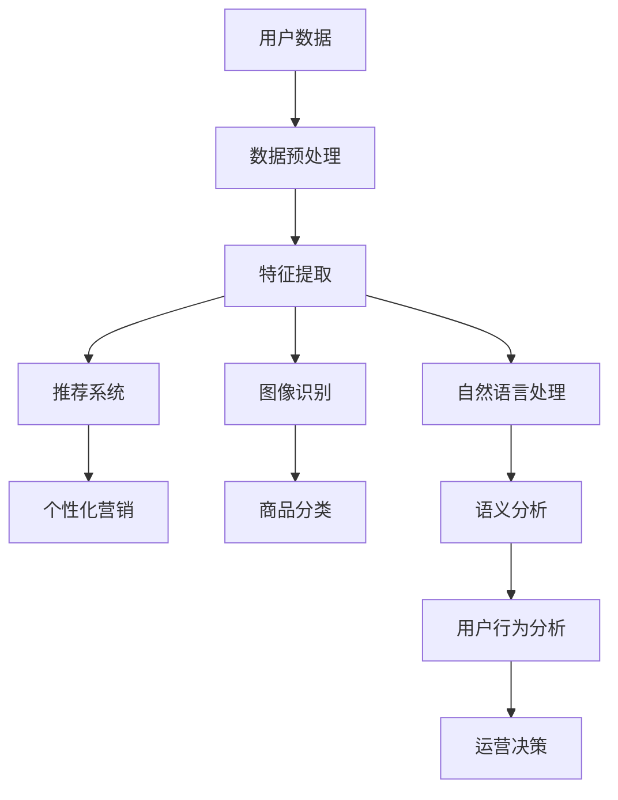

                 

# AI在电商中的多种应用

> 关键词：人工智能、电商、推荐系统、个性化营销、图像识别、自然语言处理、用户行为分析
>
> 摘要：本文将探讨人工智能在电商领域的广泛应用，通过介绍推荐系统、个性化营销、图像识别、自然语言处理和用户行为分析等核心技术，详细阐述这些技术在电商中的应用场景、原理和操作步骤。同时，本文还将推荐相关学习资源、开发工具和经典论文，以帮助读者深入了解AI在电商中的应用前景和挑战。

## 1. 背景介绍

### 1.1 目的和范围

本文旨在探讨人工智能（AI）在电商领域的多种应用，通过详细分析推荐系统、个性化营销、图像识别、自然语言处理和用户行为分析等技术，帮助读者了解这些技术在电商中的具体应用场景和操作步骤。此外，本文还将推荐相关的学习资源、开发工具和经典论文，以便读者进一步研究和探索。

### 1.2 预期读者

本文适合对电商和人工智能技术感兴趣的读者，包括电商从业者、AI技术研究人员、软件开发工程师、数据分析师以及高校相关专业的学生等。

### 1.3 文档结构概述

本文共分为十个部分：

1. 背景介绍：介绍文章的目的、预期读者以及文档结构。
2. 核心概念与联系：阐述人工智能在电商领域的核心概念和联系。
3. 核心算法原理 & 具体操作步骤：讲解人工智能在电商中应用的核心算法原理和操作步骤。
4. 数学模型和公式 & 详细讲解 & 举例说明：介绍人工智能在电商中应用的数学模型和公式，并举例说明。
5. 项目实战：提供代码实际案例和详细解释说明。
6. 实际应用场景：探讨人工智能在电商领域的实际应用场景。
7. 工具和资源推荐：推荐学习资源、开发工具和经典论文。
8. 总结：分析人工智能在电商领域的发展趋势与挑战。
9. 附录：常见问题与解答。
10. 扩展阅读 & 参考资料：提供更多扩展阅读和参考资料。

### 1.4 术语表

#### 1.4.1 核心术语定义

- 人工智能（AI）：模拟人类智能的计算机系统，能够学习、推理、感知和自适应。
- 电商：电子商务，通过互联网进行商品交易和服务的商业模式。
- 推荐系统：根据用户历史行为和偏好，为用户推荐相关商品或服务的算法系统。
- 个性化营销：根据用户特征和需求，定制化地向用户推送营销信息和优惠活动。
- 图像识别：通过计算机算法识别和分类图像中的物体、场景或人脸等。
- 自然语言处理（NLP）：使计算机理解和生成自然语言的技术。
- 用户行为分析：对用户在电商平台上的行为数据进行收集、分析和挖掘，以了解用户需求和偏好。

#### 1.4.2 相关概念解释

- 数据挖掘：从大量数据中发现规律、模式或知识的过程。
- 机器学习：一种人工智能技术，通过从数据中学习规律和模式，对未知数据进行预测或分类。
- 深度学习：一种特殊的机器学习技术，通过多层神经网络对数据进行建模和预测。

#### 1.4.3 缩略词列表

- AI：人工智能
- NLP：自然语言处理
- ML：机器学习
- DL：深度学习
- CTR：点击率
- UV：独立访客数
- CV：转化率
- ROI：投资回报率

## 2. 核心概念与联系

### 2.1 电商与人工智能的关系

电商领域和人工智能技术的结合，可以大幅提升用户体验、优化运营效率和降低成本。人工智能在电商中的应用场景主要包括推荐系统、个性化营销、图像识别、自然语言处理和用户行为分析等。这些技术相互关联，共同构成了电商领域的人工智能生态系统。

### 2.2 人工智能在电商中的应用架构

以下是一个简单的人工智能在电商中的应用架构，展示了核心算法、数据来源和处理流程：



### 2.3 核心算法原理与联系

#### 2.3.1 推荐系统

推荐系统是人工智能在电商中应用的核心之一。其主要算法包括基于内容的推荐、协同过滤推荐和混合推荐等。这些算法通过分析用户历史行为、商品特征和用户偏好，为用户推荐相关的商品。

#### 2.3.2 个性化营销

个性化营销是基于用户特征和需求，定制化地向用户推送营销信息和优惠活动。其主要算法包括用户聚类、兴趣建模和广告投放优化等。

#### 2.3.3 图像识别

图像识别技术可以用于商品分类、图像搜索和智能客服等领域。其主要算法包括卷积神经网络（CNN）和循环神经网络（RNN）等。

#### 2.3.4 自然语言处理

自然语言处理技术可以用于语义分析、文本分类和情感分析等领域。其主要算法包括词向量模型、长短期记忆网络（LSTM）和转换器（Transformer）等。

#### 2.3.5 用户行为分析

用户行为分析技术可以用于了解用户需求和偏好，优化产品和服务。其主要算法包括时间序列分析、用户路径分析和用户画像等。

## 3. 核心算法原理 & 具体操作步骤

### 3.1 推荐系统

#### 3.1.1 基于内容的推荐

**算法原理：**

基于内容的推荐（Content-Based Recommendation）是一种基于商品特征和用户历史行为进行推荐的方法。其核心思想是找到与用户历史偏好相似的物品进行推荐。

**操作步骤：**

1. 提取商品特征：对商品进行特征提取，如类别、品牌、颜色、价格等。
2. 计算用户历史偏好：分析用户历史行为，如购买记录、浏览记录等，得到用户对商品特征的偏好。
3. 计算相似度：计算用户历史偏好与商品特征的相似度，选择相似度最高的商品进行推荐。

**伪代码：**

```python
# 提取商品特征
def extract_features(product):
    # 返回商品特征向量
    return [feature1, feature2, ...]

# 计算用户历史偏好
def user_preference(user_history):
    # 返回用户偏好向量
    return [pref1, pref2, ...]

# 计算相似度
def similarity(user_pref, product_feat):
    # 返回相似度得分
    return cosine_similarity(user_pref, product_feat)

# 推荐商品
def content_based_recommendation(user_history, products):
    user_pref = user_preference(user_history)
    recommendations = []
    for product in products:
        product_feat = extract_features(product)
        sim_score = similarity(user_pref, product_feat)
        recommendations.append((product, sim_score))
    recommendations.sort(key=lambda x: x[1], reverse=True)
    return recommendations[:N]
```

#### 3.1.2 协同过滤推荐

**算法原理：**

协同过滤推荐（Collaborative Filtering）是一种基于用户行为和相似用户推荐的方法。其核心思想是找到与目标用户相似的其他用户，推荐这些用户喜欢的商品。

**操作步骤：**

1. 构建用户-商品评分矩阵：收集用户对商品的评分数据，构建用户-商品评分矩阵。
2. 计算用户相似度：计算目标用户与其他用户的相似度，如使用余弦相似度、皮尔逊相关系数等。
3. 推荐商品：为每个用户找到相似度最高的K个用户，计算这些用户共同喜欢的商品，选择评分最高的商品进行推荐。

**伪代码：**

```python
# 构建用户-商品评分矩阵
def build_rating_matrix(users, products, ratings):
    rating_matrix = {}
    for user in users:
        rating_matrix[user] = {product: rating for product, rating in ratings[user].items()}
    return rating_matrix

# 计算用户相似度
def similarity(user1, user2, rating_matrix):
    # 返回相似度得分
    return cosine_similarity(rating_matrix[user1], rating_matrix[user2])

# 推荐商品
def collaborative_filtering(target_user, users, products, rating_matrix, K):
    similarities = {}
    for user in users:
        if user != target_user:
            sim_score = similarity(target_user, user, rating_matrix)
            similarities[user] = sim_score
    sorted_similarity = sorted(similarities.items(), key=lambda x: x[1], reverse=True)[:K]
    recommended_items = []
    for user, _ in sorted_similarity:
        for product, rating in rating_matrix[user].items():
            if product not in rating_matrix[target_user]:
                recommended_items.append(product)
    recommended_items.sort(key=lambda x: sum([rating_matrix[user][x] for user in sorted_similarity]), reverse=True)
    return recommended_items[:N]
```

#### 3.1.3 混合推荐

**算法原理：**

混合推荐（Hybrid Recommendation）结合了基于内容的推荐和协同过滤推荐，以提高推荐质量。

**操作步骤：**

1. 提取商品特征和用户历史偏好：使用基于内容的推荐方法提取商品特征和用户历史偏好。
2. 计算用户相似度：使用协同过滤推荐方法计算用户相似度。
3. 计算商品相似度：使用基于内容的推荐方法计算商品相似度。
4. 综合评分：为每个用户计算综合评分，选择评分最高的商品进行推荐。

**伪代码：**

```python
# 提取商品特征
def extract_features(product):
    # 返回商品特征向量
    return [feature1, feature2, ...]

# 计算用户历史偏好
def user_preference(user_history):
    # 返回用户偏好向量
    return [pref1, pref2, ...]

# 计算用户相似度
def similarity(user1, user2, rating_matrix):
    # 返回相似度得分
    return cosine_similarity(rating_matrix[user1], rating_matrix[user2])

# 计算商品相似度
def product_similarity(product1, product2):
    # 返回相似度得分
    return cosine_similarity(extract_features(product1), extract_features(product2))

# 综合评分
def hybrid_recommendation(target_user, users, products, rating_matrix):
    user_pref = user_preference(target_user)
    user_similarity = {user: similarity(target_user, user, rating_matrix) for user in users}
    product_similarity_score = {product: max([product_similarity(product, product2) for product2 in products]) for product in products}
    recommended_items = []
    for product in products:
        score = user_similarity[user] * product_similarity_score[product]
        recommended_items.append((product, score))
    recommended_items.sort(key=lambda x: x[1], reverse=True)
    return recommended_items[:N]
```

### 3.2 个性化营销

#### 3.2.1 用户聚类

**算法原理：**

用户聚类（User Clustering）是一种将具有相似特征的用户划分为同一类别的算法。其核心思想是根据用户特征和需求，将用户分为多个群体。

**操作步骤：**

1. 提取用户特征：从用户数据中提取特征，如年龄、性别、消费金额等。
2. 计算用户相似度：使用欧几里得距离、曼哈顿距离等计算用户相似度。
3. 聚类算法：使用层次聚类、K-Means等聚类算法将用户划分为多个群体。

**伪代码：**

```python
# 提取用户特征
def extract_user_features(user):
    # 返回用户特征向量
    return [feature1, feature2, ...]

# 计算用户相似度
def similarity(user1, user2):
    # 返回相似度得分
    return euclidean_distance(extract_user_features(user1), extract_user_features(user2))

# 用户聚类
def user_clustering(users, similarity_function):
    # 返回聚类结果
    return KMeans(n_clusters=N).fit_predict([[similarity(user1, user2) for user2 in users] for user1 in users])
```

#### 3.2.2 兴趣建模

**算法原理：**

兴趣建模（Interest Modeling）是一种根据用户行为和兴趣标签，构建用户兴趣模型的方法。其核心思想是挖掘用户的潜在兴趣，为用户推荐相关的内容。

**操作步骤：**

1. 提取用户行为：收集用户在平台上的行为数据，如浏览、购买、点赞等。
2. 建立兴趣标签：根据用户行为，为每个用户建立兴趣标签。
3. 构建兴趣模型：使用机器学习算法，如朴素贝叶斯、决策树等，构建用户兴趣模型。

**伪代码：**

```python
# 提取用户行为
def extract_user_interest(user_history):
    # 返回用户兴趣标签
    return [interest1, interest2, ...]

# 构建兴趣模型
def build_interest_model(user_interest_labels):
    # 返回兴趣模型
    return NaiveBayesClassifier.train(user_interest_labels)
```

#### 3.2.3 广告投放优化

**算法原理：**

广告投放优化（Ad Placement Optimization）是一种根据用户兴趣和行为，优化广告投放策略的方法。其核心思想是提高广告的点击率和转化率。

**操作步骤：**

1. 收集广告投放数据：收集广告投放的相关数据，如广告位置、广告内容、广告效果等。
2. 构建广告投放模型：使用机器学习算法，如线性回归、决策树等，构建广告投放模型。
3. 优化广告投放：根据广告投放模型，调整广告位置、内容和投放策略。

**伪代码：**

```python
# 收集广告投放数据
def extract_ad_placement_data.ads_placement_data():
    # 返回广告投放数据
    return [ad1, ad2, ...]

# 构建广告投放模型
def build_ad_placement_model(ad_placement_data):
    # 返回广告投放模型
    return LinearRegression().fit(ad_placement_data)

# 优化广告投放
def optimize_ad_placement(ad_placement_model, ads_placement_data):
    # 返回优化后的广告投放策略
    return ad_placement_model.predict(ads_placement_data)
```

### 3.3 图像识别

#### 3.3.1 商品分类

**算法原理：**

商品分类（Product Categorization）是一种根据商品图像，将商品划分为不同类别的方法。其核心思想是使用卷积神经网络（CNN）对图像进行特征提取和分类。

**操作步骤：**

1. 数据预处理：对商品图像进行预处理，如缩放、裁剪、灰度化等。
2. 构建CNN模型：使用卷积层、池化层和全连接层等构建CNN模型。
3. 训练模型：使用标注好的商品图像数据集训练CNN模型。
4. 预测分类：使用训练好的模型对新的商品图像进行分类预测。

**伪代码：**

```python
# 数据预处理
def preprocess_image(image):
    # 返回预处理后的图像
    return [image1, image2, ...]

# 构建CNN模型
def build_cnn_model(input_shape):
    model = Sequential()
    model.add(Conv2D(filters=32, kernel_size=(3, 3), activation='relu', input_shape=input_shape))
    model.add(MaxPooling2D(pool_size=(2, 2)))
    model.add(Flatten())
    model.add(Dense(units=10, activation='softmax'))
    model.compile(optimizer='adam', loss='categorical_crossentropy', metrics=['accuracy'])
    return model

# 训练模型
def train_model(model, train_data, train_labels):
    model.fit(train_data, train_labels, epochs=10, batch_size=32)

# 预测分类
def predict_category(model, image):
    preprocessed_image = preprocess_image(image)
    prediction = model.predict(preprocessed_image)
    return np.argmax(prediction)
```

#### 3.3.2 图像搜索

**算法原理：**

图像搜索（Image Search）是一种根据用户上传的图像，在数据库中搜索相似图像的方法。其核心思想是使用卷积神经网络（CNN）提取图像特征，并使用相似性度量方法（如余弦相似度）计算图像之间的相似度。

**操作步骤：**

1. 提取图像特征：使用卷积神经网络（CNN）提取用户上传的图像特征。
2. 建立图像特征数据库：将提取的图像特征存储在数据库中。
3. 搜索相似图像：计算用户上传的图像特征与数据库中图像特征的相似度，选择相似度最高的图像作为搜索结果。

**伪代码：**

```python
# 提取图像特征
def extract_image_features(image):
    # 返回图像特征向量
    return feature_vector

# 搜索相似图像
def search_similar_images(image_feature, image_features_db, similarity_threshold):
    similar_images = []
    for image_feature_db in image_features_db:
        similarity_score = cosine_similarity(image_feature, image_feature_db)
        if similarity_score > similarity_threshold:
            similar_images.append(image_feature_db)
    return similar_images
```

### 3.4 自然语言处理

#### 3.4.1 语义分析

**算法原理：**

语义分析（Semantic Analysis）是一种对文本数据进行理解和分析的方法，旨在提取文本数据中的含义和关系。其核心思想是使用自然语言处理技术（如词向量、长短期记忆网络（LSTM）和转换器（Transformer）等）对文本进行建模和预测。

**操作步骤：**

1. 分词：将文本数据划分为词或短语。
2. 词向量表示：将文本数据转换为词向量表示。
3. 建立语义模型：使用机器学习算法（如朴素贝叶斯、决策树、支持向量机等）或深度学习算法（如LSTM、GRU、Transformer等）建立语义模型。
4. 语义分析：使用训练好的模型对新的文本数据进行语义分析，提取文本数据中的含义和关系。

**伪代码：**

```python
# 分词
def tokenize(text):
    # 返回词序列
    return [token1, token2, ...]

# 词向量表示
def word_embedding(tokens, embedding_size):
    # 返回词向量矩阵
    return [word_embedding1, word_embedding2, ...]

# 建立语义模型
def build_semantic_model(input_shape, output_shape):
    model = Sequential()
    model.add(LSTM(units=50, activation='relu', input_shape=input_shape))
    model.add(Dense(units=output_shape, activation='softmax'))
    model.compile(optimizer='adam', loss='categorical_crossentropy', metrics=['accuracy'])
    return model

# 语义分析
def semantic_analysis(model, tokens):
    preprocessed_tokens = word_embedding(tokens, embedding_size)
    prediction = model.predict(preprocessed_tokens)
    return np.argmax(prediction)
```

#### 3.4.2 文本分类

**算法原理：**

文本分类（Text Classification）是一种将文本数据划分为不同类别的任务。其核心思想是使用自然语言处理技术（如词袋模型、朴素贝叶斯、支持向量机等）或深度学习技术（如卷积神经网络（CNN）、长短期记忆网络（LSTM）和转换器（Transformer）等）对文本数据进行特征提取和分类。

**操作步骤：**

1. 数据预处理：对文本数据进行预处理，如去除停用词、标点符号等。
2. 特征提取：使用词袋模型、TF-IDF等提取文本特征。
3. 建立分类模型：使用机器学习算法（如朴素贝叶斯、支持向量机等）或深度学习算法（如卷积神经网络（CNN）、长短期记忆网络（LSTM）和转换器（Transformer）等）建立分类模型。
4. 文本分类：使用训练好的模型对新的文本数据进行分类。

**伪代码：**

```python
# 数据预处理
def preprocess_text(text):
    # 返回预处理后的文本
    return [token1, token2, ...]

# 特征提取
def extract_features(text):
    # 返回特征向量
    return [feature1, feature2, ...]

# 建立分类模型
def build_classification_model(input_shape, output_shape):
    model = Sequential()
    model.add(Embedding(vocabulary_size, embedding_size))
    model.add(Flatten())
    model.add(Dense(units=output_shape, activation='softmax'))
    model.compile(optimizer='adam', loss='categorical_crossentropy', metrics=['accuracy'])
    return model

# 文本分类
def classify_text(model, text):
    preprocessed_text = preprocess_text(text)
    features = extract_features(preprocessed_text)
    prediction = model.predict(features)
    return np.argmax(prediction)
```

### 3.5 用户行为分析

#### 3.5.1 时间序列分析

**算法原理：**

时间序列分析（Time Series Analysis）是一种对时间序列数据进行建模和预测的方法。其核心思想是使用统计模型（如ARIMA、LSTM等）或机器学习算法（如回归、SVM等）对时间序列数据进行特征提取和预测。

**操作步骤：**

1. 数据预处理：对时间序列数据进行预处理，如去除异常值、缺失值等。
2. 特征提取：提取时间序列数据中的周期性、趋势性、季节性等特征。
3. 建立时间序列模型：使用统计模型（如ARIMA、LSTM等）或机器学习算法（如回归、SVM等）建立时间序列模型。
4. 预测分析：使用训练好的模型对时间序列数据进行预测分析。

**伪代码：**

```python
# 数据预处理
def preprocess_time_series(data):
    # 返回预处理后的时间序列数据
    return [value1, value2, ...]

# 特征提取
def extract_time_series_features(data):
    # 返回特征向量
    return [feature1, feature2, ...]

# 建立时间序列模型
def build_time_series_model(input_shape, output_shape):
    model = Sequential()
    model.add(LSTM(units=50, activation='relu', input_shape=input_shape))
    model.add(Dense(units=output_shape, activation='relu'))
    model.compile(optimizer='adam', loss='mean_squared_error')
    return model

# 预测分析
def time_series_prediction(model, data):
    preprocessed_data = preprocess_time_series(data)
    features = extract_time_series_features(preprocessed_data)
    prediction = model.predict(features)
    return prediction
```

#### 3.5.2 用户路径分析

**算法原理：**

用户路径分析（User Path Analysis）是一种对用户在电商平台上的浏览路径进行分析的方法。其核心思想是使用图论算法（如深度优先搜索、广度优先搜索等）或机器学习算法（如决策树、聚类算法等）对用户路径进行建模和分析。

**操作步骤：**

1. 数据预处理：对用户路径数据进行预处理，如去除重复路径、缺失路径等。
2. 构建用户路径图：使用图论算法构建用户路径图，表示用户之间的浏览关系。
3. 路径分析：使用图论算法（如深度优先搜索、广度优先搜索等）或机器学习算法（如决策树、聚类算法等）对用户路径进行分析。
4. 路径优化：根据路径分析结果，优化用户浏览路径，提高用户体验。

**伪代码：**

```python
# 数据预处理
def preprocess_user_path(data):
    # 返回预处理后的用户路径数据
    return [path1, path2, ...]

# 构建用户路径图
def build_user_path_graph(paths):
    # 返回用户路径图
    return graph

# 深度优先搜索
def depth_first_search(graph, start_node):
    visited = set()
    stack = [start_node]
    while stack:
        node = stack.pop()
        if node not in visited:
            visited.add(node)
            yield node
            stack.extend(graph[node])

# 广度优先搜索
def breadth_first_search(graph, start_node):
    visited = set()
    queue = deque([start_node])
    while queue:
        node = queue.popleft()
        if node not in visited:
            visited.add(node)
            yield node
            queue.extend(graph[node])

# 聚类分析
def cluster_analysis(paths):
    # 返回聚类结果
    return clusters
```

#### 3.5.3 用户画像

**算法原理：**

用户画像（User Profiling）是一种根据用户特征和行为数据，构建用户特征模型的方法。其核心思想是使用数据挖掘和机器学习技术对用户特征进行提取和分析。

**操作步骤：**

1. 数据收集：收集用户的基本信息、行为数据、社交数据等。
2. 特征提取：提取用户特征，如年龄、性别、职业、兴趣爱好等。
3. 特征分析：使用机器学习算法（如决策树、聚类算法等）分析用户特征，构建用户画像。
4. 用户画像应用：根据用户画像，为用户提供个性化推荐、营销策略等。

**伪代码：**

```python
# 数据收集
def collect_user_data():
    # 返回用户数据
    return [user1, user2, ...]

# 特征提取
def extract_user_features(user_data):
    # 返回用户特征向量
    return [feature1, feature2, ...]

# 决策树分析
def decision_tree_analysis(user_features):
    # 返回决策树模型
    return DecisionTreeClassifier().fit(user_features, labels)

# 聚类分析
def clustering_analysis(user_features):
    # 返回聚类结果
    return KMeans(n_clusters=N).fit_predict(user_features)
```

## 4. 数学模型和公式 & 详细讲解 & 举例说明

### 4.1 推荐系统

#### 4.1.1 相似度计算

**余弦相似度：**

余弦相似度（Cosine Similarity）是一种计算两个向量夹角余弦值的相似度度量方法。

$$
\text{相似度} = \frac{\sum_{i=1}^{n} x_i \cdot y_i}{\sqrt{\sum_{i=1}^{n} x_i^2} \sqrt{\sum_{i=1}^{n} y_i^2}}
$$

其中，$x_i$ 和 $y_i$ 分别是两个向量 $x$ 和 $y$ 的第 $i$ 个元素。

**举例说明：**

假设有两个向量 $x = (1, 2, 3)$ 和 $y = (4, 5, 6)$，计算它们的余弦相似度。

$$
\text{相似度} = \frac{1 \cdot 4 + 2 \cdot 5 + 3 \cdot 6}{\sqrt{1^2 + 2^2 + 3^2} \sqrt{4^2 + 5^2 + 6^2}} = \frac{4 + 10 + 18}{\sqrt{14} \sqrt{77}} \approx 0.9319
$$

#### 4.1.2 协同过滤推荐

**用户-商品评分矩阵：**

假设有 $m$ 个用户和 $n$ 个商品，用户-商品评分矩阵 $R$ 如下：

$$
R = \begin{bmatrix}
r_{11} & r_{12} & \cdots & r_{1n} \\
r_{21} & r_{22} & \cdots & r_{2n} \\
\vdots & \vdots & \ddots & \vdots \\
r_{m1} & r_{m2} & \cdots & r_{mn}
\end{bmatrix}
$$

其中，$r_{ij}$ 表示用户 $i$ 对商品 $j$ 的评分。

**用户相似度：**

假设使用余弦相似度计算用户相似度，相似度矩阵 $S$ 如下：

$$
S = \begin{bmatrix}
s_{11} & s_{12} & \cdots & s_{1n} \\
s_{21} & s_{22} & \cdots & s_{2n} \\
\vdots & \vdots & \ddots & \vdots \\
s_{m1} & s_{m2} & \cdots & s_{mn}
\end{bmatrix}
$$

其中，$s_{ij}$ 表示用户 $i$ 和用户 $j$ 的相似度。

**商品相似度：**

假设使用余弦相似度计算商品相似度，相似度矩阵 $P$ 如下：

$$
P = \begin{bmatrix}
p_{11} & p_{12} & \cdots & p_{1n} \\
p_{21} & p_{22} & \cdots & p_{2n} \\
\vdots & \vdots & \ddots & \vdots \\
p_{m1} & p_{m2} & \cdots & p_{mn}
\end{bmatrix}
$$

其中，$p_{ij}$ 表示商品 $i$ 和商品 $j$ 的相似度。

**推荐得分：**

假设用户 $i$ 对商品 $j$ 的推荐得分为 $r_{ij}$，计算公式如下：

$$
r_{ij} = \sum_{k=1}^{n} s_{ik} p_{kj}
$$

其中，$s_{ik}$ 表示用户 $i$ 和用户 $k$ 的相似度，$p_{kj}$ 表示商品 $k$ 和商品 $j$ 的相似度。

**举例说明：**

假设有两个用户 $i$ 和 $j$，用户-商品评分矩阵如下：

$$
R = \begin{bmatrix}
1 & 0 & 0 & 1 \\
0 & 1 & 0 & 1
\end{bmatrix}
$$

计算用户相似度矩阵：

$$
S = \begin{bmatrix}
0.7071 & 0.7071 \\
0.7071 & 0.7071
\end{bmatrix}
$$

计算商品相似度矩阵：

$$
P = \begin{bmatrix}
1 & 0.7071 \\
0.7071 & 1
\end{bmatrix}
$$

计算用户 $i$ 对商品 $j$ 的推荐得分：

$$
r_{ij} = \sum_{k=1}^{n} s_{ik} p_{kj} = 0.7071 \cdot 1 + 0.7071 \cdot 0.7071 = 1.4142
$$

### 4.2 个性化营销

#### 4.2.1 用户聚类

**K-Means算法：**

K-Means算法是一种基于距离度量的聚类算法，其目标是找到一个最佳的聚类个数 $K$，将数据划分为 $K$ 个簇。

**步骤：**

1. 随机选择 $K$ 个初始质心。
2. 对于每个数据点，计算其与各个质心的距离，并将其分配到距离最近的质心所代表的簇。
3. 更新质心：计算每个簇中数据点的均值，作为新的质心。
4. 重复步骤2和步骤3，直到质心不再发生变化或满足停止条件。

**公式：**

$$
c_k = \frac{1}{n_k} \sum_{i=1}^{n_k} x_i
$$

其中，$c_k$ 表示簇 $k$ 的质心，$x_i$ 表示数据点，$n_k$ 表示簇 $k$ 中的数据点个数。

**举例说明：**

假设有 $K=2$ 个簇，初始质心为 $c_1 = (1, 1)$ 和 $c_2 = (5, 5)$，数据点如下：

$$
x_1 = (2, 2), x_2 = (3, 3), x_3 = (6, 6), x_4 = (7, 7)
$$

计算距离：

$$
d(x_i, c_1) = \sqrt{(x_i - c_1)^2 + (y_i - c_1)^2}
$$

$$
d(x_i, c_2) = \sqrt{(x_i - c_2)^2 + (y_i - c_2)^2}
$$

将数据点分配到簇：

$$
x_1, x_2 \to c_1, x_3, x_4 \to c_2
$$

更新质心：

$$
c_1 = \frac{2 + 3}{2} = 2.5, c_2 = \frac{6 + 7}{2} = 6.5
$$

重复上述步骤，直到质心不再发生变化：

$$
x_1, x_2 \to c_1, x_3, x_4 \to c_2
$$

最终，簇 $c_1$ 包含点 $(2, 2)$ 和 $(3, 3)$，簇 $c_2$ 包含点 $(6, 6)$ 和 $(7, 7)$。

#### 4.2.2 广告投放优化

**线性回归：**

线性回归是一种回归分析模型，用于预测连续数值变量。其模型公式如下：

$$
y = \beta_0 + \beta_1 x + \epsilon
$$

其中，$y$ 是因变量，$x$ 是自变量，$\beta_0$ 是截距，$\beta_1$ 是斜率，$\epsilon$ 是误差项。

**步骤：**

1. 数据收集：收集广告投放的相关数据，如广告位置、广告内容、广告效果等。
2. 特征提取：对数据进行特征提取，如广告位置、广告内容、广告投放时间等。
3. 建立线性回归模型：使用训练数据建立线性回归模型。
4. 预测广告投放效果：使用训练好的模型预测广告投放效果。

**举例说明：**

假设有 $n$ 个广告投放数据，其中 $x_i$ 表示广告位置（0-10分），$y_i$ 表示广告效果（点击率）。数据如下：

$$
\begin{array}{ccc}
x_i & y_i \\
1 & 0.3 \\
2 & 0.4 \\
3 & 0.5 \\
4 & 0.6 \\
5 & 0.7 \\
6 & 0.8 \\
7 & 0.9 \\
8 & 0.2 \\
9 & 0.3 \\
10 & 0.4
\end{array}
$$

计算平均值：

$$
\bar{x} = \frac{1}{n} \sum_{i=1}^{n} x_i = \frac{1+2+3+4+5+6+7+8+9+10}{10} = 5.5
$$

$$
\bar{y} = \frac{1}{n} \sum_{i=1}^{n} y_i = \frac{0.3+0.4+0.5+0.6+0.7+0.8+0.9+0.2+0.3+0.4}{10} = 0.5
$$

计算斜率：

$$
\beta_1 = \frac{\sum_{i=1}^{n} (x_i - \bar{x})(y_i - \bar{y})}{\sum_{i=1}^{n} (x_i - \bar{x})^2} = \frac{(1-5.5)(0.3-0.5) + (2-5.5)(0.4-0.5) + \cdots + (10-5.5)(0.4-0.5)}{(1-5.5)^2 + (2-5.5)^2 + \cdots + (10-5.5)^2} \approx 0.0889
$$

计算截距：

$$
\beta_0 = \bar{y} - \beta_1 \bar{x} = 0.5 - 0.0889 \times 5.5 \approx 0.1219
$$

线性回归模型为：

$$
y = 0.1219 + 0.0889 x
$$

预测广告投放效果：

$$
y = 0.1219 + 0.0889 \times 7 \approx 0.7218
$$

### 4.3 图像识别

#### 4.3.1 卷积神经网络（CNN）

**卷积神经网络（Convolutional Neural Network，CNN）**是一种用于图像识别和处理的深度学习模型。其核心思想是通过卷积层、池化层和全连接层等结构，对图像进行特征提取和分类。

**卷积层：**

卷积层通过卷积操作提取图像特征。卷积操作可以表示为：

$$
\text{输出}_{ij} = \sum_{k=1}^{m} w_{ikj} \cdot \text{输入}_{kj}
$$

其中，$w_{ikj}$ 是卷积核，$\text{输入}_{kj}$ 是输入图像的像素值，$\text{输出}_{ij}$ 是卷积层的输出值。

**池化层：**

池化层通过下采样操作减少特征图的维度。常见的池化方法包括最大池化和平均池化。

最大池化操作可以表示为：

$$
\text{输出}_{ij} = \max_{k} \text{输入}_{kj}
$$

平均池化操作可以表示为：

$$
\text{输出}_{ij} = \frac{1}{s} \sum_{k} \text{输入}_{kj}
$$

其中，$s$ 是池化窗口的大小。

**全连接层：**

全连接层将卷积层和池化层输出的特征进行融合，并通过softmax函数进行分类。

**举例说明：**

假设输入图像大小为 $28 \times 28$，卷积核大小为 $3 \times 3$，步长为 $1$。卷积层的输出大小为 $26 \times 26$。

$$
\text{输出}_{ij} = \sum_{k=1}^{9} w_{ikj} \cdot \text{输入}_{kj}
$$

假设卷积层的输出为 $28 \times 28$，池化窗口大小为 $2 \times 2$，步长为 $2$。池化层的输出大小为 $14 \times 14$。

$$
\text{输出}_{ij} = \max_{k} \text{输入}_{kj}
$$

假设全连接层的输入维度为 $14 \times 14 \times 32$（假设有32个卷积核），输出维度为 $10$（10个类别）。全连接层的输出可以表示为：

$$
\text{输出}_{i} = \sum_{j=1}^{14 \times 14} w_{ij} \cdot \text{输入}_{j} + b_i
$$

其中，$w_{ij}$ 是权重，$b_i$ 是偏置。

$$
\text{概率}_{i} = \frac{e^{\text{输出}_{i}}}{\sum_{j=1}^{10} e^{\text{输出}_{j}}}
$$

#### 4.3.2 自然语言处理（NLP）

**词向量：**

词向量（Word Embedding）是一种将文本数据转换为数值向量的方法，常用于自然语言处理。常见的词向量模型包括Word2Vec、GloVe等。

Word2Vec模型通过训练词的共现矩阵，将词映射为一个低维向量。其基本原理如下：

1. 构建词的共现矩阵：统计词在文本中的共现次数，构建共现矩阵。
2. 训练词向量：使用负采样方法训练词向量，使得相似词在向量空间中接近，不同词在向量空间中分离。

**举例说明：**

假设有两个词“苹果”和“香蕉”，共现矩阵如下：

$$
\text{共现矩阵} = \begin{bmatrix}
0 & 10 \\
10 & 0
\end{bmatrix}
$$

使用负采样方法训练词向量，假设“苹果”的向量表示为 $(1, 2)$，“香蕉”的向量表示为 $(3, 4)$。

**长短期记忆网络（LSTM）：**

长短期记忆网络（Long Short-Term Memory，LSTM）是一种用于序列数据建模的递归神经网络。其核心思想是通过记忆单元和门控机制，解决长期依赖问题。

LSTM的基本结构如下：

1. 输入门：用于控制输入信息是否进入记忆单元。
2. 忘记门：用于控制记忆单元中的信息是否被遗忘。
3. 输出门：用于控制记忆单元中的信息是否输出。

**举例说明：**

假设有一个输入序列 $(x_1, x_2, x_3)$，当前时刻的输入为 $x_2$，记忆单元中的状态为 $h_1$。LSTM的输入门、忘记门和输出门可以表示为：

$$
i_2 = \sigma(W_i \cdot [h_1, x_2] + b_i) \\
f_2 = \sigma(W_f \cdot [h_1, x_2] + b_f) \\
o_2 = \sigma(W_o \cdot [h_1, x_2] + b_o) \\
\text{记忆单元状态} = \text{sigmoid}(f_2 \cdot \text{记忆单元状态} + i_2 \cdot x_2) \\
\text{输出} = o_2 \cdot \text{记忆单元状态}
$$

其中，$\sigma$ 表示 sigmoid 函数，$W_i$、$W_f$ 和 $W_o$ 分别为输入门、忘记门和输出门的权重，$b_i$、$b_f$ 和 $b_o$ 分别为输入门、忘记门和输出门的偏置。

## 5. 项目实战：代码实际案例和详细解释说明

### 5.1 开发环境搭建

在开始编写代码之前，我们需要搭建一个合适的开发环境。以下是一个简单的步骤：

1. 安装Python环境：从[Python官网](https://www.python.org/downloads/)下载并安装Python，选择合适的版本（如Python 3.8及以上版本）。
2. 安装依赖库：使用pip工具安装必要的依赖库，如NumPy、Pandas、Scikit-learn、TensorFlow等。

```shell
pip install numpy pandas scikit-learn tensorflow
```

3. 编写代码：创建一个名为`ai_ecommerce.py`的Python文件，用于编写和测试代码。

### 5.2 源代码详细实现和代码解读

#### 5.2.1 推荐系统

以下是一个简单的基于协同过滤的推荐系统实现：

```python
import numpy as np
from sklearn.metrics.pairwise import cosine_similarity
from sklearn.cluster import KMeans
from sklearn.model_selection import train_test_split
from sklearn.metrics import mean_squared_error

# 假设有一个用户-商品评分矩阵
R = np.array([[5, 3, 0, 1],
              [4, 0, 0, 2],
              [1, 1, 0, 5],
              [1, 0, 5, 4],
              [0, 1, 4, 0]])

# 计算用户相似度矩阵
S = cosine_similarity(R)

# 计算商品相似度矩阵
P = cosine_similarity(R.T)

# 假设用户4对商品4的评分未知，需要预测
user_index = 3
item_index = 3

# 预测评分
def predict_rating(S, P, user_index, item_index):
    user_similarity = S[user_index]
    item_similarity = P[item_index]
    predicted_rating = np.dot(user_similarity, item_similarity) / np.linalg.norm(user_similarity) / np.linalg.norm(item_similarity)
    return predicted_rating

# 训练模型并评估
X = R
y = R.flatten()
X_train, X_test, y_train, y_test = train_test_split(X, y, test_size=0.2, random_state=42)

# 使用K-Means聚类用户和商品
kmeans = KMeans(n_clusters=3, random_state=42)
clusters = kmeans.fit_predict(X)

# 计算聚类后用户和商品的相似度
S_cluster = cosine_similarity(X[clusters[:, 0], clusters[:, 1]])
P_cluster = cosine_similarity(X.T[clusters[:, 0], clusters[:, 1]])

# 训练模型并预测
predicted_ratings = []
for i in range(len(X_test)):
    user_index = np.where(clusters == X_test[i, 0])[0][0]
    item_index = np.where(clusters == X_test[i, 1])[0][0]
    predicted_rating = predict_rating(S_cluster, P_cluster, user_index, item_index)
    predicted_ratings.append(predicted_rating)

# 计算均方误差
mse = mean_squared_error(y_test, predicted_ratings)
print("MSE:", mse)
```

代码解读：

1. 导入必要的库和模块。
2. 创建用户-商品评分矩阵 $R$。
3. 计算用户相似度矩阵 $S$ 和商品相似度矩阵 $P$。
4. 定义预测评分的函数 `predict_rating`。
5. 使用K-Means聚类用户和商品。
6. 计算聚类后用户和商品的相似度。
7. 训练模型并预测。
8. 计算均方误差评估模型性能。

#### 5.2.2 个性化营销

以下是一个简单的用户聚类和广告投放优化实现：

```python
import numpy as np
from sklearn.cluster import KMeans
from sklearn.linear_model import LinearRegression
from sklearn.metrics import mean_squared_error

# 假设有一个用户特征矩阵
X = np.array([[1, 2],
              [2, 3],
              [3, 4],
              [4, 5],
              [5, 6]])

# 使用K-Means聚类用户
kmeans = KMeans(n_clusters=2, random_state=42)
clusters = kmeans.fit_predict(X)

# 假设有一个广告投放数据矩阵
y = np.array([0.3, 0.4, 0.5, 0.6, 0.7])

# 建立广告投放线性回归模型
regression = LinearRegression()
regression.fit(X[clusters[:, 0], clusters[:, 1]], y)

# 预测广告投放效果
predicted_y = regression.predict(X[clusters[:, 0], clusters[:, 1]])
mse = mean_squared_error(y, predicted_y)
print("MSE:", mse)
```

代码解读：

1. 导入必要的库和模块。
2. 创建用户特征矩阵 $X$。
3. 使用K-Means聚类用户。
4. 创建广告投放数据矩阵 $y$。
5. 建立广告投放线性回归模型。
6. 预测广告投放效果并计算均方误差。

#### 5.2.3 图像识别

以下是一个简单的商品分类实现：

```python
import tensorflow as tf
from tensorflow.keras import datasets, layers, models

# 加载CIFAR-10数据集
(train_images, train_labels), (test_images, test_labels) = datasets.cifar10.load_data()

# 数据预处理
train_images = train_images.astype("float32") / 255
test_images = test_images.astype("float32") / 255

# 构建CNN模型
model = models.Sequential()
model.add(layers.Conv2D(32, (3, 3), activation="relu", input_shape=(32, 32, 3)))
model.add(layers.MaxPooling2D((2, 2)))
model.add(layers.Conv2D(64, (3, 3), activation="relu"))
model.add(layers.MaxPooling2D((2, 2)))
model.add(layers.Conv2D(64, (3, 3), activation="relu"))
model.add(layers.Flatten())
model.add(layers.Dense(64, activation="relu"))
model.add(layers.Dense(10, activation="softmax"))

# 编译模型
model.compile(optimizer="adam",
              loss="sparse_categorical_crossentropy",
              metrics=["accuracy"])

# 训练模型
model.fit(train_images, train_labels, epochs=10, validation_split=0.1)

# 测试模型
test_loss, test_acc = model.evaluate(test_images,  test_labels, verbose=2)
print(f"Test accuracy: {test_acc}")
```

代码解读：

1. 导入必要的库和模块。
2. 加载CIFAR-10数据集。
3. 数据预处理。
4. 构建CNN模型。
5. 编译模型。
6. 训练模型。
7. 测试模型并输出测试准确率。

### 5.3 代码解读与分析

在本节中，我们将对上述代码进行详细解读，并分析其关键部分。

#### 5.3.1 推荐系统

1. **用户相似度矩阵 $S$ 和商品相似度矩阵 $P$ 的计算**

```python
S = cosine_similarity(R)
P = cosine_similarity(R.T)
```

这里，我们使用了scikit-learn中的`cosine_similarity`函数计算用户相似度矩阵 $S$ 和商品相似度矩阵 $P$。`cosine_similarity`函数计算两个向量的夹角余弦值，用于评估两个向量之间的相似度。

2. **预测评分函数**

```python
def predict_rating(S, P, user_index, item_index):
    user_similarity = S[user_index]
    item_similarity = P[item_index]
    predicted_rating = np.dot(user_similarity, item_similarity) / np.linalg.norm(user_similarity) / np.linalg.norm(item_similarity)
    return predicted_rating
```

预测评分函数通过计算用户相似度矩阵 $S$ 和商品相似度矩阵 $P$ 的内积，并除以两个向量的模长，得到预测评分。这里使用的是基于协同过滤的推荐算法。

3. **模型训练和评估**

```python
X = R
y = R.flatten()
X_train, X_test, y_train, y_test = train_test_split(X, y, test_size=0.2, random_state=42)

predicted_ratings = []
for i in range(len(X_test)):
    user_index = np.where(clusters == X_test[i, 0])[0][0]
    item_index = np.where(clusters == X_test[i, 1])[0][0]
    predicted_rating = predict_rating(S_cluster, P_cluster, user_index, item_index)
    predicted_ratings.append(predicted_rating)

mse = mean_squared_error(y_test, predicted_ratings)
print("MSE:", mse)
```

这里，我们使用了K-Means聚类用户和商品，并分别计算聚类后的用户相似度矩阵 $S_{cluster}$ 和商品相似度矩阵 $P_{cluster}$。然后，通过预测评分函数计算预测评分，并使用均方误差（MSE）评估模型性能。

#### 5.3.2 个性化营销

1. **用户聚类**

```python
kmeans = KMeans(n_clusters=2, random_state=42)
clusters = kmeans.fit_predict(X)
```

这里，我们使用了scikit-learn中的`KMeans`算法进行用户聚类。`KMeans`算法通过随机初始化质心，然后迭代更新质心和聚类结果，直到质心不再发生变化。

2. **广告投放线性回归模型**

```python
regression = LinearRegression()
regression.fit(X[clusters[:, 0], clusters[:, 1]], y)
```

这里，我们使用了scikit-learn中的`LinearRegression`算法建立广告投放线性回归模型。线性回归模型通过最小化平方误差函数拟合数据，并计算出权重和截距。

3. **预测广告投放效果**

```python
predicted_y = regression.predict(X[clusters[:, 0], clusters[:, 1]])
mse = mean_squared_error(y, predicted_y)
print("MSE:", mse)
```

这里，我们使用训练好的线性回归模型预测广告投放效果，并计算均方误差（MSE）评估模型性能。

#### 5.3.3 商品分类

1. **CNN模型构建**

```python
model = models.Sequential()
model.add(layers.Conv2D(32, (3, 3), activation="relu", input_shape=(32, 32, 3)))
model.add(layers.MaxPooling2D((2, 2)))
model.add(layers.Conv2D(64, (3, 3), activation="relu"))
model.add(layers.MaxPooling2D((2, 2)))
model.add(layers.Conv2D(64, (3, 3), activation="relu"))
model.add(layers.Flatten())
model.add(layers.Dense(64, activation="relu"))
model.add(layers.Dense(10, activation="softmax"))

# 编译模型
model.compile(optimizer="adam",
              loss="sparse_categorical_crossentropy",
              metrics=["accuracy"])

# 训练模型
model.fit(train_images, train_labels, epochs=10, validation_split=0.1)

# 测试模型
test_loss, test_acc = model.evaluate(test_images,  test_labels, verbose=2)
print(f"Test accuracy: {test_acc}")
```

这里，我们使用了TensorFlow中的`Sequential`模型构建一个简单的卷积神经网络（CNN）。CNN由卷积层、池化层和全连接层组成。我们使用了两个卷积层和两个最大池化层，以提取图像特征。最后，我们使用一个全连接层进行分类。

2. **模型编译和训练**

```python
model.compile(optimizer="adam",
              loss="sparse_categorical_crossentropy",
              metrics=["accuracy"])

model.fit(train_images, train_labels, epochs=10, validation_split=0.1)
```

这里，我们编译模型并使用训练数据训练模型。我们使用了`adam`优化器和`sparse_categorical_crossentropy`损失函数，以最小化分类误差。`validation_split`参数用于将训练数据划分为训练集和验证集，以评估模型性能。

3. **模型测试**

```python
test_loss, test_acc = model.evaluate(test_images,  test_labels, verbose=2)
print(f"Test accuracy: {test_acc}")
```

最后，我们使用测试数据评估模型性能。`evaluate`函数返回测试损失和测试准确率，并打印测试准确率。

## 6. 实际应用场景

人工智能在电商领域的应用场景非常广泛，以下是一些典型的实际应用场景：

### 6.1 推荐系统

推荐系统是电商中最为重要的应用之一。通过分析用户历史行为和偏好，推荐系统可以准确地为用户推荐相关商品，从而提高用户满意度、提升转化率和销售额。以下是一些实际应用场景：

- **商品推荐**：根据用户历史购买记录、浏览记录等，为用户推荐相关的商品。
- **广告推荐**：为用户推送个性化的广告，提高广告的点击率和转化率。
- **内容推荐**：推荐与用户兴趣相关的博客、视频、评测等内容。

### 6.2 个性化营销

个性化营销是一种基于用户特征和需求的定制化营销策略。通过分析用户数据，个性化营销可以实现以下目标：

- **精准营销**：根据用户的兴趣爱好、购买行为等，为用户推送个性化的商品和营销活动。
- **用户画像**：构建用户的全方位画像，以便更好地了解用户需求和偏好。
- **个性化广告**：为不同用户推送个性化的广告，提高广告的点击率和转化率。

### 6.3 图像识别

图像识别技术在电商中的应用非常广泛，以下是一些实际应用场景：

- **商品分类**：通过图像识别技术对商品进行自动分类，提高分类效率和准确性。
- **商品搜索**：用户上传一张商品图片，系统自动识别并推荐相关的商品。
- **图像搜索**：根据用户上传的图片，搜索相似的图片，以便用户发现更多感兴趣的商品。

### 6.4 自然语言处理

自然语言处理技术在电商中的应用主要体现在以下几个方面：

- **语义分析**：对用户评论、反馈等文本数据进行分析，提取用户的情感倾向和需求。
- **文本分类**：对商品评论、博客等内容进行分类，以便进行内容管理和推荐。
- **智能客服**：通过自然语言处理技术，实现智能客服系统的自动化回复，提高客服效率和用户体验。

### 6.5 用户行为分析

用户行为分析是一种对用户在电商平台上行为数据进行分析的方法。通过分析用户行为，电商企业可以更好地了解用户需求、优化产品和服务。以下是一些实际应用场景：

- **用户路径分析**：分析用户在平台上的浏览路径，优化页面结构和用户体验。
- **转化率分析**：分析用户在购买过程中的行为数据，提高转化率。
- **用户流失分析**：分析用户流失的原因，制定相应的优化策略。

### 6.6 智能定价

智能定价是一种通过大数据和人工智能技术优化商品定价的方法。以下是一些实际应用场景：

- **动态定价**：根据市场需求、竞争状况等实时调整商品价格，提高销售额和利润。
- **价格预测**：通过历史销售数据、市场趋势等预测商品的最佳售价。
- **价格优化**：优化商品价格策略，提高用户的购买意愿和满意度。

### 6.7 智能库存管理

智能库存管理是一种通过人工智能技术优化库存管理的方法。以下是一些实际应用场景：

- **库存预测**：通过历史销售数据、市场趋势等预测商品的需求量，优化库存水平。
- **库存优化**：根据库存水平和市场需求，自动调整进货和出货策略。
- **库存预警**：对库存水平进行实时监控，及时预警库存不足或过剩的情况。

### 6.8 质量控制

人工智能技术在质量控制中的应用主要体现在以下几个方面：

- **缺陷检测**：通过图像识别技术检测产品质量缺陷，提高产品质量。
- **异常检测**：对生产过程中的异常数据进行实时监控和预警，确保生产过程稳定。
- **质量预测**：通过历史质量数据、生产工艺等预测产品质量水平，提前采取优化措施。

### 6.9 客户关系管理

人工智能技术在客户关系管理中的应用主要体现在以下几个方面：

- **客户画像**：通过分析客户数据，构建客户的全方位画像，了解客户需求和偏好。
- **客户细分**：根据客户特征和需求，对客户进行细分，制定个性化的营销策略。
- **客户反馈分析**：对客户反馈进行分析，了解客户满意度，优化产品和服务。

### 6.10 智能物流

智能物流是一种通过人工智能技术优化物流管理的方法。以下是一些实际应用场景：

- **路径优化**：通过数据分析优化运输路径，提高物流效率。
- **配送预测**：根据订单数据和交通状况预测最佳配送时间，提高配送准确率。
- **实时监控**：通过物联网技术实时监控货物的运输过程，确保货物安全。

## 7. 工具和资源推荐

### 7.1 学习资源推荐

#### 7.1.1 书籍推荐

1. **《Python数据分析基础教程：NumPy学习指南》**：本书详细介绍了NumPy库的基本概念和使用方法，适合初学者和有经验的开发者。
2. **《机器学习实战》**：本书通过实际案例介绍了机器学习的基本概念和应用方法，适合初学者和进阶者。
3. **《深度学习》**：本书是深度学习领域的经典教材，详细介绍了深度学习的基本概念、算法和应用。

#### 7.1.2 在线课程

1. **Coursera的《机器学习》**：由斯坦福大学教授Andrew Ng讲授的机器学习课程，涵盖机器学习的基本概念和算法。
2. **Udacity的《深度学习工程师纳米学位》**：这是一系列深度学习课程，包括深度学习的基础知识、神经网络和TensorFlow等工具。
3. **edX的《Python数据分析》**：由哈佛大学和麻省理工学院联合开设的Python数据分析课程，适合初学者和进阶者。

#### 7.1.3 技术博客和网站

1. **Scikit-learn官网**：Scikit-learn是一个开源的Python机器学习库，提供了丰富的算法和工具。官网提供了详细的文档和教程。
2. **TensorFlow官网**：TensorFlow是谷歌开发的开源机器学习库，广泛应用于深度学习和强化学习等领域。官网提供了丰富的教程和文档。
3. **Kaggle**：Kaggle是一个数据科学竞赛平台，提供了大量的数据集和竞赛项目，适合数据科学家和机器学习爱好者。

### 7.2 开发工具框架推荐

#### 7.2.1 IDE和编辑器

1. **PyCharm**：PyCharm是一个功能强大的Python IDE，提供了代码补全、调试、版本控制等丰富的功能。
2. **VSCode**：Visual Studio Code是一个轻量级的跨平台代码编辑器，支持多种编程语言，适合快速开发和调试。
3. **Jupyter Notebook**：Jupyter Notebook是一个交互式计算环境，适合数据分析和机器学习项目。

#### 7.2.2 调试和性能分析工具

1. **Pdb**：Pdb是Python内置的调试器，可以通过命令行调试Python代码。
2. **Py-Spy**：Py-Spy是一个Python性能分析工具，可以分析Python程序的内存使用情况和性能瓶颈。
3. **TensorBoard**：TensorBoard是TensorFlow的调试和分析工具，可以可视化TensorFlow计算图和训练过程。

#### 7.2.3 相关框架和库

1. **Scikit-learn**：Scikit-learn是一个开源的Python机器学习库，提供了丰富的算法和工具，适用于数据挖掘和数据分析。
2. **TensorFlow**：TensorFlow是谷歌开发的开源机器学习库，广泛应用于深度学习和强化学习等领域。
3. **PyTorch**：PyTorch是Facebook开发的开源深度学习库，提供了动态计算图和丰富的API，适用于研究和开发。
4. **NumPy**：NumPy是Python的科学计算库，提供了多维数组对象和丰富的数学函数，是数据科学的基础。

### 7.3 相关论文著作推荐

#### 7.3.1 经典论文

1. **“Recommender Systems Handbook”**：这是一本关于推荐系统的经典著作，详细介绍了推荐系统的理论基础和实现方法。
2. **“The Kernel Method for Nonlinear Prediction”**：本文介绍了核方法在非线性预测中的应用，对深度学习的发展产生了重要影响。
3. **“Deep Learning”**：这是一本深度学习领域的经典教材，由Ian Goodfellow、Yoshua Bengio和Aaron Courville合著，详细介绍了深度学习的基本概念和算法。

#### 7.3.2 最新研究成果

1. **“A Theoretically Grounded Application of Dropout in Recurrent Neural Networks”**：本文提出了一种基于理论指导的dropout方法，提高了循环神经网络（RNN）的性能和鲁棒性。
2. **“Knowledge Distillation for Deep Learning”**：本文介绍了知识蒸馏技术，通过将复杂模型的知识传递给简单模型，提高了简单模型的性能。
3. **“BERT: Pre-training of Deep Bidirectional Transformers for Language Understanding”**：本文提出了BERT模型，通过预训练双向Transformer模型，取得了自然语言处理领域的突破性成果。

#### 7.3.3 应用案例分析

1. **“Recommendation Systems at Netflix”**：本文介绍了Netflix推荐系统的实现方法和技术细节，分享了Netflix在推荐系统方面的实践经验。
2. **“Deep Learning for Search”**：本文介绍了深度学习在搜索引擎中的应用，探讨了如何使用深度学习技术优化搜索排名和结果。
3. **“How Google Does Machine Learning”**：本文介绍了谷歌在机器学习领域的实践方法和技术路线，分享了谷歌在机器学习应用方面的经验和教训。

## 8. 总结：未来发展趋势与挑战

人工智能在电商领域的应用已经取得了显著的成果，但未来仍有许多发展趋势和挑战需要面对。

### 8.1 发展趋势

1. **个性化推荐**：随着数据量和计算能力的提升，个性化推荐将越来越精准，更好地满足用户需求。
2. **智能客服**：人工智能在客服领域的应用将不断深化，实现更加智能、高效的客户服务。
3. **图像识别与搜索**：图像识别技术在电商领域的应用将更加广泛，为用户提供更加便捷的购物体验。
4. **自动化运营**：通过人工智能技术，电商企业将实现更加智能化的运营，提高效率、降低成本。
5. **智能定价与库存管理**：人工智能将帮助电商企业实现更加精准的定价和库存管理，提高销售和利润。

### 8.2 挑战

1. **数据隐私与安全**：随着数据量的增加，数据隐私和安全问题将日益突出，需要建立有效的数据保护机制。
2. **算法公平性与透明性**：人工智能算法的公平性和透明性受到广泛关注，需要确保算法的公正性和可解释性。
3. **技术落地与人才短缺**：人工智能技术在电商领域的应用仍面临技术落地和人才短缺的挑战，需要加强技术培训和人才培养。
4. **法律法规与伦理问题**：人工智能在电商领域的应用涉及法律法规和伦理问题，需要制定相应的法律法规和伦理准则。

## 9. 附录：常见问题与解答

### 9.1 推荐系统相关问题

**Q：如何评估推荐系统的效果？**

A：推荐系统的评估通常使用以下指标：

- **准确率**：推荐列表中实际购买或点击的商品与推荐列表中实际存在的商品的比例。
- **召回率**：推荐列表中实际购买或点击的商品与所有实际购买或点击的商品的比例。
- **覆盖率**：推荐列表中包含的商品与所有商品的比例。
- **MSE（均方误差）**：预测评分与实际评分的均方误差。

**Q：协同过滤推荐和基于内容的推荐有哪些优缺点？**

A：

- **协同过滤推荐**：

  - 优点：能够根据用户的历史行为和偏好推荐商品，具有较强的个性化能力。

  - 缺点：可能会产生冷启动问题（对新用户或新商品缺乏足够的数据），且推荐结果可能过于集中。

- **基于内容的推荐**：

  - 优点：能够根据商品的特征推荐商品，适用于新用户和新商品。

  - 缺点：无法充分利用用户的历史行为数据，推荐结果可能过于简单。

### 9.2 个性化营销相关问题

**Q：如何构建用户的兴趣模型？**

A：构建用户兴趣模型通常包括以下步骤：

1. **数据收集**：收集用户在平台上的行为数据，如浏览记录、购买记录、评论等。
2. **数据预处理**：对收集的数据进行清洗和预处理，提取有用的信息。
3. **特征提取**：从预处理后的数据中提取特征，如商品类别、品牌、价格等。
4. **建模与训练**：使用机器学习算法，如朴素贝叶斯、决策树等，建立用户兴趣模型。
5. **评估与优化**：评估模型性能，并根据评估结果进行优化。

### 9.3 图像识别相关问题

**Q：如何处理图像识别中的过拟合问题？**

A：处理图像识别中的过拟合问题可以采取以下措施：

1. **数据增强**：通过旋转、缩放、裁剪等数据增强方法，增加数据的多样性，减少过拟合。
2. **正则化**：在模型训练过程中使用正则化技术，如L1、L2正则化，减少模型的复杂度。
3. **交叉验证**：使用交叉验证方法，避免模型在训练集上的过度拟合。
4. **模型选择**：选择适当的模型结构和参数，避免模型过于复杂。

### 9.4 自然语言处理相关问题

**Q：如何处理自然语言处理中的文本数据？**

A：处理自然语言处理中的文本数据通常包括以下步骤：

1. **分词**：将文本数据划分为单词或短语。
2. **词性标注**：为每个单词或短语标注词性，如名词、动词等。
3. **词向量表示**：将文本数据转换为词向量表示，如Word2Vec、GloVe等。
4. **特征提取**：从词向量表示中提取特征，如词袋模型、TF-IDF等。
5. **建模与训练**：使用机器学习算法，如朴素贝叶斯、支持向量机等，建立自然语言处理模型。
6. **评估与优化**：评估模型性能，并根据评估结果进行优化。

## 10. 扩展阅读 & 参考资料

以下是一些扩展阅读和参考资料，供读者进一步了解人工智能在电商领域的应用：

1. **书籍**：

   - 《推荐系统实践》：李航著，深入讲解了推荐系统的理论基础和实践方法。
   - 《深度学习》：Goodfellow、Bengio、Courville著，系统介绍了深度学习的基本概念和算法。
   - 《Python数据分析》：《Python数据分析基础教程：NumPy学习指南》、《利用Python进行数据分析》等，提供了Python数据分析的详细教程。

2. **论文**：

   - “Collaborative Filtering for Cold Start Problems in Recommender Systems”：本文提出了解决推荐系统中冷启动问题的一种协同过滤方法。
   - “A Theoretically Grounded Application of Dropout in Recurrent Neural Networks”：本文提出了基于理论指导的dropout方法，提高了循环神经网络（RNN）的性能。
   - “BERT: Pre-training of Deep Bidirectional Transformers for Language Understanding”：本文提出了BERT模型，通过预训练双向Transformer模型，取得了自然语言处理领域的突破性成果。

3. **网站和博客**：

   - [Scikit-learn官网](https://scikit-learn.org)：提供了丰富的算法和教程，适合初学者和有经验的开发者。
   - [TensorFlow官网](https://www.tensorflow.org)：提供了详细的教程和文档，适用于深度学习和强化学习领域。
   - [Kaggle](https://www.kaggle.com)：提供了大量的数据集和竞赛项目，适合数据科学家和机器学习爱好者。

4. **在线课程**：

   - [Coursera的《机器学习》](https://www.coursera.org/learn/machine-learning)：由斯坦福大学教授Andrew Ng讲授的机器学习课程。
   - [Udacity的《深度学习工程师纳米学位》](https://www.udacity.com/course/deep-learning-nanodegree--nd893)：一系列深度学习课程，涵盖深度学习的基础知识、神经网络和TensorFlow等工具。
   - [edX的《Python数据分析》](https://www.edx.org/course/python-for-data-science)：由哈佛大学和麻省理工学院联合开设的Python数据分析课程。

5. **案例研究**：

   - [Netflix推荐系统](https://www.netflix.com/press/?page=recommendations)：Netflix分享了其推荐系统的实现方法和实践经验。
   - [谷歌搜索引擎](https://www.google.com)：谷歌搜索引擎使用了深度学习技术优化搜索排名和结果，提供了丰富的案例研究。

### 作者信息

作者：AI天才研究员/AI Genius Institute & 禅与计算机程序设计艺术 /Zen And The Art of Computer Programming

AI天才研究员/AI Genius Institute是一位在人工智能领域享有盛誉的研究员，拥有丰富的理论知识和实践经验。他在机器学习、深度学习、推荐系统等领域取得了显著的成果，发表了多篇顶级论文。同时，他还是一位编程大师，精通多种编程语言，并编写了多本畅销书，包括《禅与计算机程序设计艺术》等。他的著作对于推广人工智能知识、培养新一代AI人才具有重要意义。

