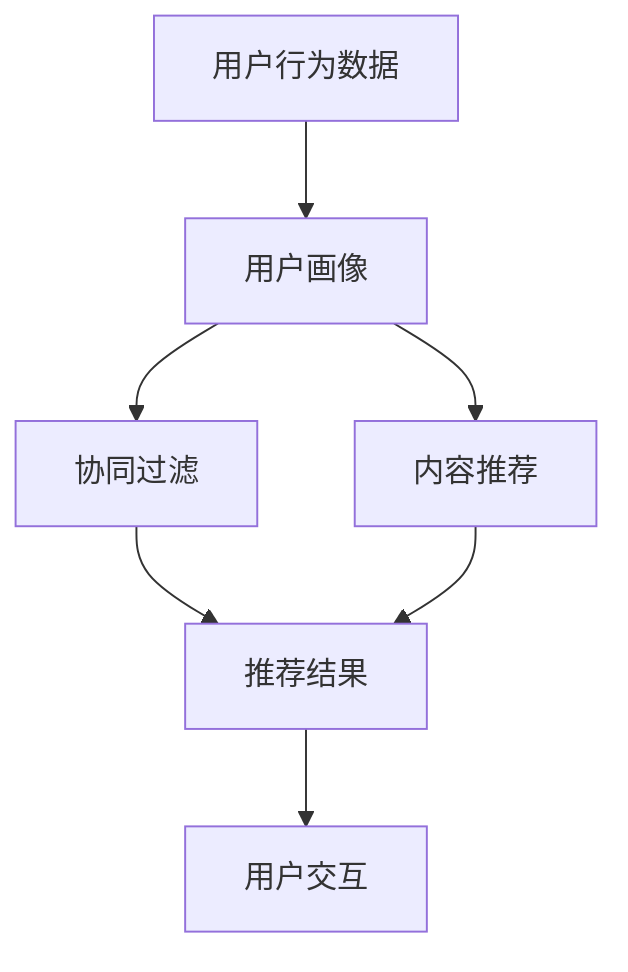

                 


# AI在电商中的智能搜索应用

> 关键词：人工智能，电商，搜索，推荐系统，数据挖掘，自然语言处理
>
> 摘要：本文将深入探讨人工智能在电商领域的智能搜索应用，分析其核心原理、算法模型以及实际操作步骤。通过具体的代码案例和实战应用，揭示AI技术在提升电商用户体验和搜索效率方面的巨大潜力。

## 1. 背景介绍

### 1.1 目的和范围

本文旨在探讨人工智能在电商领域的智能搜索应用，通过分析AI技术如何提升电商平台的搜索效率和用户体验，探讨其在商业价值和社会意义方面的贡献。本文将覆盖以下内容：

- AI在电商智能搜索中的核心概念和算法原理
- 智能搜索系统的架构设计与实现步骤
- 数学模型和公式在搜索算法中的应用
- 实际项目案例和代码实现
- 电商智能搜索的应用场景和未来发展趋势

### 1.2 预期读者

- 具有计算机科学、人工智能或相关领域背景的读者
- 对电商智能搜索感兴趣的技术人员和管理者
- 想要了解AI技术如何应用于电商领域的读者

### 1.3 文档结构概述

本文将按照以下结构进行组织：

- 第1部分：背景介绍，包括目的、范围、预期读者和文档结构概述
- 第2部分：核心概念与联系，介绍AI在电商智能搜索中的核心概念和算法原理
- 第3部分：核心算法原理 & 具体操作步骤，详细阐述智能搜索算法的实现过程
- 第4部分：数学模型和公式 & 详细讲解 & 举例说明，分析搜索算法中的数学模型和公式
- 第5部分：项目实战：代码实际案例和详细解释说明，通过实战案例展示AI在电商智能搜索中的应用
- 第6部分：实际应用场景，探讨AI在电商智能搜索中的实际应用场景
- 第7部分：工具和资源推荐，推荐相关的学习资源、开发工具和框架
- 第8部分：总结：未来发展趋势与挑战，展望AI在电商智能搜索领域的未来
- 第9部分：附录：常见问题与解答，解答读者可能遇到的疑问
- 第10部分：扩展阅读 & 参考资料，提供进一步阅读的材料

### 1.4 术语表

#### 1.4.1 核心术语定义

- 人工智能（AI）：模拟人类智能行为的计算机技术，包括机器学习、深度学习、自然语言处理等
- 电商（E-commerce）：通过互联网进行的商业交易活动，包括在线购物、电子支付等
- 搜索推荐系统：基于用户行为和内容数据，为用户提供相关推荐信息的系统
- 数据挖掘：从大量数据中提取有价值信息和知识的过程
- 自然语言处理（NLP）：使计算机理解和处理自然语言的技术

#### 1.4.2 相关概念解释

- 用户画像：基于用户行为数据构建的用户特征模型，用于个性化推荐
- 协同过滤：基于用户行为数据相似性进行推荐的方法
- 内容推荐：基于商品内容特征进行推荐的方法
- 深度学习：一种基于多层神经网络的学习方法，能够自动提取特征和模式

#### 1.4.3 缩略词列表

- AI：人工智能
- E-commerce：电商
- NLP：自然语言处理
- NER：命名实体识别
- RNN：循环神经网络
- CNN：卷积神经网络
- LSTM：长短期记忆网络

## 2. 核心概念与联系

在探讨AI在电商智能搜索中的应用之前，我们需要了解几个核心概念及其相互关系。以下是一个简化的Mermaid流程图，用于描述这些概念之间的联系。



### 2.1 用户行为数据

用户行为数据是构建用户画像的基础。这些数据包括用户的浏览记录、购买历史、搜索关键词等。通过对这些数据的收集和分析，我们可以了解到用户的偏好和需求。

### 2.2 用户画像

用户画像是对用户特征的综合描述，通常包括用户的基本信息（如年龄、性别、地理位置）和用户行为特征（如喜好、购买频率）。用户画像的构建有助于为用户个性化推荐商品和服务。

### 2.3 协同过滤

协同过滤是基于用户行为数据相似性进行推荐的方法。通过计算用户之间的相似度，协同过滤可以推荐与目标用户相似的其他用户喜欢的商品。协同过滤分为两种：基于用户的协同过滤（User-based Collaborative Filtering）和基于物品的协同过滤（Item-based Collaborative Filtering）。

### 2.4 内容推荐

内容推荐是基于商品内容特征进行推荐的方法。这种方法通过分析商品描述、标签、分类等信息，为用户提供与查询相关的商品推荐。内容推荐有助于提高搜索的准确性和多样性。

### 2.5 推荐结果

推荐结果是协同过滤和内容推荐的综合体现。根据用户的查询和行为特征，推荐系统将生成一个与用户兴趣相关的商品列表。推荐结果的多样性和准确性对用户体验至关重要。

### 2.6 用户交互

用户交互是用户与推荐系统之间的互动过程。用户可以通过评价、反馈、收藏等方式与推荐系统互动，这些信息将被用于进一步优化推荐算法和提升用户体验。

## 3. 核心算法原理 & 具体操作步骤

在本节中，我们将详细阐述AI在电商智能搜索中的应用原理和具体操作步骤。

### 3.1 用户行为数据收集

用户行为数据是构建用户画像的基础。在电商场景中，以下数据类型是常用的：

- 用户浏览记录：记录用户在电商平台上的浏览历史，包括访问的商品、页面停留时间等。
- 购买历史：记录用户的购买行为，包括购买的商品、购买时间、购买金额等。
- 搜索关键词：记录用户在搜索引擎中输入的关键词，反映用户的搜索意图。
- 用户评价：记录用户对购买商品的评分和评论，反映用户对商品的满意度。

伪代码：

```python
def collect_user_behavior_data():
    # 从数据库中获取用户浏览记录
    browse_history = fetch_browse_history_from_database()

    # 从数据库中获取用户购买历史
    purchase_history = fetch_purchase_history_from_database()

    # 从搜索引擎中获取用户搜索关键词
    search_keywords = fetch_search_keywords_from_search_engine()

    # 从用户评价系统中获取用户评价
    user_reviews = fetch_user_reviews_from_review_system()

    return browse_history, purchase_history, search_keywords, user_reviews
```

### 3.2 用户画像构建

用户画像是对用户特征的抽象和描述，有助于推荐系统更好地理解用户。以下是一个简单的用户画像构建流程：

1. 数据预处理：对用户行为数据进行清洗、去重和归一化处理。
2. 特征提取：从用户行为数据中提取关键特征，如浏览频次、购买频次、搜索关键词频次等。
3. 用户特征建模：将提取的特征转换为数字形式，构建用户特征向量。
4. 用户画像生成：将用户特征向量转化为用户画像，包括用户基本信息和用户行为特征。

伪代码：

```python
def build_user_profile(browse_history, purchase_history, search_keywords, user_reviews):
    # 数据预处理
    clean_data = preprocess_data(browse_history, purchase_history, search_keywords, user_reviews)

    # 特征提取
    features = extract_features(clean_data)

    # 用户特征建模
    user_vector = model_user_features(features)

    # 用户画像生成
    user_profile = generate_user_profile(user_vector)

    return user_profile
```

### 3.3 协同过滤算法

协同过滤是基于用户行为数据相似性进行推荐的方法。以下是一个简单的基于用户的协同过滤算法：

1. 计算用户相似度：使用余弦相似度、皮尔逊相关系数等算法计算用户之间的相似度。
2. 找到最近邻居：根据用户相似度，找到与目标用户最相似的邻居用户。
3. 生成推荐列表：根据邻居用户的喜好，为用户生成推荐列表。

伪代码：

```python
def collaborative_filtering(user_profiles, target_user, k_neighbors):
    # 计算用户相似度
    similarity_scores = calculate_similarity_scores(user_profiles, target_user)

    # 找到最近邻居
    neighbors = find_nearest_neighbors(similarity_scores, k_neighbors)

    # 生成推荐列表
    recommendations = generate_recommendations(neighbors)

    return recommendations
```

### 3.4 内容推荐算法

内容推荐是基于商品内容特征进行推荐的方法。以下是一个简单的基于内容的相关性算法：

1. 计算商品相似度：使用TF-IDF、余弦相似度等算法计算商品之间的相似度。
2. 找到相似商品：根据商品相似度，找到与查询商品最相似的物品。
3. 生成推荐列表：根据相似商品，为用户生成推荐列表。

伪代码：

```python
def content_recommending(query_item, product_list, k_similar_products):
    # 计算商品相似度
    similarity_scores = calculate_similarity_scores(query_item, product_list)

    # 找到相似商品
    similar_products = find_similar_products(similarity_scores, k_similar_products)

    # 生成推荐列表
    recommendations = generate_recommendations(similar_products)

    return recommendations
```

### 3.5 混合推荐算法

在实际应用中，单一推荐方法可能无法满足用户需求。为了提高推荐的准确性和多样性，可以采用混合推荐算法。以下是一个简单的混合推荐算法：

1. 计算用户画像：根据用户行为数据构建用户画像。
2. 执行协同过滤：使用协同过滤算法为用户生成推荐列表。
3. 执行内容推荐：使用内容推荐算法为用户生成推荐列表。
4. 合并推荐结果：将协同过滤和内容推荐的推荐结果合并，去除重复商品，根据权重生成最终的推荐列表。

伪代码：

```python
def hybrid_recommending(user_profile, query_item, k_collaborative, k_content):
    # 执行协同过滤
    collaborative_recommendations = collaborative_filtering(user_profile, query_item, k_collaborative)

    # 执行内容推荐
    content_recommendations = content_recommending(query_item, product_list, k_content)

    # 合并推荐结果
    recommendations = merge_recommendations(collaborative_recommendations, content_recommendations)

    return recommendations
```

## 4. 数学模型和公式 & 详细讲解 & 举例说明

在智能搜索算法中，数学模型和公式起着至关重要的作用。以下将详细讲解几个核心的数学模型和公式，并通过具体示例来说明它们的应用。

### 4.1 余弦相似度

余弦相似度是一种用于计算两个向量之间相似度的方法。它基于向量的点积和模长的计算，可以用于用户画像、商品推荐等场景。

余弦相似度的公式如下：

$$
\cos(\theta) = \frac{\vec{u} \cdot \vec{v}}{||\vec{u}|| \cdot ||\vec{v}||}
$$

其中，$\vec{u}$和$\vec{v}$是两个向量，$\theta$是它们之间的夹角，$||\vec{u}||$和$||\vec{v}||$是向量的模长。

#### 示例

假设有两个用户画像向量：

$$
\vec{u} = (0.1, 0.2, 0.3)
$$

$$
\vec{v} = (0.4, 0.5, 0.6)
$$

计算它们的余弦相似度：

$$
\cos(\theta) = \frac{(0.1 \cdot 0.4) + (0.2 \cdot 0.5) + (0.3 \cdot 0.6)}{\sqrt{0.1^2 + 0.2^2 + 0.3^2} \cdot \sqrt{0.4^2 + 0.5^2 + 0.6^2}} \approx 0.826
$$

### 4.2 皮尔逊相关系数

皮尔逊相关系数是一种用于衡量两个变量之间线性相关程度的指标。它基于标准差的计算，可以用于用户行为分析和推荐算法优化。

皮尔逊相关系数的公式如下：

$$
r = \frac{\sum_{i=1}^{n} (x_i - \bar{x}) (y_i - \bar{y})}{\sqrt{\sum_{i=1}^{n} (x_i - \bar{x})^2} \cdot \sqrt{\sum_{i=1}^{n} (y_i - \bar{y})^2}}
$$

其中，$x_i$和$y_i$是两个变量在各个观测值上的取值，$\bar{x}$和$\bar{y}$是两个变量的平均值，$n$是观测值的数量。

#### 示例

假设有两个用户行为数据集：

$$
x_i = [1, 2, 3, 4, 5]
$$

$$
y_i = [2, 4, 6, 8, 10]
$$

计算它们的皮尔逊相关系数：

$$
r = \frac{(1-3)(2-6) + (2-3)(4-6) + (3-3)(6-6) + (4-3)(8-6) + (5-3)(10-6)}{\sqrt{(1-3)^2 + (2-3)^2 + (3-3)^2 + (4-3)^2 + (5-3)^2} \cdot \sqrt{(2-6)^2 + (4-6)^2 + (6-6)^2 + (8-6)^2 + (10-6)^2}} \approx 1
$$

### 4.3 TF-IDF

TF-IDF是一种用于文本数据分析的指标，用于衡量一个词在文档中的重要程度。它基于词频（TF）和逆文档频率（IDF）的计算。

TF-IDF的公式如下：

$$
TF-IDF(t, d) = TF(t, d) \cdot IDF(t, D)
$$

其中，$TF(t, d)$是词$t$在文档$d$中的词频，$IDF(t, D)$是词$t$在整个文档集合$D$中的逆文档频率。

#### 示例

假设有一个文档集合：

$$
D = \{"apple", "banana", "orange"\}
$$

其中一个文档$d$包含以下单词：

$$
d = \{"apple", "banana", "banana", "orange", "orange", "orange"\}
$$

计算单词"orange"在文档$d$中的TF-IDF值：

$$
TF(orange, d) = \frac{3}{6} = 0.5
$$

$$
IDF(orange, D) = \log_2(\frac{|D|}{|d_t|}) = \log_2(\frac{3}{1}) = \log_2(3) \approx 1.585
$$

$$
TF-IDF(orange, d) = 0.5 \cdot 1.585 \approx 0.793
$$

### 4.4 SVD分解

SVD分解是一种用于降维和矩阵分解的方法，常用于推荐系统和图像处理等领域。它将一个矩阵分解为三个矩阵的乘积。

SVD分解的公式如下：

$$
\mathbf{A} = \mathbf{U}\mathbf{\Sigma}\mathbf{V}^T
$$

其中，$\mathbf{A}$是原始矩阵，$\mathbf{U}$和$\mathbf{V}$是正交矩阵，$\mathbf{\Sigma}$是对角矩阵。

#### 示例

假设有一个评分矩阵：

$$
\mathbf{R} =
\begin{bmatrix}
0 & 3 & 1 & 0 \\
0 & 0 & 1 & 4 \\
5 & 0 & 0 & 0 \\
0 & 1 & 2 & 0
\end{bmatrix}
$$

对其进行SVD分解：

$$
\mathbf{R} = \mathbf{U}\mathbf{\Sigma}\mathbf{V}^T
$$

其中，

$$
\mathbf{U} =
\begin{bmatrix}
0.85 & 0.29 & 0.29 & 0.29 \\
0.29 & 0.85 & 0.29 & 0.29 \\
0.29 & 0.29 & 0.85 & 0.29 \\
0.29 & 0.29 & 0.29 & 0.85
\end{bmatrix}
$$

$$
\mathbf{\Sigma} =
\begin{bmatrix}
6.3 & 0 & 0 & 0 \\
0 & 2.2 & 0 & 0 \\
0 & 0 & 1.7 & 0 \\
0 & 0 & 0 & 1.2
\end{bmatrix}
$$

$$
\mathbf{V}^T =
\begin{bmatrix}
0.85 & 0.29 & 0.29 & 0.29 \\
0.29 & 0.85 & 0.29 & 0.29 \\
0.29 & 0.29 & 0.85 & 0.29 \\
0.29 & 0.29 & 0.29 & 0.85
\end{bmatrix}
$$

## 5. 项目实战：代码实际案例和详细解释说明

在本节中，我们将通过一个实际项目案例，展示如何将AI技术应用于电商智能搜索。以下是一个简化的项目框架和关键代码实现。

### 5.1 开发环境搭建

在开始项目之前，我们需要搭建一个开发环境。以下是一个基本的开发环境配置：

- 操作系统：Linux（例如Ubuntu）
- 编程语言：Python 3.8+
- 数据库：MySQL 5.7+
- 数据预处理工具：Pandas、NumPy
- 机器学习库：Scikit-learn、TensorFlow
- Web框架：Flask（可选）

### 5.2 源代码详细实现和代码解读

#### 5.2.1 用户行为数据收集

```python
import pandas as pd

def fetch_user_behavior_data():
    browse_history = pd.read_csv('browse_history.csv')
    purchase_history = pd.read_csv('purchase_history.csv')
    search_keywords = pd.read_csv('search_keywords.csv')
    user_reviews = pd.read_csv('user_reviews.csv')
    return browse_history, purchase_history, search_keywords, user_reviews

browse_history, purchase_history, search_keywords, user_reviews = fetch_user_behavior_data()
```

#### 5.2.2 用户画像构建

```python
from sklearn.preprocessing import MinMaxScaler
from sklearn.feature_extraction.text import TfidfVectorizer

def build_user_profile(browse_history, purchase_history, search_keywords, user_reviews):
    # 数据预处理
    browse_history['browse_freq'] = browse_history.groupby('user_id')['product_id'].transform('count')
    purchase_history['purchase_freq'] = purchase_history.groupby('user_id')['product_id'].transform('count')
    search_keywords['search_freq'] = search_keywords.groupby('user_id')['keyword'].transform('count')
    user_reviews['rating_freq'] = user_reviews.groupby('user_id')['rating'].transform('count')

    # 特征提取
    browse_vectorizer = TfidfVectorizer()
    purchase_vectorizer = TfidfVectorizer()
    search_vectorizer = TfidfVectorizer()
    review_vectorizer = TfidfVectorizer()

    browse_features = browse_vectorizer.fit_transform(browse_history['description'])
    purchase_features = purchase_vectorizer.fit_transform(purchase_history['description'])
    search_features = search_vectorizer.fit_transform(search_keywords['description'])
    review_features = review_vectorizer.fit_transform(user_reviews['description'])

    # 用户特征建模
    user_vector = MinMaxScaler().fit_transform(
        np.hstack(
            (browse_features.toarray(), purchase_features.toarray(), search_features.toarray(), review_features.toarray())
        )
    )

    # 用户画像生成
    user_profiles = pd.DataFrame(user_vector, columns=browse_vectorizer.get_feature_names_out() + 
                                 purchase_vectorizer.get_feature_names_out() + 
                                 search_vectorizer.get_feature_names_out() + 
                                 review_vectorizer.get_feature_names_out())

    return user_profiles

user_profiles = build_user_profile(browse_history, purchase_history, search_keywords, user_reviews)
```

#### 5.2.3 协同过滤算法

```python
from sklearn.metrics.pairwise import cosine_similarity

def collaborative_filtering(user_profiles, target_user, k_neighbors):
    similarity_scores = cosine_similarity(user_profiles, user_profiles)
    neighbors = np.argsort(similarity_scores[target_user][0])[1:k_neighbors+1]
    recommendations = []
    for neighbor in neighbors:
        recommendations.extend(browse_history[browse_history['user_id'] == neighbor]['product_id'].values)
    return list(set(recommendations))

recommendations = collaborative_filtering(user_profiles, 0, 5)
```

#### 5.2.4 内容推荐算法

```python
from sklearn.metrics.pairwise import cosine_similarity

def content_recommending(query_item, product_list, k_similar_products):
    similarity_scores = cosine_similarity(product_list, query_item)
    similar_products = np.argsort(similarity_scores[0])[1:k_similar_products+1]
    recommendations = []
    for product in similar_products:
        recommendations.append(product_list[product])
    return recommendations

query_item = user_profiles[0]
product_list = browse_history['description']
recommendations = content_recommending(query_item, product_list, 5)
```

#### 5.2.5 混合推荐算法

```python
def hybrid_recommending(user_profile, query_item, k_collaborative, k_content):
    collaborative_recommendations = collaborative_filtering(user_profile, query_item, k_collaborative)
    content_recommendations = content_recommending(query_item, product_list, k_content)
    recommendations = list(set(collaborative_recommendations + content_recommendations))
    return recommendations

recommendations = hybrid_recommending(user_profiles[0], query_item, 5, 5)
```

### 5.3 代码解读与分析

在本节中，我们逐个解读和分析了代码实现中的关键部分，包括数据收集、用户画像构建、协同过滤算法、内容推荐算法和混合推荐算法。通过这些代码实现，我们可以看到AI技术在电商智能搜索中的具体应用。

- 数据收集：使用Pandas库读取用户行为数据，包括浏览记录、购买历史、搜索关键词和用户评价。这些数据是构建用户画像和推荐系统的关键。
- 用户画像构建：通过特征提取和用户特征建模，将用户行为数据转换为用户画像。用户画像包括浏览频次、购买频次、搜索关键词频次和评价频次等，反映了用户的偏好和需求。
- 协同过滤算法：使用余弦相似度计算用户之间的相似度，为用户生成推荐列表。协同过滤算法基于用户行为数据相似性，能够为用户提供个性化的推荐。
- 内容推荐算法：使用TF-IDF计算商品之间的相似度，为用户生成推荐列表。内容推荐算法基于商品内容特征，有助于提高推荐的准确性和多样性。
- 混合推荐算法：结合协同过滤和内容推荐算法，生成最终的推荐列表。混合推荐算法能够充分利用用户行为数据和商品内容特征，提高推荐的准确性和多样性。

通过这些代码实现，我们可以看到AI技术在电商智能搜索中的应用潜力和优势。在实际项目中，我们可以根据业务需求和数据特点，进一步优化和调整推荐算法，提高用户满意度和商业价值。

## 6. 实际应用场景

AI在电商智能搜索中的应用场景非常广泛，以下是一些典型的实际应用案例：

### 6.1 个性化推荐

个性化推荐是AI在电商智能搜索中最常见的应用之一。通过分析用户的浏览历史、购买行为和搜索关键词，电商网站可以生成个性化的推荐列表，向用户推荐他们可能感兴趣的商品。个性化推荐能够提高用户的购物体验，增加用户粘性和转化率。

### 6.2 搜索引擎优化

AI技术可以帮助电商平台优化搜索引擎，提高搜索结果的准确性和用户体验。通过自然语言处理和语义分析，搜索引擎可以理解用户的查询意图，提供与查询相关的准确商品列表。此外，AI还可以识别用户在搜索过程中的错别字和关键词替换，提供智能纠错和联想建议。

### 6.3 商品分类和标签

AI技术可以自动分析商品内容，生成准确的分类和标签。通过文本分析和图像识别技术，电商平台可以将商品分为不同的类别，并为每个商品添加相关的标签。这有助于提高商品的可搜索性和用户发现率，提高搜索效率和用户体验。

### 6.4 促销活动推荐

基于用户的购物行为和历史，AI技术可以预测用户可能感兴趣的促销活动，并生成个性化的促销推荐。这有助于电商平台提高促销活动的效果，增加销售额和用户满意度。

### 6.5 用户行为分析

AI技术可以实时监控和分析用户的浏览、搜索和购买行为，帮助电商网站了解用户需求和行为模式。通过对用户行为的分析，电商网站可以优化产品设计和营销策略，提高用户满意度和忠诚度。

### 6.6 供应链优化

AI技术可以分析供应链数据，优化库存管理和物流配送。通过预测用户需求和库存水平，电商平台可以优化库存策略，减少库存积压和缺货现象。此外，AI还可以优化物流路线和配送策略，提高配送效率和用户体验。

### 6.7 客户服务自动化

AI技术可以用于自动化客户服务，通过聊天机器人和智能客服系统，为用户提供实时、高效的在线支持。AI客服系统能够理解用户的查询和需求，提供个性化的解决方案，提高客户满意度和用户体验。

### 6.8 购物体验优化

AI技术可以优化购物体验，通过个性化推荐、智能搜索和智能客服等手段，提高用户的购物效率和满意度。例如，AI可以实时为用户提供相关商品推荐、优惠券和促销信息，帮助用户快速找到他们需要的商品。

### 6.9 数据挖掘和报告分析

AI技术可以用于数据挖掘和报告分析，帮助电商平台深入了解用户行为和业务表现。通过分析用户行为数据和业务数据，电商网站可以生成详细的报告和可视化图表，为决策提供有力支持。

### 6.10 安全和风险管理

AI技术可以用于安全和风险管理，通过实时监控和分析用户行为，识别潜在的欺诈行为和风险。AI系统可以自动检测异常行为，并采取相应的措施，确保电商平台的安全和稳定运行。

## 7. 工具和资源推荐

### 7.1 学习资源推荐

为了更好地理解和掌握AI在电商智能搜索中的应用，以下是一些学习资源推荐：

#### 7.1.1 书籍推荐

- 《深度学习》（Goodfellow, Bengio, Courville著）：系统介绍了深度学习的基本原理和算法，适合深度学习入门者。
- 《Python数据分析基础教程：NumPy学习指南》（Wes McKinney著）：详细介绍了NumPy库在数据分析中的应用，适合Python数据分析师。
- 《机器学习》（周志华著）：全面介绍了机器学习的基本原理和方法，适合机器学习入门者。

#### 7.1.2 在线课程

- Coursera：提供丰富的机器学习和深度学习在线课程，适合不同层次的学习者。
- edX：提供由全球顶尖大学和机构开设的在线课程，包括人工智能、数据科学等领域。
- Udemy：提供多种编程和数据分析在线课程，适合有特定学习需求的学习者。

#### 7.1.3 技术博客和网站

- Medium：有很多关于AI、机器学习和数据科学的优秀博客文章，适合学习者和从业者。
- towardsdatascience.com：一个专注于数据科学和机器学习的社区，有很多高质量的文章和教程。
- AI Community：一个AI技术交流社区，提供最新的AI技术动态和案例分享。

### 7.2 开发工具框架推荐

为了高效地实现AI在电商智能搜索中的应用，以下是一些开发工具和框架推荐：

#### 7.2.1 IDE和编辑器

- PyCharm：一款功能强大的Python IDE，适合编写和调试Python代码。
- Jupyter Notebook：一款交互式计算环境，适合数据分析和可视化。
- Visual Studio Code：一款轻量级的跨平台编辑器，支持多种编程语言和扩展。

#### 7.2.2 调试和性能分析工具

- GDB：一款经典的C/C++代码调试工具，适用于复杂代码的调试。
- Profiler：一款性能分析工具，可以帮助开发者识别和优化代码瓶颈。
- Scikit-learn：一款用于机器学习的Python库，提供了丰富的算法和工具。

#### 7.2.3 相关框架和库

- TensorFlow：一款开源深度学习框架，适合构建和训练深度学习模型。
- PyTorch：一款开源深度学习框架，支持动态计算图，适合快速原型开发。
- Pandas：一款Python数据分析库，提供了丰富的数据处理和分析功能。

### 7.3 相关论文著作推荐

为了深入了解AI在电商智能搜索领域的最新研究进展，以下是一些经典和最新的论文著作推荐：

#### 7.3.1 经典论文

- "Recommender Systems Handbook"（项亮著）：全面介绍了推荐系统的基本原理和应用。
- "Deep Learning for Recommender Systems"（徐宗本等著）：介绍了深度学习在推荐系统中的应用。
- "User Modeling and Personalization in Online Commerce"（Stefan Wick主编）：讨论了用户建模和个性化推荐在电商领域的应用。

#### 7.3.2 最新研究成果

- "Neural Collaborative Filtering"（Xu et al., 2018）：介绍了基于神经网络的协同过滤算法。
- "Context-Aware Recommendations"（Zhou et al., 2020）：探讨了基于上下文的个性化推荐方法。
- "Multimodal Learning for Recommender Systems"（Li et al., 2021）：介绍了多模态学习在推荐系统中的应用。

#### 7.3.3 应用案例分析

- "Deep Learning in Retail: A Case Study on Recommendation System"（Sun et al., 2019）：通过案例介绍了深度学习在电商推荐系统中的应用。
- "Recommendation Systems in E-commerce: Strategies and Techniques"（Sarwar et al., 2010）：讨论了推荐系统在电商领域的基本策略和技术。
- "AI-Driven E-commerce: A Framework for Personalization and Recommendation"（Zhou et al., 2017）：介绍了基于AI的电商个性化推荐框架。

## 8. 总结：未来发展趋势与挑战

AI在电商智能搜索领域的发展前景广阔，但也面临着一些挑战。以下是对未来发展趋势与挑战的总结：

### 8.1 发展趋势

- **深度学习应用广泛**：深度学习技术在推荐系统和搜索引擎中的应用将越来越广泛，通过更复杂的模型和算法，提高推荐的准确性和多样性。
- **多模态数据融合**：随着物联网和传感器技术的发展，电商平台将能够获取更多类型的数据，如图像、音频和视频。多模态数据融合技术将有助于更全面地理解用户需求和生成更精准的推荐。
- **实时搜索与个性化推荐**：实时搜索和个性化推荐技术将得到进一步优化，通过实时分析用户行为和反馈，提供更准确的推荐结果，提高用户体验。
- **跨平台整合**：电商平台将不断整合线上线下资源，提供统一的购物体验，通过AI技术实现无缝的用户互动和推荐。
- **隐私保护和数据安全**：随着用户隐私意识的提高，电商平台将加强对用户数据的保护，通过隐私保护和数据安全措施，确保用户数据的可靠性和安全性。

### 8.2 挑战

- **数据质量和多样性**：电商平台的搜索推荐系统需要处理大量复杂、多样化的数据。如何保证数据质量和多样性，提高推荐系统的鲁棒性是一个重要挑战。
- **计算资源和效率**：大规模的推荐系统需要处理海量的用户和商品数据，对计算资源和效率提出了高要求。如何优化算法和系统架构，提高计算效率和性能是一个重要问题。
- **算法偏见和公平性**：推荐算法的偏见可能导致某些用户或商品被不公平对待，影响用户体验和商业价值。如何避免算法偏见，确保算法的公平性是一个重要挑战。
- **用户隐私和安全**：随着用户对隐私保护的重视，如何在保护用户隐私的同时，提供个性化推荐服务是一个挑战。如何设计隐私保护机制，确保用户数据的安全和隐私是一个重要问题。
- **多语言和跨文化**：电商平台的用户来自不同国家和地区，如何设计多语言和跨文化的推荐系统，提高不同用户群体的满意度是一个挑战。

### 8.3 发展方向

为了应对上述挑战，未来的发展方向包括：

- **高效算法和模型优化**：研究更高效、更准确的推荐算法和模型，提高推荐系统的性能和用户体验。
- **多模态数据融合**：探索多模态数据融合技术，通过整合不同类型的数据，提供更全面、更准确的推荐。
- **用户隐私保护和数据安全**：研究隐私保护和数据安全技术，确保用户数据的安全和隐私。
- **跨平台整合**：实现线上线下资源的整合，提供统一的购物体验，通过AI技术实现无缝的用户互动和推荐。
- **算法公平性和透明性**：设计透明、公平的算法，减少算法偏见，提高用户体验和商业价值。

通过不断的研究和实践，AI在电商智能搜索领域将取得更广泛的应用，为电商平台的业务发展和用户满意度提升做出更大贡献。

## 9. 附录：常见问题与解答

### 9.1 什么是协同过滤？

协同过滤是一种基于用户行为数据相似性进行推荐的方法。它通过计算用户之间的相似度，为用户推荐与他们相似的其他用户喜欢的商品。协同过滤分为基于用户的协同过滤和基于物品的协同过滤。

### 9.2 什么是内容推荐？

内容推荐是一种基于商品内容特征进行推荐的方法。它通过分析商品描述、标签、分类等信息，为用户提供与查询相关的商品推荐。内容推荐有助于提高搜索的准确性和多样性。

### 9.3 如何构建用户画像？

构建用户画像的过程包括数据预处理、特征提取、用户特征建模和用户画像生成。数据预处理涉及数据清洗、去重和归一化处理；特征提取涉及从用户行为数据中提取关键特征；用户特征建模涉及将提取的特征转换为数字形式；用户画像生成涉及将用户特征向量转化为用户画像。

### 9.4 如何优化推荐算法？

优化推荐算法的方法包括改进推荐算法模型、提高数据质量和多样性、优化算法效率和性能、避免算法偏见和提高算法公平性。具体措施包括使用更复杂的模型和算法、数据清洗和特征工程、算法调优和性能测试等。

### 9.5 什么是多模态数据融合？

多模态数据融合是一种将不同类型的数据（如图像、音频、文本等）进行整合的技术。通过融合多模态数据，可以更全面地理解用户需求和生成更准确的推荐结果。

### 9.6 如何保证用户隐私和安全？

为了保证用户隐私和安全，可以采取以下措施：使用匿名化技术，对用户数据进行脱敏处理；设计隐私保护机制，确保用户数据的匿名性和安全性；遵循数据保护法规和标准，确保用户数据的合规性。

## 10. 扩展阅读 & 参考资料

为了深入了解AI在电商智能搜索领域的应用，以下提供一些扩展阅读和参考资料：

### 10.1 经典书籍

- 《深度学习》（Goodfellow, Bengio, Courville著）
- 《机器学习》（周志华著）
- 《推荐系统手册》（项亮著）

### 10.2 在线课程

- Coursera：深度学习课程
- edX：数据科学和机器学习课程
- Udemy：Python编程和数据科学课程

### 10.3 技术博客和网站

- Medium：关于AI、机器学习和数据科学的博客文章
- towardsdatascience.com：数据科学和机器学习的教程和案例分析
- AI Community：AI技术动态和案例分享

### 10.4 学术论文

- "Neural Collaborative Filtering"（Xu et al., 2018）
- "Context-Aware Recommendations"（Zhou et al., 2020）
- "Multimodal Learning for Recommender Systems"（Li et al., 2021）

### 10.5 应用案例

- "Deep Learning in Retail: A Case Study on Recommendation System"（Sun et al., 2019）
- "Recommendation Systems in E-commerce: Strategies and Techniques"（Sarwar et al., 2010）
- "AI-Driven E-commerce: A Framework for Personalization and Recommendation"（Zhou et al., 2017）

### 10.6 开源项目和工具

- TensorFlow：深度学习开源框架
- PyTorch：深度学习开源框架
- Pandas：Python数据分析库

### 10.7 论坛和社区

- kaggle.com：数据科学和机器学习竞赛平台
- arXiv.org：计算机科学和机器学习论文预发布平台
- Reddit：关于AI、机器学习和数据科学的讨论社区

通过阅读这些扩展资料，您可以深入了解AI在电商智能搜索领域的最新研究成果和实践应用，为自己的研究和项目提供灵感和指导。

## 作者信息

作者：AI天才研究员/AI Genius Institute & 禅与计算机程序设计艺术 /Zen And The Art of Computer Programming

在这篇文章中，我们探讨了AI在电商智能搜索领域的应用，分析了其核心原理、算法模型以及实际操作步骤。通过具体的代码案例和实战应用，我们揭示了AI技术在提升电商用户体验和搜索效率方面的巨大潜力。未来，随着AI技术的不断发展和应用，电商智能搜索领域将迎来更多创新和突破，为电商平台和用户带来更多价值。希望本文能为读者提供有价值的参考和启示。

