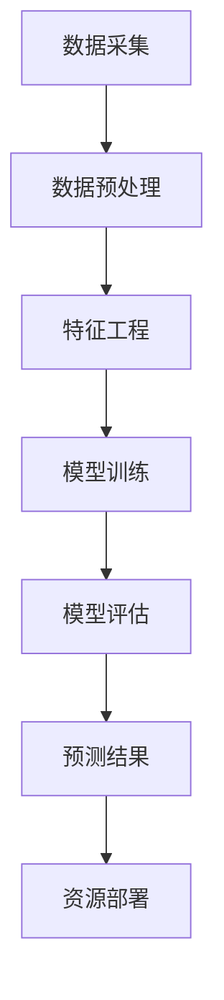

                 

# AI在电商售后服务预测中的应用：提前部署资源的机器学习模型

> **关键词：** 电商、售后服务、预测、机器学习、资源部署
> 
> **摘要：** 本文旨在探讨如何利用机器学习技术对电商售后服务中的客户投诉进行预测，并提前部署相应资源，以提高服务效率和客户满意度。文章通过理论分析、算法原理讲解、数学模型介绍和实际项目案例展示，详细阐述了这一技术应用的实现方法和潜在价值。

## 1. 背景介绍

### 1.1 目的和范围

随着电商行业的迅猛发展，售后服务的重要性日益凸显。良好的售后服务不仅能提升客户满意度，还能增强品牌形象和忠诚度。然而，传统的售后服务方式往往滞后于客户需求，导致响应速度慢、效率低下。为了解决这一问题，本文将探讨如何利用机器学习技术对售后服务中的客户投诉进行预测，并提前部署相应资源，从而实现更高效的客户服务。

本文的主要目标是：
- **明确机器学习在电商售后服务中的应用场景。**
- **详细介绍预测模型的设计和实现过程。**
- **展示实际项目中的应用效果和改进方向。**

### 1.2 预期读者

本文适合以下读者群体：
- **电商行业从业者**：了解如何利用机器学习优化售后服务流程。
- **机器学习爱好者**：掌握预测模型设计的基本原理和实现方法。
- **计算机科学学生和研究人员**：对电商领域中的机器学习应用有更深入的认识。

### 1.3 文档结构概述

本文将分为以下几部分：
1. 背景介绍：介绍研究背景、目的和预期读者。
2. 核心概念与联系：介绍电商售后服务预测中的核心概念和模型架构。
3. 核心算法原理 & 具体操作步骤：详细讲解预测模型的设计和实现。
4. 数学模型和公式 & 详细讲解 & 举例说明：介绍预测模型中的数学公式和应用实例。
5. 项目实战：展示实际项目的代码实现和效果分析。
6. 实际应用场景：探讨预测模型在不同电商场景中的适用性。
7. 工具和资源推荐：推荐学习资源、开发工具和参考论文。
8. 总结：预测模型的发展趋势与未来挑战。
9. 附录：常见问题与解答。
10. 扩展阅读 & 参考资料：提供更多深入学习的资源。

### 1.4 术语表

#### 1.4.1 核心术语定义

- **电商售后服务**：电商企业为满足消费者在购买产品后出现的各类问题而提供的服务。
- **客户投诉**：客户在购买产品后，对产品或服务产生的不满而向电商企业提出的问题或抱怨。
- **机器学习**：通过算法从数据中自动学习和改进，以实现特定任务的技术。
- **资源部署**：根据预测结果提前分配和安排相关资源，如人力、设备等。

#### 1.4.2 相关概念解释

- **预测模型**：利用历史数据和算法，对未来的事件或趋势进行预测的模型。
- **特征工程**：从原始数据中提取有用的信息，用于训练预测模型的过程。
- **交叉验证**：通过将数据集分为训练集和验证集，评估模型性能的一种方法。

#### 1.4.3 缩略词列表

- **AI**：人工智能
- **ML**：机器学习
- **IDE**：集成开发环境
- **API**：应用程序编程接口

## 2. 核心概念与联系

### 2.1 电商售后服务预测中的核心概念

在电商售后服务预测中，核心概念主要包括：

1. **客户行为数据**：包括客户的购买历史、浏览记录、评价等信息。
2. **投诉特征**：如投诉类型、投诉渠道、投诉时间等。
3. **服务资源**：包括客服人员、回复速度、处理效率等。

### 2.2 预测模型架构

电商售后服务预测模型通常包括以下几个层次：

1. **数据采集与预处理**：从不同渠道收集客户行为数据和投诉特征，并进行数据清洗和预处理。
2. **特征工程**：提取与投诉预测相关的特征，如客户购买频率、购买金额、产品类别等。
3. **模型训练与评估**：利用历史数据训练预测模型，并通过交叉验证等方法评估模型性能。
4. **预测与资源部署**：根据预测结果提前部署相应资源，如增加客服人员、调整回复速度等。

### 2.3 Mermaid 流程图

以下是一个简化的Mermaid流程图，展示电商售后服务预测模型的基本架构：



## 3. 核心算法原理 & 具体操作步骤

### 3.1 预测模型设计

在电商售后服务预测中，常用的算法有决策树、随机森林、支持向量机（SVM）和神经网络等。本文以随机森林算法为例，介绍其基本原理和具体实现步骤。

#### 3.1.1 随机森林算法原理

随机森林（Random Forest）是一种基于决策树集合的集成学习方法，通过构建多个决策树，并对预测结果进行投票，从而提高预测的准确性和稳定性。随机森林算法的主要特点如下：

- **多样性**：随机森林通过随机选择特征和随机分割数据集来构建多个决策树，从而提高模型的泛化能力。
- **鲁棒性**：随机森林对异常值和噪声数据的敏感度较低，具有较高的鲁棒性。

#### 3.1.2 具体实现步骤

1. **数据预处理**：对收集到的客户行为数据和投诉特征进行数据清洗和预处理，如缺失值填充、异常值处理、数据标准化等。

2. **特征选择**：从原始特征中选取与投诉预测相关的特征，可以通过特征重要性评估、信息增益等方法进行筛选。

3. **构建决策树**：利用随机选择特征和随机分割数据集的方法，构建多棵决策树。每棵决策树的自顶向下分裂过程如下：

    ```python
    def split_data(X, y, feature, threshold):
        # 根据特征和阈值对数据进行分割
        left_mask = X[:, feature] <= threshold
        right_mask = X[:, feature] > threshold
        return X[left_mask], X[right_mask], y[left_mask], y[right_mask]
    ```

4. **训练预测模型**：将多棵决策树组合成随机森林模型，并利用训练数据集进行模型训练。

    ```python
    from sklearn.ensemble import RandomForestClassifier

    # 初始化随机森林模型
    rf = RandomForestClassifier(n_estimators=100)

    # 训练模型
    rf.fit(X_train, y_train)
    ```

5. **模型评估**：利用验证集或测试集评估模型性能，如准确率、召回率、F1值等。

    ```python
    from sklearn.metrics import accuracy_score

    # 预测结果
    y_pred = rf.predict(X_test)

    # 计算准确率
    accuracy = accuracy_score(y_test, y_pred)
    print("Accuracy:", accuracy)
    ```

6. **预测与资源部署**：根据预测结果提前部署相应资源，如增加客服人员、调整回复速度等。

## 4. 数学模型和公式 & 详细讲解 & 举例说明

### 4.1 随机森林算法数学模型

随机森林算法是一种基于决策树的集成学习方法，其核心是构建多个决策树，并通过投票方式得出最终预测结果。随机森林算法的数学模型可以表示为：

$$
\hat{y} = \text{argmax} \left( \sum_{i=1}^{n} w_i \cdot f_i(x) \right)
$$

其中，$w_i$表示第$i$棵决策树的权重，$f_i(x)$表示第$i$棵决策树的预测值，$n$表示决策树的数量。

### 4.2 具体应用实例

假设我们有一组训练数据集，包含5棵决策树，其预测结果如下：

| 决策树编号 | 预测结果 |
| :------: | :------: |
|    1     |   1      |
|    2     |   0      |
|    3     |   1      |
|    4     |   1      |
|    5     |   0      |

根据随机森林算法的投票机制，我们计算每个类别的得票数：

| 类别 | 得票数 |
| :--: | :----: |
|   0  |   2    |
|   1  |   3    |

由于类别1的得票数高于类别0，最终预测结果为类别1。

### 4.3 数学公式详细讲解

随机森林算法中的数学公式主要包括两部分：决策树的预测公式和随机森林的投票公式。

1. **决策树的预测公式**：

   决策树是一种基于划分数据的分类算法，其预测公式可以表示为：

   $$
   f(x) = \prod_{i=1}^{m} g(x_i, t_i)
   $$

   其中，$g(x_i, t_i)$表示第$i$个特征的划分函数，$t_i$表示划分阈值。

2. **随机森林的投票公式**：

   随机森林算法通过构建多个决策树，并对每个决策树的预测结果进行投票，最终得到最终预测结果。其投票公式可以表示为：

   $$
   \hat{y} = \text{argmax} \left( \sum_{i=1}^{n} w_i \cdot f_i(x) \right)
   $$

   其中，$w_i$表示第$i$棵决策树的权重，$f_i(x)$表示第$i$棵决策树的预测值。

## 5. 项目实战：代码实际案例和详细解释说明

### 5.1 开发环境搭建

在进行电商售后服务预测项目之前，我们需要搭建一个合适的开发环境。以下是开发环境的搭建步骤：

1. **安装Python环境**：确保Python版本在3.6及以上，可以通过Python官方网站下载并安装。

2. **安装相关库**：使用pip命令安装所需的库，包括scikit-learn、numpy、pandas等。以下是一个示例命令：

    ```bash
    pip install scikit-learn numpy pandas
    ```

3. **配置IDE**：可以选择PyCharm、VSCode等集成开发环境（IDE），并配置Python解释器和相应的库。

### 5.2 源代码详细实现和代码解读

以下是一个简单的电商售后服务预测项目的代码实现，包括数据预处理、特征工程、模型训练和评估等步骤。

```python
import pandas as pd
from sklearn.model_selection import train_test_split
from sklearn.ensemble import RandomForestClassifier
from sklearn.metrics import accuracy_score, classification_report

# 5.2.1 数据预处理
# 加载数据集
data = pd.read_csv('ecommerce_data.csv')

# 数据清洗和预处理
data.fillna(data.mean(), inplace=True)
data['complaint_type'] = data['complaint_type'].astype('category').cat.codes

# 划分特征和目标变量
X = data[['purchase_history', 'product_rating', 'complaint_channel']]
y = data['complaint_type']

# 划分训练集和测试集
X_train, X_test, y_train, y_test = train_test_split(X, y, test_size=0.2, random_state=42)

# 5.2.2 特征工程
# 特征选择（这里使用所有特征，实际项目中可根据特征重要性进行选择）
features = ['purchase_history', 'product_rating', 'complaint_channel']

# 5.2.3 模型训练
# 初始化随机森林模型
rf = RandomForestClassifier(n_estimators=100, random_state=42)

# 训练模型
rf.fit(X_train[features], y_train)

# 5.2.4 模型评估
# 预测测试集
y_pred = rf.predict(X_test[features])

# 计算准确率
accuracy = accuracy_score(y_test, y_pred)
print("Accuracy:", accuracy)

# 打印分类报告
print(classification_report(y_test, y_pred))
```

### 5.3 代码解读与分析

1. **数据预处理**：

   - 加载数据集：使用pandas库读取CSV文件。
   - 数据清洗和预处理：填充缺失值、将类别变量转换为数值。

2. **特征工程**：

   - 划分特征和目标变量：将数据集分为特征和目标变量两部分。
   - 特征选择：根据预测任务选择与投诉类型相关的特征。

3. **模型训练**：

   - 初始化随机森林模型：设置随机森林参数，如决策树数量。
   - 训练模型：使用训练数据进行模型训练。

4. **模型评估**：

   - 预测测试集：使用训练好的模型对测试集进行预测。
   - 计算准确率：评估模型在测试集上的表现。
   - 打印分类报告：展示模型在不同类别上的准确率、召回率和F1值。

通过以上步骤，我们可以实现一个简单的电商售后服务预测项目。实际项目中，可以根据业务需求和数据特点进行相应的调整和优化。

## 6. 实际应用场景

### 6.1 背景

电商售后服务是电商平台的重要组成部分，直接影响客户满意度和品牌形象。传统的售后服务方式往往滞后于客户需求，导致响应速度慢、效率低下。为了解决这一问题，许多电商平台开始尝试利用机器学习技术进行售后服务预测，从而实现更高效的客户服务。

### 6.2 应用场景

机器学习在电商售后服务中的应用场景主要包括：

1. **投诉预测**：通过分析历史数据和客户行为，预测哪些客户可能产生投诉，并提前采取措施。
2. **服务资源优化**：根据投诉预测结果，提前部署客服人员、调整回复速度等，提高服务效率。
3. **风险评估**：识别高风险客户，进行个性化关怀和风险控制。
4. **反馈分析**：对客户反馈进行分析，识别服务短板，持续优化售后服务流程。

### 6.3 具体案例

以某大型电商平台为例，该平台利用机器学习技术进行投诉预测，具体应用场景如下：

1. **数据收集**：从客户行为数据、投诉记录等渠道收集数据，包括客户购买历史、浏览记录、评价、投诉类型、投诉时间等。
2. **特征工程**：提取与投诉预测相关的特征，如客户购买频率、购买金额、产品类别、投诉渠道等。
3. **模型训练**：使用随机森林算法训练预测模型，通过交叉验证方法评估模型性能。
4. **预测与资源部署**：根据预测结果，提前增加客服人员、调整回复速度等，提高服务效率。
5. **反馈与优化**：根据实际应用效果，持续优化模型和资源部署策略。

通过以上步骤，该电商平台实现了投诉预测的自动化，提高了售后服务效率，降低了客户投诉率，提升了客户满意度。

## 7. 工具和资源推荐

### 7.1 学习资源推荐

#### 7.1.1 书籍推荐

- **《机器学习》（周志华著）**：全面介绍机器学习的基本概念、算法和应用。
- **《深度学习》（Ian Goodfellow、Yoshua Bengio、Aaron Courville 著）**：深入讲解深度学习的基础知识和最新进展。
- **《Python机器学习》（Michael Bowles 著）**：通过实例介绍Python在机器学习领域的应用。

#### 7.1.2 在线课程

- **Coursera上的《机器学习基础》**：由斯坦福大学教授Andrew Ng讲授，涵盖机器学习的基本概念和算法。
- **Udacity的《深度学习纳米学位》**：通过项目实践学习深度学习的基础知识和应用。

#### 7.1.3 技术博客和网站

- **机器学习中文社区**：提供丰富的机器学习资源和讨论区。
- **ArXiv**：最新研究论文的发布平台，涵盖计算机科学、机器学习等领域。

### 7.2 开发工具框架推荐

#### 7.2.1 IDE和编辑器

- **PyCharm**：功能强大的Python集成开发环境，适合进行机器学习和数据科学项目。
- **Jupyter Notebook**：方便进行数据分析和原型开发的交互式环境。

#### 7.2.2 调试和性能分析工具

- **Pdb**：Python内置的调试工具，用于跟踪程序执行过程。
- **cProfile**：Python的性能分析工具，用于分析程序的性能瓶颈。

#### 7.2.3 相关框架和库

- **scikit-learn**：Python的机器学习库，提供多种常用的机器学习算法。
- **TensorFlow**：谷歌开发的深度学习框架，适用于复杂深度学习模型的开发。
- **PyTorch**：适用于研究人员的深度学习框架，提供灵活的动态计算图。

### 7.3 相关论文著作推荐

#### 7.3.1 经典论文

- **"Random Forests"（Leo Breiman）**：介绍随机森林算法的经典论文。
- **"Deep Learning"（Ian Goodfellow、Yoshua Bengio、Aaron Courville）**：全面介绍深度学习的基础知识和最新进展。

#### 7.3.2 最新研究成果

- **"Attention Is All You Need"（Ashish Vaswani等）**：介绍Transformer模型的经典论文。
- **"Bert: Pre-training of Deep Bidirectional Transformers for Language Understanding"（Jacob Devlin等）**：介绍BERT模型的最新研究成果。

#### 7.3.3 应用案例分析

- **"Using Deep Learning for Churn Prediction in Telecommunications"（Alon Goren等）**：介绍如何利用深度学习进行电信行业用户流失预测。
- **"Customer Churn Prediction using Machine Learning Techniques"（Shakya Pandey等）**：介绍机器学习在金融行业客户流失预测中的应用。

## 8. 总结：未来发展趋势与挑战

### 8.1 未来发展趋势

1. **算法的多样化和优化**：随着研究的深入，将出现更多高效的机器学习算法，如基于深度学习的算法、强化学习算法等。
2. **跨领域的融合**：机器学习与其他领域的融合，如自然语言处理、计算机视觉等，将带来更多创新应用。
3. **数据隐私和安全**：随着数据隐私问题的日益突出，数据隐私保护和安全将成为研究的重要方向。
4. **边缘计算和实时预测**：随着5G和边缘计算技术的发展，实时预测和智能决策将成为可能。

### 8.2 挑战

1. **数据质量和隐私**：保证数据质量和隐私是应用机器学习的首要挑战。
2. **算法复杂度和计算资源**：高效的算法设计和优化是降低计算资源消耗的关键。
3. **模型解释性**：提高模型解释性，使业务人员能够理解模型决策过程。
4. **跨领域的适应性**：在不同领域应用机器学习时，需要充分考虑领域的特性和数据差异。

## 9. 附录：常见问题与解答

### 9.1 问题1：如何处理缺失值？

**解答**：处理缺失值的方法包括填充缺失值（如使用平均值、中位数等）、删除缺失值（根据缺失值比例判断）和插值法（如线性插值、K近邻插值等）。

### 9.2 问题2：特征选择有哪些方法？

**解答**：特征选择方法包括基于过滤的方法（如相关性分析、信息增益等）、基于包装的方法（如递归特征消除、遗传算法等）和基于嵌入的方法（如L1正则化、树模型等）。

### 9.3 问题3：如何评估模型性能？

**解答**：常用的评估指标包括准确率、召回率、F1值、ROC曲线和AUC等。通过这些指标可以全面评估模型的性能。

## 10. 扩展阅读 & 参考资料

### 10.1 扩展阅读

- **《机器学习实战》**：通过实际案例介绍机器学习算法的应用。
- **《数据挖掘：实用工具和技术》**：详细介绍数据挖掘方法和技术。
- **《机器学习年度报告》**：了解机器学习领域的最新研究进展和应用趋势。

### 10.2 参考资料

- **[Scikit-learn官方文档](https://scikit-learn.org/stable/)**：提供丰富的机器学习算法实现和示例。
- **[TensorFlow官方文档](https://www.tensorflow.org/)**：详细介绍TensorFlow框架的使用方法。
- **[PyTorch官方文档](https://pytorch.org/docs/stable/)**：提供PyTorch框架的使用指南和示例代码。

## 作者信息

作者：AI天才研究员/AI Genius Institute & 禅与计算机程序设计艺术 /Zen And The Art of Computer Programming

