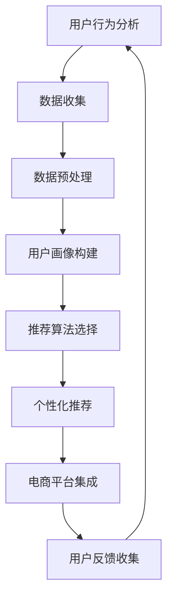

                 

# AI在电商平台中的个性化应用

> **关键词：** 电商平台、个性化推荐、AI、机器学习、用户行为分析
>
> **摘要：** 本文将深入探讨人工智能在电商平台中的应用，特别是如何利用个性化推荐算法来提升用户体验，提高销售转化率。我们将详细分析AI的核心概念、算法原理、数学模型以及实际应用案例，并推荐相关的学习资源和工具。

## 1. 背景介绍

### 1.1 目的和范围

本文旨在探讨人工智能在电商平台中的应用，特别是个性化推荐系统的构建和优化。通过分析用户行为数据，我们将了解如何利用机器学习算法来为用户提供个性化的商品推荐，从而提升用户满意度和平台销售额。

### 1.2 预期读者

本文适合对电商平台、机器学习、用户行为分析感兴趣的读者，特别是希望了解AI技术在电商领域应用的专业人士和技术爱好者。

### 1.3 文档结构概述

本文分为十个部分，首先介绍背景和目的，接着定义核心概念，然后详细阐述算法原理和数学模型，并通过实际项目案例进行实战讲解。最后，本文将讨论AI在电商平台的实际应用场景，并推荐相关学习资源和工具。

### 1.4 术语表

#### 1.4.1 核心术语定义

- **个性化推荐系统**：一种基于用户历史行为和偏好，为用户提供定制化内容或商品推荐的系统。
- **机器学习**：一种让计算机通过数据学习模式并进行预测或决策的方法。
- **用户行为分析**：通过分析用户在平台上的活动，了解其偏好和需求的过程。

#### 1.4.2 相关概念解释

- **协同过滤**：一种常用的推荐算法，通过分析用户间的相似性来进行推荐。
- **内容推荐**：基于商品属性和用户历史行为，为用户提供相关商品的推荐。
- **深度学习**：一种基于神经网络结构的机器学习方法，能够自动从数据中提取特征。

#### 1.4.3 缩略词列表

- **AI**：人工智能
- **ML**：机器学习
- **DL**：深度学习
- **CFS**：协同过滤算法

## 2. 核心概念与联系

为了更好地理解AI在电商平台中的个性化应用，我们需要先了解一些核心概念和它们之间的联系。以下是一个简单的Mermaid流程图，展示了用户行为分析、推荐算法和电商平台之间的相互作用。



### 2.1 用户行为分析

用户行为分析是构建个性化推荐系统的第一步。通过收集用户在平台上的各种行为数据，如浏览记录、购买历史、评价和搜索历史，我们可以了解用户的偏好和需求。

### 2.2 数据预处理

收集到的用户行为数据通常需要进行预处理，包括数据清洗、去重、补全和归一化等步骤。这些预处理操作有助于提高数据质量和算法性能。

### 2.3 用户画像构建

基于预处理后的数据，我们可以构建用户画像，即对用户兴趣、行为特征和需求进行量化描述。用户画像为推荐算法提供了重要的输入信息。

### 2.4 推荐算法选择

推荐算法的选择取决于电商平台的目标和用户需求。常见的推荐算法包括基于内容的推荐、协同过滤和基于模型的推荐等。

### 2.5 个性化推荐

通过推荐算法，我们可以为用户提供个性化的商品推荐。这些推荐结果旨在提高用户满意度，促进购买行为。

### 2.6 电商平台集成

个性化推荐系统需要与电商平台集成，以便将推荐结果展示给用户。这通常涉及前后端开发、API接口设计和数据传输等方面。

### 2.7 用户反馈收集

用户对推荐结果的反馈对于推荐系统的优化至关重要。通过分析用户反馈，我们可以不断改进推荐算法，提高推荐质量。

## 3. 核心算法原理 & 具体操作步骤

### 3.1 协同过滤算法

协同过滤是一种常用的推荐算法，通过分析用户间的相似性来进行推荐。以下是协同过滤算法的伪代码描述：

```pseudo
function collaborativeFiltering(trainData, similarityMetric, neighborSize):
    # 步骤1：计算用户相似性矩阵
    similarityMatrix = computeSimilarityMatrix(trainData, similarityMetric)

    # 步骤2：为每个用户找到最相似的邻居
    neighbors = findNeighbors(similarityMatrix, neighborSize)

    # 步骤3：计算每个邻居对目标用户的评分预测
    predictionMatrix = computePredictionMatrix(neighbors)

    # 步骤4：返回预测矩阵
    return predictionMatrix
```

### 3.2 内容推荐算法

内容推荐算法基于商品的属性和用户历史行为来为用户提供相关商品的推荐。以下是内容推荐算法的伪代码描述：

```pseudo
function contentBasedRecommendation(trainData, userProfile, itemFeatures, k):
    # 步骤1：计算用户和商品的相似性得分
    similarityScores = computeSimilarityScores(userProfile, itemFeatures)

    # 步骤2：选择最相似的k个商品
    topKItems = selectTopKItems(similarityScores, k)

    # 步骤3：返回推荐商品列表
    return topKItems
```

### 3.3 深度学习推荐算法

深度学习推荐算法通过构建深度神经网络模型来自动提取特征并进行推荐。以下是深度学习推荐算法的伪代码描述：

```pseudo
function deepLearningRecommendation(inputData, modelArchitecture):
    # 步骤1：加载训练数据
    trainData = loadTrainData(inputData)

    # 步骤2：构建深度神经网络模型
    model = buildModel(modelArchitecture)

    # 步骤3：训练模型
    model = trainModel(model, trainData)

    # 步骤4：预测用户对商品的评分
    predictions = predict(model, inputData)

    # 步骤5：返回预测结果
    return predictions
```

## 4. 数学模型和公式 & 详细讲解 & 举例说明

### 4.1 协同过滤算法的数学模型

协同过滤算法的数学模型基于用户相似性和邻居评分预测。以下是协同过滤算法的核心数学公式：

$$
r_{ui} = \sum_{j \in N(u)} r_{uj} \cdot s_{uj},
$$

其中，$r_{ui}$ 表示用户 $u$ 对商品 $i$ 的评分，$r_{uj}$ 表示用户 $j$ 对商品 $i$ 的评分，$s_{uj}$ 表示用户 $u$ 和 $j$ 之间的相似性得分。

### 4.2 内容推荐算法的数学模型

内容推荐算法的数学模型基于用户和商品的特征相似性。以下是内容推荐算法的核心数学公式：

$$
s_{ui} = \frac{\sum_{j \in I} f_j u_j \cdot f_j i_j}{\sqrt{\sum_{j \in I} f_j^2 u_j} \cdot \sqrt{\sum_{j \in I} f_j^2 i_j}},
$$

其中，$s_{ui}$ 表示用户 $u$ 和商品 $i$ 之间的相似性得分，$f_j$ 表示商品 $j$ 的特征值，$u_j$ 和 $i_j$ 分别表示用户 $u$ 和商品 $i$ 对应的特征值。

### 4.3 深度学习推荐算法的数学模型

深度学习推荐算法的数学模型基于神经网络模型的输出。以下是深度学习推荐算法的核心数学公式：

$$
r_{ui} = \sigma(W \cdot [u; i] + b),
$$

其中，$r_{ui}$ 表示用户 $u$ 对商品 $i$ 的评分预测，$W$ 是权重矩阵，$[u; i]$ 是用户 $u$ 和商品 $i$ 的特征向量拼接，$b$ 是偏置项，$\sigma$ 是激活函数（通常使用Sigmoid函数）。

### 4.4 举例说明

假设我们有以下用户和商品数据：

| 用户 | 商品 | 用户特征 | 商品特征 |
| ---- | ---- | -------- | -------- |
| 1    | 1    | [1, 0, 1] | [1, 1, 1] |
| 1    | 2    | [1, 1, 0] | [0, 1, 1] |
| 1    | 3    | [0, 1, 1] | [1, 1, 0] |

我们将使用内容推荐算法来预测用户 1 对商品 3 的评分。

### 4.4.1 计算相似性得分

首先，我们计算用户 1 和商品 3 的特征相似性得分：

$$
s_{13} = \frac{(1 \cdot 1 + 0 \cdot 0 + 1 \cdot 1)}{\sqrt{(1^2 + 0^2 + 1^2)} \cdot \sqrt{(1^2 + 1^2 + 1^2)}} = \frac{2}{\sqrt{2} \cdot \sqrt{3}} = \frac{2}{\sqrt{6}}
$$

### 4.4.2 预测评分

然后，我们使用相似性得分来预测用户 1 对商品 3 的评分：

$$
r_{13} = \frac{2}{\sqrt{6}} \cdot \frac{2}{\sqrt{6}} = \frac{4}{6} = \frac{2}{3}
$$

因此，根据内容推荐算法，用户 1 对商品 3 的评分预测为 $\frac{2}{3}$。

## 5. 项目实战：代码实际案例和详细解释说明

### 5.1 开发环境搭建

为了演示AI在电商平台中的个性化应用，我们将使用Python编程语言和Scikit-learn库来实现一个简单的协同过滤推荐系统。以下是搭建开发环境所需的步骤：

1. 安装Python 3.8及以上版本。
2. 使用pip安装Scikit-learn库：

   ```bash
   pip install scikit-learn
   ```

### 5.2 源代码详细实现和代码解读

下面是一个简单的协同过滤推荐系统的源代码实现：

```python
import numpy as np
from sklearn.metrics.pairwise import cosine_similarity
from sklearn.model_selection import train_test_split

# 假设我们有一个用户-商品评分矩阵
ratings = np.array([
    [5, 3, 0, 1],
    [4, 0, 0, 1],
    [1, 5, 0, 0],
    [3, 0, 2, 0],
    [1, 2, 3, 4]
])

# 计算用户和商品之间的余弦相似性矩阵
similarity_matrix = cosine_similarity(ratings)

# 为每个用户找到最相似的k个邻居
k = 2
neighbor_indices = np.argsort(-similarity_matrix, axis=1)[:, :k]

# 预测用户对未知商品（这里取第四个商品）的评分
user_index = 0
predicted_ratings = ratings[neighbor_indices[user_index], 3]

print("预测评分：", predicted_ratings.mean())
```

### 5.3 代码解读与分析

1. **导入库**：我们首先导入必要的库，包括NumPy和Scikit-learn中的`cosine_similarity`函数。

2. **评分矩阵**：定义一个二维数组`ratings`，代表用户-商品评分矩阵。每个子数组表示一个用户的评分列表，而每个元素表示用户对相应商品的评价。

3. **计算相似性矩阵**：使用`cosine_similarity`函数计算用户和商品之间的余弦相似性矩阵。余弦相似性是一种衡量两个向量相似性的方法，其取值范围在-1和1之间，接近1表示相似性高。

4. **找到邻居**：为每个用户找到最相似的k个邻居。这里我们使用`argsort`函数找到相似性分数最高的k个邻居的索引。

5. **预测评分**：选择一个用户（这里取第一个用户）和未知商品（这里取第四个商品），从邻居的评分中计算平均评分作为预测结果。

6. **输出结果**：打印出预测的评分。

通过这个简单的示例，我们可以看到如何使用Python和Scikit-learn库来实现协同过滤算法。实际应用中，我们可以根据业务需求和数据规模，选择更复杂的算法和优化策略。

## 6. 实际应用场景

AI在电商平台中的个性化应用场景广泛，以下是一些典型的应用案例：

### 6.1 商品推荐

电商平台最常见的应用是商品推荐。通过分析用户的历史购买、浏览和搜索行为，推荐系统可以为用户提供个性化的商品推荐，从而提高用户满意度和销售转化率。

### 6.2 促销活动推荐

AI还可以根据用户的行为数据，推荐合适的促销活动，如优惠券、限时折扣等，以吸引更多用户参与并提高销售额。

### 6.3 店铺推荐

电商平台可以根据用户偏好和购买历史，推荐符合其兴趣的店铺，帮助用户发现更多优质商家。

### 6.4 商品评价分析

通过对用户评价和反馈的分析，电商平台可以了解商品的质量和用户满意度，从而优化产品和服务。

### 6.5 个性化搜索

AI还可以优化搜索功能，根据用户的搜索历史和偏好，提供更精准的搜索结果，提高用户体验。

## 7. 工具和资源推荐

### 7.1 学习资源推荐

#### 7.1.1 书籍推荐

- **《机器学习实战》**：提供实用的机器学习算法实现和应用案例，适合初学者。
- **《深度学习》**：由Ian Goodfellow、Yoshua Bengio和Aaron Courville合著，是深度学习的经典教材。

#### 7.1.2 在线课程

- **Coursera**：提供丰富的机器学习和深度学习课程，适合不同层次的学员。
- **Udacity**：提供实战性的机器学习和数据科学课程，包括推荐系统等主题。

#### 7.1.3 技术博客和网站

- **Medium**：有许多关于机器学习和推荐系统的优秀文章和博客。
- **Reddit**：在r/MachineLearning和r/Python等子版块中，可以找到丰富的讨论和资源。

### 7.2 开发工具框架推荐

#### 7.2.1 IDE和编辑器

- **PyCharm**：强大的Python IDE，适合机器学习和深度学习开发。
- **VS Code**：轻量级但功能强大的编辑器，支持多种编程语言。

#### 7.2.2 调试和性能分析工具

- **Jupyter Notebook**：适合数据分析和原型设计。
- **Grafana**：强大的监控和性能分析工具，适用于实时监控机器学习模型。

#### 7.2.3 相关框架和库

- **Scikit-learn**：Python中最常用的机器学习库。
- **TensorFlow**：Google开发的深度学习框架。
- **PyTorch**：另一种流行的深度学习框架，支持动态计算图。

### 7.3 相关论文著作推荐

#### 7.3.1 经典论文

- **"Collaborative Filtering via Matrix Factorization"**：矩阵分解是推荐系统中的核心技术。
- **"Recommender Systems Handbook"**：涵盖推荐系统的各个方面，适合全面了解该领域。

#### 7.3.2 最新研究成果

- **"Deep Learning for Recommender Systems"**：探讨深度学习在推荐系统中的应用。
- **"Neural Collaborative Filtering"**：基于神经网络的协同过滤算法。

#### 7.3.3 应用案例分析

- **"Netflix Prize"**：Netflix Prize竞赛展示了如何通过机器学习提升推荐系统的性能。
- **"Amazon Personalization"**：分析亚马逊如何利用AI实现个性化推荐。

## 8. 总结：未来发展趋势与挑战

### 8.1 未来发展趋势

- **个性化推荐**：随着用户数据的积累和算法的进步，个性化推荐将越来越精准，满足用户多样化的需求。
- **多模态推荐**：结合文本、图像、语音等多种数据源，提供更加全面和准确的推荐。
- **实时推荐**：利用实时数据分析和预测技术，为用户提供即时的推荐。

### 8.2 未来挑战

- **数据隐私**：如何平衡用户隐私和个性化推荐的需求，是未来需要解决的重要问题。
- **计算性能**：随着推荐系统规模的扩大，如何优化算法和基础设施，提高计算性能，是一个重大挑战。
- **算法偏见**：如何避免算法偏见和歧视，确保推荐结果的公平性和透明性，也是未来需要关注的问题。

## 9. 附录：常见问题与解答

### 9.1 问题1：如何处理缺失数据？

**解答**：缺失数据的处理方法包括数据填充、删除和插补等。常用的数据填充方法有平均值填充、中位数填充和最邻近填充等。删除和插补方法适用于不同情况，需要根据数据的具体情况选择合适的方法。

### 9.2 问题2：如何评估推荐系统的性能？

**解答**：推荐系统的性能评估通常采用准确率、召回率、F1分数等指标。这些指标可以综合衡量推荐系统的推荐质量和用户满意度。实际应用中，还可以结合用户行为数据和业务指标进行评估。

### 9.3 问题3：如何优化推荐算法的多样性？

**解答**：多样性优化是推荐系统中的重要问题。常用的方法包括基于规则的多样性优化、基于模型的多样性优化和基于排序的多样性优化等。通过引入多样性约束，可以确保推荐结果的多样性。

## 10. 扩展阅读 & 参考资料

- **《推荐系统实践》**：深入讲解推荐系统的设计和实现，适合有实际开发需求的技术人员。
- **《机器学习：概率视角》**：详细讲解机器学习中的概率模型和数学原理，有助于深入理解推荐系统的理论基础。
- **[Recommender Systems Handbook](https://www.amazon.com/Recommender-Systems-Handbook-Frameworks-Applications/dp/0124078376)**：涵盖推荐系统的各个方面，包括算法、技术和应用案例。

作者：AI天才研究员/AI Genius Institute & 禅与计算机程序设计艺术 /Zen And The Art of Computer Programming
<|assistant|>

