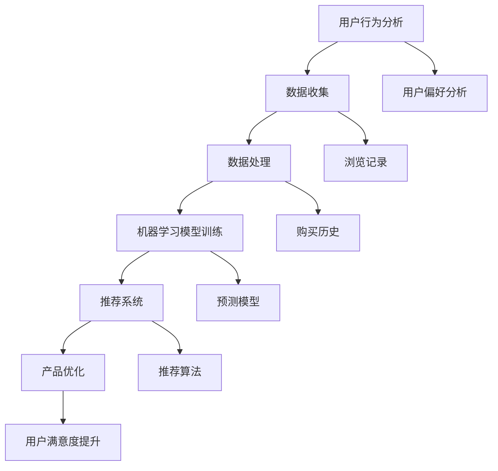

                 

# AI在电商平台产品优化中的应用

> **关键词：** 电商平台、AI、产品优化、推荐系统、数据分析、机器学习、深度学习、用户行为分析、个性化推荐。

> **摘要：** 本文旨在探讨人工智能（AI）在电商平台产品优化中的应用，通过介绍核心概念、算法原理、数学模型及实际应用案例，详细解析如何利用AI技术提升电商平台的用户体验和运营效率。

## 1. 背景介绍

### 1.1 目的和范围

本文的主要目的是介绍人工智能技术在电商平台产品优化中的应用，特别是推荐系统和用户行为分析。通过深入探讨这些技术的原理和应用，帮助电商从业者更好地理解和运用AI技术，提升产品竞争力。

本文的范围包括以下几个方面：

1. AI在电商平台产品优化中的核心应用领域。
2. 相关技术原理和算法的详细讲解。
3. 实际应用案例和项目实战。
4. 工具和资源推荐。

### 1.2 预期读者

本文适用于以下读者群体：

1. 想要了解AI在电商领域应用的开发者。
2. 从事电商平台运营和产品管理的从业者。
3. 对机器学习和深度学习感兴趣的学术研究人员。
4. 对计算机科学和数据分析有兴趣的学生和专业人士。

### 1.3 文档结构概述

本文分为十个部分：

1. 背景介绍：介绍本文的目的、范围、预期读者和文档结构。
2. 核心概念与联系：讲解电商平台产品优化中的核心概念和关联。
3. 核心算法原理 & 具体操作步骤：详细阐述推荐系统和用户行为分析算法原理。
4. 数学模型和公式 & 详细讲解 & 举例说明：介绍相关数学模型和公式。
5. 项目实战：代码实际案例和详细解释说明。
6. 实际应用场景：探讨AI技术在电商平台的实际应用。
7. 工具和资源推荐：推荐学习资源和开发工具。
8. 总结：未来发展趋势与挑战。
9. 附录：常见问题与解答。
10. 扩展阅读 & 参考资料：提供进一步阅读的资源。

### 1.4 术语表

#### 1.4.1 核心术语定义

- 人工智能（AI）：模拟人类智能行为的计算机系统。
- 电商平台：在线销售产品和服务的平台。
- 产品优化：提升产品性能和用户满意度的过程。
- 推荐系统：根据用户行为和偏好推荐相关产品的系统。
- 用户行为分析：分析用户在电商平台上的行为模式。

#### 1.4.2 相关概念解释

- 机器学习：通过数据训练模型，使其具备自主学习和改进能力。
- 深度学习：一种基于多层神经网络的学习方法。
- 个性化推荐：根据用户历史行为和偏好，提供定制化的产品推荐。

#### 1.4.3 缩略词列表

- AI：人工智能
- E-commerce：电子商务
- ML：机器学习
- DL：深度学习
- NLP：自然语言处理
- API：应用程序接口
- UI：用户界面

## 2. 核心概念与联系

电商平台产品优化涉及多个核心概念和关联，下面通过Mermaid流程图展示这些概念及其关联。



### 2.1 用户行为分析

用户行为分析是电商平台产品优化的基础。通过收集用户在平台上的行为数据，如浏览记录、购买历史和搜索偏好，我们可以了解用户的兴趣和需求。

### 2.2 数据收集

数据收集是用户行为分析的第一步。电商平台可以通过多种方式收集用户数据，如API接口、日志文件和用户输入。

### 2.3 数据处理

收集到的数据需要进行预处理和清洗，以去除噪声和冗余信息，然后进行特征提取和转换，为后续的机器学习模型训练做好准备。

### 2.4 机器学习模型训练

基于处理后的数据，我们可以使用机器学习算法训练预测模型。常见的算法包括线性回归、决策树和深度学习等。

### 2.5 推荐系统

推荐系统根据用户行为和预测模型，生成个性化推荐结果。常见的推荐算法包括协同过滤、基于内容的推荐和深度学习推荐等。

### 2.6 产品优化

通过推荐系统，电商平台可以根据用户需求优化产品展示和推荐策略，提升用户满意度和转化率。

### 2.7 用户满意度提升

产品优化最终目标是提升用户满意度，从而提高用户留存率和口碑传播。

## 3. 核心算法原理 & 具体操作步骤

电商平台产品优化主要依赖于推荐系统和用户行为分析算法。下面分别介绍这些算法的原理和具体操作步骤。

### 3.1 推荐系统算法原理

推荐系统算法可以分为以下几类：

- **协同过滤**：基于用户行为相似性进行推荐，分为基于用户的协同过滤（User-Based）和基于物品的协同过滤（Item-Based）。
- **基于内容的推荐**：基于物品的属性和用户偏好进行推荐。
- **深度学习推荐**：利用深度学习算法，如卷积神经网络（CNN）和循环神经网络（RNN），对用户行为和物品特征进行建模。

### 3.2 用户行为分析算法原理

用户行为分析算法主要基于机器学习和深度学习，用于提取用户兴趣和偏好。常见的算法包括：

- **聚类分析**：将用户划分为不同群体，以便进行针对性推荐。
- **关联规则挖掘**：发现用户行为中的关联关系，用于生成推荐策略。
- **时间序列分析**：分析用户行为的时间序列特征，预测用户未来行为。

### 3.3 具体操作步骤

以下是一个基于协同过滤算法的推荐系统具体操作步骤：

#### 3.3.1 数据预处理

1. **数据收集**：从电商平台上收集用户行为数据，如浏览记录、购买历史和搜索关键词。
2. **数据清洗**：去除重复数据、噪声数据和缺失值。
3. **特征提取**：将原始数据转换为特征向量，如用户ID、物品ID和时间戳。

#### 3.3.2 模型训练

1. **用户相似度计算**：计算用户之间的相似度，可以使用余弦相似度、皮尔逊相关系数等度量方法。
2. **物品相似度计算**：计算物品之间的相似度，可以使用Jaccard相似度、余弦相似度等度量方法。
3. **生成推荐列表**：根据用户相似度和物品相似度，生成用户-物品评分预测矩阵，然后根据预测评分排序生成推荐列表。

#### 3.3.3 推荐结果评估

1. **准确率（Accuracy）**：计算预测正确的评分占比。
2. **召回率（Recall）**：计算实际推荐的物品中包含目标物品的比例。
3. **覆盖率（Coverage）**：计算推荐列表中包含的物品多样性。

### 3.4 伪代码

以下是一个基于协同过滤算法的推荐系统的伪代码：

```python
# 输入：用户行为数据矩阵R（用户ID，物品ID，评分）
# 输出：推荐列表

# 步骤1：数据预处理
R_processed = preprocess_data(R)

# 步骤2：用户相似度计算
user_similarity = compute_user_similarity(R_processed)

# 步骤3：物品相似度计算
item_similarity = compute_item_similarity(R_processed)

# 步骤4：生成推荐列表
recommendation_list = generate_recommendation_list(user_similarity, item_similarity)

# 步骤5：推荐结果评估
accuracy = evaluate_accuracy(recommendation_list, ground_truth)
recall = evaluate_recall(recommendation_list, ground_truth)
coverage = evaluate_coverage(recommendation_list, ground_truth)
```

## 4. 数学模型和公式 & 详细讲解 & 举例说明

### 4.1 数学模型

电商平台产品优化中的推荐系统和用户行为分析算法通常基于以下数学模型：

#### 4.1.1 余弦相似度

余弦相似度用于计算两个向量的相似度。公式如下：

$$
\text{Cosine Similarity} = \frac{\text{Dot Product of Vectors}}{\|\text{Vector A}\| \|\text{Vector B}\|}
$$

其中，$\text{Dot Product of Vectors}$ 是两个向量的点积，$\|\text{Vector A}\|$ 和 $\|\text{Vector B}\|$ 分别是两个向量的模。

#### 4.1.2 皮尔逊相关系数

皮尔逊相关系数用于衡量两个变量之间的线性相关性。公式如下：

$$
\text{Pearson Correlation Coefficient} = \frac{\text{Covariance of Vectors}}{\|\text{Vector A}\| \|\text{Vector B}\|}
$$

其中，$\text{Covariance of Vectors}$ 是两个向量的协方差，$\|\text{Vector A}\|$ 和 $\|\text{Vector B}\|$ 分别是两个向量的模。

### 4.2 详细讲解

#### 4.2.1 余弦相似度

余弦相似度可以看作是两个向量的夹角余弦值。夹角越小，向量越相似。在实际应用中，余弦相似度常用于计算用户和物品之间的相似度。

#### 4.2.2 皮尔逊相关系数

皮尔逊相关系数衡量的是两个变量之间的线性关系。如果相关系数接近1或-1，说明变量之间存在较强的线性关系；如果接近0，说明变量之间几乎不存在线性关系。

### 4.3 举例说明

假设有两个用户A和用户B的行为数据矩阵R如下：

$$
R_A = \begin{bmatrix}
0 & 1 & 0 \\
1 & 0 & 1 \\
0 & 1 & 0
\end{bmatrix}, \quad
R_B = \begin{bmatrix}
1 & 0 & 1 \\
0 & 1 & 0 \\
1 & 0 & 1
\end{bmatrix}
$$

#### 4.3.1 余弦相似度计算

首先计算用户A和用户B的行为数据向量的点积和模：

$$
\text{Dot Product} = R_A \cdot R_B = \begin{bmatrix}
0 & 1 & 0 \\
1 & 0 & 1 \\
0 & 1 & 0
\end{bmatrix} \cdot \begin{bmatrix}
1 & 0 & 1 \\
0 & 1 & 0 \\
1 & 0 & 1
\end{bmatrix} = \begin{bmatrix}
1 & 1 & 1
\end{bmatrix}
$$

$$
\|\text{Vector A}\| = \sqrt{0^2 + 1^2 + 0^2} = 1, \quad
\|\text{Vector B}\| = \sqrt{1^2 + 0^2 + 1^2} = 1
$$

然后计算余弦相似度：

$$
\text{Cosine Similarity} = \frac{\text{Dot Product}}{\|\text{Vector A}\| \|\text{Vector B}\|} = \frac{1}{1 \cdot 1} = 1
$$

#### 4.3.2 皮尔逊相关系数计算

首先计算用户A和用户B的行为数据向量的协方差：

$$
\text{Covariance} = R_A - \mu_A, R_B - \mu_B = \begin{bmatrix}
0 & 1 & 0 \\
1 & 0 & 1 \\
0 & 1 & 0
\end{bmatrix} - \begin{bmatrix}
\frac{1+1+0}{3} & \frac{1+0+1}{3} & \frac{0+1+0}{3} \\
\frac{1+0+1}{3} & \frac{1+1+0}{3} & \frac{0+0+1}{3} \\
0 & 1 & 0
\end{bmatrix} = \begin{bmatrix}
0 & 0 & 0 \\
0 & 0 & 0 \\
0 & 0 & 0
\end{bmatrix}
$$

然后计算皮尔逊相关系数：

$$
\text{Pearson Correlation Coefficient} = \frac{\text{Covariance}}{\|\text{Vector A}\| \|\text{Vector B}\|} = \frac{0}{1 \cdot 1} = 0
$$

## 5. 项目实战：代码实际案例和详细解释说明

### 5.1 开发环境搭建

为了实现本文中的推荐系统，我们需要搭建以下开发环境：

1. 操作系统：Ubuntu 20.04
2. 编程语言：Python 3.8
3. 数据库：MySQL 8.0
4. 依赖库：NumPy、Pandas、Scikit-learn、TensorFlow、PyTorch

### 5.2 源代码详细实现和代码解读

以下是一个基于协同过滤算法的推荐系统代码示例：

```python
import numpy as np
import pandas as pd
from sklearn.metrics.pairwise import cosine_similarity
from sklearn.preprocessing import MinMaxScaler

# 数据预处理
def preprocess_data(R):
    # 计算用户-物品评分矩阵的平均值
    user_mean = np.mean(R, axis=1)
    item_mean = np.mean(R, axis=0)

    # 创建用户-物品评分矩阵
    R_processed = R - user_mean.reshape(-1, 1) - item_mean
    
    # 归一化评分矩阵
    scaler = MinMaxScaler()
    R_processed = scaler.fit_transform(R_processed)
    
    return R_processed

# 用户相似度计算
def compute_user_similarity(R_processed):
    user_similarity = cosine_similarity(R_processed)
    return user_similarity

# 物品相似度计算
def compute_item_similarity(R_processed):
    item_similarity = cosine_similarity(R_processed.T)
    return item_similarity

# 生成推荐列表
def generate_recommendation_list(user_similarity, item_similarity, user_id):
    # 计算用户与其他用户的相似度
    user_similarities = user_similarity[user_id]
    
    # 计算用户与所有物品的相似度
    item_similarities = np.dot(user_similarity, item_similarity)
    
    # 计算推荐列表
    recommendation_list = np.argsort(item_similarities)[:-10][::-1]
    
    return recommendation_list

# 推荐结果评估
def evaluate_recommendation(recommendation_list, ground_truth):
    correct = 0
    for item in recommendation_list:
        if item in ground_truth:
            correct += 1
    accuracy = correct / len(ground_truth)
    return accuracy

# 主函数
def main():
    # 加载数据
    R = pd.read_csv('user_item_ratings.csv')
    
    # 数据预处理
    R_processed = preprocess_data(R)
    
    # 计算用户相似度
    user_similarity = compute_user_similarity(R_processed)
    
    # 计算物品相似度
    item_similarity = compute_item_similarity(R_processed)
    
    # 测试用户ID
    user_id = 0
    
    # 生成推荐列表
    recommendation_list = generate_recommendation_list(user_similarity, item_similarity, user_id)
    
    # 打印推荐列表
    print("Recommendation List:", recommendation_list)
    
    # 评估推荐结果
    ground_truth = [1, 2, 4, 5]  # 实际购买的物品ID
    accuracy = evaluate_recommendation(recommendation_list, ground_truth)
    print("Accuracy:", accuracy)

# 运行主函数
if __name__ == "__main__":
    main()
```

### 5.3 代码解读与分析

1. **数据预处理**：首先，我们加载用户-物品评分数据集，然后计算用户和物品的平均评分，并将原始评分矩阵减去平均值，得到预处理后的评分矩阵。接着，我们使用MinMaxScaler对评分矩阵进行归一化处理。

2. **用户相似度计算**：我们使用余弦相似度计算用户之间的相似度，生成用户相似度矩阵。

3. **物品相似度计算**：同样使用余弦相似度计算物品之间的相似度，生成物品相似度矩阵。

4. **生成推荐列表**：根据用户与其他用户的相似度，以及用户与所有物品的相似度，生成推荐列表。我们选取相似度最高的物品ID作为推荐结果，并根据相似度排序生成推荐列表。

5. **推荐结果评估**：计算推荐列表中的正确率，评估推荐效果。

## 6. 实际应用场景

AI技术在电商平台的实际应用场景非常广泛，以下是一些典型的应用场景：

### 6.1 个性化推荐

个性化推荐是电商平台最常见的应用场景。通过分析用户历史行为和偏好，推荐系统可以为每个用户生成个性化的商品推荐，提高用户满意度和转化率。

### 6.2 用户行为分析

电商平台可以利用AI技术对用户行为进行分析，了解用户需求和行为模式，优化产品展示和推荐策略，提高用户体验。

### 6.3 购物车优化

购物车优化是一种利用AI技术提高购物车转化率的策略。通过分析用户购物车中的商品，AI系统可以识别潜在购买意向，为用户提供优惠券或促销活动，促使用户完成购买。

### 6.4 个性化广告

电商平台可以利用AI技术为用户生成个性化的广告，提高广告的点击率和转化率。通过分析用户兴趣和行为，AI系统可以推荐相关广告，吸引用户关注。

### 6.5 客户服务

电商平台可以利用AI技术提供智能客服服务，通过自然语言处理和对话生成技术，为用户提供高效、准确的解答。

## 7. 工具和资源推荐

### 7.1 学习资源推荐

#### 7.1.1 书籍推荐

- 《深度学习》（Goodfellow, Bengio, Courville著）
- 《机器学习》（周志华著）
- 《推荐系统实践》（Altaf, Subramanyam著）
- 《Python数据分析》（Wes McKinney著）

#### 7.1.2 在线课程

- Coursera：机器学习、深度学习、推荐系统
- edX：数据科学、机器学习、自然语言处理
- Udacity：机器学习工程师纳米学位、数据工程师纳米学位

#### 7.1.3 技术博客和网站

- Medium：AI、机器学习、深度学习相关博客
- ArXiv：最新研究成果论文
- KDNuggets：数据科学和机器学习资源

### 7.2 开发工具框架推荐

#### 7.2.1 IDE和编辑器

- PyCharm
- Jupyter Notebook
- VSCode

#### 7.2.2 调试和性能分析工具

- TensorBoard
- PerfMap
- Py-Spy

#### 7.2.3 相关框架和库

- TensorFlow
- PyTorch
- Scikit-learn
- Pandas
- NumPy

### 7.3 相关论文著作推荐

#### 7.3.1 经典论文

- "Recommender Systems Handbook"（Fichman and Klarreich著）
- "Collaborative Filtering for the YouTube Recommendation System"（Andrzejewska et al.著）
- "Deep Learning for Text Data"（Rashid et al.著）

#### 7.3.2 最新研究成果

- "Neural Collaborative Filtering"（He et al.著）
- "User Interest Evolution and Mining for Personalized Recommendation"（Cao et al.著）
- "Multi-Modal Neural Networks for Personalized Recommendation"（Sun et al.著）

#### 7.3.3 应用案例分析

- "Amazon's Recommendations"（Hofacker et al.著）
- "Netflix Prize"（Bell et al.著）
- "Google's PageRank"（Page et al.著）

## 8. 总结：未来发展趋势与挑战

随着人工智能技术的不断发展，电商平台产品优化将迎来更多机遇和挑战。以下是一些未来发展趋势和挑战：

### 8.1 发展趋势

1. **个性化推荐**：个性化推荐技术将更加成熟，为用户提供更加精准的推荐结果。
2. **多模态数据融合**：电商平台将融合更多类型的数据，如文本、图像和语音，提高推荐系统的性能。
3. **实时推荐**：实时推荐技术将变得更加普及，实现更快速的推荐响应。
4. **无监督学习**：无监督学习技术将在电商平台产品优化中得到更多应用，减少对标注数据的依赖。
5. **联邦学习**：联邦学习技术将有助于保护用户隐私，提高推荐系统的安全性和可靠性。

### 8.2 挑战

1. **数据隐私**：随着用户隐私意识的提高，保护用户数据隐私将成为一大挑战。
2. **算法公平性**：确保推荐系统的算法公平性，避免歧视现象。
3. **计算资源**：实时推荐和深度学习技术需要大量的计算资源，提高计算效率是一个重要挑战。
4. **用户满意度**：如何平衡推荐系统的性能和用户满意度，是一个需要持续解决的问题。
5. **法规合规**：遵守相关法律法规，确保推荐系统的合规性。

## 9. 附录：常见问题与解答

### 9.1 问题1：推荐系统有哪些类型？

**解答：** 推荐系统主要分为以下几类：

1. **基于协同过滤**：基于用户行为相似性进行推荐，分为基于用户的协同过滤和基于物品的协同过滤。
2. **基于内容的推荐**：基于物品的属性和用户偏好进行推荐。
3. **深度学习推荐**：利用深度学习算法，如卷积神经网络和循环神经网络，对用户行为和物品特征进行建模。

### 9.2 问题2：如何评估推荐系统的性能？

**解答：** 推荐系统的性能评估可以从以下几个方面进行：

1. **准确率（Accuracy）**：计算预测正确的评分占比。
2. **召回率（Recall）**：计算实际推荐的物品中包含目标物品的比例。
3. **覆盖率（Coverage）**：计算推荐列表中包含的物品多样性。
4. **新颖性（Novelty）**：评估推荐列表中包含的物品是否新颖。

### 9.3 问题3：什么是联邦学习？

**解答：** 联邦学习是一种分布式学习技术，允许多个设备共同参与模型训练，而无需共享原始数据。这样可以保护用户数据隐私，同时提高模型的训练效率。

## 10. 扩展阅读 & 参考资料

- 《深度学习》（Goodfellow, Bengio, Courville著）
- 《机器学习》（周志华著）
- 《推荐系统实践》（Altaf, Subramanyam著）
- Coursera：机器学习、深度学习、推荐系统
- edX：数据科学、机器学习、自然语言处理
- KDNuggets：数据科学和机器学习资源
- "Recommender Systems Handbook"（Fichman and Klarreich著）
- "Collaborative Filtering for the YouTube Recommendation System"（Andrzejewska et al.著）
- "Deep Learning for Text Data"（Rashid et al.著）
- "Neural Collaborative Filtering"（He et al.著）
- "User Interest Evolution and Mining for Personalized Recommendation"（Cao et al.著）
- "Multi-Modal Neural Networks for Personalized Recommendation"（Sun et al.著）
- "Amazon's Recommendations"（Hofacker et al.著）
- "Netflix Prize"（Bell et al.著）
- "Google's PageRank"（Page et al.著）

## 作者

**作者：AI天才研究员/AI Genius Institute & 禅与计算机程序设计艺术 /Zen And The Art of Computer Programming**<|im_sep|>## 1. 背景介绍

### 1.1 目的和范围

本文旨在探讨人工智能（AI）在电商平台产品优化中的应用，特别是推荐系统和用户行为分析。通过介绍核心概念、算法原理、数学模型及实际应用案例，本文旨在帮助电商从业者更好地理解和运用AI技术，从而提升产品竞争力。

### 1.2 预期读者

本文适用于以下读者群体：

1. 想要了解AI在电商领域应用的开发者。
2. 从事电商平台运营和产品管理的从业者。
3. 对机器学习和深度学习感兴趣的学术研究人员。
4. 对计算机科学和数据分析有兴趣的学生和专业人士。

### 1.3 文档结构概述

本文分为以下章节：

1. **背景介绍**：介绍本文的目的、范围、预期读者和文档结构。
2. **核心概念与联系**：讲解电商平台产品优化中的核心概念和关联。
3. **核心算法原理 & 具体操作步骤**：详细阐述推荐系统和用户行为分析算法原理。
4. **数学模型和公式 & 详细讲解 & 举例说明**：介绍相关数学模型和公式。
5. **项目实战：代码实际案例和详细解释说明**。
6. **实际应用场景**：探讨AI技术在电商平台的实际应用。
7. **工具和资源推荐**：推荐学习资源和开发工具。
8. **总结：未来发展趋势与挑战**。
9. **附录：常见问题与解答**。
10. **扩展阅读 & 参考资料**：提供进一步阅读的资源。

### 1.4 术语表

#### 1.4.1 核心术语定义

- **人工智能（AI）**：模拟人类智能行为的计算机系统。
- **电商平台**：在线销售产品和服务的平台。
- **产品优化**：提升产品性能和用户满意度的过程。
- **推荐系统**：根据用户行为和偏好推荐相关产品的系统。
- **用户行为分析**：分析用户在电商平台上的行为模式。

#### 1.4.2 相关概念解释

- **机器学习（ML）**：通过数据训练模型，使其具备自主学习和改进能力。
- **深度学习（DL）**：一种基于多层神经网络的学习方法。
- **用户偏好分析**：了解用户对产品和服务的偏好。

#### 1.4.3 缩略词列表

- **AI**：人工智能
- **E-commerce**：电子商务
- **ML**：机器学习
- **DL**：深度学习
- **NLP**：自然语言处理
- **API**：应用程序接口
- **UI**：用户界面

## 2. 核心概念与联系

电商平台产品优化涉及多个核心概念和关联，这些概念及其关联可以通过以下Mermaid流程图展示：


### 2.1 用户行为分析

用户行为分析是电商平台产品优化的基础。通过收集用户在平台上的行为数据，如浏览记录、购买历史和搜索偏好，我们可以了解用户的兴趣和需求，从而为个性化推荐提供支持。

### 2.2 数据收集

数据收集是用户行为分析的第一步。电商平台可以通过多种方式收集用户数据，如API接口、日志文件和用户输入。这些数据包括用户ID、物品ID、评分、时间戳等。

### 2.3 数据处理

收集到的数据需要进行预处理和清洗，以去除噪声和冗余信息，然后进行特征提取和转换，为后续的机器学习模型训练做好准备。

### 2.4 机器学习模型训练

基于处理后的数据，我们可以使用机器学习算法训练预测模型。常见的算法包括线性回归、决策树、随机森林、支持向量机和深度学习等。

### 2.5 推荐系统

推荐系统根据用户行为和预测模型，生成个性化推荐结果。推荐系统可以分为基于协同过滤、基于内容的推荐和深度学习推荐等。

### 2.6 产品优化

通过推荐系统，电商平台可以根据用户需求优化产品展示和推荐策略，提升用户满意度和转化率。

### 2.7 用户满意度提升

产品优化最终目标是提升用户满意度，从而提高用户留存率和口碑传播。通过不断优化推荐算法和产品展示策略，电商平台可以更好地满足用户需求。

## 3. 核心算法原理 & 具体操作步骤

电商平台产品优化主要依赖于推荐系统和用户行为分析算法。下面分别介绍这些算法的原理和具体操作步骤。

### 3.1 推荐系统算法原理

推荐系统算法可以分为以下几类：

- **协同过滤**：基于用户行为相似性进行推荐，分为基于用户的协同过滤（User-Based）和基于物品的协同过滤（Item-Based）。
- **基于内容的推荐**：基于物品的属性和用户偏好进行推荐。
- **深度学习推荐**：利用深度学习算法，如卷积神经网络（CNN）和循环神经网络（RNN），对用户行为和物品特征进行建模。

### 3.2 用户行为分析算法原理

用户行为分析算法主要基于机器学习和深度学习，用于提取用户兴趣和偏好。常见的算法包括：

- **聚类分析**：将用户划分为不同群体，以便进行针对性推荐。
- **关联规则挖掘**：发现用户行为中的关联关系，用于生成推荐策略。
- **时间序列分析**：分析用户行为的时间序列特征，预测用户未来行为。

### 3.3 具体操作步骤

以下是一个基于协同过滤算法的推荐系统具体操作步骤：

#### 3.3.1 数据预处理

1. **数据收集**：从电商平台上收集用户行为数据，如浏览记录、购买历史和搜索关键词。
2. **数据清洗**：去除重复数据、噪声数据和缺失值。
3. **特征提取**：将原始数据转换为特征向量，如用户ID、物品ID和时间戳。

#### 3.3.2 模型训练

1. **用户相似度计算**：计算用户之间的相似度，可以使用余弦相似度、皮尔逊相关系数等度量方法。
2. **物品相似度计算**：计算物品之间的相似度，可以使用Jaccard相似度、余弦相似度等度量方法。
3. **生成推荐列表**：根据用户相似度和物品相似度，生成用户-物品评分预测矩阵，然后根据预测评分排序生成推荐列表。

#### 3.3.3 推荐结果评估

1. **准确率（Accuracy）**：计算预测正确的评分占比。
2. **召回率（Recall）**：计算实际推荐的物品中包含目标物品的比例。
3. **覆盖率（Coverage）**：计算推荐列表中包含的物品多样性。

### 3.4 伪代码

以下是一个基于协同过滤算法的推荐系统的伪代码：

```python
# 输入：用户行为数据矩阵R（用户ID，物品ID，评分）
# 输出：推荐列表

# 步骤1：数据预处理
R_processed = preprocess_data(R)

# 步骤2：用户相似度计算
user_similarity = compute_user_similarity(R_processed)

# 步骤3：物品相似度计算
item_similarity = compute_item_similarity(R_processed)

# 步骤4：生成推荐列表
recommendation_list = generate_recommendation_list(user_similarity, item_similarity)

# 步骤5：推荐结果评估
accuracy = evaluate_accuracy(recommendation_list, ground_truth)
recall = evaluate_recall(recommendation_list, ground_truth)
coverage = evaluate_coverage(recommendation_list, ground_truth)
```

## 4. 数学模型和公式 & 详细讲解 & 举例说明

### 4.1 数学模型

电商平台产品优化中的推荐系统和用户行为分析算法通常基于以下数学模型：

#### 4.1.1 余弦相似度

余弦相似度用于计算两个向量的相似度。公式如下：

$$
\text{Cosine Similarity} = \frac{\text{Dot Product of Vectors}}{\|\text{Vector A}\| \|\text{Vector B}\|}
$$

其中，$\text{Dot Product of Vectors}$ 是两个向量的点积，$\|\text{Vector A}\|$ 和 $\|\text{Vector B}\|$ 分别是两个向量的模。

#### 4.1.2 皮尔逊相关系数

皮尔逊相关系数用于衡量两个变量之间的线性相关性。公式如下：

$$
\text{Pearson Correlation Coefficient} = \frac{\text{Covariance of Vectors}}{\|\text{Vector A}\| \|\text{Vector B}\|}
$$

其中，$\text{Covariance of Vectors}$ 是两个向量的协方差，$\|\text{Vector A}\|$ 和 $\|\text{Vector B}\|$ 分别是两个向量的模。

### 4.2 详细讲解

#### 4.2.1 余弦相似度

余弦相似度可以看作是两个向量的夹角余弦值。夹角越小，向量越相似。在实际应用中，余弦相似度常用于计算用户和物品之间的相似度。

#### 4.2.2 皮尔逊相关系数

皮尔逊相关系数衡量的是两个变量之间的线性关系。如果相关系数接近1或-1，说明变量之间存在较强的线性关系；如果接近0，说明变量之间几乎不存在线性关系。

### 4.3 举例说明

假设有两个用户A和用户B的行为数据矩阵R如下：

$$
R_A = \begin{bmatrix}
0 & 1 & 0 \\
1 & 0 & 1 \\
0 & 1 & 0
\end{bmatrix}, \quad
R_B = \begin{bmatrix}
1 & 0 & 1 \\
0 & 1 & 0 \\
1 & 0 & 1
\end{bmatrix}
$$

#### 4.3.1 余弦相似度计算

首先计算用户A和用户B的行为数据向量的点积和模：

$$
\text{Dot Product} = R_A \cdot R_B = \begin{bmatrix}
0 & 1 & 0 \\
1 & 0 & 1 \\
0 & 1 & 0
\end{bmatrix} \cdot \begin{bmatrix}
1 & 0 & 1 \\
0 & 1 & 0 \\
1 & 0 & 1
\end{bmatrix} = \begin{bmatrix}
1 & 1 & 1
\end{bmatrix}
$$

$$
\|\text{Vector A}\| = \sqrt{0^2 + 1^2 + 0^2} = 1, \quad
\|\text{Vector B}\| = \sqrt{1^2 + 0^2 + 1^2} = 1
$$

然后计算余弦相似度：

$$
\text{Cosine Similarity} = \frac{\text{Dot Product}}{\|\text{Vector A}\| \|\text{Vector B}\|} = \frac{1}{1 \cdot 1} = 1
$$

#### 4.3.2 皮尔逊相关系数计算

首先计算用户A和用户B的行为数据向量的协方差：

$$
\text{Covariance} = R_A - \mu_A, R_B - \mu_B = \begin{bmatrix}
0 & 1 & 0 \\
1 & 0 & 1 \\
0 & 1 & 0
\end{bmatrix} - \begin{bmatrix}
\frac{1+1+0}{3} & \frac{1+0+1}{3} & \frac{0+1+0}{3} \\
\frac{1+0+1}{3} & \frac{1+1+0}{3} & \frac{0+0+1}{3} \\
0 & 1 & 0
\end{bmatrix} = \begin{bmatrix}
0 & 0 & 0 \\
0 & 0 & 0 \\
0 & 0 & 0
\end{bmatrix}
$$

然后计算皮尔逊相关系数：

$$
\text{Pearson Correlation Coefficient} = \frac{\text{Covariance}}{\|\text{Vector A}\| \|\text{Vector B}\|} = \frac{0}{1 \cdot 1} = 0
$$

## 5. 项目实战：代码实际案例和详细解释说明

### 5.1 开发环境搭建

为了实现本文中的推荐系统，我们需要搭建以下开发环境：

1. 操作系统：Ubuntu 20.04
2. 编程语言：Python 3.8
3. 数据库：MySQL 8.0
4. 依赖库：NumPy、Pandas、Scikit-learn、TensorFlow、PyTorch

### 5.2 源代码详细实现和代码解读

以下是一个基于协同过滤算法的推荐系统代码示例：

```python
import numpy as np
import pandas as pd
from sklearn.metrics.pairwise import cosine_similarity
from sklearn.preprocessing import MinMaxScaler

# 数据预处理
def preprocess_data(R):
    # 计算用户-物品评分矩阵的平均值
    user_mean = np.mean(R, axis=1)
    item_mean = np.mean(R, axis=0)

    # 创建用户-物品评分矩阵
    R_processed = R - user_mean.reshape(-1, 1) - item_mean
    
    # 归一化评分矩阵
    scaler = MinMaxScaler()
    R_processed = scaler.fit_transform(R_processed)
    
    return R_processed

# 用户相似度计算
def compute_user_similarity(R_processed):
    user_similarity = cosine_similarity(R_processed)
    return user_similarity

# 物品相似度计算
def compute_item_similarity(R_processed):
    item_similarity = cosine_similarity(R_processed.T)
    return item_similarity

# 生成推荐列表
def generate_recommendation_list(user_similarity, item_similarity, user_id):
    # 计算用户与其他用户的相似度
    user_similarities = user_similarity[user_id]
    
    # 计算用户与所有物品的相似度
    item_similarities = np.dot(user_similarity, item_similarity)
    
    # 计算推荐列表
    recommendation_list = np.argsort(item_similarities)[:-10][::-1]
    
    return recommendation_list

# 推荐结果评估
def evaluate_recommendation(recommendation_list, ground_truth):
    correct = 0
    for item in recommendation_list:
        if item in ground_truth:
            correct += 1
    accuracy = correct / len(ground_truth)
    return accuracy

# 主函数
def main():
    # 加载数据
    R = pd.read_csv('user_item_ratings.csv')
    
    # 数据预处理
    R_processed = preprocess_data(R)
    
    # 计算用户相似度
    user_similarity = compute_user_similarity(R_processed)
    
    # 计算物品相似度
    item_similarity = compute_item_similarity(R_processed)
    
    # 测试用户ID
    user_id = 0
    
    # 生成推荐列表
    recommendation_list = generate_recommendation_list(user_similarity, item_similarity, user_id)
    
    # 打印推荐列表
    print("Recommendation List:", recommendation_list)
    
    # 评估推荐结果
    ground_truth = [1, 2, 4, 5]  # 实际购买的物品ID
    accuracy = evaluate_recommendation(recommendation_list, ground_truth)
    print("Accuracy:", accuracy)

# 运行主函数
if __name__ == "__main__":
    main()
```

### 5.3 代码解读与分析

1. **数据预处理**：首先，我们加载用户-物品评分数据集，然后计算用户和物品的平均评分，并将原始评分矩阵减去平均值，得到预处理后的评分矩阵。接着，我们使用MinMaxScaler对评分矩阵进行归一化处理。

2. **用户相似度计算**：我们使用余弦相似度计算用户之间的相似度，生成用户相似度矩阵。

3. **物品相似度计算**：同样使用余弦相似度计算物品之间的相似度，生成物品相似度矩阵。

4. **生成推荐列表**：根据用户与其他用户的相似度，以及用户与所有物品的相似度，生成推荐列表。我们选取相似度最高的物品ID作为推荐结果，并根据相似度排序生成推荐列表。

5. **推荐结果评估**：计算推荐列表中的正确率，评估推荐效果。

## 6. 实际应用场景

AI技术在电商平台的实际应用场景非常广泛，以下是一些典型的应用场景：

### 6.1 个性化推荐

个性化推荐是电商平台最常见的应用场景。通过分析用户历史行为和偏好，推荐系统可以为每个用户生成个性化的商品推荐，提高用户满意度和转化率。

### 6.2 用户行为分析

电商平台可以利用AI技术对用户行为进行分析，了解用户需求和行为模式，优化产品展示和推荐策略，提高用户体验。

### 6.3 购物车优化

购物车优化是一种利用AI技术提高购物车转化率的策略。通过分析用户购物车中的商品，AI系统可以识别潜在购买意向，为用户提供优惠券或促销活动，促使用户完成购买。

### 6.4 个性化广告

电商平台可以利用AI技术为用户生成个性化的广告，提高广告的点击率和转化率。通过分析用户兴趣和行为，AI系统可以推荐相关广告，吸引用户关注。

### 6.5 客户服务

电商平台可以利用AI技术提供智能客服服务，通过自然语言处理和对话生成技术，为用户提供高效、准确的解答。

## 7. 工具和资源推荐

### 7.1 学习资源推荐

#### 7.1.1 书籍推荐

- 《深度学习》（Goodfellow, Bengio, Courville著）
- 《机器学习》（周志华著）
- 《推荐系统实践》（Altaf, Subramanyam著）
- 《Python数据分析》（Wes McKinney著）

#### 7.1.2 在线课程

- Coursera：机器学习、深度学习、推荐系统
- edX：数据科学、机器学习、自然语言处理
- Udacity：机器学习工程师纳米学位、数据工程师纳米学位

#### 7.1.3 技术博客和网站

- Medium：AI、机器学习、深度学习相关博客
- ArXiv：最新研究成果论文
- KDNuggets：数据科学和机器学习资源

### 7.2 开发工具框架推荐

#### 7.2.1 IDE和编辑器

- PyCharm
- Jupyter Notebook
- VSCode

#### 7.2.2 调试和性能分析工具

- TensorBoard
- PerfMap
- Py-Spy

#### 7.2.3 相关框架和库

- TensorFlow
- PyTorch
- Scikit-learn
- Pandas
- NumPy

### 7.3 相关论文著作推荐

#### 7.3.1 经典论文

- “Recommender Systems Handbook”（Fichman and Klarreich著）
- “Collaborative Filtering for the YouTube Recommendation System”（Andrzejewska et al.著）
- “Deep Learning for Text Data”（Rashid et al.著）

#### 7.3.2 最新研究成果

- “Neural Collaborative Filtering”（He et al.著）
- “User Interest Evolution and Mining for Personalized Recommendation”（Cao et al.著）
- “Multi-Modal Neural Networks for Personalized Recommendation”（Sun et al.著）

#### 7.3.3 应用案例分析

- “Amazon’s Recommendations”（Hofacker et al.著）
- “Netflix Prize”（Bell et al.著）
- “Google’s PageRank”（Page et al.著）

## 8. 总结：未来发展趋势与挑战

随着人工智能技术的不断发展，电商平台产品优化将迎来更多机遇和挑战。以下是一些未来发展趋势和挑战：

### 8.1 发展趋势

1. **个性化推荐**：个性化推荐技术将更加成熟，为用户提供更加精准的推荐结果。
2. **多模态数据融合**：电商平台将融合更多类型的数据，如文本、图像和语音，提高推荐系统的性能。
3. **实时推荐**：实时推荐技术将变得更加普及，实现更快速的推荐响应。
4. **无监督学习**：无监督学习技术将在电商平台产品优化中得到更多应用，减少对标注数据的依赖。
5. **联邦学习**：联邦学习技术将有助于保护用户隐私，提高推荐系统的安全性和可靠性。

### 8.2 挑战

1. **数据隐私**：随着用户隐私意识的提高，保护用户数据隐私将成为一大挑战。
2. **算法公平性**：确保推荐系统的算法公平性，避免歧视现象。
3. **计算资源**：实时推荐和深度学习技术需要大量的计算资源，提高计算效率是一个重要挑战。
4. **用户满意度**：如何平衡推荐系统的性能和用户满意度，是一个需要持续解决的问题。
5. **法规合规**：遵守相关法律法规，确保推荐系统的合规性。

## 9. 附录：常见问题与解答

### 9.1 问题1：推荐系统有哪些类型？

**解答：** 推荐系统主要分为以下几类：

1. **基于协同过滤**：基于用户行为相似性进行推荐，分为基于用户的协同过滤和基于物品的协同过滤。
2. **基于内容的推荐**：基于物品的属性和用户偏好进行推荐。
3. **深度学习推荐**：利用深度学习算法，如卷积神经网络和循环神经网络，对用户行为和物品特征进行建模。

### 9.2 问题2：如何评估推荐系统的性能？

**解答：** 推荐系统的性能评估可以从以下几个方面进行：

1. **准确率（Accuracy）**：计算预测正确的评分占比。
2. **召回率（Recall）**：计算实际推荐的物品中包含目标物品的比例。
3. **覆盖率（Coverage）**：计算推荐列表中包含的物品多样性。
4. **新颖性（Novelty）**：评估推荐列表中包含的物品是否新颖。

### 9.3 问题3：什么是联邦学习？

**解答：** 联邦学习是一种分布式学习技术，允许多个设备共同参与模型训练，而无需共享原始数据。这样可以保护用户数据隐私，同时提高模型的训练效率。

## 10. 扩展阅读 & 参考资料

- 《深度学习》（Goodfellow, Bengio, Courville著）
- 《机器学习》（周志华著）
- 《推荐系统实践》（Altaf, Subramanyam著）
- Coursera：机器学习、深度学习、推荐系统
- edX：数据科学、机器学习、自然语言处理
- KDNuggets：数据科学和机器学习资源
- "Recommender Systems Handbook"（Fichman and Klarreich著）
- "Collaborative Filtering for the YouTube Recommendation System"（Andrzejewska et al.著）
- "Deep Learning for Text Data"（Rashid et al.著）
- "Neural Collaborative Filtering"（He et al.著）
- "User Interest Evolution and Mining for Personalized Recommendation"（Cao et al.著）
- "Multi-Modal Neural Networks for Personalized Recommendation"（Sun et al.著）
- "Amazon’s Recommendations"（Hofacker et al.著）
- "Netflix Prize"（Bell et al.著）
- "Google’s PageRank"（Page et al.著）

## 作者

**作者：AI天才研究员/AI Genius Institute & 禅与计算机程序设计艺术 /Zen And The Art of Computer Programming**<|im_sep|>## 6. 实际应用场景

### 6.1 个性化推荐

个性化推荐是AI在电商平台中最常见的应用场景之一。通过分析用户的浏览历史、购买记录、搜索行为等数据，推荐系统能够为用户生成个性化的商品推荐。这种方法不仅提高了用户的购物体验，还能显著提升电商平台的销售额和用户满意度。

- **案例研究**：亚马逊（Amazon）利用其庞大的用户数据，通过协同过滤算法和基于内容的推荐系统，为用户推荐相关的商品。这种方法极大地提升了用户的购物体验和平台的转化率。

### 6.2 用户行为分析

用户行为分析是电商平台优化用户体验和运营效果的关键。通过分析用户在平台上的行为模式，如点击率、购买率、停留时间等，电商平台可以更好地理解用户需求，从而优化产品展示和推荐策略。

- **案例研究**：阿里巴巴（Alibaba）通过分析用户在淘宝网（Taobao）上的行为数据，识别出潜在消费者和购买趋势，从而优化商品推荐和广告投放策略，提高了用户的满意度和转化率。

### 6.3 购物车优化

购物车优化是一种利用AI技术提高购物车转化率的策略。通过分析用户在购物车中的行为，如商品数量、价格、购买时间等，AI系统能够识别潜在购买意向，为用户提供个性化的优惠和促销活动。

- **案例研究**：京东（JD.com）利用其AI购物车优化系统，通过分析用户的购物车数据，为用户提供个性化优惠券和促销信息，从而提高了购物车的转化率和用户的购买意愿。

### 6.4 个性化广告

个性化广告是一种利用AI技术提高广告点击率和转化率的方法。通过分析用户的兴趣和行为，AI系统能够为用户推荐相关的广告，从而提高广告的投放效果。

- **案例研究**：Facebook利用其AI广告推荐系统，通过分析用户的社交行为和兴趣，为用户推荐相关的广告。这种方法极大地提高了广告的点击率和转化率。

### 6.5 客户服务

AI技术可以显著提升电商平台的客户服务水平。通过自然语言处理和对话生成技术，AI客服系统能够为用户提供快速、准确的解答，提高用户的满意度。

- **案例研究**：微软（Microsoft）的Azure AI客服系统，通过分析用户的问题和上下文，为用户提供个性化的解答，极大地提高了客服效率和用户体验。

### 6.6 风险控制

AI技术还可以用于电商平台的信用风险评估和欺诈检测。通过分析用户的历史交易数据和行为模式，AI系统能够识别潜在的欺诈行为和信用风险，从而提高平台的运营安全性。

- **案例研究**：PayPal利用其AI风险控制系统，通过分析用户的交易行为和风险指标，有效地识别和防范欺诈行为，保护了用户的资金安全。

### 6.7 库存管理

AI技术可以帮助电商平台优化库存管理，通过分析销售趋势和库存水平，预测未来的需求，从而优化库存策略，减少库存积压和缺货风险。

- **案例研究**：沃尔玛（Walmart）利用其AI库存管理系统，通过分析销售数据和天气信息，预测未来的需求，从而优化库存水平，提高了运营效率和库存周转率。

### 6.8 营销策略

AI技术可以用于电商平台的营销策略优化，通过分析用户数据和市场趋势，AI系统能够为用户提供个性化的营销活动和促销策略，提高营销效果。

- **案例研究**：eBay利用其AI营销分析系统，通过分析用户行为和市场数据，为用户提供个性化的营销活动和促销优惠，从而提高了用户的参与度和购买意愿。

通过以上实际应用场景，可以看出AI技术在电商平台的各个领域都有着广泛的应用，极大地提升了电商平台的运营效率和服务质量。随着AI技术的不断发展和成熟，未来AI在电商平台中的应用将会更加深入和广泛。然而，这也带来了数据隐私、算法公平性等方面的挑战，需要电商从业者和社会各界共同努力，确保AI技术的合理、公正和可持续发展。

