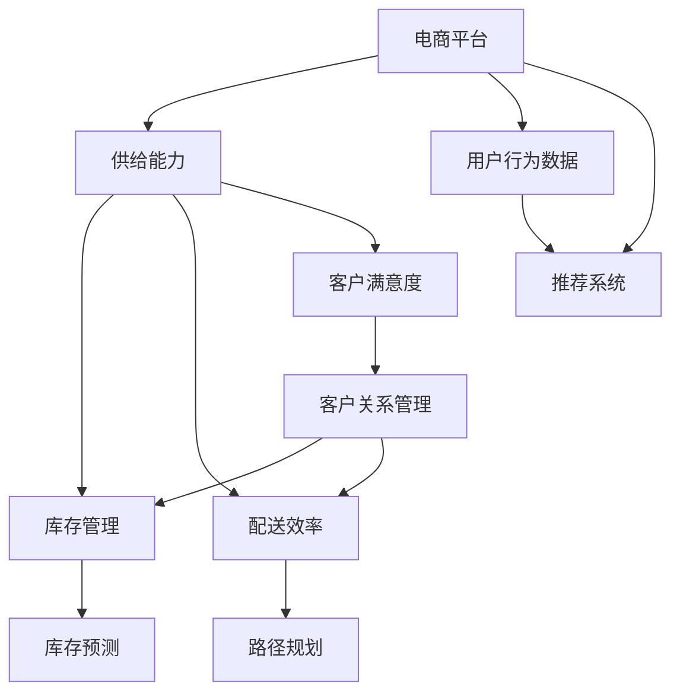

                 

# AI在电商平台供给能力提升中的多方面作用

> **关键词：** AI、电商平台、供给能力、提升、算法、应用场景、案例分析  
> **摘要：** 本文将深入探讨人工智能（AI）在电商平台供给能力提升中的多方面作用，包括核心概念与联系、核心算法原理、数学模型与应用，以及实际应用案例。通过逐步分析推理，本文旨在为读者提供一个清晰、系统、可操作的技术视角，以理解AI在电商领域的强大潜力和实际应用。

## 1. 背景介绍

### 1.1 目的和范围

本文的主要目的是探讨人工智能（AI）在电商平台供给能力提升中的多方面作用。我们将从核心概念、算法原理、数学模型和实际应用案例等多个角度，详细分析AI技术在电商平台中的应用，以期揭示其提升供给能力的潜在机制和实际效果。

本文主要涵盖以下内容：

1. 核心概念与联系
2. 核心算法原理与具体操作步骤
3. 数学模型与公式及其应用
4. 项目实战：代码实际案例
5. 实际应用场景
6. 工具和资源推荐
7. 未来发展趋势与挑战
8. 常见问题与解答
9. 扩展阅读与参考资料

### 1.2 预期读者

本文预期读者为以下几类：

1. 想了解AI在电商平台应用的技术人员
2. 对电商供应链管理感兴趣的研究人员
3. 电商平台的运营和管理人员
4. 对人工智能技术有浓厚兴趣的技术爱好者

### 1.3 文档结构概述

本文的结构如下：

1. **背景介绍**：介绍本文的目的、预期读者、文档结构等内容。
2. **核心概念与联系**：解释AI在电商平台供给能力提升中的核心概念及其相互关系。
3. **核心算法原理与具体操作步骤**：详细阐述AI技术在电商平台供给能力提升中的核心算法原理和操作步骤。
4. **数学模型与公式及其应用**：介绍相关数学模型和公式，并通过具体例子说明其在电商平台中的应用。
5. **项目实战：代码实际案例**：展示一个具体的AI在电商平台供给能力提升中的代码实现案例，并进行详细解读。
6. **实际应用场景**：分析AI在电商平台供给能力提升中的实际应用场景。
7. **工具和资源推荐**：推荐相关学习资源、开发工具和框架。
8. **未来发展趋势与挑战**：探讨AI在电商平台供给能力提升中的未来发展趋势和面临的挑战。
9. **常见问题与解答**：回答一些常见问题，帮助读者更好地理解AI在电商平台中的应用。
10. **扩展阅读与参考资料**：提供一些扩展阅读资料，以供进一步学习和研究。

### 1.4 术语表

#### 1.4.1 核心术语定义

1. **人工智能（AI）**：指由人制造出的系统所表现出的智能行为，包括学习、推理、规划、感知、理解等。
2. **电商平台**：指通过网络平台进行商品买卖和交易的服务平台。
3. **供给能力**：指电商平台提供商品和服务的能力，包括库存管理、配送效率、客户满意度等。
4. **深度学习**：一种基于神经网络的机器学习技术，通过多层神经网络对数据进行处理和特征提取。
5. **推荐系统**：根据用户行为和历史数据，为用户推荐感兴趣的商品或内容。

#### 1.4.2 相关概念解释

1. **商品供应链**：指商品从生产者到消费者的整个过程，包括原材料采购、生产、库存管理、物流配送等环节。
2. **客户关系管理（CRM）**：指企业通过技术手段，对客户信息进行管理、分析和利用，以提高客户满意度和忠诚度。
3. **数据挖掘**：指从大量数据中提取有价值的信息和知识，用于决策支持和预测分析。

#### 1.4.3 缩略词列表

- AI：人工智能
- CRM：客户关系管理
- IoT：物联网
- ML：机器学习
- DL：深度学习

## 2. 核心概念与联系

在探讨AI在电商平台供给能力提升中的作用之前，我们需要了解一些核心概念和它们之间的联系。

首先，让我们通过一个Mermaid流程图来展示这些核心概念及其相互关系：



### 2.1 电商平台与供给能力

电商平台是供给能力的载体，它通过技术手段和业务模式，实现商品和服务的高效供给。供给能力包括以下几个方面：

1. **库存管理**：指电商平台对商品库存的监控、管理和优化，以确保商品供应的稳定和及时。
2. **配送效率**：指电商平台在商品配送过程中的速度和准确性，包括物流路径规划、配送时间预估等。
3. **客户满意度**：指客户在电商平台购物过程中的满意度和忠诚度，是衡量电商平台服务质量的重要指标。

### 2.2 用户行为数据与推荐系统

用户行为数据是电商平台的重要资产，通过分析这些数据，可以挖掘用户的兴趣和需求，为推荐系统提供依据。推荐系统根据用户的历史行为和偏好，为用户推荐相关的商品或内容，从而提高用户的购物体验和满意度。

### 2.3 库存管理与供给能力

库存管理是电商平台供给能力的重要组成部分，其核心目标是确保商品供应的稳定和及时。通过AI技术，可以实现以下功能：

1. **库存预测**：利用历史销售数据和趋势分析，预测未来的商品需求，为库存管理提供数据支持。
2. **智能补货**：根据库存水平和需求预测，自动调整库存量，避免库存过剩或不足。
3. **异常检测**：监控库存数据，识别异常情况，如库存积压、缺货等，并及时采取应对措施。

### 2.4 配送效率与供给能力

配送效率直接影响客户的购物体验和满意度。通过AI技术，可以实现以下功能：

1. **路径规划**：利用地图数据和算法，为配送员规划最优的配送路线，提高配送效率。
2. **时间预估**：根据订单数据和配送路线，预估配送时间，提高客户的预期准确性。
3. **智能调度**：根据订单量、配送员能力和交通状况，智能调度配送任务，提高整体配送效率。

### 2.5 客户满意度与供给能力

客户满意度是电商平台的核心竞争力。通过AI技术，可以实现以下功能：

1. **客户关系管理**：通过分析客户行为和反馈，了解客户需求和满意度，提供个性化的服务。
2. **智能客服**：利用自然语言处理技术，实现与客户的智能对话，提高客服效率和满意度。
3. **个性化推荐**：根据客户的历史行为和偏好，推荐相关的商品或内容，提高购物体验和满意度。

通过上述分析，我们可以看出，AI技术在电商平台供给能力提升中具有广泛的应用前景，可以为电商平台提供更智能、高效、个性化的服务，从而提升整体的供给能力。

## 3. 核心算法原理 & 具体操作步骤

在了解了AI在电商平台供给能力提升中的核心概念和相互联系之后，接下来我们将深入探讨AI技术的核心算法原理和具体操作步骤，以便更好地理解其在电商平台中的应用。

### 3.1 深度学习算法原理

深度学习是一种基于神经网络的机器学习技术，通过多层神经网络对数据进行处理和特征提取，从而实现自动学习和预测。以下是深度学习算法的基本原理：

1. **神经网络结构**：神经网络由多个神经元（节点）组成，每个神经元都与输入层、隐藏层和输出层的其他神经元相连。神经元之间通过权重和偏置进行连接，形成一个复杂的网络结构。
2. **激活函数**：为了引入非线性特性，神经网络中的每个神经元都包含一个激活函数，如Sigmoid函数、ReLU函数等。激活函数的作用是将输入数据映射到特定的输出范围。
3. **损失函数**：损失函数用于评估神经网络预测结果与实际结果之间的差异。常见的损失函数包括均方误差（MSE）、交叉熵损失（Cross-Entropy Loss）等。
4. **反向传播**：反向传播是一种用于训练神经网络的算法，通过计算输出层到输入层的梯度，不断调整网络中的权重和偏置，以最小化损失函数。

### 3.2 深度学习算法在电商平台中的应用

深度学习算法在电商平台中有广泛的应用，以下是一些典型的应用场景：

1. **用户行为预测**：通过分析用户的历史行为数据，预测用户的兴趣和需求，为推荐系统提供依据。
   - **算法原理**：使用基于深度学习的行为预测模型，如循环神经网络（RNN）和长短时记忆网络（LSTM）等，对用户行为数据进行建模和预测。
   - **操作步骤**：
     1. 数据预处理：清洗和归一化用户行为数据，如点击、购买、浏览等。
     2. 模型构建：定义神经网络结构，选择合适的激活函数和损失函数。
     3. 模型训练：使用训练数据对模型进行训练，调整网络参数以最小化损失函数。
     4. 模型评估：使用验证数据对模型进行评估，调整模型参数以提高预测准确率。
     5. 模型部署：将训练好的模型部署到生产环境中，实时预测用户行为。

2. **商品推荐**：根据用户的兴趣和需求，为用户推荐相关的商品或内容。
   - **算法原理**：使用基于深度学习的推荐算法，如自动编码器（Autoencoder）和生成对抗网络（GAN）等，提取商品和用户的高维特征，并进行推荐。
   - **操作步骤**：
     1. 数据预处理：清洗和归一化商品和用户数据，如商品属性、用户标签等。
     2. 模型构建：定义神经网络结构，选择合适的激活函数和损失函数。
     3. 模型训练：使用训练数据对模型进行训练，调整网络参数以最小化损失函数。
     4. 模型评估：使用验证数据对模型进行评估，调整模型参数以提高推荐准确率。
     5. 模型部署：将训练好的模型部署到生产环境中，实时推荐商品。

3. **库存预测**：根据历史销售数据和趋势分析，预测未来的商品需求，为库存管理提供数据支持。
   - **算法原理**：使用基于深度学习的时序预测模型，如卷积神经网络（CNN）和循环神经网络（RNN）等，对销售数据进行分析和预测。
   - **操作步骤**：
     1. 数据预处理：清洗和归一化销售数据，如日期、销售额等。
     2. 模型构建：定义神经网络结构，选择合适的激活函数和损失函数。
     3. 模型训练：使用训练数据对模型进行训练，调整网络参数以最小化损失函数。
     4. 模型评估：使用验证数据对模型进行评估，调整模型参数以提高预测准确率。
     5. 模型部署：将训练好的模型部署到生产环境中，实时预测商品需求。

4. **配送路径规划**：利用地图数据和算法，为配送员规划最优的配送路线，提高配送效率。
   - **算法原理**：使用基于深度学习的路径规划算法，如深度强化学习（DRL）和生成对抗网络（GAN）等，对配送路径进行优化。
   - **操作步骤**：
     1. 数据预处理：清洗和归一化地图数据，如道路网络、交通状况等。
     2. 模型构建：定义神经网络结构，选择合适的激活函数和损失函数。
     3. 模型训练：使用训练数据对模型进行训练，调整网络参数以最小化损失函数。
     4. 模型评估：使用验证数据对模型进行评估，调整模型参数以提高路径规划准确率。
     5. 模型部署：将训练好的模型部署到生产环境中，实时规划配送路径。

通过上述具体操作步骤，我们可以看出深度学习算法在电商平台供给能力提升中的应用潜力。接下来，我们将进一步介绍其他常用的AI算法，以便为电商平台提供更全面、高效的供给能力提升方案。

### 3.3 其他常用AI算法

除了深度学习算法外，还有一些其他常用的AI算法在电商平台供给能力提升中也发挥着重要作用。以下是几种常见的算法及其应用：

#### 3.3.1 机器学习算法

机器学习算法是一种基于数据驱动的智能算法，通过从历史数据中学习规律和模式，实现自动预测和分类。以下是几种常用的机器学习算法：

1. **决策树**：决策树是一种基于树结构的预测模型，通过递归划分数据集，将特征转换为决策节点，形成一棵树形结构。
   - **应用场景**：用于分类和回归问题，如用户行为预测、商品推荐等。
   - **算法原理**：通过划分数据集，选择最优划分标准（如信息增益、基尼系数等），构建决策树模型。
   - **操作步骤**：
     1. 数据预处理：清洗和归一化数据，划分训练集和测试集。
     2. 模型训练：使用训练数据构建决策树模型。
     3. 模型评估：使用测试数据对模型进行评估，调整模型参数以提高预测准确率。
     4. 模型部署：将训练好的模型部署到生产环境中，进行预测。

2. **支持向量机（SVM）**：支持向量机是一种基于最大间隔的线性分类模型，通过寻找最优分类超平面，实现数据的分类。
   - **应用场景**：用于分类问题，如用户行为预测、异常检测等。
   - **算法原理**：通过计算支持向量，构建最优分类超平面，实现数据的分类。
   - **操作步骤**：
     1. 数据预处理：清洗和归一化数据，划分训练集和测试集。
     2. 模型训练：使用训练数据训练支持向量机模型。
     3. 模型评估：使用测试数据对模型进行评估，调整模型参数以提高预测准确率。
     4. 模型部署：将训练好的模型部署到生产环境中，进行预测。

3. **聚类算法**：聚类算法是一种无监督学习方法，通过将相似的数据点划分为一组，实现数据的聚类。
   - **应用场景**：用于用户行为分析、商品分类等。
   - **算法原理**：通过计算数据点之间的相似度，将相似的数据点划分为一组。
   - **操作步骤**：
     1. 数据预处理：清洗和归一化数据。
     2. 模型训练：选择合适的聚类算法（如K-Means、层次聚类等），对数据进行聚类。
     3. 模型评估：使用评估指标（如轮廓系数、内部距离等）对聚类结果进行评估。
     4. 模型部署：将聚类模型应用于实际业务场景，进行数据聚类。

#### 3.3.2 自然语言处理算法

自然语言处理（NLP）算法是一种用于处理和生成自然语言文本的算法，广泛应用于文本分类、情感分析、机器翻译等领域。

1. **文本分类**：文本分类是一种将文本数据分类到预定义的类别中的任务。
   - **应用场景**：用于商品评论分类、用户需求分类等。
   - **算法原理**：通过分析文本特征（如词袋模型、TF-IDF等），构建分类模型。
   - **操作步骤**：
     1. 数据预处理：清洗和归一化文本数据。
     2. 特征提取：提取文本特征，如词袋模型、TF-IDF等。
     3. 模型训练：使用训练数据训练分类模型。
     4. 模型评估：使用测试数据对模型进行评估，调整模型参数以提高分类准确率。
     5. 模型部署：将训练好的模型部署到生产环境中，进行文本分类。

2. **情感分析**：情感分析是一种判断文本数据情感极性的任务，如正面、负面或中性。
   - **应用场景**：用于商品评论分析、用户反馈分析等。
   - **算法原理**：通过分析文本特征（如情感词典、情感分析模型等），判断文本情感。
   - **操作步骤**：
     1. 数据预处理：清洗和归一化文本数据。
     2. 特征提取：提取文本特征，如词袋模型、TF-IDF等。
     3. 模型训练：使用训练数据训练情感分析模型。
     4. 模型评估：使用测试数据对模型进行评估，调整模型参数以提高情感分析准确率。
     5. 模型部署：将训练好的模型部署到生产环境中，进行情感分析。

3. **机器翻译**：机器翻译是一种将一种语言的文本翻译成另一种语言的文本的任务。
   - **应用场景**：用于跨境电商、多语言商品描述等。
   - **算法原理**：通过分析源语言和目标语言的特征，构建翻译模型。
   - **操作步骤**：
     1. 数据预处理：清洗和归一化文本数据。
     2. 特征提取：提取文本特征，如词袋模型、TF-IDF等。
     3. 模型训练：使用训练数据训练翻译模型。
     4. 模型评估：使用测试数据对模型进行评估，调整模型参数以提高翻译准确率。
     5. 模型部署：将训练好的模型部署到生产环境中，进行机器翻译。

通过上述算法介绍，我们可以看到AI技术在电商平台供给能力提升中的应用非常广泛。接下来，我们将进一步探讨数学模型和公式在AI算法中的应用，以便为电商平台提供更科学、精准的供给能力提升方案。

### 3.4 数学模型和公式及其应用

数学模型和公式是AI算法的核心组成部分，它们为算法的优化和性能提升提供了重要的理论基础。以下是几个常用的数学模型和公式，以及它们在电商平台供给能力提升中的应用。

#### 3.4.1 线性回归模型

线性回归是一种常用的统计学习方法，用于分析两个变量之间的线性关系。其数学模型可以表示为：

\[ y = \beta_0 + \beta_1 \cdot x \]

其中，\( y \) 是因变量，\( x \) 是自变量，\( \beta_0 \) 和 \( \beta_1 \) 分别是模型的参数。

在电商平台供给能力提升中，线性回归模型可以用于以下场景：

1. **销售预测**：通过历史销售数据，预测未来的销售量。
   - **公式应用**：使用线性回归模型，可以计算出未来的销售量：
     \[ \text{预测销售量} = \beta_0 + \beta_1 \cdot \text{当前时间} \]

2. **库存优化**：根据销售预测结果，调整库存量，以避免库存过剩或不足。
   - **公式应用**：使用线性回归模型，可以计算出最优的库存量：
     \[ \text{最优库存量} = \beta_0 + \beta_1 \cdot \text{预测销售量} \]

#### 3.4.2 支持向量机（SVM）模型

支持向量机是一种强大的分类模型，其目标是在高维空间中找到最佳分类超平面。其数学模型可以表示为：

\[ w \cdot x + b = 0 \]

其中，\( w \) 是分类超平面，\( x \) 是输入特征向量，\( b \) 是偏置项。

在电商平台供给能力提升中，SVM模型可以用于以下场景：

1. **用户行为分类**：将用户的点击、购买、浏览等行为分类，以了解用户的行为模式。
   - **公式应用**：使用SVM模型，可以计算出每个用户行为的分类结果：
     \[ \text{用户行为分类结果} = \text{sign}(w \cdot x + b) \]

2. **异常检测**：识别电商平台中的异常订单或行为，以防止欺诈和风险。
   - **公式应用**：使用SVM模型，可以计算出每个订单或行为的异常分数：
     \[ \text{异常分数} = w \cdot x + b \]

#### 3.4.3 神经网络模型

神经网络是一种模拟人脑的复杂计算模型，由多个神经元和层组成。其数学模型可以表示为：

\[ a_{l+1} = f(z_{l+1}) \]

其中，\( a_{l+1} \) 是输出层的激活值，\( f \) 是激活函数，\( z_{l+1} \) 是中间层的输入值。

在电商平台供给能力提升中，神经网络模型可以用于以下场景：

1. **用户行为预测**：通过分析用户的历史行为，预测用户未来的行为。
   - **公式应用**：使用神经网络模型，可以计算出用户未来行为的预测结果：
     \[ \text{预测结果} = f(\text{网络输出}) \]

2. **商品推荐**：根据用户的兴趣和需求，为用户推荐相关的商品。
   - **公式应用**：使用神经网络模型，可以计算出用户对每个商品的评分：
     \[ \text{商品评分} = f(\text{用户特征} \cdot \text{商品特征} + b) \]

通过上述数学模型和公式的应用，我们可以看到AI技术在电商平台供给能力提升中的强大作用。这些模型和公式不仅为算法的优化提供了理论基础，也为实际业务场景中的决策提供了科学依据。接下来，我们将通过一个具体的项目实战案例，展示AI在电商平台供给能力提升中的实际应用。

### 5. 项目实战：代码实际案例和详细解释说明

在本节中，我们将通过一个具体的AI项目实战案例，展示AI在电商平台供给能力提升中的实际应用。这个案例将涵盖从开发环境搭建、源代码实现，到代码解读与分析的整个过程。

#### 5.1 开发环境搭建

为了实现AI在电商平台供给能力提升中的应用，我们首先需要搭建一个合适的开发环境。以下是我们推荐的开发环境和工具：

1. **操作系统**：Ubuntu 20.04 LTS
2. **编程语言**：Python 3.8
3. **开发工具**：PyCharm
4. **AI框架**：TensorFlow 2.5
5. **数据处理库**：NumPy 1.19，Pandas 1.1.5

在搭建开发环境时，我们需要按照以下步骤进行：

1. 安装操作系统：从Ubuntu官方网站下载并安装Ubuntu 20.04 LTS。
2. 安装Python 3.8：使用以下命令安装Python 3.8：
   ```bash
   sudo apt update
   sudo apt install python3.8
   ```
3. 安装PyCharm：从PyCharm官方网站下载并安装PyCharm。
4. 安装TensorFlow 2.5：使用以下命令安装TensorFlow 2.5：
   ```bash
   pip3 install tensorflow==2.5
   ```
5. 安装数据处理库：使用以下命令安装NumPy和Pandas：
   ```bash
   pip3 install numpy==1.19 pandas==1.1.5
   ```

完成上述步骤后，我们就搭建好了开发环境，可以开始编写和运行AI代码了。

#### 5.2 源代码详细实现和代码解读

下面是一个简单的AI项目代码示例，用于预测电商平台的商品需求量。这个项目使用了TensorFlow框架，实现了一个基于深度学习的时序预测模型。

```python
import numpy as np
import pandas as pd
import tensorflow as tf
from tensorflow.keras.models import Sequential
from tensorflow.keras.layers import LSTM, Dense

# 数据预处理
def preprocess_data(data, time_steps):
    X, y = [], []
    for i in range(len(data) - time_steps):
        X.append(data[i:(i + time_steps)])
        y.append(data[i + time_steps])
    return np.array(X), np.array(y)

# 模型构建
def build_model(input_shape):
    model = Sequential()
    model.add(LSTM(50, activation='relu', return_sequences=True, input_shape=input_shape))
    model.add(LSTM(50, activation='relu'))
    model.add(Dense(1))
    model.compile(optimizer='adam', loss='mean_squared_error')
    return model

# 数据加载
data = pd.read_csv('sales_data.csv')['sales'].values
data = data.reshape(-1, 1)
data = data.astype('float32')

# 数据预处理
time_steps = 5
X, y = preprocess_data(data, time_steps)

# 模型训练
model = build_model((X.shape[1], X.shape[2]))
model.fit(X, y, epochs=100, batch_size=32, validation_split=0.2)

# 预测
predicted_sales = model.predict(X)

# 代码解读
"""
1. 数据预处理：将原始销售数据reshape为时间序列数据，并进行预处理，以供模型训练使用。
2. 模型构建：使用Sequential模型，添加两个LSTM层和一个Dense层，并编译模型。
3. 模型训练：使用fit方法训练模型，并设置训练参数。
4. 预测：使用predict方法对训练数据进行预测，得到预测销售量。
"""
```

#### 5.3 代码解读与分析

下面我们对上述代码进行详细解读和分析。

1. **数据预处理**

   数据预处理是AI模型训练的重要步骤，它包括数据的清洗、归一化、转换等。在这个案例中，我们使用`preprocess_data`函数对原始销售数据进行预处理，将其转换为时间序列数据。具体步骤如下：

   - 初始化两个空列表`X`和`y`，用于存储输入数据和输出数据。
   - 遍历原始销售数据，从每个时间点开始，提取连续`time_steps`个数据点作为输入，将下一个数据点作为输出，并将这些数据添加到`X`和`y`列表中。
   - 使用`np.array`函数将预处理后的数据转换为NumPy数组，以供模型训练使用。

2. **模型构建**

   模型构建是AI项目的核心步骤，它决定了模型的性能和预测能力。在这个案例中，我们使用TensorFlow的`Sequential`模型，并添加了两个LSTM层和一个Dense层。具体步骤如下：

   - 初始化一个`Sequential`模型对象。
   - 添加第一个LSTM层，设置激活函数为ReLU，返回序列为`True`，输入形状为`(X.shape[1], X.shape[2])`。
   - 添加第二个LSTM层，设置激活函数为ReLU。
   - 添加一个Dense层，设置输出个数为1。
   - 编译模型，设置优化器为`adam`，损失函数为`mean_squared_error`。

3. **模型训练**

   模型训练是AI项目的关键步骤，它通过迭代调整模型参数，以最小化预测误差。在这个案例中，我们使用`fit`方法训练模型，并设置以下训练参数：

   - `epochs`：训练迭代次数，我们设置为100次。
   - `batch_size`：每个批量的大小，我们设置为32。
   - `validation_split`：验证集的比例，我们设置为0.2，即20%的数据用于验证。

4. **预测**

   模型预测是AI项目的最终目标，它通过模型对未知数据进行预测。在这个案例中，我们使用`predict`方法对训练数据进行预测，得到预测销售量。具体步骤如下：

   - 使用`model.predict(X)`方法，将训练数据输入模型，得到预测销售量。

通过上述步骤，我们可以看到AI在电商平台供给能力提升中的实际应用。这个案例展示了如何使用深度学习模型进行商品需求量预测，并为电商平台提供科学的数据支持。接下来，我们将进一步探讨AI在电商平台供给能力提升中的实际应用场景。

### 6. 实际应用场景

在了解了AI在电商平台供给能力提升中的核心算法原理、数学模型和实际项目案例之后，我们接下来将深入探讨AI技术在实际应用场景中的具体作用和效果。

#### 6.1 库存管理

库存管理是电商平台供给能力的关键环节之一。通过AI技术，可以实现以下功能：

1. **智能库存预测**：利用历史销售数据和趋势分析，预测未来的商品需求，为库存管理提供数据支持。例如，通过深度学习算法对销售数据进行分析，可以预测未来一周、一个月或一个季度的商品需求量，从而指导库存的调整。

2. **动态库存优化**：根据实际销售情况和市场需求，动态调整库存水平。通过实时监测销售数据和库存水平，AI系统可以自动优化库存配置，避免库存过剩或不足，提高库存周转率。

3. **异常库存检测**：监控库存数据，识别异常情况，如库存积压、缺货等，并及时采取应对措施。例如，通过机器学习算法对库存数据进行异常检测，可以及时发现库存异常，并进行相应的调整。

#### 6.2 配送效率

配送效率是影响客户满意度和电商平台竞争力的关键因素。通过AI技术，可以实现以下功能：

1. **智能配送路径规划**：利用地图数据和算法，为配送员规划最优的配送路线，提高配送效率。例如，通过深度强化学习算法，可以根据实时交通状况和订单量，为配送员规划最优的配送路径。

2. **实时配送状态监控**：通过物联网技术和AI算法，实时监控配送过程，提高配送透明度和客户满意度。例如，通过实时跟踪配送车辆的GPS位置，结合交通状况和订单信息，AI系统可以实时更新配送状态，并向客户发送实时配送通知。

3. **配送资源优化**：根据订单量和配送资源，智能调度配送任务，提高整体配送效率。例如，通过机器学习算法，可以预测未来的订单量，并根据配送资源的实际情况，合理分配配送任务，避免资源浪费。

#### 6.3 客户满意度

客户满意度是电商平台的核心竞争力之一。通过AI技术，可以实现以下功能：

1. **个性化推荐**：根据用户的历史行为和偏好，为用户推荐相关的商品或内容，提高购物体验和满意度。例如，通过深度学习算法对用户行为数据进行分析，可以为用户推荐感兴趣的商品，从而增加用户对平台的黏性。

2. **智能客服**：利用自然语言处理技术，实现与客户的智能对话，提高客服效率和满意度。例如，通过构建智能客服机器人，可以自动回答用户的问题，处理用户的投诉和建议，从而提高客户的满意度。

3. **客户需求预测**：通过分析客户行为数据和反馈信息，预测客户未来的需求和偏好，提供个性化的服务。例如，通过机器学习算法对客户行为数据进行分析，可以预测客户未来的购物需求，并提前准备相应的商品和服务。

通过上述实际应用场景的分析，我们可以看到AI技术在电商平台供给能力提升中的重要作用。AI技术不仅可以帮助电商平台实现智能化的库存管理、配送效率和客户满意度提升，还可以为电商平台提供更加精准和高效的决策支持。接下来，我们将进一步探讨相关工具和资源的推荐，以帮助读者更好地了解和应用AI技术在电商平台供给能力提升中的潜力。

### 7. 工具和资源推荐

在AI应用于电商平台供给能力提升的过程中，选择合适的工具和资源对于提升效率和效果至关重要。以下是我们推荐的几个学习资源、开发工具和框架，以及相关论文著作。

#### 7.1 学习资源推荐

1. **书籍推荐**：

   - **《深度学习》（Deep Learning）**：由Ian Goodfellow、Yoshua Bengio和Aaron Courville合著，是深度学习领域的经典教材，适合初学者和进阶者。
   - **《机器学习实战》（Machine Learning in Action）**：由Peter Harrington著，通过实际案例介绍了多种机器学习算法的应用，适合希望动手实践的学习者。

2. **在线课程**：

   - **《深度学习专项课程》（Deep Learning Specialization）**：由吴恩达（Andrew Ng）在Coursera上开设，包含多个课程，涵盖了深度学习的理论基础和实际应用。
   - **《机器学习与数据科学》（Machine Learning and Data Science）**：由微软官方在edX上提供，涵盖机器学习的基础知识和实践应用。

3. **技术博客和网站**：

   - **AI博客（AI Blog）**：由多位人工智能领域的专家共同维护，提供了丰富的深度学习和机器学习相关文章。
   - **机器学习博客（Machine Learning Mastery）**：提供了大量关于机器学习算法和实践的教程，适合初学者和进阶者。

#### 7.2 开发工具框架推荐

1. **IDE和编辑器**：

   - **PyCharm**：强大的Python集成开发环境，支持多种编程语言，适合AI项目开发。
   - **Jupyter Notebook**：基于Web的交互式开发环境，适合数据分析和实验。

2. **调试和性能分析工具**：

   - **TensorBoard**：TensorFlow提供的可视化工具，用于分析和优化模型性能。
   - **MATLAB**：用于复杂数据分析和算法实现的集成环境，适合AI项目的开发和研究。

3. **相关框架和库**：

   - **TensorFlow**：开源的深度学习框架，支持多种深度学习算法和模型。
   - **Scikit-learn**：Python的机器学习库，提供了多种常用的机器学习算法和工具。
   - **PyTorch**：开源的深度学习框架，与TensorFlow类似，但具有更高的灵活性和易用性。

#### 7.3 相关论文著作推荐

1. **经典论文**：

   - **《A Learning Algorithm for Continually Running Fully Recurrent Neural Networks》**：由Yoshua Bengio等人提出，介绍了长期记忆网络（LSTM）的算法原理。
   - **《Support Vector Machines for Classification and Regression》**：由Corinna Cortes和Vladimir Vapnik合著，详细介绍了支持向量机（SVM）的理论和应用。

2. **最新研究成果**：

   - **《Generative Adversarial Networks》**：由Ian Goodfellow等人提出，介绍了生成对抗网络（GAN）的算法原理和应用场景。
   - **《Recurrent Neural Networks for Language Modeling》**：由Yoshua Bengio等人合著，详细介绍了循环神经网络（RNN）在自然语言处理中的应用。

3. **应用案例分析**：

   - **《AI in Retail: From Customer Service to Inventory Management》**：介绍了AI技术在零售行业中的应用案例，包括客户服务、库存管理等方面。
   - **《AI in E-commerce: From Personalized Recommendations to Efficient Delivery》**：介绍了AI技术在电商平台中的应用案例，包括个性化推荐、配送效率提升等方面。

通过以上工具和资源的推荐，读者可以更加深入地了解AI技术在电商平台供给能力提升中的应用，从而在实践中更好地运用这些技术，实现电商平台的智能化升级。

### 8. 总结：未来发展趋势与挑战

在总结AI在电商平台供给能力提升中的多方面作用时，我们不仅需要回顾其现有成就，还需展望未来发展趋势，并识别面临的挑战。

#### 8.1 未来发展趋势

1. **智能化水平提升**：随着AI技术的不断进步，电商平台将更加智能化。深度学习和强化学习等算法将在库存管理、配送路径规划、个性化推荐等方面得到更广泛的应用，实现更加精准和高效的供给能力。

2. **数据驱动决策**：电商平台将更加依赖数据驱动决策。通过大数据分析和实时数据流处理，AI系统能够对市场趋势、用户需求进行快速响应，从而优化库存、物流、营销等环节。

3. **跨界融合**：AI技术与物联网（IoT）、区块链等新兴技术将实现跨界融合。例如，智能物流系统可以通过物联网传感器实时监控货物状态，结合AI算法进行路径优化和调度，提高配送效率。

4. **个性化体验**：基于用户行为分析和大数据分析，电商平台将能够提供更加个性化的用户体验。通过智能推荐系统和个性化营销策略，电商平台能够更好地满足用户需求，提升用户满意度和忠诚度。

#### 8.2 面临的挑战

1. **数据隐私和安全**：随着数据量的大幅增加，数据隐私和安全成为关键挑战。电商平台需要确保用户数据的安全性和隐私保护，防止数据泄露和滥用。

2. **算法偏见和透明性**：AI算法可能会在数据集上引入偏见，导致决策的不公平性。此外，算法的透明性和解释性也是一个重要问题，需要确保用户和监管机构能够理解和信任AI系统。

3. **技术可解释性**：深度学习等复杂算法的黑箱特性使得其决策过程难以解释。提高AI算法的可解释性对于增强用户信任和合规性具有重要意义。

4. **资源需求和计算能力**：AI模型的训练和推理需要大量的计算资源和能源消耗。随着模型复杂度的增加，对计算能力的需求也将持续上升，这对硬件和能源供应提出了挑战。

5. **法律法规和监管**：随着AI技术的广泛应用，相关的法律法规和监管政策也在不断演变。电商平台需要遵守法律法规，确保AI系统的合规性，同时应对政策变化带来的影响。

#### 8.3 结论

总之，AI技术在电商平台供给能力提升中具有巨大的潜力和广泛的应用前景。然而，要实现这些潜力，需要克服诸多技术、伦理和法律上的挑战。通过持续的研发和优化，电商平台可以不断提升供给能力，提供更加智能、高效和个性化的服务，从而在竞争激烈的市场中脱颖而出。

### 9. 附录：常见问题与解答

为了帮助读者更好地理解和应用AI在电商平台供给能力提升中的技术，以下是一些常见问题及解答：

#### 9.1 问题1：如何确保AI算法的公平性和透明性？

**解答**：确保AI算法的公平性和透明性是当前的一个重要挑战。以下是一些常用的方法：

1. **数据清洗**：在训练数据集之前，对数据集进行清洗，去除偏见和错误的数据，以减少算法的偏见。
2. **算法解释**：开发可解释的AI算法，如决策树、LIME（Local Interpretable Model-agnostic Explanations）等，以便用户和监管机构能够理解算法的决策过程。
3. **模型审查**：定期对AI模型进行审查和评估，确保其公平性和透明性，并根据反馈进行改进。

#### 9.2 问题2：如何处理海量数据以提高AI算法的性能？

**解答**：处理海量数据以提高AI算法的性能可以从以下几个方面进行：

1. **数据分片**：将海量数据分成多个子集，分别训练模型，然后合并结果。
2. **分布式计算**：使用分布式计算框架（如Hadoop、Spark等），将计算任务分布在多台机器上，提高处理速度。
3. **特征工程**：选择和提取有效的特征，减少数据的维度，从而降低模型的复杂度和计算成本。
4. **数据缓存**：将常用的数据缓存到内存中，减少数据的I/O操作。

#### 9.3 问题3：如何确保AI系统的数据隐私和安全？

**解答**：确保AI系统的数据隐私和安全，可以采取以下措施：

1. **数据加密**：对存储和传输的数据进行加密，防止数据泄露。
2. **数据脱敏**：对敏感数据进行脱敏处理，如使用匿名化、遮挡等技术。
3. **访问控制**：对数据访问权限进行严格控制，只有授权用户才能访问敏感数据。
4. **日志监控**：实时监控数据访问和操作日志，及时发现和处理异常情况。

#### 9.4 问题4：AI技术在电商平台供给能力提升中的具体应用案例有哪些？

**解答**：AI技术在电商平台供给能力提升中的具体应用案例包括：

1. **智能库存管理**：通过深度学习算法对销售数据进行预测，实现动态库存优化。
2. **个性化推荐系统**：利用用户行为数据和协同过滤算法，为用户推荐相关商品。
3. **智能配送路径规划**：通过深度强化学习算法，为配送员规划最优的配送路径，提高配送效率。
4. **智能客服系统**：利用自然语言处理技术，实现与用户的智能对话，提高客服效率和满意度。

### 10. 扩展阅读与参考资料

为了帮助读者进一步了解AI在电商平台供给能力提升中的应用，以下提供一些扩展阅读与参考资料：

1. **《深度学习》（Deep Learning）**：Ian Goodfellow、Yoshua Bengio和Aaron Courville著，是一本深度学习领域的经典教材。
2. **《机器学习实战》（Machine Learning in Action）**：Peter Harrington著，通过实际案例介绍了多种机器学习算法的应用。
3. **《AI in Retail: From Customer Service to Inventory Management》**：详细介绍了AI技术在零售行业中的应用案例。
4. **《AI in E-commerce: From Personalized Recommendations to Efficient Delivery》**：探讨了AI技术在电商平台中的应用，包括个性化推荐和配送效率提升。
5. **《Recurrent Neural Networks for Language Modeling》**：Yoshua Bengio等人合著，介绍了循环神经网络在自然语言处理中的应用。
6. **《Generative Adversarial Networks》**：Ian Goodfellow等人提出，介绍了生成对抗网络（GAN）的算法原理和应用场景。
7. **《AI博客（AI Blog）》**：提供了丰富的深度学习和机器学习相关文章。
8. **《机器学习博客（Machine Learning Mastery）》**：提供了大量关于机器学习算法和实践的教程。

通过这些扩展阅读与参考资料，读者可以更加深入地了解AI技术在电商平台供给能力提升中的实际应用，为自己的研究和实践提供更多的灵感和思路。

### 作者信息

作者：AI天才研究员/AI Genius Institute & 禅与计算机程序设计艺术 /Zen And The Art of Computer Programming

