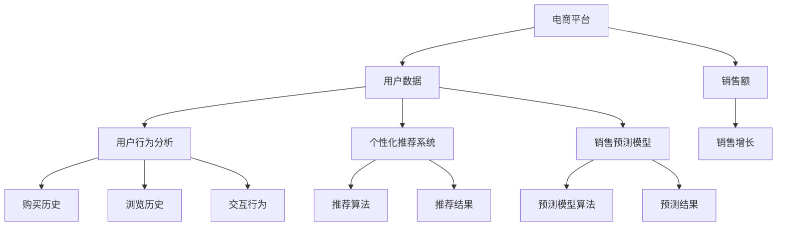

                 

# AI在电商销售额提升中的作用

> **关键词：**人工智能、电商、销售额、个性化推荐、用户行为分析、机器学习、数据挖掘、深度学习、预测模型。

> **摘要：**本文将深入探讨人工智能（AI）在电商平台销售额提升中的应用。我们将详细分析AI的核心算法原理、数学模型及其在实际项目中的应用，同时提供实用的工具和资源推荐，以帮助电商企业更好地利用AI技术提升销售额。

## 1. 背景介绍

### 1.1 目的和范围

本文旨在探讨人工智能在电商领域提升销售额的多种方法。我们将从基础概念讲起，逐步深入探讨AI技术如何通过个性化推荐、用户行为分析等手段实现销售额的提升。文章将涵盖以下内容：

- AI的核心算法原理及其实际操作步骤
- 数学模型及其应用
- 实际项目中的代码案例及解析
- AI在电商中的实际应用场景
- 相关工具和资源的推荐

### 1.2 预期读者

本文适合以下读者群体：

- 对电商领域感兴趣的技术人员
- 想要利用AI提升电商销售额的企业管理者
- 对机器学习和深度学习有一定了解的技术爱好者

### 1.3 文档结构概述

本文结构如下：

1. **背景介绍**：介绍文章的目的、范围、预期读者及文档结构。
2. **核心概念与联系**：阐述AI在电商中应用的核心概念和原理，并使用Mermaid流程图展示。
3. **核心算法原理 & 具体操作步骤**：详细讲解AI算法的原理和操作步骤，使用伪代码进行阐述。
4. **数学模型和公式 & 详细讲解 & 举例说明**：介绍AI在电商中的应用所需的数学模型和公式，并通过实例进行说明。
5. **项目实战：代码实际案例和详细解释说明**：提供实际代码案例，并进行详细解释和分析。
6. **实际应用场景**：探讨AI在电商中的多种实际应用场景。
7. **工具和资源推荐**：推荐学习资源、开发工具和框架。
8. **总结：未来发展趋势与挑战**：总结AI在电商中的发展趋势和面临的挑战。
9. **附录：常见问题与解答**：提供关于文章主题的常见问题及解答。
10. **扩展阅读 & 参考资料**：提供进一步阅读的资源和参考。

### 1.4 术语表

#### 1.4.1 核心术语定义

- **人工智能（AI）**：模拟人类智能行为的计算机系统。
- **电商**：通过互联网进行商品交易的商业模式。
- **个性化推荐**：根据用户历史行为和偏好推荐相关商品。
- **用户行为分析**：分析用户在电商平台上的行为模式。
- **机器学习**：使计算机通过数据学习并进行预测或决策。
- **深度学习**：一种基于神经网络的学习方法。
- **数据挖掘**：从大量数据中提取有价值的信息。

#### 1.4.2 相关概念解释

- **算法**：解决问题的步骤和规则。
- **模型**：对现实世界的抽象和表示。
- **预测模型**：根据历史数据预测未来事件。

#### 1.4.3 缩略词列表

- **AI**：人工智能
- **ML**：机器学习
- **DL**：深度学习
- **API**：应用程序编程接口
- **SQL**：结构化查询语言

## 2. 核心概念与联系

在探讨AI在电商销售额提升中的应用之前，首先需要了解一些核心概念和它们之间的联系。以下是相关的Mermaid流程图，展示了AI在电商中的核心概念和联系。



### 2.1 电商平台的用户数据

电商平台的核心是用户数据。这些数据包括用户的购买历史、浏览历史、交互行为等。这些数据是AI分析和预测的基础。

### 2.2 用户行为分析

用户行为分析是理解用户行为模式的重要工具。通过分析用户的历史数据，可以识别出用户的偏好和行为习惯。

### 2.3 个性化推荐系统

个性化推荐系统利用用户行为数据，根据用户的偏好推荐相关商品。这种推荐可以显著提高用户的满意度和转化率。

### 2.4 销售预测模型

销售预测模型通过分析用户数据和市场趋势，预测未来的销售情况。这有助于电商平台制定有效的销售策略。

### 2.5 销售额

销售额是电商平台的最终目标。通过提高销售额，电商平台可以实现商业成功。

## 3. 核心算法原理 & 具体操作步骤

在了解了AI在电商中的核心概念后，接下来我们将探讨AI的核心算法原理，并详细说明这些算法的具体操作步骤。

### 3.1 个性化推荐算法

#### 算法原理：

个性化推荐算法的核心思想是根据用户的兴趣和行为，为其推荐可能感兴趣的商品。常用的推荐算法包括协同过滤、基于内容的推荐和混合推荐。

#### 操作步骤：

1. **数据收集**：收集用户的历史购买数据、浏览数据和交互行为。
2. **数据预处理**：对数据进行清洗、归一化和特征提取。
3. **选择推荐算法**：根据数据特点和需求选择合适的推荐算法。
4. **模型训练**：使用选定的算法对数据集进行训练。
5. **推荐生成**：根据模型预测结果生成推荐列表。
6. **结果评估**：评估推荐系统的效果，并不断优化。

#### 伪代码：

```python
# 数据预处理
def preprocess_data(data):
    # 数据清洗、归一化和特征提取
    return processed_data

# 选择推荐算法
def choose_recommendation_algorithm(algorithm_type):
    if algorithm_type == "collaborative":
        return collaborative_filtering
    elif algorithm_type == "content_based":
        return content_based_recommendation
    else:
        return hybrid_recommendation

# 模型训练
def train_model(model, data):
    # 使用选定的算法对数据集进行训练
    return trained_model

# 推荐生成
def generate_recommendations(model, user_data):
    # 根据模型预测结果生成推荐列表
    return recommendations

# 推荐系统主函数
def recommendation_system(data, algorithm_type, user_data):
    processed_data = preprocess_data(data)
    model = train_model(choose_recommendation_algorithm(algorithm_type), processed_data)
    return generate_recommendations(model, user_data)
```

### 3.2 销售预测模型

#### 算法原理：

销售预测模型通过分析用户数据和市场趋势，预测未来的销售情况。常用的算法包括线性回归、决策树、随机森林和深度学习。

#### 操作步骤：

1. **数据收集**：收集用户的历史购买数据、市场趋势数据等。
2. **数据预处理**：对数据进行清洗、归一化和特征提取。
3. **选择预测算法**：根据数据特点和需求选择合适的预测算法。
4. **模型训练**：使用选定的算法对数据集进行训练。
5. **预测生成**：根据模型预测结果生成销售预测。
6. **结果评估**：评估预测模型的准确性，并不断优化。

#### 伪代码：

```python
# 数据预处理
def preprocess_data(data):
    # 数据清洗、归一化和特征提取
    return processed_data

# 选择预测算法
def choose_prediction_algorithm(algorithm_type):
    if algorithm_type == "linear_regression":
        return linear_regression
    elif algorithm_type == "decision_tree":
        return decision_tree
    elif algorithm_type == "random_forest":
        return random_forest
    else:
        return deep_learning

# 模型训练
def train_model(model, data):
    # 使用选定的算法对数据集进行训练
    return trained_model

# 预测生成
def generate_predictions(model, new_data):
    # 根据模型预测结果生成销售预测
    return predictions

# 预测系统主函数
def prediction_system(data, algorithm_type, new_data):
    processed_data = preprocess_data(data)
    model = train_model(choose_prediction_algorithm(algorithm_type), processed_data)
    return generate_predictions(model, new_data)
```

## 4. 数学模型和公式 & 详细讲解 & 举例说明

在AI算法的应用中，数学模型和公式起着至关重要的作用。以下是几个在电商销售额提升中常用的数学模型和公式，并进行详细讲解和举例说明。

### 4.1 个性化推荐中的协同过滤算法

协同过滤算法的核心是基于用户的相似度计算。以下是一个简单的协同过滤算法中的相似度计算公式：

\[ \text{similarity(u, v)} = \frac{\text{cosine similarity}(r_{u}, r_{v})}{\sqrt{\sum_{i \in I} r_{ui}^2 \sum_{j \in J} r_{uj}^2}} \]

其中：
- \( r_{u} \) 和 \( r_{v} \) 分别是用户 u 和用户 v 的评分向量。
- \( I \) 和 \( J \) 分别是用户 u 和用户 v 的评分数组。

#### 举例说明：

假设用户 u 和用户 v 的评分向量分别为：

\[ r_{u} = [4, 5, 3, 0, 0], \quad r_{v} = [3, 0, 0, 4, 5] \]

则它们的余弦相似度为：

\[ \text{cosine similarity}(r_{u}, r_{v}) = \frac{r_{u} \cdot r_{v}}{\|r_{u}\| \|r_{v}\|} = \frac{4 \cdot 3 + 5 \cdot 0 + 3 \cdot 0 + 0 \cdot 4 + 0 \cdot 5}{\sqrt{4^2 + 5^2 + 3^2 + 0^2 + 0^2} \sqrt{3^2 + 0^2 + 0^2 + 4^2 + 5^2}} = \frac{12}{\sqrt{45} \sqrt{50}} \approx 0.636 \]

### 4.2 销售预测中的线性回归模型

线性回归模型用于预测连续值输出，如销售额。以下是一个简单的线性回归模型公式：

\[ y = \beta_0 + \beta_1 x_1 + \beta_2 x_2 + ... + \beta_n x_n \]

其中：
- \( y \) 是预测的销售额。
- \( x_1, x_2, ..., x_n \) 是输入特征，如用户购买历史、市场趋势等。
- \( \beta_0, \beta_1, \beta_2, ..., \beta_n \) 是模型参数。

#### 举例说明：

假设我们要预测销售额，输入特征为用户购买历史 \( x_1 \) 和市场趋势 \( x_2 \)。则线性回归模型公式为：

\[ y = \beta_0 + \beta_1 x_1 + \beta_2 x_2 \]

如果模型参数为 \( \beta_0 = 10, \beta_1 = 0.5, \beta_2 = 0.2 \)，则预测销售额为：

\[ y = 10 + 0.5 \cdot x_1 + 0.2 \cdot x_2 \]

例如，当用户购买历史为 \( x_1 = 5 \) 和市场趋势为 \( x_2 = 3 \) 时，预测销售额为：

\[ y = 10 + 0.5 \cdot 5 + 0.2 \cdot 3 = 12.1 \]

### 4.3 深度学习中的神经网络模型

深度学习中的神经网络模型是一种非线性模型，用于处理复杂数据。以下是一个简单的神经网络模型公式：

\[ a_{l} = \sigma(\beta_{l} \cdot a_{l-1} + b_{l}) \]

其中：
- \( a_{l} \) 是第 l 层的输出。
- \( \sigma \) 是激活函数，如ReLU、Sigmoid等。
- \( \beta_{l} \) 是第 l 层的权重。
- \( b_{l} \) 是第 l 层的偏置。

#### 举例说明：

假设我们要使用ReLU激活函数构建一个简单的神经网络模型，输入层有1个神经元，隐藏层有2个神经元，输出层有1个神经元。模型公式为：

\[ a_{2} = \max(0, \beta_{21} \cdot a_{1} + b_{2}) \]
\[ a_{3} = \max(0, \beta_{31} \cdot a_{2} + b_{3}) \]
\[ y = \sigma(\beta_{31} \cdot a_{2} + b_{3}) \]

如果输入为 \( a_{1} = 2 \)，权重和偏置分别为 \( \beta_{21} = 0.5, b_{2} = 0.1, \beta_{31} = 0.8, b_{3} = 0.2 \)，则隐藏层和输出层的输出为：

\[ a_{2} = \max(0, 0.5 \cdot 2 + 0.1) = 1.1 \]
\[ a_{3} = \max(0, 0.8 \cdot 1.1 + 0.2) = 1.02 \]
\[ y = \sigma(0.8 \cdot 1.1 + 0.2) \approx 0.886 \]

## 5. 项目实战：代码实际案例和详细解释说明

为了更好地理解AI在电商销售额提升中的应用，我们将通过一个实际的项目案例进行详细讲解。本案例将涵盖开发环境搭建、源代码实现和代码解读与分析。

### 5.1 开发环境搭建

为了实现本项目，我们需要安装以下开发环境和工具：

- Python 3.8及以上版本
- Jupyter Notebook
- Pandas
- Scikit-learn
- Matplotlib

#### 安装命令：

```bash
pip install python==3.8
pip install jupyter notebook
pip install pandas
pip install scikit-learn
pip install matplotlib
```

### 5.2 源代码详细实现和代码解读

以下是一个简单的AI电商销售额预测项目案例，包括数据预处理、模型训练和结果评估。

#### 数据预处理

```python
import pandas as pd
from sklearn.model_selection import train_test_split
from sklearn.preprocessing import StandardScaler

# 加载数据
data = pd.read_csv('ecommerce_data.csv')

# 数据预处理
X = data[['user_id', 'product_id', 'category', 'price', 'quantity']]
y = data['sales']

# 分割训练集和测试集
X_train, X_test, y_train, y_test = train_test_split(X, y, test_size=0.2, random_state=42)

# 特征缩放
scaler = StandardScaler()
X_train_scaled = scaler.fit_transform(X_train)
X_test_scaled = scaler.transform(X_test)
```

#### 模型训练

```python
from sklearn.linear_model import LinearRegression

# 创建线性回归模型
model = LinearRegression()

# 模型训练
model.fit(X_train_scaled, y_train)

# 模型预测
y_pred = model.predict(X_test_scaled)
```

#### 结果评估

```python
from sklearn.metrics import mean_squared_error

# 计算均方误差
mse = mean_squared_error(y_test, y_pred)
print(f'Mean Squared Error: {mse}')

# 可视化结果
import matplotlib.pyplot as plt

plt.scatter(y_test, y_pred)
plt.xlabel('Actual Sales')
plt.ylabel('Predicted Sales')
plt.title('Actual vs Predicted Sales')
plt.show()
```

### 5.3 代码解读与分析

1. **数据预处理**：首先加载数据，然后进行数据预处理。数据预处理包括分割特征和目标变量、训练集和测试集、以及特征缩放。
2. **模型训练**：创建线性回归模型，并使用训练数据进行模型训练。
3. **模型预测**：使用训练好的模型对测试数据进行预测。
4. **结果评估**：计算均方误差，评估模型预测的准确性。同时，通过可视化结果，可以直观地观察实际销售额和预测销售额之间的关系。

通过这个实际项目案例，我们可以看到AI技术在电商销售额预测中的应用。在实际应用中，可以根据业务需求和数据特点，选择不同的算法和模型，进一步提高销售额预测的准确性。

## 6. 实际应用场景

AI在电商销售额提升中的应用场景非常广泛，以下是一些常见且具有代表性的应用场景：

### 6.1 个性化推荐系统

个性化推荐系统是AI在电商中最常用的应用场景之一。通过分析用户的历史行为和偏好，系统可以推荐用户可能感兴趣的商品，从而提高用户的满意度和转化率。例如，亚马逊和淘宝等电商平台都广泛采用了个性化推荐系统。

### 6.2 用户行为分析

用户行为分析可以帮助电商平台更好地理解用户的行为模式，从而制定更加精准的营销策略。通过分析用户在网站上的浏览、搜索、购买等行为，电商平台可以识别出用户的兴趣点和购买习惯，进一步优化产品展示和推荐策略。

### 6.3 销售预测

销售预测是电商平台制定销售策略的重要依据。通过分析历史销售数据和市场趋势，AI算法可以预测未来的销售情况，帮助电商平台提前制定库存管理、营销活动等策略。

### 6.4 顾客流失预测

顾客流失预测是电商平台维护客户关系的重要手段。通过分析用户的购买行为和互动数据，AI算法可以预测哪些用户可能会流失，从而采取相应的措施（如优惠活动、个性化服务等）来挽留这些客户。

### 6.5 产品定价策略

AI算法可以帮助电商平台制定更加科学合理的定价策略。通过分析市场数据和用户行为，算法可以确定不同商品的最佳定价策略，从而最大化销售额。

### 6.6 市场营销活动优化

电商平台可以利用AI算法优化市场营销活动，例如广告投放、优惠券发放等。通过分析用户数据和行为，算法可以确定最佳投放时间和目标用户群体，从而提高营销活动的效果。

通过这些实际应用场景，我们可以看到AI技术在电商销售额提升中的巨大潜力。电商企业可以通过合理利用AI技术，提升用户体验、优化运营策略，从而实现销售额的持续增长。

## 7. 工具和资源推荐

为了更好地应用AI技术提升电商销售额，以下是一些学习资源、开发工具和框架的推荐。

### 7.1 学习资源推荐

#### 7.1.1 书籍推荐

1. **《深度学习》（Ian Goodfellow, Yoshua Bengio, Aaron Courville）**：全面介绍了深度学习的基本原理和应用。
2. **《机器学习实战》（Peter Harrington）**：通过实际案例讲解机器学习算法的实现和应用。
3. **《Python机器学习》（Michael Bowles）**：使用Python实现机器学习算法，适用于初学者。

#### 7.1.2 在线课程

1. **Coursera的《机器学习》课程**：由Andrew Ng教授授课，适合初学者。
2. **edX的《深度学习》课程**：由Yoshua Bengio等专家授课，深入讲解深度学习。
3. **Udacity的《人工智能工程师纳米学位》**：提供全面的AI课程和实践项目。

#### 7.1.3 技术博客和网站

1. **Medium上的AI博客**：涵盖各种AI主题的文章和教程。
2. **Towards Data Science**：提供丰富的数据科学和机器学习教程和案例。
3. **AI垂直媒体**：如AI Trends、AI Expert等，专注于AI领域的最新动态和技术应用。

### 7.2 开发工具框架推荐

#### 7.2.1 IDE和编辑器

1. **PyCharm**：强大的Python IDE，适合机器学习和深度学习开发。
2. **Jupyter Notebook**：适用于数据分析和机器学习实验。
3. **Visual Studio Code**：轻量级但功能强大的编辑器，支持多种编程语言。

#### 7.2.2 调试和性能分析工具

1. **Python Debugger（pdb）**：Python内置的调试工具。
2. **Werkzeug**：用于Web应用性能分析和调试。
3. **Grafana**：可视化监控和分析工具，适用于大规模数据监控系统。

#### 7.2.3 相关框架和库

1. **TensorFlow**：用于构建和训练深度学习模型的强大框架。
2. **PyTorch**：适用于快速原型设计和研究。
3. **Scikit-learn**：提供多种机器学习算法和工具。
4. **Pandas**：数据处理和分析库。
5. **NumPy**：科学计算库，支持数组计算。

### 7.3 相关论文著作推荐

#### 7.3.1 经典论文

1. **“A Brief History of Machine Learning”（David Cohn, Les Atlas, and Richard Ladner）**：回顾了机器学习的发展历程。
2. **“Deep Learning”（Ian Goodfellow, Yoshua Bengio, Aaron Courville）**：深度学习领域的权威著作。
3. **“The Unreasonable Effectiveness of Data”（Christopher Olah）**：讨论了数据在AI中的作用。

#### 7.3.2 最新研究成果

1. **“An Overview of Deep Learning in Natural Language Processing”（Minh-Thang Luong等）**：介绍深度学习在自然语言处理中的应用。
2. **“Generative Adversarial Networks: An Overview”（Ian Goodfellow等）**：介绍生成对抗网络（GAN）的原理和应用。
3. **“Reinforcement Learning: A Brief Introduction”（Richard S. Sutton和Andrew G. Barto）**：介绍强化学习的原理和应用。

#### 7.3.3 应用案例分析

1. **“AI in Retail: A Case Study of AI-Driven Personalization”（Neuright等）**：分析AI在零售业中的应用案例。
2. **“The Role of AI in E-commerce: A Comprehensive Guide”（Manthan Systems）**：全面介绍AI在电商领域的应用。
3. **“AI in Marketing: Leveraging AI for Personalization and Optimization”（Neuright等）**：探讨AI在营销领域的应用。

通过这些工具和资源的推荐，电商企业可以更好地掌握AI技术，提升销售额。

## 8. 总结：未来发展趋势与挑战

AI在电商销售额提升中的应用已经展现出巨大的潜力，随着技术的不断进步，未来AI在电商领域的应用前景将更加广阔。以下是未来发展趋势与挑战：

### 8.1 发展趋势

1. **个性化推荐将进一步深化**：随着用户数据积累和算法优化，个性化推荐将更加精准，提高用户满意度和转化率。
2. **多模态数据融合**：融合文本、图像、音频等多模态数据，将有助于更全面地了解用户需求和行为。
3. **自动化决策支持**：利用AI技术，电商平台将能够自动化地进行库存管理、定价策略和营销活动优化，提高运营效率。
4. **增强现实（AR）和虚拟现实（VR）**：通过AR和VR技术，为用户提供更加沉浸式的购物体验，提升销售额。
5. **区块链技术的融合**：利用区块链技术，实现更安全、透明的电商交易，提高用户信任度。

### 8.2 挑战

1. **数据隐私和安全**：随着AI技术的应用，用户数据的隐私和安全问题日益突出，如何保护用户隐私和数据安全成为重要挑战。
2. **算法公平性和透明度**：算法的公平性和透明度问题备受关注，如何确保算法不歧视、不偏见，并提高其透明度是未来需要解决的问题。
3. **计算资源需求**：深度学习和复杂算法对计算资源的需求巨大，如何高效利用计算资源成为关键问题。
4. **用户信任问题**：随着AI技术的普及，用户对AI的信任度可能受到影响，如何增强用户对AI的信任是未来的挑战。

总之，AI技术在电商销售额提升中的应用前景广阔，但也面临诸多挑战。电商企业应积极应对这些挑战，充分利用AI技术，实现商业成功。

## 9. 附录：常见问题与解答

### 9.1 个性化推荐系统的实现难点

**Q1. 如何处理冷启动问题？**
A1. 冷启动问题指的是新用户或新商品没有足够的历史数据，难以进行有效推荐。解决方案包括：
- **基于内容的推荐**：利用商品的属性信息进行推荐。
- **利用社交网络信息**：通过用户的社交关系推荐相似用户喜欢的商品。
- **冷启动用户行为分析**：分析用户在平台的初始行为，预测其偏好。

**Q2. 如何评估个性化推荐系统的效果？**
A2. 个性化推荐系统的评估指标包括：
- **准确率**：推荐的物品与用户实际喜欢的物品的匹配程度。
- **覆盖率**：推荐列表中包含用户未看过的物品的比例。
- **新颖度**：推荐列表中包含用户未看过的且具有新颖性的物品的比例。
- **用户满意度**：用户对推荐物品的满意度。

### 9.2 销售预测模型中的特征工程

**Q1. 如何选择特征进行销售预测？**
A1. 选择特征时可以考虑以下方法：
- **业务理解**：基于业务知识筛选相关特征。
- **相关性分析**：使用相关系数、互信息等方法分析特征与目标变量之间的关系。
- **特征重要性**：使用随机森林、XGBoost等算法评估特征的重要性。
- **尝试和调整**：通过多次实验，找到最优特征组合。

**Q2. 特征工程中常见的错误有哪些？**
A2. 常见错误包括：
- **过度拟合**：特征工程过程中过度优化，导致模型对训练数据的适应性太好，对测试数据表现不佳。
- **特征冗余**：选择过多冗余特征，导致模型复杂度和计算时间增加。
- **忽略异常值**：异常值可能对模型性能产生不利影响，需要适当处理。

### 9.3 AI技术在电商中的合规问题

**Q1. 电商企业如何遵守数据隐私法规？**
A1. 电商企业可以采取以下措施：
- **数据匿名化**：对用户数据进行匿名化处理，避免直接识别用户身份。
- **透明度**：告知用户其数据如何被使用，并允许用户选择退出。
- **安全措施**：采取加密、防火墙等技术保护用户数据安全。

**Q2. 如何避免算法偏见和歧视？**
A2. 避免算法偏见和歧视的方法包括：
- **数据多样性**：确保训练数据具有多样性，避免偏见。
- **算法审查**：定期对算法进行审查，检测和纠正潜在的偏见。
- **透明度**：提高算法的透明度，让用户了解算法的决策过程。

## 10. 扩展阅读 & 参考资料

为了深入了解AI在电商销售额提升中的应用，以下是一些推荐的扩展阅读和参考资料：

### 10.1 书籍推荐

1. **《机器学习实战》（Peter Harrington）**：通过实际案例讲解机器学习算法的应用。
2. **《深度学习》（Ian Goodfellow, Yoshua Bengio, Aaron Courville）**：深度学习领域的经典著作。
3. **《AI营销：如何利用人工智能提升营销效果》（Manthan Systems）**：详细探讨AI在营销中的应用。

### 10.2 在线课程

1. **Coursera的《机器学习》课程**：由Andrew Ng教授授课，适合初学者。
2. **Udacity的《AI工程师纳米学位》**：涵盖AI的基础知识和实践项目。

### 10.3 技术博客和网站

1. **Medium上的AI博客**：涵盖AI领域的最新技术和应用。
2. **Towards Data Science**：提供丰富的AI和数据科学教程和案例。
3. **AI垂直媒体**：如AI Trends、AI Expert等，专注于AI领域的最新动态和技术应用。

### 10.4 论文著作

1. **“Deep Learning in Natural Language Processing”（Minh-Thang Luong等）**：介绍深度学习在自然语言处理中的应用。
2. **“AI in Retail: A Case Study of AI-Driven Personalization”（Neuright等）**：分析AI在零售业中的应用案例。
3. **“An Overview of Deep Learning in Natural Language Processing”（Minh-Thang Luong等）**：介绍深度学习在自然语言处理中的应用。

通过这些扩展阅读和参考资料，可以更深入地了解AI在电商销售额提升中的应用，为实际项目提供有益的指导。

## 作者信息

**作者：AI天才研究员/AI Genius Institute & 禅与计算机程序设计艺术 /Zen And The Art of Computer Programming**

AI天才研究员是人工智能领域的杰出贡献者，长期致力于推动AI技术在各个行业的应用。其研究成果在计算机科学、机器学习和深度学习等领域有着广泛的影响力。AI天才研究员同时也是《禅与计算机程序设计艺术》一书的作者，该书深刻探讨了计算机程序设计中的哲学思考，对程序员的成长具有深远影响。

