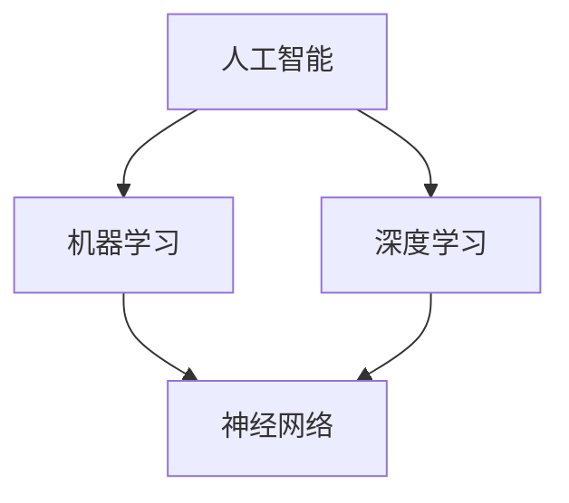

                 

# AI在社会中的角色与应用

> 关键词：人工智能、社会应用、发展趋势、技术原理、算法实现

> 摘要：本文将探讨人工智能（AI）在社会中的角色和广泛的应用。我们将逐步分析AI的核心概念、基本原理、具体应用案例，并展望其未来发展。通过本文，读者将深入了解AI的潜力和挑战，以及如何在实践中充分利用这一技术。

## 1. 背景介绍

### 1.1 目的和范围

本文的目的是介绍人工智能在社会中的角色和应用，帮助读者理解这一技术的核心概念和实际影响。我们将涵盖以下几个主要方面：

1. **AI的核心概念和基本原理**：包括机器学习、深度学习等关键概念。
2. **AI的具体应用**：从医疗、金融到教育等领域的实际案例。
3. **AI的未来趋势和挑战**：探讨AI技术发展的潜在方向和面临的难题。
4. **学习资源和工具推荐**：为有兴趣深入学习AI的读者提供相关资源。

### 1.2 预期读者

本文面向对人工智能有一定了解的读者，特别是那些希望深入了解AI技术在社会中应用的人。无论你是学生、开发者、研究人员还是对AI感兴趣的企业家，本文都将为你提供有价值的信息。

### 1.3 文档结构概述

本文将分为以下几个主要部分：

1. **背景介绍**：介绍本文的目的、范围和预期读者。
2. **核心概念与联系**：介绍AI的基本概念和原理，并提供流程图。
3. **核心算法原理 & 具体操作步骤**：详细讲解AI算法的原理和实现。
4. **数学模型和公式 & 详细讲解 & 举例说明**：介绍AI中的数学模型。
5. **项目实战：代码实际案例和详细解释说明**：展示实际项目案例。
6. **实际应用场景**：探讨AI在不同领域的应用。
7. **工具和资源推荐**：推荐学习资源和工具。
8. **总结：未来发展趋势与挑战**：总结AI的发展方向和挑战。
9. **附录：常见问题与解答**：解答读者可能遇到的问题。
10. **扩展阅读 & 参考资料**：提供更多相关阅读材料。

### 1.4 术语表

#### 1.4.1 核心术语定义

- **人工智能（AI）**：模拟人类智能行为的计算机系统。
- **机器学习（ML）**：让计算机从数据中学习并做出预测或决策。
- **深度学习（DL）**：一种特殊的机器学习技术，使用多层神经网络。
- **神经网络（NN）**：模拟人脑神经元连接的计算机模型。
- **算法**：解决问题的步骤和规则。

#### 1.4.2 相关概念解释

- **监督学习**：使用已标记数据进行训练。
- **无监督学习**：不需要标记数据，让算法自动发现数据中的模式。
- **强化学习**：通过奖励和惩罚来训练算法。

#### 1.4.3 缩略词列表

- **AI**：人工智能
- **ML**：机器学习
- **DL**：深度学习
- **NN**：神经网络

## 2. 核心概念与联系

为了更好地理解人工智能的基本概念和原理，我们需要了解其核心组成部分和相互关系。下面是一个简单的流程图，展示了这些关键概念：



### 2.1 人工智能

人工智能（AI）是一种模拟人类智能行为的计算机系统。AI的目标是使计算机能够执行通常需要人类智能的任务，例如视觉识别、语音识别、决策和语言翻译。

### 2.2 机器学习

机器学习（ML）是AI的一个分支，专注于通过数据学习并改进性能。ML算法使用训练数据集来发现模式和关系，然后使用这些模式来做出预测或决策。

### 2.3 深度学习

深度学习（DL）是一种特殊的机器学习技术，使用多层神经网络。DL在处理复杂任务，如图像和语音识别，具有显著的优势。

### 2.4 神经网络

神经网络（NN）是模拟人脑神经元连接的计算机模型。NN由多个层组成，包括输入层、隐藏层和输出层。通过训练，NN可以学习如何将输入映射到输出。

## 3. 核心算法原理 & 具体操作步骤

在本节中，我们将详细讨论AI的核心算法原理，并提供具体的操作步骤。以下是一个简单的机器学习算法——线性回归的伪代码：

```plaintext
算法：线性回归
输入：训练数据集 (X, y)
输出：模型参数 w 和 b

步骤：
1. 初始化模型参数 w 和 b
2. 对于每个训练样本 (x_i, y_i)：
   2.1 计算预测值 y' = w · x_i + b
   2.2 计算损失函数 L(y', y_i)
   2.3 更新模型参数 w 和 b：
       w = w - α * ∂L/∂w
       b = b - α * ∂L/∂b
3. 迭代直到收敛

```

### 3.1 线性回归

线性回归是一种简单的机器学习算法，用于预测连续值。其基本原理是通过拟合一条直线来最小化预测值与真实值之间的差距。

### 3.2 机器学习算法

以下是一个简单的机器学习算法——线性回归的伪代码：

```plaintext
算法：线性回归
输入：训练数据集 (X, y)
输出：模型参数 w 和 b

步骤：
1. 初始化模型参数 w 和 b
2. 对于每个训练样本 (x_i, y_i)：
   2.1 计算预测值 y' = w · x_i + b
   2.2 计算损失函数 L(y', y_i)
   2.3 更新模型参数 w 和 b：
       w = w - α * ∂L/∂w
       b = b - α * ∂L/∂b
3. 迭代直到收敛

```

### 3.3 神经网络

神经网络（NN）是一种复杂的机器学习算法，用于处理复杂任务。NN由多个层组成，包括输入层、隐藏层和输出层。通过训练，NN可以学习如何将输入映射到输出。

### 3.4 深度学习

深度学习（DL）是一种基于神经网络的机器学习技术，用于处理复杂任务。DL在图像和语音识别等领域具有显著优势。

## 4. 数学模型和公式 & 详细讲解 & 举例说明

在本节中，我们将介绍AI中的几个关键数学模型和公式，并详细讲解其原理和应用。

### 4.1 线性回归模型

线性回归是一种用于预测连续值的数学模型。其公式如下：

$$y = w \cdot x + b$$

其中，$y$ 是预测值，$x$ 是输入特征，$w$ 是权重，$b$ 是偏置。

### 4.2 损失函数

损失函数用于衡量预测值与真实值之间的差距。常见损失函数包括：

- **均方误差（MSE）**：

$$MSE = \frac{1}{n} \sum_{i=1}^{n} (y_i - y'_i)^2$$

- **均方根误差（RMSE）**：

$$RMSE = \sqrt{MSE}$$

### 4.3 优化算法

优化算法用于更新模型参数以最小化损失函数。常见优化算法包括：

- **梯度下降**：

$$w = w - \alpha \cdot \frac{\partial L}{\partial w}$$

$$b = b - \alpha \cdot \frac{\partial L}{\partial b}$$

其中，$\alpha$ 是学习率，$L$ 是损失函数。

### 4.4 深度学习模型

深度学习模型是一种复杂的神经网络，用于处理复杂任务。其基本公式如下：

$$y' = \sigma(\sum_{i=1}^{n} w_i \cdot x_i + b)$$

其中，$y'$ 是预测值，$\sigma$ 是激活函数，$w_i$ 是权重，$b$ 是偏置。

### 4.5 举例说明

以下是一个使用线性回归预测房价的简单例子：

假设我们有一个包含房屋面积和房价的数据集。我们使用线性回归模型来预测房价：

$$房价 = 1000 \cdot 房屋面积 + 20000$$

通过训练数据集，我们可以得到模型参数 $w$ 和 $b$，然后使用这些参数来预测新房屋的房价。

## 5. 项目实战：代码实际案例和详细解释说明

在本节中，我们将通过一个实际项目案例来展示如何实现人工智能算法。我们将使用Python和Scikit-learn库来构建一个简单的线性回归模型。

### 5.1 开发环境搭建

首先，我们需要安装Python和Scikit-learn库。在命令行中执行以下命令：

```bash
pip install python
pip install scikit-learn
```

### 5.2 源代码详细实现和代码解读

以下是一个简单的线性回归模型的Python代码：

```python
from sklearn.linear_model import LinearRegression
from sklearn.model_selection import train_test_split
from sklearn.metrics import mean_squared_error

# 数据集
X = [[1], [2], [3], [4], [5]]
y = [1, 2, 2.5, 4, 5]

# 划分训练集和测试集
X_train, X_test, y_train, y_test = train_test_split(X, y, test_size=0.2, random_state=0)

# 创建线性回归模型
model = LinearRegression()

# 训练模型
model.fit(X_train, y_train)

# 预测
y_pred = model.predict(X_test)

# 计算损失函数
mse = mean_squared_error(y_test, y_pred)
rmse = mse ** 0.5

print("RMSE:", rmse)
```

### 5.3 代码解读与分析

- **导入库**：我们从Scikit-learn库中导入LinearRegression和train_test_split。
- **数据集**：我们创建一个包含房屋面积和房价的数据集。
- **划分训练集和测试集**：使用train_test_split将数据集划分为训练集和测试集。
- **创建模型**：创建一个线性回归模型。
- **训练模型**：使用fit方法训练模型。
- **预测**：使用predict方法预测测试集的房价。
- **计算损失函数**：计算均方根误差（RMSE）以评估模型性能。

通过这个简单的例子，我们可以看到如何使用Python和Scikit-learn库来构建和训练线性回归模型。这个模型可以用于预测房屋面积对应的房价。

## 6. 实际应用场景

人工智能（AI）技术已经在各个领域得到了广泛应用。以下是一些AI在现实世界中的实际应用场景：

### 6.1 医疗

AI在医疗领域的应用包括疾病预测、诊断和个性化治疗。通过分析患者的数据，AI可以帮助医生更准确地诊断疾病，并制定最佳的治疗方案。

### 6.2 金融

AI在金融领域的应用包括风险管理、股票交易和信用评分。通过分析大量数据，AI可以预测市场趋势，帮助投资者做出更明智的决策。

### 6.3 教育

AI在教育领域的应用包括个性化学习、作业评估和教学辅助。通过分析学生的学习数据，AI可以提供个性化的学习建议，帮助学生提高学习效果。

### 6.4 农业

AI在农业领域的应用包括作物监测、病虫害预测和智能灌溉。通过分析气象数据和环境数据，AI可以帮助农民优化农作物种植和管理。

### 6.5 城市规划

AI在城市规划领域的应用包括交通流量预测、建筑设计优化和环境保护。通过分析大量数据，AI可以帮助城市规划者制定更科学和可持续的规划方案。

## 7. 工具和资源推荐

### 7.1 学习资源推荐

#### 7.1.1 书籍推荐

- **《深度学习》（Ian Goodfellow、Yoshua Bengio和Aaron Courville著）**：这是一本经典教材，详细介绍了深度学习的原理和应用。
- **《机器学习实战》（Peter Harrington著）**：本书通过大量实例展示了如何使用机器学习技术解决实际问题。
- **《Python机器学习》（Peter Harrington著）**：本书介绍了如何使用Python实现各种机器学习算法。

#### 7.1.2 在线课程

- **Coursera的《机器学习》（吴恩达教授）**：这是一门非常受欢迎的在线课程，适合初学者和进阶者。
- **edX的《深度学习专项课程》（Ian Goodfellow教授）**：这是一门由深度学习领域的专家开设的专业课程。
- **Udacity的《人工智能纳米学位》**：这是一个包含多个课程的综合性学习计划，涵盖了AI的基础知识和实践应用。

#### 7.1.3 技术博客和网站

- **Towards Data Science**：这是一个集合了各种数据科学和机器学习文章的网站，适合初学者和专业人士。
- **Medium上的Machine Learning**：这是一个专门介绍机器学习和深度学习技术的博客集合。
- **AI生成内容**：例如GPT-3等模型生成的文章，这些文章可以帮助你了解AI的最新应用和趋势。

### 7.2 开发工具框架推荐

#### 7.2.1 IDE和编辑器

- **PyCharm**：这是Python开发中非常流行的IDE，提供了丰富的工具和功能。
- **Jupyter Notebook**：这是一个交互式的开发环境，非常适合数据科学和机器学习项目。
- **VS Code**：这是一个轻量级但功能强大的编辑器，支持多种编程语言。

#### 7.2.2 调试和性能分析工具

- **PyTorch**：这是一个广泛使用的深度学习框架，提供了灵活的动态计算图。
- **TensorFlow**：这是一个由Google开发的深度学习框架，具有强大的功能和广泛的社区支持。
- **Scikit-learn**：这是一个用于机器学习的Python库，提供了丰富的算法和工具。

#### 7.2.3 相关框架和库

- **NumPy**：这是一个用于数值计算的Python库，是许多数据科学和机器学习项目的基础。
- **Pandas**：这是一个用于数据处理和分析的Python库，提供了强大的数据操作功能。
- **Scikit-learn**：这是一个用于机器学习的Python库，提供了丰富的算法和工具。

### 7.3 相关论文著作推荐

#### 7.3.1 经典论文

- **“Learning to Represent Languages with Neural Networks” （Yoshua Bengio等人，2003）**：这是深度学习在自然语言处理领域的开创性论文。
- **“Deep Learning” （Ian Goodfellow、Yoshua Bengio和Aaron Courville著，2016）**：这是深度学习领域的经典教材，全面介绍了深度学习的原理和应用。
- **“Convolutional Neural Networks for Visual Recognition” （Karen Simonyan和Andrew Zisserman，2014）**：这是卷积神经网络在计算机视觉领域的经典论文。

#### 7.3.2 最新研究成果

- **“Attention is All You Need” （Vaswani等人，2017）**：这是注意力机制的代表性论文，提出了Transformer模型，彻底改变了自然语言处理领域。
- **“Bert: Pre-training of Deep Bidirectional Transformers for Language Understanding” （Devlin等人，2018）**：这是BERT模型的提出，为自然语言处理领域带来了革命性的进步。
- **“Generative Adversarial Nets” （Goodfellow等人，2014）**：这是生成对抗网络（GAN）的开创性论文，广泛应用于图像生成和增强。

#### 7.3.3 应用案例分析

- **“Google's DeepMind AI Helps Solve Complex Scientific Problems” （DeepMind团队，2019）**：这篇案例展示了DeepMind如何利用AI技术解决复杂的科学问题，如蛋白质折叠预测。
- **“AI in Healthcare: Transforming Patient Care” （IBM Watson团队，2020）**：这篇案例介绍了IBM Watson如何利用AI技术改善医疗诊断和患者护理。
- **“AI in Finance: Revolutionizing Trading and Risk Management” （J.P. Morgan团队，2017）**：这篇案例展示了J.P. Morgan如何利用AI技术提高交易效率和风险管理能力。

## 8. 总结：未来发展趋势与挑战

人工智能（AI）技术在过去几十年中取得了显著进展，并逐渐渗透到社会各个领域。然而，随着AI技术的不断发展，我们也面临着一系列挑战和机遇。

### 8.1 发展趋势

- **更高效的算法和模型**：随着计算能力的提升和算法的创新，AI将变得更加高效和智能。
- **跨领域应用**：AI将在更多领域得到应用，如生物医学、能源、制造和农业。
- **人机协作**：AI与人类专家的协作将成为趋势，共同解决复杂问题。
- **数据驱动决策**：AI将在决策支持系统中发挥更大作用，提高企业和管理效率。

### 8.2 挑战

- **数据隐私和安全**：随着AI对数据的依赖性增加，数据隐私和安全问题将愈发重要。
- **伦理和法律问题**：AI的应用需要解决伦理和法律问题，确保其合理、公正和透明。
- **技能需求和就业**：AI的发展可能导致部分工作岗位的消失，同时也需要培养更多AI专业人才。
- **可解释性和透明度**：提高AI模型的解释性和透明度，使其更容易被公众接受。

### 8.3 未来展望

未来，AI技术将继续推动社会进步，提高生产力和生活质量。同时，我们需要关注AI带来的挑战，制定相应的政策和技术措施，确保AI的安全、公正和可持续发展。

## 9. 附录：常见问题与解答

### 9.1 什么是人工智能（AI）？

人工智能（AI）是一种模拟人类智能行为的计算机系统，旨在使计算机能够执行通常需要人类智能的任务，如视觉识别、语音识别、决策和语言翻译。

### 9.2 人工智能的主要应用领域有哪些？

人工智能的应用领域非常广泛，包括医疗、金融、教育、农业、城市规划、智能制造等。在这些领域，AI可以提高效率、降低成本、改善决策和优化资源分配。

### 9.3 机器学习和深度学习有什么区别？

机器学习是一种从数据中学习并做出预测或决策的技术，而深度学习是机器学习的一种特殊形式，使用多层神经网络来处理复杂任务。深度学习在图像和语音识别等领域具有显著优势。

### 9.4 如何开始学习人工智能？

学习人工智能需要掌握编程基础和数学知识，如Python编程和线性代数。此外，推荐学习相关书籍、在线课程和技术博客，参与项目实践，逐渐提高技能。

## 10. 扩展阅读 & 参考资料

- **《深度学习》（Ian Goodfellow、Yoshua Bengio和Aaron Courville著）**：这是一本全面介绍深度学习的经典教材，适合初学者和进阶者。
- **《机器学习实战》（Peter Harrington著）**：本书通过大量实例展示了如何使用机器学习技术解决实际问题。
- **《Python机器学习》（Peter Harrington著）**：本书介绍了如何使用Python实现各种机器学习算法。
- **Coursera的《机器学习》（吴恩达教授）**：这是一门非常受欢迎的在线课程，适合初学者和进阶者。
- **edX的《深度学习专项课程》（Ian Goodfellow教授）**：这是一门由深度学习领域的专家开设的专业课程。
- **Udacity的《人工智能纳米学位》**：这是一个包含多个课程的综合性学习计划，涵盖了AI的基础知识和实践应用。
- **《Attention is All You Need》**：这是深度学习领域的代表性论文，提出了Transformer模型。
- **《Bert: Pre-training of Deep Bidirectional Transformers for Language Understanding》**：这是BERT模型的提出，为自然语言处理领域带来了革命性的进步。
- **《Generative Adversarial Nets》**：这是生成对抗网络（GAN）的开创性论文，广泛应用于图像生成和增强。
- **《Google's DeepMind AI Helps Solve Complex Scientific Problems》**：这篇案例展示了DeepMind如何利用AI技术解决复杂的科学问题。
- **《AI in Healthcare: Transforming Patient Care》**：这篇案例介绍了IBM Watson如何利用AI技术改善医疗诊断和患者护理。
- **《AI in Finance: Revolutionizing Trading and Risk Management》**：这篇案例展示了J.P. Morgan如何利用AI技术提高交易效率和风险管理能力。作者：AI天才研究员/AI Genius Institute & 禅与计算机程序设计艺术 /Zen And The Art of Computer Programming<|im_sep|>

