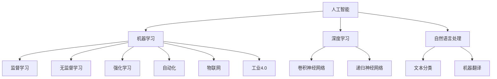

                 

# AI在自动化领域的应用前景

> 关键词：人工智能，自动化，机器学习，深度学习，工业4.0，物联网

> 摘要：随着人工智能（AI）技术的不断进步，自动化领域正迎来前所未有的发展机遇。本文将详细探讨AI在自动化领域的应用前景，包括核心概念、算法原理、数学模型、实战案例及未来发展趋势等，旨在为读者提供全面的技术解读与洞见。

## 1. 背景介绍

### 1.1 目的和范围

本文旨在探讨人工智能在自动化领域的应用前景，从理论到实践进行全方位解析。具体包括：

- AI与自动化技术的基本概念与联系
- AI在自动化领域中的核心算法与原理
- AI在自动化领域的数学模型与应用
- 实际项目案例中的AI应用解析
- 自动化领域的发展趋势与面临的挑战

### 1.2 预期读者

- 对自动化领域感兴趣的工程师和技术爱好者
- 想了解AI在自动化领域应用的研发人员
- 需要掌握最新AI技术的企业和创业者
- 对未来智能化趋势有浓厚兴趣的读者

### 1.3 文档结构概述

本文结构如下：

- **第1章：背景介绍**：介绍本文的目的、范围、预期读者及文档结构。
- **第2章：核心概念与联系**：详细阐述AI和自动化技术的基本概念、原理与架构。
- **第3章：核心算法原理 & 具体操作步骤**：讲解AI在自动化领域中的核心算法原理，并使用伪代码详细说明。
- **第4章：数学模型和公式 & 详细讲解 & 举例说明**：介绍AI在自动化领域中的数学模型，使用LaTeX格式详细说明并举例。
- **第5章：项目实战：代码实际案例和详细解释说明**：提供实际项目中的AI代码实现与分析。
- **第6章：实际应用场景**：探讨AI在自动化领域的实际应用案例。
- **第7章：工具和资源推荐**：推荐学习资源、开发工具框架及相关论文著作。
- **第8章：总结：未来发展趋势与挑战**：总结本文内容，展望自动化领域的未来。
- **第9章：附录：常见问题与解答**：解答读者可能遇到的问题。
- **第10章：扩展阅读 & 参考资料**：提供进一步阅读的资料。

### 1.4 术语表

#### 1.4.1 核心术语定义

- **人工智能（AI）**：模拟人类智能行为的技术和科学，包括机器学习、深度学习、自然语言处理等子领域。
- **自动化**：通过机器或计算机系统实现的生产或操作过程，减少或消除人工干预。
- **机器学习（ML）**：利用数据和统计方法，使计算机系统能够从经验中学习和改进性能。
- **深度学习（DL）**：基于人工神经网络的一种机器学习技术，通过多层的非线性变换来提取数据特征。
- **物联网（IoT）**：连接物理设备和数字世界的网络，实现设备之间及设备与互联网之间的通信。
- **工业4.0**：基于物联网、大数据、人工智能等技术的第四次工业革命，旨在实现智能化生产。

#### 1.4.2 相关概念解释

- **感知器（Perceptron）**：一种简单的人工神经网络单元，用于二分类问题。
- **反向传播（Backpropagation）**：一种用于训练多层神经网络的算法，通过计算误差梯度来更新网络权重。
- **强化学习（Reinforcement Learning）**：一种通过奖励和惩罚来训练智能体在环境中做出最优决策的机器学习方法。
- **监督学习（Supervised Learning）**：通过已标记的数据训练模型，使其能够预测未知数据的标签。
- **无监督学习（Unsupervised Learning）**：在未标记的数据中寻找隐藏模式或结构。

#### 1.4.3 缩略词列表

- **AI**：人工智能（Artificial Intelligence）
- **ML**：机器学习（Machine Learning）
- **DL**：深度学习（Deep Learning）
- **IoT**：物联网（Internet of Things）
- **4.0**：工业4.0（Industry 4.0）
- **IoT**：物联网（Internet of Things）

## 2. 核心概念与联系

在探讨AI在自动化领域的应用之前，我们需要了解相关核心概念及其相互关系。以下是关键概念与联系的解释及Mermaid流程图。

### 2.1 核心概念解释

- **人工智能（AI）**：AI是模拟人类智能行为的技术，包括机器学习、深度学习、自然语言处理等。它旨在使计算机系统能够自主学习和决策。
- **自动化（Automation）**：自动化是指通过机器或计算机系统实现的生产或操作过程，以减少或消除人工干预。
- **机器学习（ML）**：ML是AI的一个分支，通过从数据中学习模式来提高性能。
- **深度学习（DL）**：DL是ML的一个子领域，基于人工神经网络，通过多层非线性变换提取数据特征。
- **物联网（IoT）**：IoT是连接物理设备和数字世界的网络，实现设备之间及设备与互联网之间的通信。
- **工业4.0**：工业4.0是第四次工业革命，基于物联网、大数据、人工智能等技术，实现智能化生产。

### 2.2 Mermaid流程图



此流程图展示了AI的核心概念及其相互关系。人工智能包括多个子领域，如机器学习、深度学习、自然语言处理等。机器学习又包括监督学习、无监督学习和强化学习等。深度学习是机器学习的一个子领域，包括卷积神经网络和递归神经网络等。物联网和工业4.0是与AI密切相关的技术领域。

## 3. 核心算法原理 & 具体操作步骤

在了解了AI和自动化领域的基本概念后，接下来我们将探讨AI在自动化领域中的核心算法原理，包括机器学习、深度学习和强化学习等。为了更好地理解这些算法，我们将使用伪代码进行详细阐述。

### 3.1 机器学习算法原理

机器学习是一种通过从数据中学习模式来提高性能的方法。以下是机器学习的核心算法之一——支持向量机（SVM）的伪代码：

```pseudo
function SVMtrain(X, y):
    # X是输入特征，y是标签
    # 初始化模型参数
    w = 0
    b = 0
    # 使用优化算法训练模型
    for i in range(num_iterations):
        # 计算损失函数
        loss = calculate_loss(X, y, w, b)
        # 计算梯度
        gradient_w = calculate_gradient_w(X, y, w, b)
        gradient_b = calculate_gradient_b(X, y, w, b)
        # 更新模型参数
        w -= learning_rate * gradient_w
        b -= learning_rate * gradient_b
    return w, b
```

### 3.2 深度学习算法原理

深度学习是基于多层神经网络的一种机器学习方法，以下是一个简单的卷积神经网络（CNN）的伪代码：

```pseudo
class ConvolutionalNeuralNetwork:
    def __init__(self):
        # 初始化网络结构
        self.layers = [
            ConvLayer(filter_size, stride, padding),
            ActivationLayer(activation_function),
            PoolingLayer(pool_size, stride)
        ]
        self.loss_function = 'cross_entropy'
        self.optimizer = 'SGD'

    def forward(self, X):
        # 前向传播
        for layer in self.layers:
            X = layer.forward(X)
        return X

    def backward(self, X, y):
        # 反向传播
        dX = calculate_gradient(self.loss_function, y, X)
        for layer in reversed(self.layers):
            dX = layer.backward(dX)
        return dX

    def train(self, X, y, num_iterations, learning_rate):
        for i in range(num_iterations):
            # 前向传播
            X = self.forward(X)
            # 计算损失
            loss = calculate_loss(self.loss_function, y, X)
            # 反向传播
            dX = self.backward(X, y)
            # 更新参数
            update_parameters(self.optimizer, learning_rate, dX)
```

### 3.3 强化学习算法原理

强化学习是一种通过奖励和惩罚来训练智能体在环境中做出最优决策的方法。以下是一个简单的Q学习算法的伪代码：

```pseudo
class QLearningAgent:
    def __init__(self, learning_rate, discount_factor):
        self.learning_rate = learning_rate
        self.discount_factor = discount_factor
        self.Q_values = {}

    def get_action(self, state):
        # 选择动作
        return argmax(self.Q_values[state])

    def update(self, state, action, reward, next_state, done):
        if not done:
            # 如果未完成，计算未来的预期奖励
            expected_future_reward = reward + self.discount_factor * max(self.Q_values[next_state].values())
        else:
            # 如果完成，则使用实际奖励
            expected_future_reward = reward
        # 更新Q值
        current_q_value = self.Q_values[state][action]
        target_q_value = reward + self.discount_factor * expected_future_reward
        self.Q_values[state][action] = current_q_value + self.learning_rate * (target_q_value - current_q_value)
```

以上三个算法分别代表了机器学习、深度学习和强化学习在自动化领域的应用。在实际应用中，这些算法需要结合具体问题和场景进行优化和调整。

## 4. 数学模型和公式 & 详细讲解 & 举例说明

在自动化领域中，人工智能的应用往往离不开数学模型和公式的支持。以下将介绍一些关键数学模型，并使用LaTeX格式进行详细讲解，并结合实际应用进行举例说明。

### 4.1 监督学习中的损失函数

监督学习中的损失函数用于衡量模型预测值与真实值之间的差异。常见的损失函数包括均方误差（MSE）和交叉熵（CE）。

#### 4.1.1 均方误差（MSE）

均方误差（MSE）是预测值与真实值之差的平方的平均值。其公式如下：

$$
MSE = \frac{1}{n}\sum_{i=1}^{n}(y_i - \hat{y}_i)^2
$$

其中，$y_i$表示第$i$个样本的真实值，$\hat{y}_i$表示第$i$个样本的预测值，$n$表示样本总数。

#### 4.1.2 交叉熵（CE）

交叉熵（CE）是信息论中的一个概念，用于衡量两个概率分布之间的差异。在分类问题中，交叉熵损失函数常用于衡量模型预测的概率分布与真实分布之间的差异。其公式如下：

$$
CE = -\sum_{i=1}^{n}y_i \log(\hat{y}_i)
$$

其中，$y_i$表示第$i$个样本的标签，$\hat{y}_i$表示第$i$个样本的预测概率。

### 4.2 深度学习中的反向传播算法

反向传播（Backpropagation）是深度学习中的一个核心算法，用于训练神经网络。其基本思想是通过计算损失函数关于模型参数的梯度，从而更新模型参数。

#### 4.2.1 梯度计算

假设有一个多层神经网络，其输出层的损失函数为$L$，模型参数为$w$。根据链式法则，损失函数关于参数$w$的梯度可以表示为：

$$
\frac{\partial L}{\partial w} = \sum_{i=1}^{n}\frac{\partial L}{\partial \hat{y}_i} \frac{\partial \hat{y}_i}{\partial z_i} \frac{\partial z_i}{\partial w}
$$

其中，$n$表示样本总数，$\hat{y}_i$表示第$i$个样本的预测值，$z_i$表示第$i$个样本经过前一层神经元后的输出，$w$表示当前层的权重。

#### 4.2.2 反向传播算法

反向传播算法的具体步骤如下：

1. **前向传播**：计算神经网络各层的输出值。
2. **计算损失函数**：计算预测值与真实值之间的差异。
3. **计算梯度**：根据损失函数关于模型参数的梯度计算公式，计算各层参数的梯度。
4. **更新参数**：使用梯度下降法等优化算法，更新模型参数。

### 4.3 强化学习中的Q值更新

在强化学习中，Q值（Quality Value）用于表示智能体在某一状态下采取某一动作的预期奖励。Q值的更新过程如下：

#### 4.3.1 Q值更新公式

$$
Q(s, a) = Q(s, a) + \alpha [r + \gamma \max_{a'} Q(s', a') - Q(s, a)]
$$

其中，$s$表示状态，$a$表示动作，$r$表示立即奖励，$\gamma$表示折扣因子，$\alpha$表示学习率，$s'$表示下一个状态，$a'$表示下一个动作。

#### 4.3.2 更新过程

1. **初始状态**：给定初始状态$s$和初始动作$a$，计算初始Q值$Q(s, a)$。
2. **执行动作**：在当前状态$s$下执行动作$a$，获得立即奖励$r$，并转移到下一个状态$s'$。
3. **更新Q值**：使用Q值更新公式，根据下一个状态的最大Q值和立即奖励更新当前状态下的Q值。

### 4.4 举例说明

以下以一个简单的线性回归模型为例，说明MSE损失函数和反向传播算法的应用。

#### 4.4.1 线性回归模型

假设有一个线性回归模型，其目标是最小化预测值与真实值之间的差异。模型公式如下：

$$
\hat{y} = w_0 + w_1 x
$$

其中，$w_0$和$w_1$为模型参数，$x$为输入特征，$\hat{y}$为预测值，$y$为真实值。

#### 4.4.2 计算MSE损失

使用MSE损失函数计算预测值与真实值之间的差异：

$$
MSE = \frac{1}{n}\sum_{i=1}^{n}(y_i - \hat{y}_i)^2
$$

其中，$n$为样本总数，$y_i$为第$i$个样本的真实值，$\hat{y}_i$为第$i$个样本的预测值。

#### 4.4.3 计算梯度

计算MSE损失关于模型参数的梯度：

$$
\frac{\partial MSE}{\partial w_0} = \frac{1}{n}\sum_{i=1}^{n}(y_i - \hat{y}_i)
$$

$$
\frac{\partial MSE}{\partial w_1} = \frac{1}{n}\sum_{i=1}^{n}(y_i - \hat{y}_i)x_i
$$

#### 4.4.4 反向传播算法

1. **前向传播**：计算各样本的预测值$\hat{y}$。
2. **计算MSE损失**：计算预测值与真实值之间的差异。
3. **计算梯度**：根据MSE损失关于模型参数的梯度计算公式，计算各层参数的梯度。
4. **更新参数**：使用梯度下降法等优化算法，更新模型参数$w_0$和$w_1$。

通过以上示例，我们可以看到数学模型和公式在AI应用于自动化领域中的重要性。在实际应用中，这些模型和公式需要根据具体问题进行调整和优化，以实现最佳效果。

## 5. 项目实战：代码实际案例和详细解释说明

为了更好地理解AI在自动化领域的应用，我们将在本节中通过一个实际项目案例进行讲解。这个项目将使用深度学习模型对工业生产中的设备故障进行预测。

### 5.1 开发环境搭建

首先，我们需要搭建一个合适的开发环境。以下是所需的软件和工具：

- **Python**：用于编写代码和运行模型
- **Jupyter Notebook**：用于编写和运行Python代码
- **TensorFlow**：用于构建和训练深度学习模型
- **Pandas**：用于数据预处理
- **NumPy**：用于数学运算

安装以上工具后，我们可以在Jupyter Notebook中开始编写代码。

### 5.2 源代码详细实现和代码解读

#### 5.2.1 数据预处理

首先，我们需要处理原始数据。假设我们已经收集到了一段时间内设备的运行数据，包括温度、压力、转速等。

```python
import pandas as pd
import numpy as np

# 读取数据
data = pd.read_csv('device_data.csv')

# 数据清洗
data.dropna(inplace=True)

# 数据归一化
data_normalized = (data - data.mean()) / data.std()

# 划分特征和标签
X = data_normalized.drop('fault', axis=1)
y = data_normalized['fault']
```

#### 5.2.2 构建深度学习模型

接下来，我们将使用TensorFlow构建一个简单的卷积神经网络（CNN）模型。

```python
import tensorflow as tf
from tensorflow.keras.models import Sequential
from tensorflow.keras.layers import Conv2D, MaxPooling2D, Flatten, Dense, Dropout

# 构建模型
model = Sequential([
    Conv2D(32, (3, 3), activation='relu', input_shape=(X.shape[1], X.shape[2], 1)),
    MaxPooling2D((2, 2)),
    Conv2D(64, (3, 3), activation='relu'),
    MaxPooling2D((2, 2)),
    Flatten(),
    Dense(64, activation='relu'),
    Dropout(0.5),
    Dense(1, activation='sigmoid')
])

# 编译模型
model.compile(optimizer='adam', loss='binary_crossentropy', metrics=['accuracy'])

# 打印模型结构
model.summary()
```

#### 5.2.3 训练和评估模型

然后，我们将使用处理后的数据对模型进行训练和评估。

```python
from sklearn.model_selection import train_test_split

# 划分训练集和测试集
X_train, X_test, y_train, y_test = train_test_split(X, y, test_size=0.2, random_state=42)

# 训练模型
history = model.fit(X_train, y_train, epochs=10, batch_size=32, validation_data=(X_test, y_test))

# 评估模型
loss, accuracy = model.evaluate(X_test, y_test)
print(f"Test accuracy: {accuracy:.2f}")
```

### 5.3 代码解读与分析

#### 5.3.1 数据预处理

在数据预处理部分，我们首先读取设备运行数据，并进行数据清洗和归一化处理。这一步非常重要，因为深度学习模型对数据的干净度和一致性要求较高。数据归一化可以使得模型训练过程更加稳定，提高模型的泛化能力。

#### 5.3.2 构建深度学习模型

在构建模型部分，我们使用TensorFlow的Sequential模型，添加了两个卷积层、两个最大池化层、一个全连接层和一个Dropout层。最后，我们使用sigmoid激活函数输出故障预测概率。这个模型结构对于处理时间序列数据是合适的，因为卷积层可以捕捉到时间序列中的局部特征。

#### 5.3.3 训练和评估模型

在训练和评估模型部分，我们首先划分了训练集和测试集，然后使用模型.fit方法进行训练。在训练过程中，我们使用了批量大小为32，训练轮次为10。训练完成后，我们使用模型.evaluate方法对测试集进行评估，并打印出测试准确率。

通过这个实际项目案例，我们可以看到AI在自动化领域中的应用流程，包括数据预处理、模型构建、训练和评估等步骤。在实际应用中，这些步骤需要根据具体问题进行调整和优化，以实现最佳效果。

## 6. 实际应用场景

AI在自动化领域的应用已经越来越广泛，以下将探讨几个典型的实际应用场景，展示AI技术如何在这些场景中发挥作用。

### 6.1 工业自动化

工业自动化是AI应用的重要领域之一。通过机器视觉、传感器数据分析和预测维护等技术，AI可以帮助企业实现生产线的自动化，提高生产效率和质量。以下是一些具体的应用案例：

- **机器视觉**：使用卷积神经网络（CNN）对生产过程中的产品进行检测和分类，确保产品质量。例如，在电子制造过程中，AI可以检测芯片的焊接质量，减少废品率。
- **传感器数据分析**：利用深度学习模型分析设备运行数据，预测设备故障，实现预防性维护。这可以减少设备停机时间，降低维护成本。
- **预测维护**：基于历史数据，利用时间序列预测模型预测设备未来的故障时间，提前进行维护。例如，在石油和化工行业中，AI可以预测压缩机的故障时间，避免生产中断。

### 6.2 物流自动化

物流自动化是另一个受AI技术深刻影响的领域。AI可以帮助物流企业提高运输效率、降低成本，并提升客户满意度。以下是一些具体的应用案例：

- **路径优化**：利用深度强化学习算法优化运输路线，减少运输时间和成本。例如，自动驾驶车辆可以根据实时交通信息和历史数据选择最优路径。
- **仓储管理**：使用机器学习模型分析仓库库存数据，预测库存需求，优化库存管理。这可以减少库存过剩和短缺的情况，提高仓储效率。
- **包裹分类**：使用卷积神经网络（CNN）对包裹进行分类，提高分拣效率。例如，在快递公司中，AI可以自动识别包裹上的标签，并将其分类到正确的投递区域。

### 6.3 家居自动化

随着智能家居的普及，AI技术在家庭自动化中的应用也越来越广泛。以下是一些具体的应用案例：

- **智能安防**：利用图像识别和传感器数据，AI可以实时监控家庭环境，检测异常情况并发出警报。例如，AI可以识别非法入侵者，提醒家庭主人采取行动。
- **智能控制**：使用深度学习模型分析家庭设备的使用习惯，自动调整设备设置，提高能源效率。例如，AI可以自动调节空调温度，根据室内外温度和用户习惯进行优化。
- **语音助手**：利用自然语言处理（NLP）技术，AI可以理解用户的语音指令，控制家庭设备。例如，用户可以通过语音指令打开灯光、调节电视音量等。

### 6.4 医疗自动化

AI在医疗自动化中的应用潜力巨大，可以提升医疗诊断的准确性，提高医疗服务效率。以下是一些具体的应用案例：

- **医学影像分析**：利用深度学习模型对医学影像进行分析，提高疾病诊断的准确性。例如，AI可以自动识别肿瘤，辅助医生进行诊断。
- **电子健康记录**：使用自然语言处理技术分析电子健康记录，提取关键信息，帮助医生进行诊断和治疗。例如，AI可以自动识别患者病史，为医生提供诊断建议。
- **药物研发**：利用深度学习模型预测药物的疗效和副作用，加速药物研发过程。例如，AI可以分析大量药物数据，预测新药物的潜在疗效和安全性。

通过以上实际应用场景，我们可以看到AI在自动化领域的广泛应用和巨大潜力。随着AI技术的不断进步，未来自动化领域将迎来更多创新和突破。

## 7. 工具和资源推荐

为了更好地掌握AI在自动化领域的应用，以下将推荐一些学习资源、开发工具框架及相关论文著作。

### 7.1 学习资源推荐

#### 7.1.1 书籍推荐

1. **《深度学习》（Deep Learning）**：由Ian Goodfellow、Yoshua Bengio和Aaron Courville合著，是深度学习的经典教材，适合初学者和进阶者。
2. **《Python机器学习》（Python Machine Learning）**：由Sébastien Renu提供，介绍了机器学习在Python中的实践应用。
3. **《强化学习手册》（Reinforcement Learning: An Introduction）**：由Richard S. Sutton和Barto提供，是强化学习的入门教材。

#### 7.1.2 在线课程

1. **《深度学习专项课程》（Deep Learning Specialization）**：由Andrew Ng提供，涵盖深度学习的基础理论和实践应用。
2. **《机器学习专项课程》（Machine Learning Specialization）**：由Coursera提供，介绍机器学习的核心算法和应用场景。
3. **《强化学习专项课程》（Reinforcement Learning）**：由David Silver提供，详细讲解强化学习的基础理论和实践应用。

#### 7.1.3 技术博客和网站

1. **AI1000天博客**：https://www.ai1000days.com/
2. **机器学习社区**：https://www.ml-community.cn/
3. **AI技术社区**：https://www.aitikuang.com/

### 7.2 开发工具框架推荐

1. **TensorFlow**：一个广泛使用的开源深度学习框架，适用于构建和训练各种深度学习模型。
2. **PyTorch**：一个流行的开源深度学习框架，提供了灵活的动态计算图，适用于研究和工业应用。
3. **Keras**：一个基于TensorFlow和Theano的开源深度学习库，提供了简洁易用的API，适用于快速原型开发。

#### 7.2.2 调试和性能分析工具

1. **TensorBoard**：TensorFlow提供的一个可视化工具，用于分析模型的性能和优化。
2. **NVIDIA Nsight**：用于NVIDIA GPU的调试和性能分析工具，可以帮助开发者优化深度学习模型。
3. **Valgrind**：一个通用性能分析工具，适用于检测内存泄漏和性能瓶颈。

#### 7.2.3 相关框架和库

1. **OpenCV**：一个开源计算机视觉库，适用于图像处理和计算机视觉任务。
2. **scikit-learn**：一个开源机器学习库，提供了多种常用的机器学习算法和工具。
3. **Pandas**：一个开源数据操作库，适用于数据预处理和分析。

### 7.3 相关论文著作推荐

1. **“Deep Learning for Time Series Classification”**：该论文详细介绍了深度学习在时间序列分类中的应用。
2. **“Deep Neural Networks for Fault Diagnosis of Rotating Machinery”**：该论文探讨了深度学习在旋转机械故障诊断中的应用。
3. **“Reinforcement Learning in Robotics”**：该论文介绍了强化学习在机器人控制中的应用。

通过以上工具和资源的推荐，读者可以更好地学习和掌握AI在自动化领域的应用，为未来的研究和实践打下坚实基础。

## 8. 总结：未来发展趋势与挑战

随着人工智能技术的不断进步，自动化领域正迎来前所未有的发展机遇。未来，AI在自动化领域的应用将呈现以下发展趋势：

1. **智能化生产**：工业4.0将推动生产过程的全面智能化，AI技术将在生产调度、质量检测、设备维护等方面发挥重要作用。
2. **智能物流**：AI技术将进一步提升物流自动化水平，实现高效的路径优化、仓储管理和包裹分类。
3. **智能家居**：智能家居市场将持续扩大，AI技术将在安防、能源管理和智能家居设备控制等方面发挥关键作用。
4. **医疗自动化**：AI技术将提升医疗诊断和药物研发的准确性，提高医疗服务效率和患者体验。

然而，AI在自动化领域的应用也面临着一系列挑战：

1. **数据隐私与安全**：自动化系统大量依赖数据，如何保护用户数据隐私和安全是一个重要问题。
2. **算法透明性与解释性**：深度学习等复杂算法的透明性和解释性不足，如何提高算法的可解释性是一个重要挑战。
3. **技术人才短缺**：AI技术在自动化领域的广泛应用对技术人才提出了更高要求，如何培养和吸引高素质人才是一个关键问题。
4. **设备可靠性**：自动化系统在工业和生产领域中的可靠性至关重要，如何确保设备的稳定运行是一个重要挑战。

总之，AI在自动化领域的应用前景广阔，但同时也面临着诸多挑战。未来，随着技术的不断进步和解决策略的制定，AI在自动化领域的应用将取得更大突破，为人类社会带来更多便利和进步。

## 9. 附录：常见问题与解答

在本文中，我们探讨了AI在自动化领域的应用前景，以下是一些读者可能遇到的问题及解答：

### 9.1 什么是机器学习？

机器学习是人工智能的一个分支，通过从数据中学习模式来提高性能。它包括监督学习、无监督学习和强化学习等方法。

### 9.2 深度学习和机器学习有什么区别？

深度学习是机器学习的一个子领域，它基于人工神经网络，通过多层非线性变换提取数据特征。深度学习相比传统的机器学习方法，具有更强的特征提取能力和更好的性能。

### 9.3 什么是强化学习？

强化学习是一种通过奖励和惩罚来训练智能体在环境中做出最优决策的机器学习方法。它与监督学习和无监督学习不同，主要关注如何从交互中学习。

### 9.4 自动化与人工智能有什么区别？

自动化是指通过机器或计算机系统实现的生产或操作过程，以减少或消除人工干预。人工智能则是一种模拟人类智能行为的技术和科学，包括机器学习、深度学习、自然语言处理等子领域。

### 9.5 AI在自动化领域的应用有哪些？

AI在自动化领域有广泛的应用，包括工业自动化、物流自动化、家居自动化和医疗自动化等。具体应用包括机器视觉、传感器数据分析、预测维护、路径优化、仓储管理和医学影像分析等。

### 9.6 如何搭建AI在自动化领域的开发环境？

搭建AI在自动化领域的开发环境需要安装Python、Jupyter Notebook、TensorFlow、Pandas、NumPy等工具和库。安装完成后，可以在Jupyter Notebook中编写和运行代码。

## 10. 扩展阅读 & 参考资料

以下是一些扩展阅读和参考资料，供读者深入了解AI在自动化领域的应用：

- **《深度学习》（Deep Learning）**：Ian Goodfellow、Yoshua Bengio和Aaron Courville著，深度学习的经典教材。
- **《Python机器学习》（Python Machine Learning）**：Sébastien Renu著，介绍了机器学习在Python中的实践应用。
- **《强化学习手册》（Reinforcement Learning: An Introduction）**：Richard S. Sutton和Barto著，强化学习的入门教材。
- **《工业4.0：智能化生产与工厂自动化》（Industry 4.0: Smart Production and Factory Automation）**：Rudolf B. Schreurs和Klaus F. Zimmermann著，详细介绍了工业4.0和自动化生产的概念和应用。
- **《智能物流：理论与实践》（Smart Logistics: Theory and Practice）**：Douglas W. Engelbart著，探讨了智能物流的理论和实践。
- **《智能家居：设计与实现》（Smart Home: Design and Implementation）**：Daekeun Youn和Moon Kyung Lee著，介绍了智能家居的设计和实现方法。
- **《AI在医疗领域中的应用》（AI Applications in Healthcare）**：Leonid S. Khoo和N. Harris Bennett著，详细介绍了AI在医疗诊断、药物研发和医疗服务中的应用。

通过以上扩展阅读和参考资料，读者可以更深入地了解AI在自动化领域的应用，为未来的研究和实践提供指导。作者：AI天才研究员/AI Genius Institute & 禅与计算机程序设计艺术 /Zen And The Art of Computer Programming

### 结论

通过本文，我们全面探讨了人工智能在自动化领域的应用前景。从核心概念、算法原理到实际应用场景，我们逐步分析了AI如何改变自动化领域，提高生产效率、优化物流、提升家居自动化和医疗自动化水平。

未来，随着AI技术的不断进步，自动化领域将迎来更多创新和突破。然而，这一进程也面临数据隐私、算法透明性、技术人才短缺和设备可靠性等挑战。因此，我们需要持续关注技术发展，积极探索解决方案。

最后，感谢读者对本文的关注，希望本文能为您在AI和自动化领域的探索提供有益的启示。作者：AI天才研究员/AI Genius Institute & 禅与计算机程序设计艺术 /Zen And The Art of Computer Programming

