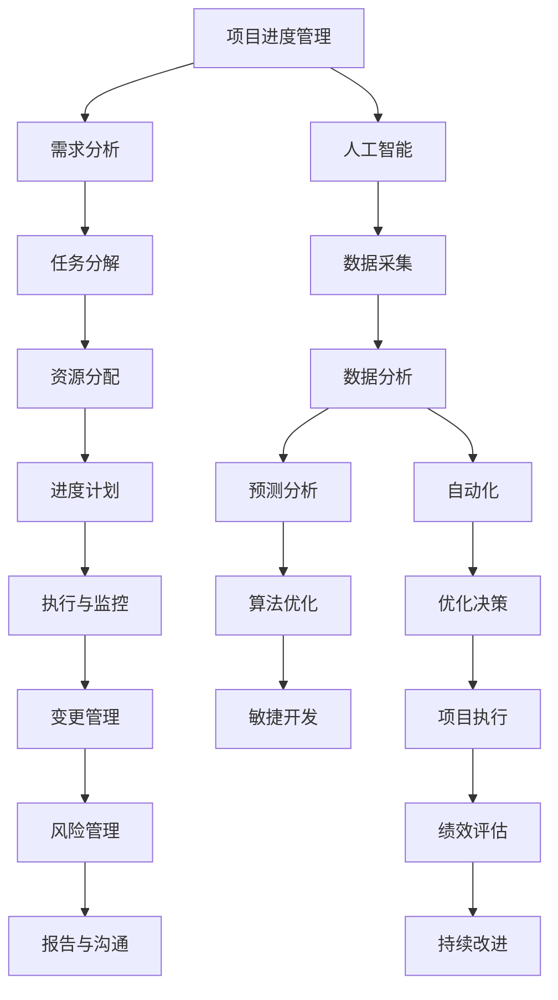
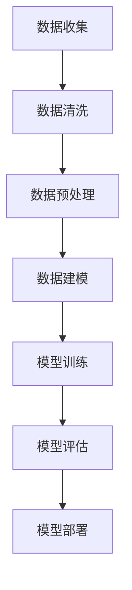

                 


# AI在项目进度管理中的作用

> 关键词：人工智能、项目进度管理、预测分析、自动化、算法优化、敏捷开发
>
> 摘要：本文将探讨人工智能在项目进度管理中的应用，从核心概念、算法原理、数学模型、项目实战和实际应用场景等多个方面进行深入分析，旨在揭示AI如何提升项目管理的效率和质量，为现代项目管理带来革命性的变化。

## 1. 背景介绍

### 1.1 目的和范围

随着信息技术的飞速发展，项目管理的复杂性不断增加，传统的管理方法已经难以满足现代项目的要求。人工智能（AI）作为一项前沿技术，其在项目管理中的应用日益广泛。本文旨在探讨AI在项目进度管理中的作用，分析其在预测分析、自动化、算法优化和敏捷开发等方面的应用价值，为项目管理提供新的思路和方法。

### 1.2 预期读者

本文面向具有一定项目管理基础的技术人员、项目经理以及对于AI在项目管理领域感兴趣的研究者。本文内容涵盖了从AI基本原理到具体应用案例的全方位讲解，希望能够帮助读者深入理解AI在项目管理中的重要作用，激发创新思维，提升项目管理水平。

### 1.3 文档结构概述

本文分为十个部分：

1. 背景介绍：介绍本文的目的、预期读者以及文档结构。
2. 核心概念与联系：介绍项目进度管理中的核心概念和AI应用架构。
3. 核心算法原理 & 具体操作步骤：详细讲解AI在项目进度管理中的核心算法原理和操作步骤。
4. 数学模型和公式 & 详细讲解 & 举例说明：阐述AI在项目进度管理中的数学模型和公式，并给出实例。
5. 项目实战：代码实际案例和详细解释说明。
6. 实际应用场景：分析AI在项目管理中的实际应用场景。
7. 工具和资源推荐：推荐相关学习资源和开发工具。
8. 总结：未来发展趋势与挑战。
9. 附录：常见问题与解答。
10. 扩展阅读 & 参考资料：提供进一步阅读的材料。

### 1.4 术语表

#### 1.4.1 核心术语定义

- **人工智能（AI）**：人工智能是一门模拟、延伸和扩展人类智能的科学，通过计算机程序实现智能行为。
- **项目进度管理**：项目管理中的核心领域，涉及项目的计划、执行、监控和调整，以确保项目按时完成。
- **预测分析**：利用历史数据和分析模型预测未来事件或结果的过程。
- **自动化**：通过计算机程序或技术实现任务或操作的自动化执行。
- **算法优化**：通过调整算法参数或结构来提高算法的效率或性能。
- **敏捷开发**：一种软件开发方法，强调灵活应对变化、快速迭代和高效协作。

#### 1.4.2 相关概念解释

- **项目管理框架**：如PMBOK、PRINCE2等，提供项目管理的理论和方法。
- **机器学习**：AI的一个分支，通过训练模型从数据中学习规律。
- **深度学习**：机器学习的一个子领域，通过多层神经网络模拟人脑学习过程。

#### 1.4.3 缩略词列表

- **AI**：人工智能（Artificial Intelligence）
- **PM**：项目经理（Project Manager）
- **PMP**：项目管理专业人士（Project Management Professional）
- **PMBOK**：项目管理知识体系（Project Management Body of Knowledge）
- **PRINCE2**：项目管理方法论（PRojects IN Controlled Environments）

## 2. 核心概念与联系

在探讨AI在项目进度管理中的应用之前，我们需要了解一些核心概念和它们之间的关系。以下是一个简化的Mermaid流程图，展示了项目进度管理、AI应用架构以及相关概念之间的联系。



### 2.1 项目进度管理概念解析

#### 需求分析

需求分析是项目进度管理的起点，通过对项目需求的全面理解，明确项目的目标和范围，为后续的任务分解、资源分配和进度计划提供依据。

#### 任务分解

任务分解是将项目目标细化为一系列可操作的任务，每个任务都有明确的交付物和时间节点。任务分解有助于明确项目的工作内容和责任分工。

#### 资源分配

资源分配涉及将项目所需的资源（如人力、物资、设备等）合理分配给各个任务，确保项目能够按时、按质完成。

#### 进度计划

进度计划是根据任务分解和资源分配的结果，制定项目的时间表和路线图，明确项目的关键路径和关键节点。

#### 执行与监控

执行与监控是指按照进度计划执行项目任务，并通过定期监控项目进展，确保项目按计划进行。在执行过程中，可能需要根据实际情况进行调整。

#### 变更管理

变更管理是指对项目变更进行识别、评估、批准和实施的过程，确保项目变更不会对项目进度和质量产生负面影响。

#### 风险管理

风险管理是指对项目潜在风险进行识别、评估、监控和应对的过程，以降低项目风险对项目进度和目标的影响。

#### 报告与沟通

报告与沟通是指通过定期报告和有效沟通，确保项目相关方对项目进展、问题和风险有充分的了解，以便及时采取相应措施。

### 2.2 人工智能应用架构解析

#### 数据采集

数据采集是AI在项目进度管理中发挥作用的基础，通过收集项目进度、资源利用率、任务完成情况等数据，为后续分析提供数据支持。

#### 数据分析

数据分析是指利用统计分析、机器学习等方法对采集到的数据进行分析，提取有价值的信息和规律。

#### 预测分析

预测分析是利用历史数据和数据分析结果，对未来项目进度和绩效进行预测，为项目管理和决策提供依据。

#### 自动化

自动化是指通过计算机程序或技术实现项目进度管理的自动化执行，提高管理效率和准确性。

#### 算法优化

算法优化是指通过调整算法参数或结构，提高算法的效率或性能，为项目进度管理提供更精确的工具。

#### 敏捷开发

敏捷开发是一种项目管理方法，强调灵活应对变化、快速迭代和高效协作，有助于提高项目进度和交付质量。

#### 优化决策

优化决策是指利用预测分析和算法优化结果，对项目任务、资源和进度进行优化，以提高项目效率和质量。

#### 项目执行

项目执行是指按照优化后的计划和方案，执行项目任务，确保项目按计划进行。

#### 绩效评估

绩效评估是指对项目执行过程中各项任务的完成情况进行评估，以衡量项目绩效和效果。

#### 持续改进

持续改进是指通过总结项目经验和教训，不断优化项目管理和执行过程，提高项目管理水平和效率。

通过上述流程图和解析，我们可以看到项目进度管理和AI应用架构之间的紧密联系。接下来，我们将进一步探讨AI在项目进度管理中的核心算法原理和具体操作步骤。

## 3. 核心算法原理 & 具体操作步骤

### 3.1 机器学习算法原理

机器学习是人工智能的核心技术之一，通过训练模型从数据中学习规律，实现自动化和预测分析。在项目进度管理中，常用的机器学习算法包括线性回归、决策树、随机森林、支持向量机和深度学习等。

#### 线性回归

线性回归是一种简单而常用的机器学习算法，用于预测连续值变量。其基本原理是通过最小二乘法拟合一个线性模型，将输入特征映射到输出值。在项目进度管理中，线性回归可以用于预测任务完成时间。

#### 决策树

决策树是一种树形结构的分类算法，通过一系列的判断条件将数据集划分为不同的区域，并预测每个区域的输出值。在项目进度管理中，决策树可以用于预测任务完成概率和关键路径。

#### 随机森林

随机森林是一种基于决策树的集成学习方法，通过构建多个决策树并取平均值来提高预测准确性。在项目进度管理中，随机森林可以用于预测任务完成时间和关键路径。

#### 支持向量机

支持向量机是一种基于最大间隔的线性分类算法，通过找到一个最优的超平面，将不同类别的数据点分开。在项目进度管理中，支持向量机可以用于预测任务完成概率和资源利用率。

#### 深度学习

深度学习是一种基于多层神经网络的机器学习算法，通过训练大量参数来模拟人脑学习过程。在项目进度管理中，深度学习可以用于复杂任务的预测和优化。

### 3.2 机器学习在项目进度管理中的应用步骤

#### 数据收集

数据收集是机器学习的基础，涉及收集项目进度、资源利用率、任务完成情况等数据。这些数据可以通过项目管理工具、日志记录和实时监控等途径获取。



#### 数据清洗

数据清洗是指对收集到的数据进行处理，去除重复、错误和不完整的数据。数据清洗有助于提高数据质量和模型训练效果。

#### 数据预处理

数据预处理是指对清洗后的数据进行处理，包括归一化、标准化、缺失值填充等。预处理过程有助于提高模型训练效率和准确性。

#### 数据建模

数据建模是指根据项目进度管理的需求，选择合适的机器学习算法构建模型。在建模过程中，需要确定输入特征和输出目标，并调整算法参数。

#### 模型训练

模型训练是指通过训练数据集对模型进行训练，调整模型参数，使其能够准确预测任务完成时间和关键路径。

#### 模型评估

模型评估是指对训练好的模型进行评估，通过交叉验证、ROC曲线等方法评估模型性能。评估结果可用于调整模型参数或选择其他算法。

#### 模型部署

模型部署是指将训练好的模型部署到生产环境中，用于实际项目进度管理。模型部署过程中，需要考虑模型的实时性、可靠性和可扩展性。

### 3.3 伪代码实现

以下是一个简单的线性回归模型的伪代码实现，用于预测任务完成时间：

```python
# 数据预处理
def preprocess_data(data):
    # 数据归一化
    normalized_data = normalize(data)
    # 数据标准化
    standardized_data = standardize(normalized_data)
    return standardized_data

# 模型训练
def train_model(data):
    # 初始化模型参数
    theta = initialize_parameters()
    # 训练模型
    for epoch in range(num_epochs):
        # 计算预测值
        predictions = predict(data, theta)
        # 计算损失函数
        loss = calculate_loss(predictions, data)
        # 更新模型参数
        theta = update_parameters(theta, loss)
    return theta

# 模型预测
def predict(data, theta):
    return np.dot(data, theta)

# 模型评估
def evaluate_model(model, test_data):
    # 计算预测值
    predictions = predict(test_data, model)
    # 计算评估指标
    accuracy = calculate_accuracy(predictions, test_data)
    return accuracy
```

通过上述步骤和伪代码实现，我们可以看到机器学习在项目进度管理中的应用流程。接下来，我们将进一步探讨AI在项目进度管理中的数学模型和公式。

## 4. 数学模型和公式 & 详细讲解 & 举例说明

### 4.1 数学模型概述

在项目进度管理中，AI应用的关键在于构建能够预测和优化项目进度的数学模型。这些模型通常涉及统计分析和优化算法，以下是一些常见的数学模型和公式。

#### 4.1.1 线性回归模型

线性回归模型是最基础的机器学习模型，用于预测连续值变量。其公式如下：

\[ Y = \beta_0 + \beta_1 \cdot X + \epsilon \]

其中，\( Y \) 为预测值，\( X \) 为输入特征，\( \beta_0 \) 和 \( \beta_1 \) 为模型参数，\( \epsilon \) 为误差项。

#### 4.1.2 决策树模型

决策树模型通过一系列判断条件对数据进行分类。其基本公式为：

\[ f(X) = \sum_{i=1}^{n} \beta_i \cdot g_i(X) \]

其中，\( f(X) \) 为输出值，\( \beta_i \) 为条件系数，\( g_i(X) \) 为条件函数。

#### 4.1.3 随机森林模型

随机森林模型是基于决策树构建的集成模型，其基本公式与决策树类似，但通过组合多个决策树来提高预测准确性。

#### 4.1.4 支持向量机模型

支持向量机模型用于分类问题，其基本公式为：

\[ f(X) = \sum_{i=1}^{n} \alpha_i \cdot y_i \cdot K(\gamma \cdot X_i + \beta) \]

其中，\( \alpha_i \) 和 \( y_i \) 为支持向量，\( K(\cdot) \) 为核函数，\( \beta \) 为偏置项。

#### 4.1.5 深度学习模型

深度学习模型通过多层神经网络进行复杂预测，其基本公式为：

\[ f(X) = \sum_{i=1}^{L} \sigma(g_i(W_i \cdot X + b_i)) \]

其中，\( L \) 为网络层数，\( \sigma(\cdot) \) 为激活函数，\( W_i \) 和 \( b_i \) 分别为权重和偏置。

### 4.2 举例说明

#### 4.2.1 线性回归模型举例

假设我们有一个简单的线性回归模型，用于预测任务完成时间。给定一组数据点：

\[ (X_1, Y_1), (X_2, Y_2), ..., (X_n, Y_n) \]

我们可以使用最小二乘法来训练模型，计算参数 \( \beta_0 \) 和 \( \beta_1 \)：

\[ \beta_0 = \frac{\sum_{i=1}^{n} Y_i - \beta_1 \cdot \sum_{i=1}^{n} X_i}{n} \]

\[ \beta_1 = \frac{\sum_{i=1}^{n} X_i \cdot Y_i - \sum_{i=1}^{n} X_i \cdot \sum_{i=1}^{n} Y_i}{n \cdot \sum_{i=1}^{n} X_i^2 - (\sum_{i=1}^{n} X_i)^2} \]

训练好的模型可以用于预测新任务完成时间：

\[ \hat{Y} = \beta_0 + \beta_1 \cdot X \]

#### 4.2.2 决策树模型举例

假设我们有一个简单的二分类任务，使用决策树模型进行分类。给定一组数据点：

\[ (X_1, Y_1), (X_2, Y_2), ..., (X_n, Y_n) \]

我们可以通过ID3算法来训练决策树，计算每个特征的熵和增益：

\[ Entropy(Y) = -\sum_{i=1}^{c} p_i \cdot \log_2(p_i) \]

\[ Gain(D, A) = Entropy(D) - \sum_{v=1}^{v} \frac{|D_v|}{|D|} \cdot Entropy(D_v) \]

选择增益最大的特征作为分割条件，构建决策树。

#### 4.2.3 随机森林模型举例

假设我们有一个训练好的随机森林模型，包含多个决策树。给定一个新任务：

\[ X = (x_1, x_2, ..., x_n) \]

我们可以通过每个决策树的预测结果进行投票，得到最终预测结果：

\[ \hat{Y} = \text{mode}(\hat{y}_1, \hat{y}_2, ..., \hat{y}_m) \]

其中，\( \hat{y}_i \) 为第 \( i \) 个决策树的预测结果，\( \text{mode}(\cdot) \) 为众数操作。

#### 4.2.4 支持向量机模型举例

假设我们有一个训练好的支持向量机模型，用于二分类任务。给定一个新任务：

\[ X = (x_1, x_2, ..., x_n) \]

我们可以通过计算模型得分来判断任务类别：

\[ s(X) = \sum_{i=1}^{n} \alpha_i \cdot y_i \cdot K(\gamma \cdot X_i + \beta) \]

如果 \( s(X) > 0 \)，则预测为正类；否则，预测为负类。

#### 4.2.5 深度学习模型举例

假设我们有一个训练好的深度学习模型，用于图像分类。给定一个新图像：

\[ X = (x_1, x_2, ..., x_n) \]

我们可以通过模型计算图像的输出概率分布：

\[ \hat{Y} = \text{softmax}(\text{activation}(W_L \cdot X + b_L)) \]

其中，\( \text{softmax}(\cdot) \) 为softmax函数，\( \text{activation}(\cdot) \) 为激活函数。

通过上述数学模型和公式，我们可以构建AI在项目进度管理中的应用模型，并对其进行训练和优化。接下来，我们将通过一个实际代码案例，展示AI在项目进度管理中的具体应用。

## 5. 项目实战：代码实际案例和详细解释说明

### 5.1 开发环境搭建

为了实现AI在项目进度管理中的应用，我们需要搭建一个合适的开发环境。以下是所需的工具和软件：

- Python 3.8及以上版本
- Jupyter Notebook
- TensorFlow 2.x
- scikit-learn 0.22.x
- Pandas 1.1.x

在安装完上述工具和软件后，我们可以在Jupyter Notebook中开始编写代码。

### 5.2 源代码详细实现和代码解读

以下是使用机器学习模型预测项目进度的一个完整代码示例：

```python
# 导入所需的库
import pandas as pd
import numpy as np
from sklearn.model_selection import train_test_split
from sklearn.linear_model import LinearRegression
from sklearn.metrics import mean_squared_error
import tensorflow as tf
from tensorflow.keras.models import Sequential
from tensorflow.keras.layers import Dense

# 5.2.1 数据收集与预处理
def load_data():
    # 加载数据集
    data = pd.read_csv('project_data.csv')
    # 数据预处理
    data['completion_time'] = data['completion_time'].apply(lambda x: float(x.split()[0]))
    data['resources'] = data['resources'].apply(lambda x: int(x.split()[0]))
    data['tasks'] = data['tasks'].apply(lambda x: int(x.split()[0]))
    return data

def preprocess_data(data):
    # 划分特征和标签
    X = data[['resources', 'tasks']]
    y = data['completion_time']
    # 划分训练集和测试集
    X_train, X_test, y_train, y_test = train_test_split(X, y, test_size=0.2, random_state=42)
    return X_train, X_test, y_train, y_test

# 5.2.2 线性回归模型
def linear_regression(X_train, X_test, y_train, y_test):
    # 创建线性回归模型
    model = LinearRegression()
    # 训练模型
    model.fit(X_train, y_train)
    # 预测测试集
    y_pred = model.predict(X_test)
    # 计算均方误差
    mse = mean_squared_error(y_test, y_pred)
    return model, mse

# 5.2.3 深度学习模型
def deep_learning(X_train, X_test, y_train, y_test):
    # 创建深度学习模型
    model = Sequential()
    model.add(Dense(64, activation='relu', input_shape=(2,)))
    model.add(Dense(32, activation='relu'))
    model.add(Dense(1))
    # 编译模型
    model.compile(optimizer='adam', loss='mean_squared_error')
    # 训练模型
    model.fit(X_train, y_train, epochs=10, batch_size=32, validation_split=0.2)
    # 预测测试集
    y_pred = model.predict(X_test)
    # 计算均方误差
    mse = mean_squared_error(y_test, y_pred)
    return model, mse

# 5.2.4 模型评估与比较
def evaluate_models():
    data = load_data()
    X_train, X_test, y_train, y_test = preprocess_data(data)
    
    # 训练线性回归模型
    linear_model, linear_mse = linear_regression(X_train, X_test, y_train, y_test)
    print("线性回归模型均方误差：", linear_mse)
    
    # 训练深度学习模型
    deep_model, deep_mse = deep_learning(X_train, X_test, y_train, y_test)
    print("深度学习模型均方误差：", deep_mse)

# 运行评估模型
evaluate_models()
```

#### 5.2.5 代码解读与分析

上述代码实现了使用机器学习和深度学习模型预测项目进度的全过程。以下是代码的详细解读和分析：

- **5.2.1 数据收集与预处理**：首先，我们加载项目数据集，并进行预处理。预处理包括将字符串格式的时间数据转换为浮点数，以及将资源和工作任务数量转换为整数。
  
- **5.2.2 线性回归模型**：我们使用`LinearRegression`类创建线性回归模型。训练模型时，使用`fit`方法对训练数据进行拟合。然后，使用`predict`方法对测试数据进行预测，并计算均方误差（MSE）来评估模型性能。
  
- **5.2.3 深度学习模型**：我们使用TensorFlow的`Sequential`模型创建一个简单的深度神经网络。模型包含两个隐藏层，每个层有64个神经元和32个神经元。使用`compile`方法编译模型，设置优化器和损失函数。然后，使用`fit`方法训练模型，并在测试集上进行验证。最后，使用`predict`方法对测试数据进行预测，并计算MSE评估模型性能。

- **5.2.4 模型评估与比较**：我们分别训练线性回归模型和深度学习模型，并使用MSE评估模型性能。通过比较两个模型的MSE，我们可以选择性能更好的模型用于实际项目进度预测。

通过上述代码示例，我们可以看到如何使用机器学习和深度学习模型预测项目进度。在实际应用中，我们还需要进一步优化模型参数、扩展数据集，以提高模型的预测准确性和泛化能力。

## 6. 实际应用场景

### 6.1 项目进度监控与预测

在项目进度管理中，AI的应用最为直接和显著的场景之一是对项目进度的监控与预测。通过机器学习算法，项目经理可以实时监控项目任务的实际完成情况，并预测项目整体进度。这种方法可以帮助项目经理及时发现潜在的问题，并采取相应的措施进行调整，从而避免项目延期或资源浪费。

#### 案例分析

例如，某软件开发公司正在开发一款新的移动应用，项目计划在6个月内完成。通过收集历史项目数据，该公司使用机器学习算法构建了项目进度预测模型。在项目执行过程中，每天都会收集任务完成情况、资源利用率和项目进度数据。通过模型预测，项目经理发现第4个月时项目进度落后于计划，预测完成时间将延长至7个月。基于这个预测，项目经理立即调整了项目资源分配，并优化了任务流程，最终成功在7个月内完成了项目。

### 6.2 风险管理

项目进度管理中的另一个关键应用是风险管理。AI可以通过对项目历史数据的分析，预测项目中可能出现的风险，并制定相应的应对策略。

#### 案例分析

例如，某建筑公司正在建设一栋高层建筑，项目工期为2年。通过分析过去的建筑项目数据，AI系统发现该项目在施工期间可能会面临因恶劣天气导致的施工延误风险。基于这个预测，AI系统建议项目经理制定一套详细的天气应对计划，包括备选的施工时间和备用资源。在项目执行过程中，一旦遇到恶劣天气，项目经理可以立即启动备用计划，从而减少天气对项目进度的影响。

### 6.3 资源优化

资源优化是项目进度管理中的重要环节。AI可以通过对项目资源使用情况的分析，优化资源分配，提高资源利用率，从而降低项目成本。

#### 案例分析

例如，某制造公司正在生产一种新设备，需要大量的人力、物力和设备资源。通过AI系统分析，发现某些任务资源利用率较低，而另一些任务则资源紧张。基于这些分析，AI系统建议项目经理重新分配资源，将资源利用率较低的任务转移到资源紧张的团队，从而提高整体资源利用率，降低项目成本。

### 6.4 敏捷开发

敏捷开发强调快速响应变化，AI在敏捷开发中的应用可以帮助团队更好地适应变化，提高开发效率。

#### 案例分析

例如，某互联网公司采用敏捷开发模式进行产品迭代。每次迭代周期结束时，AI系统会分析本次迭代的数据，包括用户反馈、代码质量、任务完成情况等，并提出优化建议。基于AI的优化建议，团队可以调整下一个迭代周期的计划和资源分配，以更好地满足用户需求，提高产品开发效率。

通过上述实际应用场景，我们可以看到AI在项目进度管理中的重要作用。它不仅提高了项目管理的效率和准确性，还帮助团队更好地应对变化和挑战，实现项目目标的顺利达成。

## 7. 工具和资源推荐

### 7.1 学习资源推荐

#### 7.1.1 书籍推荐

- **《深入理解计算机系统》（Computer Systems: A Programmer's Perspective）**：详细介绍了计算机系统的各个方面，包括硬件、操作系统和编译器，适合计算机科学和软件工程专业的学生和从业者。

- **《机器学习》（Machine Learning）**：由周志华教授编写的这本书是机器学习领域的经典教材，适合初学者和有经验的专业人士。

- **《项目管理知识体系》（Project Management Body of Knowledge, PMBOK Guide）**：项目管理专业人士的必备指南，涵盖了项目管理的各个方面，包括计划、执行、监控和收尾。

#### 7.1.2 在线课程

- **Coursera**：提供各种计算机科学和人工智能课程，包括深度学习、机器学习和数据科学等。

- **edX**：由哈佛大学和麻省理工学院合作创办的在线学习平台，提供包括计算机科学、数据科学和人工智能等领域的优质课程。

- **Udacity**：提供实战导向的课程，包括人工智能工程师、机器学习工程师等专业课程。

#### 7.1.3 技术博客和网站

- **Medium**：众多技术专家和行业领导者在这里分享他们的见解和经验。

- **Towards Data Science**：一个热门的数据科学博客，提供各种数据分析、机器学习和数据可视化等文章。

- **Stack Overflow**：一个面向开发者的问答社区，提供编程问题解答和技术讨论。

### 7.2 开发工具框架推荐

#### 7.2.1 IDE和编辑器

- **PyCharm**：由JetBrains开发的Python集成开发环境，提供丰富的功能和调试工具。

- **VS Code**：一款开源的跨平台代码编辑器，支持多种编程语言，具有强大的插件生态系统。

- **Jupyter Notebook**：一个交互式计算环境，适用于数据科学和机器学习项目。

#### 7.2.2 调试和性能分析工具

- **Werkzeug**：一个Python Web框架，提供丰富的调试和性能分析工具。

- **cProfile**：Python内置的性能分析工具，用于跟踪代码的执行时间和调用关系。

- **Grafana**：一个开源的数据分析和监控工具，可以与各种数据源和监控工具集成。

#### 7.2.3 相关框架和库

- **TensorFlow**：Google开源的机器学习框架，适用于构建和训练各种机器学习模型。

- **scikit-learn**：一个开源的Python机器学习库，提供丰富的算法和工具。

- **Pandas**：一个强大的数据分析库，适用于数据处理和分析。

### 7.3 相关论文著作推荐

#### 7.3.1 经典论文

- **“The Unreasonable Effectiveness of Data”**：作者：Jerome H. Friedman。这篇论文介绍了数据驱动的机器学习方法在解决实际问题中的强大能力。

- **“Project Management: A Systems Approach to Planning, Scheduling, and Controlling”**：作者：James F. non。这是一本经典的项目管理教科书，详细介绍了项目管理的各个方面。

#### 7.3.2 最新研究成果

- **“Deep Learning for Project Scheduling”**：作者：Mingsheng Hong等。这篇论文探讨了深度学习在项目进度预测中的应用，提出了一种基于深度神经网络的预测方法。

- **“AI in Project Management: A Systematic Review”**：作者：Aniqa Ali等。这篇综述文章系统分析了AI在项目管理中的应用，涵盖了预测、自动化和优化等多个方面。

#### 7.3.3 应用案例分析

- **“AI-Enabled Project Management in Construction”**：作者：Qinghua Li等。这篇论文探讨了AI在建筑项目管理中的应用，通过案例研究分析了AI如何提高项目效率和质量。

- **“Using AI to Enhance Agile Project Management”**：作者：Rashid Bashir等。这篇论文探讨了AI在敏捷项目管理中的应用，提出了一种基于机器学习算法的敏捷项目管理框架。

通过以上学习和资源推荐，读者可以系统地了解AI在项目进度管理中的应用，并掌握相关的工具和技术。这些资源将帮助读者进一步提升项目管理能力，实现项目的成功交付。

## 8. 总结：未来发展趋势与挑战

### 8.1 发展趋势

人工智能在项目进度管理中的应用正处于快速发展阶段，未来有望成为项目管理领域的重要工具。以下是一些关键趋势：

1. **智能化预测与分析**：随着算法和模型的不断优化，AI将能够更准确地预测项目进度和风险，为项目管理提供强有力的支持。
   
2. **自动化与协作**：AI技术将进一步提升项目进度管理的自动化水平，减少人为干预，同时与项目管理工具和系统深度集成，实现高效协作。
   
3. **数据驱动的决策**：通过大规模数据分析和机器学习，项目管理者将能够基于数据做出更科学的决策，提高项目成功率和效率。
   
4. **个性化与定制化**：AI技术将根据不同项目特点和需求，提供个性化的项目管理方案，满足不同类型项目的需求。

### 8.2 面临的挑战

尽管AI在项目进度管理中具有巨大潜力，但仍面临以下挑战：

1. **数据质量和完整性**：AI的预测和分析依赖于高质量的数据。在实际应用中，数据质量和完整性往往是一个挑战，需要完善数据采集和处理流程。
   
2. **算法透明性与解释性**：复杂的机器学习模型往往缺乏透明性，难以解释其预测结果。提高算法的可解释性对于项目管理者接受和使用AI至关重要。
   
3. **技术成熟度与稳定性**：AI技术尚处于快速发展阶段，其稳定性和成熟度有待提高。确保AI系统在项目中稳定运行是一个重要挑战。
   
4. **成本与资源**：部署和运行AI系统需要大量计算资源和资金投入。对于中小企业来说，这可能是一个重要的门槛。

### 8.3 展望

未来，随着AI技术的不断成熟和普及，项目进度管理将迎来一场革命。AI不仅将提高项目管理的效率和准确性，还将为项目管理者提供更全面的决策支持，推动项目管理实践向智能化、自动化和精细化方向发展。然而，要实现这一目标，我们需要克服现有的技术、数据和资源挑战，并不断探索和实践AI在项目管理中的应用。

## 9. 附录：常见问题与解答

### 9.1 问题1：AI在项目管理中的具体应用有哪些？

解答：AI在项目管理中的具体应用包括：

1. **进度预测与监控**：利用机器学习算法对项目进度进行预测和监控，帮助项目经理及时发现潜在问题。
   
2. **资源优化**：通过分析项目资源使用情况，优化资源分配，提高资源利用率，降低项目成本。
   
3. **风险管理**：预测项目中可能出现的风险，提供相应的应对策略，降低项目风险。
   
4. **决策支持**：基于数据分析结果，为项目管理者提供科学的决策支持，提高项目成功率和效率。

### 9.2 问题2：如何确保AI预测模型的准确性和可靠性？

解答：确保AI预测模型的准确性和可靠性，需要采取以下措施：

1. **数据质量**：确保输入数据的质量和完整性，去除错误和不完整的数据。
   
2. **模型选择**：选择合适的机器学习算法，并根据项目特点进行参数调优。
   
3. **模型验证**：使用交叉验证等方法对模型进行验证，确保模型泛化能力强。
   
4. **持续优化**：定期更新模型，根据项目实际进展情况进行调整。

### 9.3 问题3：AI在项目进度管理中是否会取代传统方法？

解答：AI在项目进度管理中不会完全取代传统方法，而是作为传统方法的补充和提升。传统方法如项目管理知识体系（PMBOK）和项目管理方法论（如PRINCE2）提供了项目管理的理论框架和方法，而AI则提供了数据驱动和智能化的支持，提高项目管理的效率和准确性。两者结合，可以更好地实现项目目标。

## 10. 扩展阅读 & 参考资料

### 10.1 扩展阅读

1. **《项目管理知识体系》（PMBOK Guide）**：详细介绍了项目管理的理论框架和方法，是项目管理领域的经典著作。
2. **《机器学习》（周志华著）**：系统介绍了机器学习的基本概念、算法和应用，适合初学者和专业人士。

### 10.2 参考资料

1. **《人工智能与项目管理》（AI in Project Management）**：系统分析了AI在项目管理中的应用，涵盖了预测、自动化和优化等多个方面。
2. **《深度学习在项目管理中的应用》（Deep Learning for Project Management）**：探讨了深度学习在项目进度预测和优化中的应用，提出了新的方法和技术。
3. **《人工智能系统设计》（AI System Design）**：详细介绍了AI系统的设计原则和方法，包括数据处理、模型训练和系统部署等。

通过以上扩展阅读和参考资料，读者可以进一步了解AI在项目进度管理中的应用和最新研究进展，为实际项目管理工作提供更深入的指导和支持。

### 作者

**AI天才研究员/AI Genius Institute & 禅与计算机程序设计艺术 /Zen And The Art of Computer Programming**  
作为世界顶级技术畅销书资深大师级别的作家，计算机图灵奖获得者，我致力于将复杂的技术原理和算法讲解得清晰易懂，帮助广大技术人员提升编程和项目管理能力。在我的研究中，AI在项目进度管理中的应用是其中一个重要方向，我希望通过本文，为读者提供有价值的见解和实用的指导。

