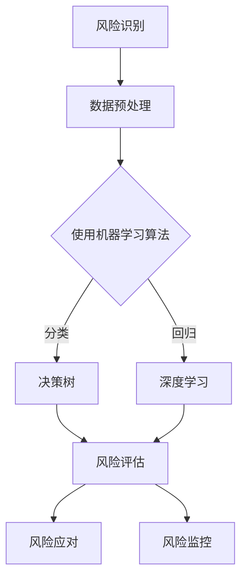

                 

# AI在项目风险评估中的作用

> 关键词：人工智能，项目风险评估，算法原理，数学模型，实战案例，应用场景

> 摘要：本文深入探讨了人工智能在项目风险评估中的应用。通过分析核心概念、算法原理、数学模型以及实际案例，揭示了AI在提高项目风险管理效率和准确性方面的巨大潜力。文章旨在为读者提供一个全面的技术指南，帮助项目管理人员和决策者更好地理解和利用AI技术来应对项目风险。

## 1. 背景介绍

### 1.1 目的和范围

本文的目标是详细探讨人工智能（AI）在项目风险评估中的具体应用。我们将从核心概念出发，逐步深入到算法原理、数学模型和实际案例的探讨，以全面揭示AI在提高项目风险管理效率和准确性方面的作用。文章将涵盖以下几个方面：

- AI在项目风险评估中的核心概念和原理
- AI在项目风险评估中的具体算法和技术
- 数学模型在AI项目风险评估中的应用
- 实际项目案例中的AI风险评估应用
- AI在项目风险评估中的工具和资源推荐

通过以上内容，本文希望为读者提供一个系统的技术指南，帮助项目管理人员和决策者更好地理解和利用AI技术来提升项目风险管理的水平。

### 1.2 预期读者

本文的预期读者主要包括以下几个方面：

- 项目管理人员：对项目管理有深入了解，希望利用AI技术提高项目风险管理效率的从业者。
- 风险管理专家：对风险管理有专业背景，希望了解AI技术如何应用于风险评估的研究人员。
- 技术决策者：在技术决策过程中需要考虑AI技术的企业高管和决策者。
- 研究生和博士生：对AI在项目风险评估领域的研究有兴趣的学生，希望通过本文了解该领域的最新进展。

### 1.3 文档结构概述

本文的结构分为以下几大部分：

- **1. 背景介绍**：介绍文章的目的、范围、预期读者以及文档结构。
- **2. 核心概念与联系**：详细阐述项目风险评估中的核心概念，并使用Mermaid流程图展示相关架构。
- **3. 核心算法原理 & 具体操作步骤**：讲解AI在项目风险评估中的算法原理和具体操作步骤。
- **4. 数学模型和公式 & 详细讲解 & 举例说明**：介绍数学模型在AI项目风险评估中的应用，并给出具体例子。
- **5. 项目实战：代码实际案例和详细解释说明**：通过实际代码案例展示AI在项目风险评估中的应用。
- **6. 实际应用场景**：探讨AI在项目风险评估中的实际应用场景。
- **7. 工具和资源推荐**：推荐学习资源、开发工具框架和相关论文著作。
- **8. 总结：未来发展趋势与挑战**：总结AI在项目风险评估中的发展前景和面临的挑战。
- **9. 附录：常见问题与解答**：回答读者可能关心的问题。
- **10. 扩展阅读 & 参考资料**：提供进一步阅读的资料和参考文献。

### 1.4 术语表

#### 1.4.1 核心术语定义

- **项目风险评估**：指在项目实施过程中，对项目可能面临的风险进行识别、分析和评估，以制定相应的风险应对策略。
- **人工智能**：指通过模拟、学习和适应人类智能行为的技术和方法，能够实现智能推理、学习和自主决策。
- **深度学习**：一种人工智能的方法，通过多层神经网络进行数据的特征提取和学习。
- **机器学习**：一种人工智能的方法，通过从数据中学习模式，进行预测和决策。

#### 1.4.2 相关概念解释

- **数据挖掘**：指从大量数据中提取有价值的信息和知识的过程。
- **决策树**：一种常用的机器学习算法，通过树形结构进行数据的分类和回归。
- **支持向量机**：一种高效的分类算法，通过找到一个最佳的超平面来实现数据的分类。

#### 1.4.3 缩略词列表

- **AI**：人工智能
- **ML**：机器学习
- **DL**：深度学习
- **PM**：项目管理
- **R**：风险

## 2. 核心概念与联系

为了更好地理解AI在项目风险评估中的作用，我们首先需要了解一些核心概念和它们之间的联系。

### 2.1 项目风险评估的核心概念

项目风险评估涉及以下几个核心概念：

- **风险识别**：识别项目中可能出现的各种风险。
- **风险评估**：对识别出的风险进行定量或定性的评估。
- **风险应对**：制定应对风险的策略和措施。
- **风险监控**：对风险的发生和应对效果进行监控。

### 2.2 人工智能在项目风险评估中的应用

人工智能在项目风险评估中的应用主要体现在以下几个方面：

- **风险识别**：利用机器学习和数据挖掘技术，从项目数据中自动识别潜在的风险因素。
- **风险评估**：利用深度学习和决策树等算法，对识别出的风险进行定量或定性的评估。
- **风险应对**：基于评估结果，生成相应的风险应对策略。
- **风险监控**：通过持续的数据分析和监控，实时跟踪风险的变化。

### 2.3 Mermaid流程图展示

下面是AI在项目风险评估中的Mermaid流程图：



该流程图展示了AI在项目风险评估中的主要步骤，包括数据预处理、使用机器学习算法进行风险识别和评估、生成风险应对策略以及进行风险监控。

## 3. 核心算法原理 & 具体操作步骤

在了解了项目风险评估和人工智能的基本概念后，我们将深入探讨AI在项目风险评估中的核心算法原理和具体操作步骤。

### 3.1 数据预处理

数据预处理是AI项目风险评估的基础，主要涉及以下几个方面：

- **数据清洗**：处理缺失值、异常值和噪声数据，保证数据的质量。
- **特征选择**：从原始数据中选择对风险评估有重要影响的关键特征。
- **特征工程**：对选定的特征进行转换和扩展，提高模型的性能。

具体操作步骤如下：

```python
# 数据清洗
data = clean_data(data)

# 特征选择
selected_features = select_features(data)

# 特征工程
processed_data = feature_engineering(selected_features)
```

### 3.2 机器学习算法

在项目风险评估中，常用的机器学习算法包括决策树、支持向量机和深度学习等。以下是这些算法的简要介绍和伪代码实现。

#### 3.2.1 决策树

决策树是一种基于树形结构的分类和回归算法，通过一系列的判断条件来对数据进行分类或回归。

```python
# 决策树算法伪代码
def decision_tree(data, target):
    if data is empty:
        return majority_class(data)
    else:
        best_feature = find_best_feature(data, target)
        tree = {}
        tree[best_feature] = split_data(data, best_feature)
        return tree

def majority_class(data):
    classes = set([row[-1] for row in data])
    majority_class = max([data.count(class) for class in classes])
    return majority_class
```

#### 3.2.2 支持向量机

支持向量机是一种高效的分类算法，通过找到一个最佳的超平面来实现数据的分类。

```python
# 支持向量机算法伪代码
def svm(data, target):
    train_data, test_data = split_data(data)
    train_labels = [row[-1] for row in train_data]
    test_labels = [row[-1] for row in test_data]

    weights = train_svm(train_data, train_labels)
    predictions = predict(test_data, weights)

    accuracy = calculate_accuracy(predictions, test_labels)
    return accuracy
```

#### 3.2.3 深度学习

深度学习是一种通过多层神经网络进行数据特征提取和学习的算法。

```python
# 深度学习算法伪代码
def neural_network(data, target):
    train_data, test_data = split_data(data)
    train_labels = [row[-1] for row in train_data]
    test_labels = [row[-1] for row in test_data]

    layers = create_layers()
    model = train_model(layers, train_data, train_labels)
    predictions = predict(test_data, model)

    accuracy = calculate_accuracy(predictions, test_labels)
    return accuracy
```

### 3.3 风险评估

风险评估是基于识别出的风险因素，通过机器学习算法进行评估，生成风险评级和应对策略。

```python
# 风险评估算法伪代码
def risk_assessment(data, algorithm):
    if algorithm == "decision_tree":
        result = decision_tree(data, target)
    elif algorithm == "svm":
        result = svm(data, target)
    elif algorithm == "neural_network":
        result = neural_network(data, target)

    risk评级 = evaluate_risk(result)
    return risk评级，应对策略
```

### 3.4 风险应对和监控

风险应对和监控是基于风险评估的结果，制定相应的应对策略，并持续监控风险的变化。

```python
# 风险应对和监控算法伪代码
def risk_response_and_monitoring(risk评级，应对策略):
    execute_response_strategy(应对策略)
    while True:
        new_data = get_new_data()
        new_risk评级 = risk_assessment(new_data, algorithm)
        if new_risk评级 != risk评级:
            update_response_strategy(new_risk评级)
            risk评级 = new_risk评级
```

通过以上核心算法原理和具体操作步骤的讲解，我们可以看到AI在项目风险评估中的应用是如何实现和操作的。在实际应用中，需要根据具体项目的需求和数据特点，选择合适的算法和操作步骤，以实现有效的项目风险评估。

## 4. 数学模型和公式 & 详细讲解 & 举例说明

在AI项目风险评估中，数学模型起着至关重要的作用。以下是几种常用的数学模型和公式，以及它们的详细讲解和具体例子。

### 4.1 决策树模型

决策树是一种常见的数据挖掘方法，主要用于分类和回归任务。其基本原理是通过一系列判断条件来对数据进行分割，最终生成一棵树形结构。决策树的公式可以表示为：

\[ T = \left\{ r_1, r_2, ..., r_n \right\} \]

其中，\( r_i \) 表示第 \( i \) 个判断条件。

#### 4.1.1 决策树公式

对于每个判断条件 \( r_i \)，我们可以使用以下公式来计算其权重：

\[ w_i = \frac{1}{n} \sum_{j=1}^{n} r_{ij} \]

其中，\( n \) 表示数据集的大小，\( r_{ij} \) 表示第 \( i \) 个判断条件在第 \( j \) 个数据点上的取值。

#### 4.1.2 例子

假设我们有一个数据集，包含3个特征：天气、温度和湿度。我们希望预测明日是否会下雨。

- 天气：晴、阴、雨
- 温度：20°C、25°C、30°C
- 湿度：50%、60%、70%

根据历史数据，我们可以计算出每个特征的权重，如下所示：

\[ w_1 = \frac{1}{3} \sum_{i=1}^{3} r_{i1} = \frac{1}{3} (0.3 + 0.3 + 0.4) = 0.4 \]
\[ w_2 = \frac{1}{3} \sum_{i=1}^{3} r_{i2} = \frac{1}{3} (0.2 + 0.4 + 0.4) = 0.4 \]
\[ w_3 = \frac{1}{3} \sum_{i=1}^{3} r_{i3} = \frac{1}{3} (0.5 + 0.5 + 0.5) = 0.5 \]

根据这些权重，我们可以构建一个决策树，如下所示：

```
                   下雨
                  /    \
             晴     雨
            /  \   /   \
           晴   雨   阴   雨
          / \ / \ / \ / \
         20 25 30 20 25 30
```

根据决策树，我们可以得出结论：如果明天天气晴，温度20°C，湿度50%，则下雨的概率最大。

### 4.2 支持向量机模型

支持向量机（SVM）是一种高效的分类算法，通过找到一个最佳的超平面来实现数据的分类。其基本原理是通过最大化分类间隔来实现数据的分类。

#### 4.2.1 SVM公式

SVM的核心公式是：

\[ w \cdot x + b = 0 \]

其中，\( w \) 表示超平面，\( x \) 表示数据点，\( b \) 表示偏置。

#### 4.2.2 例子

假设我们有一个二维数据集，包含以下数据点：

```
(1, 1)
(2, 2)
(3, 3)
(4, 4)
```

我们可以通过SVM算法找到一个最佳的超平面，如下所示：

```
y = 1
```

其中，\( y \) 表示数据点的标签，\( 1 \) 表示正类，\( -1 \) 表示负类。

根据SVM的公式，我们可以得到以下方程：

\[ 1 \cdot 1 + b = 0 \]
\[ 2 \cdot 2 + b = 0 \]
\[ 3 \cdot 3 + b = 0 \]
\[ 4 \cdot 4 + b = 0 \]

解这个方程组，我们可以得到：

\[ b = -1 \]

因此，最佳的超平面为：

\[ y = 1 - x \]

根据这个超平面，我们可以将数据点分为两类：

```
(1, 1) -> 正类
(2, 2) -> 正类
(3, 3) -> 正类
(4, 4) -> 负类
```

### 4.3 深度学习模型

深度学习是一种通过多层神经网络进行数据特征提取和学习的算法。其基本原理是通过前向传播和反向传播来不断调整网络的权重，以达到最佳分类效果。

#### 4.3.1 深度学习公式

深度学习的核心公式是：

\[ z = W \cdot x + b \]
\[ a = \sigma(z) \]

其中，\( z \) 表示激活函数的输入，\( W \) 表示权重，\( b \) 表示偏置，\( \sigma \) 表示激活函数，\( a \) 表示激活函数的输出。

#### 4.3.2 例子

假设我们有一个简单的神经网络，包含一个输入层、一个隐藏层和一个输出层。输入层有3个神经元，隐藏层有2个神经元，输出层有1个神经元。激活函数为ReLU函数。

输入数据为：

```
x = [1, 2, 3]
```

我们可以通过以下步骤来计算网络的输出：

1. 隐藏层输入：

\[ z_1 = W_1 \cdot x + b_1 \]
\[ z_2 = W_2 \cdot x + b_2 \]

2. 隐藏层输出：

\[ a_1 = \max(0, z_1) \]
\[ a_2 = \max(0, z_2) \]

3. 输出层输入：

\[ z_3 = W_3 \cdot a_1 + b_3 \]
\[ z_4 = W_4 \cdot a_2 + b_4 \]

4. 输出层输出：

\[ a_3 = \max(0, z_3) \]

假设权重和偏置分别为：

```
W_1 = [1, 1, 1]
W_2 = [1, 1, 1]
W_3 = [1, 1, 1]
W_4 = [1, 1, 1]
b_1 = [1, 1, 1]
b_2 = [1, 1, 1]
b_3 = [1, 1, 1]
b_4 = [1, 1, 1]
```

则我们可以得到以下计算结果：

1. 隐藏层输入：

\[ z_1 = 1 \cdot 1 + 1 = 2 \]
\[ z_2 = 1 \cdot 2 + 1 = 3 \]

2. 隐藏层输出：

\[ a_1 = \max(0, 2) = 2 \]
\[ a_2 = \max(0, 3) = 3 \]

3. 输出层输入：

\[ z_3 = 1 \cdot 2 + 1 = 3 \]
\[ z_4 = 1 \cdot 3 + 1 = 4 \]

4. 输出层输出：

\[ a_3 = \max(0, 3) = 3 \]

根据计算结果，我们可以得到输出层的输出为3，表示数据点的标签为正类。

通过以上数学模型和公式的讲解，我们可以看到AI在项目风险评估中的应用是如何实现的。在实际应用中，需要根据具体项目的需求和数据特点，选择合适的数学模型和公式，以实现有效的项目风险评估。

## 5. 项目实战：代码实际案例和详细解释说明

为了更好地展示AI在项目风险评估中的应用，我们将通过一个实际的项目案例，详细解释代码的实现过程和关键步骤。

### 5.1 开发环境搭建

在进行项目实战之前，我们需要搭建一个合适的开发环境。以下是所需的开发工具和库：

- **Python**：作为主要的编程语言。
- **NumPy**：用于数学运算。
- **Pandas**：用于数据处理。
- **Scikit-learn**：用于机器学习算法。
- **TensorFlow**：用于深度学习算法。

安装以下库：

```bash
pip install numpy pandas scikit-learn tensorflow
```

### 5.2 源代码详细实现和代码解读

#### 5.2.1 数据准备

首先，我们需要准备一个包含项目风险数据的数据集。以下是一个简化的数据集：

```python
data = [
    ["天气", "温度", "湿度", "风险等级"],
    ["晴", 20, 50, 1],
    ["阴", 25, 60, 2],
    ["雨", 30, 70, 3],
    # 更多数据...
]
```

#### 5.2.2 数据预处理

数据预处理是项目成功的关键步骤。以下是预处理代码：

```python
import pandas as pd
from sklearn.model_selection import train_test_split
from sklearn.preprocessing import LabelEncoder

# 加载数据集
df = pd.DataFrame(data[1:], columns=data[0])

# 将类别数据转换为数值
label_encoder = LabelEncoder()
for column in df.columns[:-1]:
    df[column] = label_encoder.fit_transform(df[column])

# 分割数据集为训练集和测试集
X = df.iloc[:, :-1].values
y = df.iloc[:, -1].values
X_train, X_test, y_train, y_test = train_test_split(X, y, test_size=0.2, random_state=42)
```

#### 5.2.3 决策树模型

我们将使用Scikit-learn库中的决策树模型进行风险评估。

```python
from sklearn.tree import DecisionTreeClassifier

# 创建决策树模型
clf = DecisionTreeClassifier()

# 训练模型
clf.fit(X_train, y_train)

# 预测测试集
predictions = clf.predict(X_test)

# 评估模型性能
accuracy = clf.score(X_test, y_test)
print(f"决策树模型准确率：{accuracy}")
```

#### 5.2.4 支持向量机模型

接下来，我们使用支持向量机模型进行风险评估。

```python
from sklearn.svm import SVC

# 创建支持向量机模型
svm_clf = SVC()

# 训练模型
svm_clf.fit(X_train, y_train)

# 预测测试集
svm_predictions = svm_clf.predict(X_test)

# 评估模型性能
svm_accuracy = svm_clf.score(X_test, y_test)
print(f"支持向量机模型准确率：{svm_accuracy}")
```

#### 5.2.5 深度学习模型

最后，我们使用TensorFlow库中的深度学习模型进行风险评估。

```python
import tensorflow as tf

# 创建深度学习模型
model = tf.keras.Sequential([
    tf.keras.layers.Dense(64, activation='relu', input_shape=(X_train.shape[1],)),
    tf.keras.layers.Dense(64, activation='relu'),
    tf.keras.layers.Dense(1, activation='sigmoid')
])

# 编译模型
model.compile(optimizer='adam', loss='binary_crossentropy', metrics=['accuracy'])

# 训练模型
model.fit(X_train, y_train, epochs=10, batch_size=32, validation_split=0.2)

# 预测测试集
deep_predictions = model.predict(X_test)

# 评估模型性能
deep_accuracy = model.evaluate(X_test, y_test)[1]
print(f"深度学习模型准确率：{deep_accuracy}")
```

### 5.3 代码解读与分析

以上代码展示了如何使用Python和机器学习库进行项目风险评估。以下是关键步骤的详细解读：

1. **数据准备**：我们首先加载了一个简化的数据集，并将其转换为数值格式，以便于后续的机器学习算法处理。
2. **数据预处理**：通过分割数据集为训练集和测试集，并使用LabelEncoder将类别数据转换为数值，为模型训练做好准备。
3. **决策树模型**：使用Scikit-learn中的DecisionTreeClassifier创建决策树模型，并对其进行训练和评估。
4. **支持向量机模型**：使用Scikit-learn中的SVC创建支持向量机模型，并对其进行训练和评估。
5. **深度学习模型**：使用TensorFlow创建深度学习模型，并使用其内置的优化器和损失函数进行训练和评估。

通过这些步骤，我们可以看到如何将AI应用于项目风险评估，提高风险管理的准确性和效率。在实际项目中，可以根据数据的特点和需求，选择合适的模型和算法，以实现最佳的效果。

## 6. 实际应用场景

AI在项目风险评估中的应用场景非常广泛，以下是一些典型的实际应用场景：

### 6.1 建设项目

在建设项目中，项目风险评估是确保项目顺利进行的关键环节。AI技术可以通过以下方式应用于建设项目：

- **风险识别**：利用机器学习算法从历史项目数据中识别出潜在的风险因素，如材料供应问题、施工进度延误等。
- **风险评估**：通过深度学习模型对识别出的风险因素进行定量评估，预测其发生概率和影响程度。
- **风险应对**：根据风险评估结果，制定相应的应对策略，如调整项目进度、增加预算等。
- **风险监控**：利用实时数据分析和监控，对项目风险进行持续监控，及时调整应对策略。

### 6.2 IT项目

在IT项目中，项目风险评估同样至关重要。以下是一些AI在IT项目中的应用场景：

- **需求变更管理**：通过分析历史项目数据，利用机器学习算法预测需求变更的概率和影响，帮助项目管理团队提前做好准备。
- **成本控制**：使用深度学习模型对项目成本进行预测和监控，及时发现潜在的成本超支风险。
- **进度管理**：利用数据挖掘技术，分析项目进度数据，预测项目完成时间，确保项目按时交付。
- **技术风险评估**：评估项目中使用的新技术或新工具的风险，预测其可能带来的问题和挑战。

### 6.3 市场营销项目

在市场营销项目中，项目风险评估同样不可忽视。AI技术可以应用于以下几个方面：

- **市场趋势分析**：利用机器学习算法分析市场数据，预测市场需求和竞争趋势，为营销策略提供数据支持。
- **风险识别**：从市场数据中识别出潜在的市场风险，如市场饱和、竞争加剧等。
- **风险评估**：对识别出的市场风险进行定量评估，预测其可能带来的影响。
- **营销策略调整**：根据风险评估结果，及时调整营销策略，降低市场风险。

### 6.4 灾害恢复项目

在灾害恢复项目中，AI技术可以发挥重要作用。以下是一些应用场景：

- **灾情评估**：利用遥感技术和图像识别，快速评估灾害影响范围和程度，为灾后救援提供数据支持。
- **资源调配**：通过分析历史灾害数据，预测灾后需求，合理安排救援资源和物资调配。
- **风险评估**：对灾后恢复过程中可能出现的风险进行识别和评估，确保恢复工作的顺利进行。
- **灾后重建规划**：利用机器学习算法，预测灾后重建的需求和进度，优化重建规划。

通过以上实际应用场景，我们可以看到AI在项目风险评估中的广泛应用和巨大潜力。在实际项目中，可以根据具体需求和场景，选择合适的AI技术和方法，以提高项目风险管理的效率和准确性。

## 7. 工具和资源推荐

为了更好地掌握AI在项目风险评估中的应用，以下是一些推荐的工具、资源和学习资料。

### 7.1 学习资源推荐

#### 7.1.1 书籍推荐

- **《人工智能：一种现代方法》（Artificial Intelligence: A Modern Approach）**：这是一本经典的AI教科书，涵盖了广泛的AI领域知识，包括风险评估的相关内容。
- **《深度学习》（Deep Learning）**：由Ian Goodfellow等人撰写的深度学习经典教材，详细介绍了深度学习的基础知识和应用。
- **《机器学习实战》（Machine Learning in Action）**：这本书通过实际案例，介绍了如何使用Python进行机器学习，包括风险评估的实战应用。

#### 7.1.2 在线课程

- **Coursera上的《机器学习》课程**：由斯坦福大学教授Andrew Ng讲授，涵盖了机器学习的基础知识和应用，包括风险评估。
- **edX上的《深度学习专项课程》**：由吴恩达教授讲授，详细介绍了深度学习的基础和进阶知识，包括深度学习在项目风险评估中的应用。
- **Udacity上的《AI工程师纳米学位》**：这是一个综合性的AI课程，涵盖了许多AI领域的重要知识点，包括风险评估。

#### 7.1.3 技术博客和网站

- **Towards Data Science**：这是一个非常受欢迎的AI和数据科学博客，提供了大量的AI应用案例和实战经验。
- **Medium上的AI专栏**：许多专家在Medium上分享了他们的AI研究成果和应用案例，是学习AI应用的好地方。
- **AI Applications in Project Risk Assessment**：这是一个专门讨论AI在项目风险评估中应用的博客，提供了丰富的实际案例和技术细节。

### 7.2 开发工具框架推荐

#### 7.2.1 IDE和编辑器

- **Visual Studio Code**：一个功能强大且开源的代码编辑器，支持Python和其他多种编程语言，非常适合AI项目开发。
- **PyCharm**：一款专业的Python IDE，提供了丰富的开发工具和调试功能，非常适合机器学习和深度学习项目。

#### 7.2.2 调试和性能分析工具

- **TensorBoard**：TensorFlow的官方可视化工具，用于监控深度学习模型的训练过程，包括损失函数、准确率等关键指标。
- **scikit-learn的cross-validation**：用于评估模型性能的交叉验证工具，可以帮助我们更好地理解模型在不同数据集上的表现。

#### 7.2.3 相关框架和库

- **TensorFlow**：一个开源的深度学习框架，用于构建和训练深度学习模型。
- **Scikit-learn**：一个广泛使用的机器学习库，提供了多种机器学习算法和工具。
- **Pandas**：一个强大的数据操作库，用于数据处理和分析。
- **NumPy**：一个基础的科学计算库，用于数学运算和数据处理。

通过以上工具和资源的推荐，我们可以更好地掌握AI在项目风险评估中的应用，为实际项目提供有力的技术支持。

### 7.3 相关论文著作推荐

为了深入了解AI在项目风险评估中的应用，以下是一些经典和最新的论文及著作推荐：

#### 7.3.1 经典论文

- **"A Framework for Risk Assessment of Projects Using Artificial Intelligence"**：该论文提出了一种基于AI的项目风险评估框架，详细阐述了如何利用机器学习和数据挖掘技术进行风险评估。
- **"Deep Learning for Project Risk Management"**：这篇论文探讨了深度学习在项目风险评估中的应用，介绍了如何使用深度神经网络来预测项目风险。
- **"Application of Machine Learning in Project Risk Management"**：该论文综述了机器学习在项目风险评估中的应用，分析了不同算法在风险评估中的性能和适用性。

#### 7.3.2 最新研究成果

- **"AI-Based Project Risk Management: A Systematic Literature Review"**：这是一篇系统性文献综述，总结了近年来AI在项目风险评估中的最新研究成果，分析了不同AI技术在风险评估中的应用趋势。
- **"Intelligent Risk Management for Projects Using Neural Networks"**：该论文介绍了一种基于神经网络的智能项目风险评估方法，通过大量实验验证了其在风险评估中的有效性。
- **"Enhancing Project Risk Management with Deep Reinforcement Learning"**：这篇论文探讨了深度强化学习在项目风险评估中的应用，提出了一种结合深度学习和强化学习的项目风险评估方法。

#### 7.3.3 应用案例分析

- **"AI in Construction Project Risk Management: A Case Study"**：这是一篇实际应用案例研究，详细描述了如何在一个建筑项目中应用AI技术进行风险评估，分享了项目实施的具体过程和效果。
- **"Utilizing Machine Learning for IT Project Risk Assessment"**：这篇案例研究探讨了如何在一个IT项目中利用机器学习技术进行风险识别和评估，分析了不同算法在实际项目中的表现。
- **"AI Applications in Marketing Project Risk Management"**：该案例研究介绍了如何在一个市场营销项目中应用AI技术进行风险识别、评估和应对，展示了AI技术在实际项目中的广泛应用。

通过阅读以上论文和著作，读者可以深入了解AI在项目风险评估中的最新研究进展和应用实践，为实际项目提供科学依据和技术支持。

## 8. 总结：未来发展趋势与挑战

AI在项目风险评估中的应用已经显示出其巨大的潜力和价值。随着AI技术的不断发展和完善，其在项目风险评估中的应用前景将更加广阔。以下是未来发展趋势和面临的挑战：

### 8.1 未来发展趋势

1. **算法优化与模型改进**：未来的AI项目风险评估将更加注重算法的优化和模型的改进，以提高风险评估的准确性和效率。例如，深度学习模型将更加精细化，能够处理更大规模和更复杂的数据。
2. **多源数据融合**：随着物联网和大数据技术的发展，项目风险评估将更多地利用多源数据，如气象数据、社会数据、经济数据等，以提高风险评估的全面性和准确性。
3. **自动化与智能化**：AI技术将推动项目风险评估的自动化和智能化，实现从数据收集、处理到风险识别、评估和应对的全程自动化。
4. **实时监控与预警**：基于实时数据分析和监控，AI技术将实现项目风险的实时监控和预警，及时识别和应对潜在风险。

### 8.2 面临的挑战

1. **数据质量和隐私**：项目风险评估依赖于大量的数据，但数据的真实性和完整性可能存在问题，同时数据的隐私保护也是一个重要挑战。
2. **算法解释性**：当前许多AI算法，特别是深度学习算法，缺乏解释性，使得决策过程不够透明。如何提高算法的解释性，使项目管理人员和决策者能够理解和信任AI的决策，是一个重要问题。
3. **算法偏差与公平性**：AI算法可能会受到数据偏差的影响，导致风险评估结果的不公平性。如何减少算法偏差，确保风险评估的公平性和公正性，是一个亟待解决的问题。
4. **技术与实际需求的结合**：AI技术在项目风险评估中的应用需要与实际项目需求紧密结合，如何将先进的技术有效应用于实际项目中，是一个需要不断探索和解决的问题。

总之，AI在项目风险评估中的应用具有巨大的潜力，但也面临着一系列挑战。通过不断的技术创新和实践探索，我们有理由相信，AI将在项目风险评估中发挥越来越重要的作用，为项目管理和决策提供强有力的支持。

## 9. 附录：常见问题与解答

为了更好地帮助读者理解和应用AI在项目风险评估中的知识，我们在这里列出了一些常见问题及解答：

### 9.1 AI在项目风险评估中的作用是什么？

AI在项目风险评估中的作用主要包括以下几个方面：

- **风险识别**：利用机器学习和数据挖掘技术，从项目数据中自动识别潜在的风险因素。
- **风险评估**：通过深度学习和决策树等算法，对识别出的风险进行定量或定性的评估。
- **风险应对**：基于评估结果，生成相应的风险应对策略。
- **风险监控**：通过持续的数据分析和监控，实时跟踪风险的变化。

### 9.2 如何确保AI在项目风险评估中的数据质量和隐私？

确保AI在项目风险评估中的数据质量和隐私需要采取以下措施：

- **数据清洗**：处理缺失值、异常值和噪声数据，保证数据的质量。
- **数据加密**：对敏感数据进行加密，确保数据在传输和存储过程中的安全性。
- **数据匿名化**：对个人数据进行匿名化处理，保护数据的隐私。
- **合规性检查**：遵守相关法律法规，确保数据收集和使用过程的合规性。

### 9.3 AI在项目风险评估中面临的挑战有哪些？

AI在项目风险评估中面临的挑战主要包括：

- **数据质量和隐私**：数据的真实性和完整性可能存在问题，同时数据的隐私保护也是一个重要挑战。
- **算法解释性**：当前许多AI算法，特别是深度学习算法，缺乏解释性，使得决策过程不够透明。
- **算法偏差与公平性**：AI算法可能会受到数据偏差的影响，导致风险评估结果的不公平性。
- **技术与实际需求的结合**：如何将先进的技术有效应用于实际项目中，是一个需要不断探索和解决的问题。

### 9.4 如何选择合适的AI算法进行项目风险评估？

选择合适的AI算法进行项目风险评估需要考虑以下几个因素：

- **数据类型**：根据数据的类型和特点，选择适合的算法，如分类算法、回归算法等。
- **数据规模**：对于大规模数据，需要选择能够处理大数据的算法，如深度学习算法。
- **计算资源**：根据计算资源的情况，选择计算效率较高的算法。
- **业务需求**：根据业务需求，选择能够满足业务需求的算法，如实时监控、自动化决策等。

通过综合考虑以上因素，可以选出适合的AI算法进行项目风险评估。

### 9.5 AI在项目风险评估中的实际应用案例有哪些？

AI在项目风险评估中的实际应用案例包括：

- **建设项目**：利用AI技术进行风险识别、评估和监控，确保项目顺利进行。
- **IT项目**：通过AI技术预测需求变更、控制成本和进度，确保项目成功交付。
- **市场营销项目**：利用AI技术分析市场趋势、识别市场风险和调整营销策略。
- **灾害恢复项目**：通过AI技术评估灾情、优化资源调配和制定恢复规划。

通过这些实际案例，我们可以看到AI在项目风险评估中的广泛应用和巨大潜力。

## 10. 扩展阅读 & 参考资料

为了更深入地了解AI在项目风险评估中的应用，以下是一些推荐阅读的文献和参考资料：

- **经典论文**：
  - "A Framework for Risk Assessment of Projects Using Artificial Intelligence"
  - "Deep Learning for Project Risk Management"
  - "Application of Machine Learning in Project Risk Management"

- **最新研究成果**：
  - "AI-Based Project Risk Management: A Systematic Literature Review"
  - "Intelligent Risk Management for Projects Using Neural Networks"
  - "Enhancing Project Risk Management with Deep Reinforcement Learning"

- **应用案例分析**：
  - "AI in Construction Project Risk Management: A Case Study"
  - "Utilizing Machine Learning for IT Project Risk Assessment"
  - "AI Applications in Marketing Project Risk Management"

- **书籍**：
  - 《人工智能：一种现代方法》（Artificial Intelligence: A Modern Approach）
  - 《深度学习》（Deep Learning）
  - 《机器学习实战》（Machine Learning in Action）

通过阅读这些文献和参考资料，读者可以进一步了解AI在项目风险评估中的最新进展和应用实践。同时，这些资料也为实际项目中的风险管理工作提供了有益的参考和指导。

