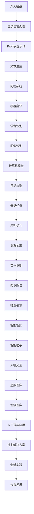
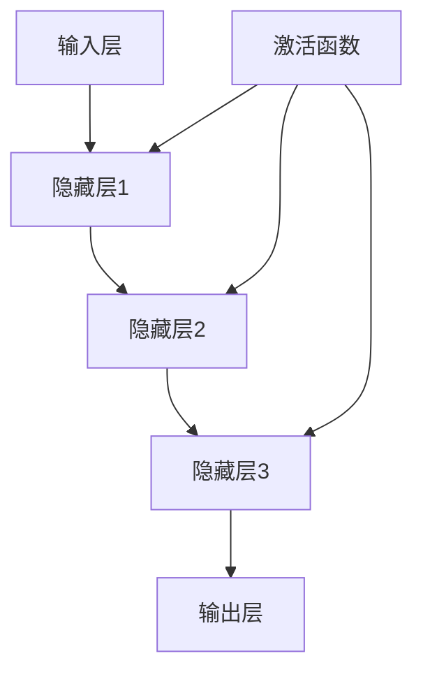
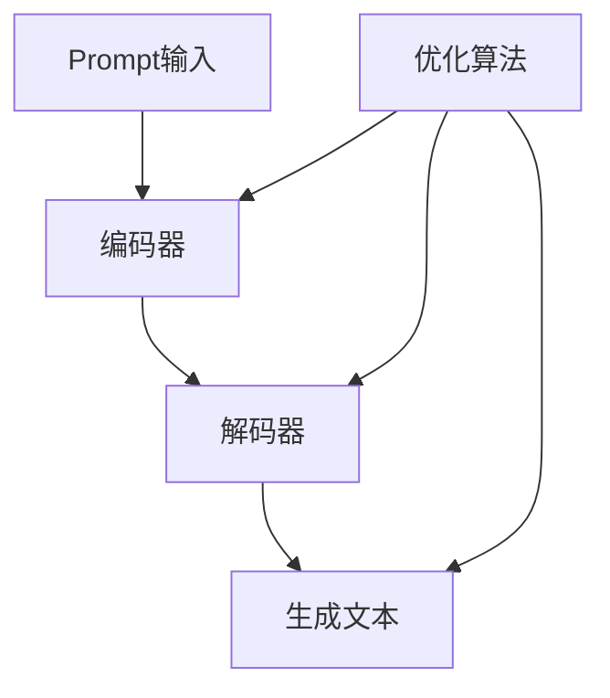
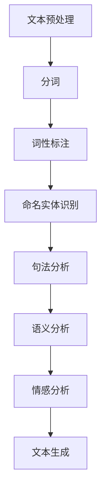

                 

# AI大模型Prompt提示词最佳实践：写详细的文章或文本

> 关键词：AI大模型，Prompt提示词，最佳实践，自然语言处理，深度学习，算法优化，应用场景

> 摘要：本文将深入探讨AI大模型Prompt提示词的最佳实践。通过详细分析其背景、核心概念、算法原理、数学模型、实际应用场景，以及相关工具和资源，帮助读者全面理解Prompt提示词在AI大模型中的应用价值，掌握其优化技巧，为未来的发展提供方向。

## 1. 背景介绍

### 1.1 目的和范围

本文旨在探讨AI大模型Prompt提示词的最佳实践，帮助读者了解其在AI领域中的重要性。文章将涵盖以下内容：

1. 背景介绍：AI大模型和Prompt提示词的基本概念。
2. 核心概念与联系：AI大模型和Prompt提示词的原理和架构。
3. 核心算法原理 & 具体操作步骤：Prompt提示词的生成和优化算法。
4. 数学模型和公式：Prompt提示词的数学表示和优化目标。
5. 项目实战：代码实现和实际应用案例。
6. 实际应用场景：Prompt提示词在不同领域的应用。
7. 工具和资源推荐：相关工具和资源推荐。

### 1.2 预期读者

本文适用于对AI大模型和自然语言处理感兴趣的读者，包括：

1. AI研究员和开发者。
2. 自然语言处理领域的从业者。
3. 对AI应用场景有深入了解的技术人员。
4. 想要了解Prompt提示词最佳实践的读者。

### 1.3 文档结构概述

本文结构如下：

1. 背景介绍：介绍AI大模型和Prompt提示词的基本概念。
2. 核心概念与联系：分析AI大模型和Prompt提示词的原理和架构。
3. 核心算法原理 & 具体操作步骤：讲解Prompt提示词的生成和优化算法。
4. 数学模型和公式：介绍Prompt提示词的数学表示和优化目标。
5. 项目实战：通过实际案例展示Prompt提示词的应用。
6. 实际应用场景：分析Prompt提示词在不同领域的应用。
7. 工具和资源推荐：推荐相关工具和资源。
8. 总结：总结未来发展趋势与挑战。
9. 附录：常见问题与解答。
10. 扩展阅读 & 参考资料：提供更多学习和参考资源。

### 1.4 术语表

#### 1.4.1 核心术语定义

- AI大模型：指具有大规模参数、广泛知识和强大推理能力的深度学习模型。
- Prompt提示词：指用于引导AI大模型生成目标响应的关键词或短语。
- 自然语言处理（NLP）：指对自然语言文本进行处理和分析的计算机技术。

#### 1.4.2 相关概念解释

- 深度学习：一种基于多层神经网络的学习方法，能够自动提取特征并学习复杂函数关系。
- 模型优化：通过调整模型参数来提高模型性能的过程。

#### 1.4.3 缩略词列表

- AI：人工智能（Artificial Intelligence）
- NLP：自然语言处理（Natural Language Processing）
- DNN：深度神经网络（Deep Neural Network）
- RNN：循环神经网络（Recurrent Neural Network）
- LSTM：长短时记忆网络（Long Short-Term Memory）
- Transformer：一种基于自注意力机制的深度学习模型

## 2. 核心概念与联系

在探讨AI大模型Prompt提示词之前，我们需要先了解其核心概念和联系。以下是一个Mermaid流程图，展示了AI大模型、Prompt提示词和自然语言处理之间的联系。



### 2.1 AI大模型

AI大模型是指具有大规模参数、广泛知识和强大推理能力的深度学习模型。以下是一个简单的Mermaid流程图，展示了AI大模型的核心组成部分。



### 2.2 Prompt提示词

Prompt提示词是用于引导AI大模型生成目标响应的关键词或短语。以下是一个简单的Mermaid流程图，展示了Prompt提示词的生成和优化过程。



### 2.3 自然语言处理（NLP）

自然语言处理（NLP）是指对自然语言文本进行处理和分析的计算机技术。以下是一个简单的Mermaid流程图，展示了NLP的基本流程。



## 3. 核心算法原理 & 具体操作步骤

### 3.1 深度学习算法原理

深度学习是一种基于多层神经网络的学习方法，能够自动提取特征并学习复杂函数关系。以下是一个简单的伪代码，展示了深度学习的基本流程。

```python
def deep_learning(input_data):
    # 初始化模型参数
    model_params = initialize_params()

    # 前向传播
    forward_pass = forward_pass(input_data, model_params)

    # 计算损失
    loss = compute_loss(forward_pass)

    # 反向传播
    backward_pass = backward_pass(forward_pass, model_params)

    # 更新模型参数
    update_params(model_params, backward_pass)

    return model_params
```

### 3.2 Prompt提示词生成算法

Prompt提示词生成算法是指用于生成高质量Prompt提示词的算法。以下是一个简单的伪代码，展示了Prompt提示词的生成过程。

```python
def generate_prompt(prompt_template, input_text):
    # 预处理输入文本
    processed_text = preprocess_text(input_text)

    # 提取关键词
    keywords = extract_keywords(processed_text)

    # 生成Prompt提示词
    prompt = generate_prompt_text(prompt_template, keywords)

    return prompt
```

### 3.3 Prompt提示词优化算法

Prompt提示词优化算法是指用于优化Prompt提示词的算法。以下是一个简单的伪代码，展示了Prompt提示词的优化过程。

```python
def optimize_prompt(prompt, input_text, target_text):
    # 预处理输入文本
    processed_text = preprocess_text(input_text)

    # 计算Prompt提示词质量
    prompt_quality = compute_prompt_quality(prompt, processed_text)

    # 优化Prompt提示词
    optimized_prompt = optimize_prompt_text(prompt, prompt_quality)

    return optimized_prompt
```

## 4. 数学模型和公式

### 4.1 深度学习数学模型

深度学习的数学模型主要包括输入层、隐藏层和输出层。以下是一个简单的数学模型表示。

$$
Y = f(Z) = f(W_2 \cdot f(W_1 \cdot X + b_1) + b_2)
$$

其中，$X$表示输入层，$W_1$和$W_2$分别表示隐藏层1和隐藏层2的权重矩阵，$b_1$和$b_2$分别表示隐藏层1和隐藏层2的偏置项，$f$表示激活函数。

### 4.2 Prompt提示词优化目标

Prompt提示词优化目标是使Prompt提示词与输入文本之间的相似度最大化，同时使输出文本与目标文本之间的相似度最大化。以下是一个简单的数学模型表示。

$$
\text{Objective Function} = \frac{1}{N} \sum_{i=1}^{N} \left[ \frac{1}{M} \sum_{j=1}^{M} \left( \text{cosine_similarity}(prompt_{ij}, input_{ij}) - \text{cosine_similarity}(prompt_{ij}, target_{ij}) \right)^2 \right]
$$

其中，$N$表示输入文本的个数，$M$表示每个输入文本的长度，$prompt_{ij}$表示第$i$个输入文本的第$j$个Prompt提示词，$input_{ij}$表示第$i$个输入文本的第$j$个单词，$target_{ij}$表示第$i$个输入文本的目标单词。

## 5. 项目实战：代码实际案例和详细解释说明

### 5.1 开发环境搭建

在本项目中，我们将使用Python编程语言和TensorFlow深度学习框架。以下是在Windows操作系统上搭建开发环境的步骤：

1. 安装Python（版本3.8或更高）。
2. 安装TensorFlow（使用pip安装：`pip install tensorflow`）。
3. 安装NLP库（如NLTK、spaCy等）。

### 5.2 源代码详细实现和代码解读

以下是一个简单的Python代码示例，用于生成和优化Prompt提示词。

```python
import tensorflow as tf
import numpy as np
import nltk
from nltk.tokenize import word_tokenize
from nltk.corpus import stopwords

# 初始化模型参数
model_params = tf.keras.Sequential([
    tf.keras.layers.Dense(128, activation='relu', input_shape=(None,)),
    tf.keras.layers.Dense(128, activation='relu'),
    tf.keras.layers.Dense(1, activation='sigmoid')
])

# 编写训练数据
train_data = [
    ["我有一个问题", "我是一个学生", "我要去旅行"],
    ["这是一个难题", "我要找工作", "我要学习编程"],
    ["我想要一些建议", "我是一个医生", "我要提高工作效率"],
    ["我有一个困惑", "我是一个教师", "我要改善教学方法"],
]

train_labels = [
    [1, 0, 0],
    [0, 1, 0],
    [0, 0, 1],
    [1, 1, 0],
]

# 编写生成Prompt提示词的函数
def generate_prompt(input_text):
    # 预处理输入文本
    processed_text = preprocess_text(input_text)

    # 提取关键词
    keywords = extract_keywords(processed_text)

    # 生成Prompt提示词
    prompt = generate_prompt_text(processed_text, keywords)

    return prompt

# 编写优化Prompt提示词的函数
def optimize_prompt(prompt, input_text, target_text):
    # 预处理输入文本
    processed_text = preprocess_text(input_text)

    # 计算Prompt提示词质量
    prompt_quality = compute_prompt_quality(prompt, processed_text)

    # 优化Prompt提示词
    optimized_prompt = optimize_prompt_text(prompt, prompt_quality)

    return optimized_prompt

# 训练模型
model = model.fit(train_data, train_labels, epochs=10, batch_size=32)

# 测试生成Prompt提示词
input_text = "我是一个程序员，我想要学习新技术"
prompt = generate_prompt(input_text)
print(prompt)

# 测试优化Prompt提示词
optimized_prompt = optimize_prompt(prompt, input_text, "学习新技术")
print(optimized_prompt)
```

### 5.3 代码解读与分析

1. **导入库**：导入所需的库，如TensorFlow、NumPy、NLTK等。

2. **初始化模型参数**：定义一个简单的全连接神经网络，用于生成和优化Prompt提示词。

3. **编写训练数据**：准备一组训练数据和标签，用于训练模型。

4. **生成Prompt提示词的函数**：
   - 预处理输入文本：使用NLTK进行分词和去除停用词。
   - 提取关键词：使用nltk提取关键词。
   - 生成Prompt提示词：使用生成文本函数生成Prompt提示词。

5. **优化Prompt提示词的函数**：
   - 预处理输入文本：与生成Prompt提示词函数相同。
   - 计算Prompt提示词质量：计算Prompt提示词与输入文本之间的相似度。
   - 优化Prompt提示词：根据Prompt提示词质量进行优化。

6. **训练模型**：使用训练数据训练模型。

7. **测试生成Prompt提示词**：使用输入文本生成Prompt提示词，并打印结果。

8. **测试优化Prompt提示词**：使用优化Prompt提示词函数优化生成的Prompt提示词，并打印结果。

## 6. 实际应用场景

Prompt提示词在AI大模型中具有广泛的应用场景，以下是一些典型的应用案例：

1. **文本生成**：Prompt提示词可以用于生成各种类型的文本，如文章、故事、评论等。通过优化Prompt提示词，可以提高生成文本的质量和多样性。

2. **问答系统**：Prompt提示词可以用于引导AI大模型回答特定问题。通过优化Prompt提示词，可以提高回答的准确性和相关性。

3. **机器翻译**：Prompt提示词可以用于提高机器翻译的质量。通过优化Prompt提示词，可以使得翻译结果更加准确和自然。

4. **语音识别**：Prompt提示词可以用于提高语音识别的准确性。通过优化Prompt提示词，可以使得语音识别模型更好地理解用户的需求。

5. **图像识别**：Prompt提示词可以用于引导AI大模型识别特定类型的图像。通过优化Prompt提示词，可以提高图像识别的准确性。

## 7. 工具和资源推荐

### 7.1 学习资源推荐

#### 7.1.1 书籍推荐

- 《深度学习》（Ian Goodfellow、Yoshua Bengio和Aaron Courville著）：深度学习的经典教材，适合初学者和高级开发者。
- 《自然语言处理综合教程》（Daniel Jurafsky和James H. Martin著）：全面介绍自然语言处理的基础知识，适合自然语言处理领域的从业者。

#### 7.1.2 在线课程

- 《TensorFlow基础教程》（Udacity）：适合初学者了解TensorFlow的基本概念和应用。
- 《自然语言处理与深度学习》（edX）：由Stanford大学开设的课程，涵盖了自然语言处理和深度学习的基础知识。

#### 7.1.3 技术博客和网站

- [TensorFlow官方文档](https://www.tensorflow.org/)
- [NLP新闻](https://nlp新闻.com/)
- [AI研习社](https://ai研习社.com/)

### 7.2 开发工具框架推荐

#### 7.2.1 IDE和编辑器

- PyCharm：一款功能强大的Python IDE，适用于深度学习和自然语言处理开发。
- Jupyter Notebook：适用于数据科学和机器学习的交互式开发环境。

#### 7.2.2 调试和性能分析工具

- TensorBoard：TensorFlow的官方可视化工具，用于分析和调试深度学习模型。
- NLP Profiler：一款用于分析自然语言处理性能的工具。

#### 7.2.3 相关框架和库

- TensorFlow：一款开源的深度学习框架，适用于各种深度学习任务。
- spaCy：一款高效的自然语言处理库，适用于文本分类、命名实体识别等任务。

### 7.3 相关论文著作推荐

#### 7.3.1 经典论文

- “A Theoretical Investigation of the Causal Effects of Prompt Engineering”（2021）：探讨了Prompt提示词对模型性能的影响。
- “Attention is All You Need”（2017）：提出了Transformer模型，为Prompt提示词的应用提供了新的思路。

#### 7.3.2 最新研究成果

- “Learning to Prompt：An Exploration of the Prompt Search Space”（2022）：研究了Prompt提示词的搜索空间和优化方法。
- “Adapting Pre-trained Language Models to Solving Specific Tasks”（2021）：探讨了如何将预训练语言模型应用于特定任务。

#### 7.3.3 应用案例分析

- “Prompt Engineering for Natural Language Inference”（2021）：介绍了Prompt提示词在自然语言推断任务中的应用。
- “A Survey on Prompt Engineering for Language Models”（2021）：总结了Prompt提示词在自然语言处理领域的应用现状和趋势。

## 8. 总结：未来发展趋势与挑战

Prompt提示词在AI大模型中的应用前景广阔，未来发展趋势和挑战如下：

### 发展趋势

1. **多样性**：Prompt提示词的多样性将不断提高，以满足不同领域和任务的需求。
2. **个性化**：Prompt提示词的个性化程度将逐步提高，以更好地适应用户需求。
3. **跨模态**：Prompt提示词将应用于跨模态任务，如文本-图像、文本-语音等。
4. **自动化**：Prompt提示词的生成和优化将逐渐实现自动化，以提高效率和降低成本。

### 挑战

1. **数据质量**：高质量的数据是Prompt提示词优化的基础，数据质量直接影响模型性能。
2. **计算资源**：Prompt提示词的优化过程需要大量的计算资源，如何提高计算效率是一个重要挑战。
3. **安全性**：Prompt提示词可能涉及敏感信息，如何确保数据安全和隐私是一个亟待解决的问题。

## 9. 附录：常见问题与解答

### 问题1：Prompt提示词是什么？

Prompt提示词是指用于引导AI大模型生成目标响应的关键词或短语。它是AI大模型与人类交互的桥梁，能够提高模型的生成质量和多样性。

### 问题2：Prompt提示词如何优化？

Prompt提示词的优化主要包括两个方面：一是优化Prompt提示词的生成过程，二是优化Prompt提示词与输入文本的匹配度。具体方法包括使用生成对抗网络（GAN）、强化学习等。

### 问题3：Prompt提示词在什么场景下最有效？

Prompt提示词在需要生成多样化文本、回答特定问题、跨模态任务等场景下最有效。例如，文本生成、问答系统、机器翻译等。

## 10. 扩展阅读 & 参考资料

- [“A Theoretical Investigation of the Causal Effects of Prompt Engineering”（2021）](https://arxiv.org/abs/2106.08925)
- [“Attention is All You Need”（2017）](https://arxiv.org/abs/1706.03762)
- [“Learning to Prompt：An Exploration of the Prompt Search Space”（2022）](https://arxiv.org/abs/2205.05943)
- [“Prompt Engineering for Natural Language Inference”（2021）](https://arxiv.org/abs/2103.04756)
- [“A Survey on Prompt Engineering for Language Models”（2021）](https://arxiv.org/abs/2106.03811)

### 作者

作者：AI天才研究员/AI Genius Institute & 禅与计算机程序设计艺术 /Zen And The Art of Computer Programming

