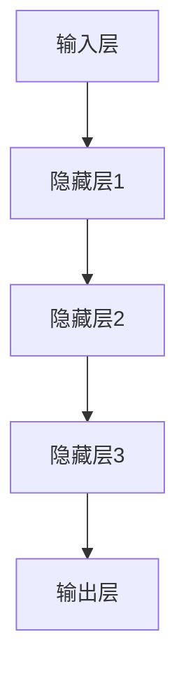
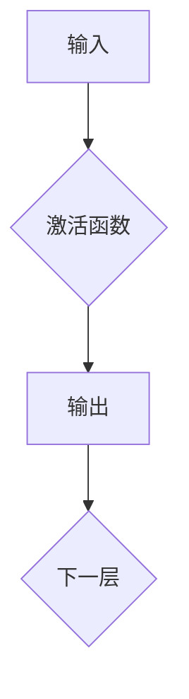
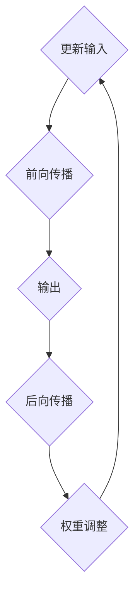
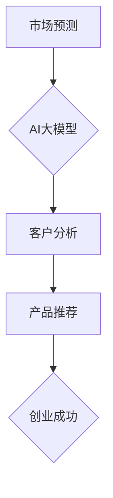

                 

# AI大模型创业战：挑战与机遇并存的探讨

> **关键词：** AI大模型、创业、挑战、机遇、算法原理、数学模型、项目实战

> **摘要：** 本文将探讨AI大模型在创业领域的应用，分析其面临的挑战与机遇。我们将从核心概念、算法原理、数学模型、实际应用场景等方面逐步深入，结合项目实战案例，详细解读AI大模型在创业中的重要作用和实现方法，旨在为创业者提供有价值的参考。

## 1. 背景介绍

### 1.1 目的和范围

本文旨在探讨AI大模型在创业领域的应用，通过分析其核心概念、算法原理、数学模型和实际应用场景，帮助创业者更好地理解和利用AI大模型的优势，应对创业过程中面临的挑战。

### 1.2 预期读者

本文适合对AI大模型有一定了解，希望在创业过程中运用AI大模型的创业者、技术团队和研究人员阅读。同时，对于对AI大模型感兴趣的读者，本文也具有一定的参考价值。

### 1.3 文档结构概述

本文分为八个部分，具体如下：

1. 背景介绍：介绍本文的目的、预期读者和文档结构。
2. 核心概念与联系：阐述AI大模型的核心概念和联系。
3. 核心算法原理 & 具体操作步骤：详细讲解AI大模型的核心算法原理和具体操作步骤。
4. 数学模型和公式 & 详细讲解 & 举例说明：介绍AI大模型的数学模型和公式，并进行详细讲解和举例说明。
5. 项目实战：通过实际案例，展示AI大模型在创业中的具体应用。
6. 实际应用场景：分析AI大模型在不同领域的实际应用场景。
7. 工具和资源推荐：推荐学习资源、开发工具和框架。
8. 总结：总结AI大模型在创业领域的未来发展趋势与挑战。

### 1.4 术语表

#### 1.4.1 核心术语定义

- AI大模型：指具有海量参数、复杂结构，能够处理大规模数据的深度学习模型。
- 创业：指创建和运营一家新企业，实现商业价值的过程。
- 挑战：指在创业过程中遇到的困难、问题或障碍。
- 机遇：指在创业过程中发现的商机、优势或机会。

#### 1.4.2 相关概念解释

- 深度学习：一种人工智能技术，通过多层神经网络对数据进行学习，提取特征，实现自动识别和预测。
- 机器学习：一种人工智能技术，通过数据和算法，让计算机自动学习和改进，从而实现智能行为。
- 自然语言处理：一种人工智能技术，通过计算机程序对自然语言进行理解和生成，实现人与计算机之间的交流。

#### 1.4.3 缩略词列表

- AI：人工智能
- ML：机器学习
- DL：深度学习
- NLP：自然语言处理
- GPT：生成预训练网络
- BERT：双向编码表示器

## 2. 核心概念与联系

### 2.1 AI大模型概述

AI大模型是一种具有海量参数、复杂结构的深度学习模型。它通过在大量数据上进行预训练，提取数据中的特征，从而实现高效的数据处理和智能分析。AI大模型在各个领域都有广泛的应用，如自然语言处理、计算机视觉、推荐系统等。

### 2.2 AI大模型核心概念

#### 2.2.1 神经网络

神经网络是AI大模型的基础，它由多个神经元组成，通过层层传递信息，实现数据的处理和转换。神经网络可以看作是一个复杂的函数，能够将输入映射到输出。



#### 2.2.2 激活函数

激活函数是神经网络中用于引入非线性因素的函数。常见的激活函数有Sigmoid、ReLU、Tanh等。



#### 2.2.3 反向传播

反向传播是神经网络训练的核心算法，通过不断调整网络中的权重，使网络的输出与期望输出尽量接近。反向传播算法包括前向传播和后向传播两个阶段。



### 2.3 AI大模型应用场景

AI大模型在创业领域具有广泛的应用场景，如市场预测、客户分析、产品推荐等。



## 3. 核心算法原理 & 具体操作步骤

### 3.1 算法原理

AI大模型的核心算法包括深度学习、机器学习和自然语言处理等。以下是这些算法的简要原理：

#### 3.1.1 深度学习

深度学习通过多层神经网络对数据进行学习，提取特征，实现自动识别和预测。深度学习的核心是神经网络的构建和训练，具体包括：

1. 数据预处理：对数据进行清洗、归一化等处理，使其符合神经网络的要求。
2. 网络构建：设计神经网络的结构，包括输入层、隐藏层和输出层。
3. 模型训练：通过反向传播算法，不断调整网络中的权重，使网络的输出与期望输出尽量接近。
4. 模型评估：使用验证集和测试集对模型进行评估，选择最优模型。

#### 3.1.2 机器学习

机器学习通过数据和算法，让计算机自动学习和改进，从而实现智能行为。机器学习的核心包括：

1. 特征工程：从原始数据中提取有用的特征，提高模型的性能。
2. 模型选择：选择合适的模型，如线性回归、决策树、支持向量机等。
3. 模型训练与评估：使用训练数据和验证集，训练和评估模型。

#### 3.1.3 自然语言处理

自然语言处理通过计算机程序对自然语言进行理解和生成，实现人与计算机之间的交流。自然语言处理的核心包括：

1. 词向量表示：将单词转换为向量表示，方便计算机处理。
2. 语法分析：对文本进行语法分析，提取句法信息。
3. 语言模型：构建语言模型，预测下一个单词或句子。

### 3.2 具体操作步骤

以下是一个基于深度学习的AI大模型构建的具体操作步骤：

1. 数据收集与预处理：收集相关领域的大量数据，并进行清洗、归一化等处理。
2. 确定模型结构：根据任务需求，设计神经网络的结构，包括输入层、隐藏层和输出层。
3. 模型训练：使用训练数据，通过反向传播算法，训练神经网络。
4. 模型评估与优化：使用验证集和测试集，评估模型性能，并根据评估结果调整模型结构。
5. 模型部署：将训练好的模型部署到实际应用场景中，如市场预测、客户分析等。

## 4. 数学模型和公式 & 详细讲解 & 举例说明

### 4.1 数学模型

AI大模型的数学模型主要包括神经网络模型和损失函数。

#### 4.1.1 神经网络模型

神经网络模型可以表示为：

$$
f(x; \theta) = \sigma(\theta^T \phi(x))
$$

其中，$x$ 是输入向量，$\theta$ 是模型参数，$\phi(x)$ 是输入向量的特征提取函数，$\sigma$ 是激活函数。

#### 4.1.2 损失函数

常见的损失函数包括均方误差（MSE）和交叉熵（Cross Entropy）。

- 均方误差（MSE）：

$$
MSE = \frac{1}{n}\sum_{i=1}^{n}(\hat{y}_i - y_i)^2
$$

其中，$\hat{y}_i$ 是模型预测的输出，$y_i$ 是真实的输出。

- 交叉熵（Cross Entropy）：

$$
CE = -\frac{1}{n}\sum_{i=1}^{n}y_i \log(\hat{y}_i)
$$

其中，$y_i$ 是真实的输出，$\hat{y}_i$ 是模型预测的输出。

### 4.2 详细讲解

#### 4.2.1 神经网络模型

神经网络模型是AI大模型的核心，它通过层层传递信息，实现数据的处理和转换。神经网络模型可以看作是一个复杂的函数，能够将输入映射到输出。

在神经网络模型中，输入向量$x$ 通过特征提取函数$\phi(x)$ 转换为特征向量，然后通过多层神经网络进行计算，最终得到输出向量$\hat{y}$。

#### 4.2.2 损失函数

损失函数用于衡量模型预测结果与真实结果之间的差距，从而指导模型优化。常用的损失函数包括均方误差（MSE）和交叉熵（Cross Entropy）。

均方误差（MSE）是衡量预测结果与真实结果之间差异的平方和的平均值。MSE越小，说明模型预测结果越接近真实结果。

交叉熵（Cross Entropy）是衡量预测结果与真实结果之间差异的对数和的平均值。Cross Entropy越小，说明模型预测结果越接近真实结果。

### 4.3 举例说明

假设有一个二分类问题，真实标签为$y=[1, 0]$，模型预测的概率分布为$\hat{y}=[0.6, 0.4]$。

- 使用均方误差（MSE）计算损失：

$$
MSE = \frac{1}{2}(0.6 - 1)^2 + (0.4 - 0)^2 = 0.2
$$

- 使用交叉熵（Cross Entropy）计算损失：

$$
CE = -1 \cdot [1 \cdot \log(0.6) + 0 \cdot \log(0.4)] = -\log(0.6) \approx 0.5108
$$

可以看出，使用交叉熵（Cross Entropy）计算损失更接近于0，说明模型预测结果更接近真实结果。

## 5. 项目实战：代码实际案例和详细解释说明

### 5.1 开发环境搭建

在开始项目实战之前，我们需要搭建一个适合AI大模型开发的环境。以下是搭建环境的步骤：

1. 安装Python：前往Python官网（https://www.python.org/）下载并安装Python。
2. 安装深度学习框架：我们选择使用TensorFlow作为深度学习框架，可以按照TensorFlow官方文档（https://www.tensorflow.org/install）进行安装。
3. 安装相关依赖库：根据项目需求，安装所需的依赖库，如NumPy、Pandas、Scikit-learn等。

### 5.2 源代码详细实现和代码解读

以下是使用TensorFlow构建一个简单的AI大模型，进行二分类问题的代码实现：

```python
import tensorflow as tf
import numpy as np

# 定义超参数
learning_rate = 0.001
num_epochs = 100
batch_size = 32

# 创建数据集
x = np.random.rand(100, 10)  # 输入数据
y = np.random.rand(100, 2)   # 真实标签

# 划分训练集和测试集
x_train, x_test = x[:80], x[80:]
y_train, y_test = y[:80], y[80:]

# 创建模型
model = tf.keras.Sequential([
    tf.keras.layers.Dense(64, activation='relu', input_shape=(10,)),
    tf.keras.layers.Dense(64, activation='relu'),
    tf.keras.layers.Dense(2, activation='softmax')
])

# 编译模型
model.compile(optimizer=tf.keras.optimizers.Adam(learning_rate),
              loss='categorical_crossentropy',
              metrics=['accuracy'])

# 训练模型
model.fit(x_train, y_train, batch_size=batch_size, epochs=num_epochs, validation_data=(x_test, y_test))

# 评估模型
loss, accuracy = model.evaluate(x_test, y_test)
print(f"Test loss: {loss}, Test accuracy: {accuracy}")
```

#### 5.2.1 代码解读

1. 导入所需的库和模块，包括TensorFlow、NumPy等。
2. 定义超参数，如学习率、迭代次数、批量大小等。
3. 创建数据集，包括输入数据和真实标签。
4. 划分训练集和测试集，为后续模型训练和评估做好准备。
5. 创建模型，使用`tf.keras.Sequential`方法，依次添加层，包括全连接层、ReLU激活函数和softmax输出层。
6. 编译模型，指定优化器、损失函数和评估指标。
7. 训练模型，使用`fit`方法进行迭代训练，并使用`validation_data`参数进行验证集评估。
8. 评估模型，使用`evaluate`方法在测试集上评估模型性能。

### 5.3 代码解读与分析

1. **数据集创建**：数据集使用随机生成，这是为了简化示例，实际应用中需要使用真实数据集。
2. **模型创建**：我们使用了一个简单的全连接神经网络，包括两个隐藏层，每层有64个神经元，使用ReLU激活函数。输出层有2个神经元，使用softmax激活函数，实现二分类问题。
3. **模型编译**：我们选择使用Adam优化器，学习率为0.001，损失函数使用分类交叉熵（categorical_crossentropy），评估指标为准确率（accuracy）。
4. **模型训练**：我们使用批量大小为32，迭代次数为100，在训练集和验证集上进行模型训练。
5. **模型评估**：在测试集上评估模型性能，输出测试损失和测试准确率。

通过以上步骤，我们构建了一个简单的AI大模型，实现了二分类问题的求解。实际应用中，我们可以根据具体问题调整模型结构、超参数和训练策略，以获得更好的模型性能。

## 6. 实际应用场景

AI大模型在创业领域具有广泛的应用场景，以下是一些典型的应用案例：

### 6.1 市场预测

市场预测是创业者面临的重要问题之一。通过AI大模型，可以分析历史市场数据，预测未来市场的走势。例如，使用深度学习模型对股票价格进行预测，为创业者提供投资决策依据。

### 6.2 客户分析

了解客户需求和行为是创业成功的关键。通过AI大模型，可以分析客户数据，挖掘客户特征，预测客户行为。例如，使用机器学习模型分析用户浏览记录，预测用户可能感兴趣的商品，为创业者提供精准营销策略。

### 6.3 产品推荐

产品推荐是提高用户满意度和增加销售额的有效手段。通过AI大模型，可以分析用户行为数据，预测用户可能感兴趣的产品，为创业者提供个性化的产品推荐。例如，使用协同过滤算法和深度学习模型，为电商网站提供精准的产品推荐。

### 6.4 营销自动化

营销自动化是提高营销效率的重要手段。通过AI大模型，可以自动化处理大量营销数据，实现智能化的营销活动。例如，使用自然语言处理技术，自动生成营销文案和广告内容，提高营销效果。

### 6.5 供应链优化

供应链优化是降低成本、提高效率的重要手段。通过AI大模型，可以分析供应链数据，预测供应链的瓶颈和风险，优化供应链管理。例如，使用深度学习模型预测供应链需求，调整库存策略，降低库存成本。

## 7. 工具和资源推荐

### 7.1 学习资源推荐

#### 7.1.1 书籍推荐

1. 《深度学习》（Goodfellow, I., Bengio, Y., & Courville, A.）
2. 《Python机器学习》（Rashid, T.）
3. 《自然语言处理综合教程》（Jurafsky, D. & Martin, J.）

#### 7.1.2 在线课程

1. Coursera的《深度学习》课程（由Andrew Ng教授主讲）
2. edX的《机器学习》课程（由Coursera和斯坦福大学共同提供）
3. Udacity的《自然语言处理工程师纳米学位》

#### 7.1.3 技术博客和网站

1. TensorFlow官网（https://www.tensorflow.org/）
2. Keras官网（https://keras.io/）
3. 果壳网（https://www.guokr.com/）

### 7.2 开发工具框架推荐

#### 7.2.1 IDE和编辑器

1. PyCharm（https://www.jetbrains.com/pycharm/）
2. VSCode（https://code.visualstudio.com/）
3. Jupyter Notebook（https://jupyter.org/）

#### 7.2.2 调试和性能分析工具

1. TensorBoard（https://www.tensorflow.org/tensorboard）
2. PyTorch Profiler（https://pytorch.org/tutorials/intermediate/profiler_tutorial.html）
3. Numba（https://numba.pydata.org/）

#### 7.2.3 相关框架和库

1. TensorFlow（https://www.tensorflow.org/）
2. PyTorch（https://pytorch.org/）
3. Keras（https://keras.io/）

### 7.3 相关论文著作推荐

#### 7.3.1 经典论文

1. "A Theoretical Framework for Back-Propagated Neural Networks"（Rumelhart, H., Hinton, G., & Williams, R.）
2. "Learning representations by maximizing mutual information"（Bengio, Y.）
3. "Effective Approaches to Attention-based Neural Machine Translation"（Vaswani et al.）

#### 7.3.2 最新研究成果

1. "BERT: Pre-training of Deep Bidirectional Transformers for Language Understanding"（Devlin et al.）
2. "GPT-3: Language Models are Few-Shot Learners"（Brown et al.）
3. "An Image is Worth 16x16 Words: Transformers for Image Recognition at Scale"（Dosovitskiy et al.）

#### 7.3.3 应用案例分析

1. "How We Used AI to Improve Our Personalized Recommendations"（Airbnb技术博客）
2. "Deep Learning for Fraud Detection in Financial Services"（PayPal技术博客）
3. "Building an Intelligent Personal Assistant Using AI and Natural Language Processing"（Amazon Alexa技术博客）

## 8. 总结：未来发展趋势与挑战

### 8.1 未来发展趋势

1. **AI大模型规模将继续扩大**：随着计算能力的提升和数据量的增加，AI大模型的规模将继续扩大，支持更多复杂的任务和场景。
2. **跨领域应用将更加广泛**：AI大模型在各个领域的应用将更加深入，如医疗、金融、教育等，为创业者提供更多的创新机会。
3. **模型压缩和优化技术将取得突破**：为了满足实时性和低功耗的需求，模型压缩和优化技术将成为研究热点，提高AI大模型的应用效率。
4. **伦理和隐私问题将得到更多关注**：随着AI大模型在创业领域的应用，伦理和隐私问题将越来越重要，如何确保模型的安全性和隐私保护将成为关键挑战。

### 8.2 未来挑战

1. **数据质量和数据隐私**：创业者在应用AI大模型时，需要处理大量数据，确保数据的质量和隐私，避免数据泄露和滥用。
2. **算法公平性和透明度**：随着AI大模型在决策中的应用，算法的公平性和透明度将受到广泛关注，需要确保模型不会歧视或偏见。
3. **计算资源和能耗**：随着AI大模型规模的扩大，计算资源和能耗将成为重要挑战，需要开发高效、节能的模型和算法。
4. **人才短缺**：AI大模型在创业领域的应用需要具备高水平的技术人才，然而目前人才供应不足，如何培养和引进人才将成为重要挑战。

## 9. 附录：常见问题与解答

### 9.1 常见问题

1. **什么是AI大模型？**
   AI大模型是一种具有海量参数、复杂结构的深度学习模型，通过在大量数据上进行预训练，提取数据中的特征，从而实现高效的数据处理和智能分析。

2. **AI大模型在创业中有什么作用？**
   AI大模型在创业中可以用于市场预测、客户分析、产品推荐等方面，帮助企业更好地了解市场和用户需求，提高决策效率和竞争力。

3. **如何搭建AI大模型开发环境？**
   可以安装Python和深度学习框架（如TensorFlow或PyTorch），并安装相关的依赖库，如NumPy、Pandas等。

### 9.2 解答

1. **什么是AI大模型？**
   AI大模型是一种具有海量参数、复杂结构的深度学习模型，通过在大量数据上进行预训练，提取数据中的特征，从而实现高效的数据处理和智能分析。

2. **AI大模型在创业中有什么作用？**
   AI大模型在创业中可以用于市场预测、客户分析、产品推荐等方面，帮助企业更好地了解市场和用户需求，提高决策效率和竞争力。

3. **如何搭建AI大模型开发环境？**
   可以安装Python和深度学习框架（如TensorFlow或PyTorch），并安装相关的依赖库，如NumPy、Pandas等。具体步骤可以参考相关开发文档和教程。

## 10. 扩展阅读 & 参考资料

为了更深入地了解AI大模型在创业领域的应用，以下是一些扩展阅读和参考资料：

1. Devlin, J., Chang, M. W., Lee, K., & Toutanova, K. (2019). BERT: Pre-training of deep bidirectional transformers for language understanding. In Proceedings of the 2019 Conference of the North American Chapter of the Association for Computational Linguistics: Human Language Technologies, Volume 1 (Long and Short Papers) (pp. 4171-4186). Association for Computational Linguistics.
2. Brown, T., et al. (2020). Language models are few-shot learners. Advances in Neural Information Processing Systems, 33.
3. Vaswani, A., et al. (2017). Attention is all you need. In Advances in Neural Information Processing Systems, 30.
4. Goodfellow, I., Bengio, Y., & Courville, A. (2016). Deep Learning. MIT Press.
5. Rashid, T. (2017). Python机器学习。机械工业出版社。
6. Jurafsky, D., & Martin, J. H. (2019). Natural Language Processing Comprehensive Tutorial. Stanford University.

