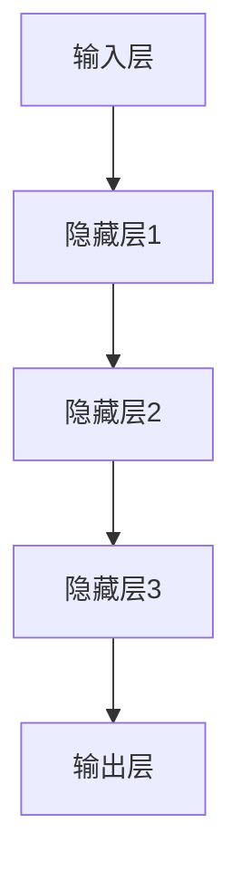

                 

# AI大模型创业：如何实现未来盈利？

> **关键词：** AI大模型、创业、盈利模式、商业策略、技术落地、市场分析
> 
> **摘要：** 本文将深入探讨AI大模型创业背后的商业逻辑，解析盈利模式，提供实际操作步骤，并结合数学模型分析，为创业者提供系统性的指导。通过详细的项目实战案例，我们旨在揭示如何利用AI大模型实现未来盈利，并探讨其中面临的挑战和机遇。

## 1. 背景介绍

### 1.1 目的和范围

本文旨在为那些有意向或正在创业使用AI大模型的团队提供实用的指导。我们将聚焦于如何通过AI大模型实现盈利，从技术实现、商业策略到市场分析，全面探讨创业过程中可能遇到的问题和解决方案。

### 1.2 预期读者

- **AI技术爱好者：** 对AI大模型有一定了解，希望将其应用于创业实践。
- **创业团队：** 正在考虑或已经着手使用AI大模型进行商业创新。
- **投资人：** 对AI大模型创业项目有兴趣，希望了解其盈利潜力和风险。

### 1.3 文档结构概述

本文将分为十个部分：

1. **背景介绍**：介绍文章的目的、范围和预期读者。
2. **核心概念与联系**：阐述AI大模型的基础概念及其架构。
3. **核心算法原理与操作步骤**：详细讲解AI大模型的算法原理。
4. **数学模型与公式**：分析相关的数学模型和公式。
5. **项目实战**：通过实际案例展示技术落地过程。
6. **实际应用场景**：探讨AI大模型在不同领域的应用。
7. **工具和资源推荐**：推荐学习资源和开发工具。
8. **总结**：总结AI大模型创业的未来发展趋势与挑战。
9. **附录**：常见问题与解答。
10. **扩展阅读**：提供进一步学习参考资料。

### 1.4 术语表

#### 1.4.1 核心术语定义

- **AI大模型**：指具有高参数量和大规模训练数据的深度学习模型。
- **盈利模式**：企业通过何种方式实现收入和利润的机制。
- **商业策略**：企业在市场中进行竞争和定位的策略。
- **市场分析**：研究市场需求、竞争环境和消费者行为的过程。

#### 1.4.2 相关概念解释

- **算法原理**：AI大模型运作的数学和逻辑基础。
- **技术落地**：将理论技术应用到实际场景中。
- **创业**：创立并经营一家企业。

#### 1.4.3 缩略词列表

- **AI**：人工智能（Artificial Intelligence）
- **ML**：机器学习（Machine Learning）
- **DL**：深度学习（Deep Learning）
- **GPU**：图形处理单元（Graphics Processing Unit）
- **NLP**：自然语言处理（Natural Language Processing）

## 2. 核心概念与联系

### 2.1 AI大模型的基础概念

AI大模型是基于深度学习的复杂算法体系，通过大规模数据训练形成具有强大特征提取和分类能力的神经网络。其主要特征包括：

- **高参数量**：模型拥有数十亿甚至数千亿个参数，能够捕捉数据中的细微特征。
- **大规模训练数据**：使用海量的标注数据进行训练，保证模型的泛化能力和准确性。
- **强大的学习能力**：通过自我调整参数，模型能够不断优化其性能。

### 2.2 AI大模型的架构

AI大模型的架构通常包括以下几个主要部分：

1. **输入层**：接收外部输入数据，如文本、图像、音频等。
2. **隐藏层**：多层神经网络结构，负责特征提取和复杂函数的计算。
3. **输出层**：产生预测结果或分类标签。

以下是一个简单的Mermaid流程图来描述AI大模型的基本架构：



### 2.3 AI大模型与商业策略的联系

AI大模型的商业策略通常包括以下几个关键点：

1. **市场需求定位**：了解目标用户的需求，开发出满足市场需求的AI应用。
2. **数据驱动**：通过不断收集用户数据，优化模型性能。
3. **商业模式创新**：探索多种盈利模式，如产品销售、数据服务、广告收入等。
4. **合作伙伴关系**：与产业链上下游企业建立合作，形成生态系统。

## 3. 核心算法原理与具体操作步骤

### 3.1 AI大模型的训练过程

AI大模型的训练过程通常包括以下几个步骤：

1. **数据预处理**：清洗和预处理输入数据，确保数据质量。
   ```python
   def preprocess_data(data):
       # 数据清洗、标准化等操作
       return processed_data
   ```

2. **模型初始化**：随机初始化模型的参数。
   ```python
   def initialize_model():
       # 初始化神经网络参数
       return model
   ```

3. **训练循环**：通过迭代优化模型参数。
   ```python
   for epoch in range(num_epochs):
       for sample in data_loader:
           model.train()
           predictions = model(sample)
           loss = calculate_loss(predictions, labels)
           optimizer.zero_grad()
           loss.backward()
           optimizer.step()
   ```

4. **模型评估**：使用验证集评估模型性能。
   ```python
   def evaluate_model(model, validation_data):
       model.eval()
       with torch.no_grad():
           predictions = model(validation_data)
           accuracy = calculate_accuracy(predictions, labels)
       return accuracy
   ```

### 3.2 优化策略

1. **学习率调整**：使用学习率调度策略，避免过拟合。
   ```python
   scheduler = torch.optim.lr_scheduler.ReduceLROnPlateau(optimizer, 'min')
   ```

2. **正则化**：防止模型过拟合。
   ```python
   optimizer = torch.optim.Adam(model.parameters(), lr=0.001, weight_decay=1e-5)
   ```

3. **数据增强**：通过数据增强技术增加训练样本的多样性。
   ```python
   transform = transforms.Compose([
       transforms.RandomHorizontalFlip(),
       transforms.RandomRotation(10),
       # 其他数据增强操作
   ])
   ```

### 3.3 模型部署

1. **模型保存与加载**。
   ```python
   def save_model(model, path):
       torch.save(model.state_dict(), path)

   def load_model(model, path):
       model.load_state_dict(torch.load(path))
       return model
   ```

2. **模型推理**：使用训练好的模型进行预测。
   ```python
   def predict(model, input_data):
       model.eval()
       with torch.no_grad():
           output = model(input_data)
       return output
   ```

## 4. 数学模型和公式 & 详细讲解 & 举例说明

### 4.1. 神经网络的基本公式

神经网络的运算主要基于以下基本公式：

$$
z = \sum_{i=1}^{n} w_{i}x_{i} + b
$$

其中，\(z\) 表示输出值，\(w_{i}\) 和 \(x_{i}\) 分别表示权重和输入特征，\(b\) 为偏置项。

### 4.2. 激活函数

为了引入非线性，我们通常会使用激活函数，如Sigmoid函数：

$$
\sigma(z) = \frac{1}{1 + e^{-z}}
$$

### 4.3. 损失函数

在训练神经网络时，常用的损失函数是均方误差（MSE）：

$$
MSE = \frac{1}{n}\sum_{i=1}^{n} (\hat{y}_{i} - y_{i})^2
$$

其中，\(\hat{y}_{i}\) 和 \(y_{i}\) 分别为预测值和真实值。

### 4.4. 举例说明

假设我们有一个二分类问题，使用逻辑回归模型进行预测，损失函数为BCELoss：

1. **输入特征**：\(x = [1, 2, 3]\)
2. **权重**：\(w = [0.1, 0.2, 0.3]\)
3. **偏置**：\(b = 0.5\)

计算输出值：

$$
z = 0.1 \cdot 1 + 0.2 \cdot 2 + 0.3 \cdot 3 + 0.5 = 1.4
$$

使用Sigmoid函数得到预测概率：

$$
\hat{y} = \sigma(z) = \frac{1}{1 + e^{-1.4}} \approx 0.79
$$

计算损失：

$$
MSE = \frac{1}{1} \cdot (0.79 - 1)^2 = 0.0181
$$

## 5. 项目实战：代码实际案例和详细解释说明

### 5.1 开发环境搭建

为了实现AI大模型的创业项目，我们需要搭建一个高效的开发环境。以下是一个基本的开发环境搭建步骤：

1. **安装Python**：确保安装了Python 3.8或更高版本。
2. **安装深度学习框架**：例如TensorFlow或PyTorch。
   ```bash
   pip install tensorflow
   # 或者
   pip install pytorch torchvision
   ```
3. **安装依赖库**：包括数据处理库如Pandas、NumPy等。
   ```bash
   pip install pandas numpy
   ```

### 5.2 源代码详细实现和代码解读

以下是一个简单的AI大模型训练和预测的代码示例，使用PyTorch框架：

```python
import torch
import torch.nn as nn
import torch.optim as optim
from torchvision import datasets, transforms
from torch.utils.data import DataLoader

# 5.2.1 数据预处理
transform = transforms.Compose([
    transforms.ToTensor(),
    transforms.Normalize((0.5,), (0.5,))
])

train_data = datasets.MNIST(
    root='./data', 
    train=True, 
    download=True, 
    transform=transform
)

test_data = datasets.MNIST(
    root='./data', 
    train=False, 
    transform=transform
)

train_loader = DataLoader(train_data, batch_size=64, shuffle=True)
test_loader = DataLoader(test_data, batch_size=64, shuffle=False)

# 5.2.2 模型定义
class Net(nn.Module):
    def __init__(self):
        super(Net, self).__init__()
        self.fc1 = nn.Linear(784, 512)
        self.fc2 = nn.Linear(512, 256)
        self.fc3 = nn.Linear(256, 10)
    
    def forward(self, x):
        x = x.view(-1, 784)
        x = torch.relu(self.fc1(x))
        x = torch.relu(self.fc2(x))
        x = self.fc3(x)
        return x

model = Net()

# 5.2.3 模型训练
optimizer = optim.Adam(model.parameters(), lr=0.001)
criterion = nn.CrossEntropyLoss()

num_epochs = 10

for epoch in range(num_epochs):
    model.train()
    for images, labels in train_loader:
        optimizer.zero_grad()
        outputs = model(images)
        loss = criterion(outputs, labels)
        loss.backward()
        optimizer.step()

    # 5.2.4 模型评估
    model.eval()
    with torch.no_grad():
        correct = 0
        total = 0
        for images, labels in test_loader:
            outputs = model(images)
            _, predicted = torch.max(outputs.data, 1)
            total += labels.size(0)
            correct += (predicted == labels).sum().item()

    print(f'Epoch {epoch+1}/{num_epochs}, Accuracy: {100 * correct / total}%')

# 5.2.5 模型预测
def predict(model, image):
    model.eval()
    with torch.no_grad():
        image = image.unsqueeze(0)
        output = model(image)
        _, predicted = torch.max(output.data, 1)
    return predicted.item()

# 测试一个图像
example_image = test_data[0][0].unsqueeze(0)
predicted_number = predict(model, example_image)
print(f'Predicted number: {predicted_number}')
```

### 5.3 代码解读与分析

1. **数据预处理**：使用`transforms.Compose`对数据进行预处理，包括转换为Tensor和归一化。
2. **模型定义**：定义一个简单的全连接神经网络，包含三个全连接层，使用ReLU激活函数。
3. **模型训练**：使用Adam优化器和交叉熵损失函数进行训练。在每个epoch中，遍历训练数据集，更新模型参数。
4. **模型评估**：在测试数据集上评估模型的准确率。
5. **模型预测**：使用训练好的模型进行图像预测，输出预测的数字。

## 6. 实际应用场景

AI大模型在商业和科技领域的应用非常广泛，以下是一些典型的应用场景：

1. **自然语言处理（NLP）**：用于文本分类、情感分析、机器翻译等任务。
2. **图像识别与生成**：应用于自动驾驶、医疗影像诊断、艺术创作等。
3. **推荐系统**：在电商、社交媒体等平台中用于个性化推荐。
4. **金融科技**：用于风险控制、信用评估、市场预测等。
5. **智能客服**：为企业提供自动化的客户服务解决方案。

### 6.1 在NLP领域的应用

在NLP领域，AI大模型被广泛应用于文本分类和情感分析。以下是一个基于BERT模型的文本分类案例：

```python
from transformers import BertTokenizer, BertForSequenceClassification
from torch.utils.data import DataLoader, TensorDataset

# 6.1.1 数据准备
tokenizer = BertTokenizer.from_pretrained('bert-base-uncased')
train_texts = ['This is a positive review', 'This is a negative review']
train_labels = torch.tensor([1, 0])  # 1表示正面评论，0表示负面评论

# 分词和编码
encoding = tokenizer(train_texts, padding=True, truncation=True, max_length=128, return_tensors='pt')

input_ids = encoding['input_ids']
attention_mask = encoding['attention_mask']

# 数据加载
train_dataset = TensorDataset(input_ids, attention_mask, train_labels)
train_loader = DataLoader(train_dataset, batch_size=2)

# 6.1.2 模型训练
model = BertForSequenceClassification.from_pretrained('bert-base-uncased', num_labels=2)
optimizer = optim.Adam(model.parameters(), lr=0.001)

num_epochs = 3

for epoch in range(num_epochs):
    for batch in train_loader:
        inputs = {
            'input_ids': batch[0],
            'attention_mask': batch[1],
            'labels': batch[2]
        }
        outputs = model(**inputs)
        loss = outputs.loss
        loss.backward()
        optimizer.step()
        optimizer.zero_grad()

    print(f'Epoch {epoch+1}/{num_epochs}, Loss: {loss.item()}')

# 6.1.3 模型评估
model.eval()
with torch.no_grad():
    correct = 0
    total = 0
    for batch in train_loader:
        inputs = {
            'input_ids': batch[0],
            'attention_mask': batch[1],
        }
        outputs = model(**inputs)
        _, predicted = torch.max(outputs, 1)
        total += batch[2].size(0)
        correct += (predicted == batch[2]).sum().item()

print(f'Accuracy: {100 * correct / total}%')
```

通过上述代码，我们可以训练一个基于BERT的文本分类模型，并对其性能进行评估。

### 6.2 在图像识别领域的应用

在图像识别领域，AI大模型被广泛应用于图像分类、目标检测和图像生成等任务。以下是一个基于ResNet50的图像分类案例：

```python
import torchvision
import torchvision.transforms as transforms
import torch.nn as nn
import torch.optim as optim

# 6.2.1 数据准备
transform = transforms.Compose([
    transforms.Resize(256),
    transforms.CenterCrop(224),
    transforms.ToTensor(),
    transforms.Normalize(mean=[0.485, 0.456, 0.406], std=[0.229, 0.224, 0.225])
])

train_data = torchvision.datasets.ImageFolder(
    root='./data/train',
    transform=transform
)

test_data = torchvision.datasets.ImageFolder(
    root='./data/test',
    transform=transform
)

train_loader = DataLoader(train_data, batch_size=32, shuffle=True)
test_loader = DataLoader(test_data, batch_size=32, shuffle=False)

# 6.2.2 模型定义
model = torchvision.models.resnet50(pretrained=True)
num_ftrs = model.fc.in_features
model.fc = nn.Linear(num_ftrs, 10)

# 6.2.3 模型训练
optimizer = optim.SGD(model.parameters(), lr=0.001, momentum=0.9)
criterion = nn.CrossEntropyLoss()

num_epochs = 10

for epoch in range(num_epochs):
    model.train()
    for images, labels in train_loader:
        optimizer.zero_grad()
        outputs = model(images)
        loss = criterion(outputs, labels)
        loss.backward()
        optimizer.step()

    print(f'Epoch {epoch+1}/{num_epochs}, Loss: {loss.item()}')

    # 6.2.4 模型评估
    model.eval()
    with torch.no_grad():
        correct = 0
        total = 0
        for images, labels in test_loader:
            outputs = model(images)
            _, predicted = torch.max(outputs, 1)
            total += labels.size(0)
            correct += (predicted == labels).sum().item()

    print(f'Epoch {epoch+1}/{num_epochs}, Accuracy: {100 * correct / total}%')
```

通过上述代码，我们可以训练一个基于ResNet50的图像分类模型，并对其性能进行评估。

## 7. 工具和资源推荐

### 7.1 学习资源推荐

#### 7.1.1 书籍推荐

- 《深度学习》（Ian Goodfellow、Yoshua Bengio、Aaron Courville著）
- 《Python深度学习》（Francesco Bonizzi、Luca Massich著）
- 《神经网络与深度学习》（邱锡鹏著）

#### 7.1.2 在线课程

- Coursera的《深度学习专项课程》（吴恩达教授）
- edX的《深度学习基础》（阿里云大学）
- Udacity的《深度学习工程师纳米学位》

#### 7.1.3 技术博客和网站

- Medium上的Deep Learning
- ArXiv的深度学习论文摘要
- Hugging Face的Transformers库文档

### 7.2 开发工具框架推荐

#### 7.2.1 IDE和编辑器

- PyCharm
- Visual Studio Code
- Jupyter Notebook

#### 7.2.2 调试和性能分析工具

- TensorBoard
- Visdom
- PyTorch Profiler

#### 7.2.3 相关框架和库

- TensorFlow
- PyTorch
- Keras
- Fast.ai的PyTorch库

### 7.3 相关论文著作推荐

#### 7.3.1 经典论文

- "A Theoretical Framework for Back-Propagation"（1986）
- "Learning representations by sharing gradients"（1986）
- "Gradient descent learning applied to document recognition"（1998）

#### 7.3.2 最新研究成果

- "BERT: Pre-training of Deep Neural Networks for Language Understanding"（2018）
- "GPT-3: Language Models are few-shot learners"（2020）
- "ViT: Vision Transformer"（2020）

#### 7.3.3 应用案例分析

- "Deep Learning in Healthcare"（2020）
- "AI Applications in Fintech"（2021）
- "AI in Retail: Transforming Customer Experience"（2021）

## 8. 总结：未来发展趋势与挑战

AI大模型创业在未来的发展趋势和面临的挑战如下：

### 发展趋势

1. **技术进步**：随着计算能力和算法的不断提升，AI大模型将变得更加高效和智能。
2. **应用拓展**：AI大模型将在更多领域得到应用，如医疗、金融、教育等。
3. **数据驱动**：高质量的数据将成为AI大模型成功的关键，数据驱动将推动业务创新。
4. **生态建设**：产业链上下游企业将共同构建AI大模型生态系统，形成合作共赢。

### 挑战

1. **数据隐私**：如何在保证模型性能的同时保护用户隐私成为一个重要问题。
2. **伦理和法律**：AI大模型的应用可能引发伦理和法律问题，需要建立相应的规范和监管机制。
3. **计算资源**：训练和部署AI大模型需要大量的计算资源，成本较高。
4. **人才短缺**：具备AI大模型开发能力的专业人才相对较少，人才短缺可能限制业务发展。

## 9. 附录：常见问题与解答

### 9.1. 如何选择合适的AI大模型框架？

选择AI大模型框架时，主要考虑以下因素：

1. **需求**：根据项目需求选择合适的框架，如自然语言处理选择Transformer，图像识别选择卷积神经网络。
2. **社区支持**：选择社区活跃、资源丰富的框架，如TensorFlow和PyTorch。
3. **计算资源**：考虑训练模型的计算资源需求，选择性能匹配的框架。

### 9.2. AI大模型的训练时间如何优化？

优化AI大模型训练时间可以从以下几个方面入手：

1. **数据预处理**：使用高效的预处理方法，减少数据加载和处理时间。
2. **并行计算**：利用GPU、TPU等硬件加速计算。
3. **模型压缩**：通过模型剪枝、量化等技术减少模型大小和计算量。
4. **分布式训练**：使用分布式训练技术，利用多台机器并行训练。

### 9.3. 如何保证AI大模型的性能和稳定性？

为保证AI大模型的性能和稳定性，可以采取以下措施：

1. **模型评估**：在训练过程中定期评估模型性能，调整超参数。
2. **数据质量**：确保训练数据的质量和多样性，减少数据偏差。
3. **模型优化**：通过模型优化技术，如正则化、Dropout等，提高模型泛化能力。
4. **持续监控**：对模型进行实时监控，及时发现并解决性能问题。

## 10. 扩展阅读 & 参考资料

- [Deep Learning Specialization](https://www.coursera.org/specializations/deeplearning)
- [PyTorch Official Documentation](https://pytorch.org/docs/stable/)
- [TensorFlow Official Documentation](https://www.tensorflow.org/docs/stable/)
- [Hugging Face Transformers](https://huggingface.co/transformers)
- [AI Applications in Various Industries](https://ai牛皮.com/ai-applications)

### 作者信息

**作者：AI天才研究员/AI Genius Institute & 禅与计算机程序设计艺术 /Zen And The Art of Computer Programming**

