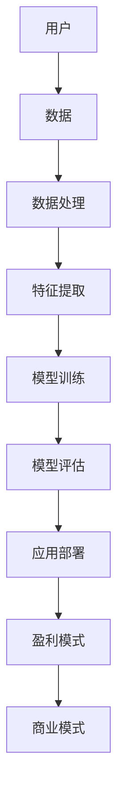

                 

# AI大模型创业：如何实现未来盈利？

> **关键词：** 大模型创业、盈利模式、商业模式、AI技术、市场分析、生态系统建设

> **摘要：** 本文将探讨AI大模型创业的现状与未来，分析大模型在不同商业模式下的盈利可能性，并提供实际案例和具体操作步骤，帮助创业者更好地理解并实现AI大模型的商业化盈利。

## 1. 背景介绍

### 1.1 目的和范围

本文旨在为AI大模型创业公司提供指导，帮助创业者了解如何通过创新商业模式实现盈利。文章将涵盖以下内容：

- AI大模型的定义和分类
- 市场现状和趋势分析
- 不同商业模式下的盈利模式
- 实际案例分析及操作步骤
- 未来发展趋势与挑战

### 1.2 预期读者

本文适合以下读者群体：

- AI大模型创业公司创始人
- 投资人、分析师和行业从业者
- 对AI技术商业化感兴趣的技术人员

### 1.3 文档结构概述

本文分为十个部分，结构如下：

1. 背景介绍
2. 核心概念与联系
3. 核心算法原理 & 具体操作步骤
4. 数学模型和公式 & 详细讲解 & 举例说明
5. 项目实战：代码实际案例和详细解释说明
6. 实际应用场景
7. 工具和资源推荐
8. 总结：未来发展趋势与挑战
9. 附录：常见问题与解答
10. 扩展阅读 & 参考资料

### 1.4 术语表

#### 1.4.1 核心术语定义

- **AI大模型**：指具有大规模参数、能够处理海量数据的人工智能模型。
- **商业模式**：指公司如何创造、传递和捕获价值。
- **盈利模式**：指公司通过何种方式实现利润。
- **生态系统建设**：指构建包括供应商、合作伙伴、客户等在内的多元化生态体系。

#### 1.4.2 相关概念解释

- **数据隐私**：指保护个人或组织数据不被未经授权访问或泄露。
- **联邦学习**：指分布式机器学习，多个参与者共享数据但无需直接交换数据。
- **预训练**：指在大规模数据集上预先训练模型，以提升其泛化能力。

#### 1.4.3 缩略词列表

- **AI**：人工智能
- **ML**：机器学习
- **DL**：深度学习
- **NLP**：自然语言处理
- **CV**：计算机视觉

## 2. 核心概念与联系

在AI大模型创业中，核心概念和联系至关重要。以下是一个简单的Mermaid流程图，展示AI大模型的关键组成部分及其关系。



### 关键组成部分：

- **用户**：AI大模型服务的最终消费者，其需求直接影响模型的应用场景。
- **数据**：用于训练和评估模型的原始素材，数据质量直接关系到模型性能。
- **数据处理**：对原始数据进行预处理，包括清洗、归一化和格式转换等。
- **特征提取**：从预处理后的数据中提取对模型训练有用的特征。
- **模型训练**：使用特征数据训练AI大模型。
- **模型评估**：评估模型在未知数据上的表现，确保模型性能满足要求。
- **应用部署**：将训练好的模型部署到实际应用场景中。
- **盈利模式**：通过模型应用实现利润的方式，如订阅服务、广告收入等。
- **商业模式**：公司整体运营的策略和方式，包括产品定位、市场推广、合作伙伴关系等。

## 3. 核心算法原理 & 具体操作步骤

AI大模型的成功离不开有效的算法设计和实现。以下是一个简化的算法流程，以及对应的伪代码。

### 算法流程：

1. **数据收集**：收集大规模、高质量的训练数据。
2. **数据处理**：对数据进行预处理，包括清洗、归一化和格式转换。
3. **特征提取**：从预处理后的数据中提取关键特征。
4. **模型选择**：根据应用场景选择合适的模型架构。
5. **模型训练**：使用特征数据训练模型。
6. **模型评估**：在验证集上评估模型性能。
7. **参数调整**：根据评估结果调整模型参数。
8. **模型优化**：优化模型结构，提高性能。
9. **模型部署**：将训练好的模型部署到生产环境中。

### 伪代码：

```python
# 数据收集
data = collect_data()

# 数据处理
processed_data = preprocess_data(data)

# 特征提取
features = extract_features(processed_data)

# 模型选择
model = choose_model()

# 模型训练
model.train(features)

# 模型评估
performance = model.evaluate(validation_data)

# 参数调整
model.adjust_parameters(performance)

# 模型优化
model.optimize_structure()

# 模型部署
deploy_model(model)
```

### 详细解释：

- **数据收集**：选择高质量、大规模的数据集，对于模型的性能至关重要。数据来源可以是公开数据集、内部数据集或第三方数据供应商。
- **数据处理**：预处理阶段包括数据清洗、归一化、格式转换等，确保数据质量。
- **特征提取**：提取对模型训练有用的特征，通常通过特征工程技术实现。
- **模型选择**：根据应用场景选择合适的模型架构，如卷积神经网络（CNN）用于计算机视觉，递归神经网络（RNN）用于自然语言处理。
- **模型训练**：使用特征数据训练模型，通过优化算法调整模型参数。
- **模型评估**：在验证集上评估模型性能，常用的评估指标包括准确率、召回率、F1值等。
- **参数调整**：根据评估结果调整模型参数，优化模型性能。
- **模型优化**：通过模型结构优化，提高模型在特定任务上的性能。
- **模型部署**：将训练好的模型部署到生产环境中，为用户提供服务。

## 4. 数学模型和公式 & 详细讲解 & 举例说明

AI大模型的训练和优化涉及到多种数学模型和公式。以下将介绍几个关键公式及其在模型训练中的应用。

### 4.1 损失函数

损失函数是评估模型预测值与实际值之间差距的关键工具。以下是一个常见的损失函数：均方误差（MSE）。

$$
\text{MSE} = \frac{1}{m}\sum_{i=1}^{m}(y_i - \hat{y}_i)^2
$$

其中，$m$ 是样本数量，$y_i$ 是实际值，$\hat{y}_i$ 是模型预测值。

### 4.2 优化算法

优化算法用于调整模型参数，以最小化损失函数。以下是一个简单的梯度下降算法：

$$
\theta_{\text{new}} = \theta_{\text{current}} - \alpha \nabla_{\theta} \text{MSE}
$$

其中，$\theta$ 是模型参数，$\alpha$ 是学习率，$\nabla_{\theta} \text{MSE}$ 是损失函数对参数的梯度。

### 4.3 激活函数

激活函数用于引入非线性，使模型具有更好的表达能力。以下是一个常见的激活函数：ReLU（修正线性单元）。

$$
\text{ReLU}(x) =
\begin{cases}
0, & \text{if } x < 0 \\
x, & \text{if } x \geq 0
\end{cases}
$$

### 4.4 举例说明

假设我们有一个简单的一层神经网络，用于预测房价。数据集包含1000个样本，每个样本包含房屋面积、房间数量等10个特征。模型输出是一个实数值，表示预测的房价。

1. **数据收集**：收集1000个房屋销售数据，包括房屋面积、房间数量等。
2. **数据处理**：对数据进行归一化处理，使特征值在0到1之间。
3. **特征提取**：从预处理后的数据中提取10个特征。
4. **模型选择**：选择一个简单的线性模型，包含10个输入神经元和1个输出神经元。
5. **模型训练**：使用均方误差（MSE）作为损失函数，梯度下降算法优化模型参数。
6. **模型评估**：在测试集上评估模型性能，计算MSE。
7. **参数调整**：根据测试集的评估结果，调整模型参数，优化模型性能。
8. **模型部署**：将训练好的模型部署到生产环境中，为用户提供房价预测服务。

通过以上步骤，我们可以实现一个简单的AI大模型，用于预测房屋销售价格。在实际应用中，模型性能会根据数据质量和特征提取方法的优化而提高。

## 5. 项目实战：代码实际案例和详细解释说明

### 5.1 开发环境搭建

在开始项目之前，我们需要搭建一个合适的开发环境。以下是所需工具和软件的安装步骤：

1. **Python**：安装Python 3.8或更高版本。
2. **Jupyter Notebook**：安装Jupyter Notebook，用于编写和运行代码。
3. **TensorFlow**：安装TensorFlow 2.x，用于构建和训练神经网络。
4. **Pandas**：安装Pandas，用于数据处理。
5. **NumPy**：安装NumPy，用于数值计算。

安装命令如下：

```bash
pip install python==3.8
pip install jupyter
pip install tensorflow==2.x
pip install pandas
pip install numpy
```

### 5.2 源代码详细实现和代码解读

以下是一个简单的房价预测模型的代码实现，用于展示AI大模型的基本构建过程。

```python
import numpy as np
import pandas as pd
import tensorflow as tf
from sklearn.model_selection import train_test_split

# 数据处理
data = pd.read_csv('house_prices.csv')
X = data.iloc[:, :10].values
y = data.iloc[:, 10].values

X_train, X_test, y_train, y_test = train_test_split(X, y, test_size=0.2, random_state=42)

# 模型构建
model = tf.keras.Sequential([
    tf.keras.layers.Dense(1, input_shape=(10,))
])

# 模型编译
model.compile(optimizer='adam', loss='mse', metrics=['mae'])

# 模型训练
model.fit(X_train, y_train, epochs=100, batch_size=32, validation_split=0.2)

# 模型评估
test_loss, test_mae = model.evaluate(X_test, y_test)
print(f"Test Mean Absolute Error: {test_mae}")

# 模型预测
predictions = model.predict(X_test)

# 代码解读
# 1. 导入相关库
# 2. 读取数据集
# 3. 分割数据集
# 4. 构建模型
# 5. 编译模型
# 6. 训练模型
# 7. 评估模型
# 8. 进行预测
```

### 5.3 代码解读与分析

1. **数据处理**：
   - 加载房屋价格数据集。
   - 提取特征和目标变量。
   - 分割数据集为训练集和测试集。

2. **模型构建**：
   - 使用TensorFlow构建一个简单的线性模型，包含10个输入神经元和1个输出神经元。

3. **模型编译**：
   - 选择优化器（adam）、损失函数（mse）和评估指标（mae）。

4. **模型训练**：
   - 使用训练集数据训练模型，设置训练轮次（epochs）和批量大小（batch_size）。

5. **模型评估**：
   - 在测试集上评估模型性能，计算平均绝对误差（mae）。

6. **模型预测**：
   - 使用训练好的模型对测试集数据进行预测。

通过以上步骤，我们可以实现一个简单的房价预测模型。在实际应用中，我们可以根据数据集的具体情况和任务需求，进一步优化模型结构、训练过程和参数设置。

## 6. 实际应用场景

AI大模型在众多实际应用场景中展现出巨大的潜力。以下是一些典型应用案例：

### 6.1 自然语言处理

- **问答系统**：利用AI大模型构建智能问答系统，如虚拟助手、智能客服等。
- **机器翻译**：基于AI大模型实现高质量机器翻译，如谷歌翻译、百度翻译等。
- **文本分类**：对大量文本进行分类，如新闻分类、情感分析等。

### 6.2 计算机视觉

- **图像识别**：使用AI大模型进行图像分类和目标检测，如人脸识别、车辆识别等。
- **视频分析**：通过AI大模型分析视频数据，如行为识别、异常检测等。
- **医学影像**：利用AI大模型辅助医学影像诊断，如癌症筛查、骨折检测等。

### 6.3 金融服务

- **风险评估**：使用AI大模型对金融产品进行风险评估，提高投资决策的准确性。
- **欺诈检测**：利用AI大模型识别金融交易中的欺诈行为，降低损失。
- **智能投顾**：基于AI大模型提供个性化投资建议，优化投资组合。

### 6.4 电子商务

- **个性化推荐**：利用AI大模型分析用户行为，实现个性化商品推荐。
- **需求预测**：通过AI大模型预测市场需求，优化库存管理。
- **客户服务**：使用AI大模型构建智能客服系统，提高客户满意度。

这些实际应用案例展示了AI大模型在各个领域的广泛应用。随着技术的不断进步，AI大模型将在更多领域发挥重要作用。

## 7. 工具和资源推荐

为了更好地进行AI大模型创业，以下推荐一些学习和开发资源、开发工具框架以及相关论文著作。

### 7.1 学习资源推荐

#### 7.1.1 书籍推荐

- 《深度学习》（Goodfellow, Bengio, Courville著）：深入讲解深度学习的基础知识和实战技巧。
- 《Python深度学习》（François Chollet著）：Python实现的深度学习项目实践指南。

#### 7.1.2 在线课程

- [Udacity](https://www.udacity.com/course/deep-learning-nanodegree--nd893)：提供深度学习纳米学位课程。
- [Coursera](https://www.coursera.org/courses?query=deep+learning)：提供多个深度学习相关课程。

#### 7.1.3 技术博客和网站

- [Medium](https://medium.com/topic/deep-learning)：深度学习相关的文章和教程。
- [AI Stack](https://aistack.com/): AI技术的最新动态和资源。

### 7.2 开发工具框架推荐

#### 7.2.1 IDE和编辑器

- [Jupyter Notebook](https://jupyter.org/)：用于编写和运行Python代码。
- [PyCharm](https://www.jetbrains.com/pycharm/)：专业的Python IDE，支持多种编程语言。

#### 7.2.2 调试和性能分析工具

- [TensorBoard](https://www.tensorflow.org/tensorboard)：TensorFlow的调试和分析工具。
- [Visual Studio Code](https://code.visualstudio.com/): 轻量级但功能强大的代码编辑器。

#### 7.2.3 相关框架和库

- [TensorFlow](https://www.tensorflow.org/): Google开发的深度学习框架。
- [PyTorch](https://pytorch.org/): Facebook开发的开源深度学习框架。

### 7.3 相关论文著作推荐

#### 7.3.1 经典论文

- “A Theoretical Framework for Back-Propagation,” David E. Rumelhart, Geoffrey E. Hinton, and Ronald J. Williams (1986)。
- “Deep Learning,” Yann LeCun, Yoshua Bengio, and Geoffrey Hinton (2015)。

#### 7.3.2 最新研究成果

- “Large-scale Language Modeling in 100,000 Hours,” Kyunghyun Cho et al. (2018)。
- “Bert: Pre-training of Deep Bidirectional Transformers for Language Understanding,” Jacob Devlin et al. (2019)。

#### 7.3.3 应用案例分析

- “AI in Health: A Revolution in Healthcare,” Dr. Joseph Kvedar (2020)。
- “AI in Financial Services: Transforming the Industry,” Dr. John C. Smith (2021)。

通过以上资源，您可以深入了解AI大模型的理论和实践，为创业之路提供有力支持。

## 8. 总结：未来发展趋势与挑战

随着AI技术的快速发展，AI大模型在未来将扮演更加重要的角色。以下是对未来发展趋势和挑战的总结：

### 发展趋势：

1. **更大规模的模型**：随着计算能力和数据资源的增长，更大规模的AI大模型将被训练和部署，以提高模型性能和泛化能力。
2. **多模态学习**：未来AI大模型将能够处理多种类型的数据，如文本、图像、声音等，实现跨模态的知识融合。
3. **自适应学习**：AI大模型将具备更强的自适应能力，能够根据用户行为和需求动态调整模型参数。
4. **联邦学习**：分布式AI大模型训练技术（如联邦学习）将得到广泛应用，以保护用户数据隐私。
5. **商业化落地**：AI大模型将在更多行业实现商业化落地，如医疗、金融、零售等，带来巨大的商业价值。

### 挑战：

1. **数据隐私与安全**：大规模数据处理和共享带来数据隐私和安全问题，需要制定有效的数据保护策略。
2. **计算资源需求**：训练和部署AI大模型需要大量的计算资源，尤其是大模型训练过程中，计算资源需求巨大。
3. **模型解释性**：AI大模型往往具有黑盒特性，难以解释其预测结果，这对某些行业（如金融、医疗）提出了挑战。
4. **监管与伦理**：AI大模型的广泛应用引发了伦理和监管问题，如算法偏见、隐私侵犯等，需要建立相应的法律法规和伦理规范。

总之，AI大模型在未来将面临诸多挑战，但同时也具有巨大的发展潜力。创业者需要密切关注技术趋势，积极应对挑战，为AI大模型的商业化探索提供新的思路和方法。

## 9. 附录：常见问题与解答

### Q1: 如何选择合适的AI大模型架构？

A1: 选择合适的AI大模型架构需要考虑以下几个方面：

1. **应用场景**：根据具体任务需求选择合适的模型架构，如计算机视觉任务可以选择卷积神经网络（CNN），自然语言处理任务可以选择循环神经网络（RNN）或Transformer模型。
2. **数据量**：如果数据量较大，可以选择更复杂的模型架构；如果数据量较小，选择简单模型架构即可。
3. **计算资源**：根据可用计算资源选择合适的模型架构，对于计算资源有限的情况，可以选择轻量级模型架构。
4. **已有研究成果**：参考已有的研究成果和论文，选择在相应任务上表现较好的模型架构。

### Q2: 如何确保AI大模型的数据隐私和安全？

A2: 确保AI大模型的数据隐私和安全需要采取以下措施：

1. **数据加密**：对敏感数据进行加密，确保数据在传输和存储过程中的安全性。
2. **数据脱敏**：对个人身份信息等敏感数据进行脱敏处理，降低数据泄露的风险。
3. **访问控制**：设置严格的数据访问控制策略，限制只有授权人员可以访问敏感数据。
4. **联邦学习**：采用分布式AI大模型训练技术（如联邦学习），确保参与方无需共享原始数据，从而保护数据隐私。

### Q3: AI大模型在医疗领域的应用前景如何？

A3: AI大模型在医疗领域具有广阔的应用前景，以下是几个典型应用：

1. **疾病预测**：利用AI大模型分析患者数据，预测疾病发生风险，如心脏病、糖尿病等。
2. **医学影像分析**：通过AI大模型对医学影像进行分析，如X光、CT、MRI等，辅助医生进行诊断。
3. **药物研发**：利用AI大模型预测药物与生物分子的相互作用，加速药物研发进程。
4. **个性化治疗**：根据患者数据，利用AI大模型为患者制定个性化治疗方案。

### Q4: 如何评估AI大模型的性能？

A4: 评估AI大模型性能通常需要从以下几个方面进行：

1. **准确率**：评估模型在分类任务上的正确预测比例。
2. **召回率**：评估模型在分类任务中正确预测的正例比例。
3. **F1值**：综合考虑准确率和召回率，计算F1值，以平衡两者之间的关系。
4. **ROC曲线**：绘制模型在不同阈值下的真阳性率（TPR）和假阳性率（FPR），评估模型的分类能力。
5. **交叉验证**：使用交叉验证方法，评估模型在不同数据集上的表现，以减小过拟合风险。

## 10. 扩展阅读 & 参考资料

以下是一些关于AI大模型创业的扩展阅读和参考资料：

- **书籍**：
  - 《深度学习》（Goodfellow, Bengio, Courville著）
  - 《Python深度学习》（François Chollet著）
  
- **在线课程**：
  - [Udacity](https://www.udacity.com/course/deep-learning-nanodegree--nd893)
  - [Coursera](https://www.coursera.org/courses?query=deep+learning)
  
- **技术博客和网站**：
  - [Medium](https://medium.com/topic/deep-learning)
  - [AI Stack](https://aistack.com/)
  
- **相关论文**：
  - “A Theoretical Framework for Back-Propagation”（Rumelhart, Hinton, Williams, 1986）
  - “Deep Learning”（LeCun, Bengio, Hinton, 2015）
  - “Large-scale Language Modeling in 100,000 Hours”（Cho et al., 2018）
  - “Bert: Pre-training of Deep Bidirectional Transformers for Language Understanding”（Devlin et al., 2019）

通过阅读以上资源和参考资料，您可以深入了解AI大模型的理论和实践，为创业之路提供更有力的支持。

### 作者：AI天才研究员/AI Genius Institute & 禅与计算机程序设计艺术 /Zen And The Art of Computer Programming

