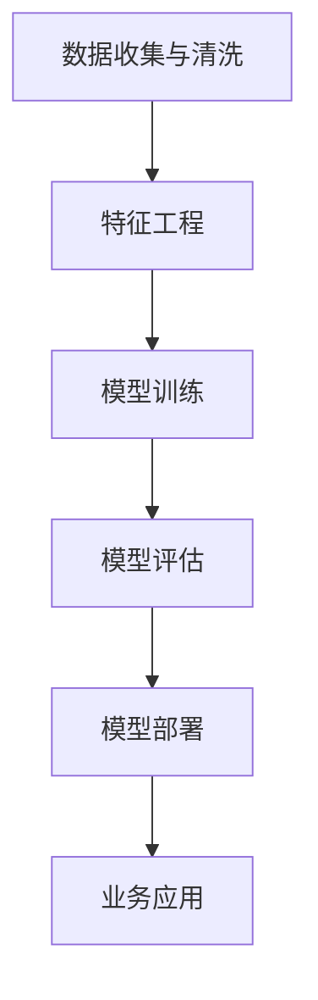
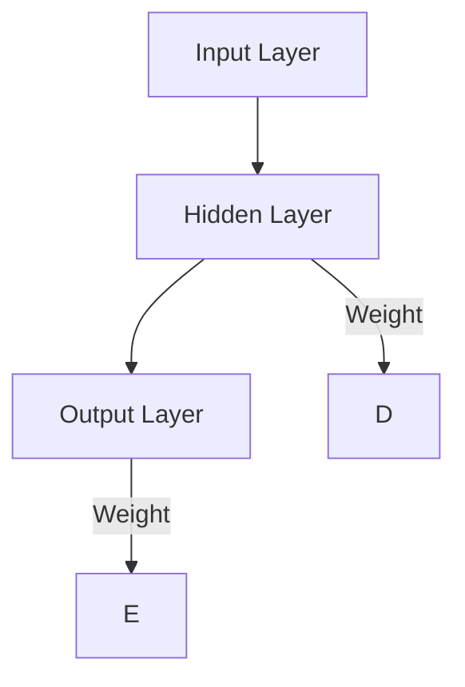

                 

# AI大模型创业：如何实现未来盈利？

> **关键词**：AI大模型，创业，盈利模式，商业模式，人工智能技术，市场定位，数据分析

> **摘要**：随着人工智能技术的快速发展，AI大模型在各个领域展现出强大的潜力。本文旨在探讨如何通过AI大模型实现创业盈利，分析其核心算法原理、市场需求、商业模式以及未来发展挑战。

## 1. 背景介绍

### 1.1 目的和范围

本文将围绕AI大模型的创业路径，探讨如何实现未来盈利。我们将分析AI大模型的定义、核心算法原理，以及市场定位和商业模式等方面。通过逐步推理，提供一种可行的创业策略。

### 1.2 预期读者

本文适合AI领域的研究者、创业者、投资者以及对人工智能技术感兴趣的技术人员阅读。希望读者能通过本文了解AI大模型的发展趋势和盈利潜力。

### 1.3 文档结构概述

本文分为八个部分，首先介绍AI大模型的基本概念，然后深入探讨核心算法原理、数学模型、实际应用场景，并推荐相关学习资源和工具。最后，总结未来发展趋势与挑战，并提供常见问题与解答。

### 1.4 术语表

#### 1.4.1 核心术语定义

- **AI大模型**：指参数规模达到亿级乃至万亿级的人工智能模型。
- **商业模式**：企业在特定市场环境中的盈利模式和组织方式。
- **市场定位**：企业根据自身特点在市场中所处的位置。

#### 1.4.2 相关概念解释

- **机器学习**：通过数据训练模型，使其具备预测和决策能力。
- **深度学习**：一种机器学习技术，通过多层神经网络实现复杂函数建模。

#### 1.4.3 缩略词列表

- **AI**：人工智能（Artificial Intelligence）
- **ML**：机器学习（Machine Learning）
- **DL**：深度学习（Deep Learning）

## 2. 核心概念与联系

在深入探讨AI大模型的创业盈利之前，我们需要理解其核心概念和架构。以下是一个简化的Mermaid流程图，用于展示AI大模型的主要组成部分：



### 2.1 数据收集与清洗

数据是AI大模型的基础。首先，我们需要收集大量高质量的数据，并进行清洗和预处理，以确保数据的质量和一致性。

### 2.2 特征工程

通过特征工程，我们将原始数据转换为适合机器学习的特征。这一过程包括数据标准化、特征选择和特征构造等。

### 2.3 模型训练

使用深度学习算法，我们训练AI大模型。这一过程通常涉及大量的参数调优和迭代。

### 2.4 模型评估

通过交叉验证和测试集，我们评估模型的性能，并根据评估结果调整模型。

### 2.5 模型部署

将训练好的模型部署到生产环境中，使其能够为实际业务应用提供服务。

### 2.6 业务应用

AI大模型可以在各种业务场景中发挥作用，如自然语言处理、图像识别、推荐系统等。

## 3. 核心算法原理 & 具体操作步骤

### 3.1 算法原理

AI大模型的核心算法通常是深度学习，特别是基于神经网络的模型。以下是一个简单的伪代码，用于描述一个基于卷积神经网络的图像分类模型：

```python
# 初始化神经网络结构
model = ConvolutionalNeuralNetwork(input_shape=(image_height, image_width, channels))

# 添加卷积层
model.add(Conv2D(filters=32, kernel_size=(3,3), activation='relu'))

# 添加池化层
model.add(MaxPooling2D(pool_size=(2,2)))

# 添加全连接层
model.add(Flatten())

# 添加输出层
model.add(Dense(num_classes, activation='softmax'))

# 编译模型
model.compile(optimizer='adam', loss='categorical_crossentropy', metrics=['accuracy'])

# 训练模型
model.fit(X_train, y_train, epochs=num_epochs, batch_size=batch_size, validation_data=(X_test, y_test))
```

### 3.2 具体操作步骤

1. **数据收集与清洗**：从公开数据集或企业内部数据中收集图像数据，并对数据进行清洗和预处理。

2. **特征工程**：对图像数据进行特征提取，例如使用CNN提取图像的局部特征。

3. **模型训练**：定义神经网络结构，编译模型，并使用训练数据训练模型。

4. **模型评估**：使用测试数据评估模型性能，并根据评估结果调整模型。

5. **模型部署**：将训练好的模型部署到生产环境中，如使用TensorFlow Serving或Apache MXNet。

## 4. 数学模型和公式 & 详细讲解 & 举例说明

AI大模型的训练过程涉及多个数学模型和公式。以下是一些关键的数学概念和公式，并使用LaTeX格式进行展示。

### 4.1 损失函数

损失函数用于衡量模型预测值与实际值之间的差距。以下是一个常用的损失函数——交叉熵损失函数：

$$
L(y, \hat{y}) = -\sum_{i} y_i \log(\hat{y}_i)
$$

其中，$y$为真实标签，$\hat{y}$为模型预测的概率分布。

### 4.2 反向传播

反向传播是训练神经网络的核心算法。以下是一个简单的反向传播算法步骤：

1. **前向传播**：计算输入和权重之间的加权和，并通过激活函数得到输出。

2. **计算损失**：使用损失函数计算预测值和真实值之间的差距。

3. **反向传播**：计算每个神经元的误差，并根据误差调整权重和偏置。

4. **更新权重**：使用优化算法（如梯度下降）更新模型参数。

### 4.3 举例说明

假设我们有一个简单的全连接神经网络，用于二分类任务。网络的输入层有3个神经元，隐藏层有5个神经元，输出层有2个神经元。以下是一个简单的神经网络结构：



- **前向传播**：输入一个样本 $x = [1, 0, 1]$，计算隐藏层和输出层的输出。

- **损失计算**：使用交叉熵损失函数计算损失。

- **反向传播**：计算每个神经元的误差，并更新权重。

- **迭代更新**：重复前向传播和反向传播，直到模型收敛。

## 5. 项目实战：代码实际案例和详细解释说明

### 5.1 开发环境搭建

在开始项目实战之前，我们需要搭建一个适合AI大模型开发的开发环境。以下是搭建环境的基本步骤：

1. 安装Python（3.7及以上版本）。
2. 安装深度学习框架（如TensorFlow、PyTorch）。
3. 安装必要的库（如NumPy、Pandas、Matplotlib等）。

### 5.2 源代码详细实现和代码解读

以下是一个简单的基于TensorFlow实现的图像分类模型的源代码示例：

```python
import tensorflow as tf
from tensorflow.keras import layers
from tensorflow.keras.datasets import mnist
from tensorflow.keras.utils import to_categorical

# 加载MNIST数据集
(x_train, y_train), (x_test, y_test) = mnist.load_data()

# 预处理数据
x_train = x_train.reshape(-1, 28, 28, 1).astype('float32') / 255.0
x_test = x_test.reshape(-1, 28, 28, 1).astype('float32') / 255.0
y_train = to_categorical(y_train, 10)
y_test = to_categorical(y_test, 10)

# 构建神经网络模型
model = tf.keras.Sequential([
    layers.Conv2D(32, (3, 3), activation='relu', input_shape=(28, 28, 1)),
    layers.MaxPooling2D((2, 2)),
    layers.Conv2D(64, (3, 3), activation='relu'),
    layers.MaxPooling2D((2, 2)),
    layers.Flatten(),
    layers.Dense(64, activation='relu'),
    layers.Dense(10, activation='softmax')
])

# 编译模型
model.compile(optimizer='adam', loss='categorical_crossentropy', metrics=['accuracy'])

# 训练模型
model.fit(x_train, y_train, epochs=5, batch_size=64, validation_data=(x_test, y_test))

# 评估模型
model.evaluate(x_test, y_test)
```

### 5.3 代码解读与分析

1. **数据预处理**：加载MNIST数据集，并对图像数据进行归一化处理。

2. **构建模型**：使用TensorFlow的Sequential模型，定义一个包含卷积层、池化层、全连接层的神经网络。

3. **编译模型**：设置优化器和损失函数，为模型训练做准备。

4. **训练模型**：使用训练数据训练模型，并设置训练周期和批量大小。

5. **评估模型**：使用测试数据评估模型性能，并输出评估结果。

## 6. 实际应用场景

AI大模型在各个领域都有广泛的应用场景，以下是一些典型的实际应用场景：

- **医疗健康**：利用AI大模型进行疾病预测、诊断和治疗方案推荐。
- **金融**：利用AI大模型进行风险控制、市场预测和投资决策。
- **零售**：利用AI大模型进行商品推荐、客户行为分析和库存管理。
- **制造业**：利用AI大模型进行生产优化、设备维护和产品质量检测。

## 7. 工具和资源推荐

### 7.1 学习资源推荐

#### 7.1.1 书籍推荐

- 《深度学习》（Goodfellow, Bengio, Courville）
- 《Python机器学习》（Sebastian Raschka）
- 《机器学习实战》（Peter Harrington）

#### 7.1.2 在线课程

- Coursera的《机器学习》课程
- edX的《深度学习》课程
- Udacity的《人工智能工程师纳米学位》

#### 7.1.3 技术博客和网站

- Medium上的AI专栏
- ArXiv的机器学习论文
- AI Challenger的比赛和资源

### 7.2 开发工具框架推荐

#### 7.2.1 IDE和编辑器

- Jupyter Notebook
- PyCharm
- Visual Studio Code

#### 7.2.2 调试和性能分析工具

- TensorBoard
- PyTorch的Visualizer
- NVIDIA Nsight

#### 7.2.3 相关框架和库

- TensorFlow
- PyTorch
- Keras

### 7.3 相关论文著作推荐

#### 7.3.1 经典论文

- "A Fast Learning Algorithm for Deep Belief Nets"（DBNs）
- "Rectifier Non-linearities Improve Deep Neural Network Acquisitiveness"（ReLU）
- "Initializing Deep Neural Networks"（初始化方法）

#### 7.3.2 最新研究成果

- "Bert: Pre-training of Deep Bidirectional Transformers for Language Understanding"（BERT）
- "Generative Adversarial Nets"（GANs）
- "Efficient Det: Fast and Scalable Object Detection"（EfficientDet）

#### 7.3.3 应用案例分析

- "Google AI: AutoML for everyone"（Google的AutoML）
- "DeepMind's AlphaGo: Mastering the Game of Go with Deep Neural Networks and Tree Search"（AlphaGo）
- "Facebook AI Research: Understanding Neural Networks through Representation Erasure"（理解神经网络）

## 8. 总结：未来发展趋势与挑战

AI大模型作为人工智能领域的重要发展方向，未来具有广阔的盈利前景。然而，实现盈利仍面临诸多挑战：

- **技术挑战**：如何提升模型性能、降低训练成本、优化算法效率。
- **数据挑战**：如何获取高质量、多样化的训练数据。
- **商业模式挑战**：如何构建可持续的商业模式，实现长期盈利。

只有通过技术创新、数据积累和商业模式创新，才能在激烈的市场竞争中脱颖而出，实现AI大模型的未来盈利。

## 9. 附录：常见问题与解答

### 9.1 如何选择合适的AI大模型框架？

- 根据项目需求和团队技能，选择合适的框架。例如，TensorFlow适用于大型项目，PyTorch适用于研究性项目。

### 9.2 如何处理训练数据不足的问题？

- 使用数据增强、迁移学习或生成对抗网络等方法扩充数据集。

### 9.3 如何评估AI大模型的性能？

- 使用交叉验证、精度、召回率、F1分数等指标评估模型性能。

## 10. 扩展阅读 & 参考资料

- [Goodfellow, I., Bengio, Y., & Courville, A. (2016). Deep Learning. MIT Press.]
- [Raschka, S. (2015). Python Machine Learning. Packt Publishing.]
- [Harrington, P. (2012). Machine Learning in Action. Manning Publications.]
- [TensorFlow官方文档](https://www.tensorflow.org/)
- [PyTorch官方文档](https://pytorch.org/)
- [Coursera的机器学习课程](https://www.coursera.org/learn/machine-learning)
- [edX的深度学习课程](https://www.edx.org/course/deep-learning-0)
- [Udacity的人工智能工程师纳米学位](https://www.udacity.com/course/deep-learning-nanodegree--nd893)

