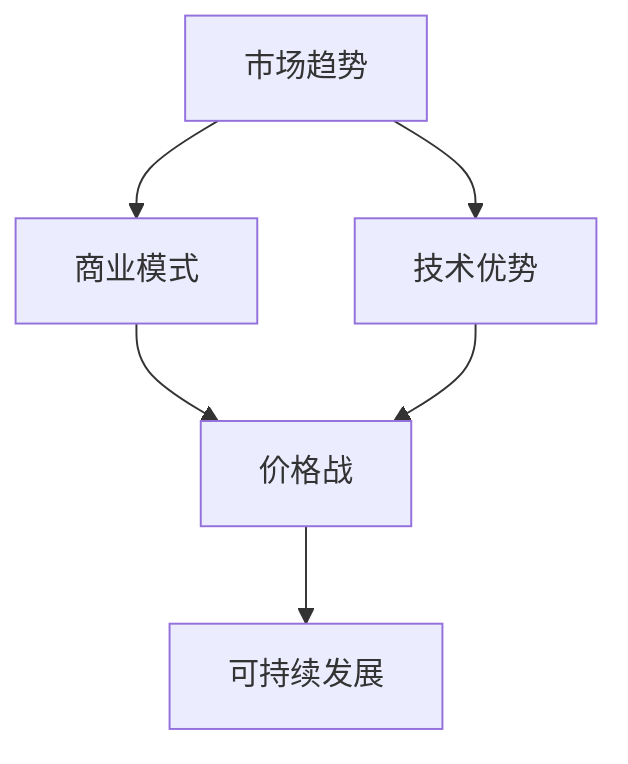

                 

# AI大模型创业：如何应对未来价格战？

> **关键词：** AI大模型、创业、价格战、商业模式、技术优势、市场竞争、可持续发展

> **摘要：** 随着人工智能技术的快速发展，AI大模型在各个领域的应用日益广泛。然而，随之而来的市场竞争和价格战也成为企业面临的重要挑战。本文将探讨AI大模型创业企业如何应对未来价格战，通过深入分析市场趋势、制定有效的商业模式以及提升技术优势等方面，为创业者提供宝贵的策略建议。

## 1. 背景介绍

### 1.1 目的和范围

本文旨在为AI大模型创业企业提供应对未来价格战的策略建议。我们将从市场趋势、商业模式和技术优势等方面展开分析，旨在帮助创业者更好地理解市场环境，制定有效的竞争策略，以实现可持续发展。

### 1.2 预期读者

本文面向AI大模型创业者和对人工智能领域感兴趣的企业家、技术专家。读者应具备一定的AI基础知识和市场分析能力，以便更好地理解文章内容。

### 1.3 文档结构概述

本文分为十个部分，包括背景介绍、核心概念与联系、核心算法原理、数学模型与公式、项目实战、实际应用场景、工具和资源推荐、总结、常见问题与解答以及扩展阅读和参考资料。结构清晰，便于读者逐步深入理解文章主题。

### 1.4 术语表

#### 1.4.1 核心术语定义

- **AI大模型**：基于深度学习技术，拥有大规模参数和广泛应用的神经网络模型。
- **创业**：创立新企业，通过创新和商业模式的实施，实现盈利和增长。
- **价格战**：企业通过降低产品或服务价格来争夺市场份额的一种竞争策略。

#### 1.4.2 相关概念解释

- **商业模式**：企业如何创造、传递和获取价值。
- **技术优势**：企业在技术领域相对于竞争对手的独特优势。

#### 1.4.3 缩略词列表

- **AI**：人工智能
- **ML**：机器学习
- **DL**：深度学习
- **NLP**：自然语言处理

## 2. 核心概念与联系

在探讨AI大模型创业如何应对未来价格战之前，我们首先需要了解相关的核心概念和联系。以下是一个简化的Mermaid流程图，展示了AI大模型创业的核心概念和相互关系。



### 2.1 市场趋势

市场趋势是影响AI大模型创业成功的关键因素之一。以下是对市场趋势的简要分析：

- **行业增长**：人工智能行业整体呈快速增长态势，AI大模型技术成为行业热点。
- **市场需求**：各行各业对AI大模型的需求不断上升，为企业提供了广阔的市场空间。
- **竞争态势**：市场上已有大量企业涉足AI大模型领域，竞争日益激烈。

### 2.2 商业模式

商业模式是AI大模型创业企业获取成功的重要因素。以下是对商业模式的核心要素进行分析：

- **价值创造**：企业需要明确AI大模型的应用场景，创造独特的价值。
- **客户群体**：了解目标客户群体的需求和痛点，提供个性化的解决方案。
- **盈利模式**：根据企业的资源和能力，选择合适的盈利模式，如订阅服务、一次性收费等。

### 2.3 技术优势

技术优势是企业在市场竞争中脱颖而出的关键。以下是对技术优势的核心要素进行分析：

- **算法优化**：不断优化算法，提高模型的性能和效率。
- **数据积累**：积累大量高质量的数据，为模型训练提供有力支持。
- **技术积累**：持续进行技术创新，保持技术领先地位。

### 2.4 价格战

价格战是市场竞争中的一种常见策略，但对企业来说具有双重影响。以下是对价格战的优缺点进行分析：

- **优点**：通过降低价格，快速占领市场份额，提高品牌知名度。
- **缺点**：可能导致企业盈利能力下降，影响技术创新和发展。

### 2.5 可持续发展

可持续发展是企业长期发展的关键。以下是对可持续发展的核心要素进行分析：

- **盈利能力**：通过多元化的商业模式和持续的技术创新，实现稳定盈利。
- **品牌影响力**：建立强大的品牌影响力，提高市场竞争力。
- **社会责任**：关注社会和环境问题，承担企业社会责任。

## 3. 核心算法原理 & 具体操作步骤

在了解核心概念和联系后，我们接下来将深入探讨AI大模型的核心算法原理和具体操作步骤。以下是AI大模型算法原理的简要概述。

### 3.1 深度学习算法

深度学习是AI大模型的核心技术之一。以下是对深度学习算法的基本原理进行讲解。

#### 3.1.1 神经网络结构

神经网络由多层神经元组成，包括输入层、隐藏层和输出层。每个神经元通过权重和偏置与相邻层神经元连接。

```python
# 神经网络结构示例
input_layer = [x1, x2, x3]
hidden_layer = [y1, y2]
output_layer = [z1, z2]
```

#### 3.1.2 前向传播

前向传播是神经网络处理输入数据的过程。输入数据经过输入层，通过权重和偏置传递到隐藏层和输出层。

```python
# 前向传播伪代码
for x in input_layer:
    hidden_layer = activation_function(sum(weights * x + bias))
output_layer = activation_function(sum(weights * hidden_layer + bias))
```

#### 3.1.3 反向传播

反向传播是神经网络训练的过程。根据输出层的误差，反向传播误差到隐藏层和输入层，调整权重和偏置。

```python
# 反向传播伪代码
for x in input_layer:
    hidden_error = output_error * activation_derivative(hidden_layer)
    output_error = hidden_error * activation_derivative(output_layer)
    weights -= learning_rate * output_error
    bias -= learning_rate * output_error
```

### 3.2 大模型训练步骤

以下是AI大模型训练的基本步骤：

#### 3.2.1 数据预处理

对训练数据进行预处理，包括数据清洗、归一化和数据增强等。

```python
# 数据预处理伪代码
train_data = preprocess_data(data)
```

#### 3.2.2 模型初始化

初始化模型参数，包括权重和偏置。

```python
# 模型初始化伪代码
weights = initialize_weights()
bias = initialize_bias()
```

#### 3.2.3 前向传播

进行前向传播，计算输出结果。

```python
# 前向传播伪代码
output = forward_propagation(input_data, weights, bias)
```

#### 3.2.4 反向传播

进行反向传播，计算误差，更新模型参数。

```python
# 反向传播伪代码
error = compute_error(output, target)
weights, bias = update_parameters(error, weights, bias)
```

#### 3.2.5 模型评估

使用验证数据集对模型进行评估，计算模型准确率、召回率等指标。

```python
# 模型评估伪代码
accuracy = evaluate_model(validation_data, model)
```

#### 3.2.6 模型优化

根据评估结果，调整模型参数，优化模型性能。

```python
# 模型优化伪代码
model = optimize_model(model, validation_data)
```

## 4. 数学模型和公式 & 详细讲解 & 举例说明

在AI大模型训练过程中，数学模型和公式起着至关重要的作用。以下是对主要数学模型和公式的详细讲解，并结合实际例子进行说明。

### 4.1 损失函数

损失函数用于衡量模型输出结果与真实值之间的差距，是模型训练的重要指标。常见的损失函数包括均方误差（MSE）、交叉熵损失（Cross-Entropy Loss）等。

#### 4.1.1 均方误差（MSE）

均方误差是回归问题中最常用的损失函数，计算输出值与真实值之间差的平方的平均值。

$$
MSE = \frac{1}{n} \sum_{i=1}^{n} (y_i - \hat{y}_i)^2
$$

其中，$y_i$为真实值，$\hat{y}_i$为预测值，$n$为样本数量。

#### 4.1.2 交叉熵损失（Cross-Entropy Loss）

交叉熵损失是分类问题中最常用的损失函数，计算真实标签与预测概率之间的差异。

$$
Cross-Entropy Loss = -\sum_{i=1}^{n} y_i \log(\hat{y}_i)
$$

其中，$y_i$为真实标签，$\hat{y}_i$为预测概率。

### 4.2 激活函数

激活函数用于引入非线性关系，使神经网络能够拟合复杂的函数。常见的激活函数包括 sigmoid、ReLU、Tanh等。

#### 4.2.1 Sigmoid函数

Sigmoid函数将输入映射到$(0, 1)$区间，常用于二分类问题。

$$
sigmoid(x) = \frac{1}{1 + e^{-x}}
$$

#### 4.2.2 ReLU函数

ReLU函数将输入大于零的部分映射到零，常用于深层神经网络。

$$
ReLU(x) = \max(0, x)
$$

#### 4.2.3 Tanh函数

Tanh函数将输入映射到$(-1, 1)$区间，具有较好的平滑性。

$$
Tanh(x) = \frac{e^x - e^{-x}}{e^x + e^{-x}}
$$

### 4.3 反向传播算法

反向传播算法是神经网络训练的核心，用于更新模型参数，以最小化损失函数。

#### 4.3.1 前向传播

前向传播计算模型输出，通过权重和偏置传递输入信息。

$$
\hat{y}_i = \sigma(W \cdot x_i + b)
$$

其中，$\sigma$为激活函数，$W$为权重矩阵，$b$为偏置向量，$x_i$为输入特征。

#### 4.3.2 反向传播

反向传播计算损失函数关于模型参数的梯度，并根据梯度更新参数。

$$
\frac{\partial L}{\partial W} = X\frac{\partial L}{\partial \hat{y}} \odot \frac{\partial \hat{y}}{\partial W}
$$

$$
\frac{\partial L}{\partial b} = \frac{\partial L}{\partial \hat{y}} \odot \frac{\partial \hat{y}}{\partial b}
$$

其中，$L$为损失函数，$X$为输入特征矩阵，$\odot$为Hadamard乘积。

### 4.4 实际例子

假设我们有一个简单的神经网络，输入特征为$x_1, x_2$，输出为$y$。我们使用ReLU函数作为激活函数，交叉熵损失作为损失函数。

#### 4.4.1 模型初始化

初始化权重矩阵$W$和偏置向量$b$。

$$
W = \begin{bmatrix} 0.1 & 0.2 \\ 0.3 & 0.4 \end{bmatrix}, \quad b = \begin{bmatrix} 0.1 \\ 0.2 \end{bmatrix}
$$

#### 4.4.2 前向传播

计算模型输出。

$$
\hat{y} = ReLU(W \cdot \begin{bmatrix} x_1 \\ x_2 \end{bmatrix} + b) = \begin{bmatrix} 0 \\ 0 \end{bmatrix}
$$

#### 4.4.3 反向传播

计算损失函数关于模型参数的梯度。

$$
\frac{\partial L}{\partial W} = \begin{bmatrix} x_1 & x_2 \end{bmatrix} \odot \begin{bmatrix} 0 \\ 0 \end{bmatrix} = \begin{bmatrix} 0 & 0 \\ 0 & 0 \end{bmatrix}
$$

$$
\frac{\partial L}{\partial b} = \begin{bmatrix} 0 \\ 0 \end{bmatrix} \odot \begin{bmatrix} 0 \\ 0 \end{bmatrix} = \begin{bmatrix} 0 \\ 0 \end{bmatrix}
$$

#### 4.4.4 参数更新

根据梯度更新模型参数。

$$
W = W - learning_rate \cdot \frac{\partial L}{\partial W} = \begin{bmatrix} 0.1 & 0.2 \\ 0.3 & 0.4 \end{bmatrix} - learning_rate \cdot \begin{bmatrix} 0 & 0 \\ 0 & 0 \end{bmatrix} = \begin{bmatrix} 0.1 & 0.2 \\ 0.3 & 0.4 \end{bmatrix}
$$

$$
b = b - learning_rate \cdot \frac{\partial L}{\partial b} = \begin{bmatrix} 0.1 \\ 0.2 \end{bmatrix} - learning_rate \cdot \begin{bmatrix} 0 \\ 0 \end{bmatrix} = \begin{bmatrix} 0.1 \\ 0.2 \end{bmatrix}
$$

## 5. 项目实战：代码实际案例和详细解释说明

在本节中，我们将通过一个实际案例，详细讲解AI大模型创业项目中的代码实现、代码解读与分析。以下是项目实战的详细介绍。

### 5.1 开发环境搭建

在开始项目实战之前，我们需要搭建合适的开发环境。以下是一个简单的开发环境搭建步骤：

1. 安装Python 3.x版本，推荐使用Anaconda，以便管理依赖库。
2. 安装深度学习框架，如TensorFlow或PyTorch。
3. 安装其他必要的库，如NumPy、Pandas、Matplotlib等。

### 5.2 源代码详细实现和代码解读

下面是一个简单的AI大模型项目示例，用于实现一个基于深度学习的手写数字识别任务。我们将对该项目的代码进行详细解读。

#### 5.2.1 数据集加载

首先，我们从Keras库中加载MNIST手写数字数据集。

```python
from tensorflow.keras.datasets import mnist
(x_train, y_train), (x_test, y_test) = mnist.load_data()
```

#### 5.2.2 数据预处理

对数据进行预处理，包括归一化和数据增强。

```python
x_train = x_train / 255.0
x_test = x_test / 255.0
x_train = x_train.reshape(-1, 28, 28, 1)
x_test = x_test.reshape(-1, 28, 28, 1)
```

#### 5.2.3 模型定义

定义一个简单的卷积神经网络模型。

```python
from tensorflow.keras.models import Sequential
from tensorflow.keras.layers import Conv2D, MaxPooling2D, Flatten, Dense

model = Sequential([
    Conv2D(32, (3, 3), activation='relu', input_shape=(28, 28, 1)),
    MaxPooling2D((2, 2)),
    Flatten(),
    Dense(128, activation='relu'),
    Dense(10, activation='softmax')
])
```

#### 5.2.4 模型编译

编译模型，指定优化器和损失函数。

```python
model.compile(optimizer='adam', loss='sparse_categorical_crossentropy', metrics=['accuracy'])
```

#### 5.2.5 模型训练

训练模型，设置训练轮次。

```python
model.fit(x_train, y_train, epochs=5, batch_size=32, validation_split=0.1)
```

#### 5.2.6 模型评估

评估模型在测试集上的性能。

```python
test_loss, test_acc = model.evaluate(x_test, y_test)
print(f"Test accuracy: {test_acc:.2f}")
```

### 5.3 代码解读与分析

下面是对上述代码的详细解读与分析：

1. **数据集加载**：使用Keras库加载MNIST手写数字数据集，该数据集包含了70,000个训练样本和10,000个测试样本，每个样本是一个28x28的灰度图像。

2. **数据预处理**：将图像数据归一化到[0, 1]区间，并调整形状为(28, 28, 1)，以便输入到卷积神经网络。

3. **模型定义**：定义一个简单的卷积神经网络模型，包括卷积层、池化层、全连接层和输出层。卷积层用于提取图像特征，全连接层用于分类。

4. **模型编译**：编译模型，指定优化器（adam）和损失函数（sparse_categorical_crossentropy），并添加准确率作为评估指标。

5. **模型训练**：训练模型，设置训练轮次（epochs）和批量大小（batch_size），并将10%的数据用作验证集。

6. **模型评估**：评估模型在测试集上的性能，输出测试准确率。

通过上述代码，我们可以实现一个简单但有效的手写数字识别模型，这只是一个AI大模型项目的起点。在实际创业过程中，创业者需要根据具体需求，设计和实现更复杂、更高效的模型。

### 5.4 代码解读与分析

在本小节中，我们将对5.2节中的代码进行深入解读与分析，以理解其主要功能、性能优化和潜在改进。

#### 5.4.1 主要功能

- **数据加载**：使用`mnist.load_data()`函数加载数据集，返回训练集和测试集的图像和标签。
- **数据预处理**：归一化数据，将像素值从[0, 255]缩放到[0, 1]区间，并将图像的形状调整为(28, 28, 1)，以匹配模型的输入层要求。
- **模型定义**：创建一个序列模型，并添加以下层：
  - **卷积层（Conv2D）**：32个3x3的卷积核，激活函数为ReLU。
  - **池化层（MaxPooling2D）**：使用2x2的最大池化。
  - **全连接层（Flatten）**：将卷积层的输出展平为一维向量。
  - **全连接层（Dense）**：128个神经元，激活函数为ReLU。
  - **输出层（Dense）**：10个神经元，激活函数为softmax，用于多分类。

- **模型编译**：配置模型，使用`compile`方法设置优化器（`adam`），损失函数（`sparse_categorical_crossentropy`），和评估指标（`accuracy`）。

- **模型训练**：使用`fit`方法训练模型，包括设置训练轮次（`epochs`）、批量大小（`batch_size`）和验证集比例（`validation_split`）。

- **模型评估**：使用`evaluate`方法评估模型在测试集上的性能，返回测试损失和测试准确率。

#### 5.4.2 性能优化

- **批量大小（batch_size）**：批量大小对训练效率有显著影响。较小批量大

