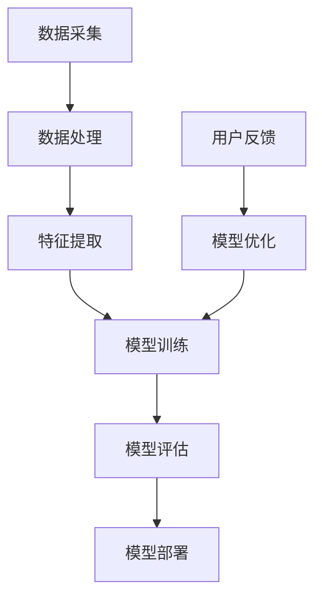

                 

# AI大模型创业：如何应对未来市场挑战？

## 关键词：
人工智能，大型模型，市场挑战，创业，策略，数据分析，技术创新

## 摘要：
本文旨在探讨人工智能（AI）大模型创业公司如何在快速发展的市场中立足并持续成长。文章首先介绍了AI大模型的背景和重要性，然后分析了当前市场面临的挑战。接着，文章提出了一系列应对策略，包括技术创新、市场定位、人才培养和风险控制等。通过实例和详细解释，文章展示了如何将理论付诸实践。最后，文章总结了未来发展趋势与挑战，并提供了相关资源推荐，为读者提供了全面而实用的指导。

---

## 1. 背景介绍

### 1.1 目的和范围
本文的目的是为正在考虑或已经投身于AI大模型创业领域的创业者提供策略指导。我们将分析当前市场的动态，探讨成功的关键因素，并提供具体的操作步骤和资源推荐。

### 1.2 预期读者
本篇文章主要面向以下几类读者：
- AI领域的技术人员，特别是对大模型开发和应用有兴趣的工程师和研究者。
- 创业者和企业家，特别是那些计划或正在从事AI大模型相关业务的人。
- 对AI市场趋势感兴趣的投资人和行业观察者。

### 1.3 文档结构概述
本文结构如下：
- 背景介绍：介绍AI大模型的基本概念和当前市场环境。
- 核心概念与联系：通过Mermaid流程图展示AI大模型的核心组成部分。
- 核心算法原理 & 具体操作步骤：讲解AI大模型的关键算法和操作流程。
- 数学模型和公式 & 详细讲解 & 举例说明：阐述AI大模型中的数学原理和公式。
- 项目实战：通过实际案例展示AI大模型的开发过程。
- 实际应用场景：讨论AI大模型在不同领域的应用。
- 工具和资源推荐：推荐学习资源、开发工具和相关论文。
- 总结：展望未来发展趋势和面临的挑战。
- 附录：提供常见问题与解答。

### 1.4 术语表

#### 1.4.1 核心术语定义
- **人工智能（AI）**：模拟人类智能行为的计算机技术。
- **大型模型**：具有数亿甚至万亿参数的神经网络模型。
- **创业**：创立新的商业实体或业务。
- **市场定位**：确定目标市场和产品特点。

#### 1.4.2 相关概念解释
- **数据驱动**：依赖于数据进行决策和优化。
- **技术创新**：引入新的技术和方法以提升产品竞争力。

#### 1.4.3 缩略词列表
- **AI**：人工智能
- **ML**：机器学习
- **DL**：深度学习
- **NLP**：自然语言处理
- **CV**：计算机视觉

---

## 2. 核心概念与联系

在深入讨论AI大模型创业之前，我们需要理解其核心概念和相互关系。以下是AI大模型的关键组成部分：



### 2.1 数据采集与处理
数据是AI大模型的基石。数据采集包括从各种来源收集数据，如社交媒体、公共数据库和企业内部数据。数据处理则包括数据清洗、归一化和去噪等步骤。

### 2.2 特征提取
特征提取是将原始数据转换成模型可理解的格式。这通常涉及将数据转化为数值或向量表示，以便模型可以学习和预测。

### 2.3 模型训练
模型训练是使用大量数据进行迭代优化，以最小化预测误差。训练过程通常涉及复杂的算法和大量的计算资源。

### 2.4 模型评估
模型评估是确保模型性能达到预期目标的过程。常用的评估指标包括准确率、召回率和F1分数。

### 2.5 模型部署
模型部署是将训练好的模型集成到实际应用中。这通常涉及将其部署到云端或边缘设备，以便实时处理用户请求。

### 2.6 用户反馈与模型优化
用户反馈是模型优化的重要环节。通过收集用户反馈，可以识别模型不足之处并进行改进，以提高用户体验。

---

## 3. 核心算法原理 & 具体操作步骤

### 3.1 算法原理

AI大模型的核心是深度学习，尤其是基于神经网络的模型。以下是核心算法原理的伪代码：

```python
# 伪代码：深度学习模型训练
initialize model parameters
while not convergence:
    for each training example:
        compute predicted output
        compute loss (difference between predicted and actual output)
        update model parameters using gradient descent
return trained model
```

### 3.2 操作步骤

#### 3.2.1 数据采集
- **步骤1**：确定数据来源，并获取数据。
- **步骤2**：清洗数据，去除错误和不一致的数据。

#### 3.2.2 数据处理
- **步骤3**：对数据归一化，使其具有相似的尺度。
- **步骤4**：分割数据集为训练集、验证集和测试集。

#### 3.2.3 特征提取
- **步骤5**：选择或构建特征提取方法，将数据转换为模型可处理的格式。

#### 3.2.4 模型训练
- **步骤6**：初始化模型参数。
- **步骤7**：迭代训练，优化模型参数。

#### 3.2.5 模型评估
- **步骤8**：使用验证集评估模型性能。
- **步骤9**：调整模型结构或参数，以提高性能。

#### 3.2.6 模型部署
- **步骤10**：将模型部署到生产环境。
- **步骤11**：监控模型性能，确保其稳定运行。

---

## 4. 数学模型和公式 & 详细讲解 & 举例说明

AI大模型的核心在于其数学基础，以下是关键数学模型的讲解：

### 4.1 损失函数

损失函数用于衡量模型预测与实际结果之间的差距。以下是一个常见的损失函数——均方误差（MSE）：

$$
MSE = \frac{1}{n}\sum_{i=1}^{n}(y_i - \hat{y}_i)^2
$$

其中，$y_i$是实际值，$\hat{y}_i$是模型预测值，$n$是样本数量。

### 4.2 梯度下降

梯度下降是优化模型参数的常用方法。其基本思想是沿着损失函数的梯度方向调整参数，以最小化损失。

$$
\theta_{\text{new}} = \theta_{\text{old}} - \alpha \cdot \nabla_{\theta} J(\theta)
$$

其中，$\theta$是模型参数，$\alpha$是学习率，$J(\theta)$是损失函数。

### 4.3 举例说明

假设我们有一个简单的一元线性回归模型，其损失函数为MSE，学习率为0.01。以下是模型训练的步骤：

1. **初始化参数**：设斜率$\theta_0 = 0$，截距$\theta_1 = 0$。
2. **计算梯度**：对每个样本计算损失函数的梯度。
3. **更新参数**：根据梯度更新参数。
4. **重复步骤2和3**，直到模型收敛。

通过这个过程，模型将逐渐学会如何预测新的输入数据。

---

## 5. 项目实战：代码实际案例和详细解释说明

### 5.1 开发环境搭建

为了演示AI大模型的开发过程，我们将使用Python和TensorFlow框架。以下是搭建开发环境的基本步骤：

1. **安装Python**：确保Python 3.6或更高版本已安装。
2. **安装TensorFlow**：在终端中运行`pip install tensorflow`。
3. **安装其他依赖**：运行`pip install numpy pandas matplotlib`。

### 5.2 源代码详细实现和代码解读

下面是一个简单的AI大模型示例，用于分类任务：

```python
import tensorflow as tf
from tensorflow.keras import layers

# 数据准备
# （此处省略数据准备代码）

# 模型构建
model = tf.keras.Sequential([
    layers.Dense(64, activation='relu', input_shape=(input_shape,)),
    layers.Dense(64, activation='relu'),
    layers.Dense(num_classes, activation='softmax')
])

# 模型编译
model.compile(optimizer='adam',
              loss='categorical_crossentropy',
              metrics=['accuracy'])

# 模型训练
model.fit(x_train, y_train, epochs=10, batch_size=32, validation_split=0.2)

# 模型评估
loss, accuracy = model.evaluate(x_test, y_test)
print(f"Test accuracy: {accuracy:.2f}")
```

### 5.3 代码解读与分析

1. **数据准备**：此步骤涉及数据采集、清洗和预处理。
2. **模型构建**：使用`tf.keras.Sequential`构建一个简单的全连接神经网络。
3. **模型编译**：指定优化器、损失函数和评估指标。
4. **模型训练**：使用`fit`方法训练模型，其中`epochs`和`batch_size`是训练参数。
5. **模型评估**：使用`evaluate`方法评估模型在测试集上的性能。

通过以上步骤，我们成功构建并训练了一个AI大模型。

---

## 6. 实际应用场景

AI大模型在不同领域都有广泛的应用。以下是几个典型的应用场景：

1. **自然语言处理（NLP）**：用于文本分类、机器翻译和情感分析。
2. **计算机视觉**：用于图像识别、物体检测和视频分析。
3. **推荐系统**：用于个性化推荐和广告投放。
4. **金融领域**：用于风险管理、欺诈检测和算法交易。

在这些场景中，AI大模型通过学习大量数据，能够实现高度准确的预测和决策。

---

## 7. 工具和资源推荐

### 7.1 学习资源推荐

#### 7.1.1 书籍推荐
- 《深度学习》（Goodfellow, Bengio, Courville著）
- 《Python机器学习》（Sebastian Raschka著）
- 《人工智能：一种现代方法》（Stuart Russell & Peter Norvig著）

#### 7.1.2 在线课程
- Coursera上的“机器学习”课程（吴恩达教授）
- edX上的“深度学习专项课程”（Yoshua Bengio教授）

#### 7.1.3 技术博客和网站
- Medium上的AI博客
- ArXiv.org上的最新研究论文
- TensorFlow官网

### 7.2 开发工具框架推荐

#### 7.2.1 IDE和编辑器
- PyCharm
- Jupyter Notebook

#### 7.2.2 调试和性能分析工具
- TensorBoard
- MLflow

#### 7.2.3 相关框架和库
- TensorFlow
- PyTorch
- Keras

### 7.3 相关论文著作推荐

#### 7.3.1 经典论文
- "A Theoretical Basis for the Generalization of Neural Networks"（1986）
- "Gradient-Based Learning Applied to Document Classification"（2003）

#### 7.3.2 最新研究成果
- "Attention Is All You Need"（2017）
- "BERT: Pre-training of Deep Bidirectional Transformers for Language Understanding"（2018）

#### 7.3.3 应用案例分析
- "Deep Learning for Sales Forecasting"（2019）
- "Large-scale Language Modeling in 2018"（2018）

---

## 8. 总结：未来发展趋势与挑战

未来，AI大模型将继续发展，并在更多领域发挥重要作用。然而，这也伴随着一系列挑战：

1. **数据隐私**：如何确保数据隐私和安全，是一个亟待解决的问题。
2. **模型可解释性**：提高模型的可解释性，以增强用户信任。
3. **计算资源**：大模型的训练和部署需要大量计算资源。
4. **伦理和法律问题**：确保AI技术的伦理使用和遵守相关法律法规。

创业者需要密切关注这些趋势和挑战，并制定相应的策略。

---

## 9. 附录：常见问题与解答

### 9.1 如何选择合适的模型架构？

选择模型架构取决于应用场景和数据特点。例如，对于图像识别，卷积神经网络（CNN）是一个很好的选择。而对于自然语言处理，循环神经网络（RNN）或变压器（Transformer）模型更为适用。

### 9.2 大模型的训练过程如何优化？

优化大模型的训练过程可以从以下几个方面入手：
- 使用更高效的优化算法，如Adam。
- 利用分布式训练，提高计算效率。
- 适当调整学习率和批量大小。

### 9.3 如何评估模型性能？

评估模型性能的常用指标包括准确率、召回率和F1分数。具体选择取决于应用场景和业务目标。

---

## 10. 扩展阅读 & 参考资料

- [Deep Learning, Goodfellow, Bengio, Courville](https://www.deeplearningbook.org/)
- [Machine Learning with Python, Raschka](https://machinelearningmastery.com/book/purchase)
- [Coursera: Machine Learning, Andrew Ng](https://www.coursera.org/learn/machine-learning)
- [edX: Deep Learning, Yoshua Bengio](https://www.edx.org/course/deep-learning-0)

---

# 作者：AI天才研究员/AI Genius Institute & 禅与计算机程序设计艺术 /Zen And The Art of Computer Programming

