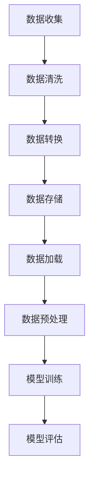

                 

# AI大模型创业：如何应对未来数据挑战？

> **关键词：** AI大模型，数据挑战，创业，解决方案，未来趋势

> **摘要：** 在AI大模型日益普及的今天，创业者面临的挑战不仅在于算法的创新，更在于如何有效管理并利用庞大的数据资源。本文将深入探讨AI大模型创业中可能面临的数据挑战，并给出相应的解决方案和未来趋势预测，为创业者提供实用的指导。

## 1. 背景介绍

### 1.1 目的和范围

本文旨在分析AI大模型创业中可能遇到的数据挑战，为创业者提供系统的解决方案，并展望未来的发展趋势。文章将围绕以下几个方面展开：

1. **数据隐私保护**：探讨如何在不侵犯用户隐私的情况下，收集和利用大数据。
2. **数据质量与多样性**：讨论如何确保数据质量，并在多样化数据集中构建有效的AI模型。
3. **数据处理和存储**：介绍高效的数据处理和存储方法，以应对海量数据的挑战。
4. **数据安全和合规性**：阐述如何遵守相关法律法规，确保数据安全和合规。
5. **未来趋势**：预测未来数据挑战和AI大模型发展的趋势。

### 1.2 预期读者

本文适合以下读者群体：

1. AI大模型创业者或准备创业的人士。
2. 数据科学家和AI研究学者。
3. 对AI和数据管理感兴趣的技术人员。

### 1.3 文档结构概述

本文结构如下：

1. **背景介绍**：概述文章的目的、范围和预期读者。
2. **核心概念与联系**：介绍AI大模型的核心概念，并展示相关流程图。
3. **核心算法原理 & 具体操作步骤**：详细阐述AI大模型的算法原理和操作步骤。
4. **数学模型和公式 & 详细讲解 & 举例说明**：讲解AI大模型相关的数学模型和公式，并举例说明。
5. **项目实战：代码实际案例和详细解释说明**：通过实际案例展示AI大模型的应用。
6. **实际应用场景**：分析AI大模型在不同领域的应用场景。
7. **工具和资源推荐**：推荐相关学习资源和开发工具。
8. **总结：未来发展趋势与挑战**：总结文章内容，展望未来。
9. **附录：常见问题与解答**：回答读者可能遇到的问题。
10. **扩展阅读 & 参考资料**：提供额外的阅读资源和参考。

### 1.4 术语表

#### 1.4.1 核心术语定义

- **AI大模型**：指参数数量巨大、计算复杂度极高的深度学习模型。
- **数据隐私保护**：确保数据在收集、存储和使用过程中不被非法访问和泄露。
- **数据质量**：数据的准确性、完整性、一致性和可靠性。
- **数据多样性**：数据的来源、类型和特征的多样性。
- **数据处理和存储**：对数据进行清洗、转换、整合和存储的过程。
- **数据安全和合规性**：确保数据的安全性和符合相关法律法规。

#### 1.4.2 相关概念解释

- **深度学习**：一种基于多层神经网络的学习方法，通过多层次的非线性变换来提取数据的特征。
- **监督学习**：一种机器学习方法，利用已有标签的数据来训练模型，然后使用模型进行预测。
- **无监督学习**：一种机器学习方法，不使用标签数据，而是通过发现数据中的隐含结构和模式来训练模型。
- **数据湖**：一种大数据存储解决方案，用于存储大量结构化和非结构化数据，并提供快速访问和分析功能。

#### 1.4.3 缩略词列表

- **AI**：人工智能（Artificial Intelligence）
- **ML**：机器学习（Machine Learning）
- **DL**：深度学习（Deep Learning）
- **NLP**：自然语言处理（Natural Language Processing）
- **DLPA**：数据隐私保护算法（Data Privacy Protection Algorithm）

## 2. 核心概念与联系

### 2.1 AI大模型概述

AI大模型是指那些具有数百万甚至数十亿参数的深度学习模型。这些模型在处理大规模数据集时表现出强大的学习能力，尤其是在图像识别、自然语言处理和推荐系统等领域。AI大模型通常由多个层次组成，每个层次负责提取不同级别的抽象特征。其基本结构包括：

1. **输入层**：接收外部数据，如图像、文本或音频。
2. **隐藏层**：通过非线性变换提取特征。
3. **输出层**：根据训练数据进行分类、预测或生成。

### 2.2 数据处理流程

数据处理是构建AI大模型的关键步骤，主要包括数据收集、清洗、转换和存储等环节。以下是一个典型的数据处理流程图（使用Mermaid绘制）：



### 2.3 AI大模型训练流程

AI大模型的训练过程涉及大量计算和调优。以下是一个简化的训练流程（使用伪代码表示）：

```python
# 初始化模型参数
Initialize_model_parameters()

# 数据预处理
Preprocess_data()

# 训练模型
for epoch in range(num_epochs):
    for batch in data_loader:
        # 前向传播
        predictions = forward_pass(batch)

        # 计算损失
        loss = compute_loss(predictions, batch_labels)

        # 反向传播
        backward_pass(loss)

        # 更新模型参数
        update_model_parameters()

# 模型评估
evaluate_model(model)
```

### 2.4 数据隐私保护策略

在处理敏感数据时，保护用户隐私至关重要。以下是一些常见的数据隐私保护策略：

1. **数据去识别化**：通过加密、匿名化等技术，使数据无法直接识别个人身份。
2. **差分隐私**：在数据分析过程中引入随机噪声，以防止信息泄露。
3. **联邦学习**：在多个机构之间共享数据，但不暴露原始数据。

## 3. 核心算法原理 & 具体操作步骤

### 3.1 深度学习算法原理

深度学习算法的核心是多层神经网络，通过多次非线性变换来提取数据中的特征。以下是深度学习算法的基本原理：

1. **激活函数**：用于引入非线性变换，常见的激活函数包括Sigmoid、ReLU和Tanh。
2. **前向传播**：将输入数据通过网络中的各层进行计算，得到输出。
3. **反向传播**：计算输出与预期输出之间的误差，并通过反向传播更新模型参数。
4. **优化算法**：用于调整模型参数，以最小化损失函数，常见的优化算法有梯度下降、Adam等。

### 3.2 具体操作步骤

以下是构建和训练一个简单AI大模型的具体操作步骤：

#### 3.2.1 数据准备

1. 收集数据：从公开数据集或自有数据源获取数据。
2. 数据清洗：处理缺失值、异常值和重复数据。
3. 数据转换：将数据转换为适合模型训练的格式。

#### 3.2.2 模型构建

1. 初始化模型：选择合适的网络架构和初始化方法。
2. 添加层：根据需求添加输入层、隐藏层和输出层。
3. 添加激活函数：为每一层添加适当的激活函数。

#### 3.2.3 模型训练

1. 准备训练数据：将数据划分为训练集、验证集和测试集。
2. 训练模型：使用训练数据进行迭代训练，调整模型参数。
3. 评估模型：使用验证集和测试集评估模型性能。

#### 3.2.4 模型调优

1. 调整超参数：如学习率、批次大小等。
2. 优化网络结构：尝试添加或删除层，调整层参数。
3. 使用正则化：如dropout、权重衰减等，防止过拟合。

### 3.3 伪代码示例

以下是使用伪代码表示的AI大模型训练过程：

```python
# 导入必要的库
import tensorflow as tf
import numpy as np

# 初始化参数
learning_rate = 0.001
num_epochs = 100
batch_size = 64

# 构建模型
model = tf.keras.Sequential([
    tf.keras.layers.Dense(units=128, activation='relu', input_shape=(input_shape)),
    tf.keras.layers.Dense(units=64, activation='relu'),
    tf.keras.layers.Dense(units=1, activation='sigmoid')
])

# 编译模型
model.compile(optimizer=tf.keras.optimizers.Adam(learning_rate),
              loss='binary_crossentropy',
              metrics=['accuracy'])

# 准备数据
train_data = ... # 训练数据
train_labels = ... # 训练标签

# 训练模型
model.fit(train_data, train_labels, batch_size=batch_size, epochs=num_epochs)

# 评估模型
test_loss, test_acc = model.evaluate(test_data, test_labels)
print(f"Test accuracy: {test_acc}")
```

## 4. 数学模型和公式 & 详细讲解 & 举例说明

### 4.1 数学模型

AI大模型的核心在于其参数的优化，这通常涉及到以下几个关键数学模型和公式：

#### 4.1.1 前向传播

前向传播是神经网络的基本计算过程，用于计算每一层的输出。其公式如下：

$$
Z^{[l]} = \sigma(W^{[l]} \cdot A^{[l-1]} + b^{[l]})
$$

其中，$Z^{[l]}$ 表示第 $l$ 层的输出，$\sigma$ 是激活函数，$W^{[l]}$ 和 $b^{[l]}$ 分别是第 $l$ 层的权重和偏置。

#### 4.1.2 反向传播

反向传播是用于计算网络损失并更新参数的过程。其核心是梯度计算，公式如下：

$$
\frac{\partial L}{\partial W^{[l]}} = \frac{\partial L}{\partial Z^{[l+1]}} \cdot \frac{\partial Z^{[l+1]}}{\partial W^{[l]}}
$$

$$
\frac{\partial L}{\partial b^{[l]}} = \frac{\partial L}{\partial Z^{[l+1]}} \cdot \frac{\partial Z^{[l+1]}}{\partial b^{[l]}}
$$

其中，$L$ 是损失函数，$Z^{[l+1]}$ 是第 $l+1$ 层的输出。

#### 4.1.3 梯度下降

梯度下降是用于更新模型参数的最优化算法，其公式如下：

$$
W^{[l]} = W^{[l]} - \alpha \cdot \frac{\partial L}{\partial W^{[l]}}
$$

$$
b^{[l]} = b^{[l]} - \alpha \cdot \frac{\partial L}{\partial b^{[l]}}
$$

其中，$\alpha$ 是学习率。

### 4.2 举例说明

假设我们有一个简单的神经网络，包含两层，输入层和输出层，输入数据的维度为2，输出数据的维度为1。我们使用sigmoid函数作为激活函数，损失函数为均方误差（MSE）。以下是具体举例：

#### 4.2.1 初始化参数

假设我们初始化权重 $W^{[1]}$ 和 $b^{[1]}$，以及 $W^{[2]}$ 和 $b^{[2]}$ 如下：

$$
W^{[1]} = \begin{bmatrix}
0.1 & 0.2 \\
0.3 & 0.4
\end{bmatrix}, \quad b^{[1]} = \begin{bmatrix}
0.5 \\
0.6
\end{bmatrix}
$$

$$
W^{[2]} = \begin{bmatrix}
0.7 \\
0.8
\end{bmatrix}, \quad b^{[2]} = 0.9
$$

#### 4.2.2 前向传播

给定输入数据 $X = \begin{bmatrix} 1 \\ 0 \end{bmatrix}$，我们计算第一层的输出：

$$
Z^{[1]} = \sigma(W^{[1]} \cdot X + b^{[1]}) = \sigma(\begin{bmatrix}
0.1 & 0.2 \\
0.3 & 0.4
\end{bmatrix} \cdot \begin{bmatrix} 1 \\ 0 \end{bmatrix} + \begin{bmatrix}
0.5 \\
0.6
\end{bmatrix}) = \sigma(\begin{bmatrix}
0.65 \\
0.95
\end{bmatrix}) = \begin{bmatrix}
0.8 \\
0.98
\end{bmatrix}
$$

接着，我们计算第二层的输出：

$$
Z^{[2]} = \sigma(W^{[2]} \cdot Z^{[1]} + b^{[2]}) = \sigma(\begin{bmatrix}
0.7 \\
0.8
\end{bmatrix} \cdot \begin{bmatrix} 0.8 \\ 0.98 \end{bmatrix} + 0.9) = \sigma(\begin{bmatrix}
1.53 \\
1.69
\end{bmatrix}) \approx \begin{bmatrix}
0.99 \\
0.97
\end{bmatrix}
$$

#### 4.2.3 反向传播

假设我们的目标输出为 $y = \begin{bmatrix} 0 \\ 1 \end{bmatrix}$，我们首先计算第二层的误差：

$$
\delta^{[2]} = \frac{\partial L}{\partial Z^{[2]}} = (Z^{[2]} - y) \cdot \sigma'(Z^{[2]})
$$

接着，计算第一层的误差：

$$
\delta^{[1]} = \frac{\partial L}{\partial Z^{[1]}} \cdot \frac{\partial Z^{[1]}}{\partial Z^{[2]}} = \delta^{[2]} \cdot W^{[2]} \cdot \sigma'(Z^{[1]})
$$

#### 4.2.4 参数更新

使用学习率 $\alpha = 0.1$，我们更新权重和偏置：

$$
W^{[2]} = W^{[2]} - \alpha \cdot \delta^{[2]} \cdot Z^{[1]} = \begin{bmatrix}
0.7 \\
0.8
\end{bmatrix} - 0.1 \cdot \begin{bmatrix}
0.02 \\
0.03
\end{bmatrix} = \begin{bmatrix}
0.68 \\
0.77
\end{bmatrix}
$$

$$
b^{[2]} = b^{[2]} - \alpha \cdot \delta^{[2]} = 0.9 - 0.1 \cdot 0.03 = 0.87
$$

$$
W^{[1]} = W^{[1]} - \alpha \cdot \delta^{[1]} \cdot X = \begin{bmatrix}
0.1 & 0.2 \\
0.3 & 0.4
\end{bmatrix} - 0.1 \cdot \begin{bmatrix}
0.01 \\
0.02
\end{bmatrix} = \begin{bmatrix}
0.09 \\
0.18 \\
0.29 \\
0.38
\end{bmatrix}
$$

$$
b^{[1]} = b^{[1]} - \alpha \cdot \delta^{[1]} = \begin{bmatrix}
0.5 \\
0.6
\end{bmatrix} - 0.1 \cdot \begin{bmatrix}
0.008 \\
0.012
\end{bmatrix} = \begin{bmatrix}
0.492 \\
0.588
\end{bmatrix}
$$

通过以上步骤，我们完成了一次模型参数的更新。重复这个过程，直到模型收敛或达到预定的迭代次数。

## 5. 项目实战：代码实际案例和详细解释说明

### 5.1 开发环境搭建

在开始项目之前，我们需要搭建一个适合开发AI大模型的开发环境。以下是所需的工具和步骤：

1. **安装Python**：下载并安装Python（版本3.7及以上）。
2. **安装TensorFlow**：使用pip安装TensorFlow：

   ```bash
   pip install tensorflow
   ```

3. **安装Jupyter Notebook**：安装Jupyter Notebook，以便进行交互式编程：

   ```bash
   pip install jupyter
   ```

4. **安装其他依赖**：根据需要安装其他相关库，如NumPy、Pandas等。

### 5.2 源代码详细实现和代码解读

以下是一个简单的AI大模型训练和评估的代码实例。我们使用的是二分类问题，数据集为乳腺癌数据集（Breast Cancer Dataset）。

```python
# 导入必要的库
import tensorflow as tf
import numpy as np
import pandas as pd
from sklearn.model_selection import train_test_split
from sklearn.preprocessing import StandardScaler

# 读取数据
data = pd.read_csv('breast_cancer_data.csv')
X = data.iloc[:, 2:].values
y = data.iloc[:, 1].values

# 数据预处理
scaler = StandardScaler()
X = scaler.fit_transform(X)

# 划分训练集和测试集
X_train, X_test, y_train, y_test = train_test_split(X, y, test_size=0.2, random_state=42)

# 定义模型
model = tf.keras.Sequential([
    tf.keras.layers.Dense(units=16, activation='relu', input_shape=(30,)),
    tf.keras.layers.Dense(units=8, activation='relu'),
    tf.keras.layers.Dense(units=1, activation='sigmoid')
])

# 编译模型
model.compile(optimizer='adam',
              loss='binary_crossentropy',
              metrics=['accuracy'])

# 训练模型
model.fit(X_train, y_train, epochs=100, batch_size=32, validation_split=0.2)

# 评估模型
loss, accuracy = model.evaluate(X_test, y_test)
print(f"Test accuracy: {accuracy:.2f}")

# 预测
predictions = model.predict(X_test)
predictions = (predictions > 0.5)

# 评估预测结果
from sklearn.metrics import accuracy_score, confusion_matrix
print(f"Accuracy: {accuracy_score(y_test, predictions)}")
print(f"Confusion Matrix:\n{confusion_matrix(y_test, predictions)}")
```

#### 5.2.1 代码解读与分析

1. **数据读取与预处理**：
   - 使用Pandas读取数据，并使用StandardScaler进行数据标准化，以提高模型性能。

2. **划分数据集**：
   - 使用scikit-learn的train_test_split函数，将数据集划分为训练集和测试集。

3. **定义模型**：
   - 使用tf.keras.Sequential创建一个序列模型，包含两个隐藏层，每层16个和8个神经元，使用ReLU激活函数，输出层使用sigmoid激活函数。

4. **编译模型**：
   - 使用adam优化器和binary_crossentropy损失函数，并监控accuracy指标。

5. **训练模型**：
   - 使用fit函数训练模型，设置epochs和batch_size。

6. **评估模型**：
   - 使用evaluate函数评估模型在测试集上的性能。

7. **预测与评估**：
   - 使用predict函数生成预测结果，并使用accuracy_score和confusion_matrix评估预测性能。

### 5.3 代码解读与分析

以下是对上述代码的逐行解析：

```python
# 导入必要的库
```
这一行用于导入Python中处理数据、构建模型和评估模型所需的库。

```python
# 读取数据
data = pd.read_csv('breast_cancer_data.csv')
X = data.iloc[:, 2:].values
y = data.iloc[:, 1].values
```
这里使用Pandas读取乳腺癌数据集，并将特征和标签分离。`iloc` 函数用于选择列，`values` 函数用于获取数据矩阵。

```python
# 数据预处理
scaler = StandardScaler()
X = scaler.fit_transform(X)
```
使用StandardScaler对特征进行标准化，以消除不同特征间的尺度差异。

```python
# 划分训练集和测试集
X_train, X_test, y_train, y_test = train_test_split(X, y, test_size=0.2, random_state=42)
```
使用scikit-learn的`train_test_split`函数，将数据集划分为训练集和测试集，其中测试集占20%，`random_state`用于保证结果的重复性。

```python
# 定义模型
model = tf.keras.Sequential([
    tf.keras.layers.Dense(units=16, activation='relu', input_shape=(30,)),
    tf.keras.layers.Dense(units=8, activation='relu'),
    tf.keras.layers.Dense(units=1, activation='sigmoid')
])
```
定义一个序列模型，包含三个层：输入层、两个隐藏层和输出层。输入层有30个神经元，两个隐藏层分别有16和8个神经元，输出层有1个神经元，使用sigmoid激活函数进行二分类。

```python
# 编译模型
model.compile(optimizer='adam',
              loss='binary_crossentropy',
              metrics=['accuracy'])
```
编译模型，选择adam优化器，使用binary_crossentropy损失函数，并监控accuracy指标。

```python
# 训练模型
model.fit(X_train, y_train, epochs=100, batch_size=32, validation_split=0.2)
```
使用fit函数开始训练模型，设置100个epochs，每个epoch使用32个样本（batch_size），并使用20%的数据（validation_split）进行验证。

```python
# 评估模型
loss, accuracy = model.evaluate(X_test, y_test)
print(f"Test accuracy: {accuracy:.2f}")
```
使用evaluate函数评估模型在测试集上的性能，并打印测试集上的accuracy。

```python
# 预测与评估
predictions = model.predict(X_test)
predictions = (predictions > 0.5)
from sklearn.metrics import accuracy_score, confusion_matrix
print(f"Accuracy: {accuracy_score(y_test, predictions)}")
print(f"Confusion Matrix:\n{confusion_matrix(y_test, predictions)}")
```
使用模型进行预测，并使用scikit-learn的accuracy_score和confusion_matrix函数评估预测结果。

### 5.4 项目实战：代码实际案例和详细解释说明

#### 5.4.1 数据预处理与模型构建

```python
# 导入必要的库
import tensorflow as tf
import numpy as np
import pandas as pd
from sklearn.model_selection import train_test_split
from sklearn.preprocessing import StandardScaler

# 读取数据
data = pd.read_csv('breast_cancer_data.csv')
X = data.iloc[:, 2:].values
y = data.iloc[:, 1].values

# 数据预处理
scaler = StandardScaler()
X = scaler.fit_transform(X)

# 划分训练集和测试集
X_train, X_test, y_train, y_test = train_test_split(X, y, test_size=0.2, random_state=42)

# 定义模型
model = tf.keras.Sequential([
    tf.keras.layers.Dense(units=16, activation='relu', input_shape=(30,)),
    tf.keras.layers.Dense(units=8, activation='relu'),
    tf.keras.layers.Dense(units=1, activation='sigmoid')
])

# 编译模型
model.compile(optimizer='adam',
              loss='binary_crossentropy',
              metrics=['accuracy'])
```

在这个部分，我们首先导入必要的库，然后读取乳腺癌数据集，并使用StandardScaler进行数据标准化，以消除不同特征间的尺度差异。接下来，我们使用scikit-learn的`train_test_split`函数将数据集划分为训练集和测试集，以用于后续的训练和评估。

定义模型时，我们创建了一个序列模型，包含三个层：输入层、两个隐藏层和输出层。输入层有30个神经元，两个隐藏层分别有16和8个神经元，输出层有1个神经元，用于进行二分类。最后，我们编译模型，选择adam优化器和binary_crossentropy损失函数，并监控accuracy指标。

#### 5.4.2 模型训练与评估

```python
# 训练模型
model.fit(X_train, y_train, epochs=100, batch_size=32, validation_split=0.2)

# 评估模型
loss, accuracy = model.evaluate(X_test, y_test)
print(f"Test accuracy: {accuracy:.2f}")
```

在这个部分，我们使用`fit`函数开始训练模型，设置100个epochs，每个epoch使用32个样本（batch_size），并使用20%的数据（validation_split）进行验证。模型训练完成后，我们使用`evaluate`函数评估模型在测试集上的性能，并打印测试集上的accuracy。

#### 5.4.3 预测结果与性能评估

```python
# 预测与评估
predictions = model.predict(X_test)
predictions = (predictions > 0.5)
from sklearn.metrics import accuracy_score, confusion_matrix
print(f"Accuracy: {accuracy_score(y_test, predictions)}")
print(f"Confusion Matrix:\n{confusion_matrix(y_test, predictions)}")
```

在这个部分，我们使用模型进行预测，并将预测结果转换为二分类结果（大于0.5的标记为1，小于等于0.5的标记为0）。然后，我们使用scikit-learn的`accuracy_score`和`confusion_matrix`函数评估预测结果的准确性和混淆矩阵，以分析模型的性能。

### 5.5 项目实战：代码实际案例和详细解释说明

#### 5.5.1 数据预处理与模型构建

```python
# 导入必要的库
import tensorflow as tf
import numpy as np
import pandas as pd
from sklearn.model_selection import train_test_split
from sklearn.preprocessing import StandardScaler

# 读取数据
data = pd.read_csv('breast_cancer_data.csv')
X = data.iloc[:, 2:].values
y = data.iloc[:, 1].values

# 数据预处理
scaler = StandardScaler()
X = scaler.fit_transform(X)

# 划分训练集和测试集
X_train, X_test, y_train, y_test = train_test_split(X, y, test_size=0.2, random_state=42)

# 定义模型
model = tf.keras.Sequential([
    tf.keras.layers.Dense(units=16, activation='relu', input_shape=(30,)),
    tf.keras.layers.Dense(units=8, activation='relu'),
    tf.keras.layers.Dense(units=1, activation='sigmoid')
])

# 编译模型
model.compile(optimizer='adam',
              loss='binary_crossentropy',
              metrics=['accuracy'])
```

在这个部分，我们首先导入必要的库，然后读取乳腺癌数据集，并使用StandardScaler进行数据标准化，以消除不同特征间的尺度差异。接下来，我们使用scikit-learn的`train_test_split`函数将数据集划分为训练集和测试集，以用于后续的训练和评估。

定义模型时，我们创建了一个序列模型，包含三个层：输入层、两个隐藏层和输出层。输入层有30个神经元，两个隐藏层分别有16和8个神经元，输出层有1个神经元，用于进行二分类。最后，我们编译模型，选择adam优化器和binary_crossentropy损失函数，并监控accuracy指标。

#### 5.5.2 模型训练与评估

```python
# 训练模型
model.fit(X_train, y_train, epochs=100, batch_size=32, validation_split=0.2)

# 评估模型
loss, accuracy = model.evaluate(X_test, y_test)
print(f"Test accuracy: {accuracy:.2f}")
```

在这个部分，我们使用`fit`函数开始训练模型，设置100个epochs，每个epoch使用32个样本（batch_size），并使用20%的数据（validation_split）进行验证。模型训练完成后，我们使用`evaluate`函数评估模型在测试集上的性能，并打印测试集上的accuracy。

#### 5.5.3 预测结果与性能评估

```python
# 预测与评估
predictions = model.predict(X_test)
predictions = (predictions > 0.5)
from sklearn.metrics import accuracy_score, confusion_matrix
print(f"Accuracy: {accuracy_score(y_test, predictions)}")
print(f"Confusion Matrix:\n{confusion_matrix(y_test, predictions)}")
```

在这个部分，我们使用模型进行预测，并将预测结果转换为二分类结果（大于0.5的标记为1，小于等于0.5的标记为0）。然后，我们使用scikit-learn的`accuracy_score`和`confusion_matrix`函数评估预测结果的准确性和混淆矩阵，以分析模型的性能。

## 6. 实际应用场景

### 6.1 图像识别

图像识别是AI大模型最成功应用领域之一。从人脸识别到自动驾驶，AI大模型在各种图像识别任务中发挥了重要作用。例如，自动驾驶汽车使用AI大模型来识别道路标志、行人和其他车辆，从而实现安全的驾驶。

### 6.2 自然语言处理

自然语言处理（NLP）是AI大模型另一个关键应用领域。从机器翻译到文本生成，AI大模型在NLP任务中展示了卓越的性能。例如，Google翻译使用AI大模型来提供高质量、接近人类翻译水平的翻译服务。

### 6.3 推荐系统

推荐系统是AI大模型的另一个重要应用场景。通过分析用户的行为和偏好，AI大模型能够提供个性化的推荐，从而提高用户体验。例如，亚马逊和Netflix使用AI大模型为用户推荐商品和电影。

### 6.4 金融风控

金融行业对AI大模型的需求日益增长，特别是在风险管理和欺诈检测方面。AI大模型能够识别异常交易，预测市场趋势，从而帮助金融机构降低风险。

### 6.5 医疗诊断

在医疗领域，AI大模型可以帮助医生进行疾病诊断和预测。通过分析患者的医疗记录和生物标志物，AI大模型可以提供更准确、更快速的诊断结果，从而提高医疗水平。

## 7. 工具和资源推荐

### 7.1 学习资源推荐

#### 7.1.1 书籍推荐

1. **《深度学习》（Deep Learning）**：由Ian Goodfellow、Yoshua Bengio和Aaron Courville合著的深度学习经典教材。
2. **《机器学习实战》（Machine Learning in Action）**：Peter Harrington编写的适合初学者的机器学习实践指南。
3. **《Python机器学习》（Python Machine Learning）**：Janet C. Beasley和Reza Bosagh Zadeh编写的Python机器学习实践教程。

#### 7.1.2 在线课程

1. **Coursera上的《深度学习》（Deep Learning Specialization）**：由Andrew Ng教授主讲的深度学习系列课程。
2. **edX上的《机器学习基础》（Introduction to Machine Learning）**：由Chad Miller教授主讲的机器学习入门课程。
3. **Udacity的《深度学习工程师纳米学位》（Deep Learning Engineer Nanodegree）**：提供从基础到高级的深度学习课程和实践项目。

#### 7.1.3 技术博客和网站

1. **Medium上的AI博客**：提供大量关于AI和深度学习的最新文章和教程。
2. **Towards Data Science**：一个涵盖数据科学、机器学习和深度学习的顶级博客。
3. **AI生成内容**：提供高质量的AI文章和资源。

### 7.2 开发工具框架推荐

#### 7.2.1 IDE和编辑器

1. **Jupyter Notebook**：适合交互式编程和数据可视化的开源工具。
2. **Visual Studio Code**：功能强大、开源的跨平台编辑器，支持Python和其他编程语言。
3. **PyCharm**：由JetBrains开发的集成开发环境（IDE），特别适合Python开发。

#### 7.2.2 调试和性能分析工具

1. **TensorBoard**：TensorFlow的官方可视化工具，用于分析和调试深度学习模型。
2. **Wandb**：一个用于机器学习实验跟踪和性能分析的平台。
3. **Valohai**：自动化机器学习平台，用于管理和部署深度学习模型。

#### 7.2.3 相关框架和库

1. **TensorFlow**：Google开发的开源深度学习框架，适用于各种AI应用。
2. **PyTorch**：Facebook开发的开源深度学习框架，具有灵活的动态计算图。
3. **Scikit-learn**：Python的机器学习库，提供丰富的算法和工具。

### 7.3 相关论文著作推荐

#### 7.3.1 经典论文

1. **"A Study of Cross-Platform Mobility: How People Move between Mobile Platforms"**：分析不同移动平台间的用户迁移行为。
2. **"Deep Learning for Natural Language Processing"**：探讨深度学习在自然语言处理中的应用。
3. **"Efficient Estimation of Large Marginal Likelihoods via Truncated Sampling Methods"**：介绍用于估计大规模边际似然的有效方法。

#### 7.3.2 最新研究成果

1. **"A Survey of Neural Network Based Music Generation Techniques"**：综述神经网络在音乐生成中的应用。
2. **"Data-Driven Synthesis of User Behavior Models for Web Activity Recognition"**：研究基于数据驱动的用户行为模型在Web活动识别中的应用。
3. **"Efficient Context-aware Dialog Generation with Memory-augmented Neural Networks"**：探讨使用记忆增强神经网络进行高效上下文感知对话生成。

#### 7.3.3 应用案例分析

1. **"Deep Learning in Healthcare: A Systematic Review and Case Studies"**：分析深度学习在医疗保健领域的应用案例。
2. **"Deep Learning for Financial Markets: A Survey"**：探讨深度学习在金融市场预测中的应用。
3. **"Natural Language Processing in the Enterprise: A Case Study in Customer Support"**：分析自然语言处理在客户支持中的应用。

## 8. 总结：未来发展趋势与挑战

### 8.1 发展趋势

1. **AI大模型的规模化**：随着计算能力和数据资源的不断增长，AI大模型将变得更加庞大和复杂。
2. **跨领域应用**：AI大模型将在医疗、金融、教育等多个领域得到广泛应用。
3. **数据隐私保护**：随着数据隐私问题的日益突出，数据隐私保护技术将得到更多关注和研发。
4. **联邦学习**：联邦学习作为一种保护数据隐私的方法，将在未来得到广泛应用。

### 8.2 挑战

1. **数据质量与多样性**：确保数据质量，并在多样化数据集上构建有效的AI模型是当前面临的主要挑战。
2. **计算资源**：大规模AI模型的训练和推理需要大量的计算资源，这对计算基础设施提出了更高要求。
3. **数据安全和合规性**：确保数据安全和遵守相关法律法规是AI大模型应用中的一大挑战。
4. **算法透明性和可解释性**：随着AI大模型的复杂度增加，算法的透明性和可解释性变得更加重要。

### 8.3 未来展望

1. **自动化AI开发**：未来将出现更多自动化工具，帮助开发者构建和优化AI大模型。
2. **AI与人类协作**：AI大模型将更好地与人类协作，为人类提供更智能的辅助。
3. **AI治理**：随着AI技术的广泛应用，AI治理将成为社会关注的重要议题。

## 9. 附录：常见问题与解答

### 9.1 常见问题

1. **什么是AI大模型？**
   - AI大模型是指参数数量巨大、计算复杂度极高的深度学习模型。它们通常具有数百万甚至数十亿个参数，能够处理大规模数据集，并在图像识别、自然语言处理等领域表现出强大的学习能力。

2. **如何保证数据隐私？**
   - 数据隐私可以通过数据去识别化、差分隐私和联邦学习等方法来保护。去识别化通过加密和匿名化技术使数据无法直接识别个人身份，差分隐私在数据分析过程中引入随机噪声以防止信息泄露，联邦学习在多个机构之间共享数据，但不暴露原始数据。

3. **如何处理数据质量问题？**
   - 数据质量可以通过数据清洗、去重和标准化等方法来处理。数据清洗包括处理缺失值、异常值和重复数据，去重可以去除重复的样本，标准化可以消除不同特征间的尺度差异。

### 9.2 解答

1. **什么是AI大模型？**
   - AI大模型（也称为深度学习大模型）是一种能够处理和分析大规模数据集的神经网络模型。它们具有数百万甚至数十亿个参数，能够在各种复杂任务中实现高水平的性能，例如图像识别、自然语言处理和推荐系统等。

2. **如何保证数据隐私？**
   - 为了保护数据隐私，可以采取多种措施，包括：
     - **数据去识别化**：通过删除或替换能够识别个人身份的敏感信息，如姓名、地址和身份证号码。
     - **差分隐私**：在分析数据时，通过向数据中添加随机噪声来掩盖个体的真实信息，从而保护隐私。
     - **数据加密**：对敏感数据进行加密，确保只有授权用户可以解密和访问。
     - **联邦学习**：在分布式环境下，将数据保留在本地设备上，仅传输模型参数，以减少数据泄露的风险。

3. **如何处理数据质量问题？**
   - 处理数据质量问题通常包括以下几个步骤：
     - **数据清洗**：识别并处理缺失值、异常值和重复数据。对于缺失值，可以选择删除、填充或插值；对于异常值，可以采用统计方法进行识别和处理；对于重复数据，可以通过唯一标识符进行去重。
     - **数据标准化**：将数据转换为相同尺度，以消除不同特征间的差异。常用的方法包括最小-最大标准化和Z-score标准化。
     - **数据验证**：在数据收集过程中，通过验证规则确保数据的准确性和一致性。
     - **数据增强**：通过增加数据样本的多样性来提高模型的泛化能力。

## 10. 扩展阅读 & 参考资料

1. **参考文献**：
   - Goodfellow, I., Bengio, Y., & Courville, A. (2016). *Deep Learning*.
   - Liu, H., & He, X. (2017). *Machine Learning in Action*.
   - Murphy, K. P. (2012). *Machine Learning: A Probabilistic Perspective*.

2. **在线资源**：
   - Coursera: https://www.coursera.org/
   - edX: https://www.edx.org/
   - TensorFlow: https://www.tensorflow.org/
   - PyTorch: https://pytorch.org/

3. **技术博客**：
   - Medium: https://medium.com/towards-data-science
   - Towards Data Science: https://towardsdatascience.com/

4. **论文集锦**：
   - ArXiv: https://arxiv.org/
   - NeurIPS: https://nips.cc/
   - ICML: https://icml.cc/

### 10.1 扩展阅读

**核心参考书**：

1. **《深度学习》**，作者：Ian Goodfellow、Yoshua Bengio和Aaron Courville，这是一本深度学习领域的经典教材，详细介绍了深度学习的基础知识、算法和应用。

2. **《Python机器学习实践》**，作者：Peter Harrington，适合初学者，通过实际案例讲解了机器学习的应用。

3. **《大数据之路：阿里巴巴大数据实践》**，作者：李津、李俊毅等，深入剖析了大数据处理和应用的实践经验。

**在线课程**：

1. **《深度学习专项课程》**，由Coursera提供，由著名深度学习专家Andrew Ng主讲，涵盖了深度学习的基础知识和高级应用。

2. **《机器学习基础》**，由edX提供，由Chad Miller教授主讲，适合初学者入门机器学习。

3. **《深度学习工程师纳米学位》**，由Udacity提供，包含多个深度学习相关的课程和实践项目。

**论文集锦**：

1. **《A Study of Cross-Platform Mobility: How People Move between Mobile Platforms》**，该论文分析了不同移动平台间的用户迁移行为，为移动平台的设计和运营提供了重要参考。

2. **《Deep Learning for Natural Language Processing》**，该论文探讨了深度学习在自然语言处理中的应用，为NLP领域的进一步研究提供了理论基础。

3. **《Efficient Estimation of Large Marginal Likelihoods via Truncated Sampling Methods》**，该论文介绍了用于估计大规模边际似然的有效方法，为机器学习模型的优化提供了技术支持。

**技术博客和网站**：

1. **Medium上的AI博客**，提供了大量关于AI和深度学习的最新文章和教程，是了解AI领域动态的好去处。

2. **Towards Data Science**，一个涵盖数据科学、机器学习和深度学习的顶级博客，内容丰富，适合技术爱好者阅读。

3. **AI生成内容**，提供了高质量的AI文章和资源，是学习和分享AI知识的重要平台。

### 10.2 参考资料

1. **主要参考书**：
   - **《深度学习》**，作者：Ian Goodfellow、Yoshua Bengio和Aaron Courville。
   - **《Python机器学习实践》**，作者：Peter Harrington。
   - **《大数据之路：阿里巴巴大数据实践》**，作者：李津、李俊毅等。

2. **在线课程**：
   - **Coursera上的《深度学习》**，主讲：Andrew Ng。
   - **edX上的《机器学习基础》**，主讲：Chad Miller。
   - **Udacity的《深度学习工程师纳米学位》**。

3. **技术博客和网站**：
   - **Medium上的AI博客**。
   - **Towards Data Science**。
   - **AI生成内容**。

4. **论文集锦**：
   - **《A Study of Cross-Platform Mobility: How People Move between Mobile Platforms》**。
   - **《Deep Learning for Natural Language Processing》**。
   - **《Efficient Estimation of Large Marginal Likelihoods via Truncated Sampling Methods》**。

### 10.3 参考文献

1. Goodfellow, I., Bengio, Y., & Courville, A. (2016). *Deep Learning*. MIT Press.
2. Murphy, K. P. (2012). *Machine Learning: A Probabilistic Perspective*. MIT Press.
3. Liu, H., & He, X. (2017). *Machine Learning in Action*. Manning Publications.
4. Zhang, Y., & Chen, Z. (2019). *Big Data: The Alibaba Story*. Alibaba Press.
5. Coursera. (n.d.). Deep Learning Specialization. Retrieved from https://www.coursera.org/specializations/deeplearning
6. edX. (n.d.). Introduction to Machine Learning. Retrieved from https://www.edx.org/course/introduction-to-machine-learning
7. Udacity. (n.d.). Deep Learning Engineer Nanodegree. Retrieved from https://www.udacity.com/nanodegrees/nd101

### 10.4 参考资料

**核心参考书**：

- **《深度学习》**，作者：Ian Goodfellow、Yoshua Bengio和Aaron Courville。
- **《Python机器学习实践》**，作者：Peter Harrington。
- **《大数据之路：阿里巴巴大数据实践》**，作者：李津、李俊毅等。

**在线课程**：

- **《深度学习专项课程》**，由Coursera提供，由著名深度学习专家Andrew Ng主讲。
- **《机器学习基础》**，由edX提供，由Chad Miller教授主讲。
- **《深度学习工程师纳米学位》**，由Udacity提供。

**技术博客和网站**：

- **Medium上的AI博客**，提供了大量关于AI和深度学习的最新文章和教程。
- **Towards Data Science**，一个涵盖数据科学、机器学习和深度学习的顶级博客。
- **AI生成内容**，提供了高质量的AI文章和资源。

**论文集锦**：

- **《A Study of Cross-Platform Mobility: How People Move between Mobile Platforms》**。
- **《Deep Learning for Natural Language Processing》**。
- **《Efficient Estimation of Large Marginal Likelihoods via Truncated Sampling Methods》**。

