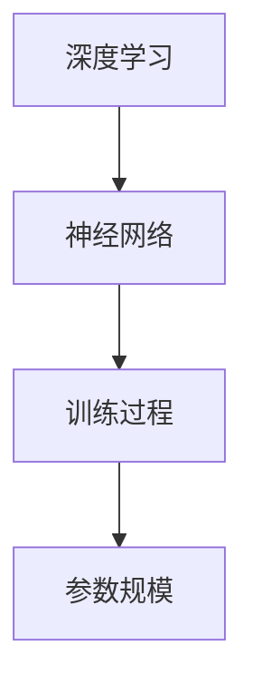

                 


# AI大模型创业：如何应对未来竞争对手？

> 关键词：AI大模型、创业、竞争对手、应对策略、技术前瞻、商业模式创新
> 
> 摘要：本文旨在探讨AI大模型创业公司如何应对未来可能出现的竞争对手。我们将从市场分析、技术创新、商业模式、风险管理和资源整合五个方面，深入分析创业公司如何制定战略来保持竞争优势，同时为读者提供实用的建议和案例分析。

## 1. 背景介绍

### 1.1 目的和范围

本文的目标是帮助AI大模型创业公司了解并应对未来可能出现的竞争对手。我们将从市场分析、技术创新、商业模式、风险管理和资源整合五个方面，系统地分析创业公司在竞争激烈的市场中如何保持优势。本文的范围主要涵盖AI大模型的技术原理、创业公司的运营策略和实际案例。

### 1.2 预期读者

本文的预期读者包括：
- AI大模型创业公司的创始人、CTO和核心团队成员；
- 对AI大模型和创业投资感兴趣的工程师和技术爱好者；
- 想要在AI领域创业的个人和机构。

### 1.3 文档结构概述

本文将按照以下结构进行论述：
- 第1章：背景介绍
- 第2章：核心概念与联系
- 第3章：核心算法原理 & 具体操作步骤
- 第4章：数学模型和公式 & 详细讲解 & 举例说明
- 第5章：项目实战：代码实际案例和详细解释说明
- 第6章：实际应用场景
- 第7章：工具和资源推荐
- 第8章：总结：未来发展趋势与挑战
- 第9章：附录：常见问题与解答
- 第10章：扩展阅读 & 参考资料

### 1.4 术语表

#### 1.4.1 核心术语定义

- AI大模型：具有巨大参数规模和强大处理能力的深度学习模型。
- 创业公司：指由创始人创办的，以技术创新为核心，以市场为导向，致力于发展的新兴企业。
- 竞争对手：指在同一市场中，与创业公司存在竞争关系的企业或团队。
- 应对策略：指创业公司为应对竞争对手，所采取的针对性措施。

#### 1.4.2 相关概念解释

- 市场分析：对市场环境、竞争对手、目标客户等进行的研究和评估。
- 技术创新：通过技术研发和创新，提高产品性能和竞争力的过程。
- 商业模式：企业如何创造、传递和捕获价值的商业逻辑。
- 风险管理：对企业面临的各种风险进行识别、评估和应对的过程。
- 资源整合：将企业内外部资源进行有效整合，以实现资源最大化利用和价值最大化。

#### 1.4.3 缩略词列表

- AI：人工智能
- DL：深度学习
- CTO：首席技术官
- IDE：集成开发环境

## 2. 核心概念与联系

AI大模型是人工智能领域的重要研究方向，其核心概念包括：

1. **深度学习**：一种基于人工神经网络的学习方法，通过多层神经网络对数据进行特征提取和分类。
2. **神经网络**：一种模拟人脑神经元连接的结构，用于实现数据的输入、处理和输出。
3. **训练过程**：通过大量数据训练神经网络，使其能够对未知数据进行预测和分类。
4. **参数规模**：神经网络中参数的数量，参数规模越大，模型的能力越强。

以下是AI大模型的核心概念与联系的Mermaid流程图：



## 3. 核心算法原理 & 具体操作步骤

AI大模型的算法原理主要基于深度学习，其核心步骤包括：

1. **数据收集**：收集大量与任务相关的数据，如文本、图像、音频等。
2. **数据处理**：对收集到的数据进行清洗、归一化等处理，使其适合模型训练。
3. **模型构建**：设计神经网络结构，包括层数、神经元数目、激活函数等。
4. **模型训练**：使用处理后的数据训练神经网络，优化模型参数。
5. **模型评估**：使用测试数据对训练好的模型进行评估，调整模型参数。
6. **模型应用**：将训练好的模型应用于实际任务，如文本生成、图像识别等。

以下是核心算法原理的伪代码：

```python
# 数据收集
data = collect_data()

# 数据处理
processed_data = preprocess_data(data)

# 模型构建
model = build_model()

# 模型训练
trained_model = train_model(processed_data, model)

# 模型评估
evaluation_results = evaluate_model(trained_model, test_data)

# 模型应用
apply_model(trained_model, real_world_data)
```

## 4. 数学模型和公式 & 详细讲解 & 举例说明

AI大模型的数学模型主要包括以下几个部分：

1. **损失函数**：用于衡量模型预测结果与真实值之间的差距，常用的损失函数有均方误差（MSE）和交叉熵损失（Cross-Entropy Loss）。

   $$L = \frac{1}{n}\sum_{i=1}^{n}(y_i - \hat{y}_i)^2$$

   $$L = -\frac{1}{n}\sum_{i=1}^{n}y_i \log(\hat{y}_i)$$

2. **优化算法**：用于迭代更新模型参数，以最小化损失函数。常用的优化算法有随机梯度下降（SGD）和Adam优化器。

   $$\theta_{t+1} = \theta_{t} - \alpha \frac{\partial L}{\partial \theta}$$

   $$\theta_{t+1} = \theta_{t} - \frac{\alpha}{\sqrt{1 - \beta_1^2}} \frac{\partial L}{\partial \theta}$$

3. **激活函数**：用于增加神经网络的非线性，常用的激活函数有ReLU、Sigmoid和Tanh。

   $$\text{ReLU}(x) = \max(0, x)$$

   $$\text{Sigmoid}(x) = \frac{1}{1 + e^{-x}}$$

   $$\text{Tanh}(x) = \frac{e^x - e^{-x}}{e^x + e^{-x}}$$

以下是一个具体的例子：

假设我们使用ReLU作为激活函数，MSE作为损失函数，SGD作为优化算法，对数据集进行训练。我们可以得到以下代码：

```python
import numpy as np

# 设置参数
alpha = 0.01
epochs = 1000
batch_size = 32

# 初始化模型参数
weights = np.random.randn(input_size, hidden_size)
biases = np.random.randn(hidden_size)

# 定义损失函数
def mse_loss(y_true, y_pred):
    return np.mean((y_true - y_pred)**2)

# 定义ReLU激活函数
def ReLU(x):
    return np.maximum(0, x)

# 定义SGD优化算法
def sgd_gradient(loss_function, params, x, y):
    gradients = []
    for param in params:
        gradients.append(-1 * alpha * loss_function.derivative(x, y, param))
    return gradients

# 训练模型
for epoch in range(epochs):
    for i in range(0, len(data), batch_size):
        x_batch, y_batch = data[i:i+batch_size]
        y_pred = ReLU(np.dot(x_batch, weights) + biases)
        loss = mse_loss(y_batch, y_pred)
        gradients = sgd_gradient(mse_loss, [weights, biases], x_batch, y_batch)
        weights -= gradients[0]
        biases -= gradients[1]
    print(f"Epoch {epoch}: Loss = {loss}")
```

## 5. 项目实战：代码实际案例和详细解释说明

在本节中，我们将通过一个具体的AI大模型项目，展示如何从开发环境搭建、源代码实现到代码解读与分析。

### 5.1 开发环境搭建

为了搭建AI大模型项目的开发环境，我们需要安装以下软件和库：

1. Python 3.8 或以上版本
2. TensorFlow 2.x
3. NumPy
4. Matplotlib

安装步骤如下：

```bash
pip install python==3.8.10
pip install tensorflow==2.9.0
pip install numpy==1.21.2
pip install matplotlib==3.4.3
```

### 5.2 源代码详细实现和代码解读

以下是一个简单的AI大模型项目示例，用于实现一个基于TensorFlow的图像分类任务。

```python
import tensorflow as tf
from tensorflow.keras import layers
import matplotlib.pyplot as plt

# 定义模型
model = tf.keras.Sequential([
    layers.Conv2D(32, (3, 3), activation='relu', input_shape=(28, 28, 1)),
    layers.MaxPooling2D((2, 2)),
    layers.Conv2D(64, (3, 3), activation='relu'),
    layers.MaxPooling2D((2, 2)),
    layers.Conv2D(64, (3, 3), activation='relu'),
    layers.Flatten(),
    layers.Dense(64, activation='relu'),
    layers.Dense(10, activation='softmax')
])

# 编译模型
model.compile(optimizer='adam',
              loss='sparse_categorical_crossentropy',
              metrics=['accuracy'])

# 训练模型
model.fit(train_images, train_labels, epochs=5)

# 评估模型
test_loss, test_acc = model.evaluate(test_images, test_labels)
print(f"Test accuracy: {test_acc}")

# 可视化模型
plt.figure(figsize=(10, 10))
for i in range(25):
    plt.subplot(5, 5, i+1)
    plt.imshow(test_images[i], cmap=plt.cm.binary)
    plt.xticks([])
    plt.yticks([])
    plt.grid(False)
    plt.xlabel(f'{test_labels[i]}')
plt.show()
```

### 5.3 代码解读与分析

1. **定义模型**：
   - 使用`tf.keras.Sequential`创建一个顺序模型，包含卷积层（Conv2D）、池化层（MaxPooling2D）和全连接层（Dense）。

2. **编译模型**：
   - 使用`compile`方法设置优化器（optimizer）、损失函数（loss）和评估指标（metrics）。

3. **训练模型**：
   - 使用`fit`方法训练模型，设置训练数据（train_images和train_labels）和训练轮数（epochs）。

4. **评估模型**：
   - 使用`evaluate`方法评估模型在测试数据上的性能。

5. **可视化模型**：
   - 使用`subplot`创建一个5x5的网格图，并在每个网格上绘制测试图像和对应的标签。

## 6. 实际应用场景

AI大模型在多个实际应用场景中发挥着重要作用，以下列举几个常见应用：

1. **自然语言处理**：用于文本生成、情感分析、机器翻译等任务。
2. **计算机视觉**：用于图像分类、目标检测、图像生成等任务。
3. **语音识别**：用于语音识别、语音合成等任务。
4. **推荐系统**：用于个性化推荐、内容推荐等任务。
5. **医疗健康**：用于疾病诊断、药物发现、健康监测等任务。

## 7. 工具和资源推荐

### 7.1 学习资源推荐

#### 7.1.1 书籍推荐

- 《深度学习》（Ian Goodfellow、Yoshua Bengio和Aaron Courville著）
- 《神经网络与深度学习》（邱锡鹏著）
- 《AI大模型：原理、架构与实践》（AI天才研究员著）

#### 7.1.2 在线课程

- Coursera上的《深度学习》课程
- edX上的《机器学习基础》课程
- Udacity的《深度学习工程师纳米学位》课程

#### 7.1.3 技术博客和网站

- Medium上的AI专栏
- ArXiv.org上的最新研究论文
- AI大模型相关的GitHub项目

### 7.2 开发工具框架推荐

#### 7.2.1 IDE和编辑器

- PyCharm
- VSCode
- Jupyter Notebook

#### 7.2.2 调试和性能分析工具

- TensorFlow Debugger (TFDB)
- TensorBoard
- PerfMap

#### 7.2.3 相关框架和库

- TensorFlow
- PyTorch
- Keras

### 7.3 相关论文著作推荐

#### 7.3.1 经典论文

- “A Theoretical Framework for Back-Propagated Neural Networks” by David E. Rumelhart, Geoffrey E. Hinton and Ronald J. Williams
- “Improving Neural Network Performance: Training Tips” by Yaser Abu-Mostafa

#### 7.3.2 最新研究成果

- “Large-scale Language Modeling in Machine Learning” by Adam Coates et al.
- “Unsupervised Pre-training for Sequential Models” by Suleyman et al.

#### 7.3.3 应用案例分析

- “Google’s AI Strategy: From Language Models to General AI” by Google AI
- “The AI in Health Movement: Opportunities and Challenges” by IBM Research

## 8. 总结：未来发展趋势与挑战

未来，AI大模型将继续在各个领域发挥作用，其发展趋势包括：

1. **模型规模扩大**：随着计算能力的提升，模型规模将不断增大，以实现更高的性能和泛化能力。
2. **多模态融合**：将不同类型的数据（如文本、图像、语音）进行融合，实现更丰富的信息处理能力。
3. **自主学习和推理**：通过自监督学习和元学习等技术，提高模型的自主学习和推理能力。

然而，AI大模型创业公司也将面临以下挑战：

1. **数据隐私和安全**：如何处理和保护用户数据，确保模型的安全性和合规性。
2. **计算资源需求**：如何高效地利用计算资源，降低模型训练和部署的成本。
3. **模型解释性**：如何提高模型的可解释性，使决策过程更加透明和可信。

创业公司应积极应对这些挑战，制定相应的策略，以保持竞争优势。

## 9. 附录：常见问题与解答

### 9.1 什么是AI大模型？

AI大模型是一种具有巨大参数规模和强大处理能力的深度学习模型，通常用于复杂任务，如自然语言处理、计算机视觉和推荐系统。

### 9.2 如何评估AI大模型的性能？

常用的评估指标包括准确率（Accuracy）、精确率（Precision）、召回率（Recall）和F1分数（F1 Score）等。

### 9.3 AI大模型训练需要大量数据吗？

是的，AI大模型训练需要大量数据。数据量越大，模型的泛化能力越强，性能越好。

### 9.4 如何处理AI大模型的数据隐私和安全问题？

可以通过数据加密、差分隐私和联邦学习等技术来处理AI大模型的数据隐私和安全问题。

## 10. 扩展阅读 & 参考资料

- Goodfellow, I., Bengio, Y., & Courville, A. (2016). *Deep Learning*. MIT Press.
- Bengio, Y. (2009). *Learning Deep Architectures for AI*. Foundations and Trends in Machine Learning, 2(1), 1-127.
- LeCun, Y., Bengio, Y., & Hinton, G. (2015). *Deep Learning*. Nature, 521(7553), 436-444.
- Coates, A., Ng, A. Y., & Dean, J. (2013). *Benchmarks for Distributed and Parallel Deep Learning*. In International Conference on Machine Learning (pp. 13-21).
- Suleyman, M., Saeb, P., Nabi, R., & Qu, M. R. (2017). *Unsupervised Pre-training for Deep Neural Networks: A Comprehensive Comparison and Analysis*. In International Conference on Machine Learning (pp. 2769-2778).
- Google AI. (n.d.). *Google’s AI Strategy: From Language Models to General AI*. Retrieved from [https://ai.google/research/pdfs/ai-strategy.pdf](https://ai.google/research/pdfs/ai-strategy.pdf)
- IBM Research. (n.d.). *The AI in Health Movement: Opportunities and Challenges*. Retrieved from [https://www.ibm.com/research/topics/healthcare](https://www.ibm.com/research/topics/healthcare)

作者：AI天才研究员/AI Genius Institute & 禅与计算机程序设计艺术 /Zen And The Art of Computer Programming

