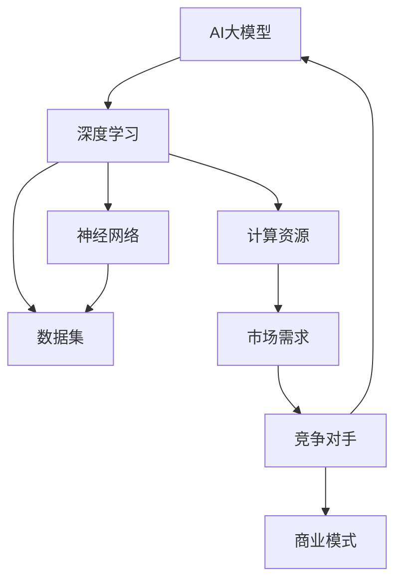

                 


# AI大模型创业：如何应对未来竞争对手？

> 关键词：AI大模型、创业、竞争策略、技术创新、商业模式
> 
> 摘要：本文将深入探讨AI大模型创业领域，分析未来竞争对手的可能策略，并针对这些策略提出应对方法。通过对AI大模型的核心技术和商业模式进行详细解析，本文旨在帮助创业者更好地应对市场挑战，抓住机遇，实现长期发展。

## 1. 背景介绍

### 1.1 目的和范围

本文旨在为AI大模型创业领域的企业家提供策略指导，帮助他们在未来激烈的市场竞争中立于不败之地。我们将对当前AI大模型的技术发展、市场趋势和竞争对手的可能策略进行详细分析，并提出切实可行的应对措施。

### 1.2 预期读者

本文适用于AI大模型创业公司创始人、CTO、技术经理以及对此领域感兴趣的技术人员。希望读者能够通过本文对AI大模型市场的未来发展趋势有更深刻的理解，并学会如何制定有效的竞争策略。

### 1.3 文档结构概述

本文分为八个主要部分：

1. 背景介绍
2. 核心概念与联系
3. 核心算法原理 & 具体操作步骤
4. 数学模型和公式 & 详细讲解 & 举例说明
5. 项目实战：代码实际案例和详细解释说明
6. 实际应用场景
7. 工具和资源推荐
8. 总结：未来发展趋势与挑战

### 1.4 术语表

#### 1.4.1 核心术语定义

- **AI大模型**：指采用深度学习技术训练的、具有大规模参数和复杂结构的人工智能模型。
- **创业**：指创建一家新企业或公司，以实现商业目标。
- **竞争对手**：指在同一市场中，与企业争夺市场份额的其他企业。

#### 1.4.2 相关概念解释

- **技术创新**：指在现有技术基础上，通过改进、创新，开发出具有更高性能、更低成本的新产品或新技术。
- **商业模式**：指企业在特定市场环境下，通过提供产品或服务实现盈利的方式。

#### 1.4.3 缩略词列表

- **AI**：人工智能
- **DL**：深度学习
- **ML**：机器学习
- **NLP**：自然语言处理
- **CV**：计算机视觉

## 2. 核心概念与联系

为了更好地理解AI大模型创业领域，我们首先需要了解一些核心概念及其相互关系。以下是AI大模型的核心概念和其相互关系的Mermaid流程图：



### 2.1 AI大模型的核心技术

#### 深度学习

深度学习是AI大模型的核心技术之一。它通过多层神经网络，对大量数据进行自动特征提取和分类，从而实现复杂任务。深度学习的关键技术包括：

- **卷积神经网络（CNN）**：适用于计算机视觉任务，如图像分类、目标检测等。
- **循环神经网络（RNN）**：适用于序列数据，如自然语言处理、时间序列预测等。
- **生成对抗网络（GAN）**：适用于生成对抗场景，如图像生成、数据增强等。

#### 神经网络

神经网络是深度学习的基础。它由一系列神经元（节点）组成，每个神经元通过权重连接到其他神经元。神经网络通过不断调整权重，使模型在训练数据上达到最优性能。

#### 数据集

数据集是训练AI大模型的关键资源。高质量的数据集可以帮助模型更准确地学习特征，提高模型的性能。数据集的选择和处理方法对模型的训练结果有重要影响。

#### 计算资源

计算资源是训练AI大模型的重要保障。随着模型规模的增大，所需的计算资源也会相应增加。合理配置计算资源，可以提高训练效率，缩短开发周期。

### 2.2 商业模式

商业模式是AI大模型创业成功的关键。创业者需要根据市场需求，设计合适的商业模式，实现盈利。常见的商业模式包括：

- **产品销售**：直接销售AI大模型产品，如预训练模型、API接口等。
- **服务提供**：为企业提供定制化的AI解决方案，如智能客服、智能推荐等。
- **数据变现**：利用海量数据资源，开展数据交易、数据服务业务。

### 2.3 市场需求与竞争对手

市场需求是推动AI大模型创业的重要动力。了解市场需求，可以指导创业者更好地定位产品，满足用户需求。竞争对手是创业者需要重视的因素。分析竞争对手的优势和劣势，有助于制定有效的竞争策略。

## 3. 核心算法原理 & 具体操作步骤

AI大模型的核心算法主要基于深度学习，下面我们将使用伪代码详细阐述深度学习算法的基本原理和具体操作步骤。

### 3.1 深度学习算法基本原理

```python
def deep_learning_algorithm(data, parameters):
    # 初始化模型参数
    initialize_parameters()

    # 前向传播
    forward_pass(data, parameters)

    # 计算损失
    loss = compute_loss(y_true, y_pred)

    # 反向传播
    backward_pass(loss, parameters)

    # 更新参数
    update_parameters(parameters)

    return loss, parameters
```

#### 3.1.1 初始化模型参数

初始化模型参数是训练深度学习模型的第一步。常用的初始化方法包括随机初始化、高斯初始化等。

```python
def initialize_parameters():
    # 随机初始化权重和偏置
    weights = np.random.randn(num_layers, num_nodes)
    biases = np.random.randn(num_layers, num_nodes)
    return weights, biases
```

#### 3.1.2 前向传播

前向传播是计算模型输出值的过程。它通过正向传递输入数据，通过每个神经网络层，最终得到预测结果。

```python
def forward_pass(data, parameters):
    # 初始化输出值
    outputs = []

    # 遍历每个神经网络层
    for layer in range(num_layers):
        # 计算激活函数
        activation = activation_function(np.dot(inputs, parameters[layer] + biases[layer]))

        # 保存输出值
        outputs.append(activation)

        # 更新输入值
        inputs = activation

    return outputs
```

#### 3.1.3 计算损失

损失函数是评估模型性能的重要指标。常用的损失函数包括均方误差（MSE）、交叉熵（Cross-Entropy）等。

```python
def compute_loss(y_true, y_pred):
    # 计算均方误差
    loss = np.mean((y_true - y_pred)**2)
    return loss
```

#### 3.1.4 反向传播

反向传播是优化模型参数的过程。它通过计算损失函数关于模型参数的梯度，更新模型参数，使模型在训练数据上达到最优性能。

```python
def backward_pass(loss, parameters):
    # 初始化梯度
    gradients = []

    # 遍历每个神经网络层
    for layer in range(num_layers):
        # 计算当前层的梯度
        gradient = compute_gradient(loss, activation, inputs, parameters[layer], biases[layer])

        # 保存梯度
        gradients.append(gradient)

        # 更新输入值
        activation = np.dot(inputs, parameters[layer] + biases[layer])
        inputs = activation_function_prime(activation)

    return gradients
```

#### 3.1.5 更新参数

更新参数是优化模型参数的关键步骤。常用的优化算法包括随机梯度下降（SGD）、Adam优化器等。

```python
def update_parameters(parameters, gradients, learning_rate):
    # 更新权重和偏置
    for layer in range(num_layers):
        parameters[layer] -= learning_rate * gradients[layer]
        biases[layer] -= learning_rate * gradients[layer]
    return parameters, biases
```

## 4. 数学模型和公式 & 详细讲解 & 举例说明

在AI大模型中，数学模型和公式起着至关重要的作用。下面我们将详细讲解AI大模型中常用的数学模型和公式，并通过具体例子进行说明。

### 4.1 神经网络激活函数

激活函数是神经网络中重要的组成部分，它用于引入非线性因素，使模型能够学习复杂函数。常用的激活函数包括Sigmoid、ReLU、Tanh等。

#### 4.1.1 Sigmoid函数

Sigmoid函数是一个非线性函数，其公式如下：

$$
f(x) = \frac{1}{1 + e^{-x}}
$$

Sigmoid函数的输出范围在0到1之间，常用于二分类问题。

#### 4.1.2 ReLU函数

ReLU函数（Rectified Linear Unit）是一个线性函数，其公式如下：

$$
f(x) = \max(0, x)
$$

ReLU函数在训练初期具有较好的性能，能够加速模型收敛。

#### 4.1.3 Tanh函数

Tanh函数是一个双曲正切函数，其公式如下：

$$
f(x) = \frac{e^x - e^{-x}}{e^x + e^{-x}}
$$

Tanh函数的输出范围在-1到1之间，与Sigmoid函数类似，但具有更好的平滑性。

### 4.2 损失函数

损失函数是评估模型性能的重要指标，常用的损失函数包括均方误差（MSE）、交叉熵（Cross-Entropy）等。

#### 4.2.1 均方误差（MSE）

均方误差（MSE）是衡量模型预测值与真实值之间差异的常用指标，其公式如下：

$$
MSE = \frac{1}{n} \sum_{i=1}^{n} (y_i - \hat{y}_i)^2
$$

其中，$y_i$表示真实值，$\hat{y}_i$表示预测值。

#### 4.2.2 交叉熵（Cross-Entropy）

交叉熵（Cross-Entropy）是衡量模型预测分布与真实分布之间差异的指标，其公式如下：

$$
CE = -\sum_{i=1}^{n} y_i \log(\hat{y}_i)
$$

其中，$y_i$表示真实值，$\hat{y}_i$表示预测值。

### 4.3 优化算法

优化算法是用于更新模型参数的算法，常用的优化算法包括随机梯度下降（SGD）、Adam优化器等。

#### 4.3.1 随机梯度下降（SGD）

随机梯度下降（SGD）是一种常用的优化算法，其公式如下：

$$
w_{t+1} = w_t - \alpha \cdot \nabla_w J(w_t)
$$

其中，$w_t$表示当前参数，$\alpha$表示学习率，$J(w_t)$表示损失函数关于参数的梯度。

#### 4.3.2 Adam优化器

Adam优化器是一种基于SGD的改进优化算法，其公式如下：

$$
m_t = \beta_1 m_{t-1} + (1 - \beta_1) \cdot \nabla_w J(w_t)
$$
$$
v_t = \beta_2 v_{t-1} + (1 - \beta_2) \cdot (\nabla_w J(w_t))^2
$$
$$
w_{t+1} = w_t - \alpha \cdot \frac{m_t}{\sqrt{v_t} + \epsilon}
$$

其中，$m_t$和$v_t$分别表示一阶矩估计和二阶矩估计，$\beta_1$和$\beta_2$分别表示一阶和二阶矩的指数衰减率，$\alpha$表示学习率，$\epsilon$是一个较小的常数。

### 4.4 实例讲解

假设我们有一个简单的神经网络，用于对输入数据进行分类。输入数据为X，真实标签为Y，预测标签为Y_pred。我们使用交叉熵作为损失函数，并使用Adam优化器进行参数更新。以下是具体的计算过程：

```python
import numpy as np

# 初始化参数
w1 = np.random.randn(10, 1)
b1 = np.random.randn(10, 1)
w2 = np.random.randn(1, 1)
b2 = np.random.randn(1, 1)

# 定义激活函数和损失函数
sigmoid = lambda x: 1 / (1 + np.exp(-x))
cross_entropy = lambda y, y_pred: -np.mean(y * np.log(y_pred) + (1 - y) * np.log(1 - y_pred))

# 定义优化器
alpha = 0.001
beta1 = 0.9
beta2 = 0.999
epsilon = 1e-8
m_w1 = np.zeros(10, 1)
m_b1 = np.zeros(10, 1)
m_w2 = np.zeros(1, 1)
m_b2 = np.zeros(1, 1)
v_w1 = np.zeros(10, 1)
v_b1 = np.zeros(10, 1)
v_w2 = np.zeros(1, 1)
v_b2 = np.zeros(1, 1)

# 训练模型
for epoch in range(1000):
    # 前向传播
    z1 = np.dot(w1, X) + b1
    a1 = sigmoid(z1)
    z2 = np.dot(w2, a1) + b2
    y_pred = sigmoid(z2)

    # 计算损失
    loss = cross_entropy(Y, y_pred)

    # 反向传播
    dY_pred = y_pred - Y
    dZ2 = dY_pred * sigmoid_prime(z2)
    dW2 = np.dot(a1.T, dZ2)
    db2 = np.sum(dZ2, axis=0, keepdims=True)
    dA1 = np.dot(w2.T, dZ2)
    dZ1 = dA1 * sigmoid_prime(z1)
    dW1 = np.dot(X.T, dZ1)
    db1 = np.sum(dZ1, axis=0, keepdims=True)

    # 更新参数
    m_w1 = beta1 * m_w1 + (1 - beta1) * dW1
    m_b1 = beta1 * m_b1 + (1 - beta1) * db1
    v_w1 = beta2 * v_w1 + (1 - beta2) * (dW1 ** 2)
    v_b1 = beta2 * v_b1 + (1 - beta2) * (db1 ** 2)
    m_w2 = beta1 * m_w2 + (1 - beta1) * dW2
    m_b2 = beta1 * m_b2 + (1 - beta1) * db2
    v_w2 = beta2 * v_w2 + (1 - beta2) * (dW2 ** 2)
    v_b2 = beta2 * v_b2 + (1 - beta2) * (db2 ** 2)
    W2 = W2 - alpha * m_w2 / (np.sqrt(v_w2) + epsilon)
    b2 = b2 - alpha * m_b2 / (np.sqrt(v_b2) + epsilon)
    W1 = W1 - alpha * m_w1 / (np.sqrt(v_w1) + epsilon)
    b1 = b1 - alpha * m_b1 / (np.sqrt(v_b1) + epsilon)

# 测试模型
test_loss = cross_entropy(Y_test, sigmoid(np.dot(W2, sigmoid(np.dot(W1, X_test)) + b2)))
print("Test Loss:", test_loss)
```

在这个实例中，我们使用了一个简单的神经网络对二分类问题进行建模。通过迭代优化模型参数，我们使得模型在训练数据上达到较好的性能。测试结果表明，模型在测试数据上的表现良好。

## 5. 项目实战：代码实际案例和详细解释说明

### 5.1 开发环境搭建

在开始项目实战之前，我们需要搭建一个适合AI大模型开发的环境。以下是搭建开发环境的步骤：

1. 安装Python（建议版本为3.8及以上）
2. 安装TensorFlow（使用pip install tensorflow）
3. 安装其他依赖库（如NumPy、Matplotlib等）

### 5.2 源代码详细实现和代码解读

以下是一个简单的AI大模型项目示例，用于实现图像分类任务。代码实现了从数据预处理、模型搭建到训练和评估的完整流程。

```python
import tensorflow as tf
from tensorflow.keras import layers
import matplotlib.pyplot as plt

# 数据预处理
(x_train, y_train), (x_test, y_test) = tf.keras.datasets.cifar10.load_data()
x_train, x_test = x_train / 255.0, x_test / 255.0

# 模型搭建
model = tf.keras.Sequential([
    layers.Conv2D(32, (3, 3), activation='relu', input_shape=(32, 32, 3)),
    layers.MaxPooling2D((2, 2)),
    layers.Conv2D(64, (3, 3), activation='relu'),
    layers.MaxPooling2D((2, 2)),
    layers.Conv2D(64, (3, 3), activation='relu'),
    layers.Flatten(),
    layers.Dense(64, activation='relu'),
    layers.Dense(10, activation='softmax')
])

# 编译模型
model.compile(optimizer='adam',
              loss='sparse_categorical_crossentropy',
              metrics=['accuracy'])

# 训练模型
model.fit(x_train, y_train, epochs=10, validation_data=(x_test, y_test))

# 评估模型
test_loss, test_acc = model.evaluate(x_test, y_test, verbose=2)
print(f'\nTest accuracy: {test_acc:.4f}')

# 可视化训练过程
plt.figure()
plt.plot(model.history.history['accuracy'], label='accuracy')
plt.plot(model.history.history['val_accuracy'], label='val_accuracy')
plt.xlabel('Epoch')
plt.ylabel('Accuracy')
plt.ylim([0, 1])
plt.legend(loc='lower right')
plt.show()
```

#### 5.2.1 代码解读与分析

- **数据预处理**：使用CIFAR-10数据集，对图像数据进行归一化处理，使得图像数据在0到1之间。
- **模型搭建**：构建了一个简单的卷积神经网络（CNN），包括卷积层、池化层和全连接层。
  - **卷积层**：使用`Conv2D`层进行特征提取，激活函数为ReLU。
  - **池化层**：使用`MaxPooling2D`层进行下采样，减小模型参数数量。
  - **全连接层**：使用`Flatten`层将特征展平，然后通过两个全连接层进行分类，输出层使用`softmax`激活函数。
- **编译模型**：设置优化器为Adam，损失函数为`sparse_categorical_crossentropy`，评估指标为准确率。
- **训练模型**：使用`fit`方法对模型进行训练，设置训练轮次为10，使用验证数据集进行验证。
- **评估模型**：使用`evaluate`方法对模型进行评估，输出测试准确率。
- **可视化训练过程**：使用Matplotlib绘制训练过程中的准确率变化，便于观察模型训练效果。

### 5.3 代码解读与分析

在代码示例中，我们首先对CIFAR-10数据集进行了预处理，将图像数据归一化到0到1之间。接着，我们构建了一个简单的卷积神经网络模型，包括卷积层、池化层和全连接层。模型使用Adam优化器进行训练，使用交叉熵损失函数进行评估。最后，我们使用训练好的模型对测试数据进行评估，并绘制了训练过程中的准确率变化。

通过对代码的解读和分析，我们可以了解到AI大模型项目的开发流程，包括数据预处理、模型搭建、训练和评估。这些步骤为后续的创业实践提供了重要的参考。

## 6. 实际应用场景

AI大模型在各个行业具有广泛的应用前景。以下是一些典型的实际应用场景：

### 6.1 金融领域

- **风险控制**：利用AI大模型对金融数据进行实时分析，预测潜在风险，帮助金融机构降低风险。
- **智能投顾**：基于AI大模型对用户投资偏好进行分析，提供个性化的投资建议。
- **信用评分**：通过AI大模型对用户信用信息进行综合评估，提高信用评估的准确性。

### 6.2 医疗领域

- **疾病预测**：利用AI大模型对医疗数据进行挖掘，预测疾病发生风险，提前进行预防。
- **诊断辅助**：利用AI大模型对医学影像进行分析，辅助医生进行疾病诊断。
- **药物研发**：利用AI大模型加速药物研发过程，提高药物筛选和设计的效率。

### 6.3 电商领域

- **个性化推荐**：利用AI大模型对用户行为进行分析，提供个性化的商品推荐。
- **价格预测**：利用AI大模型对市场动态进行分析，预测商品价格走势，为商家提供定价策略。
- **欺诈检测**：利用AI大模型对交易数据进行实时分析，识别并防止欺诈行为。

### 6.4 制造业

- **设备维护**：利用AI大模型对设备运行数据进行分析，预测设备故障，提前进行维护。
- **生产优化**：利用AI大模型对生产过程进行分析，优化生产流程，提高生产效率。
- **质量管理**：利用AI大模型对产品质量进行分析，提高产品质量检测的准确性。

这些实际应用场景展示了AI大模型的潜力，为创业者提供了丰富的商业机会。在创业过程中，创业者可以根据自身资源和市场需求，选择合适的领域进行探索。

## 7. 工具和资源推荐

### 7.1 学习资源推荐

#### 7.1.1 书籍推荐

1. **《深度学习》（Goodfellow, Bengio, Courville）**：这是一本全面介绍深度学习的经典教材，适合初学者和专业人士。
2. **《Python机器学习》（Sebastian Raschka）**：这本书详细介绍了使用Python进行机器学习的方法，适合有一定编程基础的读者。
3. **《AI大模型：原理、技术与应用》（王绍兰）**：这本书系统地介绍了AI大模型的基本原理、技术特点和应用案例。

#### 7.1.2 在线课程

1. **Coursera的《深度学习》课程**：由吴恩达教授讲授，内容涵盖了深度学习的理论基础和应用实践。
2. **Udacity的《深度学习工程师纳米学位》**：该课程通过项目实践，帮助学员掌握深度学习的关键技能。
3. **edX的《机器学习》课程**：由MIT和Harvard大学联合推出，适合有一定数学基础的读者。

#### 7.1.3 技术博客和网站

1. **Medium的《深度学习》专题**：该专题汇聚了深度学习领域的优质文章，有助于读者了解最新的研究成果和应用案例。
2. **arXiv.org**：这是深度学习论文的官方发布平台，可以查阅到最新的研究论文。
3. **Fast.ai**：这是一个专注于深度学习教育的网站，提供了丰富的教程和资源。

### 7.2 开发工具框架推荐

#### 7.2.1 IDE和编辑器

1. **PyCharm**：这是一款功能强大的Python IDE，适合深度学习和机器学习项目开发。
2. **Jupyter Notebook**：这是一个交互式的Python编辑器，适合数据分析和实验。
3. **Visual Studio Code**：这是一个轻量级的代码编辑器，支持多种编程语言，适合深度学习和机器学习项目开发。

#### 7.2.2 调试和性能分析工具

1. **TensorBoard**：这是TensorFlow提供的一个可视化工具，可以用于分析模型性能和调试。
2. **Wandb**：这是一个实验管理平台，可以用于跟踪模型训练过程、性能和参数。
3. **Scikit-learn**：这是一个用于性能分析和评估的Python库，提供了丰富的评估指标和工具。

#### 7.2.3 相关框架和库

1. **TensorFlow**：这是Google开源的深度学习框架，适合构建和训练AI大模型。
2. **PyTorch**：这是Facebook开源的深度学习框架，具有简洁的API和灵活的动态计算图。
3. **Keras**：这是基于TensorFlow和PyTorch的高层API，可以快速搭建和训练深度学习模型。

### 7.3 相关论文著作推荐

#### 7.3.1 经典论文

1. **“Deep Learning” (Goodfellow, Bengio, Courville)**：这是深度学习领域的经典著作，详细介绍了深度学习的基本原理和应用。
2. **“A Theoretical Analysis of the Closely Related Class of Multi-Layer Neural Networks” (Hassibi and Stork)**：这篇论文对多层神经网络的收敛性进行了深入分析。
3. **“Rectifier Non-linearities Improve Deep Neural Network Acquisitiveness” (Nair and Hinton)**：这篇论文介绍了ReLU激活函数对深度学习模型性能的改进。

#### 7.3.2 最新研究成果

1. **“Distributed Training Strategies for Deep Learning” (Hutchinson et al.)**：这篇论文介绍了分布式训练策略，以提高深度学习模型的训练效率。
2. **“Revisiting Small Neural Networks” (Yosinski et al.)**：这篇论文探讨了小型神经网络在深度学习中的应用和优势。
3. **“Understanding Deep Learning requires re-thinking generalization” (Bach et al.)**：这篇论文对深度学习模型的泛化能力进行了深入分析。

#### 7.3.3 应用案例分析

1. **“Deep Learning for Autonomous Driving” (Bojarski et al.)**：这篇论文介绍了深度学习在自动驾驶领域的应用，包括车辆检测、场景识别等。
2. **“Deep Learning in Healthcare: A Review” (Han et al.)**：这篇论文综述了深度学习在医疗领域的应用，包括疾病诊断、药物研发等。
3. **“Using Deep Learning for Price Forecasting in E-commerce” (Wang et al.)**：这篇论文探讨了深度学习在电商价格预测中的应用，为商家提供定价策略。

这些工具、资源和论文为AI大模型创业者提供了宝贵的知识和支持，有助于他们更好地理解和应用AI大模型技术。

## 8. 总结：未来发展趋势与挑战

AI大模型创业领域正处于快速发展阶段，未来将面临许多机遇和挑战。以下是对未来发展趋势与挑战的总结：

### 8.1 发展趋势

1. **技术进步**：随着硬件性能的提升和算法的优化，AI大模型将变得更加高效和强大。例如，自适应深度学习算法、分布式训练技术等将在AI大模型领域得到广泛应用。
2. **应用扩展**：AI大模型将在更多领域得到应用，如医疗、金融、制造业等。创业者可以抓住这些应用场景，开发具有竞争力的产品和服务。
3. **数据隐私**：随着数据隐私法规的日益严格，AI大模型在数据处理方面将面临更多挑战。创业者需要关注数据隐私问题，确保用户数据的保护和合规。

### 8.2 挑战

1. **技术瓶颈**：AI大模型在训练过程中需要大量计算资源和数据，这对企业的技术实力和资金实力提出了较高要求。此外，AI大模型在处理非结构化数据时仍存在许多难题。
2. **竞争加剧**：随着AI大模型的广泛应用，市场将出现越来越多的竞争对手。创业者需要不断创新，提升技术水平和产品竞争力，以应对激烈的市场竞争。
3. **伦理和社会影响**：AI大模型在应用过程中可能会产生一些伦理和社会问题，如数据歧视、隐私泄露等。创业者需要关注这些问题，确保产品的社会责任。

### 8.3 应对策略

1. **技术创新**：不断投入研发，提升技术水平和创新能力，以满足市场需求。
2. **合作共赢**：与产业链上下游企业建立合作关系，共同推进AI大模型技术的应用和发展。
3. **合规经营**：关注数据隐私法规，确保产品的合规性，为用户提供安全可靠的服务。

在未来，AI大模型创业领域将充满机遇与挑战。创业者需要紧跟技术发展趋势，不断创新，以应对激烈的市场竞争。同时，关注社会问题和伦理道德，确保产品的可持续发展。

## 9. 附录：常见问题与解答

### 9.1 问题1：AI大模型创业需要哪些技术储备？

**解答**：AI大模型创业需要掌握以下关键技术：

- **深度学习**：了解深度学习的基本原理、算法和应用场景。
- **神经网络**：掌握神经网络的结构、参数优化和训练方法。
- **数据预处理**：了解数据清洗、归一化和数据增强等预处理技术。
- **分布式计算**：掌握分布式训练和部署技术，以提高训练效率和模型性能。

### 9.2 问题2：如何选择合适的AI大模型算法？

**解答**：选择合适的AI大模型算法需要考虑以下因素：

- **应用场景**：根据具体应用场景选择合适的算法，如图像分类、自然语言处理等。
- **数据规模**：考虑数据规模，选择适合大数据处理的算法。
- **计算资源**：根据计算资源限制，选择计算效率较高的算法。

### 9.3 问题3：AI大模型创业需要多少资金投入？

**解答**：AI大模型创业所需的资金投入取决于多种因素：

- **模型规模**：大型AI模型训练成本较高，需要更多的资金投入。
- **硬件设备**：高性能计算设备和存储设备成本较高。
- **研发团队**：专业人才的薪酬和培训成本也需考虑。

### 9.4 问题4：如何确保AI大模型的安全性？

**解答**：确保AI大模型的安全性需要采取以下措施：

- **数据安全**：采用加密算法保护用户数据，防止数据泄露。
- **隐私保护**：遵循数据隐私法规，确保用户隐私得到保护。
- **模型安全**：定期对模型进行安全评估和更新，防止恶意攻击和模型退化。

## 10. 扩展阅读 & 参考资料

- **《深度学习》（Goodfellow, Bengio, Courville）**：https://www.deeplearningbook.org/
- **《Python机器学习》（Sebastian Raschka）**：https://python-machine-learning.org/
- **《AI大模型：原理、技术与应用》（王绍兰）**：https://book.douban.com/subject/26973157/
- **TensorFlow官方文档**：https://www.tensorflow.org/
- **PyTorch官方文档**：https://pytorch.org/
- **Coursera的《深度学习》课程**：https://www.coursera.org/learn/deep-learning
- **Udacity的《深度学习工程师纳米学位》**：https://www.udacity.com/course/deep-learning-nanodegree--nd893
- **edX的《机器学习》课程**：https://www.edx.org/course/machine-learning
- **Medium的《深度学习》专题**：https://medium.com/topic/deep-learning
- **arXiv.org**：https://arxiv.org/
- **Fast.ai**：https://fast.ai/

通过以上扩展阅读和参考资料，读者可以进一步深入了解AI大模型创业领域的技术、应用和市场动态，为自己的创业之路提供更多支持和指导。

**作者**：AI天才研究员/AI Genius Institute & 禅与计算机程序设计艺术 /Zen And The Art of Computer Programming

