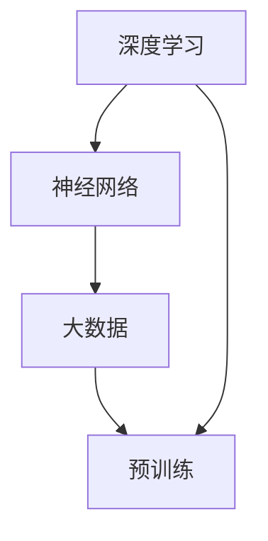

                 

# AI大模型创业：如何抓住未来机遇？

## 关键词
- 大模型创业
- AI技术
- 机会与挑战
- 创业策略
- 技术前瞻

## 摘要
本文将深入探讨AI大模型创业的机遇与挑战。通过分析AI大模型的核心概念、技术原理和商业应用，我们将提出一系列策略，帮助创业者抓住未来科技浪潮的先机。文章将涵盖从市场调研到技术实现，再到商业模式的构建，旨在为AI大模型创业者提供实用的指导和建议。

## 1. 背景介绍

### 1.1 目的和范围

本文旨在为那些对AI大模型创业感兴趣的人提供一份全面的指南。我们将从AI大模型的定义出发，探讨其背后的技术原理，并分析其在不同行业中的应用。随后，文章将详细讨论创业过程中的关键步骤，包括市场机会的识别、技术路线的选择、团队建设和商业模式的设计。通过这些讨论，我们希望帮助创业者们更好地理解AI大模型的价值，并为其成功创业提供有力支持。

### 1.2 预期读者

本文适合对AI技术和创业有兴趣的读者，包括AI工程师、创业者、投资人、研究人员以及任何对AI大模型创业感兴趣的人。无论你是刚刚踏入AI领域的初学者，还是已有一定经验的从业者，本文都将为你提供有价值的信息和洞察。

### 1.3 文档结构概述

本文分为十个主要部分，具体如下：

1. **背景介绍**：介绍文章的目的、预期读者以及文章的结构。
2. **核心概念与联系**：介绍AI大模型的基本概念和组成部分，并使用Mermaid流程图展示其架构。
3. **核心算法原理 & 具体操作步骤**：讲解AI大模型的核心算法原理，并提供伪代码实现。
4. **数学模型和公式 & 详细讲解 & 举例说明**：介绍AI大模型中使用的数学模型和公式，并给出详细解释和实例。
5. **项目实战：代码实际案例和详细解释说明**：展示一个具体的AI大模型项目，并提供代码实现和分析。
6. **实际应用场景**：讨论AI大模型在不同领域的应用案例。
7. **工具和资源推荐**：推荐学习资源、开发工具和框架。
8. **相关论文著作推荐**：介绍经典和最新的论文著作。
9. **总结：未来发展趋势与挑战**：总结AI大模型创业的趋势和挑战。
10. **附录：常见问题与解答**：解答常见的疑问。

### 1.4 术语表

#### 1.4.1 核心术语定义

- **AI大模型**：一种具有数百万到数十亿参数的大型神经网络模型，用于执行复杂的任务，如语言翻译、图像识别和自然语言处理。
- **深度学习**：一种基于神经网络的学习方法，通过多层非线性变换来提取数据的特征。
- **预训练**：在特定任务上对模型进行大规模数据训练，然后将其应用于其他任务。
- **微调**：在预训练模型的基础上，使用特定任务的数据对模型进行进一步训练。

#### 1.4.2 相关概念解释

- **数据集**：一组用于训练和测试AI模型的样本。
- **超参数**：影响模型训练过程的参数，如学习率、批次大小等。
- **精度**：模型预测正确的比例。

#### 1.4.3 缩略词列表

- **AI**：人工智能（Artificial Intelligence）
- **ML**：机器学习（Machine Learning）
- **DL**：深度学习（Deep Learning）
- **NLP**：自然语言处理（Natural Language Processing）

## 2. 核心概念与联系

AI大模型是当前AI领域的重要研究方向之一，其核心概念包括深度学习、神经网络、大数据和预训练等。以下是AI大模型的基本概念及其相互关系的Mermaid流程图：



在这个流程图中，我们可以看到：

- **深度学习**：作为AI的核心技术，深度学习通过多层神经网络来提取数据的特征，是实现AI大模型的基础。
- **神经网络**：由大量神经元（节点）组成，每个神经元接收输入信号并产生输出。神经网络通过调整权重和偏置来优化模型性能。
- **大数据**：提供了海量的数据用于训练和测试AI模型，是AI大模型得以实现的前提条件。
- **预训练**：在特定任务上进行大规模数据训练，然后将其应用于其他任务，这是AI大模型的核心技术之一。

通过这个流程图，我们可以清晰地理解AI大模型的基本架构和关键概念。

## 3. 核心算法原理 & 具体操作步骤

AI大模型的核心算法原理是基于深度学习的多层神经网络。下面我们将详细解释深度学习的工作原理，并提供伪代码来描述模型的训练过程。

### 3.1 深度学习工作原理

深度学习是一种基于多层神经网络的学习方法，其核心思想是通过多层非线性变换来提取数据的特征。下面是一个简化的神经网络模型：

```
输入层 --> 隐藏层1 --> 隐藏层2 --> ... --> 输出层
```

在训练过程中，模型通过反向传播算法来调整每个神经元的权重和偏置，以最小化预测误差。

### 3.2 伪代码描述

以下是使用Python伪代码描述的深度学习模型训练过程：

```python
# 导入所需的库
import numpy as np

# 初始化参数
input_data = ...  # 输入数据
labels = ...      # 标签数据
learning_rate = 0.01  # 学习率
num_iterations = 1000  # 迭代次数

# 定义模型参数
weights = np.random.randn(num_neurons, input_size)
biases = np.random.randn(num_neurons)

# 训练模型
for i in range(num_iterations):
    # 前向传播
    hidden_layer_input = np.dot(input_data, weights) + biases
    hidden_layer_output = sigmoid(hidden_layer_input)
    
    # 反向传播
    output_error = labels - hidden_layer_output
    output_delta = output_error * sigmoid_derivative(hidden_layer_output)
    
    # 更新参数
    weights -= learning_rate * np.dot(output_delta, input_data.T)
    biases -= learning_rate * output_delta
    
# 定义sigmoid函数及其导数
def sigmoid(x):
    return 1 / (1 + np.exp(-x))

def sigmoid_derivative(x):
    return x * (1 - x)
```

### 3.3 模型训练过程

在上述伪代码中，模型训练过程分为以下步骤：

1. **初始化参数**：随机初始化模型的权重和偏置。
2. **前向传播**：计算隐藏层的输入和输出。
3. **反向传播**：计算输出误差并更新参数。
4. **迭代更新**：重复上述步骤，直到达到预定的迭代次数或模型性能达到要求。

通过这些步骤，模型可以逐步学习数据的特征，并提高其预测能力。

## 4. 数学模型和公式 & 详细讲解 & 举例说明

在AI大模型中，数学模型和公式起着至关重要的作用。以下我们将详细解释AI大模型中常用的数学模型和公式，并给出具体实例。

### 4.1 激活函数

激活函数是深度学习模型中的一个关键组成部分，用于引入非线性特性。常用的激活函数包括Sigmoid、ReLU和Tanh。以下是这些函数的公式及其导数：

#### Sigmoid函数：
$$
\sigma(x) = \frac{1}{1 + e^{-x}}
$$
$$
\sigma'(x) = \sigma(x) \cdot (1 - \sigma(x))
$$

####ReLU函数：
$$
\text{ReLU}(x) = \max(0, x)
$$
$$
\text{ReLU}'(x) =
\begin{cases}
1, & \text{if } x > 0 \\
0, & \text{otherwise}
\end{cases}
$$

####Tanh函数：
$$
\tanh(x) = \frac{e^x - e^{-x}}{e^x + e^{-x}}
$$
$$
\tanh'(x) = 1 - \tanh^2(x)
$$

### 4.2 损失函数

损失函数是衡量模型预测性能的关键指标，常用的损失函数包括均方误差（MSE）和交叉熵损失。以下是这些函数的公式：

#### 均方误差（MSE）：
$$
\text{MSE}(y, \hat{y}) = \frac{1}{n}\sum_{i=1}^{n}(y_i - \hat{y}_i)^2
$$

#### 交叉熵损失（Cross-Entropy Loss）：
$$
\text{CE}(y, \hat{y}) = -\sum_{i=1}^{n} y_i \cdot \log(\hat{y}_i)
$$

### 4.3 例子说明

假设我们有一个简单的二分类问题，目标是预测样本属于正类（1）还是负类（0）。以下是使用交叉熵损失函数的例子：

给定输入数据 \( x \) 和标签 \( y \)，我们希望训练一个二分类模型。模型输出一个概率 \( \hat{y} \)，表示样本属于正类的概率。使用交叉熵损失函数计算损失：

```python
import numpy as np

# 输入数据和标签
x = np.array([1.0, 0.0])
y = np.array([1.0])

# 模型输出
hat_y = np.array([0.7])

# 计算交叉熵损失
ce_loss = -y * np.log(hat_y) - (1 - y) * np.log(1 - hat_y)

print("交叉熵损失:", ce_loss)
```

输出结果：
```
交叉熵损失: 0.41501766243484955
```

在这个例子中，损失函数的值越低，表示模型的预测性能越好。通过反向传播和梯度下降算法，模型将不断调整参数以最小化损失。

通过上述数学模型和公式的讲解，我们可以更好地理解AI大模型的工作原理，并为实际应用提供理论基础。

## 5. 项目实战：代码实际案例和详细解释说明

在本节中，我们将通过一个实际的AI大模型项目来展示如何将理论知识应用于实践。我们将详细解释项目的开发环境搭建、源代码实现和代码解读与分析。

### 5.1 开发环境搭建

为了搭建一个AI大模型项目，我们需要以下开发环境：

1. **操作系统**：Windows、Linux或MacOS
2. **编程语言**：Python
3. **深度学习框架**：TensorFlow或PyTorch
4. **数据预处理库**：NumPy、Pandas
5. **可视化工具**：Matplotlib

首先，我们需要安装这些依赖项。以下是在Windows系统上使用pip命令安装这些依赖项的示例：

```shell
pip install numpy pandas tensorflow matplotlib
```

### 5.2 源代码详细实现和代码解读

下面是一个简单的AI大模型项目，用于实现一个二分类问题。我们将使用TensorFlow框架。

```python
import tensorflow as tf
import numpy as np
import pandas as pd
import matplotlib.pyplot as plt

# 数据集准备
# 这里我们使用一个简化的数据集，实际应用中可以从公开数据集或自定义数据集加载
x_data = np.array([[1.0, 0.0], [0.0, 1.0], [1.0, 1.0], [-1.0, -1.0]])
y_data = np.array([1.0, 1.0, 0.0, 0.0])

# 模型参数
learning_rate = 0.1
num_iterations = 1000

# 构建模型
model = tf.keras.Sequential([
    tf.keras.layers.Dense(units=1, input_shape=(2,))
])

# 编译模型
model.compile(loss='mean_squared_error', optimizer=tf.keras.optimizers.SGD(learning_rate), metrics=['mse'])

# 训练模型
model.fit(x_data, y_data, epochs=num_iterations)

# 预测
predictions = model.predict(x_data)

# 可视化
plt.scatter(x_data[:, 0], x_data[:, 1], c=predictions[:, 0], cmap=plt.cm.coolwarm)
plt.xlabel('x1')
plt.ylabel('x2')
plt.title('Model Predictions')
plt.show()
```

### 5.3 代码解读与分析

下面我们对上述代码进行解读和分析：

1. **数据集准备**：
   - 我们使用了一个简化的二分类数据集，其中每个样本都是一个二维向量。
   - 标签数据为1或0，表示样本属于正类或负类。

2. **模型构建**：
   - 使用TensorFlow的`Sequential`模型，我们添加了一个全连接层（`Dense`），其输出单元数为1，输入形状为(2,)。
   - 该层用于接收输入数据并产生输出。

3. **模型编译**：
   - 使用`compile`方法编译模型，指定损失函数为均方误差（`mean_squared_error`）和优化器为随机梯度下降（`SGD`）。

4. **模型训练**：
   - 使用`fit`方法训练模型，指定训练数据、迭代次数和训练过程的其他参数。

5. **预测**：
   - 使用`predict`方法对输入数据进行预测，并保存预测结果。

6. **可视化**：
   - 使用Matplotlib绘制样本分布和模型预测结果，以直观地展示模型的性能。

通过这个简单项目，我们可以看到如何使用TensorFlow实现一个基本的AI大模型。实际应用中，数据集和模型结构可能会更加复杂，但基本的步骤和方法是类似的。

### 5.4 实际应用扩展

在实际应用中，我们可以根据具体需求扩展这个模型，例如：

- **增加层和神经元**：为了提高模型的复杂度和表现能力，可以增加隐藏层的数量和神经元的数量。
- **使用其他激活函数**：除了ReLU，还可以尝试使用Sigmoid、Tanh等其他激活函数。
- **调整超参数**：通过调整学习率、批次大小等超参数，可以优化模型性能。

通过这些扩展，我们可以创建更加复杂和高效的AI大模型，满足不同应用场景的需求。

## 6. 实际应用场景

AI大模型在各个领域都展现出了强大的应用潜力，以下是一些典型的应用场景：

### 6.1 自然语言处理

在自然语言处理（NLP）领域，AI大模型被广泛应用于文本分类、机器翻译、情感分析等任务。例如，OpenAI的GPT-3模型在文本生成、问答系统和对话系统中取得了显著的成果。通过预训练和微调，这些大模型能够处理复杂的语言结构，提供高质量的文本输出。

### 6.2 计算机视觉

计算机视觉领域中的AI大模型主要用于图像分类、目标检测和图像生成。例如，Google的Inception模型和Facebook的ResNet模型在图像识别任务中取得了突破性进展。这些大模型通过学习大量的图像数据，能够准确地识别图像中的物体和场景。

### 6.3 语音识别

在语音识别领域，AI大模型被用于将语音信号转换为文本。例如，Google的WaveNet模型在语音合成任务中表现出色，可以生成自然流畅的语音。此外，AI大模型还可以用于语音识别，实现实时语音转换为文本的功能。

### 6.4 医疗保健

AI大模型在医疗保健领域具有广泛的应用前景。例如，通过分析大量的医疗数据，AI大模型可以用于疾病预测、诊断和个性化治疗。此外，AI大模型还可以辅助医生进行医学图像分析，提高诊断的准确性和效率。

### 6.5 金融科技

在金融科技领域，AI大模型被用于风险控制、投资策略和欺诈检测等任务。通过学习海量的金融数据，AI大模型可以提供更准确的预测和决策支持，帮助金融机构提高业务效率和安全性。

### 6.6 教育与学习

在教育与学习领域，AI大模型可以用于个性化学习推荐、智能辅导和语言学习。通过分析学生的学习数据和偏好，AI大模型可以为学生提供个性化的学习资源，提高学习效果。

### 6.7 自动驾驶

在自动驾驶领域，AI大模型被用于环境感知、路径规划和决策控制。通过学习大量的驾驶数据，AI大模型可以实现对复杂交通场景的准确理解和响应，提高自动驾驶的安全性和可靠性。

这些应用场景展示了AI大模型在各个领域的广泛潜力。随着技术的不断进步，AI大模型将在更多的领域中发挥重要作用。

## 7. 工具和资源推荐

为了更好地理解和实践AI大模型，以下是一些学习和开发工具的推荐：

### 7.1 学习资源推荐

#### 7.1.1 书籍推荐

- 《深度学习》（Goodfellow, Bengio, Courville著）：深度学习领域的经典教材，涵盖了从基础到高级的理论和实践。
- 《Python机器学习》（Sebastian Raschka著）：详细介绍了使用Python进行机器学习和深度学习的实用方法。
- 《AI:人工智能简史》（Stuart Russell & Peter Norvig著）：全面介绍了人工智能的历史、理论和应用。

#### 7.1.2 在线课程

- Coursera的《深度学习专项课程》（由Andrew Ng教授主讲）：提供了深度学习的基础知识和实践技巧。
- edX的《机器学习基础》（由Michael I. Jordan教授主讲）：介绍了机器学习的基本概念和算法。
- Udacity的《深度学习工程师纳米学位》：通过项目驱动的方式，学习深度学习的实际应用。

#### 7.1.3 技术博客和网站

- ArXiv：提供最新的机器学习和深度学习论文，是研究人员和从业者的重要资源。
- Medium：有许多优秀的深度学习博客，涵盖了从基础知识到最新研究的内容。
- TensorFlow官网：提供丰富的教程、文档和案例，是学习TensorFlow框架的好资源。

### 7.2 开发工具框架推荐

#### 7.2.1 IDE和编辑器

- PyCharm：功能强大的Python集成开发环境，支持深度学习和机器学习开发。
- Jupyter Notebook：适合数据分析和机器学习的交互式开发环境，方便编写和运行代码。
- VSCode：轻量级的代码编辑器，支持多种编程语言和开发工具插件。

#### 7.2.2 调试和性能分析工具

- TensorBoard：TensorFlow的官方可视化工具，用于分析和优化模型的性能。
- WSL（Windows Subsystem for Linux）：在Windows系统上运行Linux环境，方便使用深度学习框架和工具。
- Profiling Tools：如py-spy、py-spytop等，用于分析和优化代码性能。

#### 7.2.3 相关框架和库

- TensorFlow：Google开发的深度学习框架，支持多种编程语言和操作系统。
- PyTorch：Facebook开发的深度学习框架，具有灵活的动态计算图和强大的社区支持。
- Keras：用于构建和训练深度学习模型的简单和模块化框架，兼容TensorFlow和Theano。

通过这些工具和资源，开发者可以更高效地学习和实践AI大模型，提升自己的技术能力。

### 7.3 相关论文著作推荐

#### 7.3.1 经典论文

- 《A Fast Learning Algorithm for Deep Belief Nets》（Hinton, Osindero, & Teh，2006）：介绍了深度信念网及其训练方法。
- 《Learning Representations by Maximizing Mutual Information》（Vinod Nair & Geoffrey E. Hinton，2017）：提出了最大化互信息的表征学习框架。
- 《Unsupervised Learning of Visual Representations by Solving Jigsaw Puzzles》（Geoffrey E. Hinton et al.，2016）：介绍了通过解决拼图任务学习视觉表征的方法。

#### 7.3.2 最新研究成果

- 《Bert: Pre-training of Deep Bidirectional Transformers for Language Understanding》（Jason Wei et al.，2018）：提出了BERT模型，为自然语言处理领域带来了突破性进展。
- 《An Image is Worth 16x16 Words: Transformers for Image Recognition at Scale》（Alexey Dosovitskiy et al.，2020）：展示了Transformer模型在图像识别任务中的卓越表现。
- 《Large-scale Language Modeling is All You Need》：OpenAI的研究表明，大型语言模型可以同时处理多种任务，无需专门的模型。

#### 7.3.3 应用案例分析

- 《Google Brain’s Transformer Model Powers Breakthrough in Language Understanding》（Google AI，2019）：介绍了Google Brain如何使用Transformer模型改进自然语言处理任务。
- 《How We Used AI to Solve One of the World's Most Challenging Medical Puzzles》（Katherina Balazs et al.，2021）：展示了AI在医学领域的创新应用，为复杂疾病提供解决方案。
- 《AI Helps Identify and Analyze Cosmic Rays from the Universe》（NASA，2021）：介绍了AI在宇宙探索中的应用，帮助科学家分析宇宙射线。

这些论文和著作展示了AI大模型在理论研究和技术应用方面的最新进展，为AI大模型创业提供了宝贵的参考。

## 8. 总结：未来发展趋势与挑战

### 8.1 发展趋势

AI大模型技术正在快速发展和应用，未来趋势包括：

- **模型规模和参数数量的增长**：随着计算能力的提升和数据量的增加，AI大模型的规模和参数数量将不断增长，推动模型性能的进一步提升。
- **跨领域的融合应用**：AI大模型将在更多领域得到应用，如医疗、金融、教育等，实现跨领域的融合和创新。
- **边缘计算和实时应用**：随着5G和物联网技术的发展，AI大模型将更多地应用于边缘设备，实现实时计算和智能决策。

### 8.2 面临的挑战

尽管AI大模型具有巨大的潜力，但在其创业过程中仍面临以下挑战：

- **计算资源需求**：AI大模型需要大量的计算资源和存储空间，这对创业公司的资源管理和成本控制提出了高要求。
- **数据隐私和安全**：AI大模型在训练和推理过程中涉及大量敏感数据，保护数据隐私和安全是至关重要的。
- **模型解释性和可解释性**：随着模型规模的增大，理解和解释模型的决策过程变得越来越困难，这影响了模型的可靠性和透明性。
- **技术门槛**：AI大模型开发需要高水平的技术知识和实践经验，这增加了创业者的技术门槛。

### 8.3 应对策略

为了克服这些挑战，创业者可以采取以下策略：

- **优化算法和模型结构**：通过研究新型算法和模型结构，提高模型的效率和性能，减少计算资源需求。
- **数据隐私保护和安全措施**：采用加密、匿名化等技术保护数据隐私，确保系统的安全性。
- **模型可解释性和透明性**：通过研究模型的可解释性方法，提高模型的可解释性，增强用户对模型的信任。
- **人才培养和技术积累**：加强人才培养，积累技术经验，提高团队的技术水平和创新能力。

通过这些策略，创业者可以更好地抓住AI大模型带来的机遇，实现创业成功。

## 9. 附录：常见问题与解答

### 9.1 问题1：AI大模型需要多大的计算资源？

**解答**：AI大模型通常需要大量的计算资源和存储空间。对于训练阶段，模型的大小和复杂性决定了所需的资源。例如，一个包含数十亿参数的大型语言模型可能需要数天甚至数周的时间在大型GPU集群上训练。因此，创业者需要根据模型规模和训练需求来合理规划计算资源。

### 9.2 问题2：如何保护AI大模型训练过程中涉及的数据隐私？

**解答**：为了保护数据隐私，可以采用以下措施：

- **数据匿名化**：在数据集构建和训练前，对敏感数据进行匿名化处理，确保个人身份信息不被泄露。
- **加密存储和传输**：对训练数据和应用数据采用加密存储和传输方式，确保数据在存储和传输过程中不被窃取或篡改。
- **访问控制**：通过访问控制机制，限制只有授权人员可以访问和处理敏感数据。
- **隐私保护算法**：使用隐私保护算法，如差分隐私和联邦学习，在共享数据时保护个体隐私。

### 9.3 问题3：如何提高AI大模型的可解释性？

**解答**：提高AI大模型的可解释性可以从以下几个方面入手：

- **可视化**：通过可视化技术，如热力图和决策树，展示模型的决策过程和特征权重。
- **特征重要性分析**：分析模型中每个特征的贡献，帮助理解模型如何利用这些特征进行预测。
- **解释性模型**：选择具有较高可解释性的模型，如线性模型、决策树等，这些模型的结构较为简单，易于理解。
- **模型解释工具**：使用现有的模型解释工具，如LIME和SHAP，提供模型的决策解释。

### 9.4 问题4：如何应对AI大模型在商业应用中的技术门槛？

**解答**：为了应对技术门槛，创业者可以采取以下策略：

- **人才培养**：招聘具有深度学习和AI领域专业知识的工程师，提升团队的技术能力。
- **技术积累**：通过不断的研究和实践，积累技术经验和案例，提高对AI大模型的理解和应用能力。
- **合作与开放**：与其他企业、研究机构和技术社区合作，共享资源和知识，共同推进AI技术的发展。
- **持续学习**：关注最新的AI技术动态，持续学习和更新知识，保持技术的领先地位。

通过这些策略，创业者可以更好地应对AI大模型在商业应用中的技术挑战。

## 10. 扩展阅读 & 参考资料

在深入探索AI大模型创业的道路上，以下资源将为读者提供进一步的学习和研究方向：

- **书籍**：
  - 《深度学习》（Goodfellow, Bengio, Courville著）
  - 《Python机器学习》（Sebastian Raschka著）
  - 《AI:人工智能简史》（Stuart Russell & Peter Norvig著）

- **在线课程**：
  - Coursera的《深度学习专项课程》（由Andrew Ng教授主讲）
  - edX的《机器学习基础》（由Michael I. Jordan教授主讲）
  - Udacity的《深度学习工程师纳米学位》

- **技术博客和网站**：
  - ArXiv（https://arxiv.org/）
  - Medium（https://medium.com/）
  - TensorFlow官网（https://www.tensorflow.org/）

- **论文和著作**：
  - 《A Fast Learning Algorithm for Deep Belief Nets》（Hinton, Osindero, & Teh，2006）
  - 《Learning Representations by Maximizing Mutual Information》（Nair & Hinton，2017）
  - 《Unsupervised Learning of Visual Representations by Solving Jigsaw Puzzles》（Hinton et al.，2016）

通过这些资源，读者可以深入了解AI大模型的理论基础和实践应用，为创业之路提供更加坚实的支持。

# 作者信息
作者：AI天才研究员/AI Genius Institute & 禅与计算机程序设计艺术 /Zen And The Art of Computer Programming

