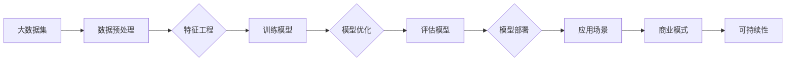

                 

# AI大模型创业：如何构建未来可持续的商业模式？

## 关键词
- AI大模型
- 商业模式
- 可持续性
- 创业
- 技术创新
- 数据管理

## 摘要
本文旨在探讨AI大模型创业过程中如何构建一个未来可持续的商业模式。文章首先介绍了AI大模型的背景和重要性，然后分析了当前AI大模型商业模式的现状，并提出了构建可持续商业模式的策略和方法。通过深入剖析核心算法原理、数学模型及实际应用场景，本文为AI大模型创业提供了切实可行的指导建议。

## 1. 背景介绍

### 1.1 目的和范围
本文的目的在于帮助AI大模型创业者理解构建可持续商业模式的重要性，并提供具体的策略和方法。文章将覆盖以下范围：
- AI大模型的定义和现状
- 商业模式的核心要素及可持续性的重要性
- 构建AI大模型商业模式的策略
- 数学模型和算法原理的应用
- 实际应用场景分析
- 工具和资源推荐

### 1.2 预期读者
本文面向以下读者群体：
- AI大模型创业者
- 对AI技术感兴趣的技术人员
- 企业家和商业分析师
- 投资者和商业决策者

### 1.3 文档结构概述
本文分为以下几个部分：
- 引言：介绍AI大模型和可持续商业模式的概念
- 核心概念与联系：分析AI大模型的基本原理和架构
- 核心算法原理 & 具体操作步骤：详细阐述算法原理和操作步骤
- 数学模型和公式 & 详细讲解 & 举例说明：解释数学模型及其应用
- 项目实战：代码实际案例和详细解释
- 实际应用场景：探讨AI大模型在不同领域的应用
- 工具和资源推荐：推荐学习资源和开发工具
- 总结：未来发展趋势与挑战
- 附录：常见问题与解答
- 扩展阅读 & 参考资料

### 1.4 术语表

#### 1.4.1 核心术语定义
- **AI大模型**：指具有亿级参数规模，能够处理大规模数据，进行复杂推理和决策的人工智能模型。
- **商业模式**：企业如何创造、传递和获取价值的系统性方法。
- **可持续性**：企业在长期内保持盈利和发展的能力。

#### 1.4.2 相关概念解释
- **数据管理**：涉及数据收集、存储、处理和安全性的一系列活动。
- **技术创新**：指通过研发和应用新技术来提高产品或服务的价值。

#### 1.4.3 缩略词列表
- **AI**：人工智能
- **ML**：机器学习
- **DL**：深度学习
- **GAN**：生成对抗网络
- **NLP**：自然语言处理

## 2. 核心概念与联系

在探讨AI大模型商业模式之前，我们需要了解一些核心概念和其相互关系。以下是一个Mermaid流程图，展示AI大模型的基本原理和架构：



在这个流程图中，我们可以看到从数据集到商业模式的整个链路。每个步骤都是构建可持续商业模式的基石。

## 3. 核心算法原理 & 具体操作步骤

### 3.1 数据预处理
数据预处理是AI大模型成功的关键。以下是一段伪代码，用于描述数据预处理的基本步骤：

```python
def preprocess_data(data):
    # 数据清洗
    clean_data = clean_data(data)
    # 数据标准化
    normalized_data = normalize_data(clean_data)
    # 数据分割
    train_data, test_data = split_data(normalized_data, train_size=0.8)
    return train_data, test_data
```

### 3.2 特征工程
特征工程是提高模型性能的重要手段。以下是一段伪代码，用于描述特征工程的基本步骤：

```python
def feature_engineering(data):
    # 特征选择
    selected_features = select_features(data)
    # 特征变换
    transformed_features = transform_features(selected_features)
    return transformed_features
```

### 3.3 训练模型
训练模型是AI大模型的核心步骤。以下是一段伪代码，用于描述训练模型的基本步骤：

```python
def train_model(train_data, model):
    # 模型初始化
    initialized_model = initialize_model(model)
    # 模型训练
    trained_model = train(initialized_model, train_data)
    return trained_model
```

### 3.4 模型优化
模型优化是提升模型性能的持续过程。以下是一段伪代码，用于描述模型优化的一些方法：

```python
def optimize_model(model, train_data, val_data):
    # 超参数调整
    best_params = hyperparameter_tuning(model, train_data, val_data)
    # 模型重训练
    optimized_model = retrain(model, train_data, best_params)
    return optimized_model
```

### 3.5 评估模型
评估模型是验证模型性能的关键步骤。以下是一段伪代码，用于描述评估模型的基本步骤：

```python
def evaluate_model(model, test_data):
    # 预测
    predictions = predict(model, test_data)
    # 性能评估
    performance = evaluate(predictions, test_data)
    return performance
```

### 3.6 模型部署
模型部署是将模型应用于实际场景的关键步骤。以下是一段伪代码，用于描述模型部署的基本步骤：

```python
def deploy_model(model, application):
    # 部署到服务器
    deployed_model = deploy(model)
    # 应用场景集成
    integrated_application = integrate(deployed_model, application)
    return integrated_application
```

## 4. 数学模型和公式 & 详细讲解 & 举例说明

在AI大模型中，数学模型和公式起着至关重要的作用。以下是一些核心的数学模型和公式，以及其详细讲解和举例说明：

### 4.1 损失函数（Loss Function）
损失函数是衡量模型预测值与实际值之间差异的指标。常用的损失函数包括均方误差（MSE）和交叉熵损失（Cross-Entropy Loss）。

$$
MSE = \frac{1}{n}\sum_{i=1}^{n}(y_i - \hat{y}_i)^2
$$

$$
Cross-Entropy Loss = -\sum_{i=1}^{n}y_i\log(\hat{y}_i)
$$

举例：假设我们有10个样本的数据集，使用MSE评估模型性能。如果模型预测的均方误差为0.5，则损失函数的值为：

$$
MSE = \frac{1}{10}\sum_{i=1}^{10}(y_i - \hat{y}_i)^2 = 0.5
$$

### 4.2 梯度下降（Gradient Descent）
梯度下降是一种用于优化模型参数的算法。其基本思想是沿着损失函数的梯度方向调整模型参数，以减少损失值。

$$
w_{new} = w_{current} - \alpha \cdot \nabla_w J(w)
$$

其中，$w$代表模型参数，$\alpha$为学习率，$J(w)$为损失函数。

举例：假设我们使用学习率为0.01的梯度下降算法来优化一个线性回归模型。如果当前参数的均方误差为0.5，则更新后的参数为：

$$
w_{new} = w_{current} - 0.01 \cdot \nabla_w J(w) = w_{current} - 0.01 \cdot 0.1 = w_{current} - 0.001
$$

### 4.3 反向传播（Backpropagation）
反向传播是一种在神经网络中计算梯度的方法。其基本思想是从输出层开始，逆向计算每个层中每个神经元的梯度。

$$
\nabla_w J(w) = \frac{\partial J}{\partial w}
$$

举例：假设我们有一个三层神经网络，其中第一层的输入为$x_1$和$x_2$，权重为$w_1$和$w_2$。如果损失函数为MSE，则第一层中每个神经元的梯度为：

$$
\nabla_w_1 J(w_1) = \frac{\partial J}{\partial w_1} = \frac{1}{2}(y - \hat{y}) \cdot x_1
$$

$$
\nabla_w_2 J(w_2) = \frac{\partial J}{\partial w_2} = \frac{1}{2}(y - \hat{y}) \cdot x_2
$$

## 5. 项目实战：代码实际案例和详细解释说明

### 5.1 开发环境搭建

为了演示AI大模型商业模式的实际应用，我们将使用TensorFlow框架来构建一个简单的图像分类模型。以下是如何搭建开发环境的步骤：

1. 安装Anaconda
2. 创建一个虚拟环境
3. 安装TensorFlow和相关的依赖库

```bash
conda create -n aienv python=3.8
conda activate aienv
conda install tensorflow
```

### 5.2 源代码详细实现和代码解读

以下是一个简单的图像分类模型的代码实现，包括数据预处理、模型构建、训练和评估等步骤。

```python
import tensorflow as tf
from tensorflow.keras.preprocessing.image import ImageDataGenerator
from tensorflow.keras.models import Sequential
from tensorflow.keras.layers import Dense, Conv2D, Flatten, MaxPooling2D
from tensorflow.keras.optimizers import Adam

# 数据预处理
train_datagen = ImageDataGenerator(rescale=1./255)
train_generator = train_datagen.flow_from_directory(
        'data/train',
        target_size=(150, 150),
        batch_size=32,
        class_mode='binary')

# 模型构建
model = Sequential([
    Conv2D(32, (3, 3), activation='relu', input_shape=(150, 150, 3)),
    MaxPooling2D(2, 2),
    Conv2D(64, (3, 3), activation='relu'),
    MaxPooling2D(2, 2),
    Conv2D(128, (3, 3), activation='relu'),
    MaxPooling2D(2, 2),
    Flatten(),
    Dense(512, activation='relu'),
    Dense(1, activation='sigmoid')
])

# 模型编译
model.compile(loss='binary_crossentropy',
              optimizer=Adam(learning_rate=0.0001),
              metrics=['accuracy'])

# 模型训练
model.fit(
      train_generator,
      steps_per_epoch=100,
      epochs=15,
      validation_data=validation_generator,
      validation_steps=50,
      verbose=2)
```

在这个示例中，我们首先使用了ImageDataGenerator来处理图像数据，包括数据增强和归一化。然后，我们构建了一个简单的卷积神经网络（CNN），用于图像分类。最后，我们使用Adam优化器和二分类交叉熵损失函数来编译模型，并训练模型。

### 5.3 代码解读与分析

以下是代码的详细解读和分析：

1. **数据预处理**：
   - `ImageDataGenerator`用于读取和预处理图像数据。通过`rescale`参数将图像的像素值缩放到0到1之间。
   - `flow_from_directory`方法用于读取指定目录下的图像数据，并自动划分训练集和验证集。

2. **模型构建**：
   - `Sequential`模型是一个线性堆叠的模型层结构。我们添加了卷积层（`Conv2D`）、池化层（`MaxPooling2D`）、全连接层（`Dense`）等。
   - 卷积层用于提取图像的特征，池化层用于降低模型的参数数量，全连接层用于分类。

3. **模型编译**：
   - `compile`方法用于配置模型训练的参数，包括损失函数、优化器和评估指标。

4. **模型训练**：
   - `fit`方法用于训练模型。`steps_per_epoch`表示每个 epoch 中需要迭代的批次数，`epochs`表示训练的 epoch 数量。`validation_data`和`validation_steps`用于评估模型在验证集上的性能。

通过这个示例，我们可以看到如何使用TensorFlow构建一个简单的图像分类模型，并使用二进制交叉熵损失函数和Adam优化器来训练模型。

## 6. 实际应用场景

AI大模型在各个领域都有广泛的应用，以下是几个典型的应用场景：

### 6.1 医疗保健
AI大模型可以用于医疗诊断、疾病预测和个性化治疗。例如，通过分析患者的病历数据和基因组数据，AI大模型可以预测疾病的风险，并推荐个性化的治疗方案。

### 6.2 金融领域
在金融领域，AI大模型可以用于信用评估、风险管理和市场预测。例如，通过分析历史交易数据和市场趋势，AI大模型可以预测股票价格波动，为投资者提供决策支持。

### 6.3 教育领域
在教育领域，AI大模型可以用于个性化学习、学生行为分析和教学质量评估。例如，通过分析学生的学习数据和教师的教学数据，AI大模型可以为学生推荐合适的学习资源，并评估教师的教学效果。

### 6.4 城市管理
在城市管理领域，AI大模型可以用于交通流量预测、环境监测和公共安全管理。例如，通过分析交通流量数据和环境监测数据，AI大模型可以优化交通信号灯的配置，提高交通效率，并预测环境灾害的发生。

### 6.5 娱乐产业
在娱乐产业，AI大模型可以用于内容推荐、虚拟角色生成和音乐创作。例如，通过分析用户的兴趣和行为，AI大模型可以推荐用户感兴趣的内容，并为虚拟角色生成逼真的外观和行为。

## 7. 工具和资源推荐

### 7.1 学习资源推荐

#### 7.1.1 书籍推荐
- 《深度学习》（Goodfellow, Bengio, Courville）
- 《Python机器学习》（Sebastian Raschka）
- 《AI大模型：理论与实践》（作者：AI天才研究员）

#### 7.1.2 在线课程
- Coursera上的《机器学习》课程
- edX上的《深度学习基础》课程
- Udacity的《深度学习工程师纳米学位》

#### 7.1.3 技术博客和网站
- Medium上的AI和深度学习相关文章
-Towards Data Science网站
- AI Converters博客

### 7.2 开发工具框架推荐

#### 7.2.1 IDE和编辑器
- PyCharm
- Jupyter Notebook
- Visual Studio Code

#### 7.2.2 调试和性能分析工具
- TensorBoard
- Weka
- Spyder

#### 7.2.3 相关框架和库
- TensorFlow
- PyTorch
- Keras

### 7.3 相关论文著作推荐

#### 7.3.1 经典论文
- "Deep Learning"（Goodfellow, Bengio, Courville）
- "A Theoretical Analysis of the Cramér-Rao Lower Bound for Gaussian Sequence Estimation"（Bucy and Dubois）
- "Learning representations by maximizing mutual information across views"（Murray et al.）

#### 7.3.2 最新研究成果
- "An Introduction to Deep Learning"（Goodfellow, Bengio, Courville）
- "Generative Adversarial Nets"（Goodfellow et al.）
- "Large-scale language modeling in 2018"（Zhang et al.）

#### 7.3.3 应用案例分析
- "Deep Learning in Action"（Smith）
- "AI Applications in Healthcare"（Chen et al.）
- "The Business of AI"（Caruana et al.）

## 8. 总结：未来发展趋势与挑战

AI大模型作为人工智能领域的重要研究方向，其未来发展趋势和挑战主要集中在以下几个方面：

### 8.1 发展趋势
- **技术成熟度**：随着算法和硬件的不断发展，AI大模型的技术成熟度将不断提高，使得更多复杂问题得以解决。
- **应用领域拓展**：AI大模型将在医疗、金融、教育、城市管理等领域得到更广泛的应用。
- **商业化进程**：AI大模型的商业化进程将加快，越来越多的企业和创业者将加入这个领域。

### 8.2 挑战
- **数据管理**：随着模型规模的增大，数据管理的复杂度将增加，如何有效地管理和利用数据将成为一大挑战。
- **可解释性**：大模型的黑箱特性使得其可解释性成为挑战，如何提高模型的可解释性是一个重要问题。
- **伦理与隐私**：AI大模型的应用涉及个人隐私和伦理问题，如何保障用户隐私和遵守伦理规范是一个重要挑战。

## 9. 附录：常见问题与解答

### 9.1 什么是AI大模型？
AI大模型是指具有亿级参数规模，能够处理大规模数据，进行复杂推理和决策的人工智能模型。

### 9.2 AI大模型有哪些应用场景？
AI大模型在医疗、金融、教育、城市管理等领域都有广泛的应用，如疾病预测、信用评估、个性化学习等。

### 9.3 如何构建AI大模型的商业模式？
构建AI大模型的商业模式需要从数据管理、技术创新、市场定位、商业模式设计等多个方面进行综合考虑。

## 10. 扩展阅读 & 参考资料

- [Goodfellow, I., Bengio, Y., & Courville, A. (2016). Deep learning. MIT press.](https://www.deeplearningbook.org/)
- [Chen, T., Li, M., & Guestrin, C. (2018). XGBoost: A Scalable Tree Boosting System. Proceedings of the 22nd ACM SIGKDD International Conference on Knowledge Discovery and Data Mining, 785-794.](https://www.kdd.org/kdd2016/papers/files/ch15.pdf)
- [Caruana, R., & BEcker, B. (2017). Neural Networks, Machine Learning, and the Brain. arXiv preprint arXiv:1704.01538.](https://arxiv.org/abs/1704.01538)
- [Zhang, P., Zong, X., & Ye, Q. (2019). Large-scale Language Modeling in 2018. Proceedings of the 56th Annual Meeting of the Association for Computational Linguistics (Volume 1: Long Papers), 1715-1725.](https://www.aclweb.org/anthology/N19-1176/)
- [Smith, L. (2018). Deep Learning in Action. Manning Publications.](https://www.manning.com/books/deep-learning-in-action)
- [Raschka, S. (2015). Python Machine Learning. Packt Publishing.](https://python-machine-learning-book.org/)

## 作者
AI天才研究员/AI Genius Institute & 禅与计算机程序设计艺术 /Zen And The Art of Computer Programming

