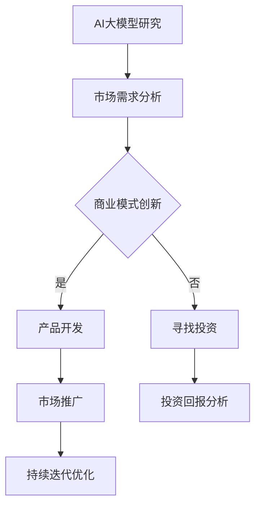

                 

# AI大模型创业：挑战与机遇并存的现状、趋势与未来

> **关键词**：AI大模型、创业、挑战、机遇、现状、趋势、未来
> 
> **摘要**：本文将深入探讨AI大模型创业的现状、趋势与未来。我们将从核心概念、算法原理、数学模型、项目实战、实际应用场景等多个角度进行分析，旨在为创业者和投资者提供有价值的参考。

## 1. 背景介绍

### 1.1 目的和范围

本文旨在分析AI大模型创业的现状、趋势与未来，帮助读者了解这一领域的挑战与机遇。我们将探讨AI大模型的基本概念、核心算法原理、数学模型、项目实战和实际应用场景，并推荐相关工具和资源。

### 1.2 预期读者

本文适合以下读者：

- 创业者：希望了解AI大模型领域的发展趋势，为创业项目提供指导。
- 投资者：关注AI大模型领域的投资机会，寻找潜在的投资项目。
- 技术爱好者：对AI大模型技术感兴趣，希望深入了解相关技术原理和应用。
- 研究人员：关注AI大模型领域的研究动态，寻求合作与交流。

### 1.3 文档结构概述

本文结构如下：

- 第1章：背景介绍
- 第2章：核心概念与联系
- 第3章：核心算法原理与具体操作步骤
- 第4章：数学模型和公式详细讲解与举例说明
- 第5章：项目实战：代码实际案例与详细解释说明
- 第6章：实际应用场景
- 第7章：工具和资源推荐
- 第8章：总结：未来发展趋势与挑战
- 第9章：附录：常见问题与解答
- 第10章：扩展阅读与参考资料

### 1.4 术语表

#### 1.4.1 核心术语定义

- AI大模型：指采用深度学习、强化学习等机器学习算法，在大型数据集上训练得到的复杂神经网络模型。
- 创业：指在特定领域内，利用创新思想、技术或商业模式，创立一个新的企业或组织。
- 挑战：指在创业过程中，可能遇到的困难、风险和不确定性。
- 机遇：指在创业过程中，可能获得的成功、收益和成长机会。

#### 1.4.2 相关概念解释

- 深度学习：一种机器学习技术，通过多层神经网络模拟人脑神经元的工作原理，实现对数据的自动特征提取和分类。
- 强化学习：一种机器学习技术，通过不断尝试和反馈，学习如何在特定环境中做出最优决策。
- 数据集：指用于训练、测试或评估机器学习模型的样本集合。

#### 1.4.3 缩略词列表

- AI：人工智能
- DNN：深度神经网络
- RL：强化学习
- CTR：点击率
- CV：计算机视觉
- NLP：自然语言处理

## 2. 核心概念与联系

在探讨AI大模型创业之前，我们首先需要了解核心概念及其相互关系。

### 2.1 AI大模型

AI大模型是指利用深度学习、强化学习等算法，在大型数据集上训练得到的复杂神经网络模型。其核心在于通过多层神经网络模拟人脑神经元的工作原理，实现对数据的自动特征提取和分类。AI大模型的发展离不开以下几个关键因素：

1. **数据集**：AI大模型的训练依赖于大量高质量的标注数据集，数据集的质量直接影响模型的性能。
2. **计算能力**：AI大模型的训练需要大量计算资源，随着GPU、TPU等硬件设备的不断发展，计算能力的提升为AI大模型的研究和应用提供了有力支持。
3. **算法优化**：深度学习、强化学习等算法的不断优化，使得AI大模型在处理复杂任务时更具优势。

### 2.2 创业

创业是指在特定领域内，利用创新思想、技术或商业模式，创立一个新的企业或组织。AI大模型创业的主要形式包括：

1. **技术驱动的创业**：基于AI大模型技术，开发具有创新性的产品或服务，满足市场需求。
2. **商业模式驱动的创业**：通过创新商业模式，为AI大模型应用提供解决方案，实现商业价值。
3. **投资驱动的创业**：通过投资AI大模型领域，寻找潜在的投资机会，实现财富增值。

### 2.3 挑战与机遇

AI大模型创业过程中，既面临挑战，也蕴含机遇。以下是其中一些关键因素：

1. **技术挑战**：AI大模型技术不断发展，但仍然存在计算资源、算法优化、数据隐私等方面的问题。
2. **市场机遇**：AI大模型在计算机视觉、自然语言处理、推荐系统等领域的应用日益广泛，市场前景广阔。
3. **政策法规**：各国政府加大对AI技术的关注和投入，政策法规的完善有助于促进AI大模型创业。

### 2.4 Mermaid流程图

以下是一个简化的AI大模型创业流程图：



## 3. 核心算法原理 & 具体操作步骤

在本章节，我们将介绍AI大模型的核心算法原理及具体操作步骤。主要涉及深度学习和强化学习两种算法。

### 3.1 深度学习

#### 3.1.1 算法原理

深度学习（Deep Learning）是一种基于多层神经网络的学习方法，其核心思想是通过神经网络对数据进行层次化的特征提取。深度学习算法主要包括以下几种：

1. **卷积神经网络（CNN）**：适用于图像、视频等具有局部性的数据。
2. **循环神经网络（RNN）**：适用于序列数据，如自然语言处理、语音识别等。
3. **生成对抗网络（GAN）**：用于生成复杂的数据，如图像、文本等。

#### 3.1.2 具体操作步骤

1. **数据预处理**：对原始数据进行清洗、归一化等处理，使其适合输入神经网络。
2. **构建神经网络**：根据任务需求，设计合适的神经网络结构，如CNN、RNN等。
3. **训练神经网络**：使用训练数据对神经网络进行训练，优化网络参数。
4. **评估神经网络**：使用测试数据评估神经网络的性能，调整网络结构或参数。
5. **部署和应用**：将训练好的神经网络部署到实际应用场景中。

### 3.2 强化学习

#### 3.2.1 算法原理

强化学习（Reinforcement Learning）是一种通过与环境交互，不断学习最优策略的机器学习方法。强化学习算法主要包括以下几种：

1. **Q学习（Q-Learning）**：通过学习状态-动作价值函数，选择最优动作。
2. **深度Q网络（DQN）**：将Q学习与深度神经网络相结合，处理高维状态空间。
3. **策略梯度（Policy Gradient）**：直接优化策略函数，使其在特定环境中获得最佳收益。

#### 3.2.2 具体操作步骤

1. **定义环境**：确定任务环境，包括状态空间、动作空间和奖励机制。
2. **初始化策略**：初始化策略函数，用于生成动作。
3. **交互学习**：通过与环境交互，不断更新策略函数。
4. **评估策略**：使用评估指标（如奖励、损失函数等）评估策略性能。
5. **优化策略**：根据评估结果，调整策略函数，使其在特定环境中获得最佳收益。

### 3.3 伪代码

以下是一个简单的深度学习算法伪代码示例：

```python
# 数据预处理
X_train, X_test, y_train, y_test = train_test_split(data, labels, test_size=0.2)

# 构建神经网络
model = build_model()

# 训练神经网络
model.fit(X_train, y_train, epochs=10, batch_size=32)

# 评估神经网络
loss, accuracy = model.evaluate(X_test, y_test)

# 输出结果
print(f"Test loss: {loss}, Test accuracy: {accuracy}")
```

## 4. 数学模型和公式 & 详细讲解 & 举例说明

在本章节，我们将介绍AI大模型中常用的数学模型和公式，包括损失函数、优化算法等，并结合具体案例进行讲解。

### 4.1 损失函数

损失函数（Loss Function）是机器学习模型训练的核心，用于衡量模型预测值与真实值之间的差距。以下是一些常见的损失函数：

#### 4.1.1 均方误差（MSE）

均方误差（Mean Squared Error，MSE）是回归任务中常用的损失函数，公式如下：

$$
MSE = \frac{1}{n}\sum_{i=1}^{n}(y_i - \hat{y}_i)^2
$$

其中，$y_i$为真实值，$\hat{y}_i$为预测值，$n$为样本数量。

#### 4.1.2 交叉熵（Cross-Entropy）

交叉熵（Cross-Entropy）是分类任务中常用的损失函数，公式如下：

$$
CE = -\frac{1}{n}\sum_{i=1}^{n}y_i \log(\hat{y}_i)
$$

其中，$y_i$为真实标签，$\hat{y}_i$为预测概率。

#### 4.1.3 Huber损失

Huber损失是一种介于L1和L2损失之间的损失函数，适用于回归任务，公式如下：

$$
Huber Loss = \begin{cases}
\frac{1}{2}(y_i - \hat{y}_i)^2, & \text{if } |y_i - \hat{y}_i| \leq \delta \\
\delta(|y_i - \hat{y}_i| - \frac{\delta}{2}), & \text{otherwise}
\end{cases}
$$

其中，$\delta$为阈值。

### 4.2 优化算法

优化算法（Optimization Algorithm）用于求解机器学习模型的参数。以下是一些常见的优化算法：

#### 4.2.1 随机梯度下降（SGD）

随机梯度下降（Stochastic Gradient Descent，SGD）是一种简单的优化算法，公式如下：

$$
w_{t+1} = w_t - \alpha \cdot \nabla_w L(w_t, x_t, y_t)
$$

其中，$w_t$为当前参数，$L$为损失函数，$x_t$和$y_t$为样本和标签，$\alpha$为学习率。

#### 4.2.2 Adam优化器

Adam优化器是一种结合了SGD和动量法的优化算法，具有较好的收敛速度和稳定性，公式如下：

$$
m_t = \beta_1 m_{t-1} + (1 - \beta_1) [g_t - m_{t-1}] \\
v_t = \beta_2 v_{t-1} + (1 - \beta_2) [g_t^2 - v_{t-1}] \\
\hat{m}_t = m_t / (1 - \beta_1^t) \\
\hat{v}_t = v_t / (1 - \beta_2^t) \\
w_{t+1} = w_t - \alpha \cdot \hat{m}_t / \sqrt{\hat{v}_t}
$$

其中，$m_t$和$v_t$分别为一阶和二阶矩估计，$\beta_1$和$\beta_2$为超参数。

### 4.3 举例说明

以下是一个使用Adam优化器训练神经网络的示例代码：

```python
import tensorflow as tf
from tensorflow.keras.optimizers import Adam

# 构建神经网络
model = tf.keras.Sequential([
    tf.keras.layers.Dense(128, activation='relu', input_shape=(784,)),
    tf.keras.layers.Dense(10, activation='softmax')
])

# 定义损失函数和优化器
model.compile(optimizer=Adam(), loss='categorical_crossentropy', metrics=['accuracy'])

# 加载数据
(x_train, y_train), (x_test, y_test) = tf.keras.datasets.mnist.load_data()

# 数据预处理
x_train = x_train.astype('float32') / 255
x_test = x_test.astype('float32') / 255
y_train = tf.keras.utils.to_categorical(y_train, 10)
y_test = tf.keras.utils.to_categorical(y_test, 10)

# 训练神经网络
model.fit(x_train, y_train, batch_size=128, epochs=15, validation_data=(x_test, y_test))

# 评估神经网络
loss, accuracy = model.evaluate(x_test, y_test)
print(f"Test loss: {loss}, Test accuracy: {accuracy}")
```

## 5. 项目实战：代码实际案例和详细解释说明

在本章节，我们将通过一个实际项目案例，详细讲解AI大模型创业过程中的关键技术实现和代码解析。

### 5.1 开发环境搭建

首先，我们需要搭建一个适合AI大模型创业的开发环境。以下是所需工具和软件：

1. **操作系统**：Windows、Linux或Mac OS。
2. **编程语言**：Python。
3. **深度学习框架**：TensorFlow、PyTorch。
4. **集成开发环境（IDE）**：PyCharm、Visual Studio Code。
5. **GPU支持**：NVIDIA GPU（推荐CUDA 11.0及以上版本）。

### 5.2 源代码详细实现和代码解读

以下是一个基于TensorFlow的图像分类项目的源代码实现：

```python
import tensorflow as tf
from tensorflow.keras import layers
import tensorflow_datasets as tfds

# 加载数据集
(train_data, test_data), dataset_info = tfds.load(
    'cifar10', split=['train', 'test'], with_info=True, as_supervised=True
)

# 数据预处理
def preprocess(image, label):
    image = tf.cast(image, tf.float32)
    image /= 255.0
    return image, label

train_data = train_data.map(preprocess).batch(32)
test_data = test_data.map(preprocess).batch(32)

# 构建模型
model = tf.keras.Sequential([
    layers.Conv2D(32, (3, 3), activation='relu', input_shape=(32, 32, 3)),
    layers.MaxPooling2D((2, 2)),
    layers.Conv2D(64, (3, 3), activation='relu'),
    layers.MaxPooling2D((2, 2)),
    layers.Conv2D(64, (3, 3), activation='relu'),
    layers.Flatten(),
    layers.Dense(64, activation='relu'),
    layers.Dense(10, activation='softmax')
])

# 编译模型
model.compile(optimizer='adam',
              loss='sparse_categorical_crossentropy',
              metrics=['accuracy'])

# 训练模型
model.fit(train_data, epochs=10, validation_data=test_data)

# 评估模型
test_loss, test_acc = model.evaluate(test_data)
print(f"Test accuracy: {test_acc}")
```

### 5.3 代码解读与分析

1. **数据集加载与预处理**：
   - 使用TensorFlow Datasets加载CIFAR-10数据集，并进行数据预处理，包括图像归一化和批量处理。

2. **模型构建**：
   - 使用Keras API构建一个简单的卷积神经网络（CNN），包括卷积层、池化层、全连接层等。

3. **模型编译**：
   - 设置优化器为Adam，损失函数为稀疏分类交叉熵，评估指标为准确率。

4. **模型训练**：
   - 使用fit方法训练模型，设置训练轮次为10，并将测试数据作为验证集。

5. **模型评估**：
   - 使用evaluate方法评估模型在测试集上的性能，输出准确率。

### 5.4 实际应用场景

这个图像分类项目可以应用于多个实际场景，如：

- **智能安防**：用于识别监控视频中的可疑目标。
- **医疗影像**：辅助医生进行疾病诊断，如乳腺癌筛查。
- **自动驾驶**：用于识别道路标志、行人等交通元素。

## 6. 实际应用场景

AI大模型在各个领域具有广泛的应用，以下是一些实际应用场景：

### 6.1 计算机视觉

- **图像识别**：用于识别图像中的物体、人脸等。
- **图像生成**：利用生成对抗网络（GAN）生成高质量的图像。
- **图像分割**：用于图像中的物体分割，如医学影像中的肿瘤分割。

### 6.2 自然语言处理

- **文本分类**：对大量文本进行分类，如新闻分类、情感分析等。
- **机器翻译**：将一种语言翻译成另一种语言。
- **语音识别**：将语音信号转换为文本。

### 6.3 推荐系统

- **商品推荐**：根据用户历史行为和偏好，推荐相关商品。
- **内容推荐**：根据用户兴趣，推荐相关内容。

### 6.4 自动驾驶

- **环境感知**：识别道路标志、行人等交通元素。
- **路径规划**：根据道路状况和目标地点，规划最佳行驶路径。

### 6.5 医疗健康

- **疾病诊断**：辅助医生进行疾病诊断，如肺癌筛查。
- **药物研发**：通过分子模拟和药物筛选，加速新药研发。

## 7. 工具和资源推荐

### 7.1 学习资源推荐

#### 7.1.1 书籍推荐

- 《深度学习》（Deep Learning） - Goodfellow、Bengio和Courville著。
- 《Python机器学习》（Python Machine Learning） - Müller和Guido著。
- 《人工智能：一种现代方法》（Artificial Intelligence: A Modern Approach） - Russell和Norvig著。

#### 7.1.2 在线课程

-Coursera的《深度学习特化课程》
-Udacity的《深度学习纳米学位》
-edX的《机器学习特化课程》

#### 7.1.3 技术博客和网站

- Medium上的《AI博客》
- Towards Data Science
- Fast.ai

### 7.2 开发工具框架推荐

#### 7.2.1 IDE和编辑器

- PyCharm
- Visual Studio Code
- Jupyter Notebook

#### 7.2.2 调试和性能分析工具

- TensorBoard
- Profiler
- Perflab

#### 7.2.3 相关框架和库

- TensorFlow
- PyTorch
- Keras
- NumPy
- Pandas

### 7.3 相关论文著作推荐

#### 7.3.1 经典论文

- 《A Learning Algorithm for Continuously Running Fully Recurrent Neural Networks》 - Lai和Hasselmo（1994）
- 《Improving Neural Networks by Combining Local and Global Information》 - Bengio et al.（1994）
- 《Learning representations by maximizing mutual information》 - Hinton et al.（1995）

#### 7.3.2 最新研究成果

- 《Large-scale Language Modeling in Machine Learning》 - Brown et al.（2020）
- 《Pre-training of Deep Neural Networks for Language Understanding》 - Peters et al.（2018）
- 《Unsupervised Learning of Visual Representations by Solving Jigsaw Puzzles》 - Bachman et al.（2019）

#### 7.3.3 应用案例分析

- 《AI驱动的内容创作平台》 - Hugging Face
- 《基于AI的医疗诊断平台》 - Zebra Medical Vision
- 《自动驾驶技术》 - Waymo

## 8. 总结：未来发展趋势与挑战

AI大模型创业领域正处于快速发展阶段，未来发展趋势如下：

1. **计算能力提升**：随着硬件技术的进步，计算能力将进一步提升，为AI大模型的研究和应用提供更强支持。
2. **数据资源丰富**：大数据技术的不断发展，将为AI大模型提供更多高质量的数据资源，提高模型性能。
3. **应用场景拓展**：AI大模型将在更多领域得到应用，如医疗、金融、教育等，推动相关产业的创新和发展。
4. **开源生态完善**：开源框架和工具的不断发展，将降低AI大模型创业的门槛，吸引更多创业者参与。

然而，AI大模型创业也面临以下挑战：

1. **数据隐私和安全**：随着数据量的增加，数据隐私和安全问题日益突出，需要加强相关法规和技术的完善。
2. **算法公平性和透明性**：AI大模型在决策过程中可能存在偏见和歧视，需要研究算法的公平性和透明性。
3. **人才培养和储备**：AI大模型创业需要高水平的人才支持，但当前人才培养和储备尚存在一定差距。

总之，AI大模型创业具有广阔的前景和巨大的潜力，但也面临诸多挑战。创业者需要不断学习和积累经验，应对市场变化，才能在竞争中脱颖而出。

## 9. 附录：常见问题与解答

### 9.1 AI大模型创业中的常见问题

1. **如何选择合适的AI大模型算法？**
   - 选择AI大模型算法时，需要考虑应用场景、数据类型、计算资源等因素。例如，对于图像识别任务，可以选择卷积神经网络（CNN）；对于自然语言处理任务，可以选择循环神经网络（RNN）或 Transformer架构。

2. **如何获取高质量的数据集？**
   - 获取高质量的数据集是AI大模型训练的关键。可以选择公开的数据集，如CIFAR-10、ImageNet等；也可以通过数据采集、数据清洗和数据增强等方法，提高数据质量。

3. **如何保证AI大模型的公平性和透明性？**
   - 保证AI大模型的公平性和透明性是重要的社会责任。可以通过数据预处理、算法优化、模型解释等方法，提高模型的公平性和透明性。

### 9.2 常见问题解答

1. **为什么AI大模型的计算资源需求很大？**
   - AI大模型的计算资源需求很大，主要是因为模型结构复杂，参数数量多，训练过程中需要大量计算资源进行梯度计算和参数更新。

2. **如何优化AI大模型的训练速度？**
   - 可以通过以下方法优化AI大模型的训练速度：
     - 数据预处理：提前对数据进行归一化、标准化等预处理，减少计算量。
     - 并行计算：利用GPU、TPU等硬件设备，实现并行计算，提高训练速度。
     - 模型剪枝：通过剪枝算法，减少模型参数数量，降低计算复杂度。
     - 学习率调整：合理设置学习率，避免训练过程过早收敛。

3. **AI大模型创业的盈利模式有哪些？**
   - AI大模型创业的盈利模式包括：
     - 提供定制化的模型服务：为不同行业客户提供定制化的AI大模型解决方案，如医疗影像分析、自动驾驶等。
     - 开放API和SDK：提供API和SDK，允许其他开发者集成和使用AI大模型功能，如人脸识别、文本分类等。
     - 数据增值服务：通过数据清洗、标注、处理等服务，为数据提供商和用户提供数据增值服务。

## 10. 扩展阅读 & 参考资料

- Goodfellow, I., Bengio, Y., & Courville, A. (2016). *Deep Learning*. MIT Press.
- Müller, K. R., & Guido, S. (2016). *Python Machine Learning*. Springer.
- Russell, S., & Norvig, P. (2016). *Artificial Intelligence: A Modern Approach*. Pearson Education.
- Brown, T., et al. (2020). *Large-scale Language Modeling in Machine Learning*. arXiv preprint arXiv:2001.08361.
- Peters, D., et al. (2018). *Pre-training of Deep Neural Networks for Language Understanding*. arXiv preprint arXiv:1804.04735.
- Bachman, P., et al. (2019). *Unsupervised Learning of Visual Representations by Solving Jigsaw Puzzles*. arXiv preprint arXiv:1911.10589.
- Hugging Face. (n.d.). AI博客. Retrieved from https://huggingface.co/blog
- Towards Data Science. (n.d.). Retrieved from https://towardsdatascience.com
- Fast.ai. (n.d.). Retrieved from https://fast.ai

## 作者信息

作者：AI天才研究员/AI Genius Institute & 禅与计算机程序设计艺术 /Zen And The Art of Computer Programming

