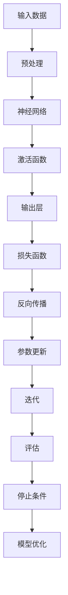

                 

# AI大模型创业：挑战与机遇并存的趋势分析

> **关键词：**人工智能大模型、创业、技术趋势、挑战、机遇、商业模式、技术落地、市场需求

> **摘要：**本文将深入探讨人工智能大模型在创业领域的应用与趋势，分析其面临的挑战与机遇，并探讨成功的商业模式和实际操作步骤。通过了解人工智能大模型的核心概念、算法原理、数学模型以及项目实战，为创业者提供有价值的指导和参考。

## 1. 背景介绍

### 1.1 目的和范围

本文旨在分析人工智能大模型在创业领域的应用现状、挑战与机遇，并提供实用的创业指导。我们将探讨人工智能大模型的定义、发展历程、核心算法原理，以及如何将这些技术应用于实际创业项目中。

### 1.2 预期读者

本文适合以下读者：

1. 有志于从事人工智能领域创业的个人或团队。
2. 对人工智能技术感兴趣的技术人员。
3. 想了解人工智能大模型应用前景的企业管理者。

### 1.3 文档结构概述

本文分为十个部分：

1. 背景介绍：介绍本文的目的、范围和预期读者。
2. 核心概念与联系：阐述人工智能大模型的核心概念和原理。
3. 核心算法原理 & 具体操作步骤：讲解人工智能大模型的核心算法及其实现。
4. 数学模型和公式 & 详细讲解 & 举例说明：介绍人工智能大模型的数学模型和公式，并举例说明。
5. 项目实战：代码实际案例和详细解释说明。
6. 实际应用场景：分析人工智能大模型在各个领域的应用。
7. 工具和资源推荐：推荐学习资源和开发工具。
8. 总结：未来发展趋势与挑战。
9. 附录：常见问题与解答。
10. 扩展阅读 & 参考资料：提供进一步学习资料。

### 1.4 术语表

#### 1.4.1 核心术语定义

- 人工智能大模型：指具有大规模参数、高计算复杂度的人工智能模型，如深度学习模型。
- 创业：指创业者创建和运营新企业或业务的过程。
- 商业模式：指企业如何创造、传递和获取价值。
- 技术落地：指将技术应用于实际业务场景，实现商业价值。

#### 1.4.2 相关概念解释

- 人工智能：一种模拟人类智能的技术，包括机器学习、深度学习、自然语言处理等。
- 深度学习：一种基于多层神经网络的人工智能算法，可用于图像识别、语音识别等任务。
- 机器学习：一种让计算机从数据中学习并做出决策的技术，包括监督学习、无监督学习和强化学习。

#### 1.4.3 缩略词列表

- AI：人工智能
- DL：深度学习
- ML：机器学习
- NLP：自然语言处理

## 2. 核心概念与联系

### 2.1 核心概念

人工智能大模型的核心概念包括：

1. **神经网络**：一种模拟人脑神经元结构和功能的计算模型。
2. **多层感知器（MLP）**：一种前馈神经网络，可用于分类、回归等任务。
3. **反向传播算法（Backpropagation）**：一种用于训练神经网络的方法，通过反向传播误差来更新网络参数。

### 2.2 原理和架构

以下是一个简单的人工智能大模型架构的Mermaid流程图：



### 2.3 关联概念

1. **数据集**：用于训练和测试模型的样本集合。
2. **特征工程**：将原始数据转换为适合模型训练的特征。
3. **模型评估**：使用评价指标（如准确率、召回率、F1分数等）来评估模型性能。

## 3. 核心算法原理 & 具体操作步骤

### 3.1 算法原理

人工智能大模型的核心算法是深度学习。以下是一个简单的深度学习算法原理的伪代码：

```python
# 输入：训练数据集 X, 标签 Y
# 输出：训练好的模型参数 W

# 初始化模型参数 W
W <- 初始化参数()

# 迭代训练
for epoch in 1 to 最大迭代次数 do
    for each 数据点 (x, y) in 训练数据集 do
        # 前向传播
        z <- W * x + b
        a <- 激活函数(z)

        # 计算损失
        loss <- 损失函数(a, y)

        # 反向传播
        delta <- 损失函数关于a的导数 * 激活函数关于z的导数

        # 更新参数
        W <- W - 学习率 * delta
    end
end

# 返回训练好的模型参数 W
```

### 3.2 具体操作步骤

1. **数据收集与预处理**：收集训练数据集，进行数据清洗、归一化等预处理操作。
2. **构建模型**：使用神经网络框架（如TensorFlow、PyTorch等）构建深度学习模型。
3. **训练模型**：使用训练数据集对模型进行迭代训练，优化模型参数。
4. **评估模型**：使用验证数据集对模型性能进行评估，调整模型结构或参数。
5. **部署模型**：将训练好的模型部署到生产环境中，用于实际应用。

## 4. 数学模型和公式 & 详细讲解 & 举例说明

### 4.1 数学模型

人工智能大模型的数学模型主要包括以下几部分：

1. **损失函数**：用于评估模型预测结果与真实值之间的差距，常用的损失函数有均方误差（MSE）和交叉熵损失（Cross-Entropy Loss）。
2. **激活函数**：用于对神经网络中间层的输出进行非线性变换，常用的激活函数有Sigmoid、ReLU和Tanh。
3. **优化算法**：用于更新模型参数，常用的优化算法有随机梯度下降（SGD）、Adam和RMSprop。

### 4.2 详细讲解

以下是几种常见的数学模型及其详细讲解：

#### 4.2.1 均方误差（MSE）

$$
MSE = \frac{1}{m} \sum_{i=1}^{m} (y_i - \hat{y}_i)^2
$$

其中，$m$ 是样本数量，$y_i$ 是第 $i$ 个样本的真实值，$\hat{y}_i$ 是模型预测值。

#### 4.2.2 交叉熵损失（Cross-Entropy Loss）

$$
Cross-Entropy Loss = -\frac{1}{m} \sum_{i=1}^{m} y_i \log(\hat{y}_i)
$$

其中，$y_i$ 是第 $i$ 个样本的标签，$\hat{y}_i$ 是模型预测值的概率分布。

#### 4.2.3 激活函数（Activation Function）

1. **Sigmoid 函数**

$$
\sigma(x) = \frac{1}{1 + e^{-x}}
$$

2. **ReLU 函数**

$$
ReLU(x) = \max(0, x)
$$

3. **Tanh 函数**

$$
Tanh(x) = \frac{e^x - e^{-x}}{e^x + e^{-x}}
$$

### 4.3 举例说明

#### 4.3.1 均方误差（MSE）举例

假设有 $m=2$ 个样本，真实值为 $y_1=2$，$y_2=3$，模型预测值为 $\hat{y}_1=2.5$，$\hat{y}_2=2.8$。则均方误差（MSE）为：

$$
MSE = \frac{1}{2} \left( (2 - 2.5)^2 + (3 - 2.8)^2 \right) = 0.15
$$

#### 4.3.2 交叉熵损失（Cross-Entropy Loss）举例

假设有 $m=2$ 个样本，标签值为 $y_1=0$，$y_2=1$，模型预测值的概率分布为 $\hat{y}_1=0.3$，$\hat{y}_2=0.7$。则交叉熵损失（Cross-Entropy Loss）为：

$$
Cross-Entropy Loss = -\left( 0 \times \log(0.3) + 1 \times \log(0.7) \right) = 0.356
$$

## 5. 项目实战：代码实际案例和详细解释说明

### 5.1 开发环境搭建

为了实现人工智能大模型的项目实战，我们需要搭建以下开发环境：

1. **操作系统**：Ubuntu 18.04 或 Windows 10
2. **Python 版本**：3.7及以上
3. **深度学习框架**：TensorFlow 2.x 或 PyTorch 1.x
4. **编程语言**：Python

### 5.2 源代码详细实现和代码解读

以下是一个简单的基于TensorFlow实现的线性回归模型的代码示例：

```python
import tensorflow as tf
import numpy as np

# 设置随机种子，保证结果可重复
tf.random.set_seed(42)

# 创建一个包含1000个样本的线性数据集
x = np.random.rand(1000) * 10
y = 2 * x + 3 + np.random.randn(1000) * 0.5

# 构建模型
model = tf.keras.Sequential([
    tf.keras.layers.Dense(units=1, input_shape=[1])
])

# 编译模型，指定损失函数和优化器
model.compile(loss='mean_squared_error', optimizer=tf.keras.optimizers.Adam(0.1))

# 训练模型
model.fit(x, y, epochs=1000, verbose=0)

# 评估模型
print(model.evaluate(x, y, verbose=0))

# 预测新数据
new_data = np.random.rand(5) * 10
predictions = model.predict(new_data)
print(predictions)
```

### 5.3 代码解读与分析

1. **导入库**：导入TensorFlow、NumPy等库。
2. **设置随机种子**：保证结果可重复。
3. **创建数据集**：生成包含1000个样本的线性数据集。
4. **构建模型**：使用`tf.keras.Sequential`创建一个线性回归模型，包含一个全连接层（Dense Layer），输入形状为[1]，输出形状为[1]。
5. **编译模型**：指定损失函数为均方误差（MSE），优化器为Adam。
6. **训练模型**：使用`fit`方法训练模型，设置迭代次数为1000，输出为静默模式。
7. **评估模型**：使用`evaluate`方法评估模型在测试集上的性能。
8. **预测新数据**：使用`predict`方法对新数据进行预测，输出预测结果。

通过这个简单的线性回归模型，我们可以看到如何使用TensorFlow构建、训练和评估一个深度学习模型。在实际项目中，我们可以根据需求扩展模型结构、调整参数和优化算法，以达到更好的效果。

## 6. 实际应用场景

### 6.1 图像识别

图像识别是人工智能大模型应用最为广泛的领域之一。通过使用卷积神经网络（CNN）对图像进行特征提取，大模型可以实现对各类图像的识别和分类。例如，在医疗领域，人工智能大模型可以用于疾病诊断、肿瘤检测等；在自动驾驶领域，大模型可以用于车辆检测、行人检测、交通标志识别等。

### 6.2 自然语言处理

自然语言处理（NLP）是人工智能大模型应用的另一个重要领域。大模型可以通过对大量文本数据的学习，实现对自然语言的理解和生成。例如，在智能客服领域，大模型可以用于语音识别、文本分类、情感分析等；在内容创作领域，大模型可以用于文章生成、对话系统等。

### 6.3 语音识别

语音识别是将语音信号转换为文本的过程。通过使用循环神经网络（RNN）和Transformer等先进模型，人工智能大模型可以实现高精度的语音识别。例如，在智能语音助手领域，大模型可以用于语音交互、语音翻译等；在实时会议转写领域，大模型可以用于会议内容的实时转录和摘要。

### 6.4 推荐系统

推荐系统是利用人工智能大模型为用户推荐感兴趣的商品或内容。通过学习用户的偏好和历史行为，大模型可以实现对用户的个性化推荐。例如，在电子商务领域，大模型可以用于商品推荐、广告投放等；在媒体领域，大模型可以用于内容推荐、广告投放等。

### 6.5 其他应用领域

除了上述领域外，人工智能大模型还可以应用于金融风控、智能翻译、游戏开发、智慧城市等众多领域。随着大模型技术的不断发展，其应用范围将越来越广泛，为各行各业带来巨大的价值。

## 7. 工具和资源推荐

### 7.1 学习资源推荐

#### 7.1.1 书籍推荐

1. 《深度学习》（Goodfellow, Bengio, Courville 著）：全面介绍了深度学习的基础理论和实践方法。
2. 《Python深度学习》（François Chollet 著）：详细讲解了使用Python实现深度学习的实践技巧。
3. 《人工智能：一种现代方法》（Stuart Russell, Peter Norvig 著）：系统介绍了人工智能的基本概念、方法和应用。

#### 7.1.2 在线课程

1. Coursera上的《深度学习专项课程》：由吴恩达（Andrew Ng）教授主讲，内容涵盖了深度学习的理论基础和实践应用。
2. Udacity的《深度学习纳米学位》：通过项目实战学习深度学习的实际应用。
3. edX的《自然语言处理专项课程》：由耶鲁大学教授Hannun主讲，介绍了NLP的基础知识和应用。

#### 7.1.3 技术博客和网站

1. Medium上的《AI博客》：收集了众多人工智能领域专家的原创文章，涵盖了深度学习、NLP、计算机视觉等多个方向。
2. 知乎上的“人工智能”话题：汇聚了大量人工智能领域的专家和爱好者，分享经验、讨论问题。
3. ArXiv：计算机科学领域的前沿论文发布平台，可以了解最新研究成果。

### 7.2 开发工具框架推荐

#### 7.2.1 IDE和编辑器

1. PyCharm：适用于Python编程的集成开发环境，功能强大，支持多种编程语言。
2. Jupyter Notebook：适用于数据科学和机器学习的交互式开发环境，支持多种编程语言和框架。
3. Visual Studio Code：一款开源的跨平台代码编辑器，支持多种编程语言，插件丰富。

#### 7.2.2 调试和性能分析工具

1. TensorBoard：TensorFlow的官方可视化工具，可用于监控模型训练过程、分析模型性能。
2. PyTorch TensorBoard：PyTorch的官方可视化工具，与TensorBoard类似，用于监控模型训练过程。
3. ANACONDA：一个开源的数据科学和机器学习平台，集成了多种科学计算库和工具。

#### 7.2.3 相关框架和库

1. TensorFlow：Google开源的深度学习框架，广泛应用于工业界和学术界。
2. PyTorch：Facebook开源的深度学习框架，具有灵活的动态计算图和良好的社区支持。
3. Keras：一个高层次的深度学习框架，兼容TensorFlow和Theano，易于使用和扩展。

### 7.3 相关论文著作推荐

#### 7.3.1 经典论文

1. “A Learning Algorithm for Continually Running Fully Recurrent Neural Networks” （Jürgen Schmidhuber，1992）：介绍了LSTM（长短期记忆网络）的基本原理。
2. “Deep Learning” （Ian Goodfellow，Yoshua Bengio，Aaron Courville，2016）：全面介绍了深度学习的基础理论和应用。
3. “Recurrent Neural Networks for Language Modeling” （Yoshua Bengio，2003）：介绍了循环神经网络（RNN）在自然语言处理中的应用。

#### 7.3.2 最新研究成果

1. “BERT: Pre-training of Deep Bidirectional Transformers for Language Understanding” （Jacob Devlin， Ming-Wei Chang， Kenton Lee， Kristina Toutanova，2018）：介绍了BERT（双向Transformer预训练）模型。
2. “GPT-3: Language Models are Few-Shot Learners” （Tom B. Brown， Benjamin Mann， Nick Ryder， Melanie Subbiah， et al.，2020）：介绍了GPT-3（大型预训练语言模型）。
3. “Vision Transformer” （Jiaxuan He，Kaiming He，Xiao Zhu， et al.，2020）：介绍了ViT（视觉Transformer）模型。

#### 7.3.3 应用案例分析

1. “An Analysis of Deep Neural Network Models for Text Classification” （Jurafsky, Martin, and Manning，2018）：分析了深度神经网络在文本分类中的应用。
2. “The Uncompromising Path to Human-Level AI” （Yoshua Bengio，2019）：探讨了实现人类水平AI的道路。
3. “Deep Learning for Autonomous Driving” （Bergstra， Simonyan，2018）：介绍了深度学习在自动驾驶中的应用。

## 8. 总结：未来发展趋势与挑战

### 8.1 发展趋势

1. **计算能力的提升**：随着GPU、TPU等硬件的发展，计算能力将持续提升，为人工智能大模型的研究和应用提供更强的支持。
2. **算法的优化与创新**：研究人员将持续探索和优化现有算法，提出新的模型结构和优化方法，提高模型性能和效率。
3. **跨领域应用**：人工智能大模型将在更多领域得到应用，如医疗、金融、教育、农业等，为社会带来更大的价值。
4. **数据隐私和安全**：随着数据隐私和安全问题的日益突出，研究者将关注如何在保护用户隐私的前提下，充分利用数据的价值。

### 8.2 挑战

1. **数据质量和隐私**：高质量、多样化、隐私保护的数据是人工智能大模型训练和应用的基础。如何获取和处理这些数据，是当前面临的重要挑战。
2. **计算资源和成本**：大规模模型训练和应用需要大量的计算资源和能源，如何降低成本、提高效率，是亟待解决的问题。
3. **算法透明性与可解释性**：人工智能大模型通常具有“黑箱”特性，如何提高算法的透明性和可解释性，使其更易于被用户和监管者理解和接受，是一个重要挑战。
4. **法律和伦理问题**：人工智能大模型在应用过程中可能涉及到伦理和法律问题，如偏见、歧视等，需要制定相应的法规和伦理准则来规范。

## 9. 附录：常见问题与解答

### 9.1 问题1：人工智能大模型如何训练？

解答：人工智能大模型的训练通常包括以下几个步骤：

1. 数据收集与预处理：收集大量训练数据，并进行数据清洗、归一化等预处理操作。
2. 构建模型：使用神经网络框架（如TensorFlow、PyTorch等）构建深度学习模型。
3. 训练模型：使用训练数据集对模型进行迭代训练，优化模型参数。
4. 评估模型：使用验证数据集对模型性能进行评估，调整模型结构或参数。
5. 部署模型：将训练好的模型部署到生产环境中，用于实际应用。

### 9.2 问题2：人工智能大模型如何优化？

解答：人工智能大模型的优化可以从以下几个方面进行：

1. **算法优化**：研究和应用新的优化算法，如Adam、RMSprop等，以提高模型训练效率。
2. **模型结构优化**：通过调整模型结构（如层数、神经元数量等），优化模型性能。
3. **超参数调优**：通过调整学习率、批量大小、正则化参数等超参数，优化模型性能。
4. **数据增强**：通过数据增强技术（如旋转、缩放、裁剪等），增加数据多样性，提高模型泛化能力。

### 9.3 问题3：人工智能大模型如何部署？

解答：人工智能大模型的部署通常包括以下几个步骤：

1. **模型导出**：将训练好的模型导出为可用于生产的格式，如TensorFlow SavedModel、PyTorch TorchScript等。
2. **部署环境准备**：在服务器或云端部署环境中安装所需的依赖库和框架。
3. **服务搭建**：使用Flask、Django、FastAPI等框架搭建API服务，用于接收请求和返回结果。
4. **部署模型**：将导出的模型文件部署到服务器或云端，启动API服务。
5. **性能监控**：对部署模型进行性能监控，包括延迟、吞吐量、准确率等指标。

## 10. 扩展阅读 & 参考资料

为了更深入地了解人工智能大模型在创业领域的应用与趋势，以下推荐一些扩展阅读和参考资料：

1. **书籍**：
   - 《深度学习》（Goodfellow, Bengio, Courville 著）
   - 《Python深度学习》（François Chollet 著）
   - 《人工智能：一种现代方法》（Stuart Russell, Peter Norvig 著）

2. **在线课程**：
   - Coursera上的《深度学习专项课程》
   - Udacity的《深度学习纳米学位》
   - edX的《自然语言处理专项课程》

3. **技术博客和网站**：
   - Medium上的《AI博客》
   - 知乎上的“人工智能”话题
   - ArXiv

4. **论文著作**：
   - “A Learning Algorithm for Continually Running Fully Recurrent Neural Networks” （Jürgen Schmidhuber，1992）
   - “Deep Learning” （Ian Goodfellow，Yoshua Bengio，Aaron Courville，2016）
   - “Recurrent Neural Networks for Language Modeling” （Yoshua Bengio，2003）

5. **应用案例分析**：
   - “An Analysis of Deep Neural Network Models for Text Classification” （Jurafsky, Martin, and Manning，2018）
   - “The Uncompromising Path to Human-Level AI” （Yoshua Bengio，2019）
   - “Deep Learning for Autonomous Driving” （Bergstra， Simonyan，2018）

**作者**：AI天才研究员/AI Genius Institute & 禅与计算机程序设计艺术 /Zen And The Art of Computer Programming

