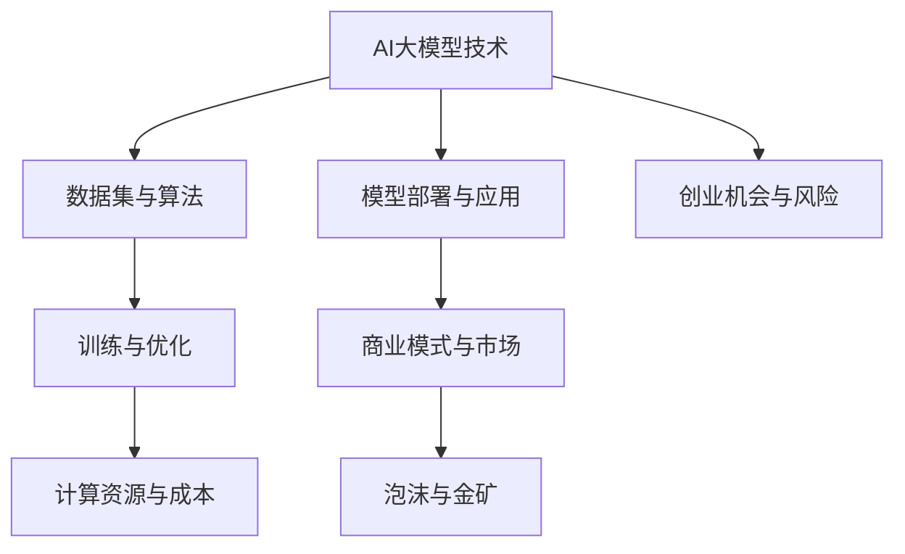

                 


# AI大模型创业：泡沫还是金矿？分析与思考

> 关键词：AI大模型、创业、泡沫、金矿、商业模式、技术评估、市场分析

> 摘要：本文将深入探讨AI大模型在创业领域的潜力与挑战。通过对AI大模型技术原理、市场状况和创业模式的分析，本文旨在为创业者提供清晰的指导，帮助他们判断AI大模型项目是否为泡沫，还是真正的金矿。文章将涵盖核心概念、算法原理、数学模型、实战案例、应用场景、工具资源推荐等内容，以全面解析AI大模型创业的方方面面。

## 1. 背景介绍

### 1.1 目的和范围

本文旨在探讨AI大模型在创业领域的应用价值与潜在风险。随着AI技术的快速发展，大模型成为了人工智能领域的一个热点。然而，创业者们需要明确的是，并非所有的大模型项目都具备商业潜力。本文将分析AI大模型的技术本质、市场现状和创业模式，帮助读者理解AI大模型的商业价值，并识别其中的泡沫和金矿。

### 1.2 预期读者

本文适合对人工智能和创业有一定了解的专业人士、创业者、投资者以及研究人员阅读。无论你是准备进入AI大模型领域的企业家，还是对AI技术感兴趣的观察者，本文都将为你提供有价值的见解。

### 1.3 文档结构概述

本文分为十个主要部分，具体如下：

1. 背景介绍
    - 1.1 目的和范围
    - 1.2 预期读者
    - 1.3 文档结构概述
    - 1.4 术语表
2. 核心概念与联系
3. 核心算法原理 & 具体操作步骤
4. 数学模型和公式 & 详细讲解 & 举例说明
5. 项目实战：代码实际案例和详细解释说明
6. 实际应用场景
7. 工具和资源推荐
8. 总结：未来发展趋势与挑战
9. 附录：常见问题与解答
10. 扩展阅读 & 参考资料

### 1.4 术语表

#### 1.4.1 核心术语定义

- **AI大模型**：指具有大量参数，能够处理复杂数据的深度学习模型。
- **创业**：指创建一个新的企业或业务过程。
- **泡沫**：指市场预期过高，导致资产价格虚高的情况。
- **金矿**：指具有高商业价值的投资机会。

#### 1.4.2 相关概念解释

- **深度学习**：一种机器学习技术，通过模拟人脑神经网络进行学习和决策。
- **神经网络**：一种由大量神经元互联形成的计算模型。
- **训练数据集**：用于训练模型的数据集合。

#### 1.4.3 缩略词列表

- **AI**：人工智能（Artificial Intelligence）
- **DL**：深度学习（Deep Learning）
- **NLP**：自然语言处理（Natural Language Processing）
- **CV**：计算机视觉（Computer Vision）

## 2. 核心概念与联系

在探讨AI大模型创业之前，我们需要理解几个核心概念和它们之间的联系。以下是AI大模型领域的关键概念及其相互关系的Mermaid流程图：



### 2.1 AI大模型技术

AI大模型技术是本文的核心。AI大模型通常是指具有数百万甚至数十亿参数的神经网络，这些模型能够处理大规模复杂数据，并在各种任务中实现高度准确的预测和决策。AI大模型技术的发展离不开以下几个方面：

- **深度学习**：深度学习是构建AI大模型的基础技术，它通过多层神经网络实现数据的逐层抽象和特征提取。
- **神经网络**：神经网络是深度学习的重要组成部分，由大量简单的计算单元（神经元）互联而成。
- **训练数据集**：大量的训练数据集是训练AI大模型的关键，这些数据集需要涵盖广泛的场景和情况，以使模型具有泛化能力。

### 2.2 数据集与算法

数据集和算法是AI大模型技术的两个重要组成部分。数据集的质量直接影响模型的性能，而算法则决定了模型的学习能力和表现。以下是数据集与算法之间的关系：

- **数据预处理**：包括数据清洗、归一化、特征提取等步骤，以提高数据质量。
- **算法选择**：根据具体任务需求选择合适的算法，如卷积神经网络（CNN）适用于图像处理，循环神经网络（RNN）适用于序列数据。

### 2.3 训练与优化

训练和优化是AI大模型技术中的关键步骤。训练过程通过迭代调整模型参数，使其在训练数据集上达到最优性能。优化过程则通过各种技术，如梯度下降、正则化等，提高模型的泛化能力和稳定性。以下是训练与优化之间的关系：

- **损失函数**：用于评估模型预测结果与真实结果之间的差异，是优化过程中的核心指标。
- **优化算法**：如梯度下降、Adam等，用于调整模型参数，使模型在训练过程中逐渐收敛。

### 2.4 模型部署与应用

模型部署和应用是将AI大模型技术转化为实际业务价值的关键环节。模型部署涉及将训练好的模型部署到生产环境中，而模型应用则涉及将模型应用于实际业务场景中。以下是模型部署与应用之间的关系：

- **模型评估**：通过验证数据集评估模型的性能，以确保模型在真实场景中能够稳定工作。
- **服务化部署**：将模型部署为API服务，供其他应用程序调用，实现自动化决策和预测。

### 2.5 商业模式与市场

商业模式与市场是AI大模型创业过程中不可忽视的重要方面。创业者需要根据市场需求和竞争状况，制定合适的商业模式，以实现商业价值。以下是商业模式与市场之间的关系：

- **市场细分**：根据客户需求将市场划分为多个细分市场，为每个细分市场提供定制化的解决方案。
- **竞争分析**：分析竞争对手的产品、市场份额、竞争优势等，制定相应的竞争策略。

### 2.6 计算资源与成本

计算资源和成本是AI大模型创业的重要考虑因素。训练和部署AI大模型需要大量的计算资源和时间，这直接影响到项目的成本。以下是计算资源与成本之间的关系：

- **硬件设备**：包括GPU、TPU等，用于加速模型的训练和推理。
- **云计算服务**：利用云计算平台提供弹性计算资源，降低成本和运维难度。

### 2.7 创业机会与风险

创业机会与风险是创业者需要密切关注的问题。AI大模型技术为创业者提供了广阔的机遇，但同时也伴随着较高的风险。以下是创业机会与风险之间的关系：

- **市场机遇**：AI大模型技术在多个领域具有广泛应用前景，如自动驾驶、医疗诊断、金融风控等。
- **技术风险**：AI大模型技术复杂度高，对创业者的技术能力有较高要求。
- **市场风险**：市场需求变化快，创业者需要快速适应市场变化。

### 2.8 泡沫与金矿

泡沫与金矿是创业者需要辨识的关键问题。泡沫指的是市场预期过高，导致资产价格虚高的情况，而金矿则指具有高商业价值的投资机会。以下是泡沫与金矿之间的关系：

- **泡沫识别**：通过分析市场数据、技术趋势和创业团队的能力，判断AI大模型项目的商业前景。
- **金矿挖掘**：选择具有真实商业价值、技术可行性和市场前景的AI大模型项目。

## 3. 核心算法原理 & 具体操作步骤

### 3.1 算法原理

AI大模型的核心在于其深度学习算法，特别是神经网络（Neural Networks）和深度神经网络（Deep Neural Networks）。以下是对核心算法原理的简要概述：

#### 神经网络（NN）

神经网络是由大量简单计算单元（神经元）组成的计算模型。每个神经元接收多个输入，通过激活函数产生输出。神经网络通过迭代训练，不断调整权重，使模型在给定数据集上达到预期性能。

#### 深度神经网络（DNN）

深度神经网络是在神经网络基础上扩展而来，具有多层隐层。深度神经网络通过逐层学习，实现数据的复杂特征提取和表示。训练深度神经网络的过程包括以下几个关键步骤：

1. **前向传播**：输入数据通过神经网络逐层传递，经过每个神经元的加权求和并应用激活函数，最终产生输出。
2. **损失函数计算**：计算输出与真实标签之间的误差，通过损失函数表示。常见的损失函数包括均方误差（MSE）和交叉熵（Cross-Entropy）。
3. **反向传播**：通过反向传播算法，计算每个神经元的梯度，并更新权重。反向传播利用链式法则，逐层计算梯度，并反向传播至输入层。
4. **优化算法**：利用梯度信息，通过优化算法（如梯度下降、Adam等）调整模型参数，使模型性能逐步提升。

### 3.2 具体操作步骤

以下是基于Python的深度学习框架TensorFlow，构建一个简单的深度神经网络并进行训练的伪代码：

```python
import tensorflow as tf

# 3.2.1 创建模型
model = tf.keras.Sequential([
    tf.keras.layers.Dense(units=64, activation='relu', input_shape=(input_size,)),
    tf.keras.layers.Dense(units=64, activation='relu'),
    tf.keras.layers.Dense(units=output_size, activation='softmax')
])

# 3.2.2 编译模型
model.compile(optimizer='adam',
              loss='categorical_crossentropy',
              metrics=['accuracy'])

# 3.2.3 训练模型
model.fit(x_train, y_train, epochs=10, batch_size=32, validation_data=(x_val, y_val))

# 3.2.4 评估模型
loss, accuracy = model.evaluate(x_test, y_test)
print(f"Test accuracy: {accuracy:.2f}")
```

### 3.3 深入理解

#### 神经元与激活函数

神经元是神经网络的基本计算单元。每个神经元接收多个输入，并通过加权求和产生输出。激活函数（如ReLU、Sigmoid、Tanh等）用于引入非线性特性，使神经网络能够学习复杂数据的分布。

#### 权重初始化

权重初始化对神经网络训练过程有重要影响。常用的初始化方法包括高斯分布初始化、 Xavier初始化和He初始化等。合适的权重初始化有助于加速模型收敛，并避免梯度消失或爆炸问题。

#### 梯度下降优化算法

梯度下降是调整模型参数的常用优化算法。通过计算损失函数关于参数的梯度，反向传播梯度至输入层，并更新参数。常见的梯度下降算法包括随机梯度下降（SGD）、批量梯度下降（BGD）和Adam等。Adam算法结合了SGD和BGD的优点，具有较好的收敛速度和稳定性。

#### 正则化技术

正则化技术用于防止过拟合，提高模型的泛化能力。常见的正则化方法包括L1正则化、L2正则化和Dropout等。L1正则化和L2正则化通过在损失函数中添加惩罚项，降低模型复杂度；Dropout通过在训练过程中随机丢弃部分神经元，增加模型的鲁棒性。

#### 深度学习框架

深度学习框架（如TensorFlow、PyTorch等）提供了丰富的API和工具，简化了深度神经网络的构建和训练过程。框架提供了自动微分、数据处理、模型评估等功能，使开发者能够专注于模型设计和优化。

## 4. 数学模型和公式 & 详细讲解 & 举例说明

### 4.1 数学模型简介

AI大模型的技术核心在于其背后的数学模型，尤其是深度学习中的神经网络模型。以下是对神经网络中关键数学模型的详细介绍。

#### 激活函数

激活函数是神经网络中的一个重要组件，用于引入非线性特性，使神经网络能够学习复杂数据的分布。以下是几个常见的激活函数：

- **ReLU（Rectified Linear Unit）**：

  $$ f(x) = \max(0, x) $$

  ReLU函数在x为负时输出0，在x为正时输出x。ReLU函数简单且计算效率高，有助于加快模型训练速度。

- **Sigmoid**：

  $$ f(x) = \frac{1}{1 + e^{-x}} $$

  Sigmoid函数将输入映射到(0, 1)区间，常用于二分类问题。

- **Tanh（Hyperbolic Tangent）**：

  $$ f(x) = \frac{e^x - e^{-x}}{e^x + e^{-x}} $$

  Tanh函数将输入映射到(-1, 1)区间，具有较好的平滑性。

#### 损失函数

损失函数是评估模型预测结果与真实结果之间差异的关键指标。以下是几个常见的损失函数：

- **均方误差（MSE，Mean Squared Error）**：

  $$ Loss = \frac{1}{n}\sum_{i=1}^{n}(y_i - \hat{y}_i)^2 $$

  MSE用于回归问题，计算预测值与真实值之间的平均平方误差。

- **交叉熵（Cross-Entropy）**：

  $$ Loss = -\frac{1}{n}\sum_{i=1}^{n}y_i \log(\hat{y}_i) $$

  交叉熵用于分类问题，计算预测概率分布与真实标签分布之间的差异。

#### 梯度下降

梯度下降是一种优化算法，通过计算损失函数关于模型参数的梯度，并更新参数，以最小化损失函数。以下是梯度下降的基本公式：

$$ \theta_{t+1} = \theta_{t} - \alpha \cdot \nabla_{\theta} J(\theta) $$

其中，$\theta$表示模型参数，$\alpha$为学习率，$J(\theta)$为损失函数。

#### 反向传播

反向传播是一种计算梯度的高效算法，通过链式法则，将梯度从输出层反向传播到输入层。以下是反向传播的基本步骤：

1. 计算输出层的梯度：$$ \delta_{L} = \frac{\partial L}{\partial \hat{y}} $$
2. 逐层计算隐藏层的梯度：$$ \delta_{h}^{l} = (\frac{\partial L}{\partial z^{l}}) \cdot (\frac{\partial z^{l}}{\partial \delta^{l+1}}) $$
3. 更新隐藏层和输入层的参数：$$ \theta^{l} = \theta^{l} - \alpha \cdot \nabla_{\theta^{l}} L $$

### 4.2 举例说明

#### 示例：ReLU激活函数

假设我们有一个包含两个输入节点的神经网络，其中第一个隐层使用ReLU激活函数。给定输入数据$x_1 = [2, -3]$，我们需要计算第一个隐层的输出。

1. 输入：$x_1 = [2, -3]$
2. 权重：$w_1 = [0.5, 0.7]$
3. 偏置：$b_1 = 1$

计算第一个隐层的输出：

$$ z_1 = x_1 \cdot w_1 + b_1 = [2, -3] \cdot [0.5, 0.7] + 1 = [0.8, -0.7 + 1] = [1.1, 0.3] $$

应用ReLU激活函数：

$$ a_1 = \max(0, z_1) = \max(0, [1.1, 0.3]) = [1.1, 0.3] $$

因此，第一个隐层的输出为$a_1 = [1.1, 0.3]$。

#### 示例：均方误差（MSE）损失函数

假设我们有一个二分类问题，真实标签$y = [1, 0]$，模型预测概率$\hat{y} = [0.8, 0.2]$。我们需要计算MSE损失。

1. 真实标签：$y = [1, 0]$
2. 预测概率：$\hat{y} = [0.8, 0.2]$

计算MSE损失：

$$ Loss = \frac{1}{2} \sum_{i=1}^{2} (y_i - \hat{y}_i)^2 = \frac{1}{2} \cdot [(1 - 0.8)^2 + (0 - 0.2)^2] = \frac{1}{2} \cdot [0.04 + 0.04] = 0.04 $$

因此，MSE损失为0.04。

#### 示例：梯度下降优化

假设我们有一个简单的线性回归模型，参数为$\theta = [1, 2]$，学习率$\alpha = 0.1$，损失函数为MSE。给定输入数据$x = [1, 2]$和真实标签$y = 3$，我们需要通过梯度下降更新参数。

1. 输入：$x = [1, 2]$
2. 真实标签：$y = 3$
3. 模型预测：$\hat{y} = x \cdot \theta + b = [1, 2] \cdot [1, 2] + 1 = [4, 5]$
4. 损失函数：$L = \frac{1}{2} (y - \hat{y})^2 = \frac{1}{2} (3 - 4)^2 + (3 - 5)^2 = 1$

计算梯度：

$$ \nabla_{\theta} L = \frac{\partial L}{\partial \theta} = [1, 2] - [4, 5] = [-3, -2] $$

更新参数：

$$ \theta_{t+1} = \theta_{t} - \alpha \cdot \nabla_{\theta} L = [1, 2] - 0.1 \cdot [-3, -2] = [1.3, 2.2] $$

因此，更新后的参数为$\theta_{t+1} = [1.3, 2.2]$。

## 5. 项目实战：代码实际案例和详细解释说明

### 5.1 开发环境搭建

在进行AI大模型项目实战之前，我们需要搭建一个合适的技术栈，以便于开发和部署模型。以下是推荐的开发环境：

- **Python环境**：Python 3.7或更高版本
- **深度学习框架**：TensorFlow 2.x或PyTorch 1.x
- **IDE和编辑器**：PyCharm、Visual Studio Code或Jupyter Notebook
- **GPU支持**：NVIDIA GPU（如1080Ti、RTX 3060等）和CUDA Toolkit（11.0或更高版本）

### 5.2 源代码详细实现和代码解读

以下是一个简单的AI大模型项目示例，我们将使用TensorFlow框架实现一个二元分类问题。项目的关键部分包括数据预处理、模型构建、训练和评估。

#### 5.2.1 数据预处理

数据预处理是AI项目的重要组成部分。以下是对数据预处理步骤的详细说明：

```python
import tensorflow as tf
from sklearn.model_selection import train_test_split
from sklearn.preprocessing import StandardScaler

# 加载数据集（示例数据，实际项目应使用真实数据）
# X, y = load_data()

# 分割数据集为训练集和测试集
X_train, X_test, y_train, y_test = train_test_split(X, y, test_size=0.2, random_state=42)

# 数据标准化
scaler = StandardScaler()
X_train_scaled = scaler.fit_transform(X_train)
X_test_scaled = scaler.transform(X_test)
```

#### 5.2.2 模型构建

在构建模型时，我们将使用TensorFlow的Keras API创建一个简单的全连接神经网络。

```python
# 创建模型
model = tf.keras.Sequential([
    tf.keras.layers.Dense(units=64, activation='relu', input_shape=(X_train_scaled.shape[1],)),
    tf.keras.layers.Dense(units=64, activation='relu'),
    tf.keras.layers.Dense(units=1, activation='sigmoid')
])

# 编译模型
model.compile(optimizer='adam',
              loss='binary_crossentropy',
              metrics=['accuracy'])

# 模型概述
model.summary()
```

#### 5.2.3 训练模型

训练模型是项目的重要环节。以下是对训练过程的详细说明：

```python
# 训练模型
history = model.fit(X_train_scaled, y_train, epochs=100, batch_size=32, validation_data=(X_test_scaled, y_test))
```

#### 5.2.4 代码解读与分析

1. **数据预处理**：

   数据预处理包括数据加载、数据集分割和数据标准化。数据标准化是深度学习模型训练的重要步骤，它通过将数据缩放至标准正态分布，提高模型训练效率。

2. **模型构建**：

   模型构建使用Keras API的Sequential模型，其中包含两个隐层，每个隐层64个神经元，使用ReLU激活函数。输出层使用sigmoid激活函数，实现二元分类。

3. **模型编译**：

   模型编译指定优化器、损失函数和评估指标。Adam优化器结合了SGD和BGD的优点，能够加速模型收敛。

4. **模型训练**：

   模型训练过程中，使用fit方法训练模型，并使用验证数据集进行性能评估。训练过程中，可以使用回调函数（如EarlyStopping、ModelCheckpoint）监控训练进度并调整模型。

#### 5.2.5 模型评估

训练完成后，我们需要对模型进行评估，以验证其在测试数据集上的性能。

```python
# 评估模型
test_loss, test_accuracy = model.evaluate(X_test_scaled, y_test)
print(f"Test accuracy: {test_accuracy:.2f}")
```

通过评估，我们可以得出模型在测试数据集上的准确率，以此判断模型性能。

### 5.3 实际应用场景

该AI大模型项目可以应用于多种实际场景，如垃圾邮件分类、欺诈检测、医学诊断等。以下是一个示例应用场景：

#### 5.3.1 垃圾邮件分类

假设我们有一个垃圾邮件分类项目，需要将邮件分为正常邮件和垃圾邮件。以下是对实际应用场景的详细说明：

1. **数据收集**：

   收集大量邮件数据，并标注邮件类别。数据集应涵盖各种场景，以提高模型的泛化能力。

2. **数据预处理**：

   对邮件进行预处理，包括文本清洗、分词、词频统计等，将文本数据转换为数值数据。

3. **模型训练**：

   使用预处理后的数据训练垃圾邮件分类模型，优化模型参数，提高模型性能。

4. **模型部署**：

   将训练好的模型部署到生产环境中，实现自动分类功能。

5. **性能评估**：

   使用测试数据集对模型进行评估，验证模型在真实场景中的性能。

### 5.4 代码优化与调参

在实际项目中，代码优化和调参是提高模型性能的关键步骤。以下是对代码优化和调参的详细说明：

#### 5.4.1 代码优化

1. **批量大小调整**：

   调整批量大小可以影响模型训练速度和性能。较小的批量大小（如32或64）有助于模型快速收敛，但可能增加训练时间；较大的批量大小（如256或512）可以提高训练稳定性，但可能降低收敛速度。

2. **学习率调整**：

   学习率是影响模型收敛速度和稳定性的关键参数。较快的收敛速度可能导致模型过早收敛，而过慢的学习率可能导致训练过程过于缓慢。常见的方法包括使用学习率衰减策略和自适应优化器（如Adam）。

3. **正则化技术**：

   使用L1、L2正则化或Dropout等技术可以防止过拟合，提高模型泛化能力。

#### 5.4.2 调参方法

1. **网格搜索**：

   网格搜索是一种常见的调参方法，通过遍历预设的参数组合，选择最优参数。

2. **贝叶斯优化**：

   贝叶斯优化是一种基于概率的调参方法，通过构建目标函数的概率模型，选择最优参数。

3. **随机搜索**：

   随机搜索通过随机选择参数组合，寻找最优参数。虽然效率较低，但可以在一定程度上避免局部最优。

### 5.5 扩展与改进

在实际项目中，我们可以根据需求和数据特点，对模型进行扩展和改进，提高模型性能和应用范围。以下是一些常见的扩展和改进方法：

1. **特征工程**：

   通过特征提取和特征选择，提高模型的特征表示能力。

2. **模型集成**：

   通过集成多个模型，提高模型预测稳定性和性能。

3. **迁移学习**：

   使用预训练模型进行迁移学习，利用预训练模型的特征表示，提高模型在特定领域的性能。

4. **注意力机制**：

   在模型中引入注意力机制，提高模型对关键信息的关注和利用。

5. **对抗训练**：

   通过对抗训练提高模型对对抗样本的鲁棒性。

## 6. 实际应用场景

### 6.1 金融领域

AI大模型在金融领域具有广泛的应用，如风险评估、市场预测、信用评估等。以下是一些具体应用场景：

- **风险评估**：使用AI大模型对金融产品进行风险评估，预测潜在风险，为投资决策提供支持。
- **市场预测**：利用AI大模型分析市场数据，预测股票价格、汇率等金融指标，为投资者提供参考。
- **信用评估**：通过分析用户的信用历史、行为数据等，使用AI大模型评估用户的信用风险，为金融机构提供信用评估服务。

### 6.2 医疗领域

AI大模型在医疗领域具有巨大的应用潜力，如疾病诊断、影像分析、药物研发等。以下是一些具体应用场景：

- **疾病诊断**：使用AI大模型分析医学影像，辅助医生进行疾病诊断，提高诊断准确率。
- **影像分析**：利用AI大模型对医学影像进行分析，识别异常区域，为医生提供诊断参考。
- **药物研发**：通过分析大量药物数据，使用AI大模型预测药物活性、毒性等，加快药物研发进程。

### 6.3 电子商务领域

AI大模型在电子商务领域具有广泛的应用，如推荐系统、价格优化、用户行为分析等。以下是一些具体应用场景：

- **推荐系统**：利用AI大模型分析用户行为和兴趣，为用户推荐个性化商品和服务。
- **价格优化**：通过分析市场数据、用户行为等，使用AI大模型预测最佳价格策略，提高销售额。
- **用户行为分析**：利用AI大模型分析用户行为数据，了解用户需求和行为模式，为营销策略提供支持。

### 6.4 自动驾驶领域

AI大模型在自动驾驶领域具有关键作用，如感知、规划、控制等。以下是一些具体应用场景：

- **感知**：使用AI大模型对环境进行感知，识别道路、车辆、行人等，为自动驾驶提供实时信息。
- **规划**：通过分析环境数据和车辆状态，使用AI大模型生成驾驶策略，实现自主驾驶。
- **控制**：利用AI大模型控制车辆动作，实现平稳、安全的驾驶。

### 6.5 其他领域

除了上述领域，AI大模型在多个领域具有广泛的应用前景，如自然语言处理、计算机视觉、智能制造等。以下是一些具体应用场景：

- **自然语言处理**：利用AI大模型进行文本分析、机器翻译、情感分析等，为语言处理提供支持。
- **计算机视觉**：使用AI大模型进行图像识别、目标检测、图像生成等，为计算机视觉提供强大工具。
- **智能制造**：通过AI大模型优化生产流程、提高产品质量、降低成本，为智能制造提供解决方案。

## 7. 工具和资源推荐

### 7.1 学习资源推荐

#### 7.1.1 书籍推荐

- 《深度学习》（Goodfellow, Bengio, Courville著）：一本经典的深度学习教材，适合初学者和进阶者。
- 《Python深度学习》（François Chollet著）：针对Python开发者，介绍深度学习的基础知识和实战技巧。
- 《强化学习》（Sutton, Barto著）：介绍强化学习的基本概念、算法和应用。

#### 7.1.2 在线课程

- Coursera的《深度学习专项课程》（吴恩达教授主讲）：适合初学者和进阶者，系统介绍深度学习相关知识。
- edX的《机器学习基础》（Harvard University主讲）：介绍机器学习的基本概念、算法和应用。
- Udacity的《自动驾驶汽车工程师纳米学位》：涵盖深度学习、计算机视觉和自动驾驶等相关知识。

#### 7.1.3 技术博客和网站

- Medium：一个涵盖人工智能、机器学习等多个领域的博客平台。
- arXiv：一个包含最新科研成果的学术预印本网站，特别关注人工智能领域。
- AI Index：由斯坦福大学发起，提供人工智能领域的发展报告和数据。

### 7.2 开发工具框架推荐

#### 7.2.1 IDE和编辑器

- PyCharm：一款强大的Python IDE，支持多种编程语言和框架。
- Visual Studio Code：一款轻量级、可扩展的代码编辑器，适用于多种编程语言。
- Jupyter Notebook：一款交互式的Python编程环境，适用于数据分析和机器学习项目。

#### 7.2.2 调试和性能分析工具

- TensorBoard：TensorFlow提供的可视化工具，用于分析模型训练过程和性能。
- PyTorch Debugger：PyTorch提供的调试工具，用于调试深度学习模型。
- Profiler：Python内置的性能分析工具，用于检测代码瓶颈和优化性能。

#### 7.2.3 相关框架和库

- TensorFlow：Google开发的开源深度学习框架，适用于各种深度学习任务。
- PyTorch：Facebook开发的开源深度学习框架，具有灵活性和动态计算能力。
- Keras：一个高层次的深度学习API，适用于快速构建和训练深度学习模型。

### 7.3 相关论文著作推荐

#### 7.3.1 经典论文

- “Deep Learning”（Goodfellow, Bengio, Courville著）：一篇关于深度学习的综述文章，全面介绍了深度学习的基本概念、算法和应用。
- “Learning to Represent Text as a Sequence of Phrases”（Mikolov等著）：一篇关于自然语言处理中词向量表示的经典论文。
- “Convolutional Neural Networks for Visual Recognition”（Krizhevsky等著）：一篇关于计算机视觉中卷积神经网络应用的经典论文。

#### 7.3.2 最新研究成果

- “Bert: Pre-training of Deep Bidirectional Transformers for Language Understanding”（Devlin等著）：一篇关于自然语言处理中预训练 Transformer 模型的最新论文。
- “Gpt-3: Language Models are Few-Shot Learners”（Brown等著）：一篇关于通用预训练语言模型 Gpt-3 的最新论文。
- “Big Model Era”（LeCun等著）：一篇关于大规模深度学习模型发展趋势的讨论文章。

#### 7.3.3 应用案例分析

- “OpenAI Five”（OpenAI）：一篇关于使用AI大模型在Dota 2游戏中战胜顶级人类选手的应用案例。
- “AlphaGo vs. Lee Sedol”（DeepMind）：一篇关于AlphaGo在围棋比赛中战胜人类顶尖选手的应用案例。
- “OpenAI Research Summary”（OpenAI）：一篇关于OpenAI在多个领域应用AI大模型的综合研究案例。

## 8. 总结：未来发展趋势与挑战

### 8.1 未来发展趋势

AI大模型技术在未来将继续保持快速发展，主要体现在以下几个方面：

1. **技术突破**：随着算法、硬件和数据的不断发展，AI大模型将实现更高的性能和更广的应用。
2. **多模态融合**：AI大模型将能够处理多种数据类型（如文本、图像、音频等），实现跨模态的智能交互。
3. **自动化与智能化**：AI大模型将逐步实现自动化和智能化，降低人力成本，提高生产效率。
4. **开源与协作**：AI大模型技术的发展将更加开放和协作，促进全球范围内的技术创新和应用。

### 8.2 面临的挑战

尽管AI大模型技术具有巨大的发展潜力，但在实际应用中仍面临诸多挑战：

1. **数据隐私与安全**：在处理大量数据时，如何保护用户隐私和安全成为关键问题。
2. **算法透明性与可解释性**：深度学习模型具有高度的复杂性，如何提高算法的透明性和可解释性，使其符合人类理解和监管要求。
3. **计算资源与成本**：训练和部署AI大模型需要大量的计算资源和时间，如何优化计算资源利用，降低成本成为重要课题。
4. **法律法规与伦理**：在AI大模型技术的快速发展过程中，如何制定合适的法律法规和伦理标准，以保障社会公共利益。

### 8.3 应对策略

为应对上述挑战，以下是一些建议：

1. **加强数据保护**：建立完善的数据保护机制，确保用户隐私和安全。
2. **提高算法透明性**：通过开发可解释性算法和工具，提高算法的透明性和可解释性。
3. **优化计算资源利用**：采用分布式计算、并行计算等技术，提高计算资源利用效率，降低成本。
4. **完善法律法规与伦理**：制定合理的法律法规和伦理标准，规范AI大模型技术的研发和应用。

## 9. 附录：常见问题与解答

### 9.1 问题1：AI大模型为什么需要大量数据？

**解答**：AI大模型需要大量数据是因为深度学习模型通过学习数据中的特征和规律来实现预测和决策。大量数据有助于模型学习到更丰富的特征，提高模型的泛化能力和准确性。此外，数据多样性有助于模型适应不同场景和任务。

### 9.2 问题2：如何优化AI大模型的训练速度？

**解答**：优化AI大模型训练速度可以从以下几个方面入手：

1. **数据预处理**：对数据进行预处理，如数据清洗、归一化等，以减少训练时间。
2. **批量大小调整**：选择合适的批量大小，较小批量可以加速训练，但可能导致过拟合；较大批量可以提高训练稳定性，但可能降低训练速度。
3. **优化算法**：采用更高效的优化算法，如Adam、Adadelta等，以提高训练速度。
4. **模型压缩**：采用模型压缩技术，如剪枝、量化等，减少模型参数和计算量。

### 9.3 问题3：AI大模型如何防止过拟合？

**解答**：AI大模型防止过拟合可以从以下几个方面入手：

1. **数据增强**：通过数据增强技术，生成更多的训练样本，提高模型的泛化能力。
2. **正则化**：采用正则化技术，如L1、L2正则化，添加惩罚项，降低模型复杂度。
3. **dropout**：在神经网络中引入dropout技术，随机丢弃部分神经元，提高模型鲁棒性。
4. **交叉验证**：使用交叉验证方法，评估模型在不同数据集上的性能，选择最优模型。

### 9.4 问题4：如何评估AI大模型的性能？

**解答**：评估AI大模型性能可以从以下几个方面进行：

1. **准确率**：计算模型预测正确的样本数量占总样本数量的比例。
2. **召回率**：计算模型预测正确的正样本数量占所有正样本数量的比例。
3. **F1分数**：结合准确率和召回率，计算模型的综合性能指标。
4. **ROC曲线和AUC**：绘制ROC曲线，计算曲线下面积（AUC），评估模型区分能力。

### 9.5 问题5：如何部署AI大模型？

**解答**：部署AI大模型通常包括以下步骤：

1. **模型训练**：使用训练数据训练模型，调整模型参数，提高模型性能。
2. **模型评估**：使用验证数据评估模型性能，确保模型在真实场景中稳定工作。
3. **模型转换**：将训练好的模型转换为可部署的格式，如TensorFlow Lite、ONNX等。
4. **模型部署**：将模型部署到生产环境中，如服务器、云平台等，供其他应用程序调用。
5. **模型监控**：监控模型性能和运行状态，确保模型稳定运行，并定期更新模型。

## 10. 扩展阅读 & 参考资料

### 10.1 扩展阅读

- 《深度学习》（Goodfellow, Bengio, Courville著）
- 《Python深度学习》（François Chollet著）
- 《强化学习》（Sutton, Barto著）
- 《机器学习》（Tom Mitchell著）
- 《自然语言处理综合教程》（Daniel Jurafsky、James H. Martin著）

### 10.2 参考资料

- [TensorFlow官网](https://www.tensorflow.org/)
- [PyTorch官网](https://pytorch.org/)
- [arXiv](https://arxiv.org/)
- [AI Index](https://aiindex.com/)
- [OpenAI](https://openai.com/)
- [DeepMind](https://deepmind.com/)

### 10.3 学术期刊和会议

- **顶级期刊**：
  - Journal of Machine Learning Research (JMLR)
  - Neural Computation (NC)
  - IEEE Transactions on Pattern Analysis and Machine Intelligence (TPAMI)
- **顶级会议**：
  - Conference on Neural Information Processing Systems (NeurIPS)
  - International Conference on Machine Learning (ICML)
  - International Conference on Computer Vision (ICCV)
  - Conference on Computer Vision and Pattern Recognition (CVPR)

### 10.4 线上课程和讲座

- Coursera的《深度学习专项课程》
- edX的《机器学习基础》
- Udacity的《自动驾驶汽车工程师纳米学位》
- YouTube上的机器学习与深度学习讲座

### 10.5 博客和技术社区

- Medium上的AI和机器学习博客
- 知乎上的AI和机器学习话题
- Stack Overflow上的AI和机器学习社区

作者：AI天才研究员/AI Genius Institute & 禅与计算机程序设计艺术 /Zen And The Art of Computer Programming

