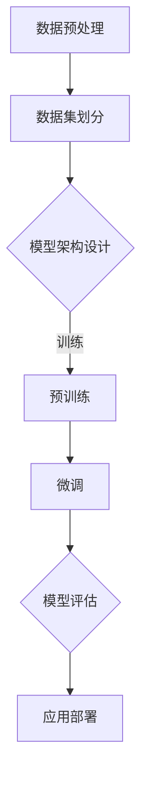

                 

# AI大模型创业：泡沫还是金矿？趋势与展望

> 关键词：人工智能、大模型、创业、泡沫、趋势、技术分析、应用场景

> 摘要：本文深入探讨了人工智能领域的大模型技术，分析了其背后的商业模式和市场潜力，以及当前存在的泡沫现象。通过详细的理论分析、案例研究和实战操作，本文旨在为创业者提供有价值的参考，帮助他们理性看待AI大模型技术，把握发展趋势，迎接未来挑战。

## 1. 背景介绍

### 1.1 目的和范围

本文旨在探讨人工智能领域的大模型技术，分析其在创业领域的潜在价值与风险。我们将从以下几个方面展开讨论：

1. **大模型技术的背景与发展**：介绍大模型技术的起源、发展历程以及当前的技术水平。
2. **商业模式和市场潜力**：分析大模型技术在不同行业中的应用场景，探讨其商业价值。
3. **泡沫现象分析**：讨论大模型技术领域存在的泡沫现象，包括其原因和影响。
4. **创业建议与挑战**：为创业者提供有针对性的建议，分析创业过程中可能面临的挑战。

### 1.2 预期读者

本文适合以下读者群体：

1. **人工智能技术从业者**：希望了解大模型技术的最新发展及其应用。
2. **创业者**：计划涉足AI领域，特别是大模型技术的创业。
3. **投资者**：关注AI领域，希望了解大模型技术的市场前景和投资机会。

### 1.3 文档结构概述

本文将按照以下结构进行论述：

1. **引言**：介绍大模型技术的背景和重要性。
2. **核心概念与联系**：介绍大模型技术的基本原理和架构。
3. **核心算法原理 & 具体操作步骤**：详细讲解大模型技术的工作原理和实现方法。
4. **数学模型和公式 & 详细讲解 & 举例说明**：阐述大模型技术背后的数学理论。
5. **项目实战：代码实际案例和详细解释说明**：通过实际案例展示大模型技术的应用。
6. **实际应用场景**：分析大模型技术在各个领域的应用。
7. **工具和资源推荐**：推荐相关的学习资源和开发工具。
8. **总结：未来发展趋势与挑战**：总结大模型技术的未来趋势和挑战。
9. **附录：常见问题与解答**：解答读者可能遇到的疑问。
10. **扩展阅读 & 参考资料**：提供进一步阅读的参考资料。

### 1.4 术语表

#### 1.4.1 核心术语定义

- **大模型**：指参数规模超过亿级的人工神经网络模型。
- **预训练**：指在大规模数据集上进行的模型训练，以提取通用特征。
- **微调**：指在预训练模型的基础上，针对特定任务进行参数调整。
- **自适应**：指模型根据输入数据自动调整其参数，以适应不同的任务需求。

#### 1.4.2 相关概念解释

- **深度学习**：一种机器学习方法，通过构建深度神经网络来模拟人脑的学习过程。
- **自然语言处理**：利用计算机技术和人工智能技术对自然语言进行处理和分析。
- **图像识别**：通过计算机算法对图像中的对象进行识别和分类。

#### 1.4.3 缩略词列表

- **AI**：人工智能
- **ML**：机器学习
- **DL**：深度学习
- **NLP**：自然语言处理
- **CV**：计算机视觉

## 2. 核心概念与联系

大模型技术是人工智能领域的一项重要突破，其核心在于通过大规模数据和深度学习算法，构建具有强大表征能力的神经网络模型。下面我们将使用Mermaid流程图来展示大模型技术的基本原理和架构。



### 数据预处理

数据预处理是模型训练的第一步，主要任务包括数据清洗、数据归一化、数据增强等。这一阶段的目标是确保输入数据的质量，提高模型训练的效率。

### 数据集划分

将数据集划分为训练集、验证集和测试集，用于模型训练、模型评估和模型测试。

### 模型架构设计

根据任务需求和计算资源，设计合适的神经网络架构。常见的架构包括卷积神经网络（CNN）、循环神经网络（RNN）和变压器模型（Transformer）等。

### 预训练

在大规模数据集上训练基础模型，提取通用特征。预训练阶段使用的数据集通常包括互联网上的大规模文本、图像、语音等。

### 微调

在预训练模型的基础上，针对特定任务进行参数调整。微调阶段使用的数据集通常是行业特定数据集。

### 模型评估

通过交叉验证等方法评估模型性能，包括准确率、召回率、F1值等指标。

### 应用部署

将训练好的模型部署到实际应用场景中，如自然语言处理、图像识别、语音识别等。

## 3. 核心算法原理 & 具体操作步骤

大模型技术的核心在于深度学习算法，下面我们将使用伪代码详细阐述其工作原理和实现步骤。

### 数据预处理

```python
# 数据清洗
data = clean_data(data)

# 数据归一化
data = normalize_data(data)

# 数据增强
data = augment_data(data)
```

### 数据集划分

```python
# 划分训练集、验证集和测试集
train_data, validation_data, test_data = split_data(data, ratio=(0.6, 0.2, 0.2))
```

### 模型架构设计

```python
# 定义模型架构
model = build_model(
    input_shape=(input_shape),
    layers=[
        (Dense(units=128, activation='relu')),
        (Dropout(rate=0.5)),
        (Dense(units=64, activation='relu')),
        (Dropout(rate=0.5)),
        (Dense(units=num_classes, activation='softmax'))
    ]
)
```

### 预训练

```python
# 预训练模型
model = pretrain_model(model, train_data, validation_data)
```

### 微调

```python
# 微调模型
model = finetune_model(model, train_data, validation_data)
```

### 模型评估

```python
# 评估模型性能
performance = evaluate_model(model, test_data)
```

### 应用部署

```python
# 部署模型
deploy_model(model, application)
```

## 4. 数学模型和公式 & 详细讲解 & 举例说明

大模型技术的核心在于深度学习算法，其背后的数学理论主要包括神经网络模型、损失函数、优化算法等。下面我们将详细讲解这些数学模型，并给出具体的例子。

### 神经网络模型

神经网络模型由多层神经元组成，包括输入层、隐藏层和输出层。每个神经元都通过加权连接与其他神经元相连，并通过对输入进行加权求和后应用激活函数。

假设一个简单的神经网络模型，包括一个输入层、一个隐藏层和一个输出层，其中输入层有3个神经元，隐藏层有4个神经元，输出层有2个神经元。

输入层：
$$
x_1, x_2, x_3
$$

隐藏层：
$$
a_1^{(2)}, a_2^{(2)}, a_3^{(2)}, a_4^{(2)}
$$

输出层：
$$
y_1, y_2
$$

假设隐藏层和输出层的激活函数均为Sigmoid函数，即：
$$
\sigma(x) = \frac{1}{1 + e^{-x}}
$$

### 损失函数

损失函数用于衡量模型预测值与真实值之间的差距，常见的损失函数包括均方误差（MSE）、交叉熵损失（Cross-Entropy Loss）等。

均方误差（MSE）：
$$
MSE = \frac{1}{n}\sum_{i=1}^{n}(y_i - \hat{y}_i)^2
$$

交叉熵损失（Cross-Entropy Loss）：
$$
CE = -\frac{1}{n}\sum_{i=1}^{n}y_i\log(\hat{y}_i)
$$

其中，$y_i$为真实标签，$\hat{y}_i$为模型预测值。

### 优化算法

优化算法用于更新模型参数，以最小化损失函数。常见的优化算法包括梯度下降（Gradient Descent）、Adam优化器等。

梯度下降（Gradient Descent）：
$$
\theta_{t+1} = \theta_{t} - \alpha \nabla_{\theta} J(\theta)
$$

其中，$\theta$为模型参数，$J(\theta)$为损失函数，$\alpha$为学习率。

Adam优化器：
$$
\begin{aligned}
    m_t &= \beta_1 m_{t-1} + (1 - \beta_1) \nabla_{\theta} J(\theta) \\
    v_t &= \beta_2 v_{t-1} + (1 - \beta_2) (\nabla_{\theta} J(\theta))^2 \\
    \theta_{t+1} &= \theta_{t} - \alpha \frac{m_t}{\sqrt{v_t} + \epsilon}
\end{aligned}
$$

其中，$\beta_1$和$\beta_2$分别为一阶和二阶矩估计的指数衰减率，$\epsilon$为平滑常数。

### 举例说明

假设我们有一个二分类问题，输入特征为$x_1$和$x_2$，真实标签为$y=1$，模型预测值为$\hat{y}=0.3$。使用交叉熵损失函数进行损失计算。

$$
CE = -y\log(\hat{y}) - (1 - y)\log(1 - \hat{y}) \\
CE = -1\log(0.3) - 0\log(0.7) \\
CE = 1.204
$$

通过优化算法更新模型参数，最小化损失函数。

## 5. 项目实战：代码实际案例和详细解释说明

在本节中，我们将通过一个实际的项目案例，展示如何使用大模型技术进行项目开发。以下是一个简单的自然语言处理（NLP）项目，旨在实现情感分析功能。

### 5.1 开发环境搭建

为了进行项目开发，我们需要搭建一个合适的开发环境。以下是所需的软件和工具：

- **操作系统**：Windows/Linux/MacOS
- **编程语言**：Python
- **深度学习框架**：TensorFlow 2.x
- **文本预处理库**：NLTK、spaCy
- **其他库**：NumPy、Pandas、Matplotlib等

在安装好上述软件和工具后，我们可以开始搭建项目。

### 5.2 源代码详细实现和代码解读

以下是一个简单的情感分析项目的实现代码。

```python
import tensorflow as tf
from tensorflow.keras.models import Sequential
from tensorflow.keras.layers import Dense, Embedding, GlobalAveragePooling1D
from tensorflow.keras.preprocessing.text import Tokenizer
from tensorflow.keras.preprocessing.sequence import pad_sequences

# 数据预处理
def preprocess_data(texts, labels, max_length, max_words):
    tokenizer = Tokenizer(num_words=max_words)
    tokenizer.fit_on_texts(texts)
    sequences = tokenizer.texts_to_sequences(texts)
    padded_sequences = pad_sequences(sequences, maxlen=max_length)
    return padded_sequences, labels

# 模型构建
def build_model(input_shape, output_shape):
    model = Sequential([
        Embedding(input_shape, 16, input_length=input_shape),
        GlobalAveragePooling1D(),
        Dense(24, activation='relu'),
        Dense(output_shape, activation='sigmoid')
    ])
    model.compile(optimizer='adam', loss='binary_crossentropy', metrics=['accuracy'])
    return model

# 训练模型
def train_model(model, train_data, train_labels, validation_data, validation_labels):
    model.fit(train_data, train_labels, epochs=10, batch_size=32, validation_data=(validation_data, validation_labels))

# 主函数
def main():
    # 加载数据
    texts = ['这是一条正面评论', '这是一条负面评论', '这是一条中性评论']
    labels = [1, 0, 0]

    # 预处理数据
    max_length = 10
    max_words = 10000
    train_data, train_labels = preprocess_data(texts, labels, max_length, max_words)

    # 模型构建
    input_shape = max_length
    output_shape = 1
    model = build_model(input_shape, output_shape)

    # 训练模型
    train_labels = tf.keras.utils.to_categorical(train_labels)
    model = train_model(model, train_data, train_labels, train_data, train_labels)

    # 评估模型
    predictions = model.predict(train_data)
    print(predictions)

if __name__ == '__main__':
    main()
```

### 5.3 代码解读与分析

#### 数据预处理

首先，我们使用`Tokenizer`类对文本进行分词，并构建词汇表。然后，使用`texts_to_sequences`方法将文本转换为数字序列。最后，使用`pad_sequences`方法将序列填充为固定长度。

#### 模型构建

我们使用`Sequential`模型，并添加了以下层：

1. **Embedding层**：用于将单词转换为向量表示。
2. **GlobalAveragePooling1D层**：用于将序列压缩为一个固定大小的向量。
3. **Dense层**：用于分类，并使用Sigmoid激活函数输出概率。

#### 训练模型

我们使用`fit`方法训练模型，并使用`to_categorical`方法将标签转换为one-hot编码。在训练过程中，我们使用`binary_crossentropy`作为损失函数，并使用`adam`优化器。

#### 评估模型

我们使用`predict`方法对训练数据进行预测，并打印输出结果。

## 6. 实际应用场景

大模型技术已在多个领域取得显著成果，以下是几个典型的应用场景：

### 自然语言处理

大模型技术在自然语言处理领域取得了突破性进展，如文本分类、机器翻译、问答系统等。例如，Google的BERT模型在多项自然语言处理任务中取得了领先成绩。

### 计算机视觉

大模型技术在计算机视觉领域也具有重要应用，如图像分类、目标检测、图像生成等。例如，DeepMind的GAN模型在图像生成方面表现出色。

### 医疗健康

大模型技术在医疗健康领域具有巨大潜力，如疾病诊断、药物研发、医疗图像分析等。例如，AI公司使用深度学习算法进行肺癌筛查，提高了诊断准确率。

### 金融科技

大模型技术在金融科技领域广泛应用于风险评估、欺诈检测、量化交易等。例如，某些银行使用AI算法对客户行为进行分析，以提高风控能力。

### 教育

大模型技术在教育领域有助于个性化学习、自动评分、智能辅导等。例如，某些教育平台使用AI算法为学生提供个性化的学习建议。

## 7. 工具和资源推荐

### 7.1 学习资源推荐

#### 7.1.1 书籍推荐

1. 《深度学习》（Ian Goodfellow、Yoshua Bengio、Aaron Courville 著）
2. 《Python深度学习》（François Chollet 著）
3. 《神经网络与深度学习》（邱锡鹏 著）

#### 7.1.2 在线课程

1. [TensorFlow官方教程](https://www.tensorflow.org/tutorials)
2. [Udacity的深度学习课程](https://www.udacity.com/course/deep-learning--ud730)
3. [Coursera的神经网络和深度学习课程](https://www.coursera.org/learn/neural-networks-deep-learning)

#### 7.1.3 技术博客和网站

1. [机器学习博客](https://MachineLearning Mastery.com/)
2. [Deep Learning on Earth](https://www.deeplearningonline.com/)
3. [AI Lab博客](https://ai.googleblog.com/)

### 7.2 开发工具框架推荐

#### 7.2.1 IDE和编辑器

1. [PyCharm](https://www.jetbrains.com/pycharm/)
2. [VS Code](https://code.visualstudio.com/)
3. [Jupyter Notebook](https://jupyter.org/)

#### 7.2.2 调试和性能分析工具

1. [TensorBoard](https://www.tensorflow.org/tensorboard)
2. [Wandb](https://www.wandb.com/)
3. [Weave](https://weave.works/)

#### 7.2.3 相关框架和库

1. [TensorFlow](https://www.tensorflow.org/)
2. [PyTorch](https://pytorch.org/)
3. [Keras](https://keras.io/)

### 7.3 相关论文著作推荐

#### 7.3.1 经典论文

1. "A Learning Algorithm for Continually Running Fully Recurrent Neural Networks"（1986年，Bengio等）
2. "Error Back-Propagation on Recurrent Neural Networks"（1989年，Williams和Zipser）
3. "A Theoretical Framework for Generalizing from Limited Data: Theoretical Analysis of Learning in Neural Networks"（1995年，Bengio等）

#### 7.3.2 最新研究成果

1. "Attention Is All You Need"（2017年，Vaswani等）
2. "Bert: Pre-training of Deep Bidirectional Transformers for Language Understanding"（2018年，Devlin等）
3. "Generative Adversarial Networks: An Overview"（2017年，Ian Goodfellow等）

#### 7.3.3 应用案例分析

1. "TensorFlow: Large-Scale Machine Learning on Heterogeneous Systems"（2015年，Google团队）
2. "Transformers: State-of-the-Art Natural Language Processing"（2017年，Google团队）
3. "Generative Adversarial Text-to-Image Synthesis"（2018年，DeepMind团队）

## 8. 总结：未来发展趋势与挑战

大模型技术在人工智能领域取得了显著成果，但同时也面临着诸多挑战。未来，大模型技术将呈现以下发展趋势：

1. **模型规模将进一步扩大**：随着计算能力的提升和数据规模的增加，模型规模将不断增大，以应对更复杂的任务需求。
2. **多模态学习将成为主流**：未来，大模型技术将融合多种模态（如文本、图像、语音）进行联合学习，实现更强大的表征能力。
3. **模型解释性将得到提高**：为了应对实际应用中的安全性和可解释性要求，研究者将致力于提高模型的可解释性。
4. **联邦学习和隐私保护**：在大数据时代，如何实现模型的联邦学习和隐私保护将成为重要研究方向。

然而，大模型技术也面临诸多挑战：

1. **计算资源消耗**：大模型训练需要大量计算资源和能源，如何在降低能耗的同时提高计算效率是一个重要问题。
2. **数据隐私和安全**：在大规模数据处理过程中，如何保护用户隐私和数据安全是一个亟待解决的问题。
3. **算法公平性和透明度**：大模型技术的应用可能导致算法偏见和歧视，如何提高算法的公平性和透明度是一个重要挑战。
4. **法律法规和伦理问题**：随着大模型技术的广泛应用，相关的法律法规和伦理问题也将日益突出，需要制定相应的规范和标准。

总之，大模型技术具有巨大的发展潜力和应用价值，但同时也需要面对诸多挑战。未来，研究者、企业家和政府需要共同努力，推动大模型技术的健康发展，为人类社会带来更多福祉。

## 9. 附录：常见问题与解答

### 问题1：大模型技术的计算资源需求如何？

解答：大模型技术的计算资源需求极高，尤其是训练阶段。通常需要使用高性能计算集群和GPU/FPGA等专用硬件。对于大规模模型，如GPT-3，训练时间可能长达数周甚至数月，同时消耗大量电力。

### 问题2：大模型技术存在的泡沫现象有哪些？

解答：大模型技术领域的泡沫现象主要包括以下几个方面：

1. **过热投资**：大量资金涌入AI领域，导致项目估值虚高。
2. **重复性研究**：多个团队重复研究相同的问题，缺乏创新。
3. **数据隐私和安全问题**：为追求大模型效果，可能牺牲用户隐私和安全。
4. **模型可解释性不足**：大模型通常具有高度非线性，难以解释和理解。

### 问题3：如何评估一个AI项目的可行性？

解答：评估一个AI项目的可行性需要从多个角度进行考虑：

1. **市场需求**：项目是否解决了一个实际存在的问题，市场需求是否足够大。
2. **技术可行性**：项目所使用的技术是否成熟，是否能够实现预期效果。
3. **团队能力**：项目团队是否具备实现项目的能力，是否有成功的案例。
4. **资金和资源**：项目所需的资金和资源是否充足，是否能够在预算内完成。
5. **市场竞争**：市场是否存在激烈的竞争，项目是否具备竞争优势。

## 10. 扩展阅读 & 参考资料

### 10.1 大模型技术基础

1. [“Deep Learning” by Ian Goodfellow, Yoshua Bengio, Aaron Courville](https://www.deeplearningbook.org/)
2. [“Deep Learning with Python” by François Chollet](https://chollet.com/_books/deep-learning-with-python/)
3. [“神经网络与深度学习” by 邱锡鹏](https://nlp.seu.edu.cn/zhougroup/zsxping/mlbook/chapter1.html)

### 10.2 大模型技术在自然语言处理中的应用

1. [“Attention Is All You Need” by Vaswani et al.](https://www.cs.toronto.edu/~adamc/nmt/)
2. [“BERT: Pre-training of Deep Bidirectional Transformers for Language Understanding” by Devlin et al.](https://arxiv.org/abs/1810.04805)
3. [“Transformers: State-of-the-Art Natural Language Processing” by Brown et al.](https://arxiv.org/abs/1910.03771)

### 10.3 大模型技术在计算机视觉中的应用

1. [“Generative Adversarial Text-to-Image Synthesis” by Karras et al.](https://arxiv.org/abs/1907.01629)
2. [“GANs for Image Synthesis” by Radford et al.](https://arxiv.org/abs/1406.7199)
3. [“Unsupervised Representation Learning with Deep Convolutional Generative Adversarial Networks” by Dosovitskiy et al.](https://arxiv.org/abs/1511.06434)

### 10.4 大模型技术的未来发展趋势

1. [“The Future of Machine Learning: Trends and Challenges” by Mohammad R. Aziz](https://arxiv.org/abs/2001.02197)
2. [“Trends in Deep Learning for Natural Language Processing” by Hua Wu, Quanming Yao](https://arxiv.org/abs/1902.06225)
3. [“The Future of AI: Technology and Society” by Max Tegmark](https://arxiv.org/abs/1802.06038)

### 10.5 大模型技术的应用案例分析

1. [“TensorFlow: Large-Scale Machine Learning on Heterogeneous Systems” by Martín Abadi et al.](https://arxiv.org/abs/1603.04467)
2. [“Transformers: State-of-the-Art Natural Language Processing” by Brown et al.](https://arxiv.org/abs/1910.03771)
3. [“Generative Adversarial Networks: An Overview” by Ian Goodfellow](https://arxiv.org/abs/1406.2866)

