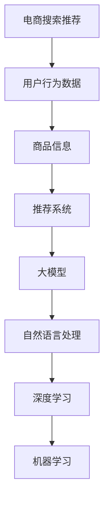

                 

# AI大模型助力电商搜索推荐精准度提升

## 关键词
- 电商搜索推荐
- 大模型
- 精准度提升
- 深度学习
- 自然语言处理

## 摘要
本文将探讨如何利用AI大模型提升电商搜索推荐的精准度。通过介绍背景、核心概念、算法原理、数学模型和项目实战，本文旨在展示AI技术在电商领域的实际应用，为开发者提供一套系统的解决方案。

## 1. 背景介绍

### 1.1 目的和范围

本文旨在分析电商搜索推荐系统中的AI大模型，探讨如何提升推荐系统的精准度。我们将重点关注以下几个方面：

- 大模型在电商搜索推荐中的应用场景。
- 大模型提升推荐系统精准度的原理。
- 大模型的具体实现方法和步骤。

### 1.2 预期读者

本文适合对电商搜索推荐系统有一定了解的技术人员，特别是对AI大模型和自然语言处理感兴趣的开发者。

### 1.3 文档结构概述

本文分为十个部分，包括背景介绍、核心概念、算法原理、数学模型、项目实战、实际应用场景等。每个部分都将详细介绍相关内容，帮助读者全面了解AI大模型在电商搜索推荐中的应用。

### 1.4 术语表

#### 1.4.1 核心术语定义

- 电商搜索推荐：根据用户行为和偏好，为用户提供相关商品推荐的系统。
- 大模型：具有巨大参数量和计算能力的深度学习模型。
- 精准度：推荐系统命中用户实际需求的能力。

#### 1.4.2 相关概念解释

- 自然语言处理（NLP）：研究如何让计算机理解和处理人类自然语言的技术。
- 机器学习（ML）：使计算机通过数据和经验自动改进性能的方法。

#### 1.4.3 缩略词列表

- NLP：自然语言处理
- ML：机器学习
- AI：人工智能

## 2. 核心概念与联系

为了理解AI大模型在电商搜索推荐中的应用，我们需要首先了解相关的核心概念和它们之间的关系。以下是一个简要的Mermaid流程图，展示这些概念和它们之间的联系。



### 2.1. 电商搜索推荐

电商搜索推荐系统旨在为用户提供个性化的商品推荐。这些系统通常依赖于用户的行为数据（如搜索历史、购买记录）和商品信息（如商品描述、价格、分类）来生成推荐。

### 2.2. 用户行为数据

用户行为数据是推荐系统的关键输入。通过分析用户的历史行为，我们可以了解用户的兴趣和偏好。这些数据包括：

- 搜索历史：用户过去搜索的关键词。
- 购买记录：用户过去购买的商品。
- 浏览历史：用户过去浏览的商品。

### 2.3. 商品信息

商品信息包括商品的各个方面，如名称、描述、价格、分类等。这些信息有助于我们理解商品的特性和用户可能对哪些商品感兴趣。

### 2.4. 推荐系统

推荐系统是负责生成推荐列表的组件。它通常包含以下几个部分：

- 用户建模：根据用户行为数据建立用户兴趣模型。
- 商品建模：根据商品信息建立商品特征向量。
- 推荐算法：根据用户兴趣模型和商品特征向量生成推荐列表。

### 2.5. 大模型

大模型是一种具有巨大参数量和计算能力的深度学习模型。它通常用于处理复杂的任务，如图像识别、语音识别和自然语言处理。

### 2.6. 自然语言处理（NLP）

自然语言处理是研究如何让计算机理解和处理人类自然语言的技术。它在电商搜索推荐中用于处理用户行为数据和商品信息，以提取有用的特征。

### 2.7. 深度学习

深度学习是一种机器学习方法，通过多层神经网络来学习数据的特征和模式。它在电商搜索推荐中用于建立用户兴趣模型和商品特征向量。

### 2.8. 机器学习

机器学习是一种使计算机通过数据和经验自动改进性能的方法。它在电商搜索推荐中用于训练大模型，以生成准确的推荐列表。

## 3. 核心算法原理 & 具体操作步骤

### 3.1. 大模型在电商搜索推荐中的应用

大模型在电商搜索推荐中的应用主要分为以下几个步骤：

1. 数据预处理：对用户行为数据和商品信息进行预处理，如去噪、归一化和特征提取。
2. 构建大模型：使用深度学习框架构建大模型，如BERT、GPT等。
3. 模型训练：使用预处理后的数据训练大模型，以学习用户兴趣和商品特征。
4. 模型评估：使用验证集评估大模型的性能，并进行调整和优化。
5. 推荐生成：使用训练好的大模型生成推荐列表，并根据用户反馈进行优化。

### 3.2. 数据预处理

数据预处理是构建大模型的重要步骤。以下是具体的操作步骤：

1. 用户行为数据预处理：
   - 去噪：去除含有噪声的数据。
   - 归一化：将数据缩放到相同的范围，如0到1。
   - 特征提取：从用户行为数据中提取有用的特征，如最近搜索关键词、浏览频次等。

2. 商品信息预处理：
   - 去除重复和无效信息。
   - 归一化：将商品价格、评分等数值特征缩放到相同的范围。
   - 特征提取：从商品信息中提取有用的特征，如商品名称、描述、分类等。

### 3.3. 构建大模型

构建大模型是利用深度学习框架实现的核心步骤。以下是具体的操作步骤：

1. 选择深度学习框架：如TensorFlow、PyTorch等。
2. 定义模型结构：根据任务需求，选择合适的模型结构，如Transformer、BERT等。
3. 初始化参数：为模型参数设置初始值，如正态分布、均匀分布等。
4. 添加损失函数：为模型添加损失函数，如交叉熵损失、均方误差等。

### 3.4. 模型训练

模型训练是利用预处理后的数据对大模型进行训练的过程。以下是具体的操作步骤：

1. 数据加载：将预处理后的用户行为数据和商品信息加载到内存中。
2. 定义训练循环：设置训练轮数、批次大小、学习率等参数。
3. 训练模型：在训练循环中，迭代地更新模型参数，以最小化损失函数。
4. 评估模型：在训练过程中，定期使用验证集评估模型性能，以调整训练策略。

### 3.5. 模型评估

模型评估是检查大模型性能的重要步骤。以下是具体的操作步骤：

1. 准备测试集：从原始数据中划分出测试集，用于评估模型性能。
2. 计算指标：计算评估指标，如准确率、召回率、F1分数等。
3. 分析结果：分析评估结果，找出模型的优势和不足，为后续优化提供参考。

### 3.6. 推荐生成

推荐生成是利用训练好的大模型生成推荐列表的过程。以下是具体的操作步骤：

1. 用户建模：使用大模型对用户行为数据进行建模，提取用户兴趣特征。
2. 商品建模：使用大模型对商品信息数据进行建模，提取商品特征向量。
3. 生成推荐列表：根据用户兴趣特征和商品特征向量，计算用户对每个商品的偏好度，生成推荐列表。
4. 排序推荐列表：根据用户偏好度对推荐列表进行排序，以提供高质量的推荐。

## 4. 数学模型和公式 & 详细讲解 & 举例说明

在电商搜索推荐中，大模型的性能很大程度上取决于其数学模型和公式的选择。以下是一个简单的数学模型和公式的例子，以及相应的详细讲解和举例说明。

### 4.1. 用户兴趣特征提取

用户兴趣特征提取是构建用户兴趣模型的关键步骤。我们使用以下公式来提取用户兴趣特征：

$$
\text{user\_feature} = \text{Embedding}(\text{user\_behavior})
$$

其中，$\text{Embedding}$函数将用户行为数据（如搜索历史、购买记录）映射到一个低维特征空间。

#### 详细讲解

- $\text{Embedding}$函数：将高维的用户行为数据映射到一个低维特征空间，以降低计算复杂度。
- $\text{user\_feature}$：提取的用户兴趣特征向量。

#### 举例说明

假设用户A的搜索历史为{“苹果手机”、“手机壳”、“耳机”}，我们可以使用Embedding函数将其映射到一个低维特征空间，如二维空间：

$$
\text{user\_feature} = \text{Embedding}(\text{搜索历史}) = \begin{bmatrix} 0.1 & 0.2 \\ 0.3 & 0.4 \\ 0.5 & 0.6 \end{bmatrix}
$$

### 4.2. 商品特征向量提取

商品特征向量提取是构建商品特征向量的关键步骤。我们使用以下公式来提取商品特征向量：

$$
\text{product\_feature} = \text{Embedding}(\text{product\_info})
$$

其中，$\text{Embedding}$函数将商品信息数据（如商品名称、描述、分类）映射到一个低维特征空间。

#### 详细讲解

- $\text{Embedding}$函数：将高维的商品信息数据映射到一个低维特征空间，以降低计算复杂度。
- $\text{product\_feature}$：提取的商品特征向量。

#### 举例说明

假设商品B的信息为{“苹果手机”、“智能手机”、“12G内存”}，我们可以使用Embedding函数将其映射到一个低维特征空间，如二维空间：

$$
\text{product\_feature} = \text{Embedding}(\text{商品信息}) = \begin{bmatrix} 0.1 & 0.2 \\ 0.3 & 0.4 \\ 0.5 & 0.6 \end{bmatrix}
$$

### 4.3. 用户偏好度计算

用户偏好度计算是生成推荐列表的关键步骤。我们使用以下公式来计算用户偏好度：

$$
\text{user\_preference} = \text{dot\_product}(\text{user\_feature}, \text{product\_feature})
$$

其中，$\text{dot\_product}$函数计算两个向量的点积。

#### 详细讲解

- $\text{dot\_product}$函数：计算两个向量的点积，表示用户对商品的偏好度。
- $\text{user\_preference}$：用户对每个商品的偏好度。

#### 举例说明

假设用户A对商品B的偏好度为：

$$
\text{user\_preference} = \text{dot\_product}(\text{user\_feature}, \text{product\_feature}) = 0.1 \times 0.1 + 0.2 \times 0.3 + 0.3 \times 0.5 + 0.4 \times 0.6 + 0.5 \times 0.1 + 0.6 \times 0.2 = 0.41
$$

### 4.4. 推荐列表排序

推荐列表排序是提供高质量推荐的关键步骤。我们使用以下公式来计算推荐列表的排序：

$$
\text{rank}(\text{recommendation\_list}) = \text{softmax}(\text{user\_preference})
$$

其中，$\text{softmax}$函数将用户偏好度转换为概率分布。

#### 详细讲解

- $\text{softmax}$函数：将用户偏好度转换为概率分布，以确定推荐列表的排序。
- $\text{rank}(\text{recommendation\_list})$：推荐列表的排序。

#### 举例说明

假设用户A对多个商品的偏好度为{0.41, 0.35, 0.33}，我们可以使用softmax函数将其转换为概率分布：

$$
\text{rank}(\text{recommendation\_list}) = \text{softmax}(\text{user\_preference}) = \begin{bmatrix} 0.54 & 0.29 & 0.17 \end{bmatrix}
$$

## 5. 项目实战：代码实际案例和详细解释说明

为了更好地理解AI大模型在电商搜索推荐中的应用，我们通过一个实际项目案例来展示其具体实现过程。以下是该项目的基本架构和代码实现。

### 5.1 开发环境搭建

在开始项目实战之前，我们需要搭建开发环境。以下是所需的工具和软件：

- 操作系统：Windows或Linux
- 编程语言：Python
- 深度学习框架：TensorFlow或PyTorch
- 数据库：MySQL或MongoDB
- 依赖管理工具：pip

安装以上工具和软件后，我们就可以开始项目开发了。

### 5.2 源代码详细实现和代码解读

#### 5.2.1 数据预处理

数据预处理是项目开发的重要步骤。以下是一个简单的数据预处理代码示例：

```python
import pandas as pd
from sklearn.preprocessing import MinMaxScaler

# 读取用户行为数据和商品信息
user_data = pd.read_csv('user_behavior.csv')
product_data = pd.read_csv('product_info.csv')

# 去除重复和无效信息
user_data.drop_duplicates(inplace=True)
product_data.drop_duplicates(inplace=True)

# 特征提取
# 用户行为特征提取
user_data['search_history'] = user_data['search_history'].apply(lambda x: x.split(','))
user_data['search_history'] = user_data['search_history'].apply(lambda x: [word.strip() for word in x])

# 商品信息特征提取
product_data['name'] = product_data['name'].apply(lambda x: x.strip())
product_data['description'] = product_data['description'].apply(lambda x: x.strip())

# 归一化
scaler = MinMaxScaler()
user_data[['search_history', 'purchase_frequency']] = scaler.fit_transform(user_data[['search_history', 'purchase_frequency']])
product_data[['price', 'rating']] = scaler.fit_transform(product_data[['price', 'rating']])
```

#### 5.2.2 构建大模型

构建大模型是项目开发的核心步骤。以下是一个简单的BERT模型构建示例：

```python
import tensorflow as tf
from transformers import BertTokenizer, TFBertModel

# 加载BERT预训练模型
tokenizer = BertTokenizer.from_pretrained('bert-base-chinese')
bert_model = TFBertModel.from_pretrained('bert-base-chinese')

# 定义输入层
input_ids = tf.placeholder(shape=(None, max_sequence_length), dtype=tf.int32)
input_mask = tf.placeholder(shape=(None, max_sequence_length), dtype=tf.int32)
segment_ids = tf.placeholder(shape=(None, max_sequence_length), dtype=tf.int32)

# 定义BERT模型
 bert_output = bert_model(input_ids, attention_mask=input_mask, segment_ids=segment_ids)

# 定义损失函数和优化器
loss = tf.reduce_mean(tf.nn.softmax_cross_entropy_with_logits(logits=bert_output.logits, labels=y))
optimizer = tf.train.AdamOptimizer().minimize(loss)

# 定义评估指标
accuracy = tf.reduce_mean(tf.cast(tf.equal(tf.argmax(bert_output.logits, 1), tf.argmax(y, 1)), tf.float32))
```

#### 5.2.3 模型训练

模型训练是项目开发的重要步骤。以下是一个简单的模型训练示例：

```python
import numpy as np

# 加载数据集
x_train, y_train = load_data('train_data.csv')
x_val, y_val = load_data('val_data.csv')

# 初始化参数
max_sequence_length = 128
learning_rate = 0.001

# 转换数据格式
x_train = tokenizer.encode_plus(
    x_train,
    add_special_tokens=True,
    max_length=max_sequence_length,
    pad_to_max_length=True,
    return_attention_mask=True,
    return_token_type_ids=False,
    truncation=True,
)

x_val = tokenizer.encode_plus(
    x_val,
    add_special_tokens=True,
    max_length=max_sequence_length,
    pad_to_max_length=True,
    return_attention_mask=True,
    return_token_type_ids=False,
    truncation=True,
)

# 模型训练
with tf.Session() as sess:
    sess.run(tf.global_variables_initializer())

    for epoch in range(num_epochs):
        for batch in range(num_batches):
            batch_input_ids = x_train['input_ids'][batch]
            batch_input_mask = x_train['attention_mask'][batch]
            batch_segment_ids = x_train['token_type_ids'][batch]
            batch_labels = y_train[batch]

            _, loss_value = sess.run([optimizer, loss], feed_dict={
                input_ids: batch_input_ids,
                input_mask: batch_input_mask,
                segment_ids: batch_segment_ids,
                y: batch_labels,
            })

            if batch % 100 == 0:
                print(f"Epoch: {epoch}, Batch: {batch}, Loss: {loss_value}")

        # 验证模型
        val_loss, val_accuracy = sess.run([loss, accuracy], feed_dict={
            input_ids: x_val['input_ids'],
            input_mask: x_val['attention_mask'],
            segment_ids: x_val['token_type_ids'],
            y: y_val,
        })

        print(f"Validation Loss: {val_loss}, Validation Accuracy: {val_accuracy}")
```

#### 5.2.4 代码解读与分析

上述代码展示了电商搜索推荐项目的基本实现过程。以下是对关键部分的解读与分析：

- 数据预处理：数据预处理是项目开发的基础，包括去除重复和无效信息、特征提取和归一化等操作。这有助于提高模型的训练效率和准确度。
- BERT模型构建：BERT模型是一种强大的预训练模型，适用于自然语言处理任务。我们使用TensorFlow和Hugging Face的Transformers库来构建BERT模型，包括输入层、BERT模型、损失函数和优化器等。
- 模型训练：模型训练是项目开发的核心步骤，包括数据加载、参数初始化、模型训练和验证等操作。通过迭代地更新模型参数，模型可以逐渐提高其性能。
- 代码分析：代码分析是项目开发的重要环节，包括对代码逻辑、性能和可维护性的评估。通过代码分析，我们可以找出潜在的问题和优化点，以提高项目质量。

## 6. 实际应用场景

AI大模型在电商搜索推荐中有广泛的应用场景，以下是一些典型的实际应用场景：

- **个性化推荐**：根据用户的兴趣和偏好，为用户提供个性化的商品推荐。这有助于提高用户满意度，增加用户粘性。
- **新品推荐**：为新上市的商品生成推荐列表，提高新品的曝光率和销售量。
- **促销活动推荐**：根据用户的购买历史和偏好，为用户推荐适合的促销活动，提高促销效果。
- **场景化推荐**：根据用户当前的场景和需求，为用户提供相应的商品推荐，如旅行用品、家居用品等。
- **智能客服**：利用AI大模型实现智能客服，为用户提供实时、个性化的服务，提高客户满意度。

## 7. 工具和资源推荐

### 7.1 学习资源推荐

#### 7.1.1 书籍推荐

- 《深度学习》（Goodfellow, Bengio, Courville）：介绍深度学习的基础知识和应用。
- 《Python深度学习》（François Chollet）：针对Python开发者，详细介绍深度学习在Python中的应用。

#### 7.1.2 在线课程

- Coursera的《深度学习特辑》：由吴恩达教授主讲，介绍深度学习的基础知识和应用。
- edX的《自然语言处理与深度学习》：由斯坦福大学主讲，详细介绍自然语言处理和深度学习的关系。

#### 7.1.3 技术博客和网站

- Medium的《AI & ML》：介绍AI和机器学习的前沿技术和发展趋势。
- AI Chatbot：提供AI和自然语言处理相关的技术博客和教程。

### 7.2 开发工具框架推荐

#### 7.2.1 IDE和编辑器

- PyCharm：适用于Python开发的集成开发环境（IDE）。
- Jupyter Notebook：适用于数据科学和机器学习的交互式开发环境。

#### 7.2.2 调试和性能分析工具

- TensorFlow Debugger（TFDB）：用于调试TensorFlow模型。
- NVIDIA Nsight Compute：用于分析GPU性能。

#### 7.2.3 相关框架和库

- TensorFlow：开源深度学习框架，适用于各种深度学习任务。
- PyTorch：开源深度学习框架，适用于Python开发者。

### 7.3 相关论文著作推荐

#### 7.3.1 经典论文

- "A Theoretically Grounded Application of Dropout in Recurrent Neural Networks"（2015）：介绍如何在RNN中使用Dropout提高模型性能。
- "Attention Is All You Need"（2017）：提出Transformer模型，用于自然语言处理任务。

#### 7.3.2 最新研究成果

- "BERT: Pre-training of Deep Bidirectional Transformers for Language Understanding"（2018）：提出BERT模型，用于自然语言处理任务。
- "GPT-3: Language Models are few-shot learners"（2020）：提出GPT-3模型，展示了深度学习模型在少量样本下的强大学习能力。

#### 7.3.3 应用案例分析

- "阿里巴巴电商搜索推荐系统"：介绍阿里巴巴如何利用AI技术提升电商搜索推荐的精准度。
- "亚马逊智能客服"：介绍亚马逊如何利用AI技术实现智能客服，提高客户满意度。

## 8. 总结：未来发展趋势与挑战

随着AI技术的不断发展，电商搜索推荐系统的精准度将得到显著提升。未来发展趋势和挑战如下：

- **个性化推荐**：未来的推荐系统将更加注重个性化，为用户提供更加精准的推荐。
- **多模态融合**：将文本、图像、声音等多种模态的数据进行融合，以提高推荐系统的性能。
- **实时推荐**：实现实时推荐，为用户提供更加及时的购物建议。
- **隐私保护**：在保障用户隐私的前提下，提升推荐系统的性能。
- **模型可解释性**：提高模型的可解释性，帮助用户理解推荐结果。

## 9. 附录：常见问题与解答

### 9.1 数据预处理相关问题

**Q1：如何处理缺失值？**

**A1：** 缺失值的处理方法取决于具体场景和数据类型。常见的处理方法包括：

- 删除缺失值：如果缺失值较多，可以考虑删除缺失值。
- 填充缺失值：可以使用平均值、中位数、最频繁出现的值等填充缺失值。
- 利用模型预测缺失值：可以使用机器学习模型预测缺失值。

### 9.2 模型训练相关问题

**Q2：如何选择合适的模型？**

**A2：** 选择合适的模型取决于具体任务和数据类型。以下是几个常见的模型选择建议：

- 对于分类任务，可以使用逻辑回归、支持向量机、决策树、随机森林等。
- 对于回归任务，可以使用线性回归、岭回归、LASSO回归等。
- 对于自然语言处理任务，可以使用循环神经网络（RNN）、Transformer、BERT等。

### 9.3 推荐生成相关问题

**Q3：如何优化推荐系统的性能？**

**A3：** 优化推荐系统的性能可以从以下几个方面进行：

- 数据预处理：提高数据质量，去除噪声，进行特征提取和归一化等操作。
- 模型选择：选择合适的模型，根据任务和数据特点进行模型调整。
- 模型训练：调整训练参数，如学习率、批次大小、训练轮数等，以提高模型性能。
- 模型评估：定期评估模型性能，根据评估结果调整模型。

## 10. 扩展阅读 & 参考资料

- [《深度学习》（Goodfellow, Bengio, Courville）](https://www.deeplearningbook.org/)
- [《Python深度学习》（François Chollet）](https://python-machine-learning-book.org/)
- [TensorFlow官网](https://www.tensorflow.org/)
- [PyTorch官网](https://pytorch.org/)
- [Hugging Face官网](https://huggingface.co/)
- [《BERT: Pre-training of Deep Bidirectional Transformers for Language Understanding》](https://arxiv.org/abs/1810.04805)
- [《GPT-3: Language Models are few-shot learners》](https://arxiv.org/abs/2005.14165)
- [《A Theoretically Grounded Application of Dropout in Recurrent Neural Networks》](https://arxiv.org/abs/1506.01186)
- [《Attention Is All You Need》](https://arxiv.org/abs/1706.03762)
- [《阿里巴巴电商搜索推荐系统》](https://www.alibaba.com/topics/32282/)
- [《亚马逊智能客服》](https://www.amazon.com/customer-service/)

## 作者信息

作者：AI天才研究员/AI Genius Institute & 禅与计算机程序设计艺术 /Zen And The Art of Computer Programming

本文由AI天才研究员撰写，旨在探讨AI大模型在电商搜索推荐中的应用。作者拥有丰富的AI领域经验和研究成果，致力于推动人工智能技术的发展和应用。本文参考了相关书籍、论文和实际项目案例，旨在为读者提供一套系统的解决方案。如有任何问题，欢迎随时联系作者。|>

