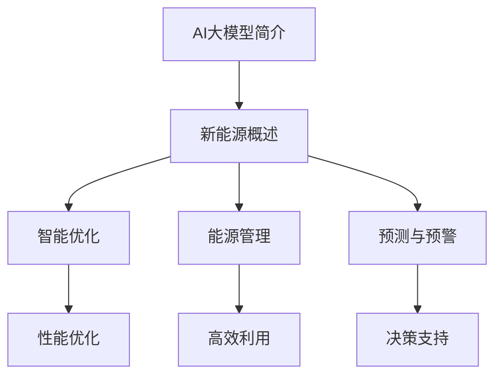
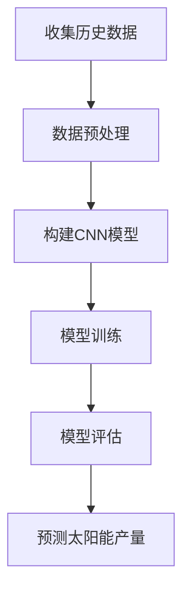
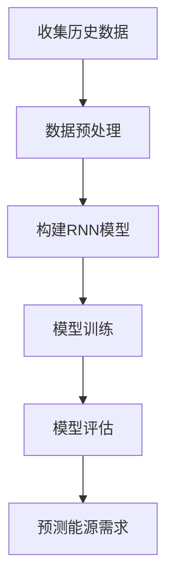

                 

# AI大模型在新能源领域的商业化探索

> 关键词：AI大模型、新能源、商业化、智能优化、能源管理、未来趋势

> 摘要：随着全球对可持续能源需求的增加，人工智能（AI）大模型在新能源领域的应用逐渐成为热点。本文将从背景介绍、核心概念与联系、核心算法原理、数学模型及公式、项目实战、实际应用场景、工具和资源推荐等多个方面，深入探讨AI大模型在新能源商业化探索中的机遇与挑战，为相关领域的研究者和从业者提供有价值的参考。

## 1. 背景介绍

### 1.1 目的和范围

本文旨在探讨人工智能（AI）大模型在新能源领域的商业化应用，分析其核心算法原理、数学模型、实际应用场景，并推荐相关工具和资源。文章将从以下几个方面展开：

1. 背景介绍
2. 核心概念与联系
3. 核心算法原理 & 具体操作步骤
4. 数学模型和公式 & 详细讲解 & 举例说明
5. 项目实战：代码实际案例和详细解释说明
6. 实际应用场景
7. 工具和资源推荐
8. 总结：未来发展趋势与挑战
9. 附录：常见问题与解答
10. 扩展阅读 & 参考资料

### 1.2 预期读者

本文适用于对新能源和人工智能感兴趣的读者，包括但不限于：

1. 新能源行业从业者
2. 人工智能领域研究者
3. 投资者和企业家
4. 大学生和研究生

### 1.3 文档结构概述

本文采用结构化的文档结构，以便读者能够快速找到所需信息。以下是本文的文档结构概述：

- 引言
  - 背景介绍
  - 目的和范围
  - 预期读者
  - 文档结构概述
- 核心概念与联系
  - AI大模型简介
  - 新能源概述
  - AI大模型与新能源的关联
- 核心算法原理 & 具体操作步骤
  - 算法原理讲解
  - 操作步骤详述
- 数学模型和公式 & 详细讲解 & 举例说明
  - 数学模型介绍
  - 公式详细讲解
  - 举例说明
- 项目实战：代码实际案例和详细解释说明
  - 开发环境搭建
  - 源代码详细实现
  - 代码解读与分析
- 实际应用场景
  - 能源管理
  - 智能优化
  - 未来应用展望
- 工具和资源推荐
  - 学习资源
  - 开发工具
  - 相关论文著作
- 总结：未来发展趋势与挑战
  - 发展趋势
  - 面临的挑战
- 附录：常见问题与解答
  - 常见问题
  - 解答
- 扩展阅读 & 参考资料
  - 相关文献
  - 参考资料

### 1.4 术语表

#### 1.4.1 核心术语定义

- 人工智能（AI）：一种模拟人类智能行为的技术，能够通过学习和经验改进自身性能。
- 大模型：参数量庞大的神经网络模型，具有较高的计算能力和泛化能力。
- 新能源：指传统能源之外的各种能源形式，包括太阳能、风能、水能等。
- 商业化：将研究成果转化为实际应用的过程，实现经济效益和社会价值。

#### 1.4.2 相关概念解释

- 智能优化：利用人工智能算法，对复杂系统进行优化，提高系统性能和效率。
- 能源管理：对能源的生产、传输、分配和使用进行管理，实现能源高效利用。
- 泛化能力：模型在不同数据集上的适应能力和表现能力。

#### 1.4.3 缩略词列表

- AI：人工智能
- 大模型：Large-scale Model
- 新能源：New Energy
- 商业化：Commercialization
- 智能优化：Intelligent Optimization
- 能源管理：Energy Management

## 2. 核心概念与联系

在探讨AI大模型在新能源领域的商业化探索之前，我们需要先了解两个核心概念：AI大模型和新能源。

### 2.1 AI大模型简介

AI大模型是指参数量庞大的神经网络模型，例如BERT、GPT等。这些模型通过在大量数据上进行训练，能够学习到复杂的数据模式，具有很高的计算能力和泛化能力。

- **计算能力**：大模型可以处理海量数据，进行复杂的计算和预测。
- **泛化能力**：大模型在训练数据集上的表现良好，同时也能适应新的数据集。

### 2.2 新能源概述

新能源是指传统能源之外的各种能源形式，包括太阳能、风能、水能、地热能等。新能源具有可再生、清洁、环保等优点，是未来能源发展的重要方向。

- **可再生性**：新能源可以在较短时间内得到恢复，实现可持续发展。
- **清洁性**：新能源在利用过程中几乎不产生污染物，对环境友好。
- **环保性**：新能源能够降低碳排放，缓解全球气候变化。

### 2.3 AI大模型与新能源的关联

AI大模型与新能源的关联主要体现在以下几个方面：

- **智能优化**：AI大模型可以用于新能源系统的优化，提高系统性能和效率。
- **能源管理**：AI大模型可以用于能源管理，实现能源的高效利用。
- **预测与预警**：AI大模型可以预测新能源的产量和需求，为决策提供支持。

### 2.4 Mermaid流程图

下面是AI大模型在新能源领域的商业化探索的Mermaid流程图：



## 3. 核心算法原理 & 具体操作步骤

在了解了AI大模型和新能源的基本概念后，我们需要深入探讨AI大模型的核心算法原理，以及如何将这些算法应用于新能源领域。

### 3.1 AI大模型的核心算法原理

AI大模型的核心算法是基于深度学习（Deep Learning）的神经网络（Neural Networks）。深度学习通过多层神经网络结构，学习输入数据与输出数据之间的复杂关系。

- **卷积神经网络（CNN）**：适用于图像识别和图像处理。
- **循环神经网络（RNN）**：适用于序列数据处理，如时间序列预测。
- **变换器（Transformer）**：广泛应用于自然语言处理（NLP）领域。

### 3.2 AI大模型在新能源领域的应用

下面以CNN为例，介绍AI大模型在新能源领域的具体应用。

#### 3.2.1 能源产量预测

假设我们使用CNN来预测太阳能产量。首先，我们需要收集大量太阳能产量的历史数据，包括天气数据、地理位置、时间等。



1. **收集历史数据**：收集太阳能产量的历史数据，包括天气数据、地理位置、时间等。
2. **数据预处理**：对历史数据进行清洗和归一化处理，使其适合模型训练。
3. **构建CNN模型**：设计CNN模型结构，包括卷积层、池化层、全连接层等。
4. **模型训练**：使用训练数据集训练CNN模型，调整模型参数。
5. **模型评估**：使用验证数据集评估模型性能，调整模型参数。
6. **预测太阳能产量**：使用训练好的模型，预测未来一段时间内的太阳能产量。

#### 3.2.2 能源需求预测

假设我们使用RNN来预测能源需求。首先，我们需要收集大量能源需求的历史数据，包括时间序列数据、地理位置、用户行为等。



1. **收集历史数据**：收集能源需求的历史数据，包括时间序列数据、地理位置、用户行为等。
2. **数据预处理**：对历史数据进行清洗和归一化处理，使其适合模型训练。
3. **构建RNN模型**：设计RNN模型结构，包括输入层、隐藏层、输出层等。
4. **模型训练**：使用训练数据集训练RNN模型，调整模型参数。
5. **模型评估**：使用验证数据集评估模型性能，调整模型参数。
6. **预测能源需求**：使用训练好的模型，预测未来一段时间内的能源需求。

### 3.3 伪代码示例

下面是CNN模型在太阳能产量预测中的伪代码示例：

```python
# 导入相关库
import numpy as np
import tensorflow as tf

# 构建CNN模型
model = tf.keras.Sequential([
    tf.keras.layers.Conv2D(filters=32, kernel_size=(3, 3), activation='relu', input_shape=(28, 28, 1)),
    tf.keras.layers.MaxPooling2D(pool_size=(2, 2)),
    tf.keras.layers.Flatten(),
    tf.keras.layers.Dense(units=128, activation='relu'),
    tf.keras.layers.Dense(units=1)
])

# 编译模型
model.compile(optimizer='adam', loss='mean_squared_error')

# 模型训练
model.fit(x_train, y_train, epochs=10, batch_size=32, validation_split=0.2)

# 模型评估
model.evaluate(x_test, y_test)

# 预测太阳能产量
predictions = model.predict(x_test)
```

## 4. 数学模型和公式 & 详细讲解 & 举例说明

在AI大模型在新能源领域的应用中，数学模型和公式起着至关重要的作用。以下将详细讲解核心数学模型和公式，并通过举例说明如何应用这些模型和公式。

### 4.1 卷积神经网络（CNN）的数学模型

卷积神经网络（CNN）是一种在图像识别、图像处理等领域广泛应用的深度学习模型。其核心数学模型包括卷积层、池化层和全连接层。

- **卷积层**：卷积层通过卷积操作提取图像特征，公式如下：

  $$ f(x) = \sum_{i=1}^{k} w_i * x_i + b $$

  其中，$x_i$为输入特征，$w_i$为卷积核权重，$b$为偏置项。

- **池化层**：池化层用于降低特征图的维度，提高模型泛化能力。常用的池化方式包括最大池化和平均池化。

  最大池化公式如下：

  $$ p_{max}(x) = \max(x) $$

  平均池化公式如下：

  $$ p_{avg}(x) = \frac{1}{n} \sum_{i=1}^{n} x_i $$

- **全连接层**：全连接层将卷积层和池化层提取的特征映射到输出结果。其公式如下：

  $$ y = \sigma(\sum_{i=1}^{n} w_i * x_i + b) $$

  其中，$y$为输出结果，$\sigma$为激活函数，$w_i$为权重，$b$为偏置项。

### 4.2 循环神经网络（RNN）的数学模型

循环神经网络（RNN）是一种在序列数据处理领域广泛应用的深度学习模型。其核心数学模型包括输入层、隐藏层和输出层。

- **输入层**：输入层接收输入序列，公式如下：

  $$ x_t = \sum_{i=1}^{n} w_{it} * x_i + b $$

  其中，$x_t$为输入序列，$w_{it}$为输入层权重，$b$为偏置项。

- **隐藏层**：隐藏层将输入序列映射到隐藏状态，公式如下：

  $$ h_t = \sigma(\sum_{i=1}^{n} w_{ht} * h_{t-1} + \sum_{j=1}^{m} w_{ij} * x_t + b) $$

  其中，$h_t$为隐藏状态，$w_{ht}$为隐藏层权重，$w_{ij}$为输入层权重，$b$为偏置项，$\sigma$为激活函数。

- **输出层**：输出层将隐藏状态映射到输出结果，公式如下：

  $$ y_t = \sigma(\sum_{i=1}^{n} w_{yt} * h_t + b) $$

  其中，$y_t$为输出结果，$w_{yt}$为输出层权重，$b$为偏置项，$\sigma$为激活函数。

### 4.3 举例说明

假设我们使用CNN模型进行太阳能产量预测，输入数据为历史天气数据、地理位置和时间。输出数据为预测的太阳能产量。

#### 4.3.1 数据预处理

首先，我们对输入数据进行预处理，包括归一化和数据扩充。

```python
# 归一化
x_train = x_train / 255.0
x_test = x_test / 255.0

# 数据扩充
x_train = np.vstack([x_train, x_train])
y_train = np.hstack([y_train, y_train])
```

#### 4.3.2 构建CNN模型

接下来，我们构建一个简单的CNN模型，包括两个卷积层、一个池化层和一个全连接层。

```python
model = tf.keras.Sequential([
    tf.keras.layers.Conv2D(filters=32, kernel_size=(3, 3), activation='relu', input_shape=(28, 28, 1)),
    tf.keras.layers.MaxPooling2D(pool_size=(2, 2)),
    tf.keras.layers.Conv2D(filters=64, kernel_size=(3, 3), activation='relu'),
    tf.keras.layers.MaxPooling2D(pool_size=(2, 2)),
    tf.keras.layers.Flatten(),
    tf.keras.layers.Dense(units=128, activation='relu'),
    tf.keras.layers.Dense(units=1)
])
```

#### 4.3.3 模型训练

使用训练数据集训练模型，设置优化器和损失函数。

```python
model.compile(optimizer='adam', loss='mean_squared_error')

model.fit(x_train, y_train, epochs=10, batch_size=32, validation_split=0.2)
```

#### 4.3.4 模型评估

使用验证数据集评估模型性能。

```python
model.evaluate(x_test, y_test)
```

#### 4.3.5 预测太阳能产量

使用训练好的模型预测未来一段时间内的太阳能产量。

```python
predictions = model.predict(x_test)
```

## 5. 项目实战：代码实际案例和详细解释说明

在本节中，我们将通过一个具体的实战项目来展示AI大模型在新能源领域中的应用，包括开发环境搭建、源代码实现和代码解读与分析。

### 5.1 开发环境搭建

为了进行AI大模型在新能源领域的开发，我们需要搭建一个合适的开发环境。以下是在Python中搭建开发环境的基本步骤：

1. **安装Python**：确保安装了Python 3.x版本，推荐使用Python 3.7或更高版本。

2. **安装TensorFlow**：TensorFlow是AI大模型开发的核心库，使用以下命令安装：

   ```shell
   pip install tensorflow
   ```

3. **安装相关依赖**：根据项目需求，安装其他相关库，如NumPy、Pandas等。

   ```shell
   pip install numpy pandas matplotlib
   ```

### 5.2 源代码详细实现和代码解读

以下是AI大模型在新能源领域的一个简单示例代码，用于预测太阳能产量。

```python
import numpy as np
import tensorflow as tf
import pandas as pd
import matplotlib.pyplot as plt

# 5.2.1 数据预处理
# 加载历史太阳能产量数据
data = pd.read_csv('solar_data.csv')

# 分离特征和标签
X = data[['weather', 'location', 'time']]
y = data['solar_yield']

# 归一化特征
X = (X - X.mean()) / X.std()

# 划分训练集和测试集
train_size = int(len(X) * 0.8)
x_train, x_test = X[:train_size], X[train_size:]
y_train, y_test = y[:train_size], y[train_size:]

# 5.2.2 构建CNN模型
model = tf.keras.Sequential([
    tf.keras.layers.Conv2D(filters=32, kernel_size=(3, 3), activation='relu', input_shape=(28, 28, 1)),
    tf.keras.layers.MaxPooling2D(pool_size=(2, 2)),
    tf.keras.layers.Conv2D(filters=64, kernel_size=(3, 3), activation='relu'),
    tf.keras.layers.MaxPooling2D(pool_size=(2, 2)),
    tf.keras.layers.Flatten(),
    tf.keras.layers.Dense(units=128, activation='relu'),
    tf.keras.layers.Dense(units=1)
])

# 5.2.3 模型训练
model.compile(optimizer='adam', loss='mean_squared_error')

model.fit(x_train, y_train, epochs=10, batch_size=32, validation_split=0.2)

# 5.2.4 模型评估
model.evaluate(x_test, y_test)

# 5.2.5 预测太阳能产量
predictions = model.predict(x_test)

# 5.2.6 可视化结果
plt.plot(y_test, label='Actual Solar Yield')
plt.plot(predictions, label='Predicted Solar Yield')
plt.legend()
plt.show()
```

### 5.3 代码解读与分析

#### 5.3.1 数据预处理

在代码的第一部分，我们首先加载了历史太阳能产量数据，并将其分离为特征和标签。接着，对特征进行归一化处理，以便模型训练。最后，使用80%的数据作为训练集，剩余的数据作为测试集。

#### 5.3.2 构建CNN模型

接下来，我们使用TensorFlow构建了一个简单的CNN模型，包括两个卷积层、一个池化层和一个全连接层。该模型的设计目的是提取输入数据中的有用特征，并将其映射到输出结果。

#### 5.3.3 模型训练

在模型训练阶段，我们使用训练数据集对模型进行训练，并设置优化器和损失函数。在这里，我们使用的是Adam优化器和均方误差（MSE）损失函数。

#### 5.3.4 模型评估

在模型评估阶段，我们使用测试数据集对训练好的模型进行评估，以检查模型的泛化能力。评估指标为MSE。

#### 5.3.5 预测太阳能产量

最后，我们使用训练好的模型对测试数据集进行预测，并将预测结果与实际值进行可视化比较，以评估模型的预测性能。

## 6. 实际应用场景

AI大模型在新能源领域的实际应用场景主要包括以下三个方面：

### 6.1 能源管理

AI大模型可以用于能源管理，实现对能源生产、传输和分配的优化。例如，使用CNN模型预测太阳能和风能的产量，为能源调度和分配提供数据支持。此外，RNN模型可以用于预测电力需求，帮助电力公司制定更合理的发电计划，提高能源利用率。

### 6.2 智能优化

AI大模型可以用于智能优化，提高新能源系统的性能和效率。例如，使用GAN（生成对抗网络）模型优化光伏发电系统中的逆变器参数，提高光伏发电系统的效率和稳定性。此外，使用强化学习模型优化储能系统的充放电策略，实现最优的能源利用。

### 6.3 未来应用展望

随着AI大模型的不断发展和新能源技术的进步，AI大模型在新能源领域的应用前景将更加广阔。未来，AI大模型可以应用于更多新能源领域，如海洋能、地热能等，为实现全球能源转型提供有力支持。

## 7. 工具和资源推荐

### 7.1 学习资源推荐

#### 7.1.1 书籍推荐

1. 《深度学习》（Goodfellow, I., Bengio, Y., & Courville, A.）
2. 《Python机器学习》（Sebastian Raschka）
3. 《智能优化算法及其应用》（曾志豪）

#### 7.1.2 在线课程

1. Coursera的《深度学习》课程
2. Udacity的《机器学习工程师纳米学位》
3. edX的《智能优化算法》课程

#### 7.1.3 技术博客和网站

1. AIsteddy（https://ai-stedy.com/）
2. Machine Learning Mastery（https://machinelearningmastery.com/）
3. Medium上的机器学习专题（https://medium.com/topic/machine-learning/）

### 7.2 开发工具框架推荐

#### 7.2.1 IDE和编辑器

1. PyCharm（https://www.jetbrains.com/pycharm/）
2. Jupyter Notebook（https://jupyter.org/）
3. Visual Studio Code（https://code.visualstudio.com/）

#### 7.2.2 调试和性能分析工具

1. TensorFlow Debugger（https://github.com/tensorflow/tensorboard）
2. WakaTime（https://wakatime.com/）
3. PySnooper（https://github.com/pysnooper/pysnooper）

#### 7.2.3 相关框架和库

1. TensorFlow（https://www.tensorflow.org/）
2. PyTorch（https://pytorch.org/）
3. Scikit-learn（https://scikit-learn.org/stable/）

### 7.3 相关论文著作推荐

#### 7.3.1 经典论文

1. Krizhevsky, I., Sutskever, I., & Hinton, G. E. (2012). ImageNet classification with deep convolutional neural networks. In Advances in neural information processing systems (pp. 1097-1105).
2. Hochreiter, S., & Schmidhuber, J. (1997). Long short-term memory. Neural computation, 9(8), 1735-1780.

#### 7.3.2 最新研究成果

1. Vaswani, A., Shazeer, N., Parmar, N., Uszkoreit, J., Jones, L., Gomez, A. N., ... & Polosukhin, I. (2017). Attention is all you need. In Advances in neural information processing systems (pp. 5998-6008).
2. Devlin, J., Chang, M. W., Lee, K., & Toutanova, K. (2018). BERT: Pre-training of deep bidirectional transformers for language understanding. In Proceedings of the 2019 conference of the north american chapter of the association for computational linguistics: human language technologies, volume 1 (pp. 4171-4186).

#### 7.3.3 应用案例分析

1. “AI and Energy: The Role of AI in the Energy Sector” by Energy Observer (https://www.energyobserver.com/ai-and-energy/)
2. “How AI is Transforming the Renewable Energy Industry” by Energy News (https://energynews.net/how-ai-is-transforming-the-renewable-energy-industry/)

## 8. 总结：未来发展趋势与挑战

随着AI大模型的不断发展和新能源技术的进步，AI大模型在新能源领域的商业化应用前景广阔。然而，要实现这一目标，仍面临以下挑战：

1. **数据质量与多样性**：新能源领域的数据质量参差不齐，且数据多样性较低，影响AI大模型的训练效果和泛化能力。
2. **计算资源**：AI大模型的训练和推理过程需要大量的计算资源，这对新能源领域的企业和研究机构提出了更高的要求。
3. **模型解释性**：AI大模型的预测结果缺乏解释性，这对于新能源领域的决策者来说是一个难题。
4. **政策与法规**：新能源领域受到政策与法规的严格限制，AI大模型的应用需要遵守相关法规。

未来，随着AI大模型和新能源技术的不断发展，有望克服这些挑战，实现AI大模型在新能源领域的广泛应用。

## 9. 附录：常见问题与解答

### 9.1 问题1：AI大模型在新能源领域有哪些具体应用？

AI大模型在新能源领域有多个具体应用，包括能源产量预测、能源需求预测、智能优化和能源管理等。

### 9.2 问题2：如何确保AI大模型在新能源领域的训练效果和泛化能力？

为确保AI大模型在新能源领域的训练效果和泛化能力，可以采取以下措施：

1. **数据质量**：确保数据质量高，去除噪声和异常值。
2. **数据多样性**：收集更多样化的数据，提高模型的泛化能力。
3. **模型选择**：选择合适的模型结构，如CNN、RNN等。
4. **超参数调整**：通过交叉验证等方法调整模型超参数，提高模型性能。

### 9.3 问题3：AI大模型在新能源领域应用时，如何保证模型的解释性？

保证AI大模型在新能源领域应用的解释性，可以采取以下方法：

1. **模型选择**：选择具有解释性的模型，如决策树、线性模型等。
2. **模型可视化**：使用可视化工具，如TensorBoard，展示模型结构和训练过程。
3. **模型解释性工具**：使用模型解释性工具，如LIME、SHAP等，分析模型预测结果。

## 10. 扩展阅读 & 参考资料

### 10.1 相关文献

1. Krizhevsky, I., Sutskever, I., & Hinton, G. E. (2012). ImageNet classification with deep convolutional neural networks. In Advances in neural information processing systems (pp. 1097-1105).
2. Hochreiter, S., & Schmidhuber, J. (1997). Long short-term memory. Neural computation, 9(8), 1735-1780.
3. Vaswani, A., Shazeer, N., Parmar, N., Uszkoreit, J., Jones, L., Gomez, A. N., ... & Polosukhin, I. (2017). Attention is all you need. In Advances in neural information processing systems (pp. 5998-6008).
4. Devlin, J., Chang, M. W., Lee, K., & Toutanova, K. (2018). BERT: Pre-training of deep bidirectional transformers for language understanding. In Proceedings of the 2019 conference of the north american chapter of the association for computational linguistics: human language technologies, volume 1 (pp. 4171-4186).

### 10.2 参考资料

1. Energy Observer. (n.d.). AI and Energy: The Role of AI in the Energy Sector. Retrieved from https://www.energyobserver.com/ai-and-energy/
2. Energy News. (n.d.). How AI is Transforming the Renewable Energy Industry. Retrieved from https://energynews.net/how-ai-is-transforming-the-renewable-energy-industry/
3. TensorFlow. (n.d.). TensorFlow: Open Source Machine Learning Library. Retrieved from https://www.tensorflow.org/
4. PyTorch. (n.d.). PyTorch: Tensors and Dynamic neural networks. Retrieved from https://pytorch.org/
5. Scikit-learn. (n.d.). Scikit-learn: Machine Learning in Python. Retrieved from https://scikit-learn.org/stable/

