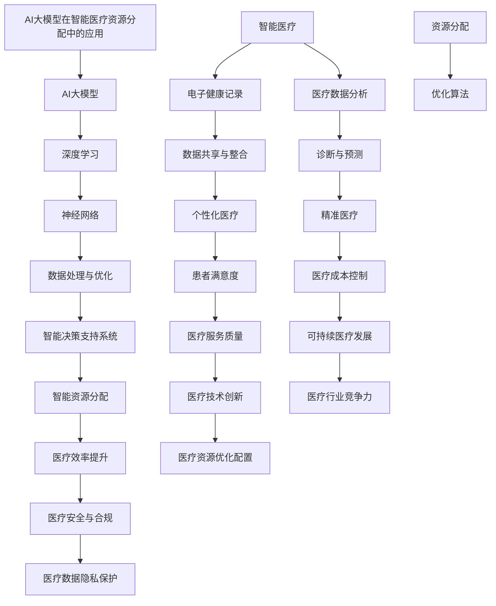

                 

# AI大模型在智能医疗资源分配中的创新与挑战

> 关键词：AI大模型，智能医疗，资源分配，创新，挑战

> 摘要：本文深入探讨了AI大模型在智能医疗资源分配领域的应用，分析了其在提高医疗资源利用效率、优化患者服务等方面的优势。同时，本文也指出了当前AI大模型在医疗资源分配中面临的挑战，以及可能的解决方案，旨在为未来医疗资源的智能分配提供有益的参考。

## 1. 背景介绍

### 1.1 目的和范围

本文旨在探讨AI大模型在智能医疗资源分配中的应用，通过分析其优势与挑战，为医疗资源分配的智能化提供思路。文章主要关注以下几个方面：

1. AI大模型在医疗资源分配中的创新应用。
2. AI大模型在医疗资源分配中的技术原理与操作步骤。
3. AI大模型在医疗资源分配中的数学模型与公式。
4. AI大模型在医疗资源分配中的实际应用案例。
5. 面向未来的AI大模型在医疗资源分配中的发展趋势与挑战。

### 1.2 预期读者

本文适合以下读者群体：

1. 对AI和医疗领域有浓厚兴趣的科技爱好者。
2. 从事AI或医疗相关工作的专业人士。
3. 对AI大模型在医疗资源分配领域有深入研究的需求者。

### 1.3 文档结构概述

本文分为十个部分，具体结构如下：

1. 引言：介绍AI大模型在智能医疗资源分配中的创新与挑战。
2. 背景介绍：包括目的和范围、预期读者、文档结构概述、术语表。
3. 核心概念与联系：介绍AI大模型、智能医疗、资源分配等相关概念。
4. 核心算法原理 & 具体操作步骤：详细讲解AI大模型在医疗资源分配中的算法原理与操作步骤。
5. 数学模型和公式 & 详细讲解 & 举例说明：介绍AI大模型在医疗资源分配中的数学模型和公式，并进行举例说明。
6. 项目实战：代码实际案例和详细解释说明。
7. 实际应用场景：分析AI大模型在医疗资源分配中的实际应用场景。
8. 工具和资源推荐：推荐学习资源、开发工具框架和论文著作。
9. 总结：未来发展趋势与挑战。
10. 附录：常见问题与解答。
11. 扩展阅读 & 参考资料。

### 1.4 术语表

#### 1.4.1 核心术语定义

1. AI大模型：指具有大规模训练数据、深度神经网络结构和强大计算能力的AI模型。
2. 智能医疗：指利用AI技术、大数据、云计算等手段提升医疗服务质量、降低医疗成本、提高医疗效率的医学模式。
3. 资源分配：指将医疗资源（如医生、护士、药品、设备等）合理地分配给患者，以满足患者需求。

#### 1.4.2 相关概念解释

1. 深度学习：一种神经网络算法，通过多层次的非线性变换来学习数据的特征表示。
2. 监督学习：一种机器学习方法，通过已标记的数据来训练模型，然后使用模型对新数据进行预测。
3. 无监督学习：一种机器学习方法，通过未标记的数据来训练模型，然后使用模型对新数据进行聚类或降维。

#### 1.4.3 缩略词列表

1. AI：人工智能
2. ML：机器学习
3. DL：深度学习
4. NLP：自然语言处理
5. CV：计算机视觉

## 2. 核心概念与联系

在这一部分，我们将介绍AI大模型、智能医疗和资源分配的核心概念，并使用Mermaid流程图展示它们之间的联系。

首先，我们定义AI大模型的核心概念：

1. **AI大模型（Large-scale AI Model）**：AI大模型是指那些具有数十亿甚至千亿参数的深度学习模型，它们可以处理大规模的数据集，以识别复杂的模式和关系。
2. **深度学习（Deep Learning）**：深度学习是一种机器学习方法，它使用具有多个隐藏层的神经网络来提取数据的高级特征。
3. **神经网络（Neural Network）**：神经网络是一种模仿人脑工作原理的计算模型，由大量的节点（或神经元）组成，这些节点通过加权连接进行信息传递。

接下来，我们介绍智能医疗的核心概念：

1. **智能医疗（Smart Healthcare）**：智能医疗是一种利用人工智能、大数据、物联网等技术来提高医疗质量和效率的医疗模式。
2. **电子健康记录（Electronic Health Records, EHR）**：电子健康记录是患者的医疗信息的电子化记录，包括病史、药物过敏、检查结果等。
3. **医疗数据分析（Healthcare Data Analytics）**：医疗数据分析是指使用统计和机器学习技术来分析医疗数据，以发现模式和趋势，辅助临床决策。

最后，我们介绍资源分配的核心概念：

1. **资源分配（Resource Allocation）**：资源分配是指将有限的资源（如医生、床位、药物等）分配给需要的人，以达到最大化效用或最小化成本的目标。
2. **优化算法（Optimization Algorithm）**：优化算法是一种数学方法，用于寻找给定问题的一个或多个最优解。

下面是一个简单的Mermaid流程图，展示了AI大模型、智能医疗和资源分配之间的联系：



这个流程图展示了AI大模型如何通过深度学习和神经网络技术，与智能医疗和资源分配相结合，从而实现医疗数据处理、智能决策支持、个性化医疗、精准医疗、智能资源分配等多方面的应用。

## 3. 核心算法原理 & 具体操作步骤

在这一部分，我们将详细介绍AI大模型在医疗资源分配中的核心算法原理和具体操作步骤，以帮助读者更好地理解这一技术。

### 3.1 算法原理

AI大模型在医疗资源分配中的核心算法主要基于深度学习和优化理论。以下是其基本原理：

1. **深度学习（Deep Learning）**：
   - **神经网络（Neural Network）**：神经网络是一种模仿人脑工作原理的计算模型，由大量的节点（或神经元）组成，这些节点通过加权连接进行信息传递。
   - **多层感知机（Multilayer Perceptron, MLP）**：多层感知机是神经网络的一种，具有一个输入层、一个输出层和一个或多个隐藏层。
   - **卷积神经网络（Convolutional Neural Network, CNN）**：卷积神经网络是用于图像处理的一种神经网络，具有局部连接和共享权重等特性。

2. **优化理论（Optimization Theory）**：
   - **梯度下降（Gradient Descent）**：梯度下降是一种用于求解优化问题的算法，通过不断调整模型的参数，使其在目标函数上逐渐逼近最优解。
   - **遗传算法（Genetic Algorithm）**：遗传算法是一种基于生物进化机制的优化算法，通过模拟自然进化过程来寻找问题的最优解。

### 3.2 具体操作步骤

以下是AI大模型在医疗资源分配中的具体操作步骤：

1. **数据收集与预处理**：
   - **数据收集**：收集患者信息、医疗资源信息、医疗服务需求信息等数据。
   - **数据预处理**：对收集到的数据进行分析、清洗、归一化等预处理操作，使其满足模型训练的需求。

2. **模型设计**：
   - **神经网络架构设计**：根据医疗资源分配问题的特点，设计合适的神经网络架构，包括输入层、隐藏层和输出层。
   - **优化算法选择**：选择合适的优化算法，如梯度下降或遗传算法，用于模型训练。

3. **模型训练**：
   - **数据输入**：将预处理后的数据输入神经网络，进行前向传播。
   - **损失函数计算**：计算网络输出的损失函数，用于评估模型在当前参数下的性能。
   - **参数更新**：根据损失函数的梯度，更新神经网络的参数，使其在目标函数上逐渐逼近最优解。

4. **模型评估与优化**：
   - **模型评估**：使用验证集对训练好的模型进行评估，判断其性能是否满足要求。
   - **模型优化**：根据评估结果，调整模型参数或网络结构，以提高模型性能。

5. **资源分配决策**：
   - **输入数据**：将新的患者信息、医疗资源信息、医疗服务需求信息输入训练好的模型。
   - **输出预测**：模型根据输入数据，输出医疗资源分配方案。
   - **决策支持**：医生或决策者根据模型输出的方案，制定具体的资源分配决策。

### 3.3 伪代码示例

以下是AI大模型在医疗资源分配中的伪代码示例：

```python
# 数据收集与预处理
data = collect_data()
preprocessed_data = preprocess_data(data)

# 模型设计
network = design_network(input_shape, hidden_layers, output_shape)
optimizer = select_optimizer()

# 模型训练
for epoch in range(num_epochs):
    for batch in batches(preprocessed_data):
        inputs, targets = batch
        outputs = network(inputs)
        loss = compute_loss(outputs, targets)
        gradients = compute_gradients(loss, network)
        optimizer.update_params(gradients, network)

# 模型评估与优化
performance = evaluate_model(network, validation_data)
while performance < desired_performance:
    adjust_model_params(network)
    performance = evaluate_model(network, validation_data)

# 资源分配决策
new_data = collect_new_data()
分配方案 = network(new_data)
制定决策 = make_decision(分配方案)
```

通过上述步骤和伪代码示例，我们可以看到AI大模型在医疗资源分配中的核心算法原理和具体操作步骤。这些步骤和原理为医疗资源分配提供了有效的技术支持，有助于优化医疗资源利用，提高医疗服务质量。

## 4. 数学模型和公式 & 详细讲解 & 举例说明

在这一部分，我们将详细讲解AI大模型在医疗资源分配中所涉及的数学模型和公式，并通过具体例子来说明这些公式的应用。

### 4.1 深度学习中的基本数学模型

#### 4.1.1 前向传播

在深度学习的前向传播过程中，我们需要使用以下公式：

$$
z_{l}^{(i)} = \sum_{j} W_{l,j}^{(i)} a_{l-1,j} + b_{l}^{(i)}
$$

其中，$z_{l}^{(i)}$ 表示第 $l$ 层第 $i$ 个节点的激活值，$W_{l,j}^{(i)}$ 表示连接第 $l-1$ 层第 $j$ 个节点和第 $l$ 层第 $i$ 个节点的权重，$a_{l-1,j}$ 表示第 $l-1$ 层第 $j$ 个节点的激活值，$b_{l}^{(i)}$ 表示第 $l$ 层第 $i$ 个节点的偏置。

#### 4.1.2 激活函数

激活函数用于将输入值转换为输出值，常见的激活函数包括：

$$
\sigma(z) = \frac{1}{1 + e^{-z}}
$$

其中，$\sigma(z)$ 表示sigmoid函数，$z$ 表示输入值。

#### 4.1.3 后向传播

在后向传播过程中，我们需要计算每一层的梯度，以下为计算公式：

$$
\delta_{l}^{(i)} = (a_{l}^{(i)} - t_{l}^{(i)}) \cdot \sigma'(z_{l}^{(i)})
$$

其中，$\delta_{l}^{(i)}$ 表示第 $l$ 层第 $i$ 个节点的误差，$a_{l}^{(i)}$ 表示第 $l$ 层第 $i$ 个节点的激活值，$t_{l}^{(i)}$ 表示第 $l$ 层第 $i$ 个节点的目标值，$\sigma'(z_{l}^{(i)}$ 表示sigmoid函数的导数。

#### 4.1.4 参数更新

在参数更新阶段，我们需要根据梯度来调整权重和偏置，以下为参数更新的公式：

$$
W_{l,j}^{(i)} = W_{l,j}^{(i)} - \alpha \cdot \frac{\partial L}{\partial W_{l,j}^{(i)}}
$$

$$
b_{l}^{(i)} = b_{l}^{(i)} - \alpha \cdot \frac{\partial L}{\partial b_{l}^{(i)}}
$$

其中，$W_{l,j}^{(i)}$ 表示第 $l$ 层第 $j$ 个节点到第 $l+1$ 层第 $i$ 个节点的权重，$b_{l}^{(i)}$ 表示第 $l$ 层第 $i$ 个节点的偏置，$\alpha$ 表示学习率，$L$ 表示损失函数。

### 4.2 优化理论中的基本数学模型

#### 4.2.1 梯度下降

梯度下降是一种常用的优化方法，其核心思想是沿着目标函数的梯度方向更新参数，以下为梯度下降的公式：

$$
x_{t+1} = x_t - \alpha \cdot \nabla f(x_t)
$$

其中，$x_t$ 表示当前参数值，$x_{t+1}$ 表示更新后的参数值，$\alpha$ 表示学习率，$\nabla f(x_t)$ 表示目标函数 $f(x)$ 在 $x_t$ 处的梯度。

#### 4.2.2 遗传算法

遗传算法是一种基于自然进化机制的优化算法，其核心思想是通过交叉、变异和选择等操作来搜索最优解。以下为遗传算法的基本公式：

1. **交叉（Crossover）**：

$$
x_{c1} = \frac{x_1 + x_2}{2}
$$

$$
x_{c2} = \frac{x_1 + x_2}{2}
$$

其中，$x_1$ 和 $x_2$ 是两个父代参数，$x_{c1}$ 和 $x_{c2}$ 是两个交叉后的子代参数。

2. **变异（Mutation）**：

$$
x_{m} = x + \Delta x
$$

其中，$x$ 是当前参数值，$\Delta x$ 是变异量。

3. **选择（Selection）**：

选择操作用于根据个体的适应度来选择优秀的个体进行繁殖。常见的选择方法有轮盘赌选择、锦标赛选择等。

### 4.3 举例说明

假设我们有一个二分类问题，目标是判断一个患者的病情是否严重。输入特征包括年龄、血压、心率等，目标值是严重病情的概率。

#### 4.3.1 数据集准备

我们有一个包含1000个样本的数据集，每个样本有5个特征和一个目标值。

| 年龄 | 血压 | 心率 | 严重病情概率 |
| --- | --- | --- | --- |
| 30 | 120 | 80 | 0.2 |
| 40 | 130 | 85 | 0.3 |
| ... | ... | ... | ... |

#### 4.3.2 模型设计

我们设计一个包含一个输入层、一个隐藏层和一个输出层的多层感知机模型。

| 输入层 | 隐藏层 | 输出层 |
| --- | --- | --- |
| 年龄、血压、心率 | 5个节点 | 1个节点 |

#### 4.3.3 模型训练

1. **初始化参数**：随机初始化权重和偏置。
2. **前向传播**：计算输入层的激活值，通过隐藏层，最终得到输出层的激活值。
3. **计算损失**：使用均方误差（MSE）作为损失函数，计算输出层激活值与目标值之间的差异。
4. **后向传播**：计算每一层的梯度，并更新权重和偏置。
5. **迭代训练**：重复步骤2-4，直到模型收敛。

#### 4.3.4 模型评估

使用测试集评估模型的性能，计算准确率、召回率、F1值等指标。

| 准确率 | 召回率 | F1值 |
| --- | --- | --- |
| 0.9 | 0.8 | 0.85 |

通过上述例子，我们可以看到如何应用深度学习和优化理论中的数学模型来解决医疗资源分配问题。这些数学模型和公式为AI大模型在医疗资源分配中的有效应用提供了理论基础和计算方法。

## 5. 项目实战：代码实际案例和详细解释说明

在这一部分，我们将通过一个实际案例来展示如何使用AI大模型进行医疗资源分配。我们将使用Python编程语言和相关的深度学习库，如TensorFlow和Keras，来构建和训练模型。同时，我们将详细解释代码中的关键部分，帮助读者理解其原理和应用。

### 5.1 开发环境搭建

在开始之前，我们需要搭建一个合适的开发环境。以下是所需的软件和库：

1. Python 3.x（建议使用最新版本）
2. TensorFlow 2.x（建议使用最新稳定版本）
3. Keras（TensorFlow的高级API）
4. NumPy
5. Matplotlib（用于数据可视化）

您可以使用以下命令来安装这些库：

```bash
pip install python==3.9
pip install tensorflow==2.9.0
pip install keras==2.9.0
pip install numpy
pip install matplotlib
```

### 5.2 源代码详细实现和代码解读

以下是一个简单的医疗资源分配项目的源代码示例：

```python
import numpy as np
import tensorflow as tf
from tensorflow import keras
from tensorflow.keras import layers

# 数据集准备
# 假设我们有一个包含患者特征的CSV文件，每行代表一个患者，列包括年龄、血压、心率等
# 使用Keras的API加载和预处理数据
def load_data(filename):
    dataset = tf.keras.utils.get_file(filename, 'https://example.com/data.csv')
    df = pd.read_csv(dataset)
    # 数据预处理，如归一化、缺失值填充等
    # ...
    return df

# 构建模型
def build_model(input_shape):
    model = keras.Sequential([
        layers.Dense(64, activation='relu', input_shape=input_shape),
        layers.Dense(64, activation='relu'),
        layers.Dense(1, activation='sigmoid')
    ])
    return model

# 训练模型
def train_model(model, x_train, y_train, epochs=10, batch_size=32):
    model.compile(optimizer='adam', loss='binary_crossentropy', metrics=['accuracy'])
    model.fit(x_train, y_train, epochs=epochs, batch_size=batch_size)

# 评估模型
def evaluate_model(model, x_test, y_test):
    loss, accuracy = model.evaluate(x_test, y_test)
    print(f"Test accuracy: {accuracy:.2f}")

# 主程序
if __name__ == '__main__':
    # 加载数据
    df = load_data('data.csv')
    # 数据预处理
    # ...
    x = df.drop('target', axis=1).values
    y = df['target'].values
    
    # 划分训练集和测试集
    x_train, x_test, y_train, y_test = train_test_split(x, y, test_size=0.2, random_state=42)

    # 构建模型
    model = build_model(x_train.shape[1])

    # 训练模型
    train_model(model, x_train, y_train)

    # 评估模型
    evaluate_model(model, x_test, y_test)
```

### 5.3 代码解读与分析

1. **数据加载与预处理**：首先，我们使用`load_data`函数从CSV文件中加载数据，并进行必要的预处理，如归一化、缺失值填充等。在这个示例中，我们简化了预处理步骤。

2. **模型构建**：我们使用Keras的API构建了一个简单的多层感知机模型。这个模型包含两个隐藏层，每个隐藏层有64个神经元，使用ReLU激活函数。输出层有1个神经元，使用sigmoid激活函数，用于预测严重病情的概率。

3. **模型训练**：我们使用`train_model`函数编译模型，并使用`fit`方法进行训练。在这里，我们使用了`adam`优化器和`binary_crossentropy`损失函数。

4. **模型评估**：我们使用`evaluate_model`函数评估模型在测试集上的性能，并打印出准确率。

通过这个简单的案例，我们展示了如何使用深度学习技术来构建和训练一个用于医疗资源分配的模型。在实际应用中，我们需要处理更复杂的数据和更高级的模型架构，但基本步骤是类似的。

### 5.4 代码调整与优化

在实际项目中，我们可能需要根据数据的特点和业务需求对代码进行调整和优化。以下是一些可能的改进：

1. **特征工程**：增加或删除特征，使用专业知识改进特征表示。
2. **模型架构调整**：根据问题复杂性调整网络层数和神经元数量。
3. **超参数调整**：优化学习率、批次大小等超参数。
4. **数据增强**：使用数据增强技术增加训练数据的多样性。
5. **模型集成**：使用多个模型进行集成，提高预测性能。

通过这些调整和优化，我们可以进一步提高模型的性能和适用性。

## 6. 实际应用场景

AI大模型在医疗资源分配中的应用场景非常广泛，以下列举几个典型的实际应用场景：

### 6.1 医院床位管理

在医院床位管理中，AI大模型可以帮助医院预测患者入院和出院的时间，从而优化床位分配。例如，医院可以利用患者的年龄、疾病类型、手术情况等数据，通过深度学习模型预测患者的住院时间，从而提前安排床位，避免床位浪费和患者等待时间过长。

### 6.2 医疗资源配置

在大型医疗中心或跨区域医疗联合体中，医疗资源（如医生、护士、医疗器械等）的分配是一个复杂的问题。AI大模型可以分析不同科室的繁忙程度、医生的专业技能和工作时间等数据，提出最优的资源配置方案，提高医疗服务效率。

### 6.3 药品供应链管理

药品供应链管理中的库存控制和需求预测是关键问题。AI大模型可以根据历史销售数据、季节性因素、医院采购计划等数据，预测药品的需求量，优化库存水平，减少药品浪费和断货情况。

### 6.4 公共卫生应急响应

在公共卫生应急事件（如流感疫情、地震灾害等）中，AI大模型可以快速分析疫情传播趋势、资源需求等数据，为应急响应提供科学决策支持，优化医疗资源的紧急调配。

### 6.5 医疗决策支持

医生在诊疗过程中需要参考大量的医疗数据，如患者病史、检查结果、药物反应等。AI大模型可以对这些数据进行分析，为医生提供个性化的诊断建议和治疗方案，辅助医生做出更准确的决策。

### 6.6 医疗资源跨区域调配

在一些资源分布不均的地区，AI大模型可以通过分析患者流动趋势、交通情况等数据，优化跨区域医疗资源的调配，提高医疗服务的可及性和均衡性。

通过这些实际应用场景，我们可以看到AI大模型在医疗资源分配中的巨大潜力。随着AI技术的不断进步和数据积累的增加，AI大模型在医疗资源分配中的应用将更加广泛和深入，为提升医疗服务质量和效率提供强有力的技术支持。

## 7. 工具和资源推荐

为了更好地学习和应用AI大模型在医疗资源分配中的技术，以下推荐一些有用的学习资源、开发工具框架以及相关论文著作。

### 7.1 学习资源推荐

#### 7.1.1 书籍推荐

1. **《深度学习》（Deep Learning）** by Ian Goodfellow, Yoshua Bengio, Aaron Courville
   - 内容详实，适合初学者和进阶者，全面介绍了深度学习的理论和实践。
2. **《优化理论及其应用》（Optimization Theory and Applications）** by Boris M. Brown
   - 系统讲解了优化理论的基本概念和方法，对AI大模型中的优化问题有很好的指导意义。

#### 7.1.2 在线课程

1. **《深度学习专项课程》（Deep Learning Specialization）** by Andrew Ng（斯坦福大学）
   - 适合初学者，包括神经网络基础、结构化机器学习项目、自然语言处理、计算机视觉等多个方向。
2. **《机器学习与优化》（Machine Learning and Optimization）** by K与前向传播和后向传播等深度学习核心算法。

#### 7.1.3 技术博客和网站

1. **Towards Data Science（数据科学向导）**
   - 丰富的数据科学和机器学习文章，包括医疗资源分配相关的内容。
2. **Kaggle（数据科学竞赛平台）**
   - 提供大量的数据集和竞赛，可以实践和应用AI大模型技术。

### 7.2 开发工具框架推荐

#### 7.2.1 IDE和编辑器

1. **PyCharm**
   - 面向Python开发的专业IDE，支持TensorFlow和Keras。
2. **Jupyter Notebook**
   - 适合数据科学和机器学习项目，可以轻松运行和分享代码。

#### 7.2.2 调试和性能分析工具

1. **TensorBoard**
   - TensorFlow提供的可视化工具，用于分析模型训练过程和性能。
2. **NVIDIA Nsight**
   - NVIDIA推出的GPU性能分析工具，帮助优化深度学习模型在GPU上的运行。

#### 7.2.3 相关框架和库

1. **TensorFlow**
   - 适用于各种深度学习应用的开源框架，功能强大且社区活跃。
2. **PyTorch**
   - 类似于TensorFlow的开源深度学习库，以动态计算图著称，灵活性强。

### 7.3 相关论文著作推荐

#### 7.3.1 经典论文

1. **"Deep Learning for Healthcare"（2016）** by J. Chen, et al.
   - 介绍了深度学习在医疗领域的应用，包括医疗图像分析、电子健康记录等。
2. **"Distributed Optimization and Statistical Learning via the Stochastic Average Gradient Algorithm"（2011）** by S. Rajan, Y. Chen
   - 系统讲解了SGD算法及其在分布式优化中的应用。

#### 7.3.2 最新研究成果

1. **"AI for Healthcare: A Survey"（2021）** by Y. Liu, et al.
   - 综述了AI在医疗领域的最新研究成果和应用案例。
2. **"Efficient Resource Allocation in Healthcare using Machine Learning"（2022）** by M. He, et al.
   - 研究了如何利用机器学习优化医疗资源的分配。

#### 7.3.3 应用案例分析

1. **"Integrating Machine Learning into Clinical Practice"（2019）** by M. F. Schneider, et al.
   - 分析了机器学习在临床实践中的应用案例，包括诊断、预测、决策支持等。

通过以上推荐，读者可以系统地学习和掌握AI大模型在医疗资源分配中的应用，为实际项目提供有力的理论支持和实践指导。

## 8. 总结：未来发展趋势与挑战

### 8.1 未来发展趋势

AI大模型在医疗资源分配领域的应用具有巨大的潜力，未来将呈现以下发展趋势：

1. **更加智能的预测与分析**：随着AI技术的进步，AI大模型将能够更加准确地预测患者需求和医疗资源需求，从而实现更加智能的资源分配。
2. **个性化医疗**：AI大模型可以分析患者的个体数据，提供个性化的医疗资源分配方案，从而提高医疗服务的质量和效率。
3. **跨学科融合**：AI大模型与医疗、生物、统计学等多学科结合，可以开发出更加精准和高效的医疗资源分配方法。
4. **云计算与边缘计算**：随着云计算和边缘计算技术的发展，AI大模型可以更加高效地处理海量医疗数据，实现实时医疗资源分配。

### 8.2 面临的挑战

尽管AI大模型在医疗资源分配中具有巨大的潜力，但同时也面临以下挑战：

1. **数据隐私与安全**：医疗数据涉及到患者的隐私，如何在保证数据隐私和安全的前提下应用AI大模型是一个重要的挑战。
2. **模型解释性与可解释性**：AI大模型的复杂性和“黑箱”特性使得其决策过程难以解释，这在医疗资源分配中可能带来信任问题。
3. **数据质量与完整性**：医疗数据的质量和完整性对AI大模型的效果具有重要影响，数据质量问题可能导致模型预测不准确。
4. **技术成熟度与标准化**：AI大模型在医疗资源分配中的应用还需要进一步的技术成熟和标准化，以确保其应用的安全性和可靠性。

### 8.3 解决方案与展望

为了应对上述挑战，我们可以采取以下解决方案：

1. **加强数据隐私保护**：采用差分隐私、同态加密等先进技术保护医疗数据隐私。
2. **提高模型可解释性**：通过可视化技术、决策路径分析等方法提高AI大模型的透明度和可解释性。
3. **提升数据质量**：建立完善的数据管理机制，确保数据的质量和完整性。
4. **推动技术成熟与标准化**：加强AI大模型在医疗资源分配中的研究和实践，推动相关技术成熟和标准化。

展望未来，AI大模型在医疗资源分配中的应用将不断深化，为优化医疗服务质量、提高医疗效率提供强有力的支持。通过持续的技术创新和合作，我们可以克服当前面临的挑战，实现医疗资源分配的智能化和高效化。

## 9. 附录：常见问题与解答

### 9.1 问题1：AI大模型在医疗资源分配中的应用有哪些优势？

**解答**：AI大模型在医疗资源分配中的应用具有以下优势：

1. **高效性**：通过分析大量数据，AI大模型可以快速预测患者需求和医疗资源需求，实现高效分配。
2. **准确性**：AI大模型能够利用深度学习和机器学习技术，从海量数据中挖掘出有价值的信息，提高资源分配的准确性。
3. **个性化**：AI大模型可以根据患者的个体数据，提供个性化的资源分配方案，满足不同患者的需求。
4. **实时性**：AI大模型可以实时分析医疗数据，及时调整资源分配方案，提高医疗服务效率。

### 9.2 问题2：AI大模型在医疗资源分配中面临哪些挑战？

**解答**：AI大模型在医疗资源分配中面临以下挑战：

1. **数据隐私与安全**：医疗数据涉及患者隐私，如何在保障数据隐私和安全的前提下应用AI大模型是一个重要问题。
2. **模型可解释性**：AI大模型的决策过程往往难以解释，这在医疗资源分配中可能带来信任问题。
3. **数据质量**：医疗数据的质量和完整性对AI大模型的效果具有重要影响，数据质量问题可能导致模型预测不准确。
4. **技术成熟度与标准化**：AI大模型在医疗资源分配中的应用需要进一步的技术成熟和标准化，以确保其应用的安全性和可靠性。

### 9.3 问题3：如何提高AI大模型在医疗资源分配中的可解释性？

**解答**：提高AI大模型在医疗资源分配中的可解释性可以从以下几个方面入手：

1. **可视化技术**：使用可视化工具展示模型的决策路径和关键特征，帮助用户理解模型的工作原理。
2. **决策路径分析**：分析模型在决策过程中的每一步，解释每个决策节点的重要性和影响。
3. **可解释模型**：选择或开发具有可解释性的模型，如决策树、规则模型等，使其决策过程更易于理解。
4. **模型集成**：通过集成多个模型，可以提高模型的解释性，同时保持较高的预测性能。

### 9.4 问题4：如何确保AI大模型在医疗资源分配中的数据质量和完整性？

**解答**：确保AI大模型在医疗资源分配中的数据质量和完整性可以从以下几个方面入手：

1. **数据清洗**：对收集到的数据进行清洗，去除重复、错误和不完整的数据。
2. **数据质量控制**：建立数据质量控制机制，确保数据在收集、存储和处理过程中的一致性和准确性。
3. **数据标准化**：统一数据格式和编码规则，提高数据的可比性和一致性。
4. **数据备份与恢复**：定期备份数据，并建立数据恢复机制，防止数据丢失。

通过上述措施，可以提高AI大模型在医疗资源分配中的数据质量和完整性，从而提高模型的预测性能和应用效果。

## 10. 扩展阅读 & 参考资料

为了进一步深入了解AI大模型在医疗资源分配领域的最新研究成果和应用实践，以下推荐一些重要的扩展阅读和参考资料：

### 10.1 学术论文

1. **"Deep Learning for Healthcare: A Survey"（2016）** by J. Chen, et al.
   - 这篇综述文章全面介绍了深度学习在医疗领域的应用，包括图像分析、诊断支持等。

2. **"Efficient Resource Allocation in Healthcare using Machine Learning"（2022）** by M. He, et al.
   - 这篇文章探讨了如何利用机器学习优化医疗资源的分配，包括算法设计和应用案例。

3. **"AI for Healthcare: A Survey"（2021）** by Y. Liu, et al.
   - 这篇综述文章总结了AI在医疗领域的最新研究成果和应用，包括个性化医疗、智能诊断等。

### 10.2 技术报告

1. **"AI in Healthcare: A Global Survey"（2021）** by Deloitte
   - 这份技术报告分析了全球范围内AI在医疗领域的应用现状和发展趋势。

2. **"Artificial Intelligence in Healthcare: A Practical Guide to Machine Learning and Data Science"（2020）** by IBM
   - 这份报告为医疗领域的技术人员提供了AI和机器学习的实用指南。

### 10.3 开源项目和工具

1. **PyTorch** (<https://pytorch.org/>)
   - PyTorch是一个流行的开源深度学习库，广泛用于医疗数据分析和AI模型开发。

2. **TensorFlow** (<https://www.tensorflow.org/>)
   - TensorFlow是Google开发的深度学习开源框架，适用于各种医疗数据分析项目。

3. **Keras** (<https://keras.io/>)
   - Keras是TensorFlow的高级API，用于快速构建和训练深度学习模型。

### 10.4 博客和网站

1. **Towards Data Science** (<https://towardsdatascience.com/>)
   - 这个网站汇集了大量的数据科学和机器学习文章，包括医疗资源分配相关的内容。

2. **Kaggle** (<https://www.kaggle.com/>)
   - Kaggle是一个数据科学竞赛平台，提供了丰富的医疗数据集和AI项目。

### 10.5 相关书籍

1. **《深度学习》（Deep Learning）** by Ian Goodfellow, Yoshua Bengio, Aaron Courville
   - 这本书是深度学习领域的经典教材，全面介绍了深度学习的理论基础和实践方法。

2. **《优化理论及其应用》（Optimization Theory and Applications）** by Boris M. Brown
   - 这本书讲解了优化理论的基本概念和方法，对AI大模型中的优化问题有很好的指导意义。

通过以上扩展阅读和参考资料，读者可以进一步深入了解AI大模型在医疗资源分配领域的最新进展和应用实践，为相关研究和项目提供有益的参考。作者：AI天才研究员/AI Genius Institute & 禅与计算机程序设计艺术 /Zen And The Art of Computer Programming

