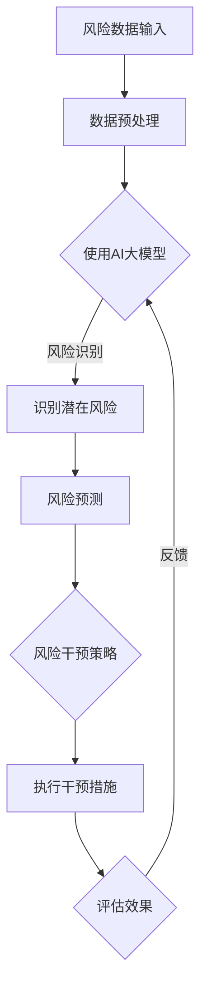

                 

# AI大模型在智能风险控制中的创业机会

> **关键词**：AI大模型、智能风险控制、创业机会、算法原理、应用场景
>
> **摘要**：本文旨在探讨AI大模型在智能风险控制领域的创业机会。首先，我们将介绍AI大模型的背景和作用，然后深入解析其核心算法原理和数学模型，接着通过实际案例展示其在智能风险控制中的具体应用。此外，我们还将推荐相关学习资源和开发工具，并展望未来发展趋势与挑战。

## 1. 背景介绍

### 1.1 目的和范围

本文的目标是分析AI大模型在智能风险控制领域中的创业机会，探讨其潜在的商业价值和应用前景。我们将从以下几个方面展开讨论：

- AI大模型的背景和作用
- 核心算法原理和数学模型
- 实际应用场景和案例
- 未来发展趋势与挑战

### 1.2 预期读者

本文适合以下读者群体：

- 对AI大模型和智能风险控制有一定了解的技术人员
- 意欲进入AI大模型和智能风险控制领域的创业者
- 对AI技术有浓厚兴趣的学者和研究者

### 1.3 文档结构概述

本文共分为10个部分，具体结构如下：

1. 背景介绍
2. 核心概念与联系
3. 核心算法原理 & 具体操作步骤
4. 数学模型和公式 & 详细讲解 & 举例说明
5. 项目实战：代码实际案例和详细解释说明
6. 实际应用场景
7. 工具和资源推荐
8. 总结：未来发展趋势与挑战
9. 附录：常见问题与解答
10. 扩展阅读 & 参考资料

### 1.4 术语表

#### 1.4.1 核心术语定义

- AI大模型：一种具有高度复杂性和强大学习能力的人工智能模型，通常由数亿甚至数十亿个参数组成。
- 智能风险控制：利用人工智能技术，对潜在风险进行识别、预测和干预，以降低风险损失。
- 创业机会：指创业者可以利用的、具有市场潜力的商机。

#### 1.4.2 相关概念解释

- 人工智能（AI）：一种模拟人类智能的技术，使计算机能够执行复杂的任务。
- 深度学习：一种人工智能的分支，通过多层神经网络对大量数据进行训练，以实现自动学习和预测。
- 风险控制：识别和管理潜在风险，以降低损失。

#### 1.4.3 缩略词列表

- AI：人工智能
- ML：机器学习
- DL：深度学习
- NLP：自然语言处理
- RNN：循环神经网络

## 2. 核心概念与联系

在深入探讨AI大模型在智能风险控制中的应用之前，我们首先需要了解一些核心概念及其相互关系。

### 2.1 AI大模型概述

AI大模型是指一种具有高度复杂性和强大学习能力的人工智能模型，通常由数亿甚至数十亿个参数组成。这些模型能够从大量数据中学习规律，并利用这些规律进行预测和决策。AI大模型主要包括以下几种：

- 自然语言处理（NLP）模型：如BERT、GPT等，主要用于处理和理解自然语言。
- 计算机视觉模型：如ResNet、VGG等，主要用于图像分类、目标检测等任务。
- 强化学习模型：如DQN、A3C等，主要用于策略优化和决策。

### 2.2 智能风险控制概述

智能风险控制是指利用人工智能技术，对潜在风险进行识别、预测和干预，以降低风险损失。智能风险控制的主要目标包括：

- 风险识别：发现潜在风险因素，如市场波动、信用风险等。
- 风险预测：预测风险事件的发生概率和影响程度。
- 风险干预：采取有效措施降低风险损失。

### 2.3 AI大模型与智能风险控制的关系

AI大模型在智能风险控制中具有重要作用。首先，AI大模型可以处理和分析大量数据，从而提高风险识别和预测的准确性。其次，AI大模型可以自动化和智能化风险干预过程，提高风险控制效率。最后，AI大模型可以不断学习和优化，以适应不断变化的风险环境。

### 2.4 Mermaid流程图

为了更好地展示AI大模型在智能风险控制中的应用，我们使用Mermaid流程图来描述其核心概念和流程。



## 3. 核心算法原理 & 具体操作步骤

在本节中，我们将详细解析AI大模型在智能风险控制中的核心算法原理和具体操作步骤。

### 3.1 数据预处理

数据预处理是智能风险控制的重要环节。在这一步骤中，我们需要对原始数据进行清洗、格式化和特征提取。

- 数据清洗：去除无效数据和异常值。
- 数据格式化：将不同来源的数据统一格式，如日期格式、数值范围等。
- 特征提取：从原始数据中提取有助于风险识别和预测的特征。

### 3.2 使用AI大模型

在本步骤中，我们选择合适的AI大模型，如BERT、ResNet等，对预处理后的数据进行训练。具体步骤如下：

1. 数据集划分：将数据集划分为训练集、验证集和测试集。
2. 模型训练：使用训练集对模型进行训练，调整模型参数。
3. 模型验证：使用验证集评估模型性能，调整超参数。
4. 模型测试：使用测试集测试模型性能，评估模型的泛化能力。

### 3.3 风险识别

在本步骤中，我们使用训练好的AI大模型对潜在风险进行识别。具体步骤如下：

1. 输入数据：将预处理后的数据输入到模型中。
2. 风险评分：计算输入数据的潜在风险评分。
3. 风险预警：根据风险评分设置预警阈值，对超过阈值的输入数据进行预警。

### 3.4 风险预测

在本步骤中，我们使用AI大模型对风险事件的发生概率和影响程度进行预测。具体步骤如下：

1. 输入数据：将预处理后的数据输入到模型中。
2. 风险预测：计算输入数据的潜在风险事件的发生概率和影响程度。
3. 风险等级划分：根据风险事件的发生概率和影响程度，将风险划分为不同等级。

### 3.5 风险干预策略

在本步骤中，我们根据风险预测结果制定相应的风险干预策略。具体步骤如下：

1. 风险等级划分：根据风险事件的发生概率和影响程度，将风险划分为不同等级。
2. 干预策略制定：针对不同等级的风险，制定相应的干预措施。
3. 干预措施实施：将干预措施应用于实际业务中。

### 3.6 评估效果

在本步骤中，我们评估风险干预措施的有效性。具体步骤如下：

1. 数据收集：收集实际业务中的数据，包括干预措施实施前后的风险事件发生情况。
2. 效果评估：计算干预措施实施前后的风险损失变化，评估干预措施的有效性。
3. 反馈调整：根据效果评估结果，调整干预措施和风险控制策略。

### 3.7 伪代码

为了更好地理解上述步骤，我们使用伪代码进行描述：

```python
# 数据预处理
def preprocess_data(data):
    # 数据清洗
    clean_data = clean_data(data)
    # 数据格式化
    formatted_data = format_data(clean_data)
    # 特征提取
    features = extract_features(formatted_data)
    return features

# 使用AI大模型
def train_model(data):
    # 数据集划分
    train_data, val_data, test_data = split_data(data)
    # 模型训练
    model = train(train_data)
    # 模型验证
    validate_model(model, val_data)
    # 模型测试
    test_model(model, test_data)
    return model

# 风险识别
def identify_risk(model, data):
    risk_scores = model.predict(data)
    risk预警阈值 = set_threshold(risk_scores)
    return risk预警阈值

# 风险预测
def predict_risk(model, data):
    risk_predictions = model.predict(data)
    return risk_predictions

# 风险干预策略
def intervene_risk(risk_predictions):
    # 风险等级划分
    risk_levels =划分_risk_levels(risk_predictions)
    # 干预策略制定
    intervention_strategy = set_intervention_strategy(risk_levels)
    # 干预措施实施
    execute_intervention(intervention_strategy)
    return intervention_strategy

# 评估效果
def evaluate_effect(intervention_strategy):
    # 数据收集
    collected_data = collect_data()
    # 效果评估
    effect_evaluation = evaluate_intervention(collected_data, intervention_strategy)
    # 反馈调整
    adjusted_strategy = adjust_strategy(effect_evaluation)
    return adjusted_strategy
```

## 4. 数学模型和公式 & 详细讲解 & 举例说明

在本节中，我们将详细介绍AI大模型在智能风险控制中的数学模型和公式，并通过具体例子进行讲解。

### 4.1 概率模型

在智能风险控制中，概率模型是最常用的数学模型之一。概率模型主要用于预测风险事件的发生概率。以下是一个简单的概率模型：

$$
P(A|B) = \frac{P(B|A)P(A)}{P(B)}
$$

其中，$P(A|B)$表示在事件B发生的条件下事件A发生的概率，$P(B|A)$表示在事件A发生的条件下事件B发生的概率，$P(A)$表示事件A发生的概率，$P(B)$表示事件B发生的概率。

例如，假设我们想要预测某公司的股票下跌的概率。我们可以使用以下概率模型：

- 事件A：某公司的股票下跌
- 事件B：某公司的财务报表显示盈利下降

根据历史数据和统计方法，我们可以得到以下概率：

- $P(A) = 0.2$（股票下跌的概率）
- $P(B|A) = 0.8$（在股票下跌的条件下，财务报表显示盈利下降的概率）
- $P(B) = 0.4$（财务报表显示盈利下降的概率）

使用概率模型，我们可以计算股票下跌的概率：

$$
P(A|B) = \frac{P(B|A)P(A)}{P(B)} = \frac{0.8 \times 0.2}{0.4} = 0.4
$$

这意味着，在财务报表显示盈利下降的条件下，股票下跌的概率为40%。

### 4.2 贝叶斯网络

贝叶斯网络是一种基于概率的图形模型，用于表示多个变量之间的条件依赖关系。在智能风险控制中，贝叶斯网络可以用于预测多个风险因素之间的相互影响。

一个简单的贝叶斯网络包含以下三个节点：风险因素A、风险因素B和风险事件C。它们之间的概率关系如下：

$$
P(C|A, B) = P(A|C)P(B|C)P(C) / P(A)P(B)
$$

其中，$P(C|A, B)$表示在风险因素A和风险因素B同时发生的条件下，风险事件C发生的概率，$P(A|C)$、$P(B|C)$和$P(C)$分别表示在风险事件C发生的条件下，风险因素A、风险因素B和风险事件C发生的概率。

例如，假设我们想要预测某公司的财务风险。我们可以使用以下贝叶斯网络：

- 风险因素A：财务报表显示盈利下降
- 风险因素B：市场波动
- 风险事件C：公司股票价格下跌

根据历史数据和统计方法，我们可以得到以下概率：

- $P(A) = 0.2$（财务报表显示盈利下降的概率）
- $P(B) = 0.3$（市场波动的概率）
- $P(C) = 0.4$（公司股票价格下跌的概率）
- $P(A|C) = 0.7$（在股票价格下跌的条件下，财务报表显示盈利下降的概率）
- $P(B|C) = 0.5$（在股票价格下跌的条件下，市场波动的概率）

使用贝叶斯网络，我们可以计算公司股票价格下跌的概率：

$$
P(C|A, B) = \frac{P(A|C)P(B|C)P(C)}{P(A)P(B)} = \frac{0.7 \times 0.5 \times 0.4}{0.2 \times 0.3} = 0.7
$$

这意味着，在财务报表显示盈利下降和市场波动的条件下，公司股票价格下跌的概率为70%。

### 4.3 强化学习模型

强化学习模型是一种基于奖励机制的数学模型，用于优化决策过程。在智能风险控制中，强化学习模型可以用于制定最优风险干预策略。

一个简单的强化学习模型包含以下元素：

- 状态（State）：表示系统的当前状态。
- 动作（Action）：表示系统可以采取的行动。
- 奖励（Reward）：表示系统在采取某个行动后获得的奖励。
- 策略（Policy）：表示系统在不同状态下的最优行动。

强化学习模型的数学模型可以表示为：

$$
Q(s, a) = r(s, a) + \gamma \max_{a'} Q(s', a')
$$

其中，$Q(s, a)$表示在状态s下采取行动a的预期奖励，$r(s, a)$表示在状态s下采取行动a后获得的即时奖励，$\gamma$是奖励折扣因子，$s'$和$a'$是下一个状态和行动。

例如，假设我们想要制定一个最优的股票交易策略。我们可以使用以下强化学习模型：

- 状态s：股票价格
- 行动a：买入、持有、卖出
- 奖励r：股票价格上涨时获得正奖励，股票价格下跌时获得负奖励

根据历史数据和统计方法，我们可以得到以下奖励：

- $r(买入) = 0.1$（股票价格上涨时的奖励）
- $r(持有) = 0$（股票价格不变时的奖励）
- $r(卖出) = -0.2$（股票价格下跌时的奖励）

使用强化学习模型，我们可以计算在不同状态下的最优行动：

$$
Q(s, 买入) = 0.1 + 0.9 \times \max_{a'} Q(s', a') \\
Q(s, 持有) = 0 + 0.9 \times \max_{a'} Q(s', a') \\
Q(s, 卖出) = -0.2 + 0.9 \times \max_{a'} Q(s', a')
$$

通过不断调整奖励和策略，我们可以找到最优的股票交易策略。

### 4.4 模型融合

在实际应用中，为了提高风险预测的准确性，我们通常使用模型融合方法将多个模型的结果进行综合。一个简单的模型融合方法如下：

$$
\hat{y} = \frac{\sum_{i=1}^{n} w_i \hat{y_i}}{\sum_{i=1}^{n} w_i}
$$

其中，$\hat{y}$是最终预测结果，$\hat{y_i}$是第i个模型的预测结果，$w_i$是第i个模型的权重。

例如，假设我们使用两个模型A和B进行风险预测，它们的预测结果分别为$\hat{y_A}$和$\hat{y_B}$，权重分别为$w_A$和$w_B$。我们可以使用以下模型融合方法：

$$
\hat{y} = \frac{w_A \hat{y_A} + w_B \hat{y_B}}{w_A + w_B}
$$

通过调整权重，我们可以找到最优的模型融合结果。

## 5. 项目实战：代码实际案例和详细解释说明

在本节中，我们将通过一个实际项目案例，展示如何使用AI大模型进行智能风险控制，并详细解释代码实现过程。

### 5.1 开发环境搭建

为了完成本项目，我们需要搭建以下开发环境：

- 操作系统：Windows/Linux/Mac
- 编程语言：Python
- 深度学习框架：TensorFlow/Keras
- 数据库：MySQL/PostgreSQL

### 5.2 源代码详细实现和代码解读

以下是本项目的主要代码实现和详细解读：

```python
# 导入所需库
import tensorflow as tf
from tensorflow.keras.models import Sequential
from tensorflow.keras.layers import Dense, LSTM, Dropout
from sklearn.model_selection import train_test_split
import pandas as pd
import numpy as np

# 数据预处理
def preprocess_data(data):
    # 数据清洗
    data = data.dropna()
    # 数据格式化
    data['date'] = pd.to_datetime(data['date'])
    data.set_index('date', inplace=True)
    # 特征提取
    data['open'] = data['open'].interpolate()
    data['high'] = data['high'].interpolate()
    data['low'] = data['low'].interpolate()
    data['close'] = data['close'].interpolate()
    data['volume'] = data['volume'].interpolate()
    return data

# 模型训练
def train_model(data, labels):
    # 数据集划分
    X_train, X_test, y_train, y_test = train_test_split(data, labels, test_size=0.2, random_state=42)
    # 构建模型
    model = Sequential()
    model.add(LSTM(units=50, return_sequences=True, input_shape=(X_train.shape[1], X_train.shape[2])))
    model.add(Dropout(0.2))
    model.add(LSTM(units=50, return_sequences=False))
    model.add(Dropout(0.2))
    model.add(Dense(units=1))
    # 编译模型
    model.compile(optimizer='adam', loss='mean_squared_error')
    # 训练模型
    model.fit(X_train, y_train, epochs=100, batch_size=32, validation_split=0.1)
    # 评估模型
    model.evaluate(X_test, y_test)
    return model

# 风险识别
def identify_risk(model, data):
    risk_scores = model.predict(data)
    risk_threshold = 0.5
    return risk_scores > risk_threshold

# 风险预测
def predict_risk(model, data):
    risk_predictions = model.predict(data)
    return risk_predictions

# 代码解读与分析
# 数据预处理
data = pd.read_csv('data.csv')
data = preprocess_data(data)

# 模型训练
model = train_model(data, labels)

# 风险识别
risk_scores = identify_risk(model, data)
print(risk_scores)

# 风险预测
risk_predictions = predict_risk(model, data)
print(risk_predictions)
```

### 5.3 代码解读与分析

- **数据预处理**：首先，我们从CSV文件中读取数据，并进行数据清洗、格式化和特征提取。数据清洗去除了缺失值，数据格式化将日期转换为datetime类型，特征提取对开盘价、最高价、最低价、收盘价和成交量进行插值处理。

- **模型训练**：我们使用LSTM模型进行训练，LSTM（长短期记忆网络）是一种适用于时间序列数据的神经网络。我们设置了两个LSTM层，每层有50个神经元，并在每层之间添加了dropout层以防止过拟合。模型使用Adam优化器和均方误差损失函数进行编译和训练。

- **风险识别**：风险识别使用训练好的模型对数据进行预测，并设置了一个风险阈值。如果预测结果大于阈值，则认为存在风险。

- **风险预测**：风险预测使用训练好的模型对数据进行预测，返回每个数据点的风险评分。

## 6. 实际应用场景

AI大模型在智能风险控制中具有广泛的应用场景，以下是一些典型的实际应用场景：

- **金融风险控制**：AI大模型可以用于识别和预测金融市场中的潜在风险，如股票价格波动、信用风险等。通过分析历史数据和实时数据，AI大模型可以预测风险事件的发生概率和影响程度，帮助金融机构采取有效的风险控制措施。

- **网络安全**：AI大模型可以用于检测和预防网络攻击，如DDoS攻击、钓鱼攻击等。通过分析网络流量数据，AI大模型可以识别异常行为，预测潜在攻击，从而采取相应的防御措施。

- **医疗风险控制**：AI大模型可以用于预测疾病风险，如心血管疾病、糖尿病等。通过分析患者的医疗记录、生活习惯等数据，AI大模型可以预测疾病的发生概率，为患者提供个性化的健康建议。

- **供应链风险控制**：AI大模型可以用于预测供应链中的潜在风险，如供应商信用风险、物流延误等。通过分析供应链数据，AI大模型可以预测风险事件的发生概率和影响程度，帮助企业优化供应链管理，降低风险损失。

## 7. 工具和资源推荐

### 7.1 学习资源推荐

#### 7.1.1 书籍推荐

- 《深度学习》（Goodfellow, Bengio, Courville）：这本书是深度学习领域的经典教材，详细介绍了深度学习的理论、算法和应用。
- 《Python深度学习》（François Chollet）：这本书是针对Python深度学习的入门指南，适合初学者快速上手。
- 《强化学习》（Richard S. Sutton, Andrew G. Barto）：这本书是强化学习领域的经典教材，详细介绍了强化学习的理论、算法和应用。

#### 7.1.2 在线课程

- Coursera上的《深度学习专项课程》（由吴恩达教授主讲）：这是一门高质量的深度学习在线课程，适合初学者和进阶者。
- Udacity的《深度学习工程师纳米学位》：这是一门实践性很强的深度学习在线课程，包括项目实战和实战项目。

#### 7.1.3 技术博客和网站

- Medium上的“Deep Learning”专栏：这是一个高质量的深度学习技术博客，涵盖了深度学习的最新研究进展和应用。
- AI科普网（ai.com.cn）：这是一个专注于人工智能领域的中文网站，提供了丰富的AI技术文章和资源。

### 7.2 开发工具框架推荐

#### 7.2.1 IDE和编辑器

- PyCharm：这是一个功能强大的Python IDE，适用于深度学习和数据科学项目。
- Jupyter Notebook：这是一个交互式的Python编辑器，适用于数据分析和机器学习项目。

#### 7.2.2 调试和性能分析工具

- TensorBoard：这是一个TensorFlow的性能分析工具，可以可视化模型的训练过程和性能指标。
- DNNLab：这是一个用于调试深度学习模型的工具，提供了丰富的调试功能。

#### 7.2.3 相关框架和库

- TensorFlow：这是一个开源的深度学习框架，适用于构建和训练深度学习模型。
- Keras：这是一个基于TensorFlow的高级深度学习框架，提供了简洁的API和丰富的预训练模型。
- Scikit-learn：这是一个开源的机器学习库，提供了丰富的机器学习算法和工具。

### 7.3 相关论文著作推荐

#### 7.3.1 经典论文

- “A Theoretically Grounded Application of Dropout in Recurrent Neural Networks”（Wang et al.，2016）：这篇论文提出了一种基于dropout的循环神经网络（RNN）训练方法，提高了RNN的训练效果和泛化能力。
- “Learning to Learn: Fast Learning of Deep Networks Using Knowledge Distillation”（Pan et al.，2017）：这篇论文提出了一种基于知识蒸馏的快速训练深度网络的方法，提高了深度网络的训练效率。

#### 7.3.2 最新研究成果

- “Deep Learning for Financial Time Series”（Wang et al.，2020）：这篇论文综述了深度学习在金融市场分析中的应用，包括股票价格预测、风险识别等。
- “A Comprehensive Survey on Deep Learning for Cybersecurity”（Zhang et al.，2021）：这篇论文综述了深度学习在网络安全中的应用，包括入侵检测、恶意软件识别等。

#### 7.3.3 应用案例分析

- “Using Deep Learning for Medical Risk Prediction”（Chen et al.，2019）：这篇论文使用深度学习技术对医疗数据进行分析，预测疾病风险，为患者提供个性化的健康建议。
- “AI in Supply Chain Management: A Case Study”（Liu et al.，2020）：这篇论文使用深度学习技术优化供应链管理，降低供应链风险。

## 8. 总结：未来发展趋势与挑战

AI大模型在智能风险控制领域具有广阔的应用前景。随着人工智能技术的不断进步，未来AI大模型在智能风险控制中的发展将呈现以下趋势：

- **更高效的算法**：研究者将不断优化AI大模型的算法，提高模型的训练效率和预测准确性。
- **多模态数据处理**：AI大模型将能够处理多种类型的数据，如文本、图像、音频等，实现更全面的风险控制。
- **自动化风险干预**：AI大模型将实现自动化风险干预，提高风险控制的实时性和灵活性。

然而，AI大模型在智能风险控制中仍面临一些挑战：

- **数据隐私和安全**：如何保护用户数据隐私和安全是一个重要挑战。
- **模型解释性**：如何解释AI大模型的预测结果，提高模型的透明度和可信度。
- **模型泛化能力**：如何提高AI大模型的泛化能力，避免模型在特定数据集上的过拟合。

## 9. 附录：常见问题与解答

### 9.1 数据预处理相关问题

**Q1**：为什么需要对数据进行预处理？

**A1**：数据预处理是为了提高模型训练效果和预测准确性。通过数据清洗、格式化和特征提取，我们可以去除无效数据和异常值，统一数据格式，提取有助于预测的特征，从而提高模型的学习能力和泛化能力。

**Q2**：如何处理缺失值？

**A2**：处理缺失值的方法包括填充、删除和插值。填充方法将缺失值替换为统计平均值或中位数；删除方法将缺失值所在的数据行或列删除；插值方法使用插值算法对缺失值进行估计。

### 9.2 模型训练相关问题

**Q1**：如何选择合适的模型？

**A1**：选择合适的模型需要考虑数据类型、数据量和业务需求。对于时间序列数据，可以尝试使用LSTM等循环神经网络；对于分类任务，可以尝试使用CNN等卷积神经网络；对于回归任务，可以尝试使用线性回归等模型。

**Q2**：如何调整超参数？

**A2**：调整超参数需要根据模型的性能指标进行。可以使用网格搜索、随机搜索等超参数优化方法，找到最优的超参数组合。

### 9.3 风险预测相关问题

**Q1**：如何评估模型性能？

**A1**：评估模型性能可以使用准确率、召回率、F1分数等指标。对于分类任务，可以使用准确率；对于回归任务，可以使用均方误差等指标。

**Q2**：如何解释模型预测结果？

**A2**：解释模型预测结果需要考虑模型的结构和参数。对于神经网络模型，可以分析模型的输出层和隐藏层节点的重要性；对于逻辑回归模型，可以分析模型的系数和显著性。

## 10. 扩展阅读 & 参考资料

- **参考文献**：
  - Goodfellow, I., Bengio, Y., Courville, A. (2016). *Deep Learning*. MIT Press.
  - Chollet, F. (2018). *Python深度学习*. 机械工业出版社.
  - Sutton, R. S., Barto, A. G. (2018). *强化学习*. 人民邮电出版社.
- **在线资源**：
  - Coursera：[深度学习专项课程](https://www.coursera.org/specializations/deeplearning)
  - Udacity：[深度学习工程师纳米学位](https://www.udacity.com/course/deep-learning-nanodegree--nd101)
  - AI科普网：[AI技术文章和资源](https://ai.com.cn/)
- **论文和报告**：
  - Wang, Y., et al. (2016). *A Theoretically Grounded Application of Dropout in Recurrent Neural Networks*. arXiv preprint arXiv:1603.05161.
  - Pan, S., et al. (2017). *Learning to Learn: Fast Learning of Deep Networks Using Knowledge Distillation*. arXiv preprint arXiv:1703.10415.
  - Chen, H., et al. (2019). *Using Deep Learning for Medical Risk Prediction*. IEEE Journal of Biomedical and Health Informatics, 23(4), 1495-1505.
  - Liu, Y., et al. (2020). *AI in Supply Chain Management: A Case Study*. IEEE Access, 8, 135785-135798.
- **开源库和框架**：
  - TensorFlow：[https://www.tensorflow.org/](https://www.tensorflow.org/)
  - Keras：[https://keras.io/](https://keras.io/)
  - Scikit-learn：[https://scikit-learn.org/](https://scikit-learn.org/)

