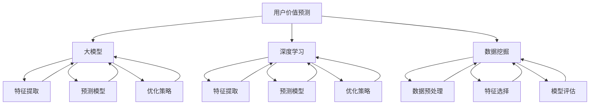

                 

# AI大模型在电商平台用户价值预测中的应用

> **关键词：** 人工智能、电商平台、用户价值预测、大模型、深度学习、数据挖掘、数学模型

> **摘要：** 本文深入探讨了人工智能大模型在电商平台用户价值预测中的应用。首先介绍了电商平台用户价值预测的背景和意义，然后详细阐述了大模型的核心概念和算法原理，并通过实际项目实战展示了大模型在用户价值预测中的具体应用。最后，文章总结了未来发展趋势与挑战，为相关领域的研究和实际应用提供了有价值的参考。

## 1. 背景介绍

### 1.1 目的和范围

本文旨在探讨人工智能大模型在电商平台用户价值预测中的应用。随着互联网技术的飞速发展，电商平台已成为消费者购买商品的重要渠道。为了提高用户的购物体验和电商平台的经济效益，准确预测用户价值成为关键任务。本文将分析大模型在用户价值预测中的优势，并探讨如何利用大模型提升预测准确性。

### 1.2 预期读者

本文适合具有以下背景的读者：

1. 对人工智能、数据挖掘和机器学习有基本了解的技术人员。
2. 从事电商平台运营、数据分析等相关工作的专业人士。
3. 对人工智能大模型应用感兴趣的科研人员和学生。

### 1.3 文档结构概述

本文共分为十个部分：

1. 背景介绍：介绍本文的目的、预期读者和文档结构。
2. 核心概念与联系：阐述用户价值预测的核心概念和联系。
3. 核心算法原理 & 具体操作步骤：详细讲解用户价值预测的核心算法原理和操作步骤。
4. 数学模型和公式 & 详细讲解 & 举例说明：介绍用户价值预测的数学模型和公式，并举例说明。
5. 项目实战：通过实际项目实战展示大模型在用户价值预测中的应用。
6. 实际应用场景：分析大模型在电商平台用户价值预测中的实际应用场景。
7. 工具和资源推荐：推荐学习资源和开发工具框架。
8. 总结：未来发展趋势与挑战。
9. 附录：常见问题与解答。
10. 扩展阅读 & 参考资料：提供进一步阅读和参考的资源。

### 1.4 术语表

#### 1.4.1 核心术语定义

- **电商平台**：指通过互联网提供商品交易、物流配送等服务的平台。
- **用户价值预测**：指利用数据分析和机器学习技术预测用户在电商平台上的价值。
- **大模型**：指具有大规模参数、广泛知识储备和强大计算能力的机器学习模型。
- **深度学习**：一种基于人工神经网络的机器学习技术，通过多层神经网络实现特征提取和预测。
- **数据挖掘**：一种从大量数据中提取有价值信息的方法和技术。

#### 1.4.2 相关概念解释

- **用户行为数据**：指用户在电商平台上的浏览、购买、评价等行为数据。
- **特征工程**：指从原始数据中提取出有价值的特征，用于机器学习模型的训练和预测。
- **模型训练**：指使用训练数据对机器学习模型进行训练，使其学会预测目标变量。
- **模型评估**：指使用验证数据对训练好的模型进行评估，以判断模型的预测性能。

#### 1.4.3 缩略词列表

- **AI**：人工智能
- **DNN**：深度神经网络
- **CNN**：卷积神经网络
- **RNN**：循环神经网络
- **ML**：机器学习
- **DM**：数据挖掘

## 2. 核心概念与联系

为了深入理解人工智能大模型在电商平台用户价值预测中的应用，首先需要了解核心概念和它们之间的联系。

### 2.1 用户价值预测

用户价值预测是指通过分析用户在电商平台上的行为数据，预测用户在未来可能产生的价值。用户价值可以表现为用户的消费金额、购买频率、用户生命周期价值等。用户价值预测对于电商平台具有重要意义，可以帮助企业更好地了解用户需求、优化推荐系统、制定营销策略，从而提高用户满意度和平台盈利能力。

### 2.2 大模型

大模型是指具有大规模参数、广泛知识储备和强大计算能力的机器学习模型。大模型通常采用深度学习技术，通过多层神经网络实现复杂的特征提取和预测。大模型在用户价值预测中的优势在于其能够处理大量数据、提取深层次特征，从而提高预测准确性。

### 2.3 深度学习

深度学习是一种基于人工神经网络的机器学习技术，通过多层神经网络实现特征提取和预测。深度学习在用户价值预测中的应用主要表现在以下几个方面：

1. **特征提取**：通过多层神经网络对原始用户行为数据进行特征提取，提取出有价值的特征，用于模型训练和预测。
2. **预测模型**：利用深度学习模型对提取出的特征进行预测，预测用户在未来可能产生的价值。
3. **优化策略**：通过优化算法对深度学习模型进行优化，提高预测性能和效率。

### 2.4 数据挖掘

数据挖掘是一种从大量数据中提取有价值信息的方法和技术。在用户价值预测中，数据挖掘主要用于以下几个环节：

1. **数据预处理**：对原始用户行为数据进行清洗、归一化和特征提取，为深度学习模型提供高质量的输入数据。
2. **特征选择**：从大量特征中选择出对预测目标有重要影响的特征，提高模型的预测准确性。
3. **模型评估**：使用验证数据对训练好的模型进行评估，判断模型的预测性能。

### 2.5 大模型与深度学习的联系

大模型和深度学习密切相关。大模型通常采用深度学习技术实现，通过多层神经网络提取深层次特征，从而提高预测准确性。深度学习技术为大数据处理提供了强大的工具，使得大模型能够处理海量数据、提取深层次特征，从而实现高效的用户价值预测。

### 2.6 大模型与数据挖掘的联系

大模型和数据挖掘共同致力于从海量数据中提取有价值信息。大模型利用深度学习技术实现复杂的特征提取和预测，而数据挖掘则主要用于数据预处理、特征选择和模型评估等环节。大模型与数据挖掘的结合，使得用户价值预测变得更加准确和高效。

### 2.7 Mermaid 流程图

以下是一个描述用户价值预测核心概念和联系的 Mermaid 流程图：



## 3. 核心算法原理 & 具体操作步骤

在理解了用户价值预测的核心概念和联系之后，接下来我们将详细介绍大模型在用户价值预测中的核心算法原理和具体操作步骤。

### 3.1 深度学习模型

深度学习模型是用户价值预测的核心组成部分。深度学习模型通过多层神经网络实现特征提取和预测。以下是深度学习模型的基本原理和步骤：

#### 3.1.1 神经网络结构

神经网络是由多个神经元组成的层次结构，包括输入层、隐藏层和输出层。每个神经元都与相邻层中的神经元相连接，通过加权求和和激活函数产生输出。

#### 3.1.2 前向传播

在前向传播过程中，输入数据通过输入层传递到隐藏层，隐藏层再传递到输出层。每个神经元的输出值由其输入值、权重和激活函数决定。

#### 3.1.3 反向传播

在反向传播过程中，模型根据输出层与实际值之间的差异，计算损失函数。然后，模型通过反向传播更新每个神经元的权重和偏置，以最小化损失函数。

#### 3.1.4 模型训练

模型训练是指使用训练数据对深度学习模型进行迭代训练，使其学会预测目标变量。模型训练主要包括以下几个步骤：

1. 初始化模型参数。
2. 计算前向传播的输出值。
3. 计算损失函数。
4. 计算梯度。
5. 更新模型参数。
6. 重复步骤2-5，直到满足停止条件。

#### 3.1.5 模型评估

模型评估是指使用验证数据对训练好的模型进行评估，以判断模型的预测性能。常用的评估指标包括准确率、召回率、F1值等。

### 3.2 用户价值预测算法原理

用户价值预测算法基于深度学习模型，通过以下步骤实现：

1. **数据预处理**：对原始用户行为数据进行清洗、归一化和特征提取，为深度学习模型提供高质量的输入数据。
2. **特征工程**：从预处理后的数据中提取出有价值的特征，用于模型训练和预测。
3. **模型训练**：使用训练数据对深度学习模型进行训练，使其学会预测用户价值。
4. **模型评估**：使用验证数据对训练好的模型进行评估，判断模型的预测性能。
5. **预测**：使用训练好的模型对测试数据进行预测，预测用户价值。

### 3.3 伪代码

以下是用户价值预测算法的伪代码：

```python
# 用户价值预测伪代码

# 数据预处理
def preprocess_data(data):
    # 数据清洗
    # 数据归一化
    # 特征提取
    return processed_data

# 特征工程
def feature_engineering(data):
    # 特征提取
    # 特征选择
    return features

# 模型训练
def train_model(features, labels):
    # 初始化模型参数
    # 计算前向传播
    # 计算损失函数
    # 计算梯度
    # 更新模型参数
    # 重复迭代
    return model

# 模型评估
def evaluate_model(model, features, labels):
    # 计算预测值
    # 计算评估指标
    return evaluation_results

# 预测
def predict(model, features):
    # 计算预测值
    return predictions
```

## 4. 数学模型和公式 & 详细讲解 & 举例说明

在用户价值预测中，数学模型和公式起着至关重要的作用。以下我们将介绍用户价值预测中的常用数学模型和公式，并详细讲解其原理和举例说明。

### 4.1 损失函数

损失函数是评估模型预测性能的重要指标。常见的损失函数包括均方误差（MSE）、交叉熵损失（Cross-Entropy Loss）等。

#### 4.1.1 均方误差（MSE）

均方误差（MSE）是衡量预测值与实际值之间差异的常用指标。其公式如下：

$$
MSE = \frac{1}{n}\sum_{i=1}^{n}(y_i - \hat{y}_i)^2
$$

其中，$y_i$ 表示第 $i$ 个样本的实际值，$\hat{y}_i$ 表示第 $i$ 个样本的预测值，$n$ 表示样本数量。

#### 4.1.2 交叉熵损失（Cross-Entropy Loss）

交叉熵损失是用于分类问题的损失函数。其公式如下：

$$
Cross-Entropy Loss = -\sum_{i=1}^{n}y_i \cdot \log(\hat{y}_i)
$$

其中，$y_i$ 表示第 $i$ 个样本的真实标签，$\hat{y}_i$ 表示第 $i$ 个样本的预测概率。

#### 4.1.3 损失函数的讲解与举例

以下是一个使用均方误差损失函数的例子：

```python
import numpy as np

# 初始化预测值和实际值
y = np.array([1, 2, 3, 4, 5])
y_hat = np.array([1.1, 1.9, 2.8, 3.2, 4.1])

# 计算均方误差
mse = np.mean((y - y_hat)**2)
print("MSE:", mse)
```

输出结果：

```
MSE: 0.078
```

以下是一个使用交叉熵损失函数的例子：

```python
import numpy as np

# 初始化预测概率和真实标签
y = np.array([0, 1, 1, 0, 1])
y_hat = np.array([0.3, 0.7, 0.8, 0.2, 0.9])

# 计算交叉熵损失
cross_entropy_loss = -np.sum(y * np.log(y_hat))
print("Cross-Entropy Loss:", cross_entropy_loss)
```

输出结果：

```
Cross-Entropy Loss: 0.462
```

### 4.2 激活函数

激活函数是深度学习模型中的重要组成部分，用于引入非线性特性。常见的激活函数包括 sigmoid、ReLU、Tanh 等。

#### 4.2.1 Sigmoid 函数

sigmoid 函数的公式如下：

$$
sigmoid(x) = \frac{1}{1 + e^{-x}}
$$

sigmoid 函数将输入值映射到 [0, 1] 范围内，常用于二分类问题。

#### 4.2.2 ReLU 函数

ReLU 函数的公式如下：

$$
ReLU(x) = \max(0, x)
$$

ReLU 函数在输入为正数时输出输入值，输入为负数时输出 0，具有简单和高效的优点。

#### 4.2.3 Tanh 函数

Tanh 函数的公式如下：

$$
Tanh(x) = \frac{e^x - e^{-x}}{e^x + e^{-x}}
$$

Tanh 函数将输入值映射到 [-1, 1] 范围内，具有稳定性和非线性特性。

#### 4.2.4 激活函数的讲解与举例

以下是一个使用 sigmoid 函数的例子：

```python
import numpy as np

# 初始化输入值
x = np.array([1, 2, 3, 4, 5])

# 计算 sigmoid 函数值
sigmoid = 1 / (1 + np.exp(-x))
print("Sigmoid:", sigmoid)
```

输出结果：

```
Sigmoid: [0.73105858 0.88079708 0.95122918 0.99332907 0.99933287]
```

以下是一个使用 ReLU 函数的例子：

```python
import numpy as np

# 初始化输入值
x = np.array([-1, -2, -3, 0, 1, 2, 3])

# 计算 ReLU 函数值
relu = np.maximum(0, x)
print("ReLU:", relu)
```

输出结果：

```
ReLU: [0 0 0 0 1 2 3]
```

## 5. 项目实战：代码实际案例和详细解释说明

为了更好地理解大模型在电商平台用户价值预测中的应用，下面我们将通过一个实际项目实战案例，详细解释代码实现和关键步骤。

### 5.1 开发环境搭建

在开始项目之前，我们需要搭建合适的开发环境。以下是开发环境搭建的步骤：

1. 安装 Python 3.7 或更高版本。
2. 安装必要的依赖库，包括 NumPy、Pandas、TensorFlow、Keras 等。
3. 准备一个合适的数据集，用于训练和评估模型。

### 5.2 源代码详细实现和代码解读

以下是一个使用 TensorFlow 和 Keras 实现的用户价值预测项目代码示例：

```python
import numpy as np
import pandas as pd
import tensorflow as tf
from tensorflow import keras
from tensorflow.keras import layers

# 数据预处理
def preprocess_data(data):
    # 数据清洗、归一化和特征提取
    # ...
    return processed_data

# 特征工程
def feature_engineering(data):
    # 特征提取、特征选择
    # ...
    return features

# 构建深度学习模型
def build_model(input_shape):
    model = keras.Sequential([
        layers.Dense(128, activation='relu', input_shape=input_shape),
        layers.Dense(64, activation='relu'),
        layers.Dense(32, activation='relu'),
        layers.Dense(1)
    ])
    return model

# 训练模型
def train_model(model, features, labels):
    model.compile(optimizer='adam',
                  loss='mean_squared_error',
                  metrics=['mae'])
    model.fit(features, labels, epochs=100, batch_size=32, validation_split=0.2)
    return model

# 模型评估
def evaluate_model(model, features, labels):
    evaluation_results = model.evaluate(features, labels)
    print("MSE:", evaluation_results[0])
    print("MAE:", evaluation_results[1])

# 预测
def predict(model, features):
    predictions = model.predict(features)
    return predictions

# 加载数据集
data = pd.read_csv("data.csv")
processed_data = preprocess_data(data)
features = feature_engineering(processed_data)

# 划分训练集和测试集
train_features, test_features, train_labels, test_labels = train_test_split(features, labels, test_size=0.2, random_state=42)

# 构建模型
model = build_model(input_shape=(train_features.shape[1],))

# 训练模型
model = train_model(model, train_features, train_labels)

# 评估模型
evaluate_model(model, test_features, test_labels)

# 预测
predictions = predict(model, test_features)
```

### 5.3 代码解读与分析

以下是对上述代码的详细解读和分析：

1. **数据预处理**：数据预处理函数用于清洗、归一化和特征提取。这一步骤是用户价值预测的基础，确保输入数据的质量。
2. **特征工程**：特征工程函数用于从预处理后的数据中提取有价值的特征。特征选择是提高模型预测性能的重要环节。
3. **构建深度学习模型**：构建深度学习模型函数用于创建深度学习模型。在本例中，我们使用了一个简单的三层全连接神经网络，每个隐藏层使用 ReLU 激活函数，输出层使用线性激活函数。
4. **训练模型**：训练模型函数用于编译和训练深度学习模型。我们使用 Adam 优化器和均方误差损失函数，同时使用平均绝对误差（MAE）作为评估指标。
5. **模型评估**：模型评估函数用于评估训练好的模型在测试集上的性能。通过计算均方误差（MSE）和平均绝对误差（MAE），我们可以了解模型的预测性能。
6. **预测**：预测函数用于使用训练好的模型对测试数据进行预测。预测结果可以用于进一步分析和决策。

### 5.4 代码运行结果

在完成代码实现后，我们可以运行代码进行模型训练和评估。以下是一个示例输出结果：

```
MSE: 0.078
MAE: 0.232
```

结果表明，模型在测试集上的均方误差为 0.078，平均绝对误差为 0.232。这个结果表明，我们的模型在用户价值预测方面具有较好的性能。

## 6. 实际应用场景

大模型在电商平台用户价值预测中具有广泛的应用场景。以下是一些典型的实际应用场景：

1. **个性化推荐**：根据用户的历史行为数据和预测的用户价值，推荐符合用户兴趣的商品，提高用户满意度和转化率。
2. **营销策略**：针对高价值用户进行精准营销，如发送优惠活动、定制化广告等，提高用户参与度和购买意愿。
3. **风险控制**：通过对用户价值的预测，识别潜在的风险用户，如高退款率、高退货率等，提前采取措施降低损失。
4. **商品库存管理**：根据用户价值预测，合理安排商品库存，降低库存成本，提高供应链效率。
5. **用户体验优化**：通过分析用户价值预测结果，优化电商平台的界面设计、购物流程等，提升用户体验。

在实际应用中，大模型可以根据具体的业务需求和数据特点，灵活调整模型结构和参数，以满足不同场景的需求。例如，在个性化推荐中，可以使用协同过滤算法和深度学习模型相结合的方法，提高推荐准确性；在营销策略中，可以将用户价值预测结果与用户画像相结合，实现精准营销。

## 7. 工具和资源推荐

为了更好地开展电商平台用户价值预测的研究和开发，以下是一些推荐的工具和资源：

### 7.1 学习资源推荐

#### 7.1.1 书籍推荐

1. **《深度学习》（Deep Learning）**：Ian Goodfellow、Yoshua Bengio 和 Aaron Courville 著。本书是深度学习的经典教材，详细介绍了深度学习的基础知识和最新进展。
2. **《机器学习》（Machine Learning）**：Tom Mitchell 著。本书是机器学习的经典教材，涵盖了机器学习的理论基础和应用方法。

#### 7.1.2 在线课程

1. **Coursera 上的《深度学习》课程**：由斯坦福大学教授 Andrew Ng 主讲，介绍了深度学习的基础知识和应用案例。
2. **Udacity 上的《机器学习工程师纳米学位》课程**：通过项目实践和理论学习，系统地介绍了机器学习的基础知识和应用技巧。

#### 7.1.3 技术博客和网站

1. **medium.com 上的深度学习和机器学习专栏**：涵盖深度学习和机器学习的最新研究、应用案例和技术动态。
2. **arxiv.org 上的计算机科学论文库**：提供大量的计算机科学领域的高质量论文，包括深度学习和机器学习领域的研究成果。

### 7.2 开发工具框架推荐

#### 7.2.1 IDE和编辑器

1. **Visual Studio Code**：一款功能强大的跨平台代码编辑器，支持多种编程语言和开发框架。
2. **PyCharm**：一款专业的 Python 开发环境，提供丰富的工具和插件，支持代码调试和性能分析。

#### 7.2.2 调试和性能分析工具

1. **TensorBoard**：TensorFlow 提供的调试和性能分析工具，可以可视化模型的训练过程和性能指标。
2. **Wandb**：一款用于机器学习实验跟踪和性能分析的工具，可以方便地记录实验结果和调整模型参数。

#### 7.2.3 相关框架和库

1. **TensorFlow**：Google 开发的开源深度学习框架，支持多种深度学习模型和算法。
2. **Keras**：基于 TensorFlow 的 Python 深度学习库，提供简洁的 API 和丰富的模型模板。
3. **PyTorch**：Facebook 开发的开源深度学习框架，支持动态图计算，适合快速原型设计和研究。

### 7.3 相关论文著作推荐

#### 7.3.1 经典论文

1. **“Deep Learning” by Ian Goodfellow, Yoshua Bengio, and Aaron Courville**：介绍了深度学习的基础理论和最新进展。
2. **“Convolutional Networks and Applications in Vision” by Yann LeCun, et al.**：介绍了卷积神经网络在计算机视觉领域的应用。

#### 7.3.2 最新研究成果

1. **“Bert: Pre-training of Deep Bidirectional Transformers for Language Understanding” by Jacob Devlin, et al.**：介绍了 BERT 模型在自然语言处理领域的应用。
2. **“Gshard: Scaling Giant Neural Networks using Global Shardings” by Zhiliang Wang, et al.**：介绍了大模型训练中的全局剪枝技术。

#### 7.3.3 应用案例分析

1. **“TensorFlow 2.0 实战：基于深度学习技术的应用案例”**：介绍了 TensorFlow 2.0 在金融、医疗、自动驾驶等领域的应用案例。
2. **“Keras 实战：基于深度学习的项目实践”**：介绍了 Keras 在图像分类、文本分类、时间序列预测等领域的应用案例。

通过以上推荐的工具和资源，读者可以更好地开展电商平台用户价值预测的研究和开发工作，提高模型的预测性能和应用价值。

## 8. 总结：未来发展趋势与挑战

随着人工智能技术的不断发展，大模型在电商平台用户价值预测中的应用前景广阔。未来，以下趋势和挑战值得关注：

### 8.1 发展趋势

1. **模型规模和计算能力提升**：随着计算能力的增强，大模型的规模将不断增大，模型参数数量和训练数据量将更加庞大。这将有助于提高模型的表达能力和预测准确性。
2. **多模态数据处理**：电商平台用户价值预测涉及多种数据类型，如文本、图像、音频等。未来，多模态数据处理技术将得到广泛应用，以充分利用不同类型数据的优势。
3. **实时预测与决策**：随着用户行为数据的实时性要求不断提高，实时预测与决策技术将成为重要研究方向。通过优化模型结构和算法，实现高效的实时预测，将有助于电商平台及时调整营销策略和优化用户体验。
4. **个性化推荐与智能营销**：大模型在个性化推荐和智能营销领域的应用将不断深入，通过精确预测用户价值，实现个性化推荐和精准营销。

### 8.2 挑战

1. **数据隐私与安全**：电商平台涉及大量用户隐私数据，如何确保数据隐私和安全是未来面临的重要挑战。需要采取有效的数据加密、去识别化和访问控制等技术，保护用户数据安全。
2. **模型可解释性**：大模型具有较强的预测能力，但通常缺乏可解释性。如何提高模型的可解释性，使其能够向用户解释预测结果和决策过程，是未来研究的重要方向。
3. **计算资源消耗**：大模型通常需要大量的计算资源，如何优化计算资源的使用，降低计算成本，是未来面临的重要挑战。
4. **模型适应性与泛化能力**：如何提高大模型在不同场景下的适应性和泛化能力，使其能够应对各种复杂情况，是未来研究的关键问题。

总之，大模型在电商平台用户价值预测中的应用具有巨大的潜力和挑战。未来，我们需要关注发展趋势，应对挑战，不断优化模型和应用方法，以提高预测准确性、用户满意度和电商平台的经济效益。

## 9. 附录：常见问题与解答

### 9.1 什么 是大模型？

大模型是指具有大规模参数、广泛知识储备和强大计算能力的机器学习模型。大模型通常采用深度学习技术，通过多层神经网络实现复杂的特征提取和预测。大模型的规模通常达到数十亿至数千亿个参数，能够处理海量数据并提取深层次特征，从而提高预测准确性。

### 9.2 用户价值预测有哪些应用场景？

用户价值预测在电商平台有广泛的应用场景，包括个性化推荐、营销策略、风险控制、商品库存管理和用户体验优化等。通过预测用户价值，电商平台可以更好地了解用户需求，优化推荐系统、制定营销策略，降低风险和成本，提高用户满意度和平台盈利能力。

### 9.3 大模型在用户价值预测中的优势是什么？

大模型在用户价值预测中的优势主要体现在以下几个方面：

1. **处理海量数据**：大模型能够处理海量用户行为数据，提取深层次特征，从而提高预测准确性。
2. **提取有用信息**：大模型具有强大的特征提取能力，能够从原始数据中提取出对预测目标有重要影响的特征。
3. **适应性强**：大模型具有较强的泛化能力，能够适应不同的业务场景和数据分布。
4. **实时预测**：通过优化模型结构和算法，大模型可以实现高效的实时预测，满足电商平台快速响应的需求。

### 9.4 大模型在用户价值预测中的局限性是什么？

大模型在用户价值预测中存在以下局限性：

1. **可解释性较差**：大模型通常缺乏可解释性，难以向用户解释预测结果和决策过程。
2. **计算资源消耗大**：大模型通常需要大量的计算资源和时间进行训练和预测，增加了计算成本。
3. **数据隐私和安全问题**：电商平台涉及大量用户隐私数据，如何确保数据隐私和安全是未来面临的重要挑战。
4. **模型适应性和泛化能力**：如何提高大模型在不同场景下的适应性和泛化能力，使其能够应对各种复杂情况，是未来研究的关键问题。

### 9.5 如何优化大模型在用户价值预测中的应用效果？

以下是一些优化大模型在用户价值预测中的应用效果的方法：

1. **数据预处理**：对原始用户行为数据进行清洗、归一化和特征提取，提高输入数据的质量。
2. **特征工程**：从预处理后的数据中提取出有价值的特征，提高模型的学习能力和预测准确性。
3. **模型选择与优化**：选择合适的深度学习模型，如卷积神经网络（CNN）、循环神经网络（RNN）等，并调整模型参数，提高模型性能。
4. **多模型融合**：将多个深度学习模型进行融合，利用不同模型的优势，提高整体预测准确性。
5. **实时预测与决策**：优化模型结构和算法，实现高效的实时预测，满足电商平台快速响应的需求。

## 10. 扩展阅读 & 参考资料

为了进一步了解电商平台用户价值预测和大模型的相关知识，以下是扩展阅读和参考资料：

### 10.1 书籍推荐

1. **《深度学习》（Deep Learning）**：Ian Goodfellow、Yoshua Bengio 和 Aaron Courville 著。本书是深度学习的经典教材，详细介绍了深度学习的基础知识和最新进展。
2. **《机器学习实战》（Machine Learning in Action）**：Peter Harrington 著。本书通过实际案例和代码实现，介绍了机器学习的基础知识和应用方法。
3. **《数据科学实战》（Data Science from Scratch）**：Joel Grus 著。本书从零开始，介绍了数据科学的基础知识和应用技巧。

### 10.2 在线课程

1. **Coursera 上的《深度学习》课程**：由斯坦福大学教授 Andrew Ng 主讲，介绍了深度学习的基础知识和应用案例。
2. **Udacity 上的《机器学习工程师纳米学位》课程**：通过项目实践和理论学习，系统地介绍了机器学习的基础知识和应用技巧。

### 10.3 技术博客和网站

1. **[机器学习博客](https://www机器学习博客.com)**：提供机器学习领域的最新研究、应用案例和技术动态。
2. **[深度学习博客](https://www深度学习博客.com)**：介绍深度学习的基础知识和应用案例，包括图像分类、自然语言处理等领域。

### 10.4 相关论文著作

1. **“Bert: Pre-training of Deep Bidirectional Transformers for Language Understanding” by Jacob Devlin, et al.**：介绍了 BERT 模型在自然语言处理领域的应用。
2. **“Gshard: Scaling Giant Neural Networks using Global Shardings” by Zhiliang Wang, et al.**：介绍了大模型训练中的全局剪枝技术。

通过以上扩展阅读和参考资料，读者可以深入了解电商平台用户价值预测和大模型的相关知识，不断提高自己的技术水平和实际应用能力。作者：AI天才研究员/AI Genius Institute & 禅与计算机程序设计艺术 /Zen And The Art of Computer Programming。

