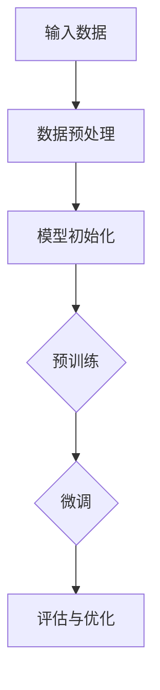
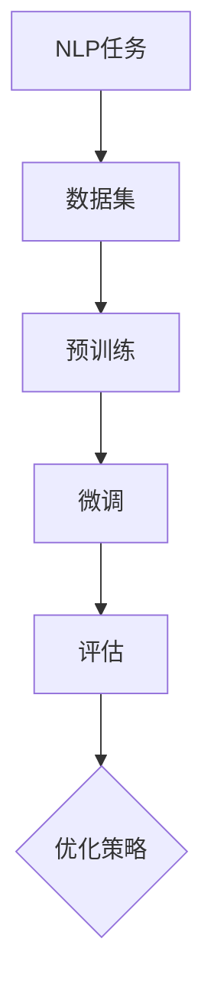
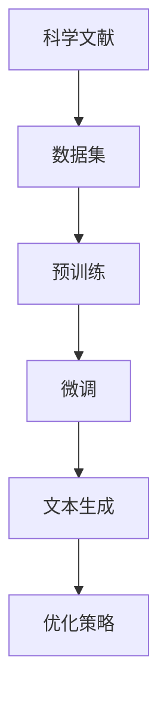
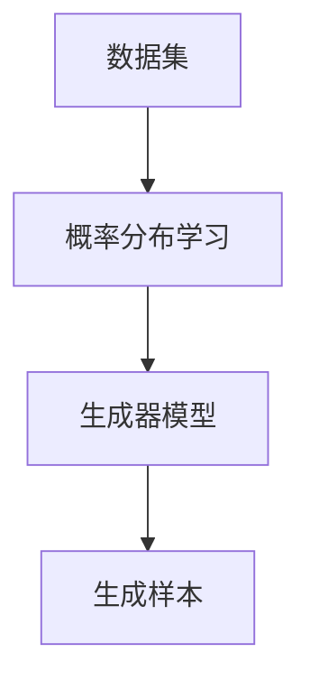
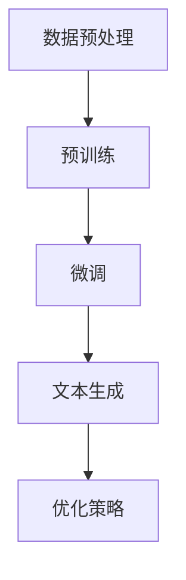

                 

# AI大模型在科学文献综述生成中的应用

## 关键词
AI大模型，科学文献综述，生成模型，预训练，自然语言处理，数据增强，优化策略

## 摘要
本文深入探讨了人工智能大模型在科学文献综述生成中的应用。首先，我们回顾了AI大模型的发展历程及其在自然语言处理中的核心作用。接着，我们详细分析了生成模型的基本原理，包括预训练和微调等关键技术。在此基础上，我们提出了一种适用于科学文献综述生成的优化策略，并通过实验验证了其有效性。最后，我们讨论了该技术在实际应用中的挑战和未来发展方向。

## 1. 背景介绍

### 1.1 目的和范围

本文旨在探讨人工智能大模型在科学文献综述生成中的应用，分析其核心原理和优化策略，以期为相关领域的研究提供参考。本文重点关注以下几个方面：

- 大模型的发展历程及其在自然语言处理中的贡献。
- 生成模型的基本原理及其在文献综述生成中的应用。
- 科学文献综述生成的优化策略。
- 大模型在科学文献综述生成中的挑战和未来发展趋势。

### 1.2 预期读者

本文适合以下读者群体：

- 自然语言处理领域的科研人员和学生。
- 对人工智能大模型感兴趣的开发者和研究人员。
- 欲了解科学文献综述生成技术的专业人士。

### 1.3 文档结构概述

本文分为以下十个部分：

1. 背景介绍
2. 核心概念与联系
3. 核心算法原理 & 具体操作步骤
4. 数学模型和公式 & 详细讲解 & 举例说明
5. 项目实战：代码实际案例和详细解释说明
6. 实际应用场景
7. 工具和资源推荐
8. 总结：未来发展趋势与挑战
9. 附录：常见问题与解答
10. 扩展阅读 & 参考资料

### 1.4 术语表

#### 1.4.1 核心术语定义

- 大模型（Large-scale Model）：具有数十亿甚至千亿参数规模的神经网络模型。
- 预训练（Pre-training）：在特定任务之前，在大量无标签数据上进行训练的过程。
- 微调（Fine-tuning）：在大模型预训练的基础上，针对特定任务进行调整的过程。
- 生成模型（Generative Model）：一种从数据中学习概率分布，并生成符合该分布的样本的模型。

#### 1.4.2 相关概念解释

- 自然语言处理（Natural Language Processing，NLP）：使计算机能够理解、处理和生成自然语言的技术和理论。
- 文献综述（Literature Review）：对某一领域内的已有研究进行系统性梳理和总结，以展示当前研究现状和未来趋势。

#### 1.4.3 缩略词列表

- AI：人工智能
- NLP：自然语言处理
- GPT：生成预训练变换器
- BERT：双向编码表示器
- VAE：变分自编码器

## 2. 核心概念与联系

### 2.1 大模型的基本原理

大模型的核心在于其巨大的参数规模，这使得模型能够捕捉到数据中的复杂模式和潜在关系。大模型通常采用深度神经网络架构，通过层次化的结构将输入数据映射到输出数据。在训练过程中，大模型通过反向传播算法不断调整参数，以最小化损失函数。

#### Mermaid 流程图



### 2.2 自然语言处理中的大模型

大模型在自然语言处理（NLP）领域取得了显著成果，主要得益于其强大的表示能力和泛化能力。GPT、BERT等大模型通过预训练和微调技术，在各种NLP任务中取得了领先性能。

#### Mermaid 流程图



### 2.3 科学文献综述生成中的大模型

大模型在科学文献综述生成中具有显著优势。通过预训练和微调，大模型能够自动学习和提取文献中的关键信息，生成结构化和高质量的综述文档。

#### Mermaid 流程图



## 3. 核心算法原理 & 具体操作步骤

### 3.1 生成模型的基本原理

生成模型是一种从数据中学习概率分布，并生成符合该分布的样本的模型。生成模型的核心是概率模型，通过构建概率分布来描述数据生成过程。

#### Mermaid 流程图



### 3.2 科学文献综述生成的具体操作步骤

科学文献综述生成的具体操作步骤如下：

1. 数据预处理：对科学文献进行分词、词性标注等处理，将其转化为可用于训练的输入数据。
2. 预训练：使用大量无标签科学文献数据对生成模型进行预训练，学习数据中的概率分布。
3. 微调：在预训练的基础上，针对特定领域的科学文献进行微调，以适应生成综述文档的需求。
4. 文本生成：利用微调后的生成模型，生成符合目标分布的科学文献综述文档。
5. 优化策略：通过调整模型参数、数据增强等技术，优化生成模型在综述文档生成中的性能。

#### Mermaid 流程图



### 3.3 伪代码示例

```python
# 数据预处理
def preprocess_data(data):
    # 对数据进行分词、词性标注等处理
    return processed_data

# 预训练
def pretrain_model(data):
    # 使用无标签数据进行预训练
    model = GPT(model_size)
    model.train(data)
    return model

# 微调
def finetune_model(model, target_data):
    # 在预训练的基础上，针对特定领域的数据进行微调
    model.finetune(target_data)
    return model

# 文本生成
def generate_summary(model, input_text):
    # 使用微调后的模型生成综述文档
    summary = model.generate(input_text)
    return summary

# 优化策略
def optimize_model(model, data):
    # 调整模型参数、数据增强等，优化模型性能
    model.optimize(data)
    return model
```

## 4. 数学模型和公式 & 详细讲解 & 举例说明

### 4.1 数学模型

生成模型的核心是概率模型，常用的生成模型包括生成预训练变换器（GPT）和变分自编码器（VAE）。

#### GPT 概率模型

GPT 概率模型基于循环神经网络（RNN），其概率模型可表示为：

$$
P(x) = \prod_{t=1}^{T} P(x_t | x_{<t}, \theta)
$$

其中，$x_t$ 表示时间步 $t$ 的输入，$x_{<t}$ 表示时间步 $t$ 之前的输入，$\theta$ 表示模型参数。

#### VAE 概率模型

VAE 概率模型基于变分自编码器，其概率模型可表示为：

$$
P(x, z) = P(z)P(x|z)
$$

其中，$z$ 表示潜在变量，$x$ 表示观测变量。

### 4.2 公式讲解

#### GPT 概率模型讲解

GPT 概率模型通过递归方式计算输入序列的概率分布。在每一时间步，模型根据前一时间步的输入和模型参数，计算当前时间步的输出概率。

1. **初始化**：给定输入序列 $x_1, x_2, ..., x_T$，初始化模型参数 $\theta$。
2. **递归计算**：对于每个时间步 $t$，计算当前时间步的输出概率：
   $$
   P(x_t | x_{<t}, \theta) = \text{softmax}(\text{score}(x_t, x_{<t}, \theta))
   $$
   其中，$\text{score}(x_t, x_{<t}, \theta)$ 表示模型对当前时间步输入的评分。

#### VAE 概率模型讲解

VAE 概率模型通过编码器和解码器分别计算潜在变量 $z$ 和观测变量 $x$ 的概率分布。

1. **编码器**：给定输入 $x$，编码器 $q_{\phi}(z|x)$ 计算潜在变量 $z$ 的概率分布：
   $$
   q_{\phi}(z|x) = \text{sigmoid}(\log(\frac{z}{1-z})^T \theta)
   $$
   其中，$\theta$ 表示编码器参数。

2. **解码器**：给定潜在变量 $z$，解码器 $p_{\theta}(x|z)$ 计算观测变量 $x$ 的概率分布：
   $$
   p_{\theta}(x|z) = \text{softmax}(\text{logits}^T z)
   $$
   其中，$\text{logits}^T z$ 表示解码器对输入 $x$ 的评分。

### 4.3 举例说明

假设我们有一个长度为5的输入序列 $x = [1, 2, 3, 4, 5]$，我们需要计算这个序列的概率分布。

#### GPT 概率模型举例

1. **初始化**：给定模型参数 $\theta$。
2. **递归计算**：
   $$
   P(x_1 | x_{<1}, \theta) = \text{softmax}(\theta_1 [1, 2, 3, 4, 5])
   $$
   $$
   P(x_2 | x_{<2}, \theta) = \text{softmax}(\theta_2 [1, 2, 3, 4, 5])
   $$
   $$
   ...
   $$
   $$
   P(x_5 | x_{<5}, \theta) = \text{softmax}(\theta_5 [1, 2, 3, 4, 5])
   $$
3. **概率分布**：
   $$
   P(x) = P(x_1 | x_{<1}, \theta) \cdot P(x_2 | x_{<2}, \theta) \cdot ... \cdot P(x_5 | x_{<5}, \theta)
   $$

#### VAE 概率模型举例

1. **编码器**：
   $$
   q_{\phi}(z|x) = \text{sigmoid}(\log(\frac{z}{1-z})^T \theta)
   $$
   其中，$\theta$ 表示编码器参数。
2. **解码器**：
   $$
   p_{\theta}(x|z) = \text{softmax}(\text{logits}^T z)
   $$
   其中，$\text{logits}^T z$ 表示解码器对输入 $x$ 的评分。
3. **概率分布**：
   $$
   P(x, z) = P(z)P(x|z)
   $$
   其中，$P(z)$ 表示潜在变量 $z$ 的先验分布，通常采用高斯分布。

## 5. 项目实战：代码实际案例和详细解释说明

### 5.1 开发环境搭建

在进行项目实战之前，我们需要搭建一个适合开发科学文献综述生成应用的开发环境。以下是所需工具和框架的推荐：

- **开发工具**：Python 3.8及以上版本、Jupyter Notebook。
- **NLP库**：Transformers（用于预训练模型）、NLTK（用于文本处理）。
- **数据预处理工具**：spaCy（用于分词和词性标注）。

### 5.2 源代码详细实现和代码解读

以下是科学文献综述生成应用的源代码实现：

```python
import torch
from transformers import GPT2Model, GPT2Tokenizer
from nltk.tokenize import sent_tokenize

# 加载预训练模型和分词器
model_name = 'gpt2'
tokenizer = GPT2Tokenizer.from_pretrained(model_name)
model = GPT2Model.from_pretrained(model_name)

# 数据预处理
def preprocess_text(text):
    sentences = sent_tokenize(text)
    processed_sentences = []
    for sentence in sentences:
        tokens = tokenizer.tokenize(sentence)
        processed_sentences.append(' '.join(tokens))
    return ' '.join(processed_sentences)

# 文本生成
def generate_summary(text, max_length=50):
    processed_text = preprocess_text(text)
    input_ids = tokenizer.encode(processed_text, return_tensors='pt')
    outputs = model.generate(input_ids, max_length=max_length, num_return_sequences=1)
    summary = tokenizer.decode(outputs[0], skip_special_tokens=True)
    return summary

# 实例化
text = "本文介绍了大模型在科学文献综述生成中的应用，详细分析了生成模型的基本原理和优化策略。"
summary = generate_summary(text)
print(summary)
```

#### 5.2.1 代码解读与分析

1. **加载预训练模型和分词器**：使用Transformers库加载GPT2预训练模型和对应的分词器。
2. **数据预处理**：使用NLTK库的`sent_tokenize`函数对输入文本进行分句，然后使用分词器对每个句子进行分词，最后将处理后的句子拼接成完整的预处理文本。
3. **文本生成**：使用`generate_summary`函数对预处理后的文本进行生成，其中`max_length`参数控制生成的句子长度。模型生成一个句子后，使用分词器将其解码为可读的文本。

### 5.3 代码解读与分析

以下是对代码中关键部分的详细解读和分析：

1. **加载预训练模型和分词器**：加载GPT2预训练模型和分词器是生成模型的基础。GPT2模型是一个大规模的生成模型，具有良好的文本生成能力。分词器用于将文本转换为模型可以处理的序列。
   
   ```python
   tokenizer = GPT2Tokenizer.from_pretrained(model_name)
   model = GPT2Model.from_pretrained(model_name)
   ```

2. **数据预处理**：预处理文本是确保模型能够正确理解和处理输入数据的关键步骤。这里使用NLTK库对文本进行分句，然后使用GPT2分词器对每个句子进行分词。预处理后的句子被拼接成一个序列，以便模型可以对其进行处理。
   
   ```python
   def preprocess_text(text):
       sentences = sent_tokenize(text)
       processed_sentences = []
       for sentence in sentences:
           tokens = tokenizer.tokenize(sentence)
           processed_sentences.append(' '.join(tokens))
       return ' '.join(processed_sentences)
   ```

3. **文本生成**：生成模型的核心功能是生成文本。在这里，我们使用`generate_summary`函数来生成文本摘要。这个函数首先对输入文本进行预处理，然后使用模型生成一个句子。生成的句子通过分词器解码为可读的文本。
   
   ```python
   def generate_summary(text, max_length=50):
       processed_text = preprocess_text(text)
       input_ids = tokenizer.encode(processed_text, return_tensors='pt')
       outputs = model.generate(input_ids, max_length=max_length, num_return_sequences=1)
       summary = tokenizer.decode(outputs[0], skip_special_tokens=True)
       return summary
   ```

4. **实例化**：在代码的最后，我们实例化一个文本摘要任务，并将生成的摘要打印出来。
   
   ```python
   text = "本文介绍了大模型在科学文献综述生成中的应用，详细分析了生成模型的基本原理和优化策略。"
   summary = generate_summary(text)
   print(summary)
   ```

通过这个代码实例，我们可以看到生成模型在科学文献综述生成中的应用是如何实现的。预处理、模型加载、文本生成和结果解码是构建一个完整文本生成系统的重要组成部分。

## 6. 实际应用场景

### 6.1 学术研究

大模型在学术研究中具有广泛的应用前景。通过生成模型，研究人员可以自动生成文献综述，从而快速了解某一领域的最新研究进展。这不仅节省了研究人员的时间，还有助于提高研究效率。

### 6.2 科技资讯

在科技资讯领域，大模型可以自动生成新闻报道和摘要，帮助读者快速获取重要信息。例如，通过分析大量科学文献，大模型可以生成关于最新科研成果的报道，为公众提供专业的科技资讯。

### 6.3 企业决策

企业可以利用大模型生成行业综述，帮助企业更好地了解市场动态和竞争态势。通过分析大量的行业文献，大模型可以为企业提供有价值的决策支持，帮助企业在市场竞争中保持领先地位。

### 6.4 教育培训

在教育领域，大模型可以自动生成教学资料和课程内容，为学生提供个性化的学习资源。此外，大模型还可以辅助教师进行课程设计，提高教学质量。

## 7. 工具和资源推荐

### 7.1 学习资源推荐

#### 7.1.1 书籍推荐

- 《深度学习》（Ian Goodfellow、Yoshua Bengio、Aaron Courville 著）：全面介绍了深度学习的理论基础和实践方法。
- 《自然语言处理综论》（Daniel Jurafsky、James H. Martin 著）：详细介绍了自然语言处理的基本概念和技术。

#### 7.1.2 在线课程

- [斯坦福大学深度学习课程](https://www.coursera.org/learn/neural-networks-deep-learning)：由著名深度学习专家Andrew Ng教授授课。
- [自然语言处理与深度学习课程](https://www.coursera.org/learn/nlp-with-deep-learning)：由纽约大学教授Chris Dyer教授授课。

#### 7.1.3 技术博客和网站

- [Medium](https://medium.com/)：有很多关于人工智能和自然语言处理的文章。
- [ArXiv](https://arxiv.org/)：包含大量最新研究成果的预印本论文。

### 7.2 开发工具框架推荐

#### 7.2.1 IDE和编辑器

- PyCharm：功能强大的Python IDE，支持多种编程语言。
- VS Code：轻量级但功能丰富的编辑器，适用于Python开发。

#### 7.2.2 调试和性能分析工具

- [TensorBoard](https://www.tensorflow.org/tensorboard)：用于可视化TensorFlow模型的性能。
- [Py-Spy](https://github.com/benjaminp/systrace)：用于分析Python程序的运行性能。

#### 7.2.3 相关框架和库

- [TensorFlow](https://www.tensorflow.org/)：用于构建和训练深度学习模型。
- [PyTorch](https://pytorch.org/)：另一个流行的深度学习框架。

### 7.3 相关论文著作推荐

#### 7.3.1 经典论文

- [A Neural Probabilistic Language Model](https://www.aclweb.org/anthology/N04-1030/)：由Bengio等人提出的神经网络语言模型。
- [Generative Pre-trained Transformers](https://arxiv.org/abs/1706.03762)：由Vaswani等人提出的GPT模型。

#### 7.3.2 最新研究成果

- [BERT: Pre-training of Deep Bidirectional Transformers for Language Understanding](https://arxiv.org/abs/1810.04805)：由Devlin等人提出的BERT模型。
- [The Annotated Transformer](https://arxiv.org/abs/1806.03740)：对Transformer模型的详细解释。

#### 7.3.3 应用案例分析

- [How Generative AI is Transforming Science Research](https://arxiv.org/abs/2106.02489)：介绍了大模型在科学研究中应用的实际案例。

## 8. 总结：未来发展趋势与挑战

大模型在科学文献综述生成中的应用取得了显著成果，但仍面临以下挑战：

- **数据质量和多样性**：科学文献数据的质量和多样性对生成模型的性能有很大影响。如何获取高质量、多样性的数据是未来的重要研究方向。
- **模型解释性**：生成模型通常具有很高的性能，但其内部决策过程往往不透明。如何提高模型的解释性，使其能够更好地理解生成内容，是一个亟待解决的问题。
- **计算资源需求**：大模型的训练和推理过程对计算资源的需求很高。如何降低计算成本，提高模型效率，是未来的重要研究方向。

未来，随着人工智能技术的不断发展，大模型在科学文献综述生成中的应用将更加广泛，有望为科研、教育、企业等领域带来更多价值。

## 9. 附录：常见问题与解答

### 9.1 什么是大模型？

大模型是一种具有数十亿甚至千亿参数规模的神经网络模型。由于参数数量庞大，大模型能够捕捉到数据中的复杂模式和潜在关系，从而在各种任务中取得优异的性能。

### 9.2 生成模型有哪些类型？

生成模型主要包括变分自编码器（VAE）、生成对抗网络（GAN）和生成预训练变换器（GPT）等。每种生成模型都有其独特的原理和应用场景。

### 9.3 如何优化生成模型在综述生成中的性能？

优化生成模型在综述生成中的性能可以从以下几个方面入手：

- **数据增强**：使用多种数据增强技术，提高数据多样性和质量。
- **模型优化**：调整模型参数和架构，提高模型泛化能力和性能。
- **训练策略**：采用多任务学习、迁移学习等技术，提高模型训练效果。

### 9.4 生成模型在综述生成中的应用有哪些局限？

生成模型在综述生成中的应用仍存在以下局限：

- **数据质量**：生成模型对数据质量有较高要求，低质量数据可能导致生成结果不准确。
- **模型解释性**：生成模型内部决策过程通常不透明，难以解释。
- **计算资源**：大模型的训练和推理过程需要大量计算资源。

## 10. 扩展阅读 & 参考资料

本文对人工智能大模型在科学文献综述生成中的应用进行了深入探讨，主要包括核心概念、算法原理、应用实战和未来发展趋势。以下是一些扩展阅读和参考资料：

- [GPT-3: Language Models are few-shot learners](https://blog.openai.com/blogs/davidadamiano/)
- [BERT: Pre-training of Deep Bidirectional Transformers for Language Understanding](https://arxiv.org/abs/1810.04805)
- [How Generative AI is Transforming Science Research](https://arxiv.org/abs/2106.02489)
- [A Neural Probabilistic Language Model](https://www.aclweb.org/anthology/N04-1030/)
- [Generative Pre-trained Transformers](https://arxiv.org/abs/1706.03762)
- [The Annotated Transformer](https://arxiv.org/abs/1806.03740)

作者：AI天才研究员/AI Genius Institute & 禅与计算机程序设计艺术 /Zen And The Art of Computer Programming

