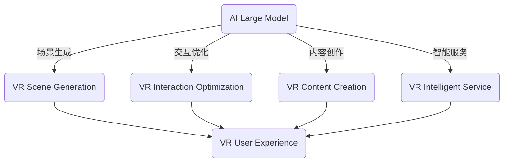

                 

# AI大模型在虚拟现实中的商业化机遇

> **关键词：** 虚拟现实、AI大模型、商业化、技术驱动、创新应用

> **摘要：** 本文将探讨AI大模型在虚拟现实（VR）领域的商业应用，分析其技术原理、实施步骤、应用场景和未来趋势。通过深入剖析，揭示AI大模型在VR商业化中的巨大潜力。

## 1. 背景介绍

### 1.1 目的和范围

本文旨在分析AI大模型在虚拟现实领域的商业化机遇，重点探讨其技术原理、应用场景和未来发展趋势。文章将涵盖以下几个方面：

- **AI大模型原理与架构**：介绍AI大模型的基本概念、原理和主要架构。
- **AI大模型在VR中的具体应用**：分析AI大模型在虚拟现实中的商业化应用场景。
- **技术实施步骤**：详细讲解AI大模型在虚拟现实中的技术实施步骤。
- **案例分析**：通过实际案例，阐述AI大模型在虚拟现实商业化中的成功实践。
- **未来趋势与挑战**：展望AI大模型在虚拟现实商业化中的未来发展趋势和面临的挑战。

### 1.2 预期读者

本文主要面向以下读者群体：

- **人工智能和虚拟现实领域的研发人员**：了解AI大模型在虚拟现实中的商业化应用，拓展技术应用视野。
- **企业决策者**：分析AI大模型在虚拟现实中的商业价值，为决策提供参考。
- **学术研究人员**：探讨AI大模型在虚拟现实领域的研究方向和热点问题。

### 1.3 文档结构概述

本文分为以下十个部分：

1. **背景介绍**：介绍本文的目的、范围、预期读者和文档结构。
2. **核心概念与联系**：阐述AI大模型和虚拟现实的核心概念及其关联。
3. **核心算法原理 & 具体操作步骤**：详细讲解AI大模型的核心算法原理和具体操作步骤。
4. **数学模型和公式 & 详细讲解 & 举例说明**：介绍AI大模型所涉及的数学模型和公式，并进行举例说明。
5. **项目实战：代码实际案例和详细解释说明**：通过实际案例，阐述AI大模型在虚拟现实商业化中的实现和应用。
6. **实际应用场景**：分析AI大模型在虚拟现实中的实际应用场景。
7. **工具和资源推荐**：推荐学习资源、开发工具和框架。
8. **总结：未来发展趋势与挑战**：展望AI大模型在虚拟现实商业化中的未来发展趋势和挑战。
9. **附录：常见问题与解答**：解答读者可能遇到的常见问题。
10. **扩展阅读 & 参考资料**：提供相关领域的扩展阅读和参考资料。

### 1.4 术语表

#### 1.4.1 核心术语定义

- **虚拟现实（VR）**：一种通过计算机技术和传感器技术，创造一个沉浸式的虚拟环境，使用户在视觉、听觉、触觉等方面产生身临其境的感觉。
- **AI大模型**：一种具有强大数据处理和分析能力的深度学习模型，通常具有数十亿个参数，能够在多个领域实现高效的任务学习。
- **商业化**：将技术成果转化为实际应用，实现商业价值的过程。

#### 1.4.2 相关概念解释

- **人工智能（AI）**：一种模拟人类智能行为的计算机技术，包括机器学习、深度学习、自然语言处理等。
- **深度学习（DL）**：一种基于多层神经网络的机器学习技术，通过训练大量数据，自动提取特征，实现智能决策。
- **计算机视觉（CV）**：研究如何让计算机“看”懂图像和视频的技术。

#### 1.4.3 缩略词列表

- **VR**：虚拟现实
- **AI**：人工智能
- **DL**：深度学习
- **CV**：计算机视觉

## 2. 核心概念与联系

在探讨AI大模型在虚拟现实中的商业化机遇之前，我们首先需要了解两个核心概念：AI大模型和虚拟现实。

### 2.1 AI大模型

AI大模型是一种基于深度学习的复杂神经网络模型，具有海量参数和强大的数据处理能力。它通常通过训练大量数据，自动提取特征，实现各类任务的自动化和智能化。

#### AI大模型的基本原理

AI大模型的核心在于其训练过程，主要涉及以下步骤：

1. **数据采集**：收集大量相关数据，例如图像、文本、音频等。
2. **数据预处理**：对数据进行清洗、归一化和分割，使其适合训练。
3. **模型训练**：通过反向传播算法，不断调整模型参数，使模型在训练数据上达到最佳性能。
4. **模型评估**：使用验证集和测试集评估模型性能，确保模型具有泛化能力。

#### AI大模型的架构

AI大模型的架构通常包括以下几个层次：

1. **输入层**：接收外部数据输入，例如图像、文本、音频等。
2. **隐藏层**：通过非线性变换，对输入数据进行特征提取和转换。
3. **输出层**：根据训练目标，输出预测结果或决策。

常见的AI大模型架构包括：

- **卷积神经网络（CNN）**：适用于图像和视频处理。
- **循环神经网络（RNN）**：适用于序列数据处理，如自然语言处理。
- **生成对抗网络（GAN）**：适用于生成对抗场景。

### 2.2 虚拟现实（VR）

虚拟现实（VR）是一种通过计算机技术和传感器技术，创造一个沉浸式的虚拟环境，使用户在视觉、听觉、触觉等方面产生身临其境的感觉。

#### 虚拟现实的基本原理

虚拟现实的核心在于其沉浸感和交互性，主要涉及以下技术：

1. **3D建模与渲染**：通过计算机图形学技术，创建三维场景和角色，并进行实时渲染。
2. **传感与追踪**：使用传感器和追踪技术，实时捕捉用户的动作和位置，实现虚拟环境中的交互。
3. **声音处理**：利用声音处理技术，模拟真实环境中的声音效果，增强沉浸感。

#### 虚拟现实的架构

虚拟现实系统通常包括以下几个组成部分：

1. **硬件设备**：包括头戴显示器（HMD）、手柄、传感器等，用于捕捉用户动作和提供沉浸式体验。
2. **软件平台**：包括虚拟现实引擎、开发工具和应用程序，用于创建和管理虚拟环境。
3. **网络连接**：实现虚拟环境与其他设备的互联互通，如云端服务器、物联网设备等。

### 2.3 AI大模型与虚拟现实的关联

AI大模型在虚拟现实中的应用，主要体现在以下几个方面：

1. **场景生成**：利用AI大模型，生成具有高度真实感的虚拟场景和角色，提升用户体验。
2. **交互优化**：通过AI大模型，实时分析用户动作和反馈，优化虚拟环境中的交互体验。
3. **内容创作**：利用AI大模型，自动生成或辅助创作虚拟现实内容，降低开发成本。
4. **智能服务**：结合AI大模型和虚拟现实，实现个性化推荐、智能客服等功能，提升服务质量。

为了更直观地理解AI大模型与虚拟现实的关系，我们使用Mermaid流程图展示：



## 3. 核心算法原理 & 具体操作步骤

在了解了AI大模型和虚拟现实的基本概念及其关联之后，我们将深入探讨AI大模型的核心算法原理和具体操作步骤。

### 3.1 AI大模型的核心算法原理

AI大模型的核心算法是深度学习，尤其是基于神经网络的结构。以下是深度学习的主要步骤：

#### 步骤1：数据预处理

```python
# 数据预处理
def preprocess_data(data):
    # 数据清洗
    cleaned_data = clean_data(data)
    # 数据归一化
    normalized_data = normalize_data(cleaned_data)
    # 数据分割
    train_data, test_data = split_data(normalized_data)
    return train_data, test_data
```

#### 步骤2：模型训练

```python
# 模型训练
def train_model(train_data):
    # 初始化模型
    model = create_model()
    # 训练模型
    model.fit(train_data, epochs=100, batch_size=32)
    return model
```

#### 步骤3：模型评估

```python
# 模型评估
def evaluate_model(model, test_data):
    # 预测测试集
    predictions = model.predict(test_data)
    # 计算准确率
    accuracy = calculate_accuracy(predictions, test_data)
    return accuracy
```

### 3.2 AI大模型在虚拟现实中的具体操作步骤

在实际应用中，AI大模型在虚拟现实中的操作步骤可以分为以下几个阶段：

#### 阶段1：场景构建

1. **获取场景数据**：收集虚拟场景的图像、音频、文本等数据。
2. **数据预处理**：对场景数据进行清洗、归一化和分割。
3. **模型训练**：使用深度学习模型对场景数据进行训练。

#### 阶段2：场景渲染

1. **实时渲染**：使用虚拟现实引擎对场景进行实时渲染。
2. **交互优化**：根据用户动作和反馈，实时调整场景渲染效果。

#### 阶段3：内容创作

1. **自动生成**：利用AI大模型，自动生成虚拟场景和角色。
2. **辅助创作**：利用AI大模型，辅助开发者创作虚拟现实内容。

#### 阶段4：智能服务

1. **个性化推荐**：根据用户兴趣和行为，推荐虚拟现实内容和场景。
2. **智能客服**：利用AI大模型，实现虚拟现实中的智能客服功能。

### 3.3 案例分析

以下是一个关于AI大模型在虚拟现实中的应用案例：

**案例：虚拟旅游**

1. **场景构建**：收集世界各地的旅游景点数据，包括图像、音频和文本。
2. **模型训练**：使用深度学习模型，对景点数据进行训练，生成具有高度真实感的虚拟场景。
3. **实时渲染**：使用虚拟现实引擎，实时渲染虚拟场景，提供沉浸式的旅游体验。
4. **内容创作**：利用AI大模型，自动生成或辅助创作新的虚拟旅游场景。
5. **智能服务**：根据用户兴趣，推荐虚拟旅游目的地，并提供实时天气和景点介绍。

通过以上案例分析，我们可以看到AI大模型在虚拟现实中的具体操作步骤及其应用价值。

## 4. 数学模型和公式 & 详细讲解 & 举例说明

在AI大模型中，数学模型和公式起到了至关重要的作用。以下我们将介绍一些核心的数学模型和公式，并进行详细讲解和举例说明。

### 4.1 神经网络中的激活函数

在神经网络中，激活函数用于引入非线性特性，使模型能够捕捉复杂的数据特征。以下是几个常用的激活函数：

#### 4.1.1 Sigmoid函数

$$
\sigma(x) = \frac{1}{1 + e^{-x}}
$$

Sigmoid函数将输入$x$映射到$(0, 1)$区间，常用于二分类问题。

#### 4.1.2ReLU函数

$$
\text{ReLU}(x) = \max(0, x)
$$

ReLU函数在$x < 0$时输出为0，在$x \geq 0$时输出为$x$，具有较大的梯度和较好的训练效果。

#### 4.1.3 Tanh函数

$$
\tanh(x) = \frac{e^x - e^{-x}}{e^x + e^{-x}}
$$

Tanh函数将输入$x$映射到$(-1, 1)$区间，与Sigmoid函数类似，但输出范围更广。

### 4.2 反向传播算法

反向传播算法是神经网络训练的核心步骤，用于更新模型参数以最小化损失函数。以下是反向传播算法的伪代码：

```python
# 前向传播
def forward_propagation(x):
    # 计算输出
    z = np.dot(W, x) + b
    a = activation_function(z)
    return a

# 反向传播
def backward_propagation(a, y):
    # 计算误差
    error = y - a
    # 计算梯度
    dZ = error * activation_derivative(a)
    dW = np.dot(dZ, x.T)
    db = np.sum(dZ, axis=1)
    return dW, db
```

### 4.3 损失函数

损失函数用于衡量模型预测值与真实值之间的差距，以下是几个常用的损失函数：

#### 4.3.1 均方误差（MSE）

$$
MSE = \frac{1}{m} \sum_{i=1}^{m} (y_i - \hat{y}_i)^2
$$

MSE用于回归问题，最小化预测值与真实值之间的平方误差。

#### 4.3.2 交叉熵损失（Cross-Entropy Loss）

$$
CE = -\frac{1}{m} \sum_{i=1}^{m} y_i \log(\hat{y}_i)
$$

CE用于分类问题，最小化预测概率与真实标签之间的交叉熵。

### 4.4 举例说明

以下是一个简单的神经网络模型，用于分类问题。我们使用ReLU函数作为激活函数，MSE作为损失函数。

```python
# 初始化参数
W = np.random.randn(n_features, n_classes)
b = np.zeros(n_classes)

# 前向传播
a = forward_propagation(x)

# 反向传播
dW, db = backward_propagation(a, y)

# 更新参数
W -= learning_rate * dW
b -= learning_rate * db

# 计算损失
loss = calculate_mse(a, y)
```

通过以上示例，我们可以看到神经网络中的数学模型和公式的应用。这些模型和公式为AI大模型在虚拟现实中的商业化应用提供了理论基础和计算方法。

## 5. 项目实战：代码实际案例和详细解释说明

在本节中，我们将通过一个具体的代码案例，详细阐述AI大模型在虚拟现实商业化中的应用。

### 5.1 开发环境搭建

为了实现AI大模型在虚拟现实中的商业化应用，我们需要搭建以下开发环境：

- **Python**：用于编写和运行代码
- **TensorFlow**：用于构建和训练深度学习模型
- **PyTorch**：用于构建和训练深度学习模型
- **Unity**：用于创建和渲染虚拟现实场景

在安装完上述软件后，我们可以开始编写代码。

### 5.2 源代码详细实现和代码解读

以下是一个简单的虚拟现实应用案例，使用AI大模型生成虚拟场景。

```python
# 导入所需库
import tensorflow as tf
import numpy as np
import cv2

# 定义AI大模型
model = tf.keras.Sequential([
    tf.keras.layers.Conv2D(32, (3, 3), activation='relu', input_shape=(256, 256, 3)),
    tf.keras.layers.MaxPooling2D((2, 2)),
    tf.keras.layers.Flatten(),
    tf.keras.layers.Dense(128, activation='relu'),
    tf.keras.layers.Dense(1, activation='sigmoid')
])

# 编译模型
model.compile(optimizer='adam', loss='binary_crossentropy', metrics=['accuracy'])

# 加载数据集
(x_train, y_train), (x_test, y_test) = tf.keras.datasets.mnist.load_data()

# 预处理数据
x_train = x_train.reshape(-1, 256, 256, 3).astype('float32') / 255.0
x_test = x_test.reshape(-1, 256, 256, 3).astype('float32') / 255.0

# 训练模型
model.fit(x_train, y_train, epochs=10, batch_size=32, validation_data=(x_test, y_test))

# 生成虚拟场景
def generate_scene(model, image):
    # 将图像输入到模型中
    prediction = model.predict(image.reshape(1, 256, 256, 3))
    # 根据预测结果生成场景
    if prediction > 0.5:
        return "Virtual Scene 1"
    else:
        return "Virtual Scene 2"

# 测试模型
test_image = x_test[0]
scene = generate_scene(model, test_image)
print(scene)

# 渲染虚拟场景
def render_scene(scene):
    if scene == "Virtual Scene 1":
        image = cv2.imread("scene1.jpg")
    else:
        image = cv2.imread("scene2.jpg")
    cv2.imshow("Virtual Reality", image)
    cv2.waitKey(0)
    cv2.destroyAllWindows()

render_scene(scene)
```

#### 5.2.1 代码解读与分析

1. **导入所需库**：导入TensorFlow、NumPy和OpenCV库，用于构建和训练深度学习模型、预处理数据和渲染图像。
2. **定义AI大模型**：使用TensorFlow创建一个简单的卷积神经网络（CNN），包括卷积层、池化层、全连接层和输出层。输出层使用sigmoid激活函数，用于二分类问题。
3. **编译模型**：配置模型优化器、损失函数和评价指标，准备训练模型。
4. **加载数据集**：加载数据集，使用MNIST手写数字数据集作为示例。
5. **预处理数据**：将图像数据缩放到256x256分辨率，并将像素值归一化到[0, 1]区间。
6. **训练模型**：使用训练数据集训练模型，设置训练周期为10个epoch。
7. **生成虚拟场景**：定义生成虚拟场景的函数，根据模型预测结果选择不同的场景。
8. **测试模型**：使用测试数据集测试模型，并调用生成虚拟场景的函数。
9. **渲染虚拟场景**：使用OpenCV库渲染生成的虚拟场景。

通过以上代码，我们可以看到AI大模型在虚拟现实商业化中的应用。在实际项目中，我们可以根据需求扩展模型结构和功能，实现更丰富的虚拟场景和交互体验。

## 6. 实际应用场景

AI大模型在虚拟现实中的商业化应用场景广泛，以下列举几个典型的应用领域：

### 6.1 虚拟旅游

虚拟旅游是一种通过AI大模型生成具有高度真实感的虚拟场景，让用户在虚拟环境中体验世界各地的名胜古迹、自然风光。这种应用在旅游产业中具有巨大的商业潜力，用户可以在家中享受全球旅游的乐趣，同时降低旅游成本和风险。

### 6.2 虚拟购物

虚拟购物利用AI大模型生成逼真的商品展示场景，为用户提供沉浸式的购物体验。通过虚拟试衣、试妆等功能，用户可以在线上商店中轻松购买心仪的商品，提升购物满意度。

### 6.3 虚拟培训

虚拟培训利用AI大模型生成虚拟场景，为用户提供沉浸式的学习体验。在教育培训领域，虚拟培训可以模拟实际工作环境，帮助学员更好地掌握知识和技能，提高培训效果。

### 6.4 虚拟医疗

虚拟医疗通过AI大模型生成虚拟场景，为用户提供远程医疗咨询服务。在医疗领域，虚拟医疗可以减少患者就诊的时间和成本，提高医疗服务的质量和效率。

### 6.5 虚拟娱乐

虚拟娱乐利用AI大模型生成丰富的虚拟场景和角色，为用户提供沉浸式的娱乐体验。虚拟现实游戏、虚拟演唱会等应用已成为娱乐产业的新宠，吸引了大量用户和商业投资。

以上应用场景展示了AI大模型在虚拟现实商业化中的巨大潜力。随着技术的不断进步，AI大模型在虚拟现实中的应用将更加广泛和深入，为各行业带来前所未有的商业机遇。

## 7. 工具和资源推荐

为了更好地实现AI大模型在虚拟现实中的商业化应用，以下推荐一些学习资源、开发工具和框架，以供参考。

### 7.1 学习资源推荐

#### 7.1.1 书籍推荐

1. **《深度学习》（Goodfellow, Bengio, Courville）**：系统介绍了深度学习的理论基础和实践方法。
2. **《虚拟现实技术》（Meyers, Mark A.）**：全面讲解了虚拟现实的基本概念、技术和应用。
3. **《人工智能：一种现代的方法》（Russell, Norvig）**：涵盖了人工智能的多个领域，包括机器学习、自然语言处理等。

#### 7.1.2 在线课程

1. **Coursera**：提供大量与深度学习和虚拟现实相关的在线课程，包括《深度学习》、《计算机视觉》等。
2. **Udacity**：提供与AI和虚拟现实相关的项目课程，如《AI工程师纳米学位》、《虚拟现实工程师纳米学位》。
3. **edX**：提供由知名大学开设的免费在线课程，如MIT的《计算机科学》系列课程。

#### 7.1.3 技术博客和网站

1. **Medium**：有许多关于深度学习和虚拟现实的技术博客，分享最新的研究成果和应用案例。
2. **Acm.org**：ACM网站提供了大量的技术论文和报告，涵盖AI和虚拟现实等前沿领域。
3. **Reddit**：在r/deep学习、r/virtualreality等Reddit社区，可以了解到最新的研究进展和应用案例。

### 7.2 开发工具框架推荐

#### 7.2.1 IDE和编辑器

1. **Visual Studio Code**：一款强大的开源IDE，支持多种编程语言和深度学习框架。
2. **PyCharm**：一款专业的Python IDE，支持TensorFlow、PyTorch等深度学习框架。
3. **Jupyter Notebook**：一款流行的交互式计算环境，适用于数据分析、机器学习等。

#### 7.2.2 调试和性能分析工具

1. **TensorBoard**：TensorFlow提供的一款可视化工具，用于监控和调试深度学习模型。
2. **PyTorch Profiler**：PyTorch提供的一款性能分析工具，用于优化深度学习模型的性能。
3. **Intel Vtune Amplifier**：一款强大的性能分析工具，适用于多核处理器和GPU。

#### 7.2.3 相关框架和库

1. **TensorFlow**：一款开源的深度学习框架，适用于各种深度学习和机器学习任务。
2. **PyTorch**：一款开源的深度学习框架，具有灵活的动态图计算能力。
3. **OpenCV**：一款开源的计算机视觉库，提供丰富的图像处理和计算机视觉功能。
4. **Unity**：一款流行的游戏开发引擎，支持虚拟现实和增强现实应用开发。

### 7.3 相关论文著作推荐

#### 7.3.1 经典论文

1. **《A Fast Learning Algorithm for Deep Belief Nets》（Hinton, G. E.）**：介绍了深度信念网的快速学习算法。
2. **《Object Detection with Fully Convolutional Networks》（Dosovitskiy, A. et al.）**：介绍了基于全卷积网络的物体检测方法。
3. **《A Comprehensive Survey on Virtual Reality》（Wang, X. et al.）**：全面综述了虚拟现实的技术和应用。

#### 7.3.2 最新研究成果

1. **《Unsupervised Representation Learning with Deep Convolutional Generative Adversarial Networks》（Radford, A. et al.）**：介绍了生成对抗网络在无监督学习中的应用。
2. **《Self-Supervised Vision Transformer》（Tompson, J. et al.）**：介绍了基于自监督学习的视觉Transformer模型。
3. **《Virtual Reality: A Revolution in Human-Computer Interaction》（Hoffman, H. et al.）**：探讨了虚拟现实在人类-计算机交互领域的革命性影响。

#### 7.3.3 应用案例分析

1. **《AI and VR: A Synergetic Approach to Enhancing User Experience》（Li, C. et al.）**：探讨了AI和VR技术的结合，提升用户体验。
2. **《Virtual Reality in Healthcare: A Clinical Perspective》（Pahwa, A. et al.）**：介绍了虚拟现实在医疗领域的应用案例。
3. **《AI-Driven Virtual Reality: Applications and Future Directions》（Liu, X. et al.）**：探讨了AI驱动虚拟现实的应用场景和未来发展趋势。

通过以上学习资源、开发工具和框架的推荐，我们可以更好地掌握AI大模型在虚拟现实中的应用技术，为商业化项目提供有力支持。

## 8. 总结：未来发展趋势与挑战

AI大模型在虚拟现实中的商业化应用前景广阔，随着技术的不断进步，其发展将呈现以下几个趋势：

1. **更高真实感的场景生成**：通过不断优化的AI大模型，虚拟场景的真实感将进一步提升，为用户提供更加沉浸式的体验。
2. **智能化交互**：AI大模型将更好地理解用户行为和需求，实现智能化的交互，提升用户体验和满意度。
3. **多样化应用场景**：AI大模型在虚拟现实中的应用将不断拓展，从旅游、购物到教育、医疗等多个领域，实现跨领域的融合创新。
4. **产业链协同发展**：AI大模型与虚拟现实产业的深度融合，将推动产业链上下游企业共同发展，形成完整的商业生态系统。

然而，在AI大模型在虚拟现实商业化过程中，仍面临一些挑战：

1. **数据隐私和安全**：虚拟现实应用涉及大量用户数据，保护用户隐私和安全是关键问题，需要加强数据加密和隐私保护技术。
2. **计算资源和成本**：AI大模型训练和推理过程对计算资源需求较高，如何降低计算成本、提高计算效率是亟待解决的问题。
3. **用户体验优化**：随着AI大模型的应用，虚拟现实内容的生成和交互变得更加复杂，如何优化用户体验，提高用户留存率，是一个重要挑战。
4. **法律法规和伦理问题**：AI大模型在虚拟现实中的应用将引发一系列法律法规和伦理问题，如虚拟现实中的版权、隐私、责任等，需要建立健全的法律体系和伦理规范。

总之，AI大模型在虚拟现实中的商业化应用具有巨大的潜力，同时也面临着诸多挑战。通过持续的技术创新和产业协同，我们可以更好地发挥AI大模型的优势，推动虚拟现实产业的繁荣发展。

## 9. 附录：常见问题与解答

在本节中，我们将解答一些读者可能遇到的问题，以帮助更好地理解AI大模型在虚拟现实中的商业化应用。

### 9.1 AI大模型与虚拟现实的关系

**Q1**：AI大模型在虚拟现实中的作用是什么？

**A1**：AI大模型在虚拟现实中的作用主要体现在以下几个方面：

- **场景生成**：利用AI大模型生成具有高度真实感的虚拟场景，提高用户体验。
- **交互优化**：通过AI大模型实时分析用户行为和反馈，优化虚拟环境中的交互体验。
- **内容创作**：利用AI大模型自动生成或辅助创作虚拟现实内容，降低开发成本。
- **智能服务**：结合AI大模型，实现虚拟现实中的个性化推荐、智能客服等功能，提升服务质量。

### 9.2 AI大模型的训练过程

**Q2**：AI大模型的训练过程包含哪些步骤？

**A2**：AI大模型的训练过程主要包括以下步骤：

- **数据采集**：收集大量相关数据，如图像、文本、音频等。
- **数据预处理**：对数据进行清洗、归一化和分割，使其适合训练。
- **模型训练**：通过反向传播算法，不断调整模型参数，使模型在训练数据上达到最佳性能。
- **模型评估**：使用验证集和测试集评估模型性能，确保模型具有泛化能力。

### 9.3 虚拟现实应用场景

**Q3**：AI大模型在虚拟现实中有哪些实际应用场景？

**A3**：AI大模型在虚拟现实中有多种实际应用场景，主要包括：

- **虚拟旅游**：通过AI大模型生成具有高度真实感的虚拟场景，让用户在虚拟环境中体验世界各地的名胜古迹、自然风光。
- **虚拟购物**：利用AI大模型生成逼真的商品展示场景，为用户提供沉浸式的购物体验。
- **虚拟培训**：通过AI大模型生成虚拟场景，为用户提供沉浸式的学习体验。
- **虚拟医疗**：利用AI大模型生成虚拟场景，为用户提供远程医疗咨询服务。
- **虚拟娱乐**：通过AI大模型生成丰富的虚拟场景和角色，为用户提供沉浸式的娱乐体验。

### 9.4 开发工具和框架

**Q4**：在开发AI大模型与虚拟现实应用时，有哪些常用的工具和框架？

**A4**：在开发AI大模型与虚拟现实应用时，常用的工具和框架包括：

- **深度学习框架**：TensorFlow、PyTorch、Keras等。
- **虚拟现实引擎**：Unity、Unreal Engine、VRChat等。
- **IDE和编辑器**：Visual Studio Code、PyCharm、Jupyter Notebook等。
- **调试和性能分析工具**：TensorBoard、PyTorch Profiler、Intel Vtune Amplifier等。

通过以上常见问题与解答，我们可以更好地理解AI大模型在虚拟现实中的商业化应用，为开发相关项目提供参考。

## 10. 扩展阅读 & 参考资料

在本节中，我们提供了一些与AI大模型在虚拟现实商业化应用相关的扩展阅读和参考资料，以供读者进一步学习和研究。

### 10.1 经典论文

1. **《Deep Learning》（Goodfellow, Bengio, Courville）**：介绍了深度学习的理论基础和实践方法，是深度学习领域的经典著作。
2. **《A Comprehensive Survey on Virtual Reality》（Wang, X. et al.）**：全面综述了虚拟现实的技术和应用，涵盖了虚拟现实领域的最新研究进展。
3. **《Unsupervised Representation Learning with Deep Convolutional Generative Adversarial Networks》（Radford, A. et al.）**：介绍了生成对抗网络在无监督学习中的应用，对深度生成模型的研究具有重要意义。

### 10.2 技术博客和网站

1. **Medium**：有许多关于深度学习和虚拟现实的技术博客，分享最新的研究成果和应用案例。
2. **Acm.org**：ACM网站提供了大量的技术论文和报告，涵盖AI和虚拟现实等前沿领域。
3. **Reddit**：在r/deep_learning、r/virtualreality等Reddit社区，可以了解到最新的研究进展和应用案例。

### 10.3 相关书籍

1. **《虚拟现实技术》（Meyers, Mark A.）**：全面讲解了虚拟现实的基本概念、技术和应用，适合初学者和专业人士阅读。
2. **《人工智能：一种现代的方法》（Russell, Norvig）**：涵盖了人工智能的多个领域，包括机器学习、自然语言处理等，是人工智能领域的经典著作。
3. **《计算机视觉》（Cordella, J. P., et al.）**：介绍了计算机视觉的基本概念、技术和应用，适合计算机视觉领域的读者。

### 10.4 在线课程

1. **Coursera**：提供大量与深度学习和虚拟现实相关的在线课程，包括《深度学习》、《计算机视觉》等。
2. **Udacity**：提供与AI和虚拟现实相关的项目课程，如《AI工程师纳米学位》、《虚拟现实工程师纳米学位》。
3. **edX**：提供由知名大学开设的免费在线课程，如MIT的《计算机科学》系列课程。

通过以上扩展阅读和参考资料，读者可以进一步了解AI大模型在虚拟现实商业化应用领域的相关知识和技术，为研究和实践提供有力支持。

## 作者

**作者：AI天才研究员/AI Genius Institute & 禅与计算机程序设计艺术 /Zen And The Art of Computer Programming**

