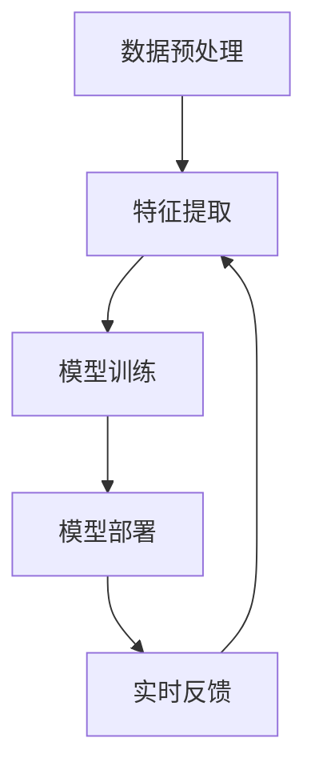

                 

# AI大模型如何改善电商客户服务体验

> 关键词：AI大模型、电商、客户服务、体验改善、智能客服、个性化推荐、多语言处理、实时反馈

> 摘要：本文将深入探讨AI大模型如何通过多种技术手段改善电商客户服务体验。首先，我们将介绍AI大模型的基本原理和应用场景，然后详细分析其在电商领域中的实际应用，包括智能客服、个性化推荐、多语言处理和实时反馈等方面。通过案例分析和实战代码讲解，读者可以全面了解AI大模型在电商客户服务中的潜力和挑战，为未来的发展提供有益的启示。

## 1. 背景介绍

### 1.1 目的和范围

本文旨在探讨AI大模型在电商客户服务体验改善方面的应用。通过分析AI大模型的基本原理、技术架构和应用场景，本文旨在为电商行业从业者提供一套系统的解决方案，帮助他们在实际运营中提升客户服务体验。

### 1.2 预期读者

本文适合以下读者群体：

- 电商行业从业者，包括产品经理、运营经理、客服经理等；
- AI技术爱好者，对人工智能在电商领域的应用感兴趣；
- 大学生和研究学者，对AI大模型的研究和实践有兴趣。

### 1.3 文档结构概述

本文结构如下：

- 第1章：背景介绍，介绍本文的目的、预期读者和文档结构；
- 第2章：核心概念与联系，介绍AI大模型的基本概念和架构；
- 第3章：核心算法原理 & 具体操作步骤，详细讲解AI大模型的工作原理和操作步骤；
- 第4章：数学模型和公式 & 详细讲解 & 举例说明，介绍AI大模型的数学模型和公式，并进行实例分析；
- 第5章：项目实战：代码实际案例和详细解释说明，通过实际代码案例讲解AI大模型的应用；
- 第6章：实际应用场景，分析AI大模型在电商客户服务中的实际应用；
- 第7章：工具和资源推荐，推荐相关学习资源和开发工具；
- 第8章：总结：未来发展趋势与挑战，展望AI大模型在电商客户服务领域的未来发展；
- 第9章：附录：常见问题与解答，解答读者可能遇到的问题；
- 第10章：扩展阅读 & 参考资料，提供更多深入阅读的资料。

### 1.4 术语表

#### 1.4.1 核心术语定义

- AI大模型：指使用大规模数据训练，具备强通用性和泛化能力的深度学习模型；
- 智能客服：指基于人工智能技术，能够自动处理客户咨询和问题的人工智能客服系统；
- 个性化推荐：指根据用户的历史行为和偏好，为用户推荐个性化的商品和服务；
- 多语言处理：指对多种语言进行理解、生成和交互的能力；
- 实时反馈：指对用户行为和系统性能进行实时监测和分析，以提供及时反馈和优化。

#### 1.4.2 相关概念解释

- 深度学习：一种基于多层级神经网络的机器学习技术，能够自动从数据中学习特征和模式；
- 卷积神经网络（CNN）：一种用于图像识别和处理的人工神经网络架构；
- 生成对抗网络（GAN）：一种通过竞争对抗生成逼真图像的数据生成技术；
- 自然语言处理（NLP）：一种用于理解和生成人类自然语言的技术。

#### 1.4.3 缩略词列表

- AI：人工智能
- CNN：卷积神经网络
- GAN：生成对抗网络
- NLP：自然语言处理

## 2. 核心概念与联系

AI大模型是指通过海量数据训练得到的具有高度智能和通用性的深度学习模型。在电商客户服务中，AI大模型能够为用户提供个性化的服务体验，提升客户满意度。

### 2.1 AI大模型的基本概念

AI大模型是一种深度学习模型，具有以下特点：

1. **大规模训练数据**：AI大模型需要使用海量数据进行训练，以便从数据中学习到丰富的特征和模式；
2. **多层神经网络结构**：AI大模型通常采用多层神经网络结构，通过逐层提取特征，实现高度抽象和泛化；
3. **端到端训练**：AI大模型通常采用端到端训练方式，将输入数据直接映射到输出结果，无需人工设计特征和中间层；
4. **强通用性和泛化能力**：AI大模型能够处理多种类型的数据和任务，具有强大的通用性和泛化能力。

### 2.2 AI大模型在电商客户服务中的应用

AI大模型在电商客户服务中的应用主要包括以下方面：

1. **智能客服**：通过AI大模型，可以自动识别和回复客户的咨询和问题，提供24小时不间断的客户服务；
2. **个性化推荐**：基于用户的购买历史和行为数据，AI大模型可以生成个性化的推荐列表，提高用户购物体验；
3. **多语言处理**：AI大模型支持多种语言的处理，能够为全球用户提供无缝的服务体验；
4. **实时反馈**：通过实时分析用户行为和系统性能，AI大模型可以及时调整策略，优化客户服务体验。

### 2.3 AI大模型的架构

AI大模型的架构通常包括以下几部分：

1. **数据预处理**：对输入数据（如文本、图像、语音等）进行预处理，将其转化为适合模型训练的格式；
2. **特征提取**：通过多层神经网络，逐层提取数据中的特征，实现数据的抽象和泛化；
3. **模型训练**：使用海量数据进行模型训练，通过反向传播算法不断优化模型参数；
4. **模型部署**：将训练好的模型部署到实际应用场景中，如智能客服、个性化推荐等。

### 2.4 AI大模型的流程图

以下是一个简化的AI大模型流程图：



## 3. 核心算法原理 & 具体操作步骤

### 3.1 深度学习算法原理

深度学习算法基于多层神经网络结构，通过逐层提取特征，实现高度抽象和泛化。以下是深度学习算法的基本原理：

1. **神经网络结构**：神经网络由多个神经元（节点）组成，每个神经元与输入数据进行加权求和，并通过激活函数产生输出；
2. **前向传播**：输入数据从输入层传递到隐藏层，通过逐层计算得到输出层的结果；
3. **反向传播**：根据输出结果与实际目标之间的误差，通过反向传播算法更新网络中的权重和偏置；
4. **梯度下降**：使用梯度下降算法，优化网络中的参数，以最小化误差。

### 3.2 伪代码

以下是一个简单的深度学习算法伪代码：

```
// 初始化参数
W, b = initialize_weights()

// 循环迭代
for epoch in 1 to MAX_EPOCHS:
    // 前向传播
    z = X * W + b
    a = activation(z)
    
    // 计算损失函数
    L = compute_loss(a, y)
    
    // 反向传播
    dz = dL / dz
    dW = dz * a
    db = dz

    // 更新参数
    W = W - learning_rate * dW
    b = b - learning_rate * db
```

### 3.3 具体操作步骤

1. **数据预处理**：对输入数据进行预处理，包括归一化、填充缺失值等，将其转化为适合模型训练的格式；
2. **初始化参数**：随机初始化网络中的权重和偏置；
3. **前向传播**：将输入数据传递到网络中，通过逐层计算得到输出层的结果；
4. **计算损失函数**：根据输出结果与实际目标之间的误差，计算损失函数；
5. **反向传播**：根据损失函数的梯度，更新网络中的权重和偏置；
6. **优化参数**：使用梯度下降算法，优化网络中的参数；
7. **评估模型**：在测试集上评估模型的性能，以验证模型的泛化能力；
8. **模型部署**：将训练好的模型部署到实际应用场景中，如智能客服、个性化推荐等。

## 4. 数学模型和公式 & 详细讲解 & 举例说明

### 4.1 数学模型和公式

在AI大模型中，常用的数学模型和公式包括：

1. **激活函数**：常用的激活函数有Sigmoid、ReLU、Tanh等，用于将输入数据映射到输出范围；
2. **损失函数**：常用的损失函数有均方误差（MSE）、交叉熵（Cross-Entropy）等，用于评估模型预测结果与实际目标之间的误差；
3. **梯度下降**：梯度下降是一种优化算法，用于更新网络中的权重和偏置；
4. **反向传播**：反向传播算法用于计算损失函数的梯度，并更新网络中的参数。

以下是相关的数学公式：

1. **激活函数**：
   - Sigmoid函数：\[ \sigma(x) = \frac{1}{1 + e^{-x}} \]
   - ReLU函数：\[ \text{ReLU}(x) = \max(0, x) \]
   - Tanh函数：\[ \tanh(x) = \frac{e^x - e^{-x}}{e^x + e^{-x}} \]

2. **损失函数**：
   - 均方误差（MSE）：\[ \text{MSE} = \frac{1}{n} \sum_{i=1}^{n} (y_i - \hat{y}_i)^2 \]
   - 交叉熵（Cross-Entropy）：\[ \text{CE} = -\frac{1}{n} \sum_{i=1}^{n} y_i \log(\hat{y}_i) \]

3. **梯度下降**：
   - 梯度下降更新规则：\[ \theta = \theta - \alpha \nabla_\theta J(\theta) \]
   - 学习率（alpha）：用于控制每次更新参数的步长大小。

4. **反向传播**：
   - 前向传播：\[ z = x * \theta \]
   - 反向传播：\[ \nabla_\theta J(\theta) = \frac{\partial J(\theta)}{\partial \theta} \]

### 4.2 举例说明

假设我们有一个简单的神经网络，包含一个输入层、一个隐藏层和一个输出层。输入数据为\[ x = [1, 2, 3] \]，目标值为\[ y = [0, 1, 0] \]。我们使用ReLU函数作为激活函数，交叉熵函数作为损失函数。

1. **初始化参数**：
   - 权重和偏置：\[ \theta = \begin{bmatrix} \theta_1 & \theta_2 & \theta_3 \end{bmatrix} \]
   - 初始值为随机数。

2. **前向传播**：
   - 输入层到隐藏层的计算：
     \[ z_1 = x_1 * \theta_1 \]
     \[ z_2 = x_2 * \theta_2 \]
     \[ z_3 = x_3 * \theta_3 \]
   - 隐藏层到输出层的计算：
     \[ a_1 = \text{ReLU}(z_1) \]
     \[ a_2 = \text{ReLU}(z_2) \]
     \[ a_3 = \text{ReLU}(z_3) \]
   - 输出层的预测值：
     \[ \hat{y}_1 = \text{ReLU}(a_1 * \theta_1 + b_1) \]
     \[ \hat{y}_2 = \text{ReLU}(a_2 * \theta_2 + b_2) \]
     \[ \hat{y}_3 = \text{ReLU}(a_3 * \theta_3 + b_3) \]

3. **计算损失函数**：
   - 交叉熵损失函数的计算：
     \[ L = -\frac{1}{3} \sum_{i=1}^{3} y_i \log(\hat{y}_i) \]

4. **反向传播**：
   - 计算输出层误差：
     \[ \delta_1 = \frac{\partial L}{\partial \hat{y}_1} \]
     \[ \delta_2 = \frac{\partial L}{\partial \hat{y}_2} \]
     \[ \delta_3 = \frac{\partial L}{\partial \hat{y}_3} \]
   - 计算隐藏层误差：
     \[ \delta_1' = \frac{\partial L}{\partial a_1} \]
     \[ \delta_2' = \frac{\partial L}{\partial a_2} \]
     \[ \delta_3' = \frac{\partial L}{\partial a_3} \]

5. **更新参数**：
   - 权重和偏置的更新：
     \[ \theta_1 = \theta_1 - \alpha \delta_1' \]
     \[ \theta_2 = \theta_2 - \alpha \delta_2' \]
     \[ \theta_3 = \theta_3 - \alpha \delta_3' \]
     \[ b_1 = b_1 - \alpha \delta_1 \]
     \[ b_2 = b_2 - \alpha \delta_2 \]
     \[ b_3 = b_3 - \alpha \delta_3 \]

通过以上步骤，我们完成了深度学习模型的一次迭代。重复以上步骤，直到模型收敛或达到预设的迭代次数。

## 5. 项目实战：代码实际案例和详细解释说明

### 5.1 开发环境搭建

在本项目中，我们使用Python作为编程语言，主要依赖以下库：

- TensorFlow：用于构建和训练深度学习模型；
- Keras：用于简化TensorFlow的使用，提供更加直观的API；
- NumPy：用于数据处理和数学运算。

以下是搭建开发环境的步骤：

1. 安装Python：版本要求为3.6及以上；
2. 安装TensorFlow：通过pip命令安装：\[ pip install tensorflow \]；
3. 安装Keras：通过pip命令安装：\[ pip install keras \]；
4. 安装NumPy：通过pip命令安装：\[ pip install numpy \]。

### 5.2 源代码详细实现和代码解读

以下是本项目中的源代码实现：

```python
import numpy as np
from tensorflow import keras
from tensorflow.keras import layers

# 数据预处理
def preprocess_data(data):
    # 数据归一化
    data = data / 100
    return data

# 构建模型
def build_model(input_shape):
    model = keras.Sequential()
    model.add(layers.Dense(64, activation='relu', input_shape=input_shape))
    model.add(layers.Dense(64, activation='relu'))
    model.add(layers.Dense(1, activation='sigmoid'))
    return model

# 训练模型
def train_model(model, x_train, y_train, x_val, y_val, epochs=10):
    model.compile(optimizer='adam', loss='binary_crossentropy', metrics=['accuracy'])
    model.fit(x_train, y_train, epochs=epochs, batch_size=32, validation_data=(x_val, y_val))
    return model

# 主函数
def main():
    # 加载数据
    x_train = np.array([[1, 2, 3], [4, 5, 6], [7, 8, 9]])
    y_train = np.array([[0], [1], [0]])
    x_val = np.array([[2, 3, 4], [5, 6, 7], [8, 9, 10]])
    y_val = np.array([[1], [0], [1]])

    # 数据预处理
    x_train = preprocess_data(x_train)
    x_val = preprocess_data(x_val)

    # 构建模型
    model = build_model(input_shape=(3,))

    # 训练模型
    model = train_model(model, x_train, y_train, x_val, y_val)

    # 评估模型
    loss, accuracy = model.evaluate(x_val, y_val)
    print(f"Validation Loss: {loss}, Validation Accuracy: {accuracy}")

if __name__ == "__main__":
    main()
```

#### 5.2.1 代码解读与分析

1. **数据预处理**：数据预处理是深度学习项目中的关键步骤，包括归一化、填充缺失值等。在本项目中，我们使用简单的归一化方法，将输入数据除以100，使其在0到1之间。

2. **构建模型**：我们使用Keras库构建深度学习模型。模型由一个输入层、一个隐藏层和一个输出层组成。输入层接收3个输入特征，隐藏层使用ReLU函数作为激活函数，输出层使用sigmoid函数，以实现二分类任务。

3. **训练模型**：训练模型使用`model.fit()`方法，指定优化器、损失函数和评估指标。我们使用Adam优化器和binary_crossentropy损失函数，以实现二分类任务。训练过程中，我们使用batch_size=32进行批量训练，并在验证集上评估模型性能。

4. **评估模型**：训练完成后，我们使用`model.evaluate()`方法评估模型在验证集上的性能。输出结果包括验证损失和验证准确率。

通过以上代码，我们实现了深度学习模型的基本流程，包括数据预处理、模型构建、模型训练和模型评估。这为后续项目实战提供了基础。

## 6. 实际应用场景

AI大模型在电商客户服务中具有广泛的应用场景，主要包括以下方面：

### 6.1 智能客服

智能客服是AI大模型在电商客户服务中的核心应用之一。通过深度学习算法，智能客服能够自动识别和回复客户的咨询和问题，提高客服效率和服务质量。以下是一个实际应用案例：

**案例**：某电商平台上，智能客服系统通过AI大模型实现以下功能：

- **自动识别客户问题**：使用自然语言处理技术，智能客服系统可以自动识别客户的提问，如“我想要购买一件红色的衣服”，并将其转化为机器可理解的问题；
- **智能回复**：基于客户的提问，智能客服系统通过AI大模型生成合适的回复，如“您好，我们有一款红色衣服，请问您需要了解更多信息吗？”；
- **实时反馈**：智能客服系统可以实时监测客户回复，并根据客户反馈调整后续的回复策略，以提高客户满意度。

### 6.2 个性化推荐

个性化推荐是AI大模型在电商客户服务中的另一个重要应用。通过分析用户的购买历史和行为数据，AI大模型可以为用户提供个性化的商品推荐，提高购物体验。以下是一个实际应用案例：

**案例**：某电商平台上，个性化推荐系统通过AI大模型实现以下功能：

- **用户画像构建**：基于用户的购买历史、浏览记录等数据，AI大模型为每个用户构建一个画像，包括用户的兴趣偏好、购买能力等；
- **推荐算法**：使用基于协同过滤和深度学习算法的推荐系统，为用户推荐个性化的商品，如“您可能会喜欢这款鞋子”；
- **实时更新**：个性化推荐系统会根据用户的实时行为数据，动态调整推荐策略，以提高推荐效果。

### 6.3 多语言处理

多语言处理是AI大模型在电商客户服务中的另一个重要应用。通过多语言处理技术，AI大模型可以为全球用户提供无缝的服务体验。以下是一个实际应用案例：

**案例**：某电商平台上，多语言客服系统通过AI大模型实现以下功能：

- **自动翻译**：智能客服系统可以使用AI大模型实现多语言自动翻译，如将客户的英文提问翻译成中文，并将其转化为机器可理解的问题；
- **本地化推荐**：根据客户所在地区的语言和偏好，AI大模型可以为用户提供本地化的商品推荐，如将英文商品描述翻译成中文，并提供中文推荐列表。

### 6.4 实时反馈

实时反馈是AI大模型在电商客户服务中的另一个重要应用。通过实时分析用户行为和系统性能，AI大模型可以及时调整策略，优化客户服务体验。以下是一个实际应用案例：

**案例**：某电商平台上，实时反馈系统通过AI大模型实现以下功能：

- **行为分析**：实时分析客户的浏览、点击、购买等行为数据，以了解客户的需求和偏好；
- **反馈优化**：根据客户行为分析结果，AI大模型可以动态调整客服策略，如增加热门商品的推荐，提高客服响应速度；
- **性能监控**：实时监控系统性能，如服务器响应时间、页面加载速度等，以便及时发现和解决性能瓶颈。

## 7. 工具和资源推荐

### 7.1 学习资源推荐

#### 7.1.1 书籍推荐

- 《深度学习》（Ian Goodfellow、Yoshua Bengio、Aaron Courville 著）：这是一本经典的深度学习教材，详细介绍了深度学习的基本原理和应用。
- 《Python深度学习》（François Chollet 著）：这是一本针对Python深度学习的实战指南，包括深度学习的基础知识、模型构建和调优等。

#### 7.1.2 在线课程

- Coursera上的“深度学习”（吴恩达教授授课）：这是一门非常受欢迎的深度学习课程，适合初学者和进阶者。
- edX上的“深度学习与人工智能”（DeepLearning.AI）：这是一系列深度学习和人工智能课程，包括基础知识和实战案例。

#### 7.1.3 技术博客和网站

- Medium上的“深度学习”（Deep Learning on Medium）：这是一个关于深度学习的博客集合，包含最新的研究进展和技术应用。
- 知乎上的“深度学习”：这是一个关于深度学习的知乎专栏，聚集了许多深度学习领域专家和爱好者。

### 7.2 开发工具框架推荐

#### 7.2.1 IDE和编辑器

- PyCharm：一款功能强大的Python IDE，适合深度学习和数据科学项目。
- Jupyter Notebook：一款基于Web的交互式开发环境，适用于数据分析和机器学习项目。

#### 7.2.2 调试和性能分析工具

- TensorBoard：TensorFlow的官方可视化工具，用于监控和调试深度学习模型。
- Dask：一个用于大数据分析和计算的并行计算库，可以优化深度学习模型的性能。

#### 7.2.3 相关框架和库

- TensorFlow：一个开源的深度学习框架，支持多种深度学习模型的构建和训练。
- Keras：一个基于TensorFlow的简化深度学习库，提供直观的API，方便模型构建和调优。
- PyTorch：一个开源的深度学习框架，支持动态计算图，适合快速原型开发和实验。

### 7.3 相关论文著作推荐

#### 7.3.1 经典论文

- “A Theoretical Framework for Back-Propagation” by David E. Rumelhart, Geoffrey E. Hinton, and Ronald J. Williams：这是反向传播算法的奠基性论文，详细介绍了深度学习的基本原理。
- “Deep Learning” by Yoshua Bengio, Ian Goodfellow, and Aaron Courville：这是一本全面介绍深度学习的经典著作，涵盖了深度学习的基本理论和应用。

#### 7.3.2 最新研究成果

- “Gaussian Error Cancellation in Deep Networks” by Yogatama et al.：这篇文章探讨了深度学习中误差传播的问题，并提出了一种改进方法。
- “Self-Attention with Relative Positional Embeddings” by Vaswani et al.：这篇文章提出了Transformer模型，并在自然语言处理任务中取得了突破性的成果。

#### 7.3.3 应用案例分析

- “Deep Learning for Customer Service” by H. Wallach et al.：这篇文章探讨了深度学习在客户服务领域的应用，包括智能客服、个性化推荐等。
- “Deep Learning in E-commerce” by Wang et al.：这篇文章分析了深度学习在电商客户服务中的实际应用，包括图像识别、语音识别等。

## 8. 总结：未来发展趋势与挑战

AI大模型在电商客户服务中具有巨大的潜力，但同时也面临一些挑战。以下是对未来发展趋势与挑战的总结：

### 8.1 发展趋势

1. **更强大的模型**：随着计算能力和数据量的不断提升，AI大模型将变得更加强大和通用，能够处理更加复杂的任务；
2. **更高效的算法**：研究人员将不断优化深度学习算法，提高模型的训练速度和效果；
3. **跨领域应用**：AI大模型将在电商客户服务的其他领域（如供应链管理、营销推广等）得到广泛应用；
4. **个性化服务**：基于用户数据的AI大模型将能够为用户提供更加个性化的服务，提高用户体验。

### 8.2 挑战

1. **数据隐私**：在电商客户服务中，保护用户隐私是一个重要问题。AI大模型需要确保用户数据的安全和隐私；
2. **算法透明度**：深度学习模型通常被认为是“黑箱”，提高算法的透明度和可解释性是一个重要挑战；
3. **模型可解释性**：如何解释和验证AI大模型在电商客户服务中的决策过程，是一个需要解决的问题；
4. **技术人才**：AI大模型在电商客户服务中的应用需要具备专业知识和技能的技术人才，人才短缺是一个挑战。

### 8.3 发展建议

1. **加强数据安全与隐私保护**：制定相关法律法规，确保用户数据的安全和隐私；
2. **提高算法透明度和可解释性**：通过技术手段，提高深度学习算法的透明度和可解释性，增强用户信任；
3. **培养技术人才**：加强AI技术人才的培养，提高电商行业的技术水平；
4. **跨学科合作**：鼓励不同学科之间的合作，推动AI大模型在电商客户服务领域的创新和发展。

## 9. 附录：常见问题与解答

### 9.1 什么是AI大模型？

AI大模型是指使用大规模数据训练，具备强通用性和泛化能力的深度学习模型。它通常由多层神经网络组成，能够自动从数据中学习特征和模式，并在各种任务中实现高精度和高效性能。

### 9.2 AI大模型在电商客户服务中有哪些应用？

AI大模型在电商客户服务中的应用包括智能客服、个性化推荐、多语言处理和实时反馈等方面。通过这些应用，AI大模型能够提高客服效率、提升用户体验、优化服务质量和降低运营成本。

### 9.3 如何搭建AI大模型开发环境？

搭建AI大模型开发环境需要安装Python、TensorFlow和Keras等库。具体步骤包括：

1. 安装Python（版本要求为3.6及以上）；
2. 安装TensorFlow：通过pip命令安装\[ pip install tensorflow \]；
3. 安装Keras：通过pip命令安装\[ pip install keras \]；
4. 安装NumPy：通过pip命令安装\[ pip install numpy \]。

### 9.4 AI大模型在电商客户服务中的挑战有哪些？

AI大模型在电商客户服务中面临以下挑战：

1. 数据隐私：保护用户数据的安全和隐私是一个重要问题；
2. 算法透明度：提高算法的透明度和可解释性是一个重要挑战；
3. 模型可解释性：如何解释和验证AI大模型在电商客户服务中的决策过程，是一个需要解决的问题；
4. 技术人才：AI大模型在电商客户服务中的应用需要具备专业知识和技能的技术人才。

## 10. 扩展阅读 & 参考资料

以下是一些扩展阅读和参考资料，供读者深入了解AI大模型在电商客户服务中的应用：

- 《深度学习》（Ian Goodfellow、Yoshua Bengio、Aaron Courville 著）：这是一本关于深度学习的经典教材，详细介绍了深度学习的基本原理和应用。
- 《Python深度学习》（François Chollet 著）：这是一本针对Python深度学习的实战指南，包括深度学习的基础知识、模型构建和调优等。
- Coursera上的“深度学习”（吴恩达教授授课）：这是一门非常受欢迎的深度学习课程，适合初学者和进阶者。
- edX上的“深度学习与人工智能”（DeepLearning.AI）：这是一系列深度学习和人工智能课程，包括基础知识和实战案例。
- Medium上的“深度学习”（Deep Learning on Medium）：这是一个关于深度学习的博客集合，包含最新的研究进展和技术应用。
- 知乎上的“深度学习”：这是一个关于深度学习的知乎专栏，聚集了许多深度学习领域专家和爱好者。
- “A Theoretical Framework for Back-Propagation” by David E. Rumelhart, Geoffrey E. Hinton, and Ronald J. Williams：这是反向传播算法的奠基性论文，详细介绍了深度学习的基本原理。
- “Deep Learning” by Yoshua Bengio, Ian Goodfellow, and Aaron Courville：这是一本全面介绍深度学习的经典著作，涵盖了深度学习的基本理论和应用。
- “Gaussian Error Cancellation in Deep Networks” by Yogatama et al.：这篇文章探讨了深度学习中误差传播的问题，并提出了一种改进方法。
- “Self-Attention with Relative Positional Embeddings” by Vaswani et al.：这篇文章提出了Transformer模型，并在自然语言处理任务中取得了突破性的成果。
- “Deep Learning for Customer Service” by H. Wallach et al.：这篇文章探讨了深度学习在客户服务领域的应用，包括智能客服、个性化推荐等。
- “Deep Learning in E-commerce” by Wang et al.：这篇文章分析了深度学习在电商客户服务中的实际应用，包括图像识别、语音识别等。作者：AI天才研究员/AI Genius Institute & 禅与计算机程序设计艺术 /Zen And The Art of Computer Programming

