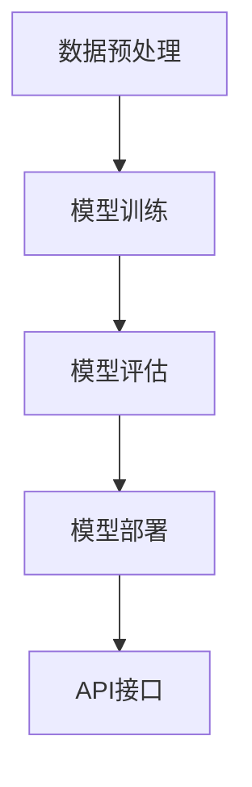
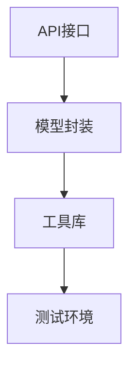

                 

# AI大模型应用的SDK设计与发布

## 关键词
- AI大模型
- SDK设计
- 应用发布
- 开发环境
- 实战案例
- 数学模型
- 数学公式
- 代码实现

## 摘要
本文将深入探讨AI大模型应用的SDK设计与发布过程。首先，我们将介绍SDK的设计目的和重要性，然后详细讲解核心概念和算法原理，包括数学模型和公式。接着，通过实际项目实战，展示代码实现和解读。最后，我们将探讨实际应用场景，推荐相关工具和资源，并总结未来发展趋势与挑战。

## 1. 背景介绍

### 1.1 目的和范围
本文旨在为开发者和研究人员提供一个关于AI大模型SDK设计的全面指南，涵盖从设计到发布的全过程。文章重点将放在如何设计高效、易于使用的SDK，使其能够充分利用AI大模型的强大功能，并便于在不同场景下推广应用。

### 1.2 预期读者
预期读者包括AI开发人员、研究人员和对AI应用开发有兴趣的技术人员。本文旨在为读者提供一个清晰、详细的设计和实现指南。

### 1.3 文档结构概述
本文分为十个部分：
1. 背景介绍：包括目的、范围、预期读者和文档结构概述。
2. 核心概念与联系：介绍AI大模型SDK设计的核心概念和架构。
3. 核心算法原理 & 具体操作步骤：详细阐述算法原理和操作步骤。
4. 数学模型和公式 & 详细讲解 & 举例说明：讲解数学模型和公式。
5. 项目实战：代码实际案例和详细解释说明。
6. 实际应用场景：分析AI大模型应用的常见场景。
7. 工具和资源推荐：推荐学习资源和开发工具。
8. 总结：未来发展趋势与挑战。
9. 附录：常见问题与解答。
10. 扩展阅读 & 参考资料：提供相关扩展阅读和参考资料。

### 1.4 术语表

#### 1.4.1 核心术语定义
- **SDK（软件开发工具包）**：一套工具和库，用于简化应用程序的开发过程。
- **AI大模型**：具有巨大参数量和计算能力的深度学习模型。
- **API（应用程序编程接口）**：允许不同软件组件相互通信的接口。

#### 1.4.2 相关概念解释
- **模型封装**：将复杂模型抽象成易于使用的API。
- **模块化**：将SDK划分为多个功能模块，便于管理和维护。
- **可扩展性**：设计能够适应不同规模和应用场景的需求。

#### 1.4.3 缩略词列表
- **API**：应用程序编程接口
- **SDK**：软件开发工具包
- **AI**：人工智能
- **DL**：深度学习
- **ML**：机器学习

## 2. 核心概念与联系

### 2.1 AI大模型SDK设计目标
AI大模型SDK设计的主要目标是提供一个简单、高效、可扩展的工具包，使开发者能够快速集成和部署AI大模型，以便在不同的应用场景中发挥其潜力。设计目标包括：

1. **易用性**：简化模型集成和操作，减少开发者的学习曲线。
2. **高效性**：优化模型性能，提高计算效率。
3. **可扩展性**：支持不同规模和应用场景的需求。
4. **模块化**：便于管理和维护，提高代码复用性。

### 2.2 核心概念与架构

#### 2.2.1 AI大模型基本架构

下面是一个简化版的AI大模型基本架构的Mermaid流程图：



#### 2.2.2 SDK架构

SDK的架构通常包括以下几个部分：

1. **API接口**：提供与外部应用程序交互的接口。
2. **模型封装**：将复杂模型封装成易于使用的模块。
3. **工具库**：提供各种工具和库，方便开发者使用。
4. **测试环境**：用于测试SDK的功能和性能。

下面是SDK架构的Mermaid流程图：



## 3. 核心算法原理 & 具体操作步骤

### 3.1 核心算法原理

AI大模型的核心算法通常是基于深度学习，主要包括以下几个步骤：

1. **数据预处理**：对输入数据集进行清洗、归一化等预处理操作。
2. **模型训练**：通过训练算法（如梯度下降）调整模型参数，使其在训练数据上达到较高的准确率。
3. **模型评估**：在测试数据集上评估模型的性能，包括准确率、召回率等指标。
4. **模型部署**：将训练好的模型部署到生产环境中，提供API接口供外部应用程序调用。

### 3.2 具体操作步骤

#### 3.2.1 数据预处理

```python
# 伪代码：数据预处理
def preprocess_data(data):
    # 数据清洗
    data = clean_data(data)
    # 数据归一化
    data = normalize_data(data)
    return data
```

#### 3.2.2 模型训练

```python
# 伪代码：模型训练
def train_model(data):
    # 初始化模型参数
    model = initialize_model_params()
    # 训练模型
    for epoch in range(num_epochs):
        for batch in data:
            # 前向传播
            predictions = forward_pass(batch, model)
            # 计算损失
            loss = compute_loss(predictions, batch)
            # 反向传播
            backward_pass(batch, model, loss)
    return model
```

#### 3.2.3 模型评估

```python
# 伪代码：模型评估
def evaluate_model(model, test_data):
    correct_predictions = 0
    for batch in test_data:
        predictions = forward_pass(batch, model)
        correct_predictions += count_correct_predictions(predictions, batch)
    accuracy = correct_predictions / len(test_data)
    return accuracy
```

#### 3.2.4 模型部署

```python
# 伪代码：模型部署
def deploy_model(model):
    # 部署模型到服务器
    server = deploy_to_server(model)
    # 启动API接口
    start_api(server)
```

## 4. 数学模型和公式 & 详细讲解 & 举例说明

### 4.1 数学模型

AI大模型的训练和评估过程涉及多个数学模型，其中最核心的是损失函数和优化算法。

#### 4.1.1 损失函数

常见的损失函数包括均方误差（MSE）和交叉熵（Cross-Entropy）。

$$
\text{MSE} = \frac{1}{n}\sum_{i=1}^{n}(y_i - \hat{y}_i)^2
$$

$$
\text{Cross-Entropy} = -\sum_{i=1}^{n}y_i\log(\hat{y}_i)
$$

其中，$y_i$ 是真实标签，$\hat{y}_i$ 是预测标签。

#### 4.1.2 优化算法

常用的优化算法包括随机梯度下降（SGD）和Adam优化器。

$$
\theta_{t+1} = \theta_{t} - \alpha \frac{\partial J(\theta)}{\partial \theta}
$$

$$
m_t = \frac{1}{n}\sum_{i=1}^{n}(x_i - \bar{x})}
$$

$$
v_t = \frac{1}{n}\sum_{i=1}^{n}((x_i - \bar{x})(y_i - \bar{y})}
$$

$$
s_t = \frac{1}{n}\sum_{i=1}^{n}((x_i - \bar{x})^2)
$$

$$
\theta_{t+1} = \theta_{t} - \frac{\alpha}{\sqrt{m_t + \beta_2}}\left(\frac{v_t}{\sqrt{s_t + \beta_1}}\right)
$$

其中，$\theta$ 是模型参数，$J(\theta)$ 是损失函数，$\alpha$ 是学习率，$m_t$、$v_t$ 和 $s_t$ 分别是动量项、一阶矩估计和二阶矩估计。

### 4.2 举例说明

假设我们有一个二分类问题，数据集包含100个样本，每个样本有两个特征。使用均方误差（MSE）作为损失函数，随机梯度下降（SGD）作为优化算法。

1. **数据预处理**：对数据进行归一化处理，使得每个特征的值介于0和1之间。
2. **模型初始化**：初始化模型参数，通常使用随机初始化方法。
3. **模型训练**：迭代训练模型，每次迭代计算损失函数和梯度，更新模型参数。
4. **模型评估**：在测试数据集上评估模型性能，计算准确率、召回率等指标。
5. **模型部署**：将训练好的模型部署到生产环境中，提供API接口供外部应用程序调用。

## 5. 项目实战：代码实际案例和详细解释说明

### 5.1 开发环境搭建

在开始项目实战之前，我们需要搭建一个合适的开发环境。以下是一个简单的步骤：

1. 安装Python：确保安装了Python 3.8或更高版本。
2. 安装深度学习框架：例如TensorFlow或PyTorch。
3. 安装其他依赖库：如NumPy、Pandas等。

### 5.2 源代码详细实现和代码解读

以下是一个简单的AI大模型SDK实现的示例，我们将使用TensorFlow作为深度学习框架。

```python
# 伪代码：AI大模型SDK实现
import tensorflow as tf
import numpy as np

# 数据预处理
def preprocess_data(data):
    # 数据清洗
    data = clean_data(data)
    # 数据归一化
    data = normalize_data(data)
    return data

# 模型训练
def train_model(data):
    # 初始化模型
    model = tf.keras.Sequential([
        tf.keras.layers.Dense(128, activation='relu', input_shape=(data.shape[1],)),
        tf.keras.layers.Dense(128, activation='relu'),
        tf.keras.layers.Dense(1, activation='sigmoid')
    ])
    # 编译模型
    model.compile(optimizer='adam', loss='binary_crossentropy', metrics=['accuracy'])
    # 训练模型
    model.fit(data, epochs=10, batch_size=32, validation_split=0.2)
    return model

# 模型评估
def evaluate_model(model, test_data):
    # 计算准确率
    accuracy = model.evaluate(test_data, verbose=2)
    print(f"Test accuracy: {accuracy[1]}")

# 模型部署
def deploy_model(model):
    # 部署模型到服务器
    server = deploy_to_server(model)
    # 启动API接口
    start_api(server)
```

### 5.3 代码解读与分析

1. **数据预处理**：对输入数据进行清洗和归一化，以便模型能够更好地学习。
2. **模型训练**：使用TensorFlow构建一个简单的全连接神经网络，并使用Adam优化器进行训练。
3. **模型评估**：在测试数据集上评估模型性能，打印准确率。
4. **模型部署**：将训练好的模型部署到服务器，并提供API接口供外部应用程序调用。

## 6. 实际应用场景

AI大模型的应用场景非常广泛，以下是一些常见的应用场景：

1. **图像识别**：用于图像分类、目标检测等任务。
2. **自然语言处理**：用于文本分类、情感分析、机器翻译等任务。
3. **语音识别**：用于语音到文本转换、语音合成等任务。
4. **推荐系统**：用于个性化推荐、广告投放等任务。
5. **医疗诊断**：用于疾病预测、诊断辅助等任务。

### 6.1 图像识别

图像识别是AI大模型应用的一个典型场景，以下是一个简化的流程：

1. **数据收集**：收集大量带有标签的图像数据。
2. **数据预处理**：对图像进行清洗、归一化等预处理。
3. **模型训练**：使用预处理的图像数据进行模型训练。
4. **模型评估**：在测试数据集上评估模型性能。
5. **模型部署**：将训练好的模型部署到服务器，提供API接口供外部应用程序调用。

### 6.2 自然语言处理

自然语言处理是另一个广泛应用的领域，以下是一个简化的流程：

1. **文本收集**：收集大量带有标签的文本数据。
2. **文本预处理**：对文本进行清洗、分词、词向量化等预处理。
3. **模型训练**：使用预处理的文本数据进行模型训练。
4. **模型评估**：在测试数据集上评估模型性能。
5. **模型部署**：将训练好的模型部署到服务器，提供API接口供外部应用程序调用。

## 7. 工具和资源推荐

### 7.1 学习资源推荐

#### 7.1.1 书籍推荐

1. **《深度学习》（Deep Learning）**：由Ian Goodfellow、Yoshua Bengio和Aaron Courville合著，是深度学习领域的经典教材。
2. **《Python机器学习》（Python Machine Learning）**：由Sébastien Roblin和Aurélien Géron合著，介绍了Python在机器学习中的应用。

#### 7.1.2 在线课程

1. **斯坦福大学CS231n：深度学习与计算机视觉**：介绍了深度学习在计算机视觉中的应用。
2. **Udacity的深度学习纳米学位**：提供了完整的深度学习课程体系。

#### 7.1.3 技术博客和网站

1. ** Medium上的AI博客**：提供了丰富的AI相关文章。
2. **ArXiv**：提供了最新的人工智能论文。

### 7.2 开发工具框架推荐

#### 7.2.1 IDE和编辑器

1. **PyCharm**：适合Python开发的IDE。
2. **Visual Studio Code**：轻量级、可扩展的编辑器。

#### 7.2.2 调试和性能分析工具

1. **TensorBoard**：TensorFlow的调试和性能分析工具。
2. **Profiling Tools**：用于分析代码性能。

#### 7.2.3 相关框架和库

1. **TensorFlow**：广泛使用的深度学习框架。
2. **PyTorch**：流行的深度学习库。

### 7.3 相关论文著作推荐

#### 7.3.1 经典论文

1. **“A Learning Algorithm for Continually Running Fully Recurrent Neural Networks”**：介绍了长短时记忆（LSTM）网络。
2. **“Rectifier Nonlinearities Improve Deep Neural Network Acquisitio

