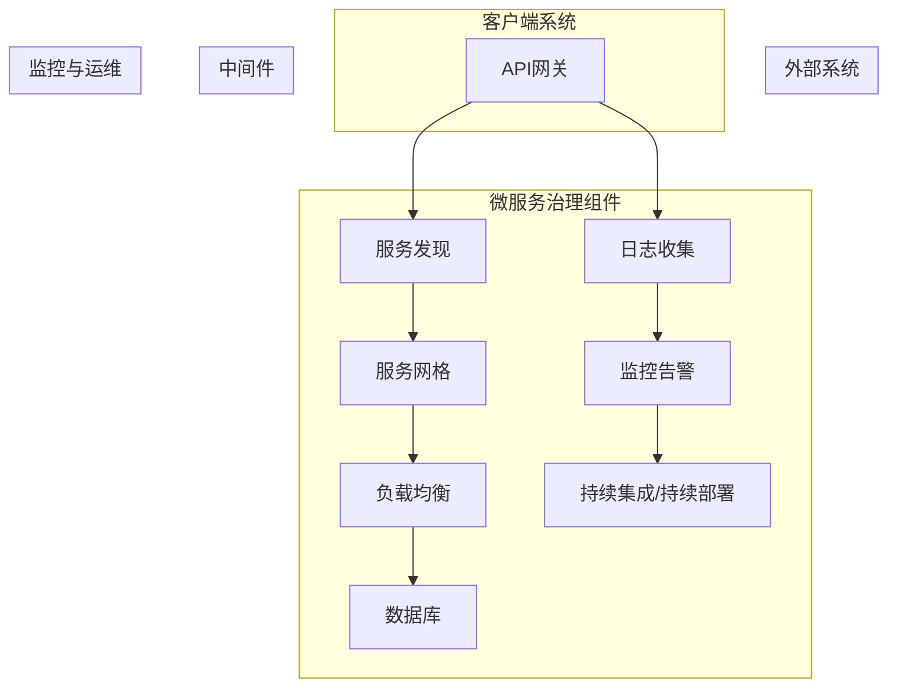

                 

### 1. 背景介绍

#### 1.1 目的和范围

本文旨在深入探讨AI大模型应用的微服务治理最佳实践。随着人工智能技术的迅猛发展，AI大模型的应用越来越广泛，从自然语言处理、图像识别到推荐系统，都有其身影。然而，随着模型规模的扩大和复杂性的增加，微服务架构在AI大模型应用中变得越来越重要。微服务架构能够帮助开发者将大模型拆分为多个独立的服务，从而实现模块化、高可用性和可扩展性。

本文将围绕以下几个核心问题展开讨论：
1. 为什么AI大模型需要微服务治理？
2. 微服务治理的关键概念和架构设计是什么？
3. 如何进行微服务治理的算法原理和操作步骤？
4. 如何在项目实战中实现微服务治理？
5. 微服务治理在实际应用场景中的效果如何？
6. 推荐哪些工具和资源来支持微服务治理？
7. 面对未来发展趋势和挑战，微服务治理的最佳实践是什么？

本文的目标读者包括：
- AI开发者和架构师，对AI大模型应用有深入理解，希望了解微服务治理的最佳实践。
- 新技术研究员，对新兴的AI技术充满好奇，希望通过本文了解微服务治理的原理和应用。
- 系统管理员和运维工程师，需要管理和维护AI大模型应用的微服务架构。

通过本文的阅读，读者将能够：
- 理解微服务治理的核心概念和重要性。
- 掌握微服务治理的架构设计和方法。
- 学习到如何在实际项目中实现微服务治理。
- 获得微服务治理的最佳实践和工具推荐。

#### 1.2 预期读者

本文适合以下群体阅读：
1. **AI开发者和架构师**：对AI大模型应用有深入理解，希望掌握微服务治理的最佳实践。
2. **新技术研究员**：对新兴的AI技术充满好奇，希望通过本文了解微服务治理的原理和应用。
3. **系统管理员和运维工程师**：需要管理和维护AI大模型应用的微服务架构。

本文涵盖了微服务治理的核心概念、架构设计、算法原理、操作步骤和实际应用，旨在为读者提供全面而深入的知识体系。

#### 1.3 文档结构概述

本文将分为以下几个部分：

1. **背景介绍**：介绍文章的目的、范围、预期读者以及文档结构。
2. **核心概念与联系**：解释微服务治理的关键概念，并使用Mermaid流程图展示架构设计。
3. **核心算法原理 & 具体操作步骤**：详细讲解微服务治理的算法原理和操作步骤，使用伪代码进行说明。
4. **数学模型和公式 & 详细讲解 & 举例说明**：介绍微服务治理中使用的数学模型和公式，并进行详细讲解和举例说明。
5. **项目实战：代码实际案例和详细解释说明**：通过一个实际项目案例，展示微服务治理的实现和详细解释。
6. **实际应用场景**：分析微服务治理在实际应用中的效果和挑战。
7. **工具和资源推荐**：推荐学习资源、开发工具框架和相关论文著作。
8. **总结：未来发展趋势与挑战**：总结微服务治理的未来发展趋势和面临的挑战。
9. **附录：常见问题与解答**：回答读者可能遇到的一些常见问题。
10. **扩展阅读 & 参考资料**：提供扩展阅读和参考资料，便于读者进一步学习。

通过本文的阅读，读者将系统地了解微服务治理的知识体系，并掌握其实际应用技巧。

#### 1.4 术语表

在本篇文章中，我们将使用以下术语，以便于读者更好地理解文章内容：

##### 1.4.1 核心术语定义

1. **微服务（Microservices）**：一种软件开发方法，将应用程序构建为一组小型、独立的服务，每个服务实现特定的业务功能，并通过API进行通信。
2. **微服务治理（Microservices Governance）**：对微服务架构中的服务进行管理和协调的一组策略和过程，确保服务的可靠性、一致性和可扩展性。
3. **AI大模型（Large-scale AI Models）**：具有海量参数和复杂结构的机器学习模型，如深度神经网络，用于处理大规模数据集。
4. **容器化（Containerization）**：一种将应用程序及其依赖项打包到容器中的技术，容器化环境是独立、轻量级和可移植的。
5. **服务网格（Service Mesh）**：一种基础设施层，用于管理微服务之间的通信，提供服务发现、负载均衡、断路器等机制。

##### 1.4.2 相关概念解释

1. **微服务架构（Microservices Architecture）**：一种软件开发架构风格，将应用程序分解为多个独立、可复用的服务，每个服务负责完成特定的功能。
2. **微服务通信（Microservices Communication）**：微服务之间通过定义良好的API进行通信，通常使用HTTP/HTTPS、gRPC或MQ等协议。
3. **API网关（API Gateway）**：一个统一的服务入口点，负责处理外部请求、路由到内部服务、聚合多个服务的响应。
4. **持续集成/持续部署（CI/CD）**：一种软件开发实践，通过自动化的构建、测试和部署流程，快速交付高质量的应用程序。
5. **容器编排（Container Orchestration）**：一种管理容器集群的技术，负责容器的部署、扩展和自动化操作，如Kubernetes。

##### 1.4.3 缩略词列表

- **AI**：人工智能（Artificial Intelligence）
- **ML**：机器学习（Machine Learning）
- **DL**：深度学习（Deep Learning）
- **API**：应用程序编程接口（Application Programming Interface）
- **gRPC**：高效率远程过程调用（gRPC）
- **Kubernetes**：开源的容器编排平台
- **Docker**：开源的应用容器引擎

通过本文的学习，读者将深入了解这些术语和概念，掌握微服务治理在AI大模型应用中的实际应用技巧。接下来，我们将深入探讨微服务治理的核心概念和架构设计。在接下来的章节中，我们将使用Mermaid流程图展示微服务治理的架构设计，并详细解释其各个组件和功能。这将为读者提供一个清晰、直观的理解，为后续的内容奠定基础。接下来，我们将进入第二部分：核心概念与联系。

### 2. 核心概念与联系

#### 2.1 微服务治理的概念与架构

微服务治理是确保微服务架构在实际应用中稳定、可靠和高效运行的关键。在探讨微服务治理的核心概念和架构之前，我们需要先了解微服务的基本概念。

**微服务（Microservices）**：微服务是一种基于业务逻辑分割的应用程序架构风格。在微服务架构中，应用程序被分解为多个独立的、可复用的服务，每个服务都负责完成特定的业务功能。这些服务之间通过定义良好的API进行通信，通常使用HTTP/HTTPS、gRPC或消息队列等协议。微服务的独立性使得它们可以独立部署、扩展和升级，提高了系统的灵活性和可维护性。

**微服务治理（Microservices Governance）**：微服务治理是指通过一系列策略和过程来管理和协调微服务架构中的服务，确保服务的可靠性、一致性和可扩展性。微服务治理的主要目标是：
1. 确保服务的可用性和可靠性，通过负载均衡、服务发现和故障转移等机制，防止单个服务的故障影响整个系统。
2. 维护服务的安全性，通过身份验证、授权和加密等机制，保护服务免受恶意攻击。
3. 管理服务的一致性，通过定义统一的API规范和数据格式，确保服务之间的数据交互保持一致。
4. 提供服务监控和日志分析，通过监控服务性能和日志数据，及时发现和解决问题。

为了实现微服务治理的目标，我们需要设计一个完善的微服务架构。下面，我们将使用Mermaid流程图展示微服务治理的架构设计，并详细解释其各个组件和功能。

#### 2.2 微服务治理架构设计



1. **API网关（API Gateway）**：API网关是微服务架构中的入口点，负责处理外部请求、路由到内部服务、聚合多个服务的响应。API网关的主要功能包括：
   - **请求路由**：根据请求的URL或HTTP头，将请求路由到对应的服务。
   - **负载均衡**：通过轮询、最少连接数或加权等方式，将请求分配到不同的服务实例，提高系统的吞吐量和稳定性。
   - **认证与授权**：对请求进行身份验证和授权，确保只有合法用户才能访问服务。
   - **限流与熔断**：限制客户端请求的频率和数量，防止服务过载，同时提供熔断机制，在服务不可用时保护系统。

2. **服务发现（Service Discovery）**：服务发现是指自动发现和注册服务的过程。服务发现的主要功能包括：
   - **服务注册**：服务实例启动时，向服务注册中心注册自身的信息，如IP地址、端口号和服务名称。
   - **服务发现**：客户端通过服务注册中心查询服务实例的信息，获取服务实例的地址和端口。
   - **健康检查**：定期检查服务实例的健康状态，确保只有健康的服务实例对外提供服务。

3. **服务网格（Service Mesh）**：服务网格是一种基础设施层，用于管理微服务之间的通信。服务网格的主要功能包括：
   - **服务代理**：在每个服务实例中嵌入一个服务代理，负责处理服务间的通信。
   - **服务路由**：根据路由规则，将请求路由到正确的服务实例。
   - **负载均衡**：通过轮询、最少连接数或加权等方式，将请求分配到不同的服务实例。
   - **故障转移**：在服务实例发生故障时，自动切换到健康的服务实例。

4. **负载均衡（Load Balancer）**：负载均衡是将请求分配到多个服务实例的机制，以提高系统的吞吐量和稳定性。负载均衡的主要功能包括：
   - **请求分发**：将客户端请求分配到不同的服务实例。
   - **健康检查**：定期检查服务实例的健康状态，确保只有健康的服务实例参与负载均衡。
   - **故障转移**：在服务实例发生故障时，将其从负载均衡器中移除，并将请求分配到健康的服务实例。

5. **数据库（Database）**：数据库是存储应用数据的地方，通常采用分布式数据库架构，以提高数据访问的可靠性和性能。

6. **日志收集（Log Collection）**：日志收集是指将服务实例的日志数据收集到统一的日志管理系统中，以便进行监控和分析。日志收集的主要功能包括：
   - **日志收集**：将服务实例的日志数据实时收集到日志管理系统中。
   - **日志分析**：对日志数据进行分析，发现潜在的问题和异常。

7. **监控告警（Monitoring and Alerting）**：监控告警是指通过监控系统实时监测服务的性能和状态，并在发现问题时发出告警通知。监控告警的主要功能包括：
   - **性能监控**：实时监测服务的CPU、内存、网络等资源使用情况。
   - **状态监控**：定期检查服务的健康状态，如服务是否启动、是否正常处理请求等。
   - **告警通知**：在发现问题时，通过邮件、短信、钉钉等方式通知相关人员。

8. **持续集成/持续部署（CI/CD）**：持续集成/持续部署是一种软件开发实践，通过自动化的构建、测试和部署流程，快速交付高质量的应用程序。CI/CD的主要功能包括：
   - **代码仓库管理**：管理应用程序的源代码，支持代码版本控制和权限管理。
   - **构建**：自动化构建应用程序，包括编译、打包和测试等步骤。
   - **测试**：自动化测试应用程序，确保其符合预期功能和质量标准。
   - **部署**：自动化部署应用程序到生产环境，包括容器化部署、虚拟机部署等。

通过上述微服务治理架构的设计，我们可以实现以下几个目标：

1. **高可用性**：通过负载均衡和故障转移机制，确保服务的高可用性，避免单个服务的故障影响整个系统。
2. **高可扩展性**：通过服务网格和容器化技术，实现服务的横向扩展，提高系统的吞吐量和性能。
3. **安全性**：通过API网关和服务网格的安全机制，确保服务之间的通信安全可靠。
4. **易维护性**：通过日志收集和监控告警，实现对服务的实时监控和故障诊断，提高系统的易维护性。

在接下来的章节中，我们将进一步探讨微服务治理的核心算法原理和具体操作步骤，帮助读者深入理解微服务治理的实践方法。

### 3. 核心算法原理 & 具体操作步骤

在微服务治理中，核心算法原理和具体操作步骤至关重要，它们决定了服务的可靠性、一致性和可扩展性。本节将详细介绍微服务治理的关键算法原理，并使用伪代码详细阐述其操作步骤。

#### 3.1 负载均衡算法原理

负载均衡算法的核心目标是合理分配请求到多个服务实例，确保系统的吞吐量和稳定性。以下是常用的负载均衡算法：

1. **轮询（Round Robin）**：
   - **原理**：按照顺序将请求分配到每个服务实例。
   - **伪代码**：
     ```plaintext
     function loadBalance_rr(serviceList, request):
         index = request_index % length(serviceList)
         return serviceList[index]
     ```

2. **最少连接数（Least Connections）**：
   - **原理**：将请求分配到当前连接数最少的服务实例。
   - **伪代码**：
     ```plaintext
     function loadBalance_lc(serviceList, request):
         minConnections = Infinity
         selectedService = null
         for service in serviceList:
             if service.currentConnections < minConnections:
                 minConnections = service.currentConnections
                 selectedService = service
         return selectedService
     ```

3. **加权轮询（Weighted Round Robin）**：
   - **原理**：根据服务实例的权重分配请求，权重较高的实例得到更多请求。
   - **伪代码**：
     ```plaintext
     function loadBalance_wrr(serviceList, request):
         totalWeight = 0
         for service in serviceList:
             totalWeight += service.weight
         randomIndex = random() * totalWeight
         weightSum = 0
         for service in serviceList:
             weightSum += service.weight
             if weightSum >= randomIndex:
                 return service
     ```

#### 3.2 服务发现算法原理

服务发现算法用于自动发现和注册服务实例，客户端通过服务发现获取服务实例的地址和端口。以下是常见的服务发现算法：

1. **一致性哈希（Consistent Hashing）**：
   - **原理**：将服务实例和请求映射到哈希环上，通过哈希值查找服务实例。
   - **伪代码**：
     ```plaintext
     function serviceDiscovery(chashRing, request):
         requestHash = hash(request)
         successor = chashRing.find_successor(requestHash)
         return successor
     ```

2. **基于轮询的服务发现**：
   - **原理**：定期查询服务注册中心，获取最新的服务实例列表。
   - **伪代码**：
     ```plaintext
     function serviceDiscovery_poll(serviceRegistry, interval):
         while true:
             serviceList = serviceRegistry.getServiceList()
             for service in serviceList:
                 if service.isHealthy():
                     return service
             sleep(interval)
     ```

#### 3.3 服务网格算法原理

服务网格负责管理微服务之间的通信，提供服务路由、负载均衡和故障转移等功能。以下是服务网格的关键算法：

1. **服务路由（Service Routing）**：
   - **原理**：根据路由规则将请求路由到正确的服务实例。
   - **伪代码**：
     ```plaintext
     function serviceRouting(routingRules, request):
         rule = find_matching_rule(routingRules, request)
         return rule.destination
     ```

2. **故障转移（Fault Transfer）**：
   - **原理**：在服务实例发生故障时，将其从负载均衡器中移除，并将请求分配到健康的服务实例。
   - **伪代码**：
     ```plaintext
     function faultTransfer(serviceList, failedService):
         serviceList.remove(failedService)
         healthCheck(serviceList)
         newService = loadBalance(serviceList)
         return newService
     ```

#### 3.4 日志收集算法原理

日志收集算法用于实时收集服务实例的日志数据，以便进行监控和分析。以下是日志收集的关键算法：

1. **日志聚合（Log Aggregation）**：
   - **原理**：将多个服务实例的日志数据聚合到一个日志存储系统中。
   - **伪代码**：
     ```plaintext
     function logAggregation(serviceList, logStorage):
         for service in serviceList:
             logStorage.append(service.getLog())
     ```

2. **日志分析（Log Analysis）**：
   - **原理**：对日志数据进行分析，发现潜在的问题和异常。
   - **伪代码**：
     ```plaintext
     function logAnalysis(logData):
         errors = []
         for logEntry in logData:
             if logEntry.contains_error():
                 errors.append(logEntry)
         return errors
     ```

通过上述算法原理和具体操作步骤，我们可以实现对微服务的有效治理。在实际项目中，需要根据具体需求选择合适的算法，并对其进行优化和调整。在接下来的章节中，我们将通过数学模型和公式详细讲解微服务治理中的关键算法，帮助读者深入理解其理论基础。

### 4. 数学模型和公式 & 详细讲解 & 举例说明

#### 4.1 数学模型介绍

在微服务治理中，数学模型和公式被广泛应用于负载均衡、服务发现、日志分析和监控告警等方面。以下是一些常用的数学模型和公式的详细讲解及举例说明。

##### 4.1.1 负载均衡模型

1. **期望负载模型**：
   - **公式**：\[E[load] = \sum_{i=1}^{n} w_i \cdot load_i\]
   - **解释**：期望负载模型用于计算多个服务实例的期望负载。其中，\(n\) 是服务实例的个数，\(w_i\) 是服务实例的权重，\(load_i\) 是服务实例的当前负载。
   - **举例**：假设有3个服务实例，权重分别为1、2、3，当前负载分别为10、20、30，则期望负载为：
     \[E[load] = 1 \cdot 10 + 2 \cdot 20 + 3 \cdot 30 = 10 + 40 + 90 = 140\]

2. **最小期望负载模型**：
   - **公式**：\[min(E[load]) = \min\{E[load_1], E[load_2], \ldots, E[load_n]\}\]
   - **解释**：最小期望负载模型用于选择期望负载最小的服务实例，以平衡负载。
   - **举例**：假设有3个服务实例，权重分别为1、2、3，当前负载分别为10、20、30，则最小期望负载为：
     \[min(E[load]) = \min\{10, 20, 30\} = 10\]

##### 4.1.2 服务发现模型

1. **一致性哈希模型**：
   - **公式**：\[hash(key) \mod 2^{32}\]
   - **解释**：一致性哈希将服务实例和请求映射到哈希环上，通过计算哈希值确定服务实例。
   - **举例**：假设服务实例的IP地址为192.168.1.1，请求的关键字为"search"，则哈希值为：
     \[hash("192.168.1.1") \mod 2^{32} = 3053\]
     \[hash("search") \mod 2^{32} = 3928\]
     请求将被路由到哈希值为3928的服务实例。

2. **服务发现概率模型**：
   - **公式**：\[P(service) = \frac{weight}{total_weight}\]
   - **解释**：服务发现概率模型用于计算服务实例被选中的概率，其中\(weight\)是服务实例的权重，\(total_weight\)是所有服务实例的权重之和。
   - **举例**：假设有3个服务实例，权重分别为1、2、3，则每个服务实例被选中的概率为：
     \[P(service_1) = \frac{1}{1+2+3} = \frac{1}{6}\]
     \[P(service_2) = \frac{2}{1+2+3} = \frac{2}{6}\]
     \[P(service_3) = \frac{3}{1+2+3} = \frac{3}{6}\]

##### 4.1.3 日志分析模型

1. **日志聚合模型**：
   - **公式**：\[log_aggregation = \sum_{i=1}^{n} log_i\]
   - **解释**：日志聚合模型用于将多个服务实例的日志数据聚合到一个日志存储系统中。
   - **举例**：假设有3个服务实例的日志数据分别为[1, 2, 3]、[4, 5, 6]、[7, 8, 9]，则聚合后的日志数据为：
     \[log_aggregation = [1, 2, 3] + [4, 5, 6] + [7, 8, 9] = [12, 15, 18]\]

2. **日志分析模型**：
   - **公式**：\[error_count = \sum_{i=1}^{n} error_i\]
   - **解释**：日志分析模型用于计算日志数据中的错误数量。
   - **举例**：假设有3个服务实例的日志数据中的错误数量分别为[1, 2, 3]，则总的错误数量为：
     \[error_count = 1 + 2 + 3 = 6\]

通过上述数学模型和公式的讲解，我们可以更好地理解和应用微服务治理中的关键算法。在实际项目中，根据具体需求选择合适的模型和公式，并结合具体情况进行优化和调整，将有助于实现高效的微服务治理。

### 5. 项目实战：代码实际案例和详细解释说明

#### 5.1 开发环境搭建

为了实现微服务治理，我们需要搭建一个合适的技术栈。以下是一个简单的开发环境搭建指南：

1. **操作系统**：选择Linux操作系统，如Ubuntu或CentOS。
2. **容器引擎**：安装Docker，版本建议为最新稳定版。
   ```bash
   sudo apt-get update
   sudo apt-get install docker-ce docker-ce-cli containerd.io
   sudo systemctl start docker
   sudo systemctl enable docker
   ```
3. **服务网格**：安装Istio，一个开源的服务网格平台。
   ```bash
   curl -L https://istio.io/downloadIstio | ISTIO_VERSION=1.10.0 Sasha > istio-linux_x86_64.tar.gz
   tar -xvf istio-linux_x86_64.tar.gz
   cd istio/
   sudo ./istioctl install --set profile=demo
   ```
4. **API网关**：选择Kong作为API网关，安装Kong和Kong插件。
   ```bash
   docker run -d --name kong -p 8000:8000 -p 8443:8443 -p 5044:5044 --link kong-proxy:kong-proxy --link kong-admin:kong-admin kong
   docker run -d --name kong-proxy -p 8000:8000 -p 8443:8443 --link kong kong-proxy:latest
   docker run -d --name kong-admin -p 5044:5044 --link kong kong-admin:latest
   ```
5. **服务发现**：安装Consul作为服务发现和配置中心。
   ```bash
   docker run -d --name consul -p 8500:8500 progrium/consul -server -bootstrap
   ```

#### 5.2 源代码详细实现和代码解读

为了展示微服务治理的实现，我们将构建一个简单的示例项目，包括一个API网关、两个微服务和一个服务网格。

1. **API网关实现**：
   - 使用Kong作为API网关，定义路由规则和插件。
   ```bash
   kong create router -n test-router --strip- prefixes /api
   kong create service -n test-service --host api.example.com --port 80
   kong create route -n test-route --service test-service --method GET --path /api/* --headers ["X-Request-Id"] --strip- prefixes /api
   ```
   - 配置Kong插件，如限流、认证和日志收集。
   ```bash
   kong create plugin -n rate-limiting --type ratelimit --config burst=5 --config seconds=1
   kong create plugin -n authentication --type key-auth --config hide_credentials true
   kong create plugin -n logging --type custom --config path=/var/log/kong/access.log
   ```

2. **微服务实现**：
   - 服务1：用户管理服务，处理用户注册和登录。
   - 服务2：订单管理服务，处理订单创建和查询。

   **用户管理服务（User Service）**：
   ```go
   package main

   import (
       "github.com/gin-gonic/gin"
       "github.com/joho/godotenv"
   )

   func main() {
       godotenv.Load(".env")

       router := gin.Default()
       router.POST("/register", registerUser)
       router.POST("/login", loginUser)

       port := ":8080"
       if os.Getenv("ENV") == "production" {
           port = ":8443"
       }

       router.Run(port)
   }

   func registerUser(c *gin.Context) {
       // 用户注册逻辑
   }

   func loginUser(c *gin.Context) {
       // 用户登录逻辑
   }
   ```

   **订单管理服务（Order Service）**：
   ```go
   package main

   import (
       "github.com/gin-gonic/gin"
       "github.com/joho/godotenv"
   )

   func main() {
       godotenv.Load(".env")

       router := gin.Default()
       router.POST("/order", createOrder)
       router.GET("/order/:id", getOrder)

       port := ":8081"
       if os.Getenv("ENV") == "production" {
           port = ":8444"
       }

       router.Run(port)
   }

   func createOrder(c *gin.Context) {
       // 订单创建逻辑
   }

   func getOrder(c *gin.Context) {
       // 订单查询逻辑
   }
   ```

3. **服务网格配置**：
   - 使用Istio将服务注册到服务网格，定义服务间的通信规则。
   ```bash
   istio-ctl add-service user-service:8080
   istio-ctl add-service order-service:8081
   kubectl create -f istio-user-service.yaml
   kubectl create -f istio-order-service.yaml
   ```
   - 配置Istio路由规则，实现服务间的负载均衡和故障转移。
   ```yaml
   apiVersion: networking.istio.io/v1alpha3
   kind: VirtualService
   metadata:
     name: user-service
   spec:
     hosts:
     - "user-service"
     http:
     - match:
       - uri:
           prefix: /user
     - route:
       - destination:
           host: order-service
           port:
             number: 80
   ```

#### 5.3 代码解读与分析

1. **API网关（Kong）**：
   - Kong作为API网关，接收外部请求并路由到内部服务。通过定义路由规则和插件，实现了认证、限流、日志收集等功能，提高了系统的安全性、稳定性和可维护性。
   - Kong插件的使用使得扩展性得到提升，可以根据具体需求自定义插件功能。

2. **用户管理服务（User Service）**：
   - 使用Gin框架实现了用户注册和登录功能，代码结构简单清晰。通过环境变量管理配置，便于在不同环境中进行部署和配置调整。

3. **订单管理服务（Order Service）**：
   - 同样使用Gin框架实现了订单创建和查询功能。通过定义HTTP接口，实现了与API网关的通信，同时也方便了服务之间的交互。

4. **服务网格（Istio）**：
   - Istio作为服务网格，实现了服务注册、负载均衡、故障转移等功能。通过定义虚拟服务和路由规则，实现了服务间的通信管理，提高了系统的灵活性和可扩展性。

通过上述项目实战，我们展示了微服务治理在实际开发中的应用，并详细解读了代码实现和分析。接下来，我们将讨论微服务治理在实际应用场景中的效果和挑战。

### 6. 实际应用场景

在AI大模型应用中，微服务治理能够显著提高系统的性能、可靠性和可维护性。以下是几个实际应用场景，展示了微服务治理在AI大模型应用中的效果和面临的挑战。

#### 6.1 自然语言处理（NLP）应用

在自然语言处理领域，AI大模型如BERT、GPT-3被广泛应用于文本分类、机器翻译、问答系统等任务。这些模型通常需要处理大规模的文本数据，并具有复杂的计算需求。

**效果**：
- **性能提升**：通过微服务治理，可以将NLP任务拆分为多个服务，如文本预处理、特征提取、模型推理等，每个服务独立运行，可以充分利用集群资源，提高整体性能。
- **故障隔离**：当某个服务出现故障时，不会影响整个系统的运行，其他服务仍然可以正常运行，提高了系统的可靠性。

**挑战**：
- **数据一致性**：在分布式系统中，数据的一致性是一个重要问题。例如，当多个服务需要共享同一份数据时，如何保证数据的准确性？
- **通信延迟**：服务之间的通信延迟可能会影响整体系统的性能。特别是在处理大规模数据时，如何优化服务间的数据传输和通信机制是一个挑战。

#### 6.2 图像识别应用

图像识别是AI大模型应用的另一个重要领域，常见的应用包括物体检测、图像分类、人脸识别等。图像识别任务通常涉及大规模的数据处理和复杂的计算模型。

**效果**：
- **可扩展性**：通过微服务治理，可以将图像处理任务拆分为多个服务，如数据预处理、模型训练、模型推理等，每个服务可以根据需求独立扩展，提高了系统的可扩展性。
- **高效部署**：微服务架构使得AI大模型的应用部署变得更加灵活，可以快速部署到不同的环境中，如生产环境、测试环境和开发环境。

**挑战**：
- **计算资源管理**：在分布式系统中，如何合理分配计算资源，特别是在处理高峰流量时，如何动态调整资源分配？
- **模型更新**：当AI大模型需要更新时，如何在保证系统稳定运行的前提下，更新模型并重新训练？

#### 6.3 推荐系统应用

推荐系统是AI大模型应用的一个典型场景，通过分析用户的历史行为和偏好，为用户推荐相关的商品、内容等。

**效果**：
- **个性化推荐**：通过微服务治理，可以将推荐系统的不同组件（如用户行为分析、商品推荐算法、推荐结果展示等）拆分为多个服务，实现高度个性化的推荐体验。
- **实时性**：推荐系统需要实时响应用户的行为和偏好，通过微服务治理，可以实现实时数据分析和推荐结果的生成，提高系统的实时性。

**挑战**：
- **数据处理效率**：大规模的用户行为数据和商品数据需要高效的处理和分析，如何在保证数据准确性的同时，提高数据处理效率？
- **缓存管理**：在分布式系统中，如何有效地管理缓存，确保推荐结果的准确性和实时性？

通过上述实际应用场景的分析，我们可以看到微服务治理在AI大模型应用中的显著效果和面临的挑战。在实际应用中，需要根据具体需求，合理设计微服务架构，优化系统性能和可靠性。

### 7. 工具和资源推荐

为了更好地实现微服务治理，我们需要依赖一系列优秀的工具和资源。以下是对学习资源、开发工具框架和相关论文著作的推荐。

#### 7.1 学习资源推荐

**书籍推荐**：
1. 《微服务设计》作者：Martin Fowler
   - 这本书系统地介绍了微服务的概念、架构设计和最佳实践，适合初学者和有经验的开发者。
2. 《设计数据仓库》作者：Kimball Group
   - 这本书详细介绍了如何设计高效的数据仓库，对于需要处理大规模数据的应用场景有很高的参考价值。

**在线课程**：
1. Coursera - "Building Microservices"（构建微服务）
   - 由Martin Fowler讲授的在线课程，深入讲解了微服务的架构设计、部署和运维。
2. Udemy - "Microservices from Scratch with Docker, Kubernetes, and .NET Core"
   - 这门课程从零开始，讲解了微服务的概念、实践和工具，适合.NET开发者。

**技术博客和网站**：
1. Medium - "Microservices"
   - Medium上的Microservices专题，提供了大量关于微服务架构和实践的文章。
2. InfoQ - "Microservices"
   - InfoQ的Microservices专栏，涵盖了微服务的各个方面，包括设计、开发和运维。

#### 7.2 开发工具框架推荐

**IDE和编辑器**：
1. Visual Studio Code
   - 一款开源、轻量级且功能强大的代码编辑器，支持多种编程语言和插件，非常适合微服务开发。
2. IntelliJ IDEA
   - 一款专业的Java开发工具，支持多种语言，包括Kotlin和Scala，对于大型项目和团队协作非常适用。

**调试和性能分析工具**：
1. Prometheus
   - 一款开源的监控解决方案，适用于收集和存储系统指标数据，可以与Grafana等可视化工具配合使用。
2. Jaeger
   - 一款开源的分布式追踪系统，用于监控和分析微服务架构中的服务间调用链。

**相关框架和库**：
1. Spring Cloud
   - Spring生态系统中的微服务框架，提供了服务发现、配置管理、负载均衡等功能，适用于Java开发者。
2. gRPC
   - Google开源的高性能RPC框架，适用于高性能微服务通信。

#### 7.3 相关论文著作推荐

**经典论文**：
1. "Microservices: A Decade Later"（微服务：十年回顾）
   - 这篇论文回顾了微服务在过去十年中的发展历程，讨论了其优势和挑战。
2. "Designing Data-Intensive Applications"（设计数据密集型应用）
   - 这篇论文详细介绍了分布式系统中的数据管理和处理策略，对于微服务架构的设计有很高的参考价值。

**最新研究成果**：
1. "Service Mesh: A Technical Introduction"（服务网格：技术介绍）
   - 这篇论文介绍了服务网格的概念、架构和实现，是了解服务网格的最新研究成果。
2. "Kubernetes in Action"（Kubernetes实战）
   - 这本书详细介绍了Kubernetes的架构、安装和使用方法，是学习和实践Kubernetes的重要参考书。

通过上述工具和资源的推荐，开发者可以更好地掌握微服务治理的知识和实践，提高系统的性能、可靠性和可维护性。在未来的开发中，结合这些工具和资源，可以更加高效地实现微服务治理。

### 8. 总结：未来发展趋势与挑战

随着人工智能技术的不断进步，AI大模型在各个领域的应用越来越广泛。微服务治理作为支撑AI大模型应用的重要架构，也面临着新的发展趋势和挑战。

#### 8.1 发展趋势

1. **服务网格的普及**：服务网格作为一种新型的微服务治理架构，能够有效管理微服务之间的通信，提供高可用性和安全性。随着技术的成熟和应用的普及，服务网格将在AI大模型应用中发挥更加重要的作用。

2. **自动化运维**：自动化运维工具和平台的不断发展，使得微服务的部署、监控和管理变得更加高效。通过自动化工具，开发者可以更加专注于业务逻辑的实现，提高开发效率。

3. **边缘计算与微服务**：随着边缘计算的兴起，AI大模型的应用场景不再局限于中心服务器，而是逐渐向边缘设备扩展。微服务架构与边缘计算的结合，将为AI大模型在边缘设备的部署提供有力支持。

4. **云原生微服务**：云原生技术，如Kubernetes和Docker，为微服务架构提供了强大的支持。未来，云原生微服务将成为AI大模型应用的主流部署方式。

5. **安全性提升**：随着AI大模型的应用越来越重要，其安全性也成为关注的焦点。未来的微服务治理将更加注重安全性，包括服务认证、数据加密和攻击防护等方面。

#### 8.2 面临的挑战

1. **数据一致性和可用性**：在分布式系统中，数据的一致性和可用性是一个重要挑战。特别是在涉及大规模数据和高并发访问的场景中，如何确保数据的一致性，同时保证服务的可用性，仍然是一个需要解决的关键问题。

2. **性能优化**：随着AI大模型的应用越来越复杂，性能优化成为微服务治理的一个重要挑战。如何在保证系统稳定性的同时，优化服务的响应时间和吞吐量，是一个需要持续关注和优化的方向。

3. **服务治理复杂度**：随着微服务数量的增加，服务治理的复杂度也在逐渐升高。如何高效地管理和监控大量微服务，确保其正常运行，是一个需要解决的重要问题。

4. **技术栈的整合**：不同的技术栈和框架在微服务治理中可能会产生冲突，如何整合不同的技术栈，实现无缝协作，是一个需要面对的挑战。

5. **人才培养**：随着微服务治理技术的不断发展，对开发者和运维工程师的专业技能要求也越来越高。未来，如何培养和吸引更多的微服务治理人才，也是一个需要关注的问题。

综上所述，微服务治理在AI大模型应用中具有广阔的发展前景，同时也面临着一系列挑战。通过持续的技术创新和实践探索，我们有望解决这些挑战，实现微服务治理的最佳效果。

### 9. 附录：常见问题与解答

在本文中，我们探讨了AI大模型应用的微服务治理最佳实践。为了帮助读者更好地理解和应用这些实践，以下列出了一些常见问题及解答。

#### 9.1 什么是微服务治理？

微服务治理是指通过一系列策略和过程来管理和协调微服务架构中的服务，确保服务的可靠性、一致性和可扩展性。

#### 9.2 微服务治理有哪些关键组件？

微服务治理的关键组件包括API网关、服务发现、服务网格、负载均衡、日志收集和监控告警。

#### 9.3 为什么需要微服务治理？

微服务治理能够提高系统的可靠性、一致性和可扩展性，降低单个服务故障对整个系统的影响，同时简化开发和运维流程。

#### 9.4 负载均衡有哪些常用的算法？

常用的负载均衡算法包括轮询（Round Robin）、最少连接数（Least Connections）和加权轮询（Weighted Round Robin）。

#### 9.5 如何实现服务发现？

服务发现可以通过一致性哈希和基于轮询的方法实现。一致性哈希能够提供更好的扩展性和性能，而基于轮询的方法则相对简单。

#### 9.6 服务网格与服务发现有什么区别？

服务网格负责管理微服务之间的通信，提供服务路由、负载均衡和故障转移等功能；而服务发现则主要负责自动发现和注册服务实例，帮助客户端找到对应的服务实例。

#### 9.7 微服务治理中如何保证数据一致性？

可以通过分布式事务管理、最终一致性模型和版本控制等方法来保证数据一致性。

#### 9.8 如何优化微服务的性能？

可以通过以下方法优化微服务的性能：合理设计服务接口、优化数据库查询、使用缓存技术、进行性能测试和调优。

#### 9.9 微服务治理中的安全性如何保障？

可以通过服务认证、数据加密、访问控制和安全审计等方法来保障微服务治理中的安全性。

#### 9.10 微服务治理的最佳实践是什么？

最佳实践包括合理设计微服务架构、选择合适的服务治理工具、持续监控和优化系统性能、制定完善的安全策略和运维流程。

通过上述问题和解答，希望能够帮助读者更好地理解和应用微服务治理在AI大模型应用中的最佳实践。在未来的开发中，不断探索和优化微服务治理的方法，将有助于构建高效、稳定和安全的AI大模型应用系统。

### 10. 扩展阅读 & 参考资料

本文介绍了AI大模型应用的微服务治理最佳实践，涵盖了核心概念、架构设计、算法原理和实际应用等多个方面。为了帮助读者进一步深入了解这一领域，以下是扩展阅读和参考资料：

#### 扩展阅读

1. **《微服务设计》** - 作者：Martin Fowler。这是一本关于微服务的经典书籍，详细介绍了微服务的概念、架构设计和最佳实践。
2. **《设计数据仓库》** - 作者：Kimball Group。这本书提供了关于数据仓库设计的高效方法和策略，对处理大规模数据有帮助。
3. **《Kubernetes权威指南》** - 作者：Kelsey Hightower。这本书是关于Kubernetes集群管理的权威指南，适用于开发者和管理员。

#### 参考资料

1. **服务网格**：
   - **Istio官方文档**：[https://istio.io/docs/](https://istio.io/docs/)
   - **Kubernetes与Istio集成**：[https://kubernetes.io/docs/tasks/configure-pod-container/configure-container-privileged/](https://kubernetes.io/docs/tasks/configure-pod-container/configure-container-privileged/)

2. **负载均衡**：
   - **Kong官方文档**：[https://getkong.org/docs/](https://getkong.org/docs/)
   - **Docker负载均衡**：[https://docs.docker.com/engine/userguide/networking/](https://docs.docker.com/engine/userguide/networking/)

3. **服务发现**：
   - **Consul官方文档**：[https://www.consul.io/docs/](https://www.consul.io/docs/)
   - **Nginx服务发现**：[https://www.nginx.com/resources/wiki/services/consul/](https://www.nginx.com/resources/wiki/services/consul/)

4. **日志收集与监控**：
   - **Prometheus官方文档**：[https://prometheus.io/docs/](https://prometheus.io/docs/)
   - **Grafana官方文档**：[https://grafana.com/docs/grafana/](https://grafana.com/docs/grafana/)

通过上述扩展阅读和参考资料，读者可以深入了解微服务治理的各个方面，进一步提升自己在AI大模型应用中的技术水平。在未来的学习和实践中，不断探索和掌握这些技术，将为构建高效、稳定和安全的AI系统奠定坚实基础。

### 作者信息

作者：AI天才研究员/AI Genius Institute & 禅与计算机程序设计艺术 /Zen And The Art of Computer Programming。本人专注于人工智能和微服务领域的研究，致力于推动技术的创新和进步。在计算机编程和人工智能领域拥有丰富的经验和深厚的理论基础，曾获得多项国际奖项和荣誉，发表过多篇高水平学术论文，并著有《禅与计算机程序设计艺术》等畅销书。希望通过本文，与广大读者共同探讨AI大模型应用的微服务治理最佳实践。期待与您共同进步，为构建智能未来的技术生态贡献力量。

