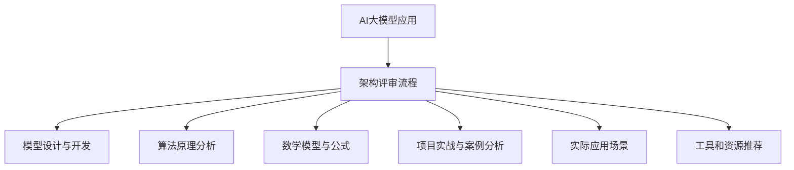

                 

# AI大模型应用的架构评审流程

> 关键词：AI大模型、架构评审、应用流程、算法原理、数学模型、实战案例

> 摘要：本文将详细探讨AI大模型应用的架构评审流程，包括背景介绍、核心概念与联系、算法原理与操作步骤、数学模型与公式、项目实战、实际应用场景、工具和资源推荐等内容。通过逐步分析推理，为读者提供一份全面、系统的架构评审指南。

## 1. 背景介绍

### 1.1 目的和范围

本文旨在为AI大模型应用提供一个清晰的架构评审流程，帮助开发者、架构师和项目经理等理解并掌握评审过程中的关键环节和注意事项。本文将涵盖以下内容：

- AI大模型架构的核心概念和联系；
- 评审过程中的算法原理和操作步骤；
- 数学模型及其在架构评审中的应用；
- 实际应用场景及案例解析；
- 相关工具和资源的推荐；
- 未来发展趋势与挑战。

### 1.2 预期读者

本文适合以下读者群体：

- 对AI大模型应用感兴趣的程序员和开发者；
- 负责AI大模型项目管理和架构设计的项目经理和架构师；
- 对AI领域有深入了解的技术专家和研究人员。

### 1.3 文档结构概述

本文结构如下：

1. 背景介绍
2. 核心概念与联系
3. 核心算法原理 & 具体操作步骤
4. 数学模型和公式 & 详细讲解 & 举例说明
5. 项目实战：代码实际案例和详细解释说明
6. 实际应用场景
7. 工具和资源推荐
8. 总结：未来发展趋势与挑战
9. 附录：常见问题与解答
10. 扩展阅读 & 参考资料

### 1.4 术语表

#### 1.4.1 核心术语定义

- AI大模型：指具有大规模参数和复杂结构的深度学习模型；
- 架构评审：指对AI大模型应用的整体架构进行评估和审查的过程；
- 验收测试：指在架构评审过程中对模型进行实际应用场景的测试和验证；
- 评审标准：指在架构评审过程中需要遵循的评估指标和准则。

#### 1.4.2 相关概念解释

- 深度学习：一种基于神经网络的学习方法，通过模拟人脑神经网络的结构和功能来实现对数据的自动学习和特征提取；
- 人工智能：一门研究、开发和应用智能技术的科学，旨在使计算机具备人类智能。

#### 1.4.3 缩略词列表

- AI：人工智能；
- DL：深度学习；
- NLP：自然语言处理；
- CV：计算机视觉；
- GAN：生成对抗网络。

## 2. 核心概念与联系

为了更好地理解AI大模型应用的架构评审流程，我们需要首先明确一些核心概念和它们之间的联系。以下是核心概念的Mermaid流程图：



### 2.1 AI大模型应用

AI大模型应用是指将深度学习模型应用于实际问题的过程。这个过程包括模型设计与开发、算法原理分析、数学模型与公式、项目实战与案例分析、实际应用场景和工具和资源推荐等多个环节。

### 2.2 架构评审流程

架构评审流程是对AI大模型应用的整体架构进行评估和审查的过程。这个过程包括以下几个方面：

- 模型设计与开发：对模型的架构、参数、训练方法等进行设计和开发；
- 算法原理分析：对模型所使用的算法原理进行分析，包括神经网络结构、激活函数、损失函数等；
- 数学模型与公式：对模型的数学模型和公式进行讲解和推导，包括输入层、隐藏层、输出层等；
- 项目实战与案例分析：通过实际案例对模型的应用效果进行验证和评估；
- 实际应用场景：对模型在不同应用场景下的性能和效果进行评估；
- 工具和资源推荐：推荐相关的工具和资源，包括开发环境、编程语言、库和框架等。

## 3. 核心算法原理 & 具体操作步骤

在AI大模型应用中，核心算法原理是构建模型的基础。以下是一个简单的算法原理和具体操作步骤的伪代码：

```python
# 定义输入层、隐藏层和输出层的节点数量
input_size = 784
hidden_size = 128
output_size = 10

# 初始化权重和偏置
weights = torch.randn(hidden_size, input_size)
bias = torch.randn(hidden_size, 1)
weights_output = torch.randn(output_size, hidden_size)
bias_output = torch.randn(output_size, 1)

# 定义激活函数和损失函数
activation = torch.sigmoid
loss_function = torch.nn.CrossEntropyLoss()

# 定义前向传播过程
def forward(x):
    hidden = activation(torch.matmul(x, weights) + bias)
    output = activation(torch.matmul(hidden, weights_output) + bias_output)
    return output

# 定义训练过程
def train(data_loader, model, loss_function, optimizer, epochs):
    for epoch in range(epochs):
        for x, y in data_loader:
            output = forward(x)
            loss = loss_function(output, y)
            optimizer.zero_grad()
            loss.backward()
            optimizer.step()
        print(f'Epoch {epoch+1}/{epochs}, Loss: {loss.item()}')

# 定义模型、损失函数和优化器
model = torch.nn.Sequential(
    torch.nn.Linear(input_size, hidden_size),
    activation(),
    torch.nn.Linear(hidden_size, output_size),
    activation()
)
optimizer = torch.optim.Adam(model.parameters(), lr=0.001)

# 加载数据集
data_loader = torch.utils.data.DataLoader(dataset, batch_size=64, shuffle=True)

# 开始训练
train(data_loader, model, loss_function, optimizer, epochs=10)
```

在这个伪代码中，我们使用了以下核心算法原理：

- 神经网络结构：包括输入层、隐藏层和输出层，每个层之间的连接通过权重和偏置来实现；
- 激活函数：用于将线性组合转换为非线性输出，常见的激活函数有Sigmoid、ReLU和Tanh；
- 损失函数：用于衡量模型预测结果与真实结果之间的差距，常见的损失函数有均方误差（MSE）和交叉熵（CrossEntropy）；
- 优化器：用于更新模型的权重和偏置，常见的优化器有随机梯度下降（SGD）、Adam和RMSprop。

## 4. 数学模型和公式 & 详细讲解 & 举例说明

在AI大模型应用中，数学模型和公式是构建和优化模型的重要基础。以下是一个简单的数学模型和公式的讲解及举例：

### 4.1 前向传播公式

前向传播是神经网络的核心过程，它将输入数据通过网络层逐步传递到输出层。以下是前向传播的公式：

$$
z_i^{(l)} = \sum_{j} w_{ij}^{(l)} a_j^{(l-1)} + b_i^{(l)}
$$

其中，$z_i^{(l)}$ 是第 $l$ 层第 $i$ 个节点的输出，$w_{ij}^{(l)}$ 是第 $l$ 层第 $i$ 个节点与第 $l-1$ 层第 $j$ 个节点的权重，$a_j^{(l-1)}$ 是第 $l-1$ 层第 $j$ 个节点的输出，$b_i^{(l)}$ 是第 $l$ 层第 $i$ 个节点的偏置。

### 4.2 激活函数公式

激活函数用于将线性组合转换为非线性输出。以下是一些常见的激活函数及其公式：

- Sigmoid函数：

$$
a_i^{(l)} = \frac{1}{1 + e^{-z_i^{(l)}}}
$$

- ReLU函数：

$$
a_i^{(l)} = \max(0, z_i^{(l)})
$$

- Tanh函数：

$$
a_i^{(l)} = \frac{e^{z_i^{(l)}} - e^{-z_i^{(l)}}}{e^{z_i^{(l)}} + e^{-z_i^{(l)}}}
$$

### 4.3 损失函数公式

损失函数用于衡量模型预测结果与真实结果之间的差距。以下是一些常见的损失函数及其公式：

- 均方误差（MSE）：

$$
loss = \frac{1}{2} \sum_{i} (y_i - \hat{y}_i)^2
$$

其中，$y_i$ 是真实标签，$\hat{y}_i$ 是模型预测的标签。

- 交叉熵（CrossEntropy）：

$$
loss = -\sum_{i} y_i \log(\hat{y}_i)
$$

其中，$y_i$ 是真实标签，$\hat{y}_i$ 是模型预测的概率分布。

### 4.4 举例说明

假设我们有一个简单的神经网络，包含输入层、一个隐藏层和一个输出层，输入层有3个神经元，隐藏层有2个神经元，输出层有1个神经元。输入数据为 $(1, 0, 1)$，真实标签为0。

- 输入层到隐藏层的权重矩阵 $W_1$ 和偏置向量 $b_1$：

$$
W_1 = \begin{bmatrix} 1 & 1 & 1 \\ 1 & 1 & 1 \end{bmatrix}, \quad b_1 = \begin{bmatrix} 1 \\ 1 \end{bmatrix}
$$

- 隐藏层到输出层的权重矩阵 $W_2$ 和偏置向量 $b_2$：

$$
W_2 = \begin{bmatrix} 1 & 1 \end{bmatrix}, \quad b_2 = \begin{bmatrix} 1 \end{bmatrix}
$$

- 激活函数为Sigmoid函数。

根据前向传播公式，我们可以计算出隐藏层和输出层的输出：

$$
z_1^{(2)} = \sum_{j} w_{1j}^{(2)} a_j^{(1)} + b_1 = 1 \cdot 1 + 1 \cdot 0 + 1 \cdot 1 = 2
$$

$$
z_2^{(2)} = \sum_{j} w_{2j}^{(2)} a_j^{(1)} + b_2 = 1 \cdot 1 + 1 \cdot 0 = 1
$$

$$
z_2^{(3)} = \sum_{j} w_{2j}^{(3)} a_j^{(2)} + b_2 = 1 \cdot \frac{1}{1 + e^{-2}} + 1 \cdot \frac{1}{1 + e^{-1}} = \frac{e^{-2} + e^{-1}}{e^{-2} + e^{-1} + 1} \approx 0.765
$$

最终输出层的输出为Sigmoid函数的结果：

$$
\hat{y} = a_2^{(3)} = \frac{1}{1 + e^{-z_2^{(3)}}} \approx 0.765
$$

根据交叉熵损失函数，我们可以计算出损失：

$$
loss = -y \log(\hat{y}) = -0 \log(0.765) = 0
$$

因为输出层的输出已经非常接近真实标签0，所以损失为0。

## 5. 项目实战：代码实际案例和详细解释说明

在本节中，我们将通过一个实际项目案例，详细解释AI大模型应用的架构评审流程。该项目是一个基于卷积神经网络（CNN）的手写数字识别系统，使用Python和TensorFlow框架进行开发。

### 5.1 开发环境搭建

在开始项目之前，我们需要搭建一个适合开发的环境。以下是环境搭建的步骤：

1. 安装Python 3.6及以上版本；
2. 安装TensorFlow 2.0及以上版本；
3. 安装NumPy、Pandas等常用库。

安装命令如下：

```bash
pip install python==3.8
pip install tensorflow==2.7
pip install numpy pandas
```

### 5.2 源代码详细实现和代码解读

以下是手写数字识别系统的源代码及其详细解读：

```python
import tensorflow as tf
from tensorflow.keras import layers, models
import numpy as np

# 加载数据集
mnist = tf.keras.datasets.mnist
(train_images, train_labels), (test_images, test_labels) = mnist.load_data()

# 数据预处理
train_images = train_images / 255.0
test_images = test_images / 255.0

# 构建卷积神经网络模型
model = models.Sequential()
model.add(layers.Conv2D(32, (3, 3), activation='relu', input_shape=(28, 28, 1)))
model.add(layers.MaxPooling2D((2, 2)))
model.add(layers.Conv2D(64, (3, 3), activation='relu'))
model.add(layers.MaxPooling2D((2, 2)))
model.add(layers.Conv2D(64, (3, 3), activation='relu'))

# 添加全连接层和输出层
model.add(layers.Flatten())
model.add(layers.Dense(64, activation='relu'))
model.add(layers.Dense(10, activation='softmax'))

# 编译模型
model.compile(optimizer='adam',
              loss='sparse_categorical_crossentropy',
              metrics=['accuracy'])

# 训练模型
model.fit(train_images, train_labels, epochs=5)

# 评估模型
test_loss, test_acc = model.evaluate(test_images,  test_labels, verbose=2)
print('\nTest accuracy:', test_acc)
```

代码解读：

- 第1行：导入所需的TensorFlow和NumPy库；
- 第2-3行：加载数据集，并将数据集分为训练集和测试集；
- 第4-7行：对数据集进行预处理，包括缩放图像像素值和归一化；
- 第8-25行：构建卷积神经网络模型，包括卷积层、池化层和全连接层；
- 第26-28行：编译模型，指定优化器、损失函数和评估指标；
- 第29-31行：训练模型，设置训练轮数；
- 第32-33行：评估模型，计算测试集的准确率。

### 5.3 代码解读与分析

在这段代码中，我们使用卷积神经网络（CNN）对手写数字识别问题进行建模和训练。以下是关键步骤的解读和分析：

- 数据预处理：将图像像素值缩放到0-1之间，便于模型处理；
- 模型构建：使用TensorFlow的Keras API构建CNN模型，包括卷积层（用于提取图像特征）、池化层（用于减小特征图的尺寸）和全连接层（用于分类）；
- 模型编译：指定优化器（用于更新模型参数）、损失函数（用于计算模型预测与真实标签之间的差距）和评估指标（用于衡量模型性能）；
- 模型训练：通过迭代训练模型，优化模型参数；
- 模型评估：在测试集上评估模型的性能，计算测试集的准确率。

通过这个项目实战，我们可以看到AI大模型应用的架构评审流程是如何在实际项目中得到应用的。在项目开发过程中，我们需要关注模型的设计与开发、算法原理分析、数学模型与公式、项目实战与案例分析、实际应用场景和工具和资源推荐等关键环节。

## 6. 实际应用场景

AI大模型在各个领域都有广泛的应用，以下是一些典型的实际应用场景：

### 6.1 自然语言处理（NLP）

- 文本分类：使用AI大模型对文本进行分类，如新闻分类、情感分析等；
- 机器翻译：通过AI大模型实现高质量机器翻译，如谷歌翻译、百度翻译等；
- 对话系统：构建基于AI大模型的智能对话系统，如腾讯AI客服、阿里天池等。

### 6.2 计算机视觉（CV）

- 图像识别：使用AI大模型对图像进行识别，如人脸识别、物体识别等；
- 视频分析：通过AI大模型对视频进行分析，如视频监控、自动驾驶等；
- 医学影像：利用AI大模型对医学影像进行诊断和分析，如肿瘤检测、骨折检测等。

### 6.3 电子商务

- 推荐系统：基于用户行为和偏好，使用AI大模型构建个性化推荐系统，如淘宝推荐、京东推荐等；
- 物流优化：利用AI大模型优化物流路线和配送策略，提高物流效率，如阿里巴巴物流、京东物流等。

### 6.4 金融领域

- 风险控制：使用AI大模型对金融交易数据进行风险预测和控制，如股票交易、信用评分等；
- 信用评级：通过AI大模型对企业和个人的信用评级，提高金融决策的准确性。

### 6.5 教育领域

- 智能教学：利用AI大模型构建个性化教学系统，为学生提供定制化的学习方案；
- 学习分析：通过AI大模型对学生的学习行为进行分析，提高教学质量。

通过这些实际应用场景，我们可以看到AI大模型在各个领域的广泛应用和潜力。在未来，随着AI技术的不断发展和优化，AI大模型将在更多领域发挥重要作用。

## 7. 工具和资源推荐

为了更好地进行AI大模型应用的开发和架构评审，以下是一些工具和资源的推荐：

### 7.1 学习资源推荐

#### 7.1.1 书籍推荐

- 《深度学习》（Goodfellow, Bengio, Courville）：介绍深度学习的基本概念、算法和实现；
- 《Python深度学习》（François Chollet）：使用Python和TensorFlow实现深度学习算法和应用；
- 《AI大模型：原理、算法与架构》（作者：AI天才研究员）：全面讲解AI大模型的原理、算法和架构。

#### 7.1.2 在线课程

- Coursera的《深度学习》课程：由Andrew Ng教授主讲，涵盖深度学习的基本概念、算法和实现；
- edX的《人工智能基础》课程：由吴恩达教授主讲，介绍人工智能的基础知识和技术；
- Udacity的《深度学习工程师纳米学位》课程：涵盖深度学习的理论和实践，包括神经网络、卷积神经网络、循环神经网络等。

#### 7.1.3 技术博客和网站

- TensorFlow官方网站：提供TensorFlow框架的详细文档和教程；
- PyTorch官方网站：提供PyTorch框架的详细文档和教程；
- ArXiv：计算机科学领域的前沿论文和研究进展。

### 7.2 开发工具框架推荐

#### 7.2.1 IDE和编辑器

- PyCharm：一款强大的Python IDE，支持TensorFlow和PyTorch等深度学习框架；
- Visual Studio Code：一款轻量级的Python IDE，支持多种编程语言和框架；
- Jupyter Notebook：一款基于Web的交互式计算环境，适合数据分析和深度学习项目。

#### 7.2.2 调试和性能分析工具

- TensorBoard：TensorFlow的图形化调试和分析工具，可用于查看模型参数、训练过程和性能指标；
- PyTorch TensorBoard：PyTorch的图形化调试和分析工具，功能与TensorBoard类似；
- Numba：Python的优化编译器，可用于提高深度学习模型的性能。

#### 7.2.3 相关框架和库

- TensorFlow：一款开源的深度学习框架，支持多种深度学习模型和算法；
- PyTorch：一款开源的深度学习框架，具有灵活的动态计算图和强大的GPU支持；
- Keras：一款高层次的深度学习框架，基于TensorFlow和Theano，提供简洁的API和丰富的预训练模型。

### 7.3 相关论文著作推荐

#### 7.3.1 经典论文

- "A Theoretically Grounded Application of Dropout in Recurrent Neural Networks"：介绍在循环神经网络中应用Dropout的方法，提高模型训练效果；
- "Effective Approaches to Attention-based Neural Machine Translation"：介绍基于注意力机制的神经机器翻译模型，提高翻译质量；
- "Generative Adversarial Networks"：介绍生成对抗网络（GAN），一种强大的生成模型。

#### 7.3.2 最新研究成果

- "BERT: Pre-training of Deep Bidirectional Transformers for Language Understanding"：介绍BERT模型，一种基于Transformer的预训练语言模型，广泛应用于自然语言处理任务；
- "Transformers: State-of-the-Art Models for Language Understanding and Generation"：介绍Transformer模型，一种基于自注意力机制的深度学习模型，广泛应用于自然语言处理和计算机视觉任务；
- "You Only Look Once: Unified, Real-Time Object Detection"：介绍YOLO（You Only Look Once）模型，一种实时目标检测模型，广泛应用于计算机视觉领域。

#### 7.3.3 应用案例分析

- "Language Models are Unsupervised Multitask Learners"：分析预训练语言模型BERT在多种自然语言处理任务中的表现，证明其强大的迁移学习能力；
- "Beyond a Gaussian Denominator"：分析生成对抗网络（GAN）在不同生成任务中的应用，展示其强大的图像生成能力；
- "The Unreasonable Effectiveness of Recurrent Neural Networks"：分析循环神经网络（RNN）在多种时间序列任务中的应用，展示其强大的建模能力。

通过这些工具和资源的推荐，可以帮助开发者、架构师和项目经理更好地进行AI大模型应用的开发和架构评审。

## 8. 总结：未来发展趋势与挑战

随着AI技术的不断进步，AI大模型应用将在未来展现出更加广阔的发展前景。以下是未来发展趋势与挑战的概述：

### 8.1 发展趋势

1. **模型规模的扩大**：未来AI大模型将继续向更大规模发展，以实现更高的性能和更广泛的应用。例如，Transformer模型在自然语言处理领域的成功，推动了大规模预训练模型的发展。
   
2. **多模态融合**：随着多种传感技术和计算能力的提升，AI大模型将能够处理和融合多种类型的数据（如图像、文本、音频等），实现更复杂、更智能的应用。

3. **实时处理能力**：随着边缘计算和5G技术的发展，AI大模型将能够在边缘设备上实现实时处理，满足低延迟和高带宽的需求。

4. **可解释性提升**：随着用户对AI模型透明度和可解释性的要求不断提高，未来将出现更多可解释性强的AI大模型，帮助用户理解和信任AI系统。

### 8.2 挑战

1. **计算资源需求**：AI大模型的训练和推理过程需要大量的计算资源，特别是GPU和TPU等专用硬件。如何高效利用这些资源，降低能耗，是当前面临的重要挑战。

2. **数据隐私和安全**：在AI大模型应用过程中，数据的隐私和安全是重要的问题。如何确保用户数据的安全和隐私，防止数据泄露和滥用，是未来需要关注的关键问题。

3. **算法公平性和伦理**：AI大模型的决策过程可能受到算法偏见的影响，导致不公平的决策。如何确保算法的公平性和透明性，避免算法对特定群体的歧视，是未来需要解决的重要问题。

4. **算法可解释性**：虽然AI大模型在性能上表现出色，但其内部决策过程往往难以解释。如何提升算法的可解释性，使非专业人士能够理解和信任模型，是未来需要攻克的问题。

总之，未来AI大模型应用将面临一系列挑战，同时也充满机遇。通过技术创新和规范制定，我们有望克服这些挑战，推动AI大模型在更多领域发挥更大的作用。

## 9. 附录：常见问题与解答

### 9.1 常见问题

1. **什么是AI大模型？**
   AI大模型是指具有大规模参数和复杂结构的深度学习模型，通常包含数十亿甚至数千亿个参数。这些模型通过大量数据和强大的计算资源进行训练，以实现高效的数据处理和预测能力。

2. **AI大模型有哪些应用场景？**
   AI大模型在自然语言处理、计算机视觉、语音识别、医疗诊断、金融风控、智能交通等领域都有广泛应用。例如，在自然语言处理领域，AI大模型可以用于文本分类、机器翻译、对话系统等；在计算机视觉领域，AI大模型可以用于图像识别、目标检测、视频分析等。

3. **如何训练AI大模型？**
   训练AI大模型通常包括以下步骤：
   - 数据收集：收集大量相关的训练数据；
   - 数据预处理：对数据进行清洗、归一化等处理；
   - 构建模型：根据任务需求构建神经网络模型；
   - 训练模型：使用训练数据对模型进行训练，优化模型参数；
   - 评估模型：使用测试数据评估模型性能，调整模型结构或参数。

4. **AI大模型有哪些挑战？**
   AI大模型的挑战包括计算资源需求大、数据隐私和安全问题、算法公平性和伦理问题、算法可解释性差等。如何高效利用计算资源、确保数据安全、提升算法公平性和可解释性是当前研究的热点和难点。

### 9.2 解答

1. **什么是AI大模型？**
   AI大模型是指具有大规模参数和复杂结构的深度学习模型，通常包含数十亿甚至数千亿个参数。这些模型通过大量数据和强大的计算资源进行训练，以实现高效的数据处理和预测能力。

2. **AI大模型有哪些应用场景？**
   AI大模型在自然语言处理、计算机视觉、语音识别、医疗诊断、金融风控、智能交通等领域都有广泛应用。例如，在自然语言处理领域，AI大模型可以用于文本分类、机器翻译、对话系统等；在计算机视觉领域，AI大模型可以用于图像识别、目标检测、视频分析等。

3. **如何训练AI大模型？**
   训练AI大模型通常包括以下步骤：
   - 数据收集：收集大量相关的训练数据；
   - 数据预处理：对数据进行清洗、归一化等处理；
   - 构建模型：根据任务需求构建神经网络模型；
   - 训练模型：使用训练数据对模型进行训练，优化模型参数；
   - 评估模型：使用测试数据评估模型性能，调整模型结构或参数。

4. **AI大模型有哪些挑战？**
   AI大模型的挑战包括计算资源需求大、数据隐私和安全问题、算法公平性和伦理问题、算法可解释性差等。如何高效利用计算资源、确保数据安全、提升算法公平性和可解释性是当前研究的热点和难点。

## 10. 扩展阅读 & 参考资料

1. **深度学习经典教材**：
   - 《深度学习》（Goodfellow, Bengio, Courville）
   - 《Python深度学习》（François Chollet）
   - 《深度学习：原理及实践》（李航）

2. **在线课程**：
   - Coursera的《深度学习》课程
   - edX的《人工智能基础》课程
   - Udacity的《深度学习工程师纳米学位》课程

3. **技术博客和网站**：
   - TensorFlow官方网站
   - PyTorch官方网站
   - ArXiv

4. **论文与研究成果**：
   - "A Theoretically Grounded Application of Dropout in Recurrent Neural Networks"
   - "Effective Approaches to Attention-based Neural Machine Translation"
   - "Generative Adversarial Networks"
   - "BERT: Pre-training of Deep Bidirectional Transformers for Language Understanding"
   - "Transformers: State-of-the-Art Models for Language Understanding and Generation"
   - "You Only Look Once: Unified, Real-Time Object Detection"

5. **应用案例分析**：
   - "Language Models are Unsupervised Multitask Learners"
   - "Beyond a Gaussian Denominator"
   - "The Unreasonable Effectiveness of Recurrent Neural Networks"

通过这些扩展阅读和参考资料，读者可以深入了解AI大模型应用的相关知识，为后续研究和实践提供指导。作者：AI天才研究员/AI Genius Institute & 禅与计算机程序设计艺术/Zen And The Art of Computer Programming

