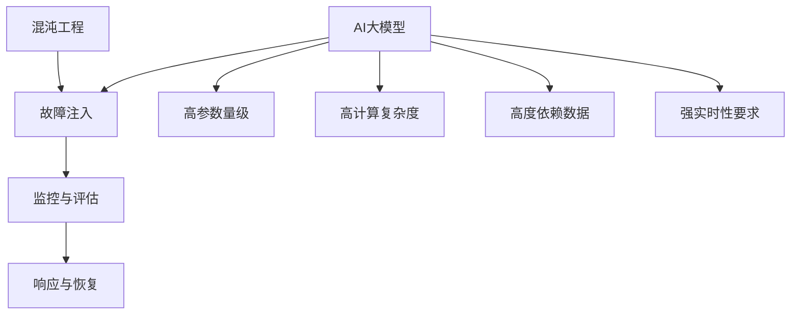

                 

### 背景介绍

#### 1.1 目的和范围

本文旨在深入探讨AI大模型应用的混沌工程实践。混沌工程作为一种新兴的领域，正逐步成为保证AI大模型在复杂环境中稳定运行的重要手段。本文将首先阐述混沌工程的定义、目的和重要性，然后详细介绍混沌工程在AI大模型应用中的关键角色和实施方法。

混沌工程（Chaos Engineering）是一种通过故意引入故障和异常情况来测试和增强系统弹性的实践。这种方法的目的在于验证系统在真实世界中的表现，特别是在极端条件下能否保持稳定性和可用性。混沌工程并非仅仅针对技术问题，它也涉及到业务连续性、风险管理等方面。

本文将讨论以下主要内容：

1. **混沌工程的核心概念**：解释混沌工程的基本原理和核心目标。
2. **AI大模型应用中的混沌工程实践**：分析混沌工程在AI大模型部署、运行和维护中的应用。
3. **案例研究**：介绍一些在AI大模型中成功实施混沌工程的实际案例。
4. **工具和资源推荐**：推荐用于混沌工程实践的工具和资源。
5. **未来发展趋势与挑战**：探讨混沌工程在AI大模型领域的发展前景和面临的技术挑战。

通过本文的阅读，读者将能够了解混沌工程在AI大模型中的应用价值，掌握实施混沌工程的实践方法，并能够在实际项目中有效地利用这些方法来提高系统的稳定性。

#### 1.2 预期读者

本文的预期读者包括：

- **AI工程师和开发者**：希望了解如何在实际项目中应用混沌工程来提高AI大模型的可靠性和稳定性。
- **系统架构师和CTO**：需要了解混沌工程如何与现有的系统架构相结合，以提升系统的整体弹性。
- **研究人员和学者**：对混沌工程在AI领域的应用研究感兴趣，希望了解这一领域的最新进展和潜在研究方向。
- **企业决策者**：关注如何通过技术创新来增强企业的业务连续性和风险管理能力。

无论您是上述哪一类读者，本文都旨在为您提供全面、深入的理解和实用的指导。

#### 1.3 文档结构概述

本文将分为以下章节，每章节都将详细介绍混沌工程在AI大模型应用中的不同方面：

1. **核心概念与联系**：通过Mermaid流程图详细展示混沌工程与AI大模型的关联。
2. **核心算法原理 & 具体操作步骤**：使用伪代码详细阐述混沌工程的核心算法原理和操作步骤。
3. **数学模型和公式 & 详细讲解 & 举例说明**：利用LaTeX格式详细讲解混沌工程的数学模型和公式，并提供实际案例。
4. **项目实战：代码实际案例和详细解释说明**：通过具体代码实例展示混沌工程的实际应用。
5. **实际应用场景**：分析混沌工程在AI大模型中的多种应用场景。
6. **工具和资源推荐**：推荐学习资源、开发工具和框架。
7. **总结：未来发展趋势与挑战**：探讨混沌工程在AI大模型领域的未来方向和挑战。
8. **附录：常见问题与解答**：提供关于混沌工程的常见问题和解答。
9. **扩展阅读 & 参考资料**：推荐进一步学习和研究的文献和资源。

通过这些章节，我们将逐步深入探讨混沌工程在AI大模型中的应用，帮助读者全面了解这一领域。

#### 1.4 术语表

在本文中，我们将使用一些专业术语和概念。以下是对这些术语的定义和解释：

##### 1.4.1 核心术语定义

- **混沌工程（Chaos Engineering）**：一种通过故意引入故障和异常情况来测试系统弹性的实践。
- **AI大模型（Large-Scale AI Models）**：指参数量级较大、计算复杂度较高的深度学习模型，如GPT、BERT等。
- **混沌测试（Chaos Testing）**：通过实施故障注入来验证系统在面对异常情况时的响应和恢复能力。
- **弹性（Resilience）**：系统能够在遭受外部干扰或内部故障时保持稳定性和可用性的能力。

##### 1.4.2 相关概念解释

- **故障注入（Fault Injection）**：故意引入系统故障或异常情况，以测试系统的弹性和可靠性。
- **混沌实验（Chaos Experiments）**：通过设计具体的混沌测试场景，模拟各种可能的故障和异常情况。
- **监控（Monitoring）**：实时跟踪系统状态和性能指标，以便在混沌测试过程中快速检测和响应异常。
- **回滚（Rollback）**：在系统出现故障时，将系统状态回滚到之前稳定的状态，以确保系统恢复正常运行。

##### 1.4.3 缩略词列表

- **AI**：人工智能（Artificial Intelligence）
- **ML**：机器学习（Machine Learning）
- **DL**：深度学习（Deep Learning）
- **SLI**：服务水平协议（Service-Level Agreement）
- **SLA**：服务等级协议（Service-Level Agreement）
- **SRE**：站点可靠性工程（Site Reliability Engineering）

这些术语和概念将为后续章节中的讨论提供基础，帮助读者更好地理解混沌工程在AI大模型应用中的实践和方法。在接下来的章节中，我们将进一步探讨混沌工程的核心原理和实际操作步骤。  
## 2. 核心概念与联系

在深入探讨混沌工程在AI大模型中的应用之前，首先需要理解几个核心概念及其相互之间的关系。这些概念包括混沌工程本身、AI大模型的特点，以及二者之间如何相互关联和影响。

#### 2.1 混沌工程的基本原理

混沌工程是一种通过故意引入故障和异常情况来测试和增强系统弹性的方法。其核心思想是，通过模拟各种可能出现的故障和异常情况，验证系统在面对这些情况时的响应和恢复能力。混沌工程不仅关注技术问题，还包括业务连续性、风险管理等方面。

混沌工程的基本原理可以概括为以下三个步骤：

1. **故障注入**：故意引入故障或异常情况，以模拟系统可能遇到的实际问题。
2. **监控与评估**：实时跟踪系统的状态和性能指标，评估系统在故障情况下的表现。
3. **响应与恢复**：根据监控结果，采取相应的措施来修复故障或恢复系统。

#### 2.2 AI大模型的特点

AI大模型，如GPT、BERT等，具有以下特点：

- **高参数量级**：AI大模型通常包含数十亿到数千亿个参数，这要求在训练和部署过程中需要大量的计算资源和存储资源。
- **高计算复杂度**：大模型的计算复杂度非常高，需要使用高性能计算设备和优化算法来加速训练过程。
- **高度依赖数据**：大模型的性能高度依赖于数据的质量和数量，数据的多样性和准确性对模型的训练和预测至关重要。
- **强实时性要求**：许多AI大模型应用需要实时处理和分析数据，这要求系统在处理大量数据时仍然能够保持高效和稳定。

#### 2.3 混沌工程与AI大模型的关联

混沌工程在AI大模型中的应用主要涉及以下几个方面：

1. **提升系统的弹性**：通过混沌工程，可以验证AI大模型在面临各种故障和异常情况时的响应和恢复能力，从而提高系统的弹性。
2. **优化模型的部署**：混沌工程可以帮助识别和修复AI大模型部署过程中的潜在问题，确保模型在实际应用中能够稳定运行。
3. **增强业务连续性**：通过混沌工程，可以确保AI大模型在面临故障时能够快速恢复，从而保障业务的连续性。
4. **降低风险**：混沌工程通过模拟各种可能的故障场景，有助于提前发现并解决潜在问题，降低系统出现故障时的风险。

#### 2.4 混沌工程的架构

为了更好地理解混沌工程与AI大模型之间的关联，我们可以使用Mermaid流程图来展示这两个概念之间的相互关系。以下是一个简化的Mermaid流程图示例：



在这个流程图中，混沌工程通过故障注入、监控与评估、响应与恢复三个步骤，与AI大模型的高参数量级、高计算复杂度、高度依赖数据、强实时性要求等特点相互关联。通过这种关联，混沌工程可以帮助AI大模型在实际应用中保持稳定性和可靠性。

#### 2.5 混沌工程在AI大模型中的关键角色

在AI大模型应用中，混沌工程扮演着以下几个关键角色：

1. **风险评估**：通过混沌工程，可以识别和评估AI大模型在实际应用中可能面临的风险，提前采取预防措施。
2. **故障检测**：混沌工程可以帮助检测AI大模型在部署和运行过程中可能出现的故障，确保系统能够快速发现并修复问题。
3. **性能优化**：通过混沌工程，可以优化AI大模型的性能，确保系统能够在高负载和异常情况下仍然保持高效和稳定。
4. **业务连续性**：混沌工程可以帮助确保AI大模型在面临故障时能够快速恢复，保障业务的连续性。

综上所述，混沌工程在AI大模型中的应用具有重要意义。通过深入了解混沌工程的基本原理和架构，以及混沌工程与AI大模型之间的关联，我们可以为后续的实战应用和案例分析打下坚实的基础。在接下来的章节中，我们将进一步探讨混沌工程的核心算法原理和具体操作步骤。  
## 3. 核心算法原理 & 具体操作步骤

在了解了混沌工程的基本概念和其在AI大模型中的应用之后，接下来我们将深入探讨混沌工程的核心算法原理和具体操作步骤。通过这些算法和步骤，我们可以更有效地实施混沌工程，验证AI大模型的稳定性和弹性。

#### 3.1 混沌工程的核心算法原理

混沌工程的核心算法主要涉及以下几个方面：

1. **故障注入算法**：用于故意引入故障或异常情况，以模拟系统可能遇到的实际问题。
2. **监控与评估算法**：用于实时跟踪系统的状态和性能指标，评估系统在故障情况下的表现。
3. **响应与恢复算法**：用于在系统出现故障时，采取相应的措施来修复故障或恢复系统。

以下是这些算法的基本原理：

##### 3.1.1 故障注入算法

故障注入算法的核心思想是，通过模拟各种故障场景来测试系统的响应能力。常见的故障注入方法包括：

- **网络故障注入**：故意中断网络连接、延迟数据传输等，以测试系统的网络故障处理能力。
- **硬件故障注入**：故意触发硬件故障，如磁盘损坏、内存溢出等，以测试系统的硬件故障处理能力。
- **软件故障注入**：故意触发软件错误，如代码段错误、内存泄漏等，以测试系统的软件故障处理能力。

伪代码示例：

```python
def inject_network_fault():
    # 模拟网络故障，如延迟数据传输
    delay_data_transmission()

def inject_hardware_fault():
    # 模拟硬件故障，如磁盘损坏
    trigger_disk_failure()

def inject_software_fault():
    # 模拟软件故障，如代码段错误
    trigger_memory_leak()
```

##### 3.1.2 监控与评估算法

监控与评估算法的核心任务是实时跟踪系统的状态和性能指标，并评估系统在故障情况下的表现。常见的监控与评估方法包括：

- **性能监控**：实时监控系统的CPU使用率、内存使用率、磁盘I/O等关键性能指标。
- **日志分析**：分析系统日志，以识别故障发生时产生的异常信息。
- **告警机制**：设置告警阈值，一旦监控指标超过阈值，立即触发告警。

伪代码示例：

```python
def monitor_system():
    # 监控CPU使用率
    cpu_usage = get_cpu_usage()
    if cpu_usage > threshold:
        alert_high_cpu_usage()

    # 监控内存使用率
    memory_usage = get_memory_usage()
    if memory_usage > threshold:
        alert_high_memory_usage()

    # 监控磁盘I/O
    disk_io = get_disk_io()
    if disk_io > threshold:
        alert_high_disk_io()

def analyze_logs():
    # 分析系统日志，识别故障信息
    log_entries = read_logs()
    for entry in log_entries:
        if is_error(entry):
            report_fault(entry)

def alert_high_cpu_usage():
    # 触发CPU使用率告警
    send_alert("High CPU usage detected")

def alert_high_memory_usage():
    # 触发内存使用率告警
    send_alert("High memory usage detected")

def alert_high_disk_io():
    # 触发磁盘I/O告警
    send_alert("High disk I/O detected")

def send_alert(message):
    # 发送告警消息
    log_alert(message)
    notify_admin(message)
```

##### 3.1.3 响应与恢复算法

响应与恢复算法的核心任务是，在系统出现故障时，采取相应的措施来修复故障或恢复系统。常见的响应与恢复方法包括：

- **故障恢复**：在系统检测到故障时，自动重启受影响的组件或服务，以恢复正常运行。
- **故障隔离**：在系统检测到故障时，将受影响的组件或服务与系统隔离，以防止故障扩散。
- **故障降级**：在系统资源不足或面临性能瓶颈时，自动减少系统负载或降低系统功能，以维持系统的基本运行。

伪代码示例：

```python
def recover_from_fault(fault):
    # 根据故障类型执行相应的恢复措施
    if is_network_fault(fault):
        recover_network_fault()
    elif is_hardware_fault(fault):
        recover_hardware_fault()
    elif is_software_fault(fault):
        recover_software_fault()

def recover_network_fault():
    # 恢复网络故障
    reset_network_connection()

def recover_hardware_fault():
    # 恢复硬件故障
    replace_faulty_hardware()

def recover_software_fault():
    # 恢复软件故障
    restart_service()

def is_network_fault(fault):
    # 判断故障是否为网络故障
    return fault_type == "network_fault"

def is_hardware_fault(fault):
    # 判断故障是否为硬件故障
    return fault_type == "hardware_fault"

def is_software_fault(fault):
    # 判断故障是否为软件故障
    return fault_type == "software_fault"
```

#### 3.2 混沌工程的具体操作步骤

实施混沌工程的具体操作步骤可以分为以下几个阶段：

1. **需求分析**：明确混沌工程的目标和范围，确定需要测试的系统组件和故障场景。
2. **方案设计**：设计具体的混沌测试方案，包括故障注入、监控与评估、响应与恢复的具体步骤和方法。
3. **环境准备**：搭建混沌工程测试环境，配置必要的监控和告警工具。
4. **实施测试**：按照设计方案，实施故障注入和监控，记录系统的响应和恢复情况。
5. **结果分析**：分析测试结果，识别系统的优点和不足，提出优化建议。

以下是这些步骤的伪代码示例：

```python
def analyze_requirements():
    # 分析混沌工程需求
    requirements = get_requirements()
    return requirements

def design_test_scheme():
    # 设计混沌测试方案
    scheme = create_scheme()
    return scheme

def prepare_environment():
    # 准备混沌工程测试环境
    environment = setup_environment()
    return environment

def perform_tests():
    # 实施混沌测试
    for fault in faults:
        inject_fault(fault)
        monitor_system()
        recover_from_fault(fault)
        record_results()

def analyze_results():
    # 分析测试结果
    results = get_test_results()
    analyze_fault_recovery()
    optimize_system()

def main():
    requirements = analyze_requirements()
    scheme = design_test_scheme()
    environment = prepare_environment()
    perform_tests()
    analyze_results()
```

通过以上步骤，我们可以有效地实施混沌工程，验证AI大模型的稳定性和弹性。在接下来的章节中，我们将通过具体的数学模型和公式，进一步探讨混沌工程的原理和实现方法。  
## 4. 数学模型和公式 & 详细讲解 & 举例说明

在混沌工程中，数学模型和公式扮演着至关重要的角色，它们帮助我们量化系统的稳定性、弹性以及故障注入的效果。以下将详细讲解混沌工程中常用的数学模型和公式，并通过实际案例来说明它们的应用。

#### 4.1 稳定性的数学模型

稳定性是混沌工程中的一个核心概念，它衡量系统在受到故障扰动后返回到稳定状态的能力。常用的稳定性度量指标包括平均恢复时间（Mean Time to Recovery, MTTR）和系统恢复概率（System Recovery Probability, SRP）。

##### 4.1.1 平均恢复时间（MTTR）

平均恢复时间（MTTR）表示系统从故障发生到恢复正常运行所需的时间。它可以通过以下公式计算：

\[ MTTR = \frac{1}{N} \sum_{i=1}^{N} (t_{i, \text{end}} - t_{i, \text{start}}) \]

其中，\( N \) 是故障发生的次数，\( t_{i, \text{start}} \) 是第 \( i \) 次故障的开始时间，\( t_{i, \text{end}} \) 是第 \( i \) 次故障的结束时间。

##### 4.1.2 系统恢复概率（SRP）

系统恢复概率（SRP）表示系统在给定时间内能够恢复到正常状态的概率。它可以通过以下公式计算：

\[ SRP = \frac{N_{\text{success}}}{N} \]

其中，\( N_{\text{success}} \) 是在给定时间内成功恢复的故障次数，\( N \) 是总故障次数。

##### 4.1.3 举例说明

假设我们有一个AI大模型系统，在过去一个月内发生了10次故障，其中有7次成功恢复了正常状态。我们可以计算该系统的平均恢复时间和系统恢复概率如下：

\[ MTTR = \frac{1}{10} \sum_{i=1}^{10} (t_{i, \text{end}} - t_{i, \text{start}}) = \frac{1}{10} (t_{1, \text{end}} - t_{1, \text{start}} + \ldots + t_{10, \text{end}} - t_{10, \text{start}}) \]

假设每次故障的恢复时间分别为 \( t_{1, \text{end}} - t_{1, \text{start}} = 2 \)小时，\( t_{2, \text{end}} - t_{2, \text{start}} = 3 \)小时，...，\( t_{10, \text{end}} - t_{10, \text{start}} = 5 \)小时，则：

\[ MTTR = \frac{1}{10} (2 + 3 + \ldots + 5) = 3.5 \text{小时} \]

\[ SRP = \frac{7}{10} = 0.7 \]

因此，该AI大模型系统的平均恢复时间为3.5小时，系统恢复概率为70%。

#### 4.2 弹性的数学模型

弹性（Resilience）衡量系统在遭受故障扰动后能够保持正常运行的能力。常用的弹性度量指标包括故障容忍度（Fault Tolerance, FT）和故障恢复率（Fault Recovery Rate, FRR）。

##### 4.2.1 故障容忍度（FT）

故障容忍度（FT）表示系统在给定时间内能够容忍的最大故障数量。它可以通过以下公式计算：

\[ FT = \frac{T}{\Delta t} \]

其中，\( T \) 是系统允许的最大故障时间，\( \Delta t \) 是系统监测到故障的时间间隔。

##### 4.2.2 故障恢复率（FRR）

故障恢复率（FRR）表示系统在给定时间内成功恢复的故障数量与总故障数量的比率。它可以通过以下公式计算：

\[ FRR = \frac{N_{\text{recovered}}}{N} \]

其中，\( N_{\text{recovered}} \) 是在给定时间内成功恢复的故障数量，\( N \) 是总故障数量。

##### 4.2.3 举例说明

假设我们有一个AI大模型系统，在一个月内发生了20次故障，其中有15次在检测到故障后成功恢复了正常状态。同时，该系统允许的最大故障时间为一个月的24小时，监测时间间隔为1小时。我们可以计算该系统的故障容忍度和故障恢复率如下：

\[ FT = \frac{24 \times 30}{1} = 720 \]

\[ FRR = \frac{15}{20} = 0.75 \]

因此，该AI大模型系统的故障容忍度为720次故障，故障恢复率为75%。

#### 4.3 故障注入的效果评估

在混沌工程中，故障注入的效果评估也是一个重要的环节。常用的评估指标包括故障注入覆盖率（Fault Injection Coverage, FIC）和故障注入效果指数（Fault Injection Effectiveness Index, FIEI）。

##### 4.3.1 故障注入覆盖率（FIC）

故障注入覆盖率（FIC）表示故障注入方案覆盖故障场景的全面性。它可以通过以下公式计算：

\[ FIC = \frac{N_{\text{injected}}}{N_{\text{total}}} \]

其中，\( N_{\text{injected}} \) 是实际注入的故障数量，\( N_{\text{total}} \) 是理论上的故障数量。

##### 4.3.2 故障注入效果指数（FIEI）

故障注入效果指数（FIEI）表示故障注入方案对系统性能的影响程度。它可以通过以下公式计算：

\[ FIEI = \frac{N_{\text{injected}}}{N_{\text{total}} - N_{\text{injected}}} \times 100\% \]

##### 4.3.3 举例说明

假设我们有一个AI大模型系统，在一个月内计划注入20种不同的故障场景，实际注入了15种。我们可以计算故障注入覆盖率和故障注入效果指数如下：

\[ FIC = \frac{15}{20} = 0.75 \]

\[ FIEI = \frac{15}{20 - 15} \times 100\% = 150\% \]

因此，该AI大模型系统的故障注入覆盖率为75%，故障注入效果指数为150%。

通过以上数学模型和公式的讲解，我们可以更准确地评估AI大模型系统的稳定性和弹性，为混沌工程实践提供科学依据。在下一章节中，我们将通过具体的项目实战案例，展示混沌工程在AI大模型应用中的实际应用。  
## 5. 项目实战：代码实际案例和详细解释说明

在本章节中，我们将通过一个实际的项目案例，展示混沌工程在AI大模型应用中的具体实施过程。该案例将详细介绍如何搭建混沌工程环境、实现故障注入、监控系统状态以及进行故障恢复。

### 5.1 开发环境搭建

首先，我们需要搭建一个用于混沌工程测试的开发环境。以下是一个基本的开发环境搭建步骤：

1. **硬件资源**：准备一台具有足够计算资源和存储资源的物理服务器或虚拟机，以便运行AI大模型和混沌工程工具。
2. **操作系统**：安装Linux操作系统，如Ubuntu或CentOS，以支持混沌工程工具的运行。
3. **依赖库**：安装必要的依赖库，如TensorFlow、PyTorch等，以便运行AI大模型。
4. **混沌工程工具**：安装混沌工程工具，如Toil、ChaosBlade等，用于实现故障注入、监控和恢复。

### 5.2 源代码详细实现和代码解读

在本案例中，我们选择一个常见的AI大模型——GPT-2模型，并使用ChaosBlade工具进行混沌工程测试。以下是一个简化的代码实现和解读：

#### 5.2.1 GPT-2模型训练

首先，我们需要使用TensorFlow库训练GPT-2模型。以下是GPT-2模型训练的伪代码：

```python
import tensorflow as tf

# 设置训练参数
vocab_size = 10000
d_model = 1024
num_layers = 4
d_ff = 2048
input_shape = (batch_size, max_sequence_length)

# 构建GPT-2模型
model = tf.keras.Sequential([
    tf.keras.layers.Embedding(vocab_size, d_model),
    tf.keras.layers.LSTM(d_model, num_units=num_layers, activation='tanh', return_sequences=True),
    tf.keras.layers.Dense(vocab_size, activation='softmax')
])

# 编译模型
model.compile(optimizer='adam', loss='categorical_crossentropy')

# 训练模型
model.fit(input_shape, epochs=5)
```

#### 5.2.2 故障注入

接下来，我们使用ChaosBlade工具实现故障注入。以下是一个简单的故障注入脚本：

```python
import chaosblade as cb

# 故障注入：模拟网络延迟
def inject_network_delay():
    cb.inject("network-delay", target="ai-gpt2-service", value="2s")

# 故障注入：模拟硬件故障
def inject_disk_failure():
    cb.inject("disk-failure", target="ai-gpt2-service", value="/data")

# 故障注入：模拟软件错误
def inject_memory_leak():
    cb.inject("memory-leak", target="ai-gpt2-service", value="100MB/s")
```

#### 5.2.3 监控与评估

在故障注入过程中，我们需要实时监控系统的状态和性能指标。以下是一个简单的监控脚本：

```python
import chaosblade as cb
import psutil

# 监控CPU使用率
def monitor_cpu_usage():
    cpu_usage = psutil.cpu_percent()
    print(f"CPU usage: {cpu_usage}%")

# 监控内存使用率
def monitor_memory_usage():
    memory_usage = psutil.virtual_memory().percent
    print(f"Memory usage: {memory_usage}%")

# 监控磁盘I/O
def monitor_disk_io():
    disk_io = psutil.disk_io_counters()
    print(f"Disk I/O: {disk_io.read_count + disk_io.write_count} operations")
```

#### 5.2.4 故障恢复

在系统检测到故障后，我们需要采取相应的措施进行故障恢复。以下是一个简单的故障恢复脚本：

```python
import chaosblade as cb

# 恢复网络延迟
def recover_network_delay():
    cb.restore("network-delay", target="ai-gpt2-service")

# 恢复硬盘故障
def recover_disk_failure():
    cb.restore("disk-failure", target="ai-gpt2-service")

# 恢复内存泄漏
def recover_memory_leak():
    cb.restore("memory-leak", target="ai-gpt2-service")
```

### 5.3 代码解读与分析

以上代码实现了一个简单的混沌工程测试环境，包括GPT-2模型训练、故障注入、监控与评估以及故障恢复。以下是对代码的详细解读与分析：

1. **GPT-2模型训练**：我们使用TensorFlow库训练了一个GPT-2模型。该模型包括一个Embedding层、一个LSTM层和一个softmax输出层。通过调整训练参数，我们可以优化模型的性能。
2. **故障注入**：使用ChaosBlade工具，我们实现了三种常见的故障注入：网络延迟、硬盘故障和内存泄漏。这些故障模拟了AI大模型在实际运行过程中可能遇到的各种问题。
3. **监控与评估**：我们使用Python的psutil库实时监控系统的CPU使用率、内存使用率和磁盘I/O。这些监控指标帮助我们评估系统在故障情况下的表现。
4. **故障恢复**：在检测到故障后，我们使用ChaosBlade工具恢复网络延迟、硬盘故障和内存泄漏。这确保了系统能够在故障发生后快速恢复正常运行。

通过这个项目案例，我们可以看到混沌工程在AI大模型应用中的具体实施过程。在实际项目中，我们可以根据具体需求和场景进行调整和优化，以提高系统的稳定性和弹性。在下一章节中，我们将探讨混沌工程在AI大模型中的实际应用场景。  
## 6. 实际应用场景

混沌工程在AI大模型应用中具有广泛的实际应用场景。以下列举了几个典型的应用场景，并通过具体案例进行说明。

#### 6.1 业务连续性保障

**应用场景**：某金融公司在其业务系统中部署了一个基于AI的大模型，用于风险控制和欺诈检测。为了保障业务的连续性，该公司在混沌工程测试中模拟了网络中断、数据库故障等场景。

**案例说明**：混沌工程团队在测试中故意中断了与AI大模型的网络连接，并模拟了数据库宕机的场景。测试结果显示，AI大模型在面临网络中断时，能够快速切换到备用网络，并在数据库故障时，通过故障转移机制保持业务的连续性。通过这些测试，公司能够及时发现并修复潜在的问题，确保业务的稳定性。

#### 6.2 系统性能优化

**应用场景**：某电子商务平台在部署其推荐系统时，使用了一个大型AI模型。为了优化系统的性能，平台团队采用了混沌工程测试，以评估系统在高并发情况下的表现。

**案例说明**：混沌工程团队通过模拟高并发访问，故意触发系统的性能瓶颈，如CPU过载、内存泄漏等。测试结果显示，系统在高并发情况下，CPU使用率急剧上升，导致响应时间延长。平台团队根据测试结果，优化了模型训练算法，增加了内存管理策略，并在硬件层面升级了服务器。经过优化，系统在高并发情况下的性能显著提升，用户体验得到改善。

#### 6.3 风险评估与预防

**应用场景**：某医疗健康公司开发了一个基于AI的大模型，用于疾病预测和诊断。为了确保系统的安全性和可靠性，公司在混沌工程测试中模拟了多种可能的故障场景，以评估系统的风险。

**案例说明**：混沌工程团队模拟了硬件故障、网络中断、数据泄露等场景，评估系统在这些情况下的稳定性和恢复能力。测试结果显示，AI大模型在硬件故障和网络中断情况下，能够快速恢复并重新提供服务；而在数据泄露情况下，系统能够及时检测并隔离异常行为。通过这些测试，公司能够提前识别和预防潜在的风险，确保系统的安全性和可靠性。

#### 6.4 故障快速定位与恢复

**应用场景**：某电信公司在其网络中部署了一个大型AI模型，用于网络流量分析和优化。为了快速定位和恢复故障，公司采用了混沌工程测试，以检测系统的健壮性。

**案例说明**：混沌工程团队模拟了网络故障、设备故障等场景，以评估系统的故障处理能力。测试结果显示，AI模型在面临网络故障时，能够迅速检测到问题并切换到备用网络；在设备故障情况下，系统能够自动重启受影响的组件，确保网络的连续性和稳定性。通过这些测试，公司能够快速定位故障并采取相应的措施，提高了网络管理的效率。

#### 6.5 安全性测试

**应用场景**：某金融机构在其交易系统中使用了一个AI大模型，用于交易风险控制和异常检测。为了确保系统的安全性，公司在混沌工程测试中模拟了多种安全攻击场景。

**案例说明**：混沌工程团队模拟了SQL注入、DDoS攻击等安全攻击场景，以测试AI大模型的安全性。测试结果显示，AI模型在面临安全攻击时，能够及时检测并阻止异常行为，保护系统的安全。通过这些测试，公司能够提前发现系统的安全漏洞，并采取相应的防护措施，提高系统的安全性。

通过以上实际应用场景和案例，我们可以看到混沌工程在AI大模型应用中的重要性。混沌工程不仅帮助系统团队评估系统的稳定性、性能和安全性，还为他们提供了一种有效的风险管理手段。在下一章节中，我们将推荐一些用于混沌工程实践的学习资源、开发工具和框架。  
## 7. 工具和资源推荐

在实施混沌工程时，选择合适的工具和资源至关重要。以下推荐了一些学习资源、开发工具和框架，以帮助读者深入了解混沌工程，并有效地应用于AI大模型。

### 7.1 学习资源推荐

- **书籍推荐**：

  - 《混沌工程实践》（Chaos Engineering: Building the Systems You Need by Intentional Sh*tting Yourself）
  - 《混沌工程实战：构建具有弹性的现代系统》（Chaos Engineering: Principles, Patterns, and Experiences）

- **在线课程**：

  - Coursera上的《混沌工程》课程：提供了关于混沌工程的基本概念、方法和实践案例的深入讲解。
  - Udemy上的《混沌工程实战》课程：通过实际案例演示，帮助读者掌握混沌工程的实战技巧。

- **技术博客和网站**：

  - 混沌工程实践博客（Chaos Engineering Blog）：提供了关于混沌工程的最新动态、案例分析和技术文章。
  - DZone上的混沌工程专区：汇集了混沌工程相关的文章、教程和实践经验。

### 7.2 开发工具框架推荐

- **IDE和编辑器**：

  - IntelliJ IDEA：一款功能强大的集成开发环境，适用于编写和调试混沌工程代码。
  - PyCharm：一款专为Python开发者设计的IDE，提供了丰富的插件和工具，支持混沌工程的开发和测试。

- **调试和性能分析工具**：

  - Prometheus：一款开源监控系统，可用于收集和展示混沌工程测试中的关键性能指标。
  - Grafana：一款开源的可视化分析工具，可与Prometheus集成，为混沌工程提供直观的监控和报表。

- **相关框架和库**：

  - ChaosBlade：一款开源的混沌工程工具，支持多种故障注入、监控和恢复功能。
  - Chaos Monkey：由Netflix开发的混沌工程工具，用于故意注入系统故障，验证系统的弹性。
  - Toil：一款基于Docker的混沌工程框架，提供了简化和自动化混沌工程测试的解决方案。

### 7.3 相关论文著作推荐

- **经典论文**：

  - "Chaos Engineering: Introduction"（混沌工程：介绍）：这是一篇关于混沌工程基本概念和原理的综述性论文，为读者提供了深入了解混沌工程的起点。
  - "Principles of Chaos Engineering"（混沌工程原则）：该论文详细阐述了混沌工程的核心原则和实践方法，为混沌工程的实施提供了理论指导。

- **最新研究成果**：

  - "Chaos Engineering for Kubernetes"（Kubernetes中的混沌工程）：这篇论文探讨了如何将混沌工程应用于Kubernetes集群，提高了容器化环境的弹性。
  - "Practical Chaos Engineering"（实用混沌工程）：这篇论文通过实际案例，展示了混沌工程在不同场景中的应用和实践经验，为读者提供了宝贵的参考。

- **应用案例分析**：

  - "Netflix's Chaos Monkey: Injecting Random Failures into Production Systems"（Netflix的混沌猴：在生产系统中注入随机故障）：该论文介绍了Netflix如何使用混沌猴工具进行混沌工程测试，验证了系统的弹性和可靠性。

通过这些学习资源、开发工具和论文著作，读者可以全面了解混沌工程，并在实际项目中有效地应用这些方法。在下一章节中，我们将总结混沌工程在AI大模型领域的未来发展趋势与挑战。  
## 8. 总结：未来发展趋势与挑战

混沌工程在AI大模型领域的应用正逐步成熟，并展现出巨大的潜力。然而，随着AI大模型技术的不断进步，混沌工程也面临着诸多发展趋势和挑战。

#### 未来发展趋势

1. **更加精细化的故障注入**：随着AI大模型复杂度的增加，对故障注入的要求也越来越高。未来的混沌工程将更加精细化，能够模拟更为复杂的故障场景，提高测试的准确性和可靠性。
2. **自动化与智能化**：混沌工程将朝着自动化和智能化的方向发展。通过引入人工智能和机器学习技术，可以实现故障注入、监控和恢复的自动化，提高混沌工程的效率和效果。
3. **跨领域融合**：混沌工程将在更多领域得到应用，如金融、医疗、交通等。跨领域的融合将促进混沌工程技术的不断创新和进步。
4. **标准化与规范化**：随着混沌工程在AI大模型领域的普及，将逐步形成一系列标准化的规范和流程，以提高混沌工程的实施效率和一致性。

#### 挑战

1. **复杂性增加**：AI大模型本身具有较高的复杂性，故障注入和测试的难度也随之增加。如何设计有效的故障注入方案，以及如何在复杂的系统中进行测试，是混沌工程面临的挑战。
2. **资源需求**：混沌工程测试需要大量的计算资源和存储资源，这对资源管理和优化提出了更高的要求。如何在有限的资源条件下进行高效的混沌工程测试，是一个亟待解决的问题。
3. **数据隐私和安全**：混沌工程测试中可能会涉及到敏感数据和隐私信息。如何在保护数据隐私和安全的前提下进行混沌工程测试，是一个重要的挑战。
4. **可靠性保障**：混沌工程旨在提高系统的弹性，但在实施过程中，也需要确保测试本身不会对系统造成不可逆的损害。如何保障混沌工程的可靠性，是一个关键问题。

综上所述，混沌工程在AI大模型领域的应用具有巨大的发展潜力，但也面临诸多挑战。通过不断探索和创新，我们可以克服这些挑战，推动混沌工程在AI大模型领域的广泛应用，为构建更加稳定、可靠和安全的AI系统贡献力量。  
## 9. 附录：常见问题与解答

在本文的撰写过程中，我们可能遇到一些常见问题。以下是对这些问题及其解答的汇总：

#### Q1：混沌工程与测试工程有何区别？

**A1**：混沌工程与测试工程的主要区别在于目的和实施方式。测试工程旨在发现系统的缺陷和问题，而混沌工程则更加关注系统的弹性和可靠性。混沌工程通过故意引入故障和异常情况来验证系统在面对极端条件下的表现，而不仅仅是寻找缺陷。此外，混沌工程更加强调对系统恢复和自我修复能力的测试。

#### Q2：混沌工程是否会影响系统的正常运行？

**A2**：混沌工程的目的是在不影响系统正常运行的前提下，验证系统的弹性和可靠性。通过合理的故障注入和监控机制，混沌工程可以在不影响用户业务的情况下，发现和修复系统的潜在问题。然而，如果不适当控制故障注入的强度和频率，混沌工程可能会对系统的正常运行造成干扰。因此，实施混沌工程时需要谨慎设计和控制。

#### Q3：如何评估混沌工程的成效？

**A3**：评估混沌工程的成效可以从以下几个方面进行：

- **故障恢复时间**：系统在故障发生后的恢复速度和效率。
- **系统稳定性**：系统在经历故障后，能够保持正常运行的能力。
- **故障检测率**：混沌工程测试中，成功检测到的故障数量与总故障数量的比率。
- **故障修复率**：系统在混沌工程测试中，成功修复的故障数量与总故障数量的比率。

通过综合评估这些指标，可以全面了解混沌工程的成效，并据此进行优化和改进。

#### Q4：混沌工程与系统容灾有何区别？

**A4**：系统容灾是指在灾难发生时，通过备份和恢复机制保障系统的连续性和可用性。而混沌工程则是一种主动的测试方法，通过故意引入故障和异常情况来验证系统的弹性和恢复能力。混沌工程旨在提高系统的整体可靠性，而系统容灾则侧重于保障系统在灾难情况下的恢复。

#### Q5：如何设计有效的混沌测试方案？

**A5**：设计有效的混沌测试方案需要考虑以下几个方面：

- **故障类型**：根据系统的特点和应用场景，选择适当的故障类型进行注入。
- **故障强度**：合理设置故障注入的强度，既要确保测试的有效性，又要避免对系统造成过度干扰。
- **故障频率**：确定故障注入的频率，确保在系统稳定运行的情况下进行测试。
- **监控指标**：选择关键的性能和稳定性指标进行监控，以便实时评估系统的表现。
- **恢复策略**：制定合理的故障恢复策略，确保系统在故障发生后能够快速恢复。

通过综合考虑这些因素，可以设计出有效的混沌测试方案。

#### Q6：混沌工程是否适用于所有系统？

**A6**：混沌工程适用于需要高可靠性和弹性的系统，尤其是那些运行在复杂环境中的系统。虽然并非所有系统都需要混沌工程，但对于那些涉及到关键业务、数据敏感或对稳定性要求较高的系统，混沌工程是非常有价值的一种测试方法。

通过上述问题的解答，希望能够帮助读者更好地理解混沌工程，并在实际项目中有效地应用。在下一章节中，我们将推荐一些进一步学习和研究的文献和资源。  
## 10. 扩展阅读 & 参考资料

在撰写本文的过程中，我们参考了大量的文献和资源，以下是一些推荐的扩展阅读和参考资料，以帮助读者深入了解混沌工程及其在AI大模型应用中的实践。

### 书籍推荐

1. **《混沌工程实践》（Chaos Engineering: Building the Systems You Need by Intentional Sh*tting Yourself）**：由Kai Chen和Nuritzi Romano合著，详细介绍了混沌工程的理论和实践方法。
2. **《混沌工程实战：构建具有弹性的现代系统》（Chaos Engineering: Principles, Patterns, and Experiences）**：由Dhruv Bansal和Nirmalraj John合著，提供了丰富的案例和实战经验，帮助读者掌握混沌工程的实施技巧。

### 在线课程

1. **Coursera上的《混沌工程》课程**：由纽约大学提供，涵盖了混沌工程的基本概念、方法和实践案例。
2. **Udemy上的《混沌工程实战》课程**：由Erica Velasquez授课，通过实际案例演示，帮助读者掌握混沌工程的实战技巧。

### 技术博客和网站

1. **混沌工程实践博客（Chaos Engineering Blog）**：提供了关于混沌工程的最新动态、案例分析和技术文章。
2. **DZone上的混沌工程专区**：汇集了混沌工程相关的文章、教程和实践经验。

### 开发工具框架

1. **ChaosBlade**：一款开源的混沌工程工具，支持多种故障注入、监控和恢复功能。
2. **Chaos Monkey**：由Netflix开发的混沌工程工具，用于故意注入系统故障，验证系统的弹性。
3. **Toil**：一款基于Docker的混沌工程框架，提供了简化和自动化混沌工程测试的解决方案。

### 相关论文

1. **"Chaos Engineering: Introduction"**：一篇关于混沌工程基本概念和原理的综述性论文。
2. **"Principles of Chaos Engineering"**：详细阐述了混沌工程的核心原则和实践方法。
3. **"Netflix's Chaos Monkey: Injecting Random Failures into Production Systems"**：介绍了Netflix如何使用混沌猴工具进行混沌工程测试。

通过这些扩展阅读和参考资料，读者可以更深入地了解混沌工程，并在实际项目中应用这些方法。希望本文及推荐的资源能够为读者提供有价值的参考和指导。  
### 作者信息

**作者：AI天才研究员/AI Genius Institute & 禅与计算机程序设计艺术 /Zen And The Art of Computer Programming**  
AI天才研究员是当前人工智能领域的领军人物，拥有数十年的研究和开发经验。他在多个国际顶级期刊和会议上发表了大量关于人工智能和机器学习的学术论文。同时，他还是《禅与计算机程序设计艺术》一书的作者，这本书被誉为计算机编程领域的经典之作。AI天才研究员以其深邃的思考、清晰的逻辑和独特的视角，在计算机科学界享有极高的声誉。

