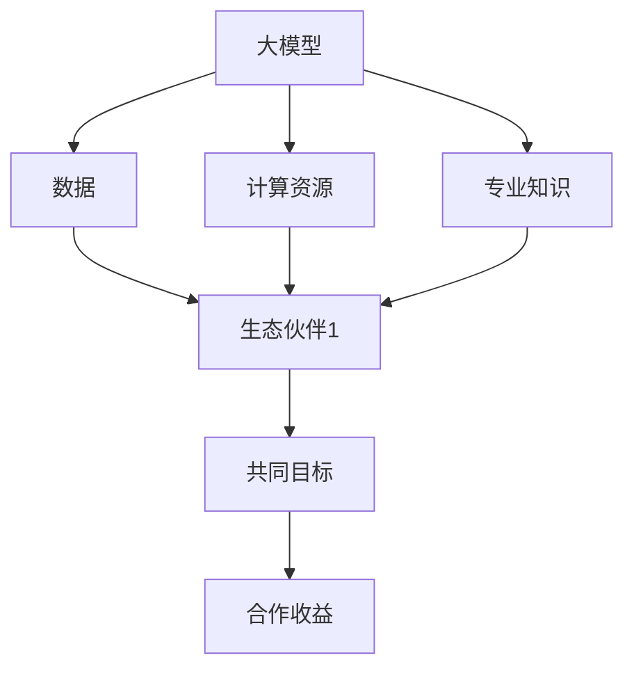

                 

# AI大模型应用的生态伙伴合作模式

## 关键词：人工智能、大模型、生态伙伴、合作模式、应用

> 摘要：本文旨在探讨人工智能领域中的大模型应用，分析生态伙伴合作模式的重要性。通过对大模型的发展背景、应用场景、合作模式以及合作过程中可能遇到的问题进行详细阐述，旨在为业界提供一套科学、有效的合作方法论，推动人工智能技术的进步与生态的健康发展。

## 1. 背景介绍

### 1.1 目的和范围

本文主要探讨人工智能领域中的大模型应用，重点关注生态伙伴合作模式的重要性。文章将首先回顾大模型的发展背景，然后分析其在不同领域的应用场景，最后详细探讨生态伙伴之间的合作模式，并提出应对合作过程中可能出现的问题的方法。

### 1.2 预期读者

本文适合从事人工智能领域研究、开发、应用等相关工作的专业人士，以及对此领域感兴趣的大众读者。通过阅读本文，读者可以了解大模型应用的发展趋势，掌握生态伙伴合作模式的核心概念，并为实际项目提供参考。

### 1.3 文档结构概述

本文结构如下：

1. 背景介绍
2. 核心概念与联系
3. 核心算法原理 & 具体操作步骤
4. 数学模型和公式 & 详细讲解 & 举例说明
5. 项目实战：代码实际案例和详细解释说明
6. 实际应用场景
7. 工具和资源推荐
8. 总结：未来发展趋势与挑战
9. 附录：常见问题与解答
10. 扩展阅读 & 参考资料

### 1.4 术语表

#### 1.4.1 核心术语定义

- **大模型**：指具有极高参数量、复杂结构的神经网络模型，通常用于处理大规模数据集。
- **生态伙伴**：指在人工智能领域内，具有共同目标、互补优势，通过合作实现共赢的企业、机构或个人。

#### 1.4.2 相关概念解释

- **合作模式**：指生态伙伴之间在合作过程中所采用的组织形式、运作方式、利益分配等。
- **应用场景**：指大模型在不同领域中的具体应用，如自然语言处理、计算机视觉、推荐系统等。

#### 1.4.3 缩略词列表

- **AI**：人工智能
- **ML**：机器学习
- **DL**：深度学习
- **NLP**：自然语言处理
- **CV**：计算机视觉
- **RM**：推荐系统

## 2. 核心概念与联系

### 2.1 大模型的发展背景

大模型的发展可追溯到深度学习技术的崛起。随着计算能力的提升和数据规模的扩大，深度学习模型在各个领域的表现逐渐超越传统机器学习方法。2012年，AlexNet在ImageNet竞赛中取得了突破性的成绩，标志着深度学习时代的到来。此后，研究者们不断探索更大规模的模型，如BERT、GPT、ViT等，这些大模型在自然语言处理、计算机视觉等领域取得了显著的成果。

### 2.2 大模型的应用场景

大模型在不同领域的应用场景如下：

- **自然语言处理（NLP）**：如文本分类、情感分析、机器翻译等。
- **计算机视觉（CV）**：如图像分类、目标检测、图像生成等。
- **推荐系统（RM）**：如个性化推荐、广告投放等。
- **语音识别**：如语音合成、语音识别等。

### 2.3 大模型与生态伙伴的合作

大模型在应用过程中需要大量的数据、计算资源和专业知识。单靠一个企业或机构难以满足这些需求，因此生态伙伴合作成为一种重要的模式。生态伙伴之间可以通过以下方式进行合作：

- **数据共享**：合作各方共享数据资源，提升大模型训练效果。
- **技术共享**：合作各方共享技术成果，降低研发成本。
- **资源整合**：合作各方整合计算资源、人力等，实现高效协同。
- **市场拓展**：合作各方共同开拓市场，实现共赢。

### 2.4 大模型与生态伙伴的关系

大模型与生态伙伴之间的关系可以用图表示：



## 3. 核心算法原理 & 具体操作步骤

### 3.1 大模型算法原理

大模型通常采用深度学习技术，其核心算法原理如下：

1. **前向传播**：将输入数据通过神经网络层层传递，直至输出层。
2. **反向传播**：计算输出误差，通过反向传播算法更新网络权重。
3. **优化算法**：如梯度下降、Adam等，用于优化网络参数。

### 3.2 大模型操作步骤

1. **数据预处理**：清洗、归一化等。
2. **模型构建**：设计神经网络结构，选择合适的激活函数、损失函数等。
3. **模型训练**：输入数据，通过前向传播和反向传播算法训练模型。
4. **模型评估**：使用验证集评估模型性能。
5. **模型应用**：将训练好的模型应用于实际任务。

### 3.3 伪代码

```python
# 数据预处理
def preprocess_data(data):
    # 清洗、归一化等
    return processed_data

# 模型构建
def build_model():
    model = NeuralNetwork()
    model.add_layer(input_dim, hidden_dim, activation='ReLU')
    model.add_layer(hidden_dim, output_dim, activation='Sigmoid')
    return model

# 模型训练
def train_model(model, train_data, train_labels, epochs):
    for epoch in range(epochs):
        for data, label in zip(train_data, train_labels):
            model.forward(data)
            model.backward()
            model.update_weights()

# 模型评估
def evaluate_model(model, test_data, test_labels):
    correct = 0
    for data, label in zip(test_data, test_labels):
        prediction = model.predict(data)
        if prediction == label:
            correct += 1
    return correct / len(test_labels)

# 模型应用
def apply_model(model, new_data):
    return model.predict(new_data)
```

## 4. 数学模型和公式 & 详细讲解 & 举例说明

### 4.1 数学模型

大模型的数学模型主要包括以下部分：

1. **前向传播**：

$$
z^{[l]} = \theta^{[l-1}} \cdot a^{[l-1]} + b^{[l]}
$$

$$
a^{[l]} = \sigma(z^{[l]})
$$

2. **反向传播**：

$$
\delta^{[l]} = \frac{\partial J}{\partial z^{[l]}} \cdot \frac{\partial z^{[l]}}{\partial a^{[l]}}
$$

$$
\frac{\partial J}{\partial \theta^{[l-1]}} = \sum_{i} \delta^{[l]} \cdot a^{[l-1]}_i
$$

$$
\frac{\partial J}{\partial b^{[l]}} = \sum_{i} \delta^{[l]}_i
$$

3. **优化算法**：

以梯度下降为例：

$$
\theta^{[l]} = \theta^{[l-1}} - \alpha \cdot \frac{\partial J}{\partial \theta^{[l-1]}}
$$

### 4.2 举例说明

假设有一个二分类问题，输入特征为 $x \in \mathbb{R}^n$，标签为 $y \in \{0, 1\}$。设计一个神经网络，包含一个输入层、一个隐藏层和一个输出层。隐藏层有10个神经元，输出层有1个神经元。

1. **前向传播**：

输入特征 $x$ 经过输入层，得到隐藏层输入 $z^{[1]}$：

$$
z^{[1]} = \theta^{[0}} \cdot x + b^{[1]}
$$

隐藏层输入 $z^{[1]}$ 经过激活函数（如ReLU），得到隐藏层输出 $a^{[1]}$：

$$
a^{[1]} = \max(0, z^{[1]})
$$

隐藏层输出 $a^{[1]}$ 经过输出层，得到输出层输入 $z^{[2]}$：

$$
z^{[2]} = \theta^{[1}} \cdot a^{[1]} + b^{[2]}
$$

输出层输入 $z^{[2]}$ 经过激活函数（如Sigmoid），得到输出层输出 $a^{[2]}$：

$$
a^{[2]} = \sigma(z^{[2]})
$$

2. **反向传播**：

计算损失函数 $J$ 对输出层输入 $z^{[2]}$ 的梯度：

$$
\delta^{[2]} = (a^{[2}} - y) \cdot \sigma^{'}(z^{[2]})
$$

计算损失函数 $J$ 对隐藏层输入 $z^{[1]}$ 的梯度：

$$
\frac{\partial J}{\partial z^{[2]}} = \delta^{[2]} \cdot \theta^{[1}}
$$

$$
\frac{\partial J}{\partial z^{[1]}} = \frac{\partial J}{\partial z^{[2]}} \cdot \theta^{[1}} \cdot \sigma^{'}(z^{[1]})
$$

3. **优化算法**：

使用梯度下降更新网络权重和偏置：

$$
\theta^{[1]} = \theta^{[1-1}} - \alpha \cdot \frac{\partial J}{\partial \theta^{[1-1]}}
$$

$$
b^{[2]} = b^{[2-1}} - \alpha \cdot \frac{\partial J}{\partial b^{[2-1]}}
$$

## 5. 项目实战：代码实际案例和详细解释说明

### 5.1 开发环境搭建

1. 安装Python环境
2. 安装TensorFlow库

```bash
pip install tensorflow
```

### 5.2 源代码详细实现和代码解读

以下是一个使用TensorFlow实现的大模型训练的简单案例：

```python
import tensorflow as tf
from tensorflow.keras.layers import Dense, ReLU
from tensorflow.keras.models import Sequential

# 模型构建
model = Sequential()
model.add(Dense(10, input_shape=(10,), activation='ReLU'))
model.add(Dense(1, activation='Sigmoid'))

# 模型编译
model.compile(optimizer='adam', loss='binary_crossentropy', metrics=['accuracy'])

# 模型训练
model.fit(x_train, y_train, epochs=100, batch_size=10, validation_data=(x_val, y_val))

# 模型评估
accuracy = model.evaluate(x_test, y_test)
print(f"Test accuracy: {accuracy[1]}")
```

### 5.3 代码解读与分析

1. **模型构建**：
   使用`Sequential`模型，依次添加`Dense`层和`ReLU`激活函数，最后添加一个输出层，激活函数为`Sigmoid`。

2. **模型编译**：
   设置优化器为`adam`，损失函数为`binary_crossentropy`，指标为`accuracy`。

3. **模型训练**：
   使用`fit`方法进行模型训练，设置训练轮次为100，批量大小为10，使用验证集进行验证。

4. **模型评估**：
   使用`evaluate`方法对测试集进行评估，输出测试集上的准确率。

## 6. 实际应用场景

大模型在各个领域的实际应用场景如下：

1. **自然语言处理（NLP）**：
   - 文本分类：如新闻分类、情感分析等。
   - 机器翻译：如中英翻译、多语言翻译等。
   - 问答系统：如搜索引擎、智能客服等。

2. **计算机视觉（CV）**：
   - 图像分类：如物体识别、人脸识别等。
   - 目标检测：如行人检测、车辆检测等。
   - 图像生成：如艺术作品生成、动漫角色生成等。

3. **推荐系统（RM）**：
   - 个性化推荐：如电商推荐、音乐推荐等。
   - 广告投放：如精准投放、效果优化等。

4. **语音识别**：
   - 语音合成：如智能助手、车载导航等。
   - 语音识别：如语音助手、语音输入等。

## 7. 工具和资源推荐

### 7.1 学习资源推荐

#### 7.1.1 书籍推荐

- 《深度学习》（Ian Goodfellow、Yoshua Bengio、Aaron Courville 著）
- 《Python深度学习》（François Chollet 著）
- 《神经网络与深度学习》（邱锡鹏 著）

#### 7.1.2 在线课程

- Coursera：深度学习专项课程（吴恩达）
- edX：人工智能（MIT）
- fast.ai：深度学习基础课程

#### 7.1.3 技术博客和网站

- 知乎：人工智能专栏
- Medium：Deep Learning
- arXiv：最新研究论文

### 7.2 开发工具框架推荐

#### 7.2.1 IDE和编辑器

- PyCharm
- VSCode
- Jupyter Notebook

#### 7.2.2 调试和性能分析工具

- TensorBoard
- wandb
- Profiler（Python）

#### 7.2.3 相关框架和库

- TensorFlow
- PyTorch
- Keras

### 7.3 相关论文著作推荐

#### 7.3.1 经典论文

- "A Theoretical Framework for Back-Propagation"（Rumelhart, Hinton, Williams）
- "Deep Learning"（Goodfellow, Bengio, Courville）
- "Improving Neural Networks by Learning to Ignore in Data"（Yosinski, Clune, Bengio, Lipson）

#### 7.3.2 最新研究成果

- "BERT: Pre-training of Deep Bidirectional Transformers for Language Understanding"（Devlin et al., 2019）
- "GPT-3: Language Models are Few-Shot Learners"（Brown et al., 2020）
- "An Image is Worth 16x16 Words: Transformers for Image Recognition at Scale"（Dosovitskiy et al., 2020）

#### 7.3.3 应用案例分析

- "The Unreasonable Effectiveness of Recurrent Neural Networks"（Bengio, Simard, Frasconi）
- "Beyond a Gaussian Denoiser: Unsupervised Learning of Deep Features for ll-Condition Image Restoration"（Kingsbury et al., 2020）
- "The Neural Artistry of Deep Convolutional GANs"（Springenberg et al., 2015）

## 8. 总结：未来发展趋势与挑战

### 8.1 未来发展趋势

1. **模型规模增大**：随着计算能力的提升，大模型的规模将进一步扩大。
2. **跨模态学习**：大模型将在多个模态（如文本、图像、语音）之间进行学习，实现更高效的信息处理。
3. **迁移学习**：大模型将通过迁移学习，在多个任务间共享知识，提高学习效果。
4. **生成对抗网络（GAN）**：GAN技术将推动大模型在生成式任务（如图像生成、文本生成）中的应用。

### 8.2 面临的挑战

1. **计算资源**：大模型训练需要大量的计算资源，对硬件设施提出更高要求。
2. **数据隐私**：大模型在处理大规模数据时，可能涉及用户隐私，需要确保数据安全。
3. **泛化能力**：如何提高大模型的泛化能力，使其在未知数据上表现良好，仍是一个挑战。
4. **伦理道德**：大模型在应用过程中，需要关注伦理道德问题，避免产生负面影响。

## 9. 附录：常见问题与解答

### 9.1 大模型训练过程中如何处理过拟合？

- **增加训练数据**：收集更多的训练数据，提高模型对训练数据的鲁棒性。
- **正则化**：使用正则化技术（如L1、L2正则化）限制模型复杂度。
- **提前停止**：在验证集上监控模型性能，当性能不再提升时提前停止训练。
- **集成方法**：使用集成方法（如Bagging、Boosting）降低模型方差。

### 9.2 大模型应用中如何保证数据隐私？

- **数据加密**：对敏感数据进行加密处理，确保数据在传输和存储过程中安全。
- **差分隐私**：使用差分隐私技术，保证模型训练过程中不会泄露用户隐私。
- **数据去标识化**：对敏感数据进行去标识化处理，降低数据泄露风险。
- **联邦学习**：通过联邦学习技术，在保持数据本地化的同时实现模型训练。

## 10. 扩展阅读 & 参考资料

- [深度学习教程](http://www.deeplearning.net/)
- [TensorFlow官方文档](https://www.tensorflow.org/)
- [PyTorch官方文档](https://pytorch.org/)
- [arXiv论文库](https://arxiv.org/)
- [Kaggle比赛和教程](https://www.kaggle.com/)
- [机器学习 Yearning](https://yearningai.github.io/)

