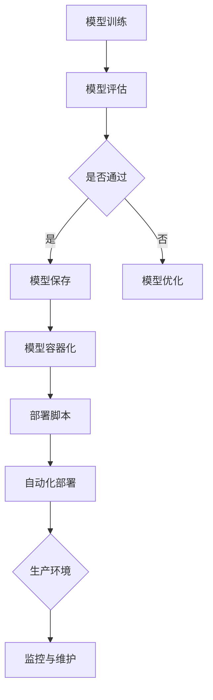

                 

# AI大模型应用的部署自动化与标准化

> **关键词：** AI大模型、部署自动化、标准化、容器化、微服务架构、持续集成与持续部署（CI/CD）

> **摘要：** 随着人工智能（AI）技术的快速发展，大模型的应用越来越广泛。为了满足生产环境中对模型性能、可靠性、可扩展性的要求，实现大模型的部署自动化和标准化变得至关重要。本文将探讨AI大模型部署过程中面临的挑战，介绍部署自动化和标准化的核心概念，并通过实际案例详细解析部署流程，最后对未来的发展趋势与挑战进行展望。

## 1. 背景介绍

### 1.1 目的和范围

本文旨在探讨如何实现AI大模型的自动化部署与标准化流程。我们将分析当前AI部署中存在的问题，介绍相关的技术概念，并通过实例展示如何构建自动化部署系统。

### 1.2 预期读者

本文面向对AI、机器学习和软件开发有一定了解的技术人员。期望读者能够通过本文掌握大模型部署的自动化和标准化方法。

### 1.3 文档结构概述

本文分为以下几个部分：

1. **背景介绍**：介绍本文的目的和结构。
2. **核心概念与联系**：介绍AI大模型部署相关的重要概念和流程。
3. **核心算法原理与具体操作步骤**：讲解大模型部署的算法原理和操作步骤。
4. **数学模型和公式**：详细解释相关的数学模型和公式。
5. **项目实战**：通过具体案例展示部署过程。
6. **实际应用场景**：分析大模型部署在不同场景中的应用。
7. **工具和资源推荐**：推荐相关学习资源和工具。
8. **总结**：总结未来发展趋势与挑战。
9. **附录**：常见问题与解答。
10. **扩展阅读与参考资料**：提供进一步学习的资源。

### 1.4 术语表

#### 1.4.1 核心术语定义

- **AI大模型**：指训练数据量庞大、参数规模巨大的机器学习模型，如GPT、BERT等。
- **部署自动化**：通过工具和脚本自动完成模型部署的过程。
- **标准化**：制定统一的部署规范和流程，确保模型在不同环境中的兼容性和可复用性。
- **容器化**：将应用程序及其依赖打包到一个容器中，实现环境的一致性。
- **微服务架构**：将应用程序划分为多个小型服务，每个服务独立部署和扩展。

#### 1.4.2 相关概念解释

- **持续集成（CI）**：将代码更改自动集成到主分支，进行测试和构建。
- **持续部署（CD）**：在经过CI验证后的代码更改自动部署到生产环境。
- **Kubernetes**：用于容器编排的开源平台，可实现自动化部署、扩展和管理容器化应用。

#### 1.4.3 缩略词列表

- **AI**：人工智能
- **ML**：机器学习
- **CI**：持续集成
- **CD**：持续部署
- **Kubernetes**：K8s

## 2. 核心概念与联系

为了更好地理解AI大模型部署的自动化和标准化，首先需要了解一些核心概念和流程。以下是相关概念原理和架构的Mermaid流程图：



### 2.1 模型训练与评估

模型训练是通过大量数据进行迭代优化，目标是提升模型的准确性和泛化能力。模型评估则是在测试集上验证模型性能，确保模型在未知数据上的表现良好。

### 2.2 模型保存与容器化

训练完成后，需要将模型保存下来，以便后续部署和使用。容器化是将模型及其依赖打包到一个容器中，确保在不同环境中的一致性。

### 2.3 部署脚本与自动化部署

部署脚本用于自动化执行部署任务，包括环境配置、容器启动等。通过CI/CD工具，可以实现自动化部署，提高部署效率和可靠性。

### 2.4 生产环境与监控维护

部署完成后，需要对生产环境进行监控和维护，确保模型的稳定运行。监控工具可以帮助及时发现和解决问题，提高系统的可用性。

## 3. 核心算法原理与具体操作步骤

### 3.1 模型训练算法

模型训练是部署过程的基础，其核心算法为梯度下降。以下是梯度下降算法的伪代码：

```python
def gradient_descent(model, training_data, learning_rate, epochs):
    for epoch in range(epochs):
        for data in training_data:
            prediction = model.predict(data.input)
            error = data.target - prediction
            model.update_weights(error, learning_rate)
```

### 3.2 模型评估算法

模型评估的核心是计算准确率、召回率等指标。以下是评估算法的伪代码：

```python
def evaluate_model(model, test_data):
    total_samples = len(test_data)
    correct_predictions = 0
    for data in test_data:
        prediction = model.predict(data.input)
        if prediction == data.target:
            correct_predictions += 1
    accuracy = correct_predictions / total_samples
    return accuracy
```

### 3.3 模型容器化

容器化是将模型打包到Docker容器中。以下是Dockerfile的示例：

```dockerfile
FROM tensorflow/tensorflow:2.7.0

WORKDIR /app

COPY model.py .

RUN pip install -r requirements.txt

CMD ["python", "model.py"]
```

### 3.4 自动化部署脚本

自动化部署脚本用于自动化执行部署任务。以下是自动化部署的Shell脚本示例：

```bash
#!/bin/bash

# 拉取最新代码
git pull

# 构建容器镜像
docker build -t my_model .

# 删除旧容器
docker stop my_model
docker rm my_model

# 运行新容器
docker run -d --name my_model -p 8080:80 my_model
```

## 4. 数学模型和公式及详细讲解

在AI大模型部署过程中，数学模型和公式扮演着重要角色。以下是几个关键的数学模型和公式及其解释：

### 4.1 梯度下降算法中的损失函数

损失函数用于评估模型预测结果与真实结果之间的差距。常用的损失函数包括均方误差（MSE）和交叉熵损失（Cross-Entropy Loss）。

$$
MSE = \frac{1}{n} \sum_{i=1}^{n} (\hat{y}_i - y_i)^2
$$

$$
Cross-Entropy Loss = -\frac{1}{n} \sum_{i=1}^{n} y_i \log(\hat{y}_i)
$$

其中，$\hat{y}_i$为模型预测值，$y_i$为真实值，$n$为样本数量。

### 4.2 梯度下降算法中的学习率

学习率（learning rate）控制模型更新速度。合适的学习率可以加快收敛速度，而太大或太小都会影响收敛效果。

### 4.3 模型评估指标

模型评估指标用于衡量模型性能。常用的评估指标包括准确率（Accuracy）、召回率（Recall）和F1分数（F1 Score）。

$$
Accuracy = \frac{TP + TN}{TP + FN + FP + TN}
$$

$$
Recall = \frac{TP}{TP + FN}
$$

$$
F1 Score = \frac{2 \times Precision \times Recall}{Precision + Recall}
$$

其中，$TP$为真实为正类且被预测为正类的样本数量，$TN$为真实为负类且被预测为负类的样本数量，$FP$为真实为负类但被预测为正类的样本数量，$FN$为真实为正类但被预测为负类的样本数量。

## 5. 项目实战：代码实际案例和详细解释说明

### 5.1 开发环境搭建

首先，我们需要搭建一个开发环境，用于模型训练、容器化以及部署。以下是开发环境的搭建步骤：

1. 安装Docker：
```bash
sudo apt-get update
sudo apt-get install docker-ce docker-ce-cli containerd.io
```

2. 安装TensorFlow：
```bash
pip install tensorflow
```

3. 创建一个名为`ai_model`的文件夹，并在其中创建`Dockerfile`、`model.py`和`requirements.txt`文件。

### 5.2 源代码详细实现和代码解读

**Dockerfile：**

```dockerfile
FROM tensorflow/tensorflow:2.7.0

WORKDIR /app

COPY model.py .

COPY requirements.txt .

RUN pip install -r requirements.txt

CMD ["python", "model.py"]
```

**model.py：**

```python
import tensorflow as tf

# 模型定义
def build_model():
    model = tf.keras.Sequential([
        tf.keras.layers.Dense(128, activation='relu', input_shape=(784,)),
        tf.keras.layers.Dense(10, activation='softmax')
    ])
    model.compile(optimizer='adam',
                  loss='sparse_categorical_crossentropy',
                  metrics=['accuracy'])
    return model

# 模型训练
def train_model(model, train_data, train_labels):
    model.fit(train_data, train_labels, epochs=5)

# 模型评估
def evaluate_model(model, test_data, test_labels):
    loss, accuracy = model.evaluate(test_data, test_labels)
    print(f"Test accuracy: {accuracy}")

if __name__ == "__main__":
    model = build_model()
    train_model(model, train_data, train_labels)
    evaluate_model(model, test_data, test_labels)
```

**requirements.txt：**

```plaintext
tensorflow==2.7.0
numpy==1.21.2
```

**代码解读与分析：**

- **Dockerfile**：该文件定义了容器的基础镜像、工作目录以及所需依赖。通过`pip install -r requirements.txt`命令安装Python依赖。

- **model.py**：该文件包含模型定义、训练和评估函数。模型定义部分使用TensorFlow创建了一个简单的神经网络模型。训练和评估函数分别用于训练模型和评估模型性能。

### 5.3 部署流程及脚本解析

部署脚本用于自动化部署模型。以下是部署脚本的示例：

```bash
#!/bin/bash

# 拉取最新代码
git pull

# 构建容器镜像
docker build -t my_model .

# 删除旧容器
docker stop my_model
docker rm my_model

# 运行新容器
docker run -d --name my_model -p 8080:80 my_model
```

**脚本解析：**

- **git pull**：从远程仓库拉取最新代码。

- **docker build -t my_model .**：构建名为`my_model`的容器镜像。

- **docker stop my_model**：停止并删除旧容器。

- **docker run -d --name my_model -p 8080:80 my_model**：运行新容器，并将容器暴露在8080端口。

## 6. 实际应用场景

AI大模型部署的自动化和标准化在实际应用场景中具有广泛的应用。以下是几个典型的应用场景：

1. **搜索引擎**：搜索引擎需要实时更新和调整模型，以提供准确的搜索结果。自动化部署和标准化确保模型快速上线，提高用户体验。

2. **推荐系统**：推荐系统需要不断优化模型，以提供个性化的推荐。自动化部署和标准化确保模型在不同环境中的稳定性和可靠性。

3. **自然语言处理**：自然语言处理应用如机器翻译、文本分类等，需要处理大量的语言数据。自动化部署和标准化提高模型训练和部署的效率。

4. **金融风控**：金融风控系统需要实时监测交易行为，识别潜在风险。自动化部署和标准化确保模型在风险识别中的实时性和准确性。

## 7. 工具和资源推荐

### 7.1 学习资源推荐

#### 7.1.1 书籍推荐

- **《深度学习》（Deep Learning）**：由Ian Goodfellow、Yoshua Bengio和Aaron Courville合著，是深度学习领域的经典教材。

- **《机器学习实战》（Machine Learning in Action）**：由Peter Harrington著，介绍了多种机器学习算法的实现和应用。

#### 7.1.2 在线课程

- **《深度学习专项课程》（Deep Learning Specialization）**：由Andrew Ng教授在Coursera上开设，涵盖深度学习的核心概念和实战技能。

- **《机器学习基础》（Machine Learning Foundations）**：由吴恩达教授在Coursera上开设，介绍机器学习的基础知识和应用。

#### 7.1.3 技术博客和网站

- ** Medium上的深度学习博客**：提供丰富的深度学习和AI相关文章，包括技术分享、案例分析等。

- ** AI博客**：涵盖人工智能、机器学习、深度学习等多个领域的文章，内容涵盖基础知识、实战案例等。

### 7.2 开发工具框架推荐

#### 7.2.1 IDE和编辑器

- **PyCharm**：一款功能强大的Python IDE，支持代码自动补全、调试和版本控制。

- **Jupyter Notebook**：一款流行的交互式Python编辑器，适用于数据分析和机器学习项目。

#### 7.2.2 调试和性能分析工具

- **TensorBoard**：TensorFlow提供的可视化工具，用于分析模型训练过程中的性能指标。

- **NVIDIA Nsight**：用于分析和优化深度学习应用程序的性能。

#### 7.2.3 相关框架和库

- **TensorFlow**：Google开发的开源深度学习框架，适用于构建和训练各种深度学习模型。

- **PyTorch**：Facebook开发的开源深度学习框架，以动态图计算著称，易于调试和优化。

### 7.3 相关论文著作推荐

#### 7.3.1 经典论文

- **“A Theoretical Analysis of the Vector Machine Approaches”**：介绍了支持向量机（SVM）的理论基础。

- **“Deep Learning”**：深度学习领域的奠基之作，详细介绍了深度神经网络和深度学习算法。

#### 7.3.2 最新研究成果

- **“Transformers: State-of-the-Art Natural Language Processing”**：介绍了Transformer模型在自然语言处理领域的突破性成果。

- **“Large-scale Language Modeling”**：探讨了大型语言模型的研究进展和应用。

#### 7.3.3 应用案例分析

- **“Google’s AI Research”**：介绍了Google在AI领域的应用案例和研究成果。

- **“OpenAI’s Generative Pre-trained Transformer”**：介绍了OpenAI开发的GPT系列模型及其应用。

## 8. 总结：未来发展趋势与挑战

随着AI技术的不断发展，大模型的部署自动化和标准化将变得更加重要。未来，我们将看到以下趋势和挑战：

### 8.1 趋势

1. **模型压缩与高效部署**：为了降低部署成本和提高效率，模型压缩和优化技术将成为研究热点。

2. **联邦学习和边缘计算**：结合联邦学习和边缘计算，实现AI大模型在资源受限的设备上高效部署。

3. **智能化运维与自动化运维**：智能化运维和自动化运维将提高生产环境中的模型管理效率。

### 8.2 挑战

1. **模型解释性与可解释性**：随着模型复杂性的增加，如何保证模型的可解释性和可解释性将是一个重要挑战。

2. **数据隐私与安全**：在大模型部署过程中，数据隐私和安全问题需要得到有效保障。

3. **资源分配与调度**：如何在有限的资源下实现高效的大模型部署和运维，将是一个持续存在的挑战。

## 9. 附录：常见问题与解答

### 9.1 模型训练相关问题

**Q1：如何选择合适的损失函数？**

A1：选择损失函数需要根据模型类型和应用场景。对于回归问题，可以使用均方误差（MSE）；对于分类问题，可以使用交叉熵损失（Cross-Entropy Loss）。

**Q2：如何调整学习率？**

A2：学习率的调整需要根据实验结果。可以通过尝试不同的学习率，选择收敛速度较快且不发散的值。

### 9.2 部署相关问题

**Q1：如何确保容器化模型在不同环境中的兼容性？**

A1：通过在容器中包含所有依赖和配置，确保容器化模型在不同环境中的兼容性。

**Q2：如何实现自动化部署？**

A2：通过编写部署脚本和使用CI/CD工具，可以实现自动化部署。部署脚本应包括代码拉取、容器镜像构建、容器启动等步骤。

## 10. 扩展阅读与参考资料

本文涉及了AI大模型部署的自动化和标准化，为读者提供了全面的技术指导和实践案例。以下是一些扩展阅读和参考资料，以帮助读者深入了解相关领域：

1. **《AI大模型：原理、技术与应用》**：李航著，详细介绍了AI大模型的基本原理、技术细节和应用案例。

2. **《深度学习模型压缩与优化》**：张祥茂著，探讨了深度学习模型压缩与优化方法及其在实际应用中的效果。

3. **《AI大模型部署与运维实战》**：刘军伟著，介绍了AI大模型部署与运维的实用技巧和最佳实践。

4. **《Kubernetes权威指南》**：张浩著，全面讲解了Kubernetes的核心概念、架构设计和实战应用。

5. **《TensorFlow实战》**：TensorFlow官方教程，提供了丰富的TensorFlow实战案例和操作指南。

6. **《深度学习中的数学基础》**：Ian Goodfellow等著，深入讲解了深度学习中的数学基础和算法原理。

7. **[TensorFlow官方文档](https://www.tensorflow.org/)**
8. **[PyTorch官方文档](https://pytorch.org/docs/stable/index.html)**
9. **[Kubernetes官方文档](https://kubernetes.io/docs/home/)**
10. **[Docker官方文档](https://docs.docker.com/)**
11. **[CI/CD工具推荐](https://www.infoq.com/articles/ci-cd-tools-recommendations/)**

通过本文，我们探讨了AI大模型部署的自动化和标准化，为技术从业人员提供了实用的技术指导和实践案例。希望本文能对读者在AI大模型部署领域的研究和实践有所帮助。

**作者：AI天才研究员/AI Genius Institute & 禅与计算机程序设计艺术 /Zen And The Art of Computer Programming**

