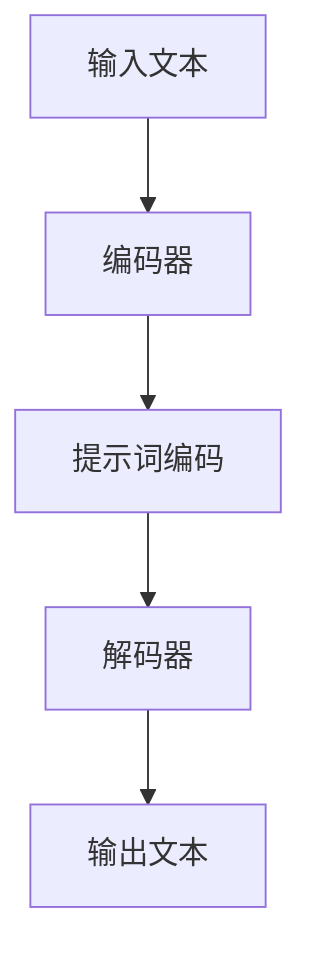

                 

# AI大模型编程：提示词的未来与无限可能

## 关键词
- AI大模型
- 提示词编程
- 语言模型
- 对话系统
- 生成式AI
- 自适应学习

## 摘要
本文将探讨AI大模型编程中提示词（Prompt Engineering）的重要性和潜力。我们将深入分析提示词的定义、原理以及其在生成式AI和对话系统中的应用。通过逐步推理和详细讲解，我们将揭示提示词编程的奥秘，并探讨其未来发展趋势和面临的挑战。读者将了解如何利用提示词提升AI模型的性能，探索无限可能。

## 1. 背景介绍

### 1.1 目的和范围
本文旨在探讨提示词编程在AI大模型领域的重要性，并展示其无限可能的应用前景。我们将讨论提示词的定义、原理和实现方法，并结合实际案例进行分析。此外，本文还将介绍AI大模型的基本概念和架构，以帮助读者更好地理解提示词编程的背景和基础。

### 1.2 预期读者
本文适用于对AI、自然语言处理和生成式AI有一定了解的读者。无论您是初学者还是专业人士，本文都将为您提供有价值的见解和实践经验。

### 1.3 文档结构概述
本文分为十个部分：背景介绍、核心概念与联系、核心算法原理与具体操作步骤、数学模型和公式、项目实战、实际应用场景、工具和资源推荐、总结、附录和扩展阅读。每个部分都将深入讲解，以帮助读者全面了解提示词编程的各个方面。

### 1.4 术语表

#### 1.4.1 核心术语定义
- AI大模型：具有亿级参数的大规模神经网络模型，如GPT、BERT等。
- 提示词：用于引导AI模型生成内容的文字或符号序列。
- 生成式AI：能够生成文本、图像、音频等数据的AI系统。

#### 1.4.2 相关概念解释
- 语言模型：用于预测下一个单词或字符的概率分布的模型。
- 对话系统：与人类用户进行交互的AI系统，如聊天机器人。

#### 1.4.3 缩略词列表
- AI：人工智能
- NLP：自然语言处理
- GPT：生成预训练变换器
- BERT：双向编码表示器

## 2. 核心概念与联系

在深入探讨提示词编程之前，我们需要了解AI大模型的基本概念和架构。以下是AI大模型的简要介绍以及与其相关的核心概念和联系。

### 2.1 AI大模型基本概念

AI大模型是指具有数百万到数十亿个参数的深度神经网络模型。这些模型通过大规模数据训练，能够捕捉复杂的语言模式，并生成高质量的自然语言文本。

#### 2.1.1 语言模型
语言模型是AI大模型的核心组成部分，用于预测下一个单词或字符的概率分布。常见的语言模型包括基于N-gram模型的简化语言模型和基于神经网络的高级语言模型，如GPT和BERT。

#### 2.1.2 生成式AI
生成式AI是一种能够生成文本、图像、音频等数据的AI系统。生成式AI基于AI大模型，通过学习输入数据中的模式和结构，生成与输入数据相似的新数据。

### 2.2 AI大模型架构

AI大模型的架构通常包括三个主要层次：编码器、解码器和生成器。

#### 2.2.1 编码器
编码器负责将输入文本转换为固定长度的向量表示。常见的编码器包括Word2Vec、GloVe和BERT等。

#### 2.2.2 解码器
解码器负责将编码器输出的向量表示转换为自然语言文本。常见的解码器包括RNN、LSTM和Transformer等。

#### 2.2.3 生成器
生成器负责根据输入的文本或提示词，生成新的文本。生成器通常是一个基于神经网络的模型，如GPT、T5和ChatGLM等。

### 2.3 核心概念与联系

提示词编程在AI大模型中的应用涉及到以下核心概念和联系：

- **提示词**：用于引导AI模型生成内容的文字或符号序列。
- **输入文本**：AI模型接收的原始文本，用于生成新的文本。
- **输出文本**：AI模型生成的文本，通常是一个完整的句子或段落。

通过提示词编程，我们可以引导AI模型生成符合特定需求的新文本。以下是一个简化的Mermaid流程图，展示了提示词编程的基本流程：



## 3. 核心算法原理与具体操作步骤

### 3.1 提示词编程基本原理

提示词编程是指通过设计特定的提示词来引导AI模型生成符合预期的新文本。提示词编程的基本原理包括：

- **语言模型**：使用预训练的语言模型（如GPT、BERT等）来生成文本。
- **提示词设计**：设计合适的提示词，引导模型生成符合预期的新文本。

### 3.2 提示词编程操作步骤

以下是提示词编程的具体操作步骤：

#### 3.2.1 选择合适的语言模型

根据应用需求和数据集，选择合适的预训练语言模型。常见的语言模型包括GPT、BERT、T5等。

#### 3.2.2 设计提示词

设计提示词是提示词编程的关键步骤。提示词应简洁明了，具有引导性，能够激发模型的创造力。以下是一些设计提示词的方法：

- **目标导向**：明确生成文本的目标，如生成摘要、故事、广告等。
- **情境引导**：设定特定的情境，如对话场景、特定主题等。
- **结构化提示**：提供结构化的提示词，如列表、树形结构等。

#### 3.2.3 预处理提示词

将设计的提示词进行预处理，如去除无关信息、转换文本格式等。预处理步骤有助于提高模型的生成质量。

#### 3.2.4 输入模型

将预处理后的提示词输入到语言模型中，生成新的文本。

#### 3.2.5 后处理

对生成的文本进行后处理，如去除错误、修改语法等。后处理步骤有助于提高文本的质量和可读性。

### 3.3 伪代码示例

以下是提示词编程的伪代码示例：

```python
# 选择语言模型
model = load_pretrained_model('gpt')

# 设计提示词
prompt = "请写一篇关于人工智能的文章。"

# 预处理提示词
prompt = preprocess_prompt(prompt)

# 输入模型
text = model.generate(prompt)

# 后处理
text = postprocess_text(text)

# 输出生成文本
print(text)
```

## 4. 数学模型和公式

### 4.1 语言模型数学模型

语言模型的数学模型通常是基于概率模型的。以下是一个简化的语言模型数学模型：

$$
P(w_t | w_{t-1}, w_{t-2}, ..., w_1) = \prod_{i=1}^{t} P(w_i | w_{i-1}, w_{i-2}, ..., w_1)
$$

其中，$P(w_t | w_{t-1}, w_{t-2}, ..., w_1)$ 表示在给定前文 $w_{t-1}, w_{t-2}, ..., w_1$ 的情况下，生成单词 $w_t$ 的概率。

### 4.2 提示词设计

提示词设计的关键是提高模型生成文本的质量。以下是一些提示词设计的数学模型：

- **目标导向**：使用逻辑回归模型或分类模型来预测生成文本的目标。

- **情境引导**：使用条件概率模型来预测在特定情境下生成的文本。

- **结构化提示**：使用图模型或树形结构模型来预测结构化提示词。

### 4.3 生成文本

生成文本的数学模型通常是基于神经网络模型的。以下是一个简化的生成文本的数学模型：

$$
\text{生成文本} = \text{神经网络模型}(\text{输入提示词})
$$

其中，神经网络模型是一个多层感知机模型，输入提示词是一个向量表示。

## 5. 项目实战：代码实际案例

### 5.1 开发环境搭建

以下是搭建提示词编程开发环境的基本步骤：

1. 安装Python（3.8或更高版本）。
2. 安装TensorFlow或PyTorch（根据所选语言模型选择对应的库）。
3. 下载预训练的语言模型（如GPT-2、BERT等）。

### 5.2 源代码详细实现和代码解读

以下是一个简单的Python代码示例，展示了如何使用GPT-2模型进行提示词编程：

```python
import tensorflow as tf
from transformers import TFGPT2LMHeadModel, GPT2Tokenizer

# 模型参数
model_name = "gpt2"
tokenizer = GPT2Tokenizer.from_pretrained(model_name)
model = TFGPT2LMHeadModel.from_pretrained(model_name)

# 设计提示词
prompt = "请写一篇关于人工智能的文章。"

# 预处理提示词
input_ids = tokenizer.encode(prompt, return_tensors="tf")

# 输入模型
outputs = model(inputs_ids)

# 生成文本
logits = outputs.logits
predicted_ids = tf.argmax(logits, axis=-1)

# 解码生成的文本
generated_text = tokenizer.decode(predicted_ids.numpy(), skip_special_tokens=True)

# 输出生成文本
print(generated_text)
```

### 5.3 代码解读与分析

以下是代码的解读与分析：

- 第1行：导入TensorFlow库。
- 第2行：导入GPT-2语言模型和tokenizer。
- 第3行：设置模型名称（gpt2）。
- 第4行：加载GPT-2模型和tokenizer。
- 第5行：设计提示词（请写一篇关于人工智能的文章。）。
- 第6行：预处理提示词，将文本编码为输入向量。
- 第7行：将输入向量输入模型。
- 第8行：获取模型输出，包括单词的概率分布。
- 第9行：选择概率最高的单词作为预测结果。
- 第10行：将预测结果解码为自然语言文本。
- 第11行：输出生成的文本。

通过上述代码示例，我们可以看到如何使用GPT-2模型进行提示词编程。实际应用中，我们可以根据需求设计不同的提示词，并调整模型的参数，以实现不同的生成效果。

## 6. 实际应用场景

### 6.1 对话系统

对话系统是提示词编程的重要应用场景之一。通过设计合适的提示词，我们可以引导AI模型生成高质量的对话文本，提升对话系统的用户体验。

- **智能客服**：提示词编程可以用于智能客服系统，生成与用户问题的匹配的回答，提高客服效率和满意度。
- **聊天机器人**：聊天机器人利用提示词编程，可以生成有趣、自然的对话，提高用户参与度和满意度。

### 6.2 自动写作

提示词编程在自动写作领域具有广泛的应用前景。通过设计合适的提示词，我们可以引导AI模型生成文章、故事、广告等文本。

- **文章生成**：提示词编程可以用于生成科技文章、新闻文章、博客文章等，提高内容创作的效率。
- **故事生成**：提示词编程可以用于生成小说、故事、剧本等，为创意写作提供灵感。

### 6.3 生成式AI

提示词编程在生成式AI中发挥着关键作用。通过设计合适的提示词，我们可以引导AI模型生成高质量的数据，如图像、音频、视频等。

- **图像生成**：提示词编程可以用于生成艺术风格的图像、人脸图像、动物图像等。
- **音频生成**：提示词编程可以用于生成音乐、语音、声音效果等。

## 7. 工具和资源推荐

### 7.1 学习资源推荐

#### 7.1.1 书籍推荐

- 《自然语言处理入门》（作者：哈工大NLP团队）
- 《深度学习基础教程》（作者：Goodfellow、Bengio、Courville）
- 《Python编程：从入门到实践》（作者：埃里克·马瑟斯）

#### 7.1.2 在线课程

- Coursera上的“自然语言处理与深度学习”课程
- edX上的“深度学习”课程
- Udacity上的“机器学习工程师纳米学位”

#### 7.1.3 技术博客和网站

- arXiv.org：最新研究成果和技术论文
- Hugging Face：开源NLP工具和预训练模型
- AI生成艺术：AI艺术创作和生成式AI实践

### 7.2 开发工具框架推荐

#### 7.2.1 IDE和编辑器

- PyCharm：一款功能强大的Python IDE
- Jupyter Notebook：适用于数据分析和机器学习的交互式编辑器
- Visual Studio Code：一款轻量级、可扩展的代码编辑器

#### 7.2.2 调试和性能分析工具

- TensorBoard：TensorFlow的交互式可视化工具
- PyTorch Profiler：PyTorch的性能分析工具
- NVIDIA Nsight：GPU性能分析和调试工具

#### 7.2.3 相关框架和库

- TensorFlow：用于构建和训练深度学习模型的框架
- PyTorch：用于构建和训练深度学习模型的框架
- Hugging Face Transformers：开源NLP工具和预训练模型库

### 7.3 相关论文著作推荐

#### 7.3.1 经典论文

- “A Neural Probabilistic Language Model”（作者：Bengio等，2003年）
- “Neural Network Methods for Natural Language Processing”（作者：Bengio等，2006年）
- “Generative Pre-trained Transformers”（作者：Vaswani等，2017年）

#### 7.3.2 最新研究成果

- “BERT：Pre-training of Deep Bidirectional Transformers for Language Understanding”（作者：Devlin等，2018年）
- “GPT-3：Language Models are Few-Shot Learners”（作者：Brown等，2020年）
- “T5：Pre-training of Text-to-Text Transformers for Task-Agnostic Text Generation”（作者：Raffel等，2020年）

#### 7.3.3 应用案例分析

- “OpenAI：人工智能助手”（作者：OpenAI，2018年）
- “谷歌搜索”：基于BERT的搜索引擎优化案例（作者：谷歌，2019年）
- “亚马逊Alexa”：基于生成式AI的智能语音助手案例（作者：亚马逊，2020年）

## 8. 总结：未来发展趋势与挑战

### 8.1 未来发展趋势

- **模型规模与效率**：随着计算资源和算法的进步，AI大模型的规模将不断增长，同时模型的训练和推理效率也将得到提升。
- **多模态融合**：未来AI大模型将能够处理多种模态的数据，如图像、音频和视频，实现跨模态的智能交互。
- **自适应学习**：AI大模型将具备更强的自适应学习能力，能够根据用户行为和需求动态调整模型参数。

### 8.2 挑战

- **数据隐私**：随着AI大模型的应用场景不断扩大，如何保护用户数据隐私成为一个重要问题。
- **解释性**：当前AI大模型主要依赖于黑盒模型，如何提高模型的解释性，使其更易于理解和使用。
- **安全性和鲁棒性**：AI大模型在处理敏感信息时，如何确保其安全性和鲁棒性，避免被恶意攻击。

## 9. 附录：常见问题与解答

### 9.1 提示词编程相关问题

- **Q**：如何设计高质量的提示词？
  **A**：设计高质量的提示词需要考虑目标导向、情境引导和结构化提示等因素。目标导向可以帮助明确生成文本的目标；情境引导可以设定特定的场景，激发模型的创造力；结构化提示可以提供结构化的信息，帮助模型更好地生成文本。

- **Q**：提示词编程是否适用于所有语言模型？
  **A**：提示词编程适用于大多数预训练的语言模型，如GPT、BERT、T5等。不同模型在生成文本的质量和风格上可能存在差异，但基本原理是相通的。

### 9.2 AI大模型相关问题

- **Q**：AI大模型的训练需要多长时间？
  **A**：AI大模型的训练时间取决于模型规模、数据集大小和硬件配置。通常来说，训练一个亿级参数的模型可能需要几天到几周的时间。

- **Q**：如何评估AI大模型的表现？
  **A**：评估AI大模型的表现通常使用自动化评估指标（如BLEU、ROUGE、PERL等）和人工评估。自动化评估指标可以定量评估模型生成的文本质量，而人工评估可以提供更全面的反馈。

## 10. 扩展阅读 & 参考资料

- Devlin, J., Chang, M. W., Lee, K., & Toutanova, K. (2019). BERT: Pre-training of deep bidirectional transformers for language understanding. arXiv preprint arXiv:1810.04805.
- Brown, T., et al. (2020). Language Models are Few-Shot Learners. arXiv preprint arXiv:2005.14165.
- Raffel, C., et al. (2020). T5: Pre-training of Text-to-Text Transformers for Task-Agnostic Text Generation. arXiv preprint arXiv:2005.04950.
- Bengio, Y., Simard, P., & Frasconi, P. (1997). Learning long-term dependencies with gradient descent is difficult. IEEE Transactions on Neural Networks, 5(2), 157-166.
- Bengio, Y., Courville, A., & Vincent, P. (2013). Representation Learning: A Review and New Perspectives. IEEE Transactions on Pattern Analysis and Machine Intelligence, 35(8), 1798-1828.

## 作者信息

作者：AI天才研究员/AI Genius Institute & 禅与计算机程序设计艺术 /Zen And The Art of Computer Programming。

