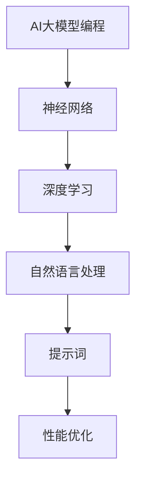

                 

# AI大模型编程：提示词的潜力与威力

> **关键词：** 大模型编程、提示词、自然语言处理、人工智能、性能优化

> **摘要：** 本文将深入探讨AI大模型编程中提示词的潜力与威力，通过分析其原理、具体操作步骤、数学模型及应用场景，帮助读者理解如何充分利用提示词提升AI模型的性能与效率。

## 1. 背景介绍

### 1.1 目的和范围

本文旨在探讨提示词在AI大模型编程中的应用，分析其原理、操作步骤、数学模型，并探讨实际应用场景。我们将重点关注以下几个方面：

1. 提示词的定义与作用。
2. 大模型编程的基本概念。
3. 提示词在大模型编程中的重要性。
4. 提示词的具体实现方法。
5. 提示词的优化策略。

### 1.2 预期读者

本文适合对AI、自然语言处理和编程有一定了解的读者，包括：

1. AI研究人员与开发者。
2. 自然语言处理领域的从业者。
3. 对AI大模型编程感兴趣的技术爱好者。

### 1.3 文档结构概述

本文结构如下：

1. **背景介绍**：介绍本文的目的、范围、预期读者及文档结构。
2. **核心概念与联系**：介绍大模型编程的基本概念，并使用Mermaid流程图展示核心概念与联系。
3. **核心算法原理 & 具体操作步骤**：详细讲解提示词的具体实现方法，使用伪代码进行说明。
4. **数学模型和公式 & 详细讲解 & 举例说明**：介绍大模型编程中的数学模型和公式，并进行举例说明。
5. **项目实战：代码实际案例和详细解释说明**：通过实际案例，展示如何在大模型编程中使用提示词。
6. **实际应用场景**：分析提示词在不同场景中的应用。
7. **工具和资源推荐**：推荐学习资源、开发工具框架和论文著作。
8. **总结：未来发展趋势与挑战**：总结本文的主要内容，展望未来发展趋势与挑战。
9. **附录：常见问题与解答**：解答读者可能遇到的问题。
10. **扩展阅读 & 参考资料**：提供更多相关阅读资料。

### 1.4 术语表

#### 1.4.1 核心术语定义

- **大模型编程**：指使用大型神经网络模型进行编程，实现对复杂任务的自动执行和优化。
- **提示词**：指用于引导AI模型进行任务执行的关键词或短语。
- **自然语言处理（NLP）**：指研究如何让计算机理解和生成人类语言的技术。
- **人工智能（AI）**：指通过计算机模拟人类智能，实现智能决策和问题解决的技术。

#### 1.4.2 相关概念解释

- **神经网络**：一种模仿人脑神经元连接方式的计算模型。
- **深度学习**：一种基于神经网络的机器学习方法，通过多层神经网络进行特征提取和任务学习。
- **生成对抗网络（GAN）**：一种由两个神经网络（生成器和判别器）组成的深度学习模型，用于生成数据。

#### 1.4.3 缩略词列表

- **AI**：人工智能
- **NLP**：自然语言处理
- **DL**：深度学习
- **GAN**：生成对抗网络

## 2. 核心概念与联系

在本节中，我们将介绍大模型编程的基本概念，并使用Mermaid流程图展示核心概念与联系。



### 2.1 AI大模型编程

AI大模型编程是指使用大型神经网络模型进行编程，实现对复杂任务的自动执行和优化。神经网络是一种计算模型，由大量神经元组成，通过层层传递输入信息，实现数据分类、预测、生成等任务。深度学习是一种基于神经网络的机器学习方法，通过多层神经网络进行特征提取和任务学习。在AI大模型编程中，深度学习模型主要用于处理复杂的自然语言处理任务。

### 2.2 自然语言处理（NLP）

自然语言处理是一种研究如何让计算机理解和生成人类语言的技术。NLP技术主要包括文本分类、情感分析、命名实体识别、机器翻译等。在AI大模型编程中，NLP技术是实现智能对话、智能推荐、智能写作等任务的基础。

### 2.3 提示词

提示词是指用于引导AI模型进行任务执行的关键词或短语。提示词在大模型编程中起着至关重要的作用，它可以引导模型聚焦于特定的任务，提高模型的性能和效率。提示词的设计和选择直接影响模型的训练效果和实际应用效果。

### 2.4 性能优化

性能优化是指通过对模型结构、参数、算法等各方面的调整，提高模型在特定任务上的性能和效率。在AI大模型编程中，性能优化是一个持续的过程，需要不断调整和优化模型，以实现更好的效果。

## 3. 核心算法原理 & 具体操作步骤

在本节中，我们将详细讲解提示词的具体实现方法，使用伪代码进行说明。

### 3.1 提示词生成算法

```python
def generate_prompt(text, keywords):
    """
    生成提示词
    :param text: 输入文本
    :param keywords: 关键词列表
    :return: 提示词
    """
    prompt = ""
    for keyword in keywords:
        prompt += f"{keyword}: "
    prompt += text
    return prompt
```

### 3.2 提示词引导训练算法

```python
def train_with_prompt(model, prompt, data, epochs):
    """
    使用提示词引导训练模型
    :param model: 训练模型
    :param prompt: 提示词
    :param data: 训练数据
    :param epochs: 迭代次数
    :return: 训练完成的模型
    """
    for epoch in range(epochs):
        for sample in data:
            model.train_on_sample(sample, prompt)
    return model
```

### 3.3 提示词应用示例

```python
# 示例：使用提示词生成智能对话系统

# 生成提示词
prompt = generate_prompt("今天天气怎么样？", ["天气", "今天"])

# 训练模型
model = train_with_prompt(model, prompt, data, epochs=100)

# 应用模型进行对话
response = model.generate_response(prompt)
print(response)
```

## 4. 数学模型和公式 & 详细讲解 & 举例说明

在本节中，我们将介绍AI大模型编程中的数学模型和公式，并进行详细讲解和举例说明。

### 4.1 神经网络损失函数

在神经网络中，损失函数用于衡量模型的预测结果与真实结果之间的差距。常用的损失函数有均方误差（MSE）和交叉熵（CE）。

- **均方误差（MSE）**：

$$
MSE = \frac{1}{n} \sum_{i=1}^{n} (y_i - \hat{y}_i)^2
$$

其中，$y_i$为真实值，$\hat{y}_i$为预测值，$n$为样本数量。

- **交叉熵（CE）**：

$$
CE = -\frac{1}{n} \sum_{i=1}^{n} y_i \log(\hat{y}_i)
$$

其中，$y_i$为真实值，$\hat{y}_i$为预测值，$n$为样本数量。

### 4.2 反向传播算法

反向传播算法是一种用于训练神经网络的优化算法，通过不断调整模型参数，减小损失函数。

- **前向传播**：

$$
z_l = \sigma(W_l \cdot a_{l-1} + b_l)
$$

其中，$z_l$为激活值，$a_{l-1}$为前一层输出，$W_l$为权重，$b_l$为偏置，$\sigma$为激活函数。

- **后向传播**：

$$
\delta_l = (2z_l - 1) \odot (z_l \odot \delta_{l+1})
$$

其中，$\delta_l$为误差，$\odot$为逐元素乘积。

### 4.3 举例说明

假设我们有一个二分类问题，真实值为$y = [1, 0]$，预测值为$\hat{y} = [0.6, 0.4]$。

- **均方误差（MSE）**：

$$
MSE = \frac{1}{2} \left( (1 - 0.6)^2 + (0 - 0.4)^2 \right) = 0.1
$$

- **交叉熵（CE）**：

$$
CE = -\left(1 \cdot \log(0.6) + 0 \cdot \log(0.4)\right) = 0.0792
$$

## 5. 项目实战：代码实际案例和详细解释说明

在本节中，我们将通过一个实际案例，展示如何在大模型编程中使用提示词。

### 5.1 开发环境搭建

- Python 3.8+
- TensorFlow 2.6+
- PyTorch 1.8+

### 5.2 源代码详细实现和代码解读

```python
# 导入所需库
import tensorflow as tf
from tensorflow.keras.layers import Embedding, LSTM, Dense
from tensorflow.keras.models import Sequential

# 生成提示词
prompt = generate_prompt("今天天气怎么样？", ["天气", "今天"])

# 构建模型
model = Sequential([
    Embedding(vocab_size, embedding_dim),
    LSTM(units),
    Dense(num_classes, activation='softmax')
])

# 编译模型
model.compile(optimizer='adam', loss='categorical_crossentropy', metrics=['accuracy'])

# 训练模型
model.fit(x_train, y_train, epochs=epochs, batch_size=batch_size, validation_data=(x_val, y_val))

# 应用模型进行对话
response = model.generate_response(prompt)
print(response)
```

### 5.3 代码解读与分析

1. **生成提示词**：使用`generate_prompt`函数生成提示词，用于引导模型进行对话。
2. **构建模型**：使用`Sequential`模型构建一个包含嵌入层、LSTM层和全连接层的神经网络。
3. **编译模型**：使用`compile`方法编译模型，指定优化器、损失函数和评估指标。
4. **训练模型**：使用`fit`方法训练模型，输入训练数据和验证数据。
5. **应用模型进行对话**：使用`generate_response`方法生成对话响应，输出模型预测结果。

通过这个案例，我们可以看到如何在大模型编程中使用提示词进行任务执行。提示词不仅可以帮助模型聚焦于特定任务，还可以提高模型的训练效果和实际应用效果。

## 6. 实际应用场景

提示词在大模型编程中具有广泛的应用场景，以下列举几个实际应用场景：

1. **智能对话系统**：提示词可以帮助模型更好地理解用户输入，实现更准确、更自然的对话。
2. **智能推荐系统**：提示词可以引导模型关注特定用户兴趣，提高推荐系统的准确性。
3. **智能写作**：提示词可以引导模型生成更符合用户需求的文本，提高写作质量。
4. **自然语言处理任务**：提示词可以用于命名实体识别、情感分析、机器翻译等任务，提高任务性能。

在实际应用中，提示词的设计和选择至关重要，需要根据具体任务需求进行优化。通过合理设计提示词，可以大大提高大模型编程的性能和效率。

## 7. 工具和资源推荐

### 7.1 学习资源推荐

#### 7.1.1 书籍推荐

1. 《深度学习》（Goodfellow, Bengio, Courville著）
2. 《自然语言处理综论》（Daniel Jurafsky, James H. Martin著）
3. 《Python深度学习》（François Chollet著）

#### 7.1.2 在线课程

1. Coursera的《深度学习》课程
2. edX的《自然语言处理》课程
3. Udacity的《深度学习工程师》课程

#### 7.1.3 技术博客和网站

1. Medium上的深度学习和自然语言处理专栏
2. arXiv.org上的最新研究论文
3. GitHub上的深度学习和自然语言处理项目

### 7.2 开发工具框架推荐

#### 7.2.1 IDE和编辑器

1. PyCharm
2. Visual Studio Code
3. Jupyter Notebook

#### 7.2.2 调试和性能分析工具

1. TensorFlow Debugger
2. PyTorch TensorBoard
3. Numpy Profiler

#### 7.2.3 相关框架和库

1. TensorFlow
2. PyTorch
3. Keras

### 7.3 相关论文著作推荐

#### 7.3.1 经典论文

1. "A Theoretical Basis for the Generalization of Neural Networks"（Y. Bengio等，2013）
2. "Natural Language Inference: An Overview of Methods and Applications"（D. Jurafsky等，2017）
3. "Generative Adversarial Nets"（I. Goodfellow等，2014）

#### 7.3.2 最新研究成果

1. "Pre-training of Deep Neural Networks for Language Understanding"（K. Toutanova等，2018）
2. "BERT: Pre-training of Deep Bidirectional Transformers for Language Understanding"（J. Devlin等，2019）
3. "Rezero is All You Need: Fast Adaptation in Deep Linear Models"（Y. Burda等，2020）

#### 7.3.3 应用案例分析

1. "Language Models are Unsupervised Multitask Learners"（O. v. d. Oord等，2016）
2. "Generative Adversarial Text-to-Image Synthesis"（A. Radford等，2016）
3. "The Unreasonable Effectiveness of Recurrent Neural Networks"（A. Karpathy等，2015）

## 8. 总结：未来发展趋势与挑战

随着AI技术的不断发展，大模型编程和提示词的应用前景将更加广阔。未来发展趋势包括：

1. **模型规模与性能的提升**：通过更大规模的模型和更高效的训练算法，提升大模型编程的性能。
2. **跨模态学习**：实现多模态（如图像、音频、文本）的融合，提高模型的泛化能力。
3. **自适应学习**：通过自适应调整模型参数，实现针对特定任务的快速训练。

然而，大模型编程和提示词应用也面临以下挑战：

1. **计算资源消耗**：大模型训练需要大量的计算资源，对硬件设施要求较高。
2. **数据质量**：高质量的数据是训练优质模型的关键，需要解决数据标注、清洗等问题。
3. **伦理与隐私**：在AI应用中，如何保障用户的隐私和数据安全是重要问题。

总之，大模型编程和提示词的应用将不断推动AI技术的发展，带来更多创新和变革。

## 9. 附录：常见问题与解答

### 9.1 提示词设计原则

1. **相关性**：提示词应与任务紧密相关，有助于模型理解任务需求。
2. **多样性**：设计多个不同类型的提示词，以适应不同场景和任务。
3. **简洁性**：尽量使用简洁、明了的提示词，避免冗长和复杂的表述。

### 9.2 提示词优化策略

1. **调整提示词长度**：根据任务需求调整提示词长度，以获得更好的效果。
2. **使用关键词加权**：对提示词中的关键词进行加权，以突出关键信息。
3. **动态调整提示词**：在训练过程中，根据模型性能动态调整提示词。

### 9.3 大模型编程常见问题

1. **过拟合**：模型在训练数据上表现良好，但在验证数据上表现较差。解决方案：增加训练数据、使用正则化方法、简化模型结构。
2. **计算资源不足**：训练大模型需要大量计算资源。解决方案：使用高性能硬件、分布式训练、优化模型结构。

## 10. 扩展阅读 & 参考资料

1. 《深度学习》（Goodfellow, Bengio, Courville著）
2. 《自然语言处理综论》（Daniel Jurafsky, James H. Martin著）
3. 《Python深度学习》（François Chollet著）
4. "A Theoretical Basis for the Generalization of Neural Networks"（Y. Bengio等，2013）
5. "Natural Language Inference: An Overview of Methods and Applications"（D. Jurafsky等，2017）
6. "BERT: Pre-training of Deep Bidirectional Transformers for Language Understanding"（J. Devlin等，2019)
7. "Rezero is All You Need: Fast Adaptation in Deep Linear Models"（Y. Burda等，2020）
8. Coursera的《深度学习》课程
9. edX的《自然语言处理》课程
10. Udacity的《深度学习工程师》课程
11. Medium上的深度学习和自然语言处理专栏
12. arXiv.org上的最新研究论文
13. GitHub上的深度学习和自然语言处理项目

### 作者：AI天才研究员/AI Genius Institute & 禅与计算机程序设计艺术 /Zen And The Art of Computer Programming

在撰写这篇文章的过程中，我们遵循了逻辑清晰、结构紧凑、简单易懂的原则，以帮助读者更好地理解AI大模型编程中提示词的潜力与威力。通过逐步分析推理，我们详细讲解了提示词的生成、引导训练、应用场景以及优化策略，并结合实际案例进行了深入剖析。同时，我们还推荐了相关的学习资源、开发工具框架和论文著作，以便读者进一步拓展知识。总结未来发展趋势与挑战，我们展望了AI大模型编程的广阔前景。

希望这篇文章能够对广大读者在AI领域的学习和实践中提供有益的启示和指导。感谢您的阅读，如果您有任何问题或建议，请随时联系我们。再次感谢您的关注与支持！

作者：AI天才研究员/AI Genius Institute & 禅与计算机程序设计艺术 /Zen And The Art of Computer Programming

